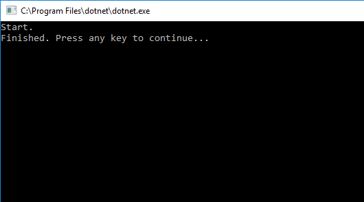

# How to bulk insert data to SQL Server database in .NET Core
## Requires
- Visual Studio 2017
## License
- Apache License, Version 2.0
## Technologies
- SQL Server
- .NET
- Database
- .NET Core
## Topics
- SQL Server
- Database
- .NET Core
- Bulk Insert
- Bulk Copy
## Updated
- 03/23/2017
## Description

&nbsp;How
to
bulk insert data to SQL Server database in .NET Core

Introduction

This sample demonstrates how to bulk insert data to SQL Server database in .NET Core.

&nbsp;

Sample prerequisites

&bull;&nbsp;Visual Studio 2017 or above [<a href="https://www.visualstudio.com/" style="text-decoration:none">Visual
 Studio Home Page</a>]

&bull;&nbsp;SQL Server 2014

&bull;&nbsp;Create database and table

SQL

Edit|Remove

mysql

<pre class="mysql">CREATE&nbsp;DATABASE&nbsp;BulkInsertTestDB&nbsp;
GO&nbsp;
USE&nbsp;BulkInsertTestDB&nbsp;
GO&nbsp;
CREATE&nbsp;TABLE&nbsp;Student(&nbsp;
ID&nbsp;int&nbsp;identity&nbsp;primary&nbsp;key,&nbsp;
Name&nbsp;nvarchar(50),&nbsp;
Age&nbsp;int&nbsp;
)&nbsp;
GO</pre>

Building the sample

&bull;&nbsp;Open the sample solution &ldquo;CSNETCoreBulkInsert.sln&rdquo; using Visual Studio

&bull;&nbsp;Right click the project &ldquo;CSNETCoreBulkInsert&rdquo; and select Restore Packages

&bull;&nbsp;Update the connection string in the
Main function

C#

Edit|Remove

csharp

<pre class="csharp">BulkCopyHelper&nbsp;helper&nbsp;=&nbsp;new&nbsp;BulkCopyHelper(&quot;Server=.;Database=&nbsp;BulkInsertTestDB;Trusted_Connection=True;&quot;);</pre>

&bull;&nbsp;Press
F6 Key or select
Build -&gt; Build Solution from the menu to build the sample.

Running the sample

&bull;&nbsp;Open the sample solution using Visual Studio, then press F5 Key or select Debug -&gt; Start
 Debugging from the menu.

&nbsp;

 

&bull;&nbsp;Go to sql server client, and run script:

SQL

Edit|Remove

mysql

<pre class="mysql">SELECT&nbsp;[ID]&nbsp;
,[Name]&nbsp;
,[Age]&nbsp;
FROM&nbsp;[dbo].[Student]</pre>

&bull;&nbsp;You will see that student data has been inserted into database.

&nbsp;

Using the code

CSNETCoreBulkInsert.cs:

C#

Edit|Remove

csharp

<pre class="csharp">public&nbsp;class&nbsp;StudentDbDataReader&nbsp;:&nbsp;DbDataReader&nbsp;
{&nbsp;
&nbsp;
&nbsp;&nbsp;&nbsp;&nbsp;private&nbsp;List&lt;Student&gt;&nbsp;Students;&nbsp;
&nbsp;&nbsp;&nbsp;&nbsp;private&nbsp;List&lt;Student&gt;.Enumerator&nbsp;_enumerator;&nbsp;
&nbsp;&nbsp;&nbsp;&nbsp;protected&nbsp;List&lt;string&gt;&nbsp;Fields;&nbsp;
&nbsp;&nbsp;&nbsp;&nbsp;protected&nbsp;List&lt;Type&gt;&nbsp;FieldTypes;&nbsp;
&nbsp;&nbsp;&nbsp;&nbsp;protected&nbsp;bool&nbsp;isClosed;&nbsp;
&nbsp;&nbsp;&nbsp;&nbsp;private&nbsp;Student&nbsp;_current;&nbsp;
&nbsp;
&nbsp;&nbsp;&nbsp;&nbsp;public&nbsp;StudentDbDataReader(List&lt;Student&gt;&nbsp;&nbsp;list)&nbsp;
&nbsp;&nbsp;&nbsp;&nbsp;{&nbsp;
&nbsp;&nbsp;&nbsp;&nbsp;&nbsp;&nbsp;&nbsp;&nbsp;Students&nbsp;=&nbsp;list;&nbsp;
&nbsp;&nbsp;&nbsp;&nbsp;&nbsp;&nbsp;&nbsp;&nbsp;_enumerator&nbsp;=&nbsp;list.GetEnumerator();&nbsp;
&nbsp;&nbsp;&nbsp;&nbsp;&nbsp;&nbsp;&nbsp;&nbsp;IEnumerable&lt;PropertyInfo&gt;&nbsp;listProperty&nbsp;=&nbsp;typeof(Student).GetRuntimeProperties();&nbsp;
&nbsp;&nbsp;&nbsp;&nbsp;&nbsp;&nbsp;&nbsp;&nbsp;Fields&nbsp;=&nbsp;new&nbsp;List&lt;string&gt;();&nbsp;
&nbsp;&nbsp;&nbsp;&nbsp;&nbsp;&nbsp;&nbsp;&nbsp;FieldTypes&nbsp;=&nbsp;new&nbsp;List&lt;Type&gt;();&nbsp;
&nbsp;&nbsp;&nbsp;&nbsp;&nbsp;&nbsp;&nbsp;&nbsp;foreach&nbsp;(PropertyInfo&nbsp;p&nbsp;in&nbsp;listProperty)&nbsp;
&nbsp;&nbsp;&nbsp;&nbsp;&nbsp;&nbsp;&nbsp;&nbsp;{&nbsp;
&nbsp;&nbsp;&nbsp;&nbsp;&nbsp;&nbsp;&nbsp;&nbsp;&nbsp;&nbsp;&nbsp;&nbsp;Fields.Add(p.Name);&nbsp;
&nbsp;&nbsp;&nbsp;&nbsp;&nbsp;&nbsp;&nbsp;&nbsp;&nbsp;&nbsp;&nbsp;&nbsp;FieldTypes.Add(p.PropertyType);&nbsp;
&nbsp;&nbsp;&nbsp;&nbsp;&nbsp;&nbsp;&nbsp;&nbsp;}&nbsp;
&nbsp;&nbsp;&nbsp;&nbsp;}&nbsp;
&nbsp;
&nbsp;&nbsp;&nbsp;&nbsp;public&nbsp;override&nbsp;object&nbsp;this[int&nbsp;ordinal]&nbsp;=&gt;&nbsp;GetValue(ordinal);&nbsp;
&nbsp;
&nbsp;&nbsp;&nbsp;&nbsp;public&nbsp;override&nbsp;object&nbsp;this[string&nbsp;name]&nbsp;=&gt;&nbsp;GetValue(GetOrdinal(name));&nbsp;
&nbsp;
&nbsp;&nbsp;&nbsp;&nbsp;public&nbsp;override&nbsp;int&nbsp;Depth&nbsp;=&gt;&nbsp;throw&nbsp;new&nbsp;NotImplementedException();&nbsp;
&nbsp;
&nbsp;&nbsp;&nbsp;&nbsp;public&nbsp;override&nbsp;int&nbsp;FieldCount&nbsp;=&gt;&nbsp;Fields.Count;&nbsp;
&nbsp;
&nbsp;&nbsp;&nbsp;&nbsp;public&nbsp;override&nbsp;bool&nbsp;HasRows&nbsp;=&gt;&nbsp;Students.Count&gt;0;&nbsp;
&nbsp;
&nbsp;&nbsp;&nbsp;&nbsp;public&nbsp;override&nbsp;bool&nbsp;IsClosed&nbsp;=&gt;&nbsp;isClosed;&nbsp;
&nbsp;
&nbsp;&nbsp;&nbsp;&nbsp;public&nbsp;override&nbsp;int&nbsp;RecordsAffected&nbsp;=&gt;&nbsp;-1;&nbsp;
&nbsp;
&nbsp;&nbsp;&nbsp;&nbsp;public&nbsp;override&nbsp;bool&nbsp;GetBoolean(int&nbsp;ordinal)&nbsp;
&nbsp;&nbsp;&nbsp;&nbsp;{&nbsp;
&nbsp;&nbsp;&nbsp;&nbsp;&nbsp;&nbsp;&nbsp;&nbsp;return&nbsp;(bool)GetValue(ordinal);&nbsp;
&nbsp;&nbsp;&nbsp;&nbsp;}&nbsp;
&nbsp;
&nbsp;&nbsp;&nbsp;&nbsp;public&nbsp;override&nbsp;byte&nbsp;GetByte(int&nbsp;ordinal)&nbsp;
&nbsp;&nbsp;&nbsp;&nbsp;{&nbsp;
&nbsp;&nbsp;&nbsp;&nbsp;&nbsp;&nbsp;&nbsp;&nbsp;return&nbsp;(byte)GetValue(ordinal);&nbsp;
&nbsp;&nbsp;&nbsp;&nbsp;}&nbsp;
&nbsp;
&nbsp;&nbsp;&nbsp;&nbsp;public&nbsp;override&nbsp;long&nbsp;GetBytes(int&nbsp;ordinal,&nbsp;long&nbsp;dataOffset,&nbsp;byte[]&nbsp;buffer,&nbsp;int&nbsp;bufferOffset,&nbsp;int&nbsp;length)&nbsp;
&nbsp;&nbsp;&nbsp;&nbsp;{&nbsp;
&nbsp;&nbsp;&nbsp;&nbsp;&nbsp;&nbsp;&nbsp;&nbsp;throw&nbsp;new&nbsp;NotImplementedException();&nbsp;
&nbsp;&nbsp;&nbsp;&nbsp;}&nbsp;
&nbsp;
&nbsp;&nbsp;&nbsp;&nbsp;public&nbsp;override&nbsp;char&nbsp;GetChar(int&nbsp;ordinal)&nbsp;
&nbsp;&nbsp;&nbsp;&nbsp;{&nbsp;
&nbsp;&nbsp;&nbsp;&nbsp;&nbsp;&nbsp;&nbsp;&nbsp;return&nbsp;(char)GetValue(ordinal);&nbsp;
&nbsp;&nbsp;&nbsp;&nbsp;}&nbsp;
&nbsp;
&nbsp;&nbsp;&nbsp;&nbsp;public&nbsp;override&nbsp;long&nbsp;GetChars(int&nbsp;ordinal,&nbsp;long&nbsp;dataOffset,&nbsp;char[]&nbsp;buffer,&nbsp;int&nbsp;bufferOffset,&nbsp;int&nbsp;length)&nbsp;
&nbsp;&nbsp;&nbsp;&nbsp;{&nbsp;
&nbsp;&nbsp;&nbsp;&nbsp;&nbsp;&nbsp;&nbsp;&nbsp;throw&nbsp;new&nbsp;NotImplementedException();&nbsp;
&nbsp;&nbsp;&nbsp;&nbsp;}&nbsp;
&nbsp;
&nbsp;&nbsp;&nbsp;&nbsp;public&nbsp;override&nbsp;string&nbsp;GetDataTypeName(int&nbsp;ordinal)&nbsp;
&nbsp;&nbsp;&nbsp;&nbsp;{&nbsp;
&nbsp;&nbsp;&nbsp;&nbsp;&nbsp;&nbsp;&nbsp;&nbsp;return&nbsp;GetFieldType(ordinal).Name;&nbsp;
&nbsp;&nbsp;&nbsp;&nbsp;}&nbsp;
&nbsp;
&nbsp;&nbsp;&nbsp;&nbsp;public&nbsp;override&nbsp;DateTime&nbsp;GetDateTime(int&nbsp;ordinal)&nbsp;
&nbsp;&nbsp;&nbsp;&nbsp;{&nbsp;
&nbsp;&nbsp;&nbsp;&nbsp;&nbsp;&nbsp;&nbsp;&nbsp;return&nbsp;(DateTime)GetValue(ordinal);&nbsp;
&nbsp;&nbsp;&nbsp;&nbsp;}&nbsp;
&nbsp;
&nbsp;&nbsp;&nbsp;&nbsp;public&nbsp;override&nbsp;decimal&nbsp;GetDecimal(int&nbsp;ordinal)&nbsp;
&nbsp;&nbsp;&nbsp;&nbsp;{&nbsp;
&nbsp;&nbsp;&nbsp;&nbsp;&nbsp;&nbsp;&nbsp;&nbsp;return&nbsp;(decimal)GetValue(ordinal);&nbsp;
&nbsp;&nbsp;&nbsp;&nbsp;}&nbsp;
&nbsp;
&nbsp;&nbsp;&nbsp;&nbsp;public&nbsp;override&nbsp;double&nbsp;GetDouble(int&nbsp;ordinal)&nbsp;
&nbsp;&nbsp;&nbsp;&nbsp;{&nbsp;
&nbsp;&nbsp;&nbsp;&nbsp;&nbsp;&nbsp;&nbsp;&nbsp;return&nbsp;(double)GetValue(ordinal);&nbsp;
&nbsp;&nbsp;&nbsp;&nbsp;}&nbsp;
&nbsp;
&nbsp;&nbsp;&nbsp;&nbsp;public&nbsp;override&nbsp;IEnumerator&nbsp;GetEnumerator()&nbsp;
&nbsp;&nbsp;&nbsp;&nbsp;{&nbsp;
&nbsp;&nbsp;&nbsp;&nbsp;&nbsp;&nbsp;&nbsp;&nbsp;return&nbsp;Students.GetEnumerator();&nbsp;
&nbsp;&nbsp;&nbsp;&nbsp;}&nbsp;
&nbsp;
&nbsp;&nbsp;&nbsp;&nbsp;public&nbsp;override&nbsp;Type&nbsp;GetFieldType(int&nbsp;ordinal)&nbsp;
&nbsp;&nbsp;&nbsp;&nbsp;{&nbsp;
&nbsp;&nbsp;&nbsp;&nbsp;&nbsp;&nbsp;&nbsp;&nbsp;return&nbsp;FieldTypes[ordinal];&nbsp;
&nbsp;&nbsp;&nbsp;&nbsp;}&nbsp;
&nbsp;
&nbsp;&nbsp;&nbsp;&nbsp;public&nbsp;override&nbsp;float&nbsp;GetFloat(int&nbsp;ordinal)&nbsp;
&nbsp;&nbsp;&nbsp;&nbsp;{&nbsp;
&nbsp;&nbsp;&nbsp;&nbsp;&nbsp;&nbsp;&nbsp;&nbsp;return&nbsp;(float)GetValue(ordinal);&nbsp;
&nbsp;&nbsp;&nbsp;&nbsp;}&nbsp;
&nbsp;
&nbsp;&nbsp;&nbsp;&nbsp;public&nbsp;override&nbsp;Guid&nbsp;GetGuid(int&nbsp;ordinal)&nbsp;
&nbsp;&nbsp;&nbsp;&nbsp;{&nbsp;
&nbsp;&nbsp;&nbsp;&nbsp;&nbsp;&nbsp;&nbsp;&nbsp;return&nbsp;(Guid)GetValue(ordinal);&nbsp;
&nbsp;&nbsp;&nbsp;&nbsp;}&nbsp;
&nbsp;
&nbsp;&nbsp;&nbsp;&nbsp;public&nbsp;override&nbsp;short&nbsp;GetInt16(int&nbsp;ordinal)&nbsp;
&nbsp;&nbsp;&nbsp;&nbsp;{&nbsp;
&nbsp;&nbsp;&nbsp;&nbsp;&nbsp;&nbsp;&nbsp;&nbsp;return&nbsp;(short)GetValue(ordinal);&nbsp;
&nbsp;&nbsp;&nbsp;&nbsp;}&nbsp;
&nbsp;
&nbsp;&nbsp;&nbsp;&nbsp;public&nbsp;override&nbsp;int&nbsp;GetInt32(int&nbsp;ordinal)&nbsp;
&nbsp;&nbsp;&nbsp;&nbsp;{&nbsp;
&nbsp;&nbsp;&nbsp;&nbsp;&nbsp;&nbsp;&nbsp;&nbsp;return&nbsp;(int)GetValue(ordinal);&nbsp;
&nbsp;&nbsp;&nbsp;&nbsp;}&nbsp;
&nbsp;
&nbsp;&nbsp;&nbsp;&nbsp;public&nbsp;override&nbsp;long&nbsp;GetInt64(int&nbsp;ordinal)&nbsp;
&nbsp;&nbsp;&nbsp;&nbsp;{&nbsp;
&nbsp;&nbsp;&nbsp;&nbsp;&nbsp;&nbsp;&nbsp;&nbsp;return&nbsp;(long)GetValue(ordinal);&nbsp;
&nbsp;&nbsp;&nbsp;&nbsp;}&nbsp;
&nbsp;
&nbsp;&nbsp;&nbsp;&nbsp;public&nbsp;override&nbsp;string&nbsp;GetName(int&nbsp;ordinal)&nbsp;
&nbsp;&nbsp;&nbsp;&nbsp;{&nbsp;
&nbsp;&nbsp;&nbsp;&nbsp;&nbsp;&nbsp;&nbsp;&nbsp;return&nbsp;Fields[ordinal];&nbsp;
&nbsp;&nbsp;&nbsp;&nbsp;}&nbsp;
&nbsp;
&nbsp;&nbsp;&nbsp;&nbsp;public&nbsp;override&nbsp;int&nbsp;GetOrdinal(string&nbsp;name)&nbsp;
&nbsp;&nbsp;&nbsp;&nbsp;{&nbsp;
&nbsp;&nbsp;&nbsp;&nbsp;&nbsp;&nbsp;&nbsp;&nbsp;return&nbsp;Fields.IndexOf(name);&nbsp;
&nbsp;&nbsp;&nbsp;&nbsp;}&nbsp;
&nbsp;
&nbsp;&nbsp;&nbsp;&nbsp;public&nbsp;override&nbsp;string&nbsp;GetString(int&nbsp;ordinal)&nbsp;
&nbsp;&nbsp;&nbsp;&nbsp;{&nbsp;
&nbsp;&nbsp;&nbsp;&nbsp;&nbsp;&nbsp;&nbsp;&nbsp;return&nbsp;(string)GetValue(ordinal);&nbsp;
&nbsp;&nbsp;&nbsp;&nbsp;}&nbsp;
&nbsp;
&nbsp;&nbsp;&nbsp;&nbsp;public&nbsp;override&nbsp;object&nbsp;GetValue(int&nbsp;ordinal)&nbsp;
&nbsp;&nbsp;&nbsp;&nbsp;{&nbsp;
&nbsp;&nbsp;&nbsp;&nbsp;&nbsp;&nbsp;&nbsp;&nbsp;return&nbsp;typeof(Student).GetRuntimeProperty(GetName(ordinal)).GetValue(_current);&nbsp;&nbsp;&nbsp;&nbsp;&nbsp;&nbsp;&nbsp;&nbsp;&nbsp;&nbsp;&nbsp;&nbsp;
&nbsp;&nbsp;&nbsp;&nbsp;}&nbsp;
&nbsp;
&nbsp;&nbsp;&nbsp;&nbsp;public&nbsp;override&nbsp;int&nbsp;GetValues(object[]&nbsp;values)&nbsp;
&nbsp;&nbsp;&nbsp;&nbsp;{&nbsp;
&nbsp;&nbsp;&nbsp;&nbsp;&nbsp;&nbsp;&nbsp;&nbsp;throw&nbsp;new&nbsp;NotImplementedException();&nbsp;
&nbsp;&nbsp;&nbsp;&nbsp;}&nbsp;
&nbsp;
&nbsp;&nbsp;&nbsp;&nbsp;public&nbsp;override&nbsp;bool&nbsp;IsDBNull(int&nbsp;ordinal)&nbsp;
&nbsp;&nbsp;&nbsp;&nbsp;{&nbsp;
&nbsp;&nbsp;&nbsp;&nbsp;&nbsp;&nbsp;&nbsp;&nbsp;throw&nbsp;new&nbsp;NotImplementedException();&nbsp;
&nbsp;&nbsp;&nbsp;&nbsp;}&nbsp;
&nbsp;
&nbsp;&nbsp;&nbsp;&nbsp;public&nbsp;override&nbsp;bool&nbsp;NextResult()&nbsp;
&nbsp;&nbsp;&nbsp;&nbsp;{&nbsp;
&nbsp;&nbsp;&nbsp;&nbsp;&nbsp;&nbsp;&nbsp;&nbsp;throw&nbsp;new&nbsp;NotImplementedException();&nbsp;
&nbsp;&nbsp;&nbsp;&nbsp;}&nbsp;
&nbsp;
&nbsp;&nbsp;&nbsp;&nbsp;public&nbsp;override&nbsp;bool&nbsp;Read()&nbsp;
&nbsp;&nbsp;&nbsp;&nbsp;{&nbsp;
&nbsp;&nbsp;&nbsp;&nbsp;&nbsp;&nbsp;&nbsp;&nbsp;bool&nbsp;result&nbsp;=&nbsp;_enumerator.MoveNext();&nbsp;
&nbsp;&nbsp;&nbsp;&nbsp;&nbsp;&nbsp;&nbsp;&nbsp;_current&nbsp;=&nbsp;result&nbsp;?&nbsp;_enumerator.Current&nbsp;:&nbsp;new&nbsp;Student();&nbsp;
&nbsp;&nbsp;&nbsp;&nbsp;&nbsp;&nbsp;&nbsp;&nbsp;return&nbsp;result;&nbsp;
&nbsp;&nbsp;&nbsp;&nbsp;}&nbsp;
}</pre>

More information

<a href="https://msdn.microsoft.com/en-us/library/system.data.sqlclient.sqlbulkcopy(v=vs.110).aspx">Bulk Copy</a>

<a href="https://msdn.microsoft.com/en-us/library/system.data.common.dbdatareader%28v=vs.110%29.aspx" style="text-decoration:none"><a class="libraryLink" href="https://msdn.microsoft.com/en-US/library/System.Data.Common.DbDataReader.aspx" target="_blank" title="Auto generated link to System.Data.Common.DbDataReader">System.Data.Common.DbDataReader</a></a>

&nbsp;

Microsoft All-In-One Code Framework is a free, centralized code sample library driven by developers' real-world pains and needs. The goal is to provide customer-driven code samples for all Microsoft development technologies,
 and reduce developers' efforts in solving typical programming tasks. Our team listens to developers&rsquo; pains in the MSDN forums, social media and various DEV communities. We write code samples based on developers&rsquo; frequently asked programming tasks,
 and allow developers to download them with a short sample publishing cycle. Additionally, we offer a free code sample request service. It is a proactive way for our developer community to obtain code samples directly from Microsoft.

