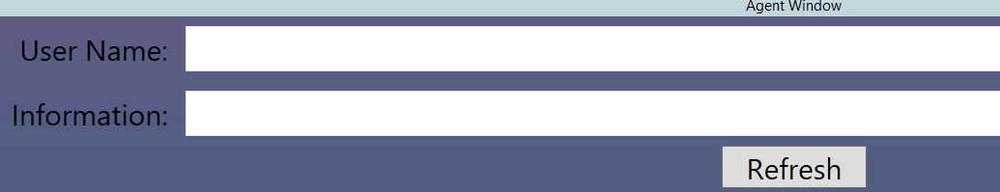
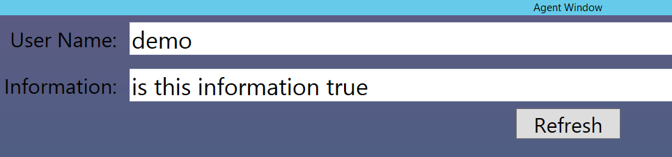

# How to communicate between two WPF windows
## Requires
- Visual Studio 2013
## License
- Apache License, Version 2.0
## Technologies
- .NET
- WPF
- Windows
- Windows Desktop App Development
## Topics
- WPF
- Message Route
## Updated
- 09/22/2016
## Description

<strong></strong><em></em>

How to communicate
between two WPF windows

Introduction

In some WPF app scenarios, there needs message interactions between different windows.
Here is an implementation based on event.

&nbsp;

Prerequisites

&bull;&nbsp;Visual Studio 2013

Running the Sample

&bull;&nbsp;Download and open the solution in
Visual Studio

&bull;&nbsp;Build and run the app

&bull;&nbsp;there will be 2 windows running: the Agent Window &amp;&amp; the Customer window,

&nbsp;

&bull;&nbsp;type information in the
Agent Window and click Refresh button, information will update the Customer window

&nbsp;

&bull;&nbsp;click the Ok button, a confirmation button will prompt to the Agent window screen.

&nbsp;

&nbsp;

Using the Code

&bull;&nbsp;Create a&nbsp;WPF&nbsp;project in&nbsp;Visual
 Studio

&bull;&nbsp;Create
Two Windows, establish the event to handle message routing, and establish event handler in two windows, further detailed implementation, please check in the project.

&nbsp;

&nbsp;

Microsoft All-In-One Code Framework is a free, centralized code sample library driven by developers' real-world pains and needs. The goal is to provide customer-driven code samples for all Microsoft development technologies,
 and reduce developers' efforts in solving typical programming tasks. Our team listens to developers&rsquo; pains in the MSDN forums, social media and various DEV communities. We write code samples based on developers&rsquo; frequently asked programming tasks,
 and allow developers to download them with a short sample publishing cycle. Additionally, we offer a free code sample request service. It is a proactive way for our developer community to obtain code samples directly from Microsoft.

