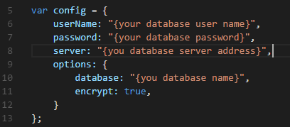

# How to connect to SQL Server database in Node.js using tedious
## Requires
- 
## License
- Apache License, Version 2.0
## Technologies
- SQL Server
- Database
- Node.js
## Topics
- SQL Server
- Node.js
## Updated
- 12/08/2016
## Description

How to connect to SQL Server database in Node.js using Tedious

Introduction

Tedious is a Node package that provides an implementation of the
<a href="http://msdn.microsoft.com/en-us/library/dd304523.aspx" style="text-decoration:none">TDS protocol</a>, which is used to interact with instances of Microsoft&rsquo;s SQL Server.

This sample demonstrates how to connect to SQL Server database in Node.js using Tedious.

Sample prerequisites

To open and run this sample, ensure that the following requisites have been met:

&bull;&nbsp;Node.js 6.6.0 or above.

&bull;&nbsp;NPM is installed (In default case, it has been installed before you installed Node.js).

&bull;&nbsp;You should have a SQL database and&nbsp;the below structure.

&nbsp;

SQL

Edit|Remove

mysql
<pre class="hidden">CREATE TABLE Student(
ID int identity primary key,
Name nvarchar(50),
Age int
)
INSERT INTO Student VALUES('Bear',18)
INSERT INTO Student VALUES('Frank',20)</pre>

<pre class="mysql">CREATE&nbsp;TABLE&nbsp;Student(&nbsp;
ID&nbsp;int&nbsp;identity&nbsp;primary&nbsp;key,&nbsp;
Name&nbsp;nvarchar(50),&nbsp;
Age&nbsp;int&nbsp;
)&nbsp;
INSERT&nbsp;INTO&nbsp;Student&nbsp;VALUES('Bear',18)&nbsp;
INSERT&nbsp;INTO&nbsp;Student&nbsp;VALUES('Frank',20)</pre>

&nbsp;

Building the sample

&nbsp;Restore the library

&bull;&nbsp;Open the Command Prompt window and navigate to the sample location folder. For example, the sample location is
D:\Sample\JSConnectSQLServerInNode.

&nbsp;

&bull;&nbsp;Type&nbsp;the following&nbsp;commands to restore library.

&bull;&nbsp;npm install
tedious

&bull;&nbsp;npm install bluebird

&nbsp;

&nbsp;

Config Connection portal

&bull;&nbsp;Open the file main.js

&bull;&nbsp;Localize to config section

&bull;&nbsp;Fill your SQL connection portal

Running the sample

&bull;&nbsp;Open the Command Prompt window and navigate to sample location folder, for example, the sample location is
D:\Sample\JSConnectSQLServerInNode.

&bull;&nbsp;Type command: node main.js, the program will connect to the SQL Server, and finish some CURD actions.

Using the code

<strong>The base use:</strong>

&nbsp;

JavaScript

Edit|Remove

js
<pre class="hidden">var Connection = require('tedious').Connection;
var Request = require('tedious').Request;

var config = {
    userName: &quot;{your database user name}&quot;,
    password: &quot;{your database password}&quot;,
    server: &quot;{you database server address}&quot;,
    options: {
        database: &quot;{you database name}&quot;,
        encrypt: true,
    }
};

var connection = new Tedious.Connection(config);
connection.on(&quot;connect&quot;,function(err){
    var result = [];

    var request = new Request(&quot;select * form student&quot;,function(err,count,rows){
        console.log(result);
    });
    request.on(&quot;row&quot;, function (columns) {
        var item = {};
        columns.forEach(function (column) {
            item[column.metadata.colName] = column.value;
        });
        result.push(item);
    });
})
</pre>

<pre class="js">var&nbsp;Connection&nbsp;=&nbsp;require('tedious').Connection;&nbsp;
var&nbsp;Request&nbsp;=&nbsp;require('tedious').Request;&nbsp;
&nbsp;
var&nbsp;config&nbsp;=&nbsp;{&nbsp;
&nbsp;&nbsp;&nbsp;&nbsp;userName:&nbsp;&quot;{your&nbsp;database&nbsp;user&nbsp;name}&quot;,&nbsp;
&nbsp;&nbsp;&nbsp;&nbsp;password:&nbsp;&quot;{your&nbsp;database&nbsp;password}&quot;,&nbsp;
&nbsp;&nbsp;&nbsp;&nbsp;server:&nbsp;&quot;{you&nbsp;database&nbsp;server&nbsp;address}&quot;,&nbsp;
&nbsp;&nbsp;&nbsp;&nbsp;options:&nbsp;{&nbsp;
&nbsp;&nbsp;&nbsp;&nbsp;&nbsp;&nbsp;&nbsp;&nbsp;database:&nbsp;&quot;{you&nbsp;database&nbsp;name}&quot;,&nbsp;
&nbsp;&nbsp;&nbsp;&nbsp;&nbsp;&nbsp;&nbsp;&nbsp;encrypt:&nbsp;true,&nbsp;
&nbsp;&nbsp;&nbsp;&nbsp;}&nbsp;
};&nbsp;
&nbsp;
var&nbsp;connection&nbsp;=&nbsp;new&nbsp;Tedious.Connection(config);&nbsp;
connection.on(&quot;connect&quot;,function(err){&nbsp;
&nbsp;&nbsp;&nbsp;&nbsp;var&nbsp;result&nbsp;=&nbsp;[];&nbsp;
&nbsp;
&nbsp;&nbsp;&nbsp;&nbsp;var&nbsp;request&nbsp;=&nbsp;new&nbsp;Request(&quot;select&nbsp;*&nbsp;form&nbsp;student&quot;,function(err,count,rows){&nbsp;
&nbsp;&nbsp;&nbsp;&nbsp;&nbsp;&nbsp;&nbsp;&nbsp;console.log(result);&nbsp;
&nbsp;&nbsp;&nbsp;&nbsp;});&nbsp;
&nbsp;&nbsp;&nbsp;&nbsp;request.on(&quot;row&quot;,&nbsp;function&nbsp;(columns)&nbsp;{&nbsp;
&nbsp;&nbsp;&nbsp;&nbsp;&nbsp;&nbsp;&nbsp;&nbsp;var&nbsp;item&nbsp;=&nbsp;{};&nbsp;
&nbsp;&nbsp;&nbsp;&nbsp;&nbsp;&nbsp;&nbsp;&nbsp;columns.forEach(function&nbsp;(column)&nbsp;{&nbsp;
&nbsp;&nbsp;&nbsp;&nbsp;&nbsp;&nbsp;&nbsp;&nbsp;&nbsp;&nbsp;&nbsp;&nbsp;item[column.metadata.colName]&nbsp;=&nbsp;column.value;&nbsp;
&nbsp;&nbsp;&nbsp;&nbsp;&nbsp;&nbsp;&nbsp;&nbsp;});&nbsp;
&nbsp;&nbsp;&nbsp;&nbsp;&nbsp;&nbsp;&nbsp;&nbsp;result.push(item);&nbsp;
&nbsp;&nbsp;&nbsp;&nbsp;});&nbsp;
})&nbsp;</pre>

&nbsp;

Since it's&nbsp;inconvenient for coding,&nbsp;let&rsquo;s try the following method to improve this.

Build a SQL helper file name msSqlConnecter.js, with below code:

&nbsp;

JavaScript

Edit|Remove

js
<pre class="hidden">var Tedious = require(&quot;tedious&quot;);
var Promise = require(&quot;bluebird&quot;);

module.exports = {
    msSqlConnecter: function (config) {
        var currentConnect = this;
        currentConnect.config = config;
        currentConnect.errorHandler;
        currentConnect.connectedHandler;
        currentConnect.connection;

        currentConnect.onConnected = function (callback) {
            currentConnect.connectedHandler = callback;
            return currentConnect;
        };

        currentConnect.onError = function (callback) {
            currentConnect.errorHandler = callback;
            return currentConnect;
        };

        currentConnect.Request = function (sql) {
            var currentRequest = this;
            currentRequest.sql = sql;
            currentRequest.params = [];
            currentRequest.result = [];

            currentRequest.errorHandler;
            currentRequest.onComplateHandler;

            currentRequest.addParam = function (key, type, value) {
                currentRequest.params.push({ key: key, type: type, value: value });
                return currentRequest;
            }

            currentRequest.Run = function () {
                var request = new Tedious.Request(currentRequest.sql, function (err, rowCount, rows) {
                    if (err) {
                        currentRequest.errorHandler(err);
                    }
                    else {
                        currentRequest.onComplateHandler(rowCount, currentRequest.result);
                    }
                });

                request.on(&quot;row&quot;, function (columns) {
                    var item = {};
                    columns.forEach(function (column) {

                        item[column.metadata.colName] = column.value;
                    });
                    currentRequest.result.push(item);
                });

                for (var i in currentRequest.params) {
                    var item = currentRequest.params[i];
                    request.addParameter(item.key, item.type, item.value);
                }

                currentConnect.connection.execSql(request);
                return currentRequest;
            };

            currentRequest.onError = function (callback) {
                currentRequest.errorHandler = callback;
                return currentRequest;
            };

            currentRequest.onComplate = function (callback) {
                currentRequest.onComplateHandler = callback;

                return currentRequest;
            };
        }

        currentConnect.connect = function () {
            var connection = new Tedious.Connection(config);
            currentConnect.connection = connection;
            return Promise.promisify(connection.on.bind(connection))(&quot;connect&quot;);
        }
    }
}
</pre>

<pre class="js">var&nbsp;Tedious&nbsp;=&nbsp;require(&quot;tedious&quot;);&nbsp;
var&nbsp;Promise&nbsp;=&nbsp;require(&quot;bluebird&quot;);&nbsp;
&nbsp;
module.exports&nbsp;=&nbsp;{&nbsp;
&nbsp;&nbsp;&nbsp;&nbsp;msSqlConnecter:&nbsp;function&nbsp;(config)&nbsp;{&nbsp;
&nbsp;&nbsp;&nbsp;&nbsp;&nbsp;&nbsp;&nbsp;&nbsp;var&nbsp;currentConnect&nbsp;=&nbsp;this;&nbsp;
&nbsp;&nbsp;&nbsp;&nbsp;&nbsp;&nbsp;&nbsp;&nbsp;currentConnect.config&nbsp;=&nbsp;config;&nbsp;
&nbsp;&nbsp;&nbsp;&nbsp;&nbsp;&nbsp;&nbsp;&nbsp;currentConnect.errorHandler;&nbsp;
&nbsp;&nbsp;&nbsp;&nbsp;&nbsp;&nbsp;&nbsp;&nbsp;currentConnect.connectedHandler;&nbsp;
&nbsp;&nbsp;&nbsp;&nbsp;&nbsp;&nbsp;&nbsp;&nbsp;currentConnect.connection;&nbsp;
&nbsp;
&nbsp;&nbsp;&nbsp;&nbsp;&nbsp;&nbsp;&nbsp;&nbsp;currentConnect.onConnected&nbsp;=&nbsp;function&nbsp;(callback)&nbsp;{&nbsp;
&nbsp;&nbsp;&nbsp;&nbsp;&nbsp;&nbsp;&nbsp;&nbsp;&nbsp;&nbsp;&nbsp;&nbsp;currentConnect.connectedHandler&nbsp;=&nbsp;callback;&nbsp;
&nbsp;&nbsp;&nbsp;&nbsp;&nbsp;&nbsp;&nbsp;&nbsp;&nbsp;&nbsp;&nbsp;&nbsp;return&nbsp;currentConnect;&nbsp;
&nbsp;&nbsp;&nbsp;&nbsp;&nbsp;&nbsp;&nbsp;&nbsp;};&nbsp;
&nbsp;
&nbsp;&nbsp;&nbsp;&nbsp;&nbsp;&nbsp;&nbsp;&nbsp;currentConnect.onError&nbsp;=&nbsp;function&nbsp;(callback)&nbsp;{&nbsp;
&nbsp;&nbsp;&nbsp;&nbsp;&nbsp;&nbsp;&nbsp;&nbsp;&nbsp;&nbsp;&nbsp;&nbsp;currentConnect.errorHandler&nbsp;=&nbsp;callback;&nbsp;
&nbsp;&nbsp;&nbsp;&nbsp;&nbsp;&nbsp;&nbsp;&nbsp;&nbsp;&nbsp;&nbsp;&nbsp;return&nbsp;currentConnect;&nbsp;
&nbsp;&nbsp;&nbsp;&nbsp;&nbsp;&nbsp;&nbsp;&nbsp;};&nbsp;
&nbsp;
&nbsp;&nbsp;&nbsp;&nbsp;&nbsp;&nbsp;&nbsp;&nbsp;currentConnect.Request&nbsp;=&nbsp;function&nbsp;(sql)&nbsp;{&nbsp;
&nbsp;&nbsp;&nbsp;&nbsp;&nbsp;&nbsp;&nbsp;&nbsp;&nbsp;&nbsp;&nbsp;&nbsp;var&nbsp;currentRequest&nbsp;=&nbsp;this;&nbsp;
&nbsp;&nbsp;&nbsp;&nbsp;&nbsp;&nbsp;&nbsp;&nbsp;&nbsp;&nbsp;&nbsp;&nbsp;currentRequest.sql&nbsp;=&nbsp;sql;&nbsp;
&nbsp;&nbsp;&nbsp;&nbsp;&nbsp;&nbsp;&nbsp;&nbsp;&nbsp;&nbsp;&nbsp;&nbsp;currentRequest.params&nbsp;=&nbsp;[];&nbsp;
&nbsp;&nbsp;&nbsp;&nbsp;&nbsp;&nbsp;&nbsp;&nbsp;&nbsp;&nbsp;&nbsp;&nbsp;currentRequest.result&nbsp;=&nbsp;[];&nbsp;
&nbsp;
&nbsp;&nbsp;&nbsp;&nbsp;&nbsp;&nbsp;&nbsp;&nbsp;&nbsp;&nbsp;&nbsp;&nbsp;currentRequest.errorHandler;&nbsp;
&nbsp;&nbsp;&nbsp;&nbsp;&nbsp;&nbsp;&nbsp;&nbsp;&nbsp;&nbsp;&nbsp;&nbsp;currentRequest.onComplateHandler;&nbsp;
&nbsp;
&nbsp;&nbsp;&nbsp;&nbsp;&nbsp;&nbsp;&nbsp;&nbsp;&nbsp;&nbsp;&nbsp;&nbsp;currentRequest.addParam&nbsp;=&nbsp;function&nbsp;(key,&nbsp;type,&nbsp;value)&nbsp;{&nbsp;
&nbsp;&nbsp;&nbsp;&nbsp;&nbsp;&nbsp;&nbsp;&nbsp;&nbsp;&nbsp;&nbsp;&nbsp;&nbsp;&nbsp;&nbsp;&nbsp;currentRequest.params.push({&nbsp;key:&nbsp;key,&nbsp;type:&nbsp;type,&nbsp;value:&nbsp;value&nbsp;});&nbsp;
&nbsp;&nbsp;&nbsp;&nbsp;&nbsp;&nbsp;&nbsp;&nbsp;&nbsp;&nbsp;&nbsp;&nbsp;&nbsp;&nbsp;&nbsp;&nbsp;return&nbsp;currentRequest;&nbsp;
&nbsp;&nbsp;&nbsp;&nbsp;&nbsp;&nbsp;&nbsp;&nbsp;&nbsp;&nbsp;&nbsp;&nbsp;}&nbsp;
&nbsp;
&nbsp;&nbsp;&nbsp;&nbsp;&nbsp;&nbsp;&nbsp;&nbsp;&nbsp;&nbsp;&nbsp;&nbsp;currentRequest.Run&nbsp;=&nbsp;function&nbsp;()&nbsp;{&nbsp;
&nbsp;&nbsp;&nbsp;&nbsp;&nbsp;&nbsp;&nbsp;&nbsp;&nbsp;&nbsp;&nbsp;&nbsp;&nbsp;&nbsp;&nbsp;&nbsp;var&nbsp;request&nbsp;=&nbsp;new&nbsp;Tedious.Request(currentRequest.sql,&nbsp;function&nbsp;(err,&nbsp;rowCount,&nbsp;rows)&nbsp;{&nbsp;
&nbsp;&nbsp;&nbsp;&nbsp;&nbsp;&nbsp;&nbsp;&nbsp;&nbsp;&nbsp;&nbsp;&nbsp;&nbsp;&nbsp;&nbsp;&nbsp;&nbsp;&nbsp;&nbsp;&nbsp;if&nbsp;(err)&nbsp;{&nbsp;
&nbsp;&nbsp;&nbsp;&nbsp;&nbsp;&nbsp;&nbsp;&nbsp;&nbsp;&nbsp;&nbsp;&nbsp;&nbsp;&nbsp;&nbsp;&nbsp;&nbsp;&nbsp;&nbsp;&nbsp;&nbsp;&nbsp;&nbsp;&nbsp;currentRequest.errorHandler(err);&nbsp;
&nbsp;&nbsp;&nbsp;&nbsp;&nbsp;&nbsp;&nbsp;&nbsp;&nbsp;&nbsp;&nbsp;&nbsp;&nbsp;&nbsp;&nbsp;&nbsp;&nbsp;&nbsp;&nbsp;&nbsp;}&nbsp;
&nbsp;&nbsp;&nbsp;&nbsp;&nbsp;&nbsp;&nbsp;&nbsp;&nbsp;&nbsp;&nbsp;&nbsp;&nbsp;&nbsp;&nbsp;&nbsp;&nbsp;&nbsp;&nbsp;&nbsp;else&nbsp;{&nbsp;
&nbsp;&nbsp;&nbsp;&nbsp;&nbsp;&nbsp;&nbsp;&nbsp;&nbsp;&nbsp;&nbsp;&nbsp;&nbsp;&nbsp;&nbsp;&nbsp;&nbsp;&nbsp;&nbsp;&nbsp;&nbsp;&nbsp;&nbsp;&nbsp;currentRequest.onComplateHandler(rowCount,&nbsp;currentRequest.result);&nbsp;
&nbsp;&nbsp;&nbsp;&nbsp;&nbsp;&nbsp;&nbsp;&nbsp;&nbsp;&nbsp;&nbsp;&nbsp;&nbsp;&nbsp;&nbsp;&nbsp;&nbsp;&nbsp;&nbsp;&nbsp;}&nbsp;
&nbsp;&nbsp;&nbsp;&nbsp;&nbsp;&nbsp;&nbsp;&nbsp;&nbsp;&nbsp;&nbsp;&nbsp;&nbsp;&nbsp;&nbsp;&nbsp;});&nbsp;
&nbsp;
&nbsp;&nbsp;&nbsp;&nbsp;&nbsp;&nbsp;&nbsp;&nbsp;&nbsp;&nbsp;&nbsp;&nbsp;&nbsp;&nbsp;&nbsp;&nbsp;request.on(&quot;row&quot;,&nbsp;function&nbsp;(columns)&nbsp;{&nbsp;
&nbsp;&nbsp;&nbsp;&nbsp;&nbsp;&nbsp;&nbsp;&nbsp;&nbsp;&nbsp;&nbsp;&nbsp;&nbsp;&nbsp;&nbsp;&nbsp;&nbsp;&nbsp;&nbsp;&nbsp;var&nbsp;item&nbsp;=&nbsp;{};&nbsp;
&nbsp;&nbsp;&nbsp;&nbsp;&nbsp;&nbsp;&nbsp;&nbsp;&nbsp;&nbsp;&nbsp;&nbsp;&nbsp;&nbsp;&nbsp;&nbsp;&nbsp;&nbsp;&nbsp;&nbsp;columns.forEach(function&nbsp;(column)&nbsp;{&nbsp;
&nbsp;
&nbsp;&nbsp;&nbsp;&nbsp;&nbsp;&nbsp;&nbsp;&nbsp;&nbsp;&nbsp;&nbsp;&nbsp;&nbsp;&nbsp;&nbsp;&nbsp;&nbsp;&nbsp;&nbsp;&nbsp;&nbsp;&nbsp;&nbsp;&nbsp;item[column.metadata.colName]&nbsp;=&nbsp;column.value;&nbsp;
&nbsp;&nbsp;&nbsp;&nbsp;&nbsp;&nbsp;&nbsp;&nbsp;&nbsp;&nbsp;&nbsp;&nbsp;&nbsp;&nbsp;&nbsp;&nbsp;&nbsp;&nbsp;&nbsp;&nbsp;});&nbsp;
&nbsp;&nbsp;&nbsp;&nbsp;&nbsp;&nbsp;&nbsp;&nbsp;&nbsp;&nbsp;&nbsp;&nbsp;&nbsp;&nbsp;&nbsp;&nbsp;&nbsp;&nbsp;&nbsp;&nbsp;currentRequest.result.push(item);&nbsp;
&nbsp;&nbsp;&nbsp;&nbsp;&nbsp;&nbsp;&nbsp;&nbsp;&nbsp;&nbsp;&nbsp;&nbsp;&nbsp;&nbsp;&nbsp;&nbsp;});&nbsp;
&nbsp;
&nbsp;&nbsp;&nbsp;&nbsp;&nbsp;&nbsp;&nbsp;&nbsp;&nbsp;&nbsp;&nbsp;&nbsp;&nbsp;&nbsp;&nbsp;&nbsp;for&nbsp;(var&nbsp;i&nbsp;in&nbsp;currentRequest.params)&nbsp;{&nbsp;
&nbsp;&nbsp;&nbsp;&nbsp;&nbsp;&nbsp;&nbsp;&nbsp;&nbsp;&nbsp;&nbsp;&nbsp;&nbsp;&nbsp;&nbsp;&nbsp;&nbsp;&nbsp;&nbsp;&nbsp;var&nbsp;item&nbsp;=&nbsp;currentRequest.params[i];&nbsp;
&nbsp;&nbsp;&nbsp;&nbsp;&nbsp;&nbsp;&nbsp;&nbsp;&nbsp;&nbsp;&nbsp;&nbsp;&nbsp;&nbsp;&nbsp;&nbsp;&nbsp;&nbsp;&nbsp;&nbsp;request.addParameter(item.key,&nbsp;item.type,&nbsp;item.value);&nbsp;
&nbsp;&nbsp;&nbsp;&nbsp;&nbsp;&nbsp;&nbsp;&nbsp;&nbsp;&nbsp;&nbsp;&nbsp;&nbsp;&nbsp;&nbsp;&nbsp;}&nbsp;
&nbsp;
&nbsp;&nbsp;&nbsp;&nbsp;&nbsp;&nbsp;&nbsp;&nbsp;&nbsp;&nbsp;&nbsp;&nbsp;&nbsp;&nbsp;&nbsp;&nbsp;currentConnect.connection.execSql(request);&nbsp;
&nbsp;&nbsp;&nbsp;&nbsp;&nbsp;&nbsp;&nbsp;&nbsp;&nbsp;&nbsp;&nbsp;&nbsp;&nbsp;&nbsp;&nbsp;&nbsp;return&nbsp;currentRequest;&nbsp;
&nbsp;&nbsp;&nbsp;&nbsp;&nbsp;&nbsp;&nbsp;&nbsp;&nbsp;&nbsp;&nbsp;&nbsp;};&nbsp;
&nbsp;
&nbsp;&nbsp;&nbsp;&nbsp;&nbsp;&nbsp;&nbsp;&nbsp;&nbsp;&nbsp;&nbsp;&nbsp;currentRequest.onError&nbsp;=&nbsp;function&nbsp;(callback)&nbsp;{&nbsp;
&nbsp;&nbsp;&nbsp;&nbsp;&nbsp;&nbsp;&nbsp;&nbsp;&nbsp;&nbsp;&nbsp;&nbsp;&nbsp;&nbsp;&nbsp;&nbsp;currentRequest.errorHandler&nbsp;=&nbsp;callback;&nbsp;
&nbsp;&nbsp;&nbsp;&nbsp;&nbsp;&nbsp;&nbsp;&nbsp;&nbsp;&nbsp;&nbsp;&nbsp;&nbsp;&nbsp;&nbsp;&nbsp;return&nbsp;currentRequest;&nbsp;
&nbsp;&nbsp;&nbsp;&nbsp;&nbsp;&nbsp;&nbsp;&nbsp;&nbsp;&nbsp;&nbsp;&nbsp;};&nbsp;
&nbsp;
&nbsp;&nbsp;&nbsp;&nbsp;&nbsp;&nbsp;&nbsp;&nbsp;&nbsp;&nbsp;&nbsp;&nbsp;currentRequest.onComplate&nbsp;=&nbsp;function&nbsp;(callback)&nbsp;{&nbsp;
&nbsp;&nbsp;&nbsp;&nbsp;&nbsp;&nbsp;&nbsp;&nbsp;&nbsp;&nbsp;&nbsp;&nbsp;&nbsp;&nbsp;&nbsp;&nbsp;currentRequest.onComplateHandler&nbsp;=&nbsp;callback;&nbsp;
&nbsp;
&nbsp;&nbsp;&nbsp;&nbsp;&nbsp;&nbsp;&nbsp;&nbsp;&nbsp;&nbsp;&nbsp;&nbsp;&nbsp;&nbsp;&nbsp;&nbsp;return&nbsp;currentRequest;&nbsp;
&nbsp;&nbsp;&nbsp;&nbsp;&nbsp;&nbsp;&nbsp;&nbsp;&nbsp;&nbsp;&nbsp;&nbsp;};&nbsp;
&nbsp;&nbsp;&nbsp;&nbsp;&nbsp;&nbsp;&nbsp;&nbsp;}&nbsp;
&nbsp;
&nbsp;&nbsp;&nbsp;&nbsp;&nbsp;&nbsp;&nbsp;&nbsp;currentConnect.connect&nbsp;=&nbsp;function&nbsp;()&nbsp;{&nbsp;
&nbsp;&nbsp;&nbsp;&nbsp;&nbsp;&nbsp;&nbsp;&nbsp;&nbsp;&nbsp;&nbsp;&nbsp;var&nbsp;connection&nbsp;=&nbsp;new&nbsp;Tedious.Connection(config);&nbsp;
&nbsp;&nbsp;&nbsp;&nbsp;&nbsp;&nbsp;&nbsp;&nbsp;&nbsp;&nbsp;&nbsp;&nbsp;currentConnect.connection&nbsp;=&nbsp;connection;&nbsp;
&nbsp;&nbsp;&nbsp;&nbsp;&nbsp;&nbsp;&nbsp;&nbsp;&nbsp;&nbsp;&nbsp;&nbsp;return&nbsp;Promise.promisify(connection.on.bind(connection))(&quot;connect&quot;);&nbsp;
&nbsp;&nbsp;&nbsp;&nbsp;&nbsp;&nbsp;&nbsp;&nbsp;}&nbsp;
&nbsp;&nbsp;&nbsp;&nbsp;}&nbsp;
}&nbsp;</pre>

&nbsp;

And how to use this SQL Helper in Main.js

JavaScript

Edit|Remove

js
<pre class="hidden">var TYPES = require(&quot;tedious&quot;).TYPES;
var msSqlConnecter = require(&quot;./msSqlConnecter&quot;);

var config = {
    userName: &quot;{your database user name}&quot;,
    password: &quot;{your database password}&quot;,
    server: &quot;{you database server address}&quot;,
    options: {
        database: &quot;{you database name}&quot;,
        encrypt: true,
    }
};

function insert(callback) {
    //when insert
    var con = new msSqlConnecter.msSqlConnecter(config);
    con.connect().then(function () {
        new con.Request(&quot;insert into student values(@name,@age)&quot;)
            .addParam(&quot;name&quot;, TYPES.VarChar, &quot;Eric&quot;)
            .addParam(&quot;age&quot;, TYPES.Int, 20)
            .onComplate(function (count) {
                if (callback)
                    callback(count);
            })
            .onError(function (err) {
                console.log(err);
            })
            .Run();
    }).catch(function (ex) {
        console.log(ex);
    });
}

function queryAll(callback) {
    var con = new msSqlConnecter.msSqlConnecter(config);
    con.connect().then(function () {
        new con.Request(&quot;select * from student&quot;)
            .onComplate(function (count, datas) {
                if (callback)
                    callback(datas);
            })
            .onError(function (err) {
                console.log(err);
            }).Run();
    }).catch(function (ex) {
        console.log(ex);
    });
}

function updateData(callback) {
    var con = new msSqlConnecter.msSqlConnecter(config);
    con.connect().then(function () {
        new con.Request(&quot;update student set name = @name where id &gt; @id&quot;)
            .addParam(&quot;id&quot;, TYPES.Int, 3)
            .addParam(&quot;name&quot;, TYPES.VarChar, &quot;frank&quot;)
            .onComplate(function (count) {
                if (callback)
                    callback(count);
            })
            .onError(function (err) {
                console.log(err);
            })
            .Run();
    }).catch(function (ex) {
        console.log(ex);
    });
}

function deleteData(callback) {
    var con = new msSqlConnecter.msSqlConnecter(config);
    con.connect().then(function () {
        new con.Request(&quot;delete from student where id &gt; @id&quot;)
            .addParam(&quot;id&quot;, TYPES.Int, 3)
            .onComplate(function (count) {
                if (callback)
                    callback(count);
            })
            .onError(function (err) {
                console.log(err);
            })
            .Run();
    }).catch(function (ex) {
        console.log(ex);
    });
}

console.log(&quot;inserting data&quot;);
insert(function (count) {
    console.log(&quot;data inserted, listing data.&quot;);
    queryAll(function (data) {
        console.log(data);
        console.log(&quot;updating data.&quot;);
        updateData(function (count) {
            console.log(&quot;data updated, listing data.&quot;);
            queryAll(function (data) {
                console.log(data);
                console.log(&quot;deleting data.&quot;);
                deleteData(function (count) {
                    console.log(&quot;data deleted,listing data.&quot;);
                    queryAll(function (data) {
                        console.log(data);
                    });
                });
            });
        });
    });
});
</pre>

<pre class="js">var&nbsp;TYPES&nbsp;=&nbsp;require(&quot;tedious&quot;).TYPES;&nbsp;
var&nbsp;msSqlConnecter&nbsp;=&nbsp;require(&quot;./msSqlConnecter&quot;);&nbsp;
&nbsp;
var&nbsp;config&nbsp;=&nbsp;{&nbsp;
&nbsp;&nbsp;&nbsp;&nbsp;userName:&nbsp;&quot;{your&nbsp;database&nbsp;user&nbsp;name}&quot;,&nbsp;
&nbsp;&nbsp;&nbsp;&nbsp;password:&nbsp;&quot;{your&nbsp;database&nbsp;password}&quot;,&nbsp;
&nbsp;&nbsp;&nbsp;&nbsp;server:&nbsp;&quot;{you&nbsp;database&nbsp;server&nbsp;address}&quot;,&nbsp;
&nbsp;&nbsp;&nbsp;&nbsp;options:&nbsp;{&nbsp;
&nbsp;&nbsp;&nbsp;&nbsp;&nbsp;&nbsp;&nbsp;&nbsp;database:&nbsp;&quot;{you&nbsp;database&nbsp;name}&quot;,&nbsp;
&nbsp;&nbsp;&nbsp;&nbsp;&nbsp;&nbsp;&nbsp;&nbsp;encrypt:&nbsp;true,&nbsp;
&nbsp;&nbsp;&nbsp;&nbsp;}&nbsp;
};&nbsp;
&nbsp;
function&nbsp;insert(callback)&nbsp;{&nbsp;
&nbsp;&nbsp;&nbsp;&nbsp;//when&nbsp;insert&nbsp;
&nbsp;&nbsp;&nbsp;&nbsp;var&nbsp;con&nbsp;=&nbsp;new&nbsp;msSqlConnecter.msSqlConnecter(config);&nbsp;
&nbsp;&nbsp;&nbsp;&nbsp;con.connect().then(function&nbsp;()&nbsp;{&nbsp;
&nbsp;&nbsp;&nbsp;&nbsp;&nbsp;&nbsp;&nbsp;&nbsp;new&nbsp;con.Request(&quot;insert&nbsp;into&nbsp;student&nbsp;values(@name,@age)&quot;)&nbsp;
&nbsp;&nbsp;&nbsp;&nbsp;&nbsp;&nbsp;&nbsp;&nbsp;&nbsp;&nbsp;&nbsp;&nbsp;.addParam(&quot;name&quot;,&nbsp;TYPES.VarChar,&nbsp;&quot;Eric&quot;)&nbsp;
&nbsp;&nbsp;&nbsp;&nbsp;&nbsp;&nbsp;&nbsp;&nbsp;&nbsp;&nbsp;&nbsp;&nbsp;.addParam(&quot;age&quot;,&nbsp;TYPES.Int,&nbsp;20)&nbsp;
&nbsp;&nbsp;&nbsp;&nbsp;&nbsp;&nbsp;&nbsp;&nbsp;&nbsp;&nbsp;&nbsp;&nbsp;.onComplate(function&nbsp;(count)&nbsp;{&nbsp;
&nbsp;&nbsp;&nbsp;&nbsp;&nbsp;&nbsp;&nbsp;&nbsp;&nbsp;&nbsp;&nbsp;&nbsp;&nbsp;&nbsp;&nbsp;&nbsp;if&nbsp;(callback)&nbsp;
&nbsp;&nbsp;&nbsp;&nbsp;&nbsp;&nbsp;&nbsp;&nbsp;&nbsp;&nbsp;&nbsp;&nbsp;&nbsp;&nbsp;&nbsp;&nbsp;&nbsp;&nbsp;&nbsp;&nbsp;callback(count);&nbsp;
&nbsp;&nbsp;&nbsp;&nbsp;&nbsp;&nbsp;&nbsp;&nbsp;&nbsp;&nbsp;&nbsp;&nbsp;})&nbsp;
&nbsp;&nbsp;&nbsp;&nbsp;&nbsp;&nbsp;&nbsp;&nbsp;&nbsp;&nbsp;&nbsp;&nbsp;.onError(function&nbsp;(err)&nbsp;{&nbsp;
&nbsp;&nbsp;&nbsp;&nbsp;&nbsp;&nbsp;&nbsp;&nbsp;&nbsp;&nbsp;&nbsp;&nbsp;&nbsp;&nbsp;&nbsp;&nbsp;console.log(err);&nbsp;
&nbsp;&nbsp;&nbsp;&nbsp;&nbsp;&nbsp;&nbsp;&nbsp;&nbsp;&nbsp;&nbsp;&nbsp;})&nbsp;
&nbsp;&nbsp;&nbsp;&nbsp;&nbsp;&nbsp;&nbsp;&nbsp;&nbsp;&nbsp;&nbsp;&nbsp;.Run();&nbsp;
&nbsp;&nbsp;&nbsp;&nbsp;}).catch(function&nbsp;(ex)&nbsp;{&nbsp;
&nbsp;&nbsp;&nbsp;&nbsp;&nbsp;&nbsp;&nbsp;&nbsp;console.log(ex);&nbsp;
&nbsp;&nbsp;&nbsp;&nbsp;});&nbsp;
}&nbsp;
&nbsp;
function&nbsp;queryAll(callback)&nbsp;{&nbsp;
&nbsp;&nbsp;&nbsp;&nbsp;var&nbsp;con&nbsp;=&nbsp;new&nbsp;msSqlConnecter.msSqlConnecter(config);&nbsp;
&nbsp;&nbsp;&nbsp;&nbsp;con.connect().then(function&nbsp;()&nbsp;{&nbsp;
&nbsp;&nbsp;&nbsp;&nbsp;&nbsp;&nbsp;&nbsp;&nbsp;new&nbsp;con.Request(&quot;select&nbsp;*&nbsp;from&nbsp;student&quot;)&nbsp;
&nbsp;&nbsp;&nbsp;&nbsp;&nbsp;&nbsp;&nbsp;&nbsp;&nbsp;&nbsp;&nbsp;&nbsp;.onComplate(function&nbsp;(count,&nbsp;datas)&nbsp;{&nbsp;
&nbsp;&nbsp;&nbsp;&nbsp;&nbsp;&nbsp;&nbsp;&nbsp;&nbsp;&nbsp;&nbsp;&nbsp;&nbsp;&nbsp;&nbsp;&nbsp;if&nbsp;(callback)&nbsp;
&nbsp;&nbsp;&nbsp;&nbsp;&nbsp;&nbsp;&nbsp;&nbsp;&nbsp;&nbsp;&nbsp;&nbsp;&nbsp;&nbsp;&nbsp;&nbsp;&nbsp;&nbsp;&nbsp;&nbsp;callback(datas);&nbsp;
&nbsp;&nbsp;&nbsp;&nbsp;&nbsp;&nbsp;&nbsp;&nbsp;&nbsp;&nbsp;&nbsp;&nbsp;})&nbsp;
&nbsp;&nbsp;&nbsp;&nbsp;&nbsp;&nbsp;&nbsp;&nbsp;&nbsp;&nbsp;&nbsp;&nbsp;.onError(function&nbsp;(err)&nbsp;{&nbsp;
&nbsp;&nbsp;&nbsp;&nbsp;&nbsp;&nbsp;&nbsp;&nbsp;&nbsp;&nbsp;&nbsp;&nbsp;&nbsp;&nbsp;&nbsp;&nbsp;console.log(err);&nbsp;
&nbsp;&nbsp;&nbsp;&nbsp;&nbsp;&nbsp;&nbsp;&nbsp;&nbsp;&nbsp;&nbsp;&nbsp;}).Run();&nbsp;
&nbsp;&nbsp;&nbsp;&nbsp;}).catch(function&nbsp;(ex)&nbsp;{&nbsp;
&nbsp;&nbsp;&nbsp;&nbsp;&nbsp;&nbsp;&nbsp;&nbsp;console.log(ex);&nbsp;
&nbsp;&nbsp;&nbsp;&nbsp;});&nbsp;
}&nbsp;
&nbsp;
function&nbsp;updateData(callback)&nbsp;{&nbsp;
&nbsp;&nbsp;&nbsp;&nbsp;var&nbsp;con&nbsp;=&nbsp;new&nbsp;msSqlConnecter.msSqlConnecter(config);&nbsp;
&nbsp;&nbsp;&nbsp;&nbsp;con.connect().then(function&nbsp;()&nbsp;{&nbsp;
&nbsp;&nbsp;&nbsp;&nbsp;&nbsp;&nbsp;&nbsp;&nbsp;new&nbsp;con.Request(&quot;update&nbsp;student&nbsp;set&nbsp;name&nbsp;=&nbsp;@name&nbsp;where&nbsp;id&nbsp;&gt;&nbsp;@id&quot;)&nbsp;
&nbsp;&nbsp;&nbsp;&nbsp;&nbsp;&nbsp;&nbsp;&nbsp;&nbsp;&nbsp;&nbsp;&nbsp;.addParam(&quot;id&quot;,&nbsp;TYPES.Int,&nbsp;3)&nbsp;
&nbsp;&nbsp;&nbsp;&nbsp;&nbsp;&nbsp;&nbsp;&nbsp;&nbsp;&nbsp;&nbsp;&nbsp;.addParam(&quot;name&quot;,&nbsp;TYPES.VarChar,&nbsp;&quot;frank&quot;)&nbsp;
&nbsp;&nbsp;&nbsp;&nbsp;&nbsp;&nbsp;&nbsp;&nbsp;&nbsp;&nbsp;&nbsp;&nbsp;.onComplate(function&nbsp;(count)&nbsp;{&nbsp;
&nbsp;&nbsp;&nbsp;&nbsp;&nbsp;&nbsp;&nbsp;&nbsp;&nbsp;&nbsp;&nbsp;&nbsp;&nbsp;&nbsp;&nbsp;&nbsp;if&nbsp;(callback)&nbsp;
&nbsp;&nbsp;&nbsp;&nbsp;&nbsp;&nbsp;&nbsp;&nbsp;&nbsp;&nbsp;&nbsp;&nbsp;&nbsp;&nbsp;&nbsp;&nbsp;&nbsp;&nbsp;&nbsp;&nbsp;callback(count);&nbsp;
&nbsp;&nbsp;&nbsp;&nbsp;&nbsp;&nbsp;&nbsp;&nbsp;&nbsp;&nbsp;&nbsp;&nbsp;})&nbsp;
&nbsp;&nbsp;&nbsp;&nbsp;&nbsp;&nbsp;&nbsp;&nbsp;&nbsp;&nbsp;&nbsp;&nbsp;.onError(function&nbsp;(err)&nbsp;{&nbsp;
&nbsp;&nbsp;&nbsp;&nbsp;&nbsp;&nbsp;&nbsp;&nbsp;&nbsp;&nbsp;&nbsp;&nbsp;&nbsp;&nbsp;&nbsp;&nbsp;console.log(err);&nbsp;
&nbsp;&nbsp;&nbsp;&nbsp;&nbsp;&nbsp;&nbsp;&nbsp;&nbsp;&nbsp;&nbsp;&nbsp;})&nbsp;
&nbsp;&nbsp;&nbsp;&nbsp;&nbsp;&nbsp;&nbsp;&nbsp;&nbsp;&nbsp;&nbsp;&nbsp;.Run();&nbsp;
&nbsp;&nbsp;&nbsp;&nbsp;}).catch(function&nbsp;(ex)&nbsp;{&nbsp;
&nbsp;&nbsp;&nbsp;&nbsp;&nbsp;&nbsp;&nbsp;&nbsp;console.log(ex);&nbsp;
&nbsp;&nbsp;&nbsp;&nbsp;});&nbsp;
}&nbsp;
&nbsp;
function&nbsp;deleteData(callback)&nbsp;{&nbsp;
&nbsp;&nbsp;&nbsp;&nbsp;var&nbsp;con&nbsp;=&nbsp;new&nbsp;msSqlConnecter.msSqlConnecter(config);&nbsp;
&nbsp;&nbsp;&nbsp;&nbsp;con.connect().then(function&nbsp;()&nbsp;{&nbsp;
&nbsp;&nbsp;&nbsp;&nbsp;&nbsp;&nbsp;&nbsp;&nbsp;new&nbsp;con.Request(&quot;delete&nbsp;from&nbsp;student&nbsp;where&nbsp;id&nbsp;&gt;&nbsp;@id&quot;)&nbsp;
&nbsp;&nbsp;&nbsp;&nbsp;&nbsp;&nbsp;&nbsp;&nbsp;&nbsp;&nbsp;&nbsp;&nbsp;.addParam(&quot;id&quot;,&nbsp;TYPES.Int,&nbsp;3)&nbsp;
&nbsp;&nbsp;&nbsp;&nbsp;&nbsp;&nbsp;&nbsp;&nbsp;&nbsp;&nbsp;&nbsp;&nbsp;.onComplate(function&nbsp;(count)&nbsp;{&nbsp;
&nbsp;&nbsp;&nbsp;&nbsp;&nbsp;&nbsp;&nbsp;&nbsp;&nbsp;&nbsp;&nbsp;&nbsp;&nbsp;&nbsp;&nbsp;&nbsp;if&nbsp;(callback)&nbsp;
&nbsp;&nbsp;&nbsp;&nbsp;&nbsp;&nbsp;&nbsp;&nbsp;&nbsp;&nbsp;&nbsp;&nbsp;&nbsp;&nbsp;&nbsp;&nbsp;&nbsp;&nbsp;&nbsp;&nbsp;callback(count);&nbsp;
&nbsp;&nbsp;&nbsp;&nbsp;&nbsp;&nbsp;&nbsp;&nbsp;&nbsp;&nbsp;&nbsp;&nbsp;})&nbsp;
&nbsp;&nbsp;&nbsp;&nbsp;&nbsp;&nbsp;&nbsp;&nbsp;&nbsp;&nbsp;&nbsp;&nbsp;.onError(function&nbsp;(err)&nbsp;{&nbsp;
&nbsp;&nbsp;&nbsp;&nbsp;&nbsp;&nbsp;&nbsp;&nbsp;&nbsp;&nbsp;&nbsp;&nbsp;&nbsp;&nbsp;&nbsp;&nbsp;console.log(err);&nbsp;
&nbsp;&nbsp;&nbsp;&nbsp;&nbsp;&nbsp;&nbsp;&nbsp;&nbsp;&nbsp;&nbsp;&nbsp;})&nbsp;
&nbsp;&nbsp;&nbsp;&nbsp;&nbsp;&nbsp;&nbsp;&nbsp;&nbsp;&nbsp;&nbsp;&nbsp;.Run();&nbsp;
&nbsp;&nbsp;&nbsp;&nbsp;}).catch(function&nbsp;(ex)&nbsp;{&nbsp;
&nbsp;&nbsp;&nbsp;&nbsp;&nbsp;&nbsp;&nbsp;&nbsp;console.log(ex);&nbsp;
&nbsp;&nbsp;&nbsp;&nbsp;});&nbsp;
}&nbsp;
&nbsp;
console.log(&quot;inserting&nbsp;data&quot;);&nbsp;
insert(function&nbsp;(count)&nbsp;{&nbsp;
&nbsp;&nbsp;&nbsp;&nbsp;console.log(&quot;data&nbsp;inserted,&nbsp;listing&nbsp;data.&quot;);&nbsp;
&nbsp;&nbsp;&nbsp;&nbsp;queryAll(function&nbsp;(data)&nbsp;{&nbsp;
&nbsp;&nbsp;&nbsp;&nbsp;&nbsp;&nbsp;&nbsp;&nbsp;console.log(data);&nbsp;
&nbsp;&nbsp;&nbsp;&nbsp;&nbsp;&nbsp;&nbsp;&nbsp;console.log(&quot;updating&nbsp;data.&quot;);&nbsp;
&nbsp;&nbsp;&nbsp;&nbsp;&nbsp;&nbsp;&nbsp;&nbsp;updateData(function&nbsp;(count)&nbsp;{&nbsp;
&nbsp;&nbsp;&nbsp;&nbsp;&nbsp;&nbsp;&nbsp;&nbsp;&nbsp;&nbsp;&nbsp;&nbsp;console.log(&quot;data&nbsp;updated,&nbsp;listing&nbsp;data.&quot;);&nbsp;
&nbsp;&nbsp;&nbsp;&nbsp;&nbsp;&nbsp;&nbsp;&nbsp;&nbsp;&nbsp;&nbsp;&nbsp;queryAll(function&nbsp;(data)&nbsp;{&nbsp;
&nbsp;&nbsp;&nbsp;&nbsp;&nbsp;&nbsp;&nbsp;&nbsp;&nbsp;&nbsp;&nbsp;&nbsp;&nbsp;&nbsp;&nbsp;&nbsp;console.log(data);&nbsp;
&nbsp;&nbsp;&nbsp;&nbsp;&nbsp;&nbsp;&nbsp;&nbsp;&nbsp;&nbsp;&nbsp;&nbsp;&nbsp;&nbsp;&nbsp;&nbsp;console.log(&quot;deleting&nbsp;data.&quot;);&nbsp;
&nbsp;&nbsp;&nbsp;&nbsp;&nbsp;&nbsp;&nbsp;&nbsp;&nbsp;&nbsp;&nbsp;&nbsp;&nbsp;&nbsp;&nbsp;&nbsp;deleteData(function&nbsp;(count)&nbsp;{&nbsp;
&nbsp;&nbsp;&nbsp;&nbsp;&nbsp;&nbsp;&nbsp;&nbsp;&nbsp;&nbsp;&nbsp;&nbsp;&nbsp;&nbsp;&nbsp;&nbsp;&nbsp;&nbsp;&nbsp;&nbsp;console.log(&quot;data&nbsp;deleted,listing&nbsp;data.&quot;);&nbsp;
&nbsp;&nbsp;&nbsp;&nbsp;&nbsp;&nbsp;&nbsp;&nbsp;&nbsp;&nbsp;&nbsp;&nbsp;&nbsp;&nbsp;&nbsp;&nbsp;&nbsp;&nbsp;&nbsp;&nbsp;queryAll(function&nbsp;(data)&nbsp;{&nbsp;
&nbsp;&nbsp;&nbsp;&nbsp;&nbsp;&nbsp;&nbsp;&nbsp;&nbsp;&nbsp;&nbsp;&nbsp;&nbsp;&nbsp;&nbsp;&nbsp;&nbsp;&nbsp;&nbsp;&nbsp;&nbsp;&nbsp;&nbsp;&nbsp;console.log(data);&nbsp;
&nbsp;&nbsp;&nbsp;&nbsp;&nbsp;&nbsp;&nbsp;&nbsp;&nbsp;&nbsp;&nbsp;&nbsp;&nbsp;&nbsp;&nbsp;&nbsp;&nbsp;&nbsp;&nbsp;&nbsp;});&nbsp;
&nbsp;&nbsp;&nbsp;&nbsp;&nbsp;&nbsp;&nbsp;&nbsp;&nbsp;&nbsp;&nbsp;&nbsp;&nbsp;&nbsp;&nbsp;&nbsp;});&nbsp;
&nbsp;&nbsp;&nbsp;&nbsp;&nbsp;&nbsp;&nbsp;&nbsp;&nbsp;&nbsp;&nbsp;&nbsp;});&nbsp;
&nbsp;&nbsp;&nbsp;&nbsp;&nbsp;&nbsp;&nbsp;&nbsp;});&nbsp;
&nbsp;&nbsp;&nbsp;&nbsp;});&nbsp;
});&nbsp;
</pre>

&nbsp;

&nbsp;

More information

Document:

&nbsp;<a href="http://tediousjs.github.io/tedious/" style="text-decoration:none">http://tediousjs.github.io/tedious/</a>

&nbsp;

Microsoft All-In-One Code Framework is a free, centralized code sample library driven by developers' real-world pains and needs. The goal is to provide customer-driven code samples for all Microsoft development technologies,
 and reduce developers' efforts in solving typical programming tasks. Our team listens to developers&rsquo; pains in the MSDN forums, social media and various DEV communities. We write code samples based on developers&rsquo; frequently asked programming tasks,
 and allow developers to download them with a short sample publishing cycle. Additionally, we offer a free code sample request service. It is a proactive way for our developer community to obtain code samples directly from Microsoft.

