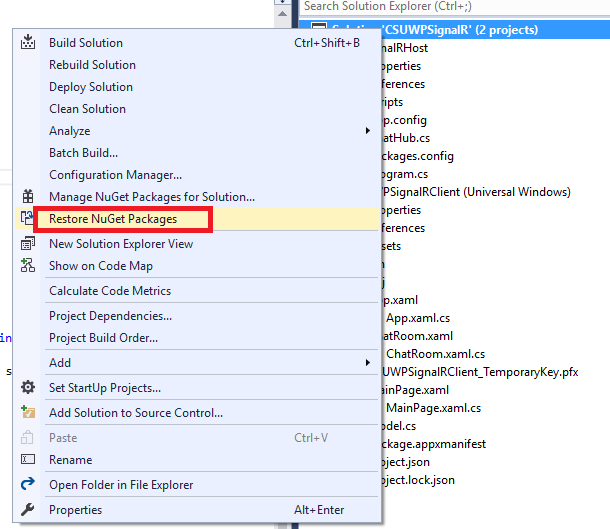
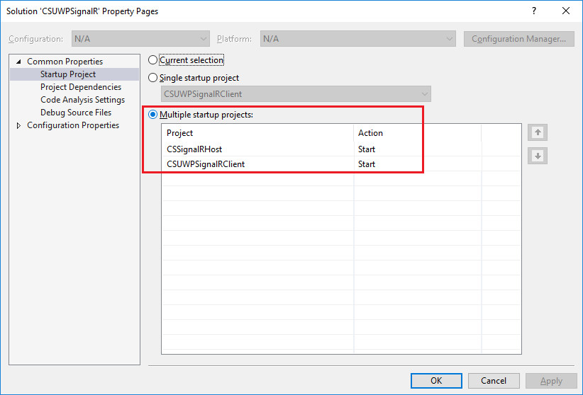
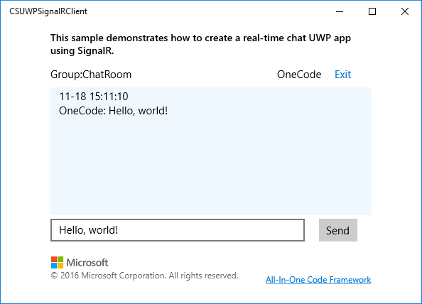

# How to create a real-time chat UWP app using SignalR
## Requires
- Visual Studio 2015
## License
- Apache License, Version 2.0
## Technologies
- SignalR
- ASP.NET SignalR
- OWIN self-hosting
- Universal Windows App Development
- Universal Windows Platform
- UWP
## Topics
- SignalR
- Universal Windows Platform
- UWP
## Updated
- 11/18/2016
## Description

How to create a real-time chat app in Universal Windows Platform using ASP.NET SignalR

Introduction

This sample demonstrates how to create a real-time chat app in Universal Windows Platform using ASP.NET SignalR.

SignalR allows bi-directional communication between server and client. Servers can now push the&nbsp;content to&nbsp;instantly connect clients&nbsp;when it becomes available.

In this sample, we will create a self-host SignalR console app as the server and a UWP app as the client.

Building the sample

This sample should be run in Microsoft Visual Studio 2015 version and Windows 10.

Before you build
the project, make sure you have restored all&nbsp;the packages in
 the project. 

Running the sample

&bull;&nbsp;Open solution in Visual Studio 2015.

&bull;&nbsp;Right-click on the solution, and select Set Startup Projects.... Select the Multiple startup projects radio button, and set both projects' Action to Start.

&bull;&nbsp;Then do one of the following:

&bull;&nbsp;Click the Start Debugging button on the toolbar.

&bull;&nbsp;Click Start Debugging in the Debug menu.

&bull;&nbsp;Press F5.

&bull;&nbsp;Input user name and group name, then click
Join button.

&bull;&nbsp;In the chat page, input messages and then click
Send.

&bull;&nbsp;Click Exit
to exit the chat room.

&nbsp;

Using the code

CSSignalRHost project

ChatHub class

&nbsp;

C#

Edit|Remove

csharp

<pre class="csharp">[HubName(&quot;ChatHub&quot;)]&nbsp;
public&nbsp;class&nbsp;ChatHub&nbsp;:&nbsp;Hub&nbsp;
{&nbsp;
&nbsp;&nbsp;&nbsp;&nbsp;///&nbsp;&lt;summary&gt;&nbsp;
&nbsp;&nbsp;&nbsp;&nbsp;///&nbsp;add&nbsp;connection&nbsp;to&nbsp;group&nbsp;
&nbsp;&nbsp;&nbsp;&nbsp;///&nbsp;&lt;/summary&gt;&nbsp;
&nbsp;&nbsp;&nbsp;&nbsp;///&nbsp;&lt;param&nbsp;name=&quot;groupName&quot;&gt;&lt;/param&gt;&nbsp;
&nbsp;&nbsp;&nbsp;&nbsp;///&nbsp;&lt;returns&gt;&lt;/returns&gt;&nbsp;
&nbsp;&nbsp;&nbsp;&nbsp;public&nbsp;Task&nbsp;JoinGroup(string&nbsp;groupName)&nbsp;
&nbsp;&nbsp;&nbsp;&nbsp;{&nbsp;
&nbsp;&nbsp;&nbsp;&nbsp;&nbsp;&nbsp;&nbsp;&nbsp;return&nbsp;Groups.Add(Context.ConnectionId,&nbsp;groupName);&nbsp;
&nbsp;&nbsp;&nbsp;&nbsp;}&nbsp;
&nbsp;
&nbsp;&nbsp;&nbsp;&nbsp;///&nbsp;&lt;summary&gt;&nbsp;
&nbsp;&nbsp;&nbsp;&nbsp;///&nbsp;remove&nbsp;connection&nbsp;from&nbsp;group&nbsp;
&nbsp;&nbsp;&nbsp;&nbsp;///&nbsp;&lt;/summary&gt;&nbsp;
&nbsp;&nbsp;&nbsp;&nbsp;///&nbsp;&lt;param&nbsp;name=&quot;groupName&quot;&gt;&lt;/param&gt;&nbsp;
&nbsp;&nbsp;&nbsp;&nbsp;///&nbsp;&lt;returns&gt;&lt;/returns&gt;&nbsp;
&nbsp;&nbsp;&nbsp;&nbsp;public&nbsp;Task&nbsp;LeaveGroup(string&nbsp;groupName)&nbsp;
&nbsp;&nbsp;&nbsp;&nbsp;{&nbsp;
&nbsp;&nbsp;&nbsp;&nbsp;&nbsp;&nbsp;&nbsp;&nbsp;return&nbsp;Groups.Remove(Context.ConnectionId,&nbsp;groupName);&nbsp;
&nbsp;&nbsp;&nbsp;&nbsp;}&nbsp;
&nbsp;
&nbsp;&nbsp;&nbsp;&nbsp;///&nbsp;&lt;summary&gt;&nbsp;
&nbsp;&nbsp;&nbsp;&nbsp;///&nbsp;send&nbsp;message&nbsp;to&nbsp;the&nbsp;connections&nbsp;in&nbsp;the&nbsp;group.&nbsp;
&nbsp;&nbsp;&nbsp;&nbsp;///&nbsp;&lt;/summary&gt;&nbsp;
&nbsp;&nbsp;&nbsp;&nbsp;///&nbsp;&lt;param&nbsp;name=&quot;groupName&quot;&gt;&lt;/param&gt;&nbsp;
&nbsp;&nbsp;&nbsp;&nbsp;///&nbsp;&lt;param&nbsp;name=&quot;userName&quot;&gt;&lt;/param&gt;&nbsp;
&nbsp;&nbsp;&nbsp;&nbsp;///&nbsp;&lt;param&nbsp;name=&quot;message&quot;&gt;&lt;/param&gt;&nbsp;
&nbsp;&nbsp;&nbsp;&nbsp;///&nbsp;&lt;param&nbsp;name=&quot;sendTime&quot;&gt;&lt;/param&gt;&nbsp;
&nbsp;&nbsp;&nbsp;&nbsp;public&nbsp;void&nbsp;SendToGroup(string&nbsp;groupName,&nbsp;string&nbsp;userName,&nbsp;string&nbsp;message,&nbsp;DateTime&nbsp;sendTime)&nbsp;
&nbsp;&nbsp;&nbsp;&nbsp;{&nbsp;
&nbsp;&nbsp;&nbsp;&nbsp;&nbsp;&nbsp;&nbsp;&nbsp;Clients.Group(groupName).ReceiveMessage(userName,&nbsp;message,&nbsp;sendTime);&nbsp;
&nbsp;&nbsp;&nbsp;&nbsp;}&nbsp;
&nbsp;&nbsp;&nbsp;&nbsp;
}&nbsp;
</pre>

Startup class

C#

Edit|Remove

csharp

<pre class="csharp">class&nbsp;Startup&nbsp;
{&nbsp;
&nbsp;&nbsp;&nbsp;&nbsp;public&nbsp;void&nbsp;Configuration(IAppBuilder&nbsp;app)&nbsp;
&nbsp;&nbsp;&nbsp;&nbsp;{&nbsp;
&nbsp;&nbsp;&nbsp;&nbsp;&nbsp;&nbsp;&nbsp;&nbsp;app.UseCors(CorsOptions.AllowAll);&nbsp;
&nbsp;&nbsp;&nbsp;&nbsp;&nbsp;&nbsp;&nbsp;&nbsp;app.MapSignalR();&nbsp;
&nbsp;&nbsp;&nbsp;&nbsp;}&nbsp;
}&nbsp;
</pre>

CSUWPSignalRClient

Invoke SignalR method in App()

C#

Edit|Remove

csharp

<pre class="csharp">private&nbsp;void&nbsp;SignalR()&nbsp;
{&nbsp;
&nbsp;&nbsp;&nbsp;&nbsp;//Connect&nbsp;to&nbsp;the&nbsp;url&nbsp;
&nbsp;&nbsp;&nbsp;&nbsp;MyHubConnection&nbsp;=&nbsp;new&nbsp;HubConnection(&quot;http://127.0.0.1:8080&quot;);&nbsp;
&nbsp;&nbsp;&nbsp;&nbsp;//ChatHub&nbsp;is&nbsp;the&nbsp;hub&nbsp;name&nbsp;defined&nbsp;in&nbsp;the&nbsp;host&nbsp;program.&nbsp;
&nbsp;&nbsp;&nbsp;&nbsp;MyHubProxy&nbsp;=&nbsp;MyHubConnection.CreateHubProxy(&quot;ChatHub&quot;);&nbsp;
}&nbsp;
&nbsp;
#endregion&nbsp;
&nbsp;
///&nbsp;&lt;summary&gt;&nbsp;
///&nbsp;Initializes&nbsp;the&nbsp;singleton&nbsp;application&nbsp;object.&nbsp;&nbsp;This&nbsp;is&nbsp;the&nbsp;first&nbsp;line&nbsp;of&nbsp;authored&nbsp;code&nbsp;
///&nbsp;executed,&nbsp;and&nbsp;as&nbsp;such&nbsp;is&nbsp;the&nbsp;logical&nbsp;equivalent&nbsp;of&nbsp;main()&nbsp;or&nbsp;WinMain().&nbsp;
///&nbsp;&lt;/summary&gt;&nbsp;
public&nbsp;App()&nbsp;
{&nbsp;
&nbsp;&nbsp;&nbsp;&nbsp;this.InitializeComponent();&nbsp;
&nbsp;&nbsp;&nbsp;&nbsp;this.Suspending&nbsp;&#43;=&nbsp;OnSuspending;&nbsp;
&nbsp;&nbsp;&nbsp;&nbsp;
&nbsp;&nbsp;&nbsp;&nbsp;//Initialize&nbsp;hub&nbsp;connection.&nbsp;
&nbsp;&nbsp;&nbsp;&nbsp;SignalR();&nbsp;
}&nbsp;
</pre>

Connect to hub and join in the group&nbsp;

C#

Edit|Remove

csharp

<pre class="csharp">private&nbsp;async&nbsp;void&nbsp;btnJoin_Click(object&nbsp;sender,&nbsp;RoutedEventArgs&nbsp;e)&nbsp;
{&nbsp;
&nbsp;&nbsp;&nbsp;&nbsp;btnJoin.IsEnabled&nbsp;=&nbsp;false;&nbsp;
&nbsp;&nbsp;&nbsp;&nbsp;tbxError.Text&nbsp;=&nbsp;string.Empty;&nbsp;
&nbsp;&nbsp;&nbsp;&nbsp;string&nbsp;groupName&nbsp;=&nbsp;tbxGroup.Text.Trim();&nbsp;
&nbsp;&nbsp;&nbsp;&nbsp;string&nbsp;userName&nbsp;=&nbsp;tbxName.Text.Trim();&nbsp;
&nbsp;&nbsp;&nbsp;&nbsp;if&nbsp;(groupName.Length&nbsp;==&nbsp;0&nbsp;||&nbsp;userName.Length&nbsp;==&nbsp;0)&nbsp;
&nbsp;&nbsp;&nbsp;&nbsp;{&nbsp;
&nbsp;&nbsp;&nbsp;&nbsp;&nbsp;&nbsp;&nbsp;&nbsp;tbxError.Text&nbsp;=&nbsp;&quot;Group&nbsp;&amp;&nbsp;user&nbsp;name&nbsp;can't&nbsp;be&nbsp;empty.&quot;;&nbsp;
&nbsp;&nbsp;&nbsp;&nbsp;&nbsp;&nbsp;&nbsp;&nbsp;btnJoin.IsEnabled&nbsp;=&nbsp;true;&nbsp;
&nbsp;&nbsp;&nbsp;&nbsp;&nbsp;&nbsp;&nbsp;&nbsp;return;&nbsp;
&nbsp;&nbsp;&nbsp;&nbsp;}&nbsp;
&nbsp;&nbsp;&nbsp;&nbsp;//Connect&nbsp;to&nbsp;hub&nbsp;
&nbsp;&nbsp;&nbsp;&nbsp;App&nbsp;myApp&nbsp;=&nbsp;(Application.Current&nbsp;as&nbsp;App);&nbsp;
&nbsp;&nbsp;&nbsp;&nbsp;if&nbsp;(myApp.MyHubConnection.State&nbsp;!=&nbsp;ConnectionState.Connected)&nbsp;
&nbsp;&nbsp;&nbsp;&nbsp;{&nbsp;
&nbsp;&nbsp;&nbsp;&nbsp;&nbsp;&nbsp;&nbsp;&nbsp;try&nbsp;
&nbsp;&nbsp;&nbsp;&nbsp;&nbsp;&nbsp;&nbsp;&nbsp;{&nbsp;
&nbsp;&nbsp;&nbsp;&nbsp;&nbsp;&nbsp;&nbsp;&nbsp;&nbsp;&nbsp;&nbsp;&nbsp;await&nbsp;myApp.MyHubConnection.Start();&nbsp;
&nbsp;&nbsp;&nbsp;&nbsp;&nbsp;&nbsp;&nbsp;&nbsp;}&nbsp;
&nbsp;&nbsp;&nbsp;&nbsp;&nbsp;&nbsp;&nbsp;&nbsp;catch&nbsp;
&nbsp;&nbsp;&nbsp;&nbsp;&nbsp;&nbsp;&nbsp;&nbsp;{&nbsp;
&nbsp;&nbsp;&nbsp;&nbsp;&nbsp;&nbsp;&nbsp;&nbsp;&nbsp;&nbsp;&nbsp;&nbsp;tbxError.Text&nbsp;=&nbsp;$&quot;Can't&nbsp;connect&nbsp;to&nbsp;server&nbsp;{myApp.MyHubConnection.Url}&quot;;&nbsp;
&nbsp;&nbsp;&nbsp;&nbsp;&nbsp;&nbsp;&nbsp;&nbsp;&nbsp;&nbsp;&nbsp;&nbsp;btnJoin.IsEnabled&nbsp;=&nbsp;true;&nbsp;
&nbsp;&nbsp;&nbsp;&nbsp;&nbsp;&nbsp;&nbsp;&nbsp;&nbsp;&nbsp;&nbsp;&nbsp;return;&nbsp;
&nbsp;&nbsp;&nbsp;&nbsp;&nbsp;&nbsp;&nbsp;&nbsp;}&nbsp;
&nbsp;&nbsp;&nbsp;&nbsp;}&nbsp;
&nbsp;&nbsp;&nbsp;&nbsp;//join&nbsp;to&nbsp;group&nbsp;
&nbsp;&nbsp;&nbsp;&nbsp;if&nbsp;(myApp.MyHubConnection.State&nbsp;==&nbsp;Microsoft.AspNet.SignalR.Client.ConnectionState.Connected)&nbsp;
&nbsp;&nbsp;&nbsp;&nbsp;{&nbsp;
&nbsp;&nbsp;&nbsp;&nbsp;&nbsp;&nbsp;&nbsp;&nbsp;await&nbsp;myApp.MyHubProxy.Invoke(&quot;JoinGroup&quot;,&nbsp;groupName);&nbsp;
&nbsp;&nbsp;&nbsp;&nbsp;&nbsp;&nbsp;&nbsp;&nbsp;dynamic&nbsp;info&nbsp;=&nbsp;new&nbsp;{&nbsp;groupName&nbsp;=&nbsp;groupName,&nbsp;userName&nbsp;=&nbsp;userName&nbsp;};&nbsp;
&nbsp;&nbsp;&nbsp;&nbsp;&nbsp;&nbsp;&nbsp;&nbsp;Frame.Navigate(typeof(ChatRoom),&nbsp;info);&nbsp;
&nbsp;&nbsp;&nbsp;&nbsp;}&nbsp;
&nbsp;&nbsp;&nbsp;&nbsp;else&nbsp;
&nbsp;&nbsp;&nbsp;&nbsp;{&nbsp;
&nbsp;&nbsp;&nbsp;&nbsp;&nbsp;&nbsp;&nbsp;&nbsp;tbxError.Text&nbsp;=&nbsp;$&quot;Can't&nbsp;connect&nbsp;to&nbsp;server&nbsp;{myApp.MyHubConnection.Url}&quot;;&nbsp;
&nbsp;&nbsp;&nbsp;&nbsp;}&nbsp;
&nbsp;&nbsp;&nbsp;&nbsp;btnJoin.IsEnabled&nbsp;=&nbsp;true;&nbsp;
}&nbsp;
</pre>

Receive message handler

C#

Edit|Remove

csharp

<pre class="csharp">private&nbsp;async&nbsp;void&nbsp;ReceiveMessage(string&nbsp;userName,&nbsp;string&nbsp;message,DateTime&nbsp;sendTime)&nbsp;
{&nbsp;
&nbsp;&nbsp;&nbsp;&nbsp;await&nbsp;Windows.ApplicationModel.Core.CoreApplication.MainView.Dispatcher.RunAsync(CoreDispatcherPriority.Normal,&nbsp;()&nbsp;=&gt;&nbsp;
&nbsp;&nbsp;&nbsp;&nbsp;{&nbsp;
&nbsp;&nbsp;&nbsp;&nbsp;&nbsp;&nbsp;&nbsp;&nbsp;this.lvwMessages.Items.Add($&quot;{sendTime.ToString(&quot;MM-dd&nbsp;HH:mm:ss&quot;)}\n{userName}:&nbsp;{message}&quot;);&nbsp;
&nbsp;&nbsp;&nbsp;&nbsp;});&nbsp;
}&nbsp;</pre>

&nbsp;

More information

<a href="https://www.asp.net/signalr/overview/getting-started">ASP.NET SignalR</a>

&nbsp;

Microsoft All-In-One Code Framework is a free, centralized code sample library driven by developers' real-world pains and needs. The goal is to provide customer-driven code samples for all Microsoft development technologies,
 and reduce developers' efforts in solving typical programming tasks. Our team listens to developers&rsquo; pains in the MSDN forums, social media and various DEV communities. We write code samples based on developers&rsquo; frequently asked programming tasks,
 and allow developers to download them with a short sample publishing cycle. Additionally, we offer a free code sample request service. It is a proactive way for our developer community to obtain code samples directly from Microsoft.

