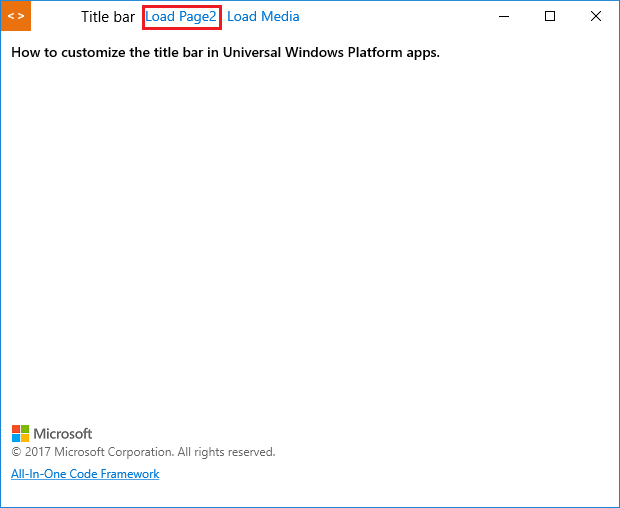
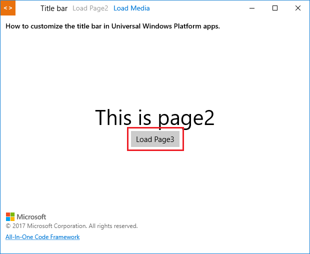
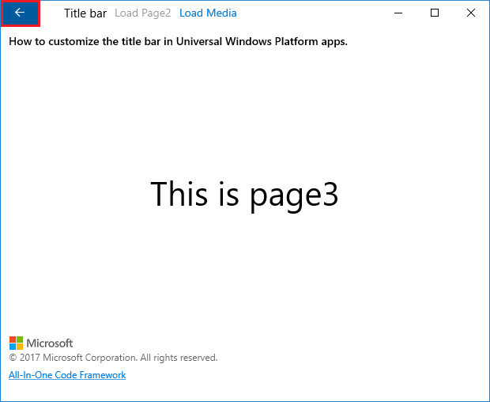
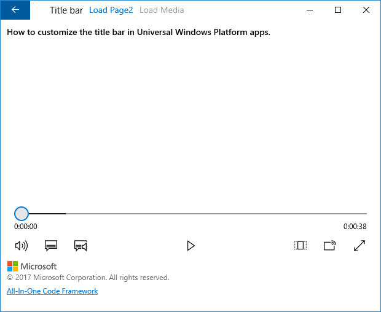
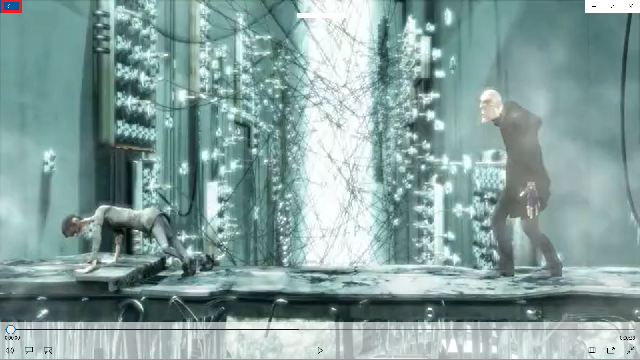

# How to customize the title bar in Universal Windows Platform apps
## Requires
- Visual Studio 2017
## License
- Apache License, Version 2.0
## Technologies
- C#
- title bar
- Universal Windows App Development
- Universal Windows Platform
- UWP
## Topics
- C#
- title bar
- Universal Windows Platform
- UWP
## Updated
- 04/28/2017
## Description

&nbsp;How
to customize the title bar in Universal
 Windows Platform apps

Introduction

This sample demonstrates how to customize the title bar in Universal Windows Platform apps.

&nbsp;

Sample prerequisites

&bull;&nbsp;Visual Studio 2017 or above [<a href="https://www.visualstudio.com/" style="text-decoration:none">Visual
 Studio Home Page</a>]

Building the sample

&bull;&nbsp;Open the sample solution &ldquo;CSUWPCustomTitleBar.sln&rdquo;
 using Visual Studio

&bull;&nbsp;Right click the project &ldquo;CSUWPCustomTitleBar&rdquo;
 and select Restore Packages

&bull;&nbsp;Press
F6 Key or select
Build -&gt; Build Solution from the menu to build the sample.

Running the sample

&bull;&nbsp;Open the sample solution using Visual Studio,
select Local Machine in the tool bar
then press F5 Key or select <strong>Debug -&gt; Start Debugging
</strong>from the menu.

&bull;&nbsp;Click
LoadPage2 on the title bar.

&bull;&nbsp;Click
Load Page3 in the center. Back button on the title bar will be visible.

&bull;&nbsp;Click
Back button on the left top. It will be back to Page2.

&bull;&nbsp;Click
Load Media on the title bar.

&bull;&nbsp;Set full screen for the media.

&bull;&nbsp;On the top, you can see the
Back button is visible.&nbsp;

 

Using the code

BackRequest

C#

Edit|Remove

csharp

<pre class="csharp">private&nbsp;void&nbsp;MainPage_BackRequested(object&nbsp;sender,&nbsp;BackRequestedEventArgs&nbsp;e)&nbsp;
{&nbsp;
&nbsp;&nbsp;&nbsp;&nbsp;if&nbsp;(this.Frame&nbsp;!=&nbsp;null&nbsp;&amp;&amp;&nbsp;!e.Handled)&nbsp;
&nbsp;&nbsp;&nbsp;&nbsp;{&nbsp;
&nbsp;&nbsp;&nbsp;&nbsp;&nbsp;&nbsp;&nbsp;&nbsp;if&nbsp;(this.ContentFrame&nbsp;!=&nbsp;null&nbsp;&amp;&amp;&nbsp;this.ContentFrame.CanGoBack)&nbsp;
&nbsp;&nbsp;&nbsp;&nbsp;&nbsp;&nbsp;&nbsp;&nbsp;{&nbsp;
&nbsp;&nbsp;&nbsp;&nbsp;&nbsp;&nbsp;&nbsp;&nbsp;&nbsp;&nbsp;&nbsp;&nbsp;this.ContentFrame.GoBack();&nbsp;
&nbsp;&nbsp;&nbsp;&nbsp;&nbsp;&nbsp;&nbsp;&nbsp;&nbsp;&nbsp;&nbsp;&nbsp;e.Handled&nbsp;=&nbsp;true;&nbsp;
&nbsp;&nbsp;&nbsp;&nbsp;&nbsp;&nbsp;&nbsp;&nbsp;}&nbsp;
&nbsp;&nbsp;&nbsp;&nbsp;&nbsp;&nbsp;&nbsp;&nbsp;else&nbsp;if&nbsp;(this.Frame.CanGoBack)&nbsp;
&nbsp;&nbsp;&nbsp;&nbsp;&nbsp;&nbsp;&nbsp;&nbsp;{&nbsp;
&nbsp;&nbsp;&nbsp;&nbsp;&nbsp;&nbsp;&nbsp;&nbsp;&nbsp;&nbsp;&nbsp;&nbsp;this.Frame.GoBack();&nbsp;
&nbsp;&nbsp;&nbsp;&nbsp;&nbsp;&nbsp;&nbsp;&nbsp;&nbsp;&nbsp;&nbsp;&nbsp;e.Handled&nbsp;=&nbsp;true;&nbsp;
&nbsp;&nbsp;&nbsp;&nbsp;&nbsp;&nbsp;&nbsp;&nbsp;}&nbsp;
&nbsp;&nbsp;&nbsp;&nbsp;}&nbsp;
}</pre>

Load titile bar

C#

Edit|Remove

csharp

<pre class="csharp">private&nbsp;void&nbsp;LoadCustomTitleBar()&nbsp;
{&nbsp;
&nbsp;&nbsp;&nbsp;&nbsp;var&nbsp;titleBar&nbsp;=&nbsp;Windows.ApplicationModel.Core.CoreApplication.GetCurrentView().TitleBar;&nbsp;
&nbsp;&nbsp;&nbsp;&nbsp;titleBar.ExtendViewIntoTitleBar&nbsp;=&nbsp;true;&nbsp;
&nbsp;&nbsp;&nbsp;&nbsp;Window.Current.SetTitleBar(BackgroundRect);&nbsp;
}</pre>

Update back button

C#

Edit|Remove

csharp

<pre class="csharp">private&nbsp;void&nbsp;UpdateBackButton()&nbsp;
{&nbsp;
&nbsp;&nbsp;&nbsp;&nbsp;if&nbsp;((this.Frame&nbsp;!=&nbsp;null&nbsp;&amp;&amp;&nbsp;this.Frame.CanGoBack)&nbsp;||&nbsp;(this.ContentFrame&nbsp;!=&nbsp;null&nbsp;&amp;&amp;&nbsp;this.ContentFrame.CanGoBack)&nbsp;||&nbsp;ApplicationView.GetForCurrentView().IsFullScreenMode)&nbsp;
&nbsp;&nbsp;&nbsp;&nbsp;{&nbsp;
&nbsp;&nbsp;&nbsp;&nbsp;&nbsp;&nbsp;&nbsp;&nbsp;Windows.UI.Core.SystemNavigationManager.GetForCurrentView().AppViewBackButtonVisibility&nbsp;=&nbsp;Windows.UI.Core.AppViewBackButtonVisibility.Visible;&nbsp;
&nbsp;&nbsp;&nbsp;&nbsp;&nbsp;&nbsp;&nbsp;&nbsp;this.imgLogo.Visibility&nbsp;=&nbsp;Visibility.Collapsed;&nbsp;
&nbsp;&nbsp;&nbsp;&nbsp;}&nbsp;
&nbsp;&nbsp;&nbsp;&nbsp;else&nbsp;
&nbsp;&nbsp;&nbsp;&nbsp;{&nbsp;
&nbsp;&nbsp;&nbsp;&nbsp;&nbsp;&nbsp;&nbsp;&nbsp;Windows.UI.Core.SystemNavigationManager.GetForCurrentView().AppViewBackButtonVisibility&nbsp;=&nbsp;Windows.UI.Core.AppViewBackButtonVisibility.Collapsed;&nbsp;
&nbsp;&nbsp;&nbsp;&nbsp;&nbsp;&nbsp;&nbsp;&nbsp;this.imgLogo.Visibility&nbsp;=&nbsp;Visibility.Visible;&nbsp;
&nbsp;&nbsp;&nbsp;&nbsp;}&nbsp;
}</pre>

More information

<a href="https://docs.microsoft.com/en-us/uwp/api/windows.applicationmodel.core.coreapplicationviewtitlebar">CoreApplicationViewTitleBar</a>

<a href="https://docs.microsoft.com/en-us/uwp/api/Windows.UI.Xaml.Window" style="text-decoration:none">SetTitleBar</a>

Microsoft All-In-One Code Framework is a free, centralized code sample library driven by developers' real-world pains and needs. The goal is to provide customer-driven code samples for all Microsoft development technologies,
 and reduce developers' efforts in solving typical programming tasks. Our team listens to developers&rsquo; pains in the MSDN forums, social media and various DEV communities. We write code samples based on developers&rsquo; frequently asked programming tasks,
 and allow developers to download them with a short sample publishing cycle. Additionally, we offer a free code sample request service. It is a proactive way for our developer community to obtain code samples directly from Microsoft.

