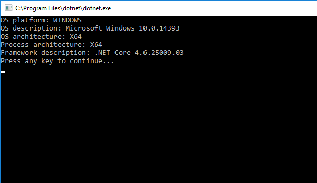

# How to determine operating system version in .NET  Core
## Requires
- Visual Studio 2017
## License
- Apache License, Version 2.0
## Technologies
- .NET
- .NET Core
## Topics
- OS
- Version
- .NET Core
## Updated
- 03/30/2017
## Description

How
to
determine operating system version in .NET Core

Introduction

This sample demonstrates how to determine operating system version in .NET Core.

&nbsp;

Sample prerequisites

&bull;&nbsp;Visual Studio 2017 or above [<a href="https://www.visualstudio.com/" style="text-decoration:none">Visual
 Studio Home Page</a>]

Building the sample

&bull;&nbsp;Open the sample solution &ldquo;CSNETCoreOSVersion.sln&rdquo;
 using Visual Studio

&bull;&nbsp;Right click the project &ldquo;CSNETCoreOSVersion&rdquo;
 and select Restore Packages

&bull;&nbsp;Press
F6 Key or select
Build -&gt; Build Solution from the menu to build the sample.

Running the sample

&bull;&nbsp;Open the sample solution using Visual Studio, then press F5 Key or select Debug -&gt; Start
 Debugging from the menu.

&nbsp;

Using the code

Program.cs :

&nbsp;

C#

Edit|Remove

csharp

<pre class="csharp">///&nbsp;&lt;summary&gt;&nbsp;
///&nbsp;Get&nbsp;OS&nbsp;platform&nbsp;
///&nbsp;&lt;/summary&gt;&nbsp;
///&nbsp;&lt;returns&gt;&lt;/returns&gt;&nbsp;
public&nbsp;static&nbsp;OSPlatform&nbsp;GetOSPlatform()&nbsp;
{&nbsp;
&nbsp;&nbsp;&nbsp;&nbsp;OSPlatform&nbsp;osPlatform&nbsp;=&nbsp;OSPlatform.Create(&quot;Other&nbsp;Platform&quot;);&nbsp;
&nbsp;&nbsp;&nbsp;&nbsp;//&nbsp;Check&nbsp;if&nbsp;it's&nbsp;windows&nbsp;
&nbsp;&nbsp;&nbsp;&nbsp;bool&nbsp;isWindows&nbsp;=&nbsp;RuntimeInformation.IsOSPlatform(OSPlatform.Windows);&nbsp;
&nbsp;&nbsp;&nbsp;&nbsp;osPlatform&nbsp;=&nbsp;isWindows&nbsp;?&nbsp;OSPlatform.Windows&nbsp;:&nbsp;osPlatform;&nbsp;
&nbsp;&nbsp;&nbsp;&nbsp;//&nbsp;Check&nbsp;if&nbsp;it's&nbsp;osx&nbsp;
&nbsp;&nbsp;&nbsp;&nbsp;bool&nbsp;isOSX&nbsp;=&nbsp;RuntimeInformation.IsOSPlatform(OSPlatform.OSX);&nbsp;
&nbsp;&nbsp;&nbsp;&nbsp;osPlatform&nbsp;=&nbsp;isOSX&nbsp;?&nbsp;OSPlatform.OSX&nbsp;:&nbsp;osPlatform;&nbsp;
&nbsp;&nbsp;&nbsp;&nbsp;//&nbsp;Check&nbsp;if&nbsp;it's&nbsp;Linux&nbsp;
&nbsp;&nbsp;&nbsp;&nbsp;bool&nbsp;isLinux&nbsp;=&nbsp;RuntimeInformation.IsOSPlatform(OSPlatform.Linux);&nbsp;
&nbsp;&nbsp;&nbsp;&nbsp;osPlatform&nbsp;=&nbsp;isLinux&nbsp;?&nbsp;OSPlatform.Linux&nbsp;:&nbsp;osPlatform;&nbsp;
&nbsp;&nbsp;&nbsp;&nbsp;return&nbsp;osPlatform;&nbsp;
}&nbsp;</pre>

&nbsp;

More information

<a href="https://docs.microsoft.com/de-de/dotnet/core/api/system.runtime.interopservices.runtimeinformation">RuntimeInformation class</a>

Microsoft All-In-One Code Framework is a free, centralized code sample library driven by developers' real-world pains and needs. The goal is to provide customer-driven code samples for all Microsoft development technologies,
 and reduce developers' efforts in solving typical programming tasks. Our team listens to developers&rsquo; pains in the MSDN forums, social media and various DEV communities. We write code samples based on developers&rsquo; frequently asked programming tasks,
 and allow developers to download them with a short sample publishing cycle. Additionally, we offer a free code sample request service. It is a proactive way for our developer community to obtain code samples directly from Microsoft.

