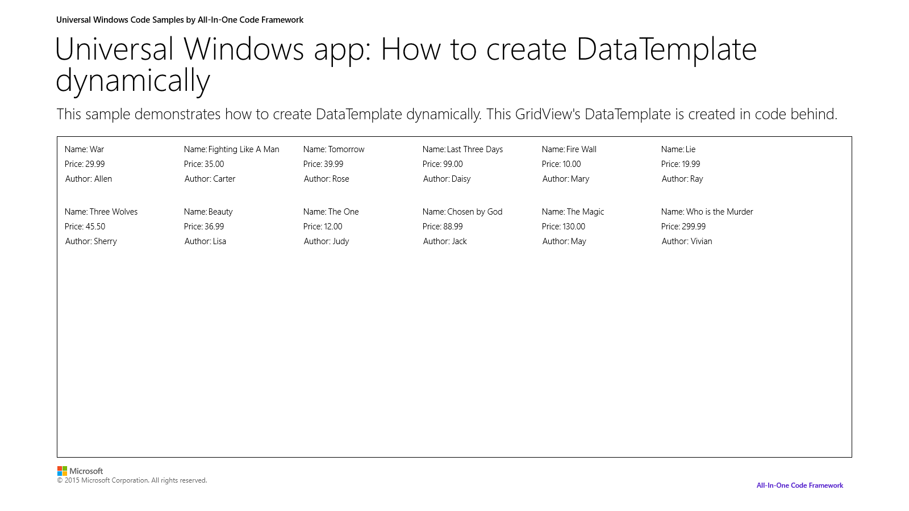

# How to dynamically create DataTemplate in universal Windows apps
## Requires
- Visual Studio 2013
## License
- Apache License, Version 2.0
## Technologies
- Windows
- Windows 8
- Windows Phone 8
- Windows Store app
- Windows Store app Development
- Windows Phone Development
- Windows 8.1
- Windows Phone 8.1
## Topics
- DataTemplate
- universal app
## Updated
- 09/22/2016
## Description

<h1>

<strong>&nbsp;</strong><em>&nbsp;</em>

</h1>
<h1>How to create DataTemplate dynamically in universal Windows apps</h1>
<h2>Introduction</h2>

This sample is upgraded from the Windows Store sample:

<a href="https://code.msdn.microsoft.com/How-to-dynamically-875a548e">https://code.msdn.microsoft.com/How-to-dynamically-875a548e</a> (C#)

<a href="https://code.msdn.microsoft.com/How-to-dynamically-1fc09032">https://code.msdn.microsoft.com/How-to-dynamically-1fc09032</a> (VB)

We demonstrate how to create DataTemplate dynamically in universal Windows apps. The GridView&rsquo;s ItemTemplate is created in code behind.

<h2>Building the Sample</h2>

1.&nbsp;&nbsp;&nbsp;&nbsp;&nbsp;&nbsp;&nbsp;Start Visual Studio 2013 and select File &gt; Open &gt; Project/Solution.

2.&nbsp;&nbsp;&nbsp;&nbsp;&nbsp;&nbsp;&nbsp;Go to the directory in which you download the sample. Go to the directory named for the sample, and double-click the Microsoft Visual Studio Solution (.sln) file.

3.&nbsp;&nbsp;&nbsp;&nbsp;&nbsp;&nbsp;&nbsp;Press F7 or use Build &gt; Build Solution to build the sample.

<h2>Running the Sample</h2>
<ol>
<li>Press F5 to debug the app, this screen will be displayed. The GridView&rsquo;s ItemTemplate is created in code behind.
</li></ol>

&nbsp;

&nbsp;

<h2>Using the Code</h2>

The code below shows how to create DataTemplate in code-behind and assign it to GridView control.

<pre>

C#C&#43;&#43;

Edit|Remove
csharpcplusplus

<pre class="csharp">StringBuilder&nbsp;sb&nbsp;=&nbsp;new&nbsp;StringBuilder();&nbsp;
&nbsp;&nbsp;
sb.Append(&quot;&lt;DataTemplate&nbsp;xmlns=\&quot;http://schemas.microsoft.com/winfx/2006/xaml/presentation\&quot;&gt;&quot;);&nbsp;
sb.Append(&quot;&lt;Grid&nbsp;Width=\&quot;200\&quot;&nbsp;Height=\&quot;100\&quot;&gt;&quot;);&nbsp;
sb.Append(&quot;&lt;StackPanel&gt;&quot;);&nbsp;
sb.Append(&quot;&lt;StackPanel&nbsp;Orientation=\&quot;Horizontal\&quot;&nbsp;Margin=\&quot;3,3,0,3\&quot;&gt;&lt;TextBlock&nbsp;Text=\&quot;Name:\&quot;&nbsp;Style=\&quot;{StaticResource&nbsp;AppBodyTextStyle}\&quot;&nbsp;Margin=\&quot;0,0,5,0\&quot;/&gt;&lt;TextBlock&nbsp;Text=\&quot;{Binding&nbsp;Name}\&quot;&nbsp;Style=\&quot;{StaticResource&nbsp;AppBodyTextStyle}\&quot;/&gt;&lt;/StackPanel&gt;&quot;);&nbsp;
sb.Append(&quot;&lt;StackPanel&nbsp;Orientation=\&quot;Horizontal\&quot;&nbsp;Margin=\&quot;3,3,0,3\&quot;&gt;&lt;TextBlock&nbsp;Text=\&quot;Price:\&quot;&nbsp;Style=\&quot;{StaticResource&nbsp;AppBodyTextStyle}\&quot;&nbsp;Margin=\&quot;0,0,5,0\&quot;/&gt;&lt;TextBlock&nbsp;Text=\&quot;{Binding&nbsp;Price}\&quot;&nbsp;Style=\&quot;{StaticResource&nbsp;AppBodyTextStyle}\&quot;/&gt;&lt;/StackPanel&gt;&quot;);&nbsp;
sb.Append(&quot;&lt;StackPanel&nbsp;Orientation=\&quot;Horizontal\&quot;&nbsp;Margin=\&quot;3,3,0,3\&quot;&gt;&lt;TextBlock&nbsp;Text=\&quot;Author:\&quot;&nbsp;Style=\&quot;{StaticResource&nbsp;AppBodyTextStyle}\&quot;&nbsp;Margin=\&quot;0,0,5,0\&quot;/&gt;&lt;TextBlock&nbsp;Text=\&quot;{Binding&nbsp;Author}\&quot;&nbsp;Style=\&quot;{StaticResource&nbsp;AppBodyTextStyle}\&quot;/&gt;&lt;/StackPanel&gt;&quot;);&nbsp;
sb.Append(&quot;&lt;/StackPanel&gt;&quot;);&nbsp;
sb.Append(&quot;&lt;/Grid&gt;&quot;);&nbsp;
sb.Append(&quot;&lt;/DataTemplate&gt;&quot;);&nbsp;
&nbsp;&nbsp;
DataTemplate&nbsp;datatemplate&nbsp;=&nbsp;(DataTemplate)XamlReader.Load(sb.ToString());&nbsp;
BookGridView.ItemTemplate&nbsp;=&nbsp;datatemplate;&nbsp;
BookListView.ItemTemplate&nbsp;=&nbsp;datatemplate;</pre>

</pre>
<h2>More Information</h2>

XamlReader class

<a href="http://msdn.microsoft.com/en-us/library/windows/apps/windows.ui.xaml.markup.xamlreader">http://msdn.microsoft.com/en-us/library/windows/apps/windows.ui.xaml.markup.xamlreader</a>

&nbsp;

XamlReader.Load method

<a href="http://msdn.microsoft.com/en-us/library/windows/apps/windows.ui.xaml.markup.xamlreader.load">http://msdn.microsoft.com/en-us/library/windows/apps/windows.ui.xaml.markup.xamlreader.load</a>

&nbsp;

DataTemplate class

<a href="http://msdn.microsoft.com/en-us/library/windows/apps/windows.ui.xaml.datatemplate">http://msdn.microsoft.com/en-us/library/windows/apps/windows.ui.xaml.datatemplate</a>

&nbsp;

GridView class

<a href="http://msdn.microsoft.com/en-us/library/windows/apps/windows.ui.xaml.controls.gridview.aspx">http://msdn.microsoft.com/en-us/library/windows/apps/windows.ui.xaml.controls.gridview.aspx</a>

