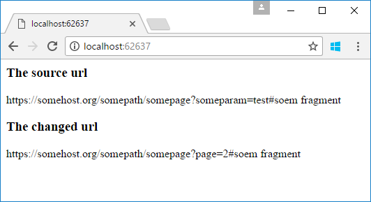

# How to edit QueryString in ASP.NET Core
## Requires
- Visual Studio 2017
## License
- Apache License, Version 2.0
## Technologies
- ASP.NET
- .NET
- Web App Development
## Topics
- querystring
- ASP.NET Core
## Updated
- 06/02/2017
## Description

How to edit QueryString in ASP.NET Core

Introduction

This sample demonstrates how to edit QueryString in ASP.NET Core.

Sample prerequisites

&bull;&nbsp;Visual Studio 2017 or above. [<a href="https://www.visualstudio.com/" style="text-decoration:none">Visual
 Studio Home Page</a>]

&bull;&nbsp;Visual Studio enabled ASP.NET Core develop component.

Building the sample

Use Visual Studio to open the sample solution CSEditQueryStringAspNetCore, then press F6 Key to build the sample project.

Running the sample

&bull;&nbsp;Use Visual Studio to open the sample solution
CSEditQueryStringAspNetCore, then press F5 Key or select
<strong>Debugging </strong>from the menu.

&bull;&nbsp;When the project is running, you will see the below page in browser.

Using the code

QueryParameterEditor.cs

&nbsp;

C#

Edit|Remove

csharp
<pre class="hidden">    public class QueryParameterEditor
    {
        private List&lt;QueryParameter&gt; _querys = new List&lt;QueryParameter&gt;();

        public string Authority { get; set; }
        public string QueryString
        {
            get
            {
                return string.Join(&quot;&amp;&quot;, _querys);
            }
        }

        public string Fragment { get; set; }

        public string[] AllKeys
        {
            get
            {
                return _querys.Select(m =&gt; m.Key).ToArray();
            }
        }

        public string this[string key]
        {
            get
            {
                var param = _querys.FirstOrDefault(m =&gt; m.Key.Equals(key, StringComparison.CurrentCultureIgnoreCase));
                return param == null ? null : param.Value;
            }
            set { SetQueryParam(key, value); }
        }

        public QueryParameterEditor(string uriString)
        {
            string authority, queryString, fragment;
            uriString.CutStringByFirstKey(&quot;?&quot;, out authority, out queryString);

            queryString.CutStringByFirstKey(&quot;#&quot;, out queryString, out fragment);

            Authority = authority;
            InitParameters(queryString);
            Fragment = fragment;
        }

        public QueryParameterEditor SetQueryParam(string key, string value)
        {
            var param = new QueryParameter { Key = key, Value = value };

            SetQueryParam(param);

            return this;
        }

        public QueryParameterEditor SetQueryParam(params QueryParameter[] parameters)
        {
            foreach (var item in parameters)
            {
                var queryParam = _querys.FirstOrDefault(m =&gt; m.Key.Equals(item.Key, StringComparison.CurrentCultureIgnoreCase));
                if (queryParam == null)
                {
                    _querys.Add(item);
                }
                else
                {
                    queryParam.Value = item.Value;
                }
            }

            return this;
        }

        public QueryParameterEditor RemoveQueryParam(params string[] keys)
        {
            foreach (var key in keys)
            {
                var queryParam = _querys.FirstOrDefault(m =&gt; m.Key == key);
                _querys.Remove(queryParam);
            }
            return this;
        }

        public override string ToString()
        {
            return Authority &#43;
                (string.IsNullOrEmpty(QueryString) ? &quot;&quot; : $&quot;?{QueryString}&quot;) &#43;
                (string.IsNullOrEmpty(Fragment) ? &quot;&quot; : $&quot;#{Fragment}&quot;);
        }

        private void InitParameters(string queryString)
        {
            string[] queryArr = queryString.Split('&amp;');
            foreach (var item in queryArr)
            {
                if (!string.IsNullOrEmpty(item))
                {
                    string key, value;
                    item.CutStringByFirstKey(&quot;=&quot;, out key, out value);
                    _querys.Add(new QueryParameter { Key = key, Value = value });
                }
            }
        }
    }

    public class QueryParameter
    {
        public string Key { get; set; }

        public string Value { get; set; }

        public override string ToString()
        {
            return $&quot;{Key}={Value}&quot;;
        }
    }
</pre>

<pre class="csharp">&nbsp;&nbsp;&nbsp;&nbsp;public&nbsp;class&nbsp;QueryParameterEditor&nbsp;
&nbsp;&nbsp;&nbsp;&nbsp;{&nbsp;
&nbsp;&nbsp;&nbsp;&nbsp;&nbsp;&nbsp;&nbsp;&nbsp;private&nbsp;List&lt;QueryParameter&gt;&nbsp;_querys&nbsp;=&nbsp;new&nbsp;List&lt;QueryParameter&gt;();&nbsp;
&nbsp;
&nbsp;&nbsp;&nbsp;&nbsp;&nbsp;&nbsp;&nbsp;&nbsp;public&nbsp;string&nbsp;Authority&nbsp;{&nbsp;get;&nbsp;set;&nbsp;}&nbsp;
&nbsp;&nbsp;&nbsp;&nbsp;&nbsp;&nbsp;&nbsp;&nbsp;public&nbsp;string&nbsp;QueryString&nbsp;
&nbsp;&nbsp;&nbsp;&nbsp;&nbsp;&nbsp;&nbsp;&nbsp;{&nbsp;
&nbsp;&nbsp;&nbsp;&nbsp;&nbsp;&nbsp;&nbsp;&nbsp;&nbsp;&nbsp;&nbsp;&nbsp;get&nbsp;
&nbsp;&nbsp;&nbsp;&nbsp;&nbsp;&nbsp;&nbsp;&nbsp;&nbsp;&nbsp;&nbsp;&nbsp;{&nbsp;
&nbsp;&nbsp;&nbsp;&nbsp;&nbsp;&nbsp;&nbsp;&nbsp;&nbsp;&nbsp;&nbsp;&nbsp;&nbsp;&nbsp;&nbsp;&nbsp;return&nbsp;string.Join(&quot;&amp;&quot;,&nbsp;_querys);&nbsp;
&nbsp;&nbsp;&nbsp;&nbsp;&nbsp;&nbsp;&nbsp;&nbsp;&nbsp;&nbsp;&nbsp;&nbsp;}&nbsp;
&nbsp;&nbsp;&nbsp;&nbsp;&nbsp;&nbsp;&nbsp;&nbsp;}&nbsp;
&nbsp;
&nbsp;&nbsp;&nbsp;&nbsp;&nbsp;&nbsp;&nbsp;&nbsp;public&nbsp;string&nbsp;Fragment&nbsp;{&nbsp;get;&nbsp;set;&nbsp;}&nbsp;
&nbsp;
&nbsp;&nbsp;&nbsp;&nbsp;&nbsp;&nbsp;&nbsp;&nbsp;public&nbsp;string[]&nbsp;AllKeys&nbsp;
&nbsp;&nbsp;&nbsp;&nbsp;&nbsp;&nbsp;&nbsp;&nbsp;{&nbsp;
&nbsp;&nbsp;&nbsp;&nbsp;&nbsp;&nbsp;&nbsp;&nbsp;&nbsp;&nbsp;&nbsp;&nbsp;get&nbsp;
&nbsp;&nbsp;&nbsp;&nbsp;&nbsp;&nbsp;&nbsp;&nbsp;&nbsp;&nbsp;&nbsp;&nbsp;{&nbsp;
&nbsp;&nbsp;&nbsp;&nbsp;&nbsp;&nbsp;&nbsp;&nbsp;&nbsp;&nbsp;&nbsp;&nbsp;&nbsp;&nbsp;&nbsp;&nbsp;return&nbsp;_querys.Select(m&nbsp;=&gt;&nbsp;m.Key).ToArray();&nbsp;
&nbsp;&nbsp;&nbsp;&nbsp;&nbsp;&nbsp;&nbsp;&nbsp;&nbsp;&nbsp;&nbsp;&nbsp;}&nbsp;
&nbsp;&nbsp;&nbsp;&nbsp;&nbsp;&nbsp;&nbsp;&nbsp;}&nbsp;
&nbsp;
&nbsp;&nbsp;&nbsp;&nbsp;&nbsp;&nbsp;&nbsp;&nbsp;public&nbsp;string&nbsp;this[string&nbsp;key]&nbsp;
&nbsp;&nbsp;&nbsp;&nbsp;&nbsp;&nbsp;&nbsp;&nbsp;{&nbsp;
&nbsp;&nbsp;&nbsp;&nbsp;&nbsp;&nbsp;&nbsp;&nbsp;&nbsp;&nbsp;&nbsp;&nbsp;get&nbsp;
&nbsp;&nbsp;&nbsp;&nbsp;&nbsp;&nbsp;&nbsp;&nbsp;&nbsp;&nbsp;&nbsp;&nbsp;{&nbsp;
&nbsp;&nbsp;&nbsp;&nbsp;&nbsp;&nbsp;&nbsp;&nbsp;&nbsp;&nbsp;&nbsp;&nbsp;&nbsp;&nbsp;&nbsp;&nbsp;var&nbsp;param&nbsp;=&nbsp;_querys.FirstOrDefault(m&nbsp;=&gt;&nbsp;m.Key.Equals(key,&nbsp;StringComparison.CurrentCultureIgnoreCase));&nbsp;
&nbsp;&nbsp;&nbsp;&nbsp;&nbsp;&nbsp;&nbsp;&nbsp;&nbsp;&nbsp;&nbsp;&nbsp;&nbsp;&nbsp;&nbsp;&nbsp;return&nbsp;param&nbsp;==&nbsp;null&nbsp;?&nbsp;null&nbsp;:&nbsp;param.Value;&nbsp;
&nbsp;&nbsp;&nbsp;&nbsp;&nbsp;&nbsp;&nbsp;&nbsp;&nbsp;&nbsp;&nbsp;&nbsp;}&nbsp;
&nbsp;&nbsp;&nbsp;&nbsp;&nbsp;&nbsp;&nbsp;&nbsp;&nbsp;&nbsp;&nbsp;&nbsp;set&nbsp;{&nbsp;SetQueryParam(key,&nbsp;value);&nbsp;}&nbsp;
&nbsp;&nbsp;&nbsp;&nbsp;&nbsp;&nbsp;&nbsp;&nbsp;}&nbsp;
&nbsp;
&nbsp;&nbsp;&nbsp;&nbsp;&nbsp;&nbsp;&nbsp;&nbsp;public&nbsp;QueryParameterEditor(string&nbsp;uriString)&nbsp;
&nbsp;&nbsp;&nbsp;&nbsp;&nbsp;&nbsp;&nbsp;&nbsp;{&nbsp;
&nbsp;&nbsp;&nbsp;&nbsp;&nbsp;&nbsp;&nbsp;&nbsp;&nbsp;&nbsp;&nbsp;&nbsp;string&nbsp;authority,&nbsp;queryString,&nbsp;fragment;&nbsp;
&nbsp;&nbsp;&nbsp;&nbsp;&nbsp;&nbsp;&nbsp;&nbsp;&nbsp;&nbsp;&nbsp;&nbsp;uriString.CutStringByFirstKey(&quot;?&quot;,&nbsp;out&nbsp;authority,&nbsp;out&nbsp;queryString);&nbsp;
&nbsp;
&nbsp;&nbsp;&nbsp;&nbsp;&nbsp;&nbsp;&nbsp;&nbsp;&nbsp;&nbsp;&nbsp;&nbsp;queryString.CutStringByFirstKey(&quot;#&quot;,&nbsp;out&nbsp;queryString,&nbsp;out&nbsp;fragment);&nbsp;
&nbsp;
&nbsp;&nbsp;&nbsp;&nbsp;&nbsp;&nbsp;&nbsp;&nbsp;&nbsp;&nbsp;&nbsp;&nbsp;Authority&nbsp;=&nbsp;authority;&nbsp;
&nbsp;&nbsp;&nbsp;&nbsp;&nbsp;&nbsp;&nbsp;&nbsp;&nbsp;&nbsp;&nbsp;&nbsp;InitParameters(queryString);&nbsp;
&nbsp;&nbsp;&nbsp;&nbsp;&nbsp;&nbsp;&nbsp;&nbsp;&nbsp;&nbsp;&nbsp;&nbsp;Fragment&nbsp;=&nbsp;fragment;&nbsp;
&nbsp;&nbsp;&nbsp;&nbsp;&nbsp;&nbsp;&nbsp;&nbsp;}&nbsp;
&nbsp;
&nbsp;&nbsp;&nbsp;&nbsp;&nbsp;&nbsp;&nbsp;&nbsp;public&nbsp;QueryParameterEditor&nbsp;SetQueryParam(string&nbsp;key,&nbsp;string&nbsp;value)&nbsp;
&nbsp;&nbsp;&nbsp;&nbsp;&nbsp;&nbsp;&nbsp;&nbsp;{&nbsp;
&nbsp;&nbsp;&nbsp;&nbsp;&nbsp;&nbsp;&nbsp;&nbsp;&nbsp;&nbsp;&nbsp;&nbsp;var&nbsp;param&nbsp;=&nbsp;new&nbsp;QueryParameter&nbsp;{&nbsp;Key&nbsp;=&nbsp;key,&nbsp;Value&nbsp;=&nbsp;value&nbsp;};&nbsp;
&nbsp;
&nbsp;&nbsp;&nbsp;&nbsp;&nbsp;&nbsp;&nbsp;&nbsp;&nbsp;&nbsp;&nbsp;&nbsp;SetQueryParam(param);&nbsp;
&nbsp;
&nbsp;&nbsp;&nbsp;&nbsp;&nbsp;&nbsp;&nbsp;&nbsp;&nbsp;&nbsp;&nbsp;&nbsp;return&nbsp;this;&nbsp;
&nbsp;&nbsp;&nbsp;&nbsp;&nbsp;&nbsp;&nbsp;&nbsp;}&nbsp;
&nbsp;
&nbsp;&nbsp;&nbsp;&nbsp;&nbsp;&nbsp;&nbsp;&nbsp;public&nbsp;QueryParameterEditor&nbsp;SetQueryParam(params&nbsp;QueryParameter[]&nbsp;parameters)&nbsp;
&nbsp;&nbsp;&nbsp;&nbsp;&nbsp;&nbsp;&nbsp;&nbsp;{&nbsp;
&nbsp;&nbsp;&nbsp;&nbsp;&nbsp;&nbsp;&nbsp;&nbsp;&nbsp;&nbsp;&nbsp;&nbsp;foreach&nbsp;(var&nbsp;item&nbsp;in&nbsp;parameters)&nbsp;
&nbsp;&nbsp;&nbsp;&nbsp;&nbsp;&nbsp;&nbsp;&nbsp;&nbsp;&nbsp;&nbsp;&nbsp;{&nbsp;
&nbsp;&nbsp;&nbsp;&nbsp;&nbsp;&nbsp;&nbsp;&nbsp;&nbsp;&nbsp;&nbsp;&nbsp;&nbsp;&nbsp;&nbsp;&nbsp;var&nbsp;queryParam&nbsp;=&nbsp;_querys.FirstOrDefault(m&nbsp;=&gt;&nbsp;m.Key.Equals(item.Key,&nbsp;StringComparison.CurrentCultureIgnoreCase));&nbsp;
&nbsp;&nbsp;&nbsp;&nbsp;&nbsp;&nbsp;&nbsp;&nbsp;&nbsp;&nbsp;&nbsp;&nbsp;&nbsp;&nbsp;&nbsp;&nbsp;if&nbsp;(queryParam&nbsp;==&nbsp;null)&nbsp;
&nbsp;&nbsp;&nbsp;&nbsp;&nbsp;&nbsp;&nbsp;&nbsp;&nbsp;&nbsp;&nbsp;&nbsp;&nbsp;&nbsp;&nbsp;&nbsp;{&nbsp;
&nbsp;&nbsp;&nbsp;&nbsp;&nbsp;&nbsp;&nbsp;&nbsp;&nbsp;&nbsp;&nbsp;&nbsp;&nbsp;&nbsp;&nbsp;&nbsp;&nbsp;&nbsp;&nbsp;&nbsp;_querys.Add(item);&nbsp;
&nbsp;&nbsp;&nbsp;&nbsp;&nbsp;&nbsp;&nbsp;&nbsp;&nbsp;&nbsp;&nbsp;&nbsp;&nbsp;&nbsp;&nbsp;&nbsp;}&nbsp;
&nbsp;&nbsp;&nbsp;&nbsp;&nbsp;&nbsp;&nbsp;&nbsp;&nbsp;&nbsp;&nbsp;&nbsp;&nbsp;&nbsp;&nbsp;&nbsp;else&nbsp;
&nbsp;&nbsp;&nbsp;&nbsp;&nbsp;&nbsp;&nbsp;&nbsp;&nbsp;&nbsp;&nbsp;&nbsp;&nbsp;&nbsp;&nbsp;&nbsp;{&nbsp;
&nbsp;&nbsp;&nbsp;&nbsp;&nbsp;&nbsp;&nbsp;&nbsp;&nbsp;&nbsp;&nbsp;&nbsp;&nbsp;&nbsp;&nbsp;&nbsp;&nbsp;&nbsp;&nbsp;&nbsp;queryParam.Value&nbsp;=&nbsp;item.Value;&nbsp;
&nbsp;&nbsp;&nbsp;&nbsp;&nbsp;&nbsp;&nbsp;&nbsp;&nbsp;&nbsp;&nbsp;&nbsp;&nbsp;&nbsp;&nbsp;&nbsp;}&nbsp;
&nbsp;&nbsp;&nbsp;&nbsp;&nbsp;&nbsp;&nbsp;&nbsp;&nbsp;&nbsp;&nbsp;&nbsp;}&nbsp;
&nbsp;
&nbsp;&nbsp;&nbsp;&nbsp;&nbsp;&nbsp;&nbsp;&nbsp;&nbsp;&nbsp;&nbsp;&nbsp;return&nbsp;this;&nbsp;
&nbsp;&nbsp;&nbsp;&nbsp;&nbsp;&nbsp;&nbsp;&nbsp;}&nbsp;
&nbsp;
&nbsp;&nbsp;&nbsp;&nbsp;&nbsp;&nbsp;&nbsp;&nbsp;public&nbsp;QueryParameterEditor&nbsp;RemoveQueryParam(params&nbsp;string[]&nbsp;keys)&nbsp;
&nbsp;&nbsp;&nbsp;&nbsp;&nbsp;&nbsp;&nbsp;&nbsp;{&nbsp;
&nbsp;&nbsp;&nbsp;&nbsp;&nbsp;&nbsp;&nbsp;&nbsp;&nbsp;&nbsp;&nbsp;&nbsp;foreach&nbsp;(var&nbsp;key&nbsp;in&nbsp;keys)&nbsp;
&nbsp;&nbsp;&nbsp;&nbsp;&nbsp;&nbsp;&nbsp;&nbsp;&nbsp;&nbsp;&nbsp;&nbsp;{&nbsp;
&nbsp;&nbsp;&nbsp;&nbsp;&nbsp;&nbsp;&nbsp;&nbsp;&nbsp;&nbsp;&nbsp;&nbsp;&nbsp;&nbsp;&nbsp;&nbsp;var&nbsp;queryParam&nbsp;=&nbsp;_querys.FirstOrDefault(m&nbsp;=&gt;&nbsp;m.Key&nbsp;==&nbsp;key);&nbsp;
&nbsp;&nbsp;&nbsp;&nbsp;&nbsp;&nbsp;&nbsp;&nbsp;&nbsp;&nbsp;&nbsp;&nbsp;&nbsp;&nbsp;&nbsp;&nbsp;_querys.Remove(queryParam);&nbsp;
&nbsp;&nbsp;&nbsp;&nbsp;&nbsp;&nbsp;&nbsp;&nbsp;&nbsp;&nbsp;&nbsp;&nbsp;}&nbsp;
&nbsp;&nbsp;&nbsp;&nbsp;&nbsp;&nbsp;&nbsp;&nbsp;&nbsp;&nbsp;&nbsp;&nbsp;return&nbsp;this;&nbsp;
&nbsp;&nbsp;&nbsp;&nbsp;&nbsp;&nbsp;&nbsp;&nbsp;}&nbsp;
&nbsp;
&nbsp;&nbsp;&nbsp;&nbsp;&nbsp;&nbsp;&nbsp;&nbsp;public&nbsp;override&nbsp;string&nbsp;ToString()&nbsp;
&nbsp;&nbsp;&nbsp;&nbsp;&nbsp;&nbsp;&nbsp;&nbsp;{&nbsp;
&nbsp;&nbsp;&nbsp;&nbsp;&nbsp;&nbsp;&nbsp;&nbsp;&nbsp;&nbsp;&nbsp;&nbsp;return&nbsp;Authority&nbsp;&#43;&nbsp;
&nbsp;&nbsp;&nbsp;&nbsp;&nbsp;&nbsp;&nbsp;&nbsp;&nbsp;&nbsp;&nbsp;&nbsp;&nbsp;&nbsp;&nbsp;&nbsp;(string.IsNullOrEmpty(QueryString)&nbsp;?&nbsp;&quot;&quot;&nbsp;:&nbsp;$&quot;?{QueryString}&quot;)&nbsp;&#43;&nbsp;
&nbsp;&nbsp;&nbsp;&nbsp;&nbsp;&nbsp;&nbsp;&nbsp;&nbsp;&nbsp;&nbsp;&nbsp;&nbsp;&nbsp;&nbsp;&nbsp;(string.IsNullOrEmpty(Fragment)&nbsp;?&nbsp;&quot;&quot;&nbsp;:&nbsp;$&quot;#{Fragment}&quot;);&nbsp;
&nbsp;&nbsp;&nbsp;&nbsp;&nbsp;&nbsp;&nbsp;&nbsp;}&nbsp;
&nbsp;
&nbsp;&nbsp;&nbsp;&nbsp;&nbsp;&nbsp;&nbsp;&nbsp;private&nbsp;void&nbsp;InitParameters(string&nbsp;queryString)&nbsp;
&nbsp;&nbsp;&nbsp;&nbsp;&nbsp;&nbsp;&nbsp;&nbsp;{&nbsp;
&nbsp;&nbsp;&nbsp;&nbsp;&nbsp;&nbsp;&nbsp;&nbsp;&nbsp;&nbsp;&nbsp;&nbsp;string[]&nbsp;queryArr&nbsp;=&nbsp;queryString.Split('&amp;');&nbsp;
&nbsp;&nbsp;&nbsp;&nbsp;&nbsp;&nbsp;&nbsp;&nbsp;&nbsp;&nbsp;&nbsp;&nbsp;foreach&nbsp;(var&nbsp;item&nbsp;in&nbsp;queryArr)&nbsp;
&nbsp;&nbsp;&nbsp;&nbsp;&nbsp;&nbsp;&nbsp;&nbsp;&nbsp;&nbsp;&nbsp;&nbsp;{&nbsp;
&nbsp;&nbsp;&nbsp;&nbsp;&nbsp;&nbsp;&nbsp;&nbsp;&nbsp;&nbsp;&nbsp;&nbsp;&nbsp;&nbsp;&nbsp;&nbsp;if&nbsp;(!string.IsNullOrEmpty(item))&nbsp;
&nbsp;&nbsp;&nbsp;&nbsp;&nbsp;&nbsp;&nbsp;&nbsp;&nbsp;&nbsp;&nbsp;&nbsp;&nbsp;&nbsp;&nbsp;&nbsp;{&nbsp;
&nbsp;&nbsp;&nbsp;&nbsp;&nbsp;&nbsp;&nbsp;&nbsp;&nbsp;&nbsp;&nbsp;&nbsp;&nbsp;&nbsp;&nbsp;&nbsp;&nbsp;&nbsp;&nbsp;&nbsp;string&nbsp;key,&nbsp;value;&nbsp;
&nbsp;&nbsp;&nbsp;&nbsp;&nbsp;&nbsp;&nbsp;&nbsp;&nbsp;&nbsp;&nbsp;&nbsp;&nbsp;&nbsp;&nbsp;&nbsp;&nbsp;&nbsp;&nbsp;&nbsp;item.CutStringByFirstKey(&quot;=&quot;,&nbsp;out&nbsp;key,&nbsp;out&nbsp;value);&nbsp;
&nbsp;&nbsp;&nbsp;&nbsp;&nbsp;&nbsp;&nbsp;&nbsp;&nbsp;&nbsp;&nbsp;&nbsp;&nbsp;&nbsp;&nbsp;&nbsp;&nbsp;&nbsp;&nbsp;&nbsp;_querys.Add(new&nbsp;QueryParameter&nbsp;{&nbsp;Key&nbsp;=&nbsp;key,&nbsp;Value&nbsp;=&nbsp;value&nbsp;});&nbsp;
&nbsp;&nbsp;&nbsp;&nbsp;&nbsp;&nbsp;&nbsp;&nbsp;&nbsp;&nbsp;&nbsp;&nbsp;&nbsp;&nbsp;&nbsp;&nbsp;}&nbsp;
&nbsp;&nbsp;&nbsp;&nbsp;&nbsp;&nbsp;&nbsp;&nbsp;&nbsp;&nbsp;&nbsp;&nbsp;}&nbsp;
&nbsp;&nbsp;&nbsp;&nbsp;&nbsp;&nbsp;&nbsp;&nbsp;}&nbsp;
&nbsp;&nbsp;&nbsp;&nbsp;}&nbsp;
&nbsp;
&nbsp;&nbsp;&nbsp;&nbsp;public&nbsp;class&nbsp;QueryParameter&nbsp;
&nbsp;&nbsp;&nbsp;&nbsp;{&nbsp;
&nbsp;&nbsp;&nbsp;&nbsp;&nbsp;&nbsp;&nbsp;&nbsp;public&nbsp;string&nbsp;Key&nbsp;{&nbsp;get;&nbsp;set;&nbsp;}&nbsp;
&nbsp;
&nbsp;&nbsp;&nbsp;&nbsp;&nbsp;&nbsp;&nbsp;&nbsp;public&nbsp;string&nbsp;Value&nbsp;{&nbsp;get;&nbsp;set;&nbsp;}&nbsp;
&nbsp;
&nbsp;&nbsp;&nbsp;&nbsp;&nbsp;&nbsp;&nbsp;&nbsp;public&nbsp;override&nbsp;string&nbsp;ToString()&nbsp;
&nbsp;&nbsp;&nbsp;&nbsp;&nbsp;&nbsp;&nbsp;&nbsp;{&nbsp;
&nbsp;&nbsp;&nbsp;&nbsp;&nbsp;&nbsp;&nbsp;&nbsp;&nbsp;&nbsp;&nbsp;&nbsp;return&nbsp;$&quot;{Key}={Value}&quot;;&nbsp;
&nbsp;&nbsp;&nbsp;&nbsp;&nbsp;&nbsp;&nbsp;&nbsp;}&nbsp;
&nbsp;&nbsp;&nbsp;&nbsp;}&nbsp;</pre>

&nbsp;

HomeController.cs

&nbsp;

C#

Edit|Remove

csharp
<pre class="hidden">        public IActionResult Index()
        {
            string originalUrl = &quot;https://somehost.org/somepath/somepage?someparam=test#soem fragment&quot;;

            var qpe = new QueryParameterEditor(originalUrl);

            qpe[&quot;page&quot;] = &quot;1&quot;;
            qpe.SetQueryParam(&quot;page&quot;, &quot;2&quot;).RemoveQueryParam(&quot;someparam&quot;);

            ViewBag.OriginalUrl = originalUrl;
            ViewBag.EditedUrl = qpe.ToString();

            return View();
        }
</pre>

<pre class="csharp">&nbsp;&nbsp;&nbsp;&nbsp;&nbsp;&nbsp;&nbsp;&nbsp;public&nbsp;IActionResult&nbsp;Index()&nbsp;
&nbsp;&nbsp;&nbsp;&nbsp;&nbsp;&nbsp;&nbsp;&nbsp;{&nbsp;
&nbsp;&nbsp;&nbsp;&nbsp;&nbsp;&nbsp;&nbsp;&nbsp;&nbsp;&nbsp;&nbsp;&nbsp;string&nbsp;originalUrl&nbsp;=&nbsp;&quot;https://somehost.org/somepath/somepage?someparam=test#soem&nbsp;fragment&quot;;&nbsp;
&nbsp;
&nbsp;&nbsp;&nbsp;&nbsp;&nbsp;&nbsp;&nbsp;&nbsp;&nbsp;&nbsp;&nbsp;&nbsp;var&nbsp;qpe&nbsp;=&nbsp;new&nbsp;QueryParameterEditor(originalUrl);&nbsp;
&nbsp;
&nbsp;&nbsp;&nbsp;&nbsp;&nbsp;&nbsp;&nbsp;&nbsp;&nbsp;&nbsp;&nbsp;&nbsp;qpe[&quot;page&quot;]&nbsp;=&nbsp;&quot;1&quot;;&nbsp;
&nbsp;&nbsp;&nbsp;&nbsp;&nbsp;&nbsp;&nbsp;&nbsp;&nbsp;&nbsp;&nbsp;&nbsp;qpe.SetQueryParam(&quot;page&quot;,&nbsp;&quot;2&quot;).RemoveQueryParam(&quot;someparam&quot;);&nbsp;
&nbsp;
&nbsp;&nbsp;&nbsp;&nbsp;&nbsp;&nbsp;&nbsp;&nbsp;&nbsp;&nbsp;&nbsp;&nbsp;ViewBag.OriginalUrl&nbsp;=&nbsp;originalUrl;&nbsp;
&nbsp;&nbsp;&nbsp;&nbsp;&nbsp;&nbsp;&nbsp;&nbsp;&nbsp;&nbsp;&nbsp;&nbsp;ViewBag.EditedUrl&nbsp;=&nbsp;qpe.ToString();&nbsp;
&nbsp;
&nbsp;&nbsp;&nbsp;&nbsp;&nbsp;&nbsp;&nbsp;&nbsp;&nbsp;&nbsp;&nbsp;&nbsp;return&nbsp;View();&nbsp;
&nbsp;&nbsp;&nbsp;&nbsp;&nbsp;&nbsp;&nbsp;&nbsp;}&nbsp;</pre>

&nbsp;

&nbsp;

Index.cshtml

&nbsp;

HTML

Edit|Remove

html
<pre class="hidden">&lt;h3&gt;The source url&lt;/h3&gt;
&lt;p&gt;@ViewBag.OriginalUrl&lt;/p&gt;
 
&lt;h3&gt;The changed url&lt;/h3&gt;
&lt;p&gt;@ViewBag.EditedUrl&lt;/p&gt;</pre>

<pre class="html">&lt;h3&gt;The&nbsp;source&nbsp;url&lt;/h3&gt;&nbsp;
&lt;p&gt;@ViewBag.OriginalUrl&lt;/p&gt;&nbsp;
&nbsp;&nbsp;
&lt;h3&gt;The&nbsp;changed&nbsp;url&lt;/h3&gt;&nbsp;
&lt;p&gt;@ViewBag.EditedUrl&lt;/p&gt;</pre>

&nbsp;

&nbsp;

Microsoft All-In-One Code Framework is a free, centralized code sample library driven by developers' real-world pains and needs. The goal is to provide customer-driven code samples for all Microsoft development technologies,
 and reduce developers' efforts in solving typical programming tasks. Our team listens to developers&rsquo; pains in the MSDN forums, social media and various DEV communities. We write code samples based on developers&rsquo; frequently asked programming tasks,
 and allow developers to download them with a short sample publishing cycle. Additionally, we offer a free code sample request service. It is a proactive way for our developer community to obtain code samples directly from Microsoft.

