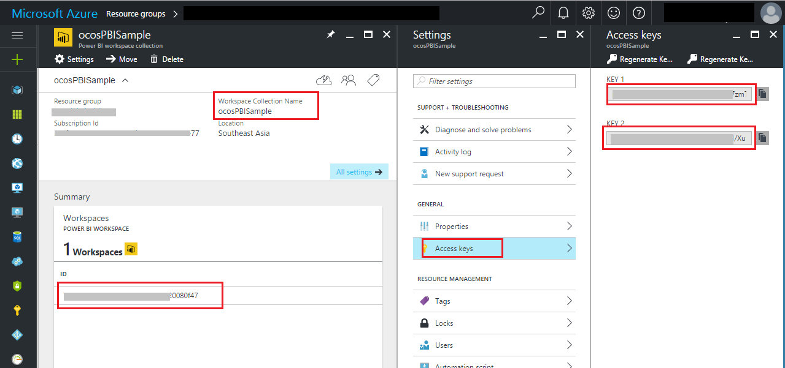

# How to embed a Power BI report into a web page by Javascript
## Requires
- 
## License
- Apache License, Version 2.0
## Technologies
- Javascript
- HTML
- power bi
- Languages
- Power BI Embedded
## Topics
- jQuery
- Javascript
- HTML
- power bi
- Power BI Embedded
## Updated
- 03/30/2017
## Description

&nbsp;How
to
embed a Power BI report into a web page by Javascript

Introduction

This sample demonstrates how to embed a Power BI report into a web page by Javascript.

Power BI Embedded is one of the Azure services. Only the ISV who uses Azure Portal is charged for usage fees (per hourly user session), and the user who views the report isn't charged or even require an Azure subscription.

Sample prerequisites

Before you run this sample, you should know your
Workspace Collection name and Access Key. And in your
Workspace Collection, there should be at least one workspace, and one report dataset.

If you don&rsquo;t have a Power BI Embedded service, you can follow this link
<a href="https://docs.microsoft.com/en-us/azure/power-bi-embedded/power-bi-embedded-get-started-sample" style="text-decoration:none">https://docs.microsoft.com/en-us/azure/power-bi-embedded/power-bi-embedded-get-started-sample</a>
to create workspaces and import report to it.

<strong>Important:
</strong>If you're using Azure China service, please follow this
<a href="https://www.azure.cn/documentation/articles/power-bi-embedded-get-started-sample/">document&nbsp;for China</a>.&nbsp;And before running
 the sample, please replace the request url&nbsp;&quot;https://api.powerbi.com&quot; to &quot;https://api.powerbi.cn&quot;
 in the html.

 

&nbsp;

Running the sample

This is a static html page. Download the source and find the index.html. Open it in your Web Browser.

&nbsp;

Input Workspace Collection Name and
Access Key, then click 
Get Workspaces.

&nbsp;

After the workspaces and reports are loaded, click Embed button. Then you can see the report.

&nbsp;

Using the code

Get access token:

JavaScript

Edit|Remove

js
<pre class="hidden">function getAccessToken(accessKey, workspaceId, reportId, workspaceCollectionName) {
    var token1 = '{&quot;alg&quot;: &quot;HS256&quot;,&quot;typ&quot;: &quot;JWT&quot;}';
    var nbf = new Date().getTime() / 1000 | 0;
    var exp = new Date().setTime(new Date().getTime() &#43; 60 * 60 * 1000) / 1000 | 0;
    var token2 = '{&quot;ver&quot;:&quot;0.2.0&quot;,&quot;wcn&quot;:&quot;' &#43; workspaceCollectionName &#43; '&quot;,&quot;wid&quot;: &quot;' &#43; workspaceId &#43; '&quot;,&quot;rid&quot;:&quot;' &#43; reportId &#43; '&quot;,&quot;iss&quot;:&quot;PowerBISDK&quot;,&quot;aud&quot;:&quot;https://analysis.windows.net/powerbi/api&quot;,&quot;exp&quot;:' &#43; exp &#43; ',&quot;nbf&quot;:' &#43; nbf &#43; '}'
    var endcodedToken = encode_helper(token1) &#43; '.' &#43; encode_helper(token2);
    var hash = CryptoJS.HmacSHA256(endcodedToken, accessKey);
    var hashInBase64 = CryptoJS.enc.Base64.stringify(hash);
    var sig = formatString(hashInBase64);
    var accessToken = endcodedToken &#43; '.' &#43; sig;
    return accessToken;
}

function encode_helper(arg) {
    var response = btoa(arg);
    return formatString(response);
}

//replace special char in the string
function formatString(arg) {
    var response = arg;
    response = response.replace(/\//g, &quot;_&quot;);
    response = response.replace(/\&#43;/g, &quot;-&quot;);
    response = response.replace(/=&#43;$/, '');;
    return response;
}</pre>

<pre class="js">function&nbsp;getAccessToken(accessKey,&nbsp;workspaceId,&nbsp;reportId,&nbsp;workspaceCollectionName)&nbsp;{&nbsp;
&nbsp;&nbsp;&nbsp;&nbsp;var&nbsp;token1&nbsp;=&nbsp;'{&quot;alg&quot;:&nbsp;&quot;HS256&quot;,&quot;typ&quot;:&nbsp;&quot;JWT&quot;}';&nbsp;
&nbsp;&nbsp;&nbsp;&nbsp;var&nbsp;nbf&nbsp;=&nbsp;new&nbsp;Date().getTime()&nbsp;/&nbsp;1000&nbsp;|&nbsp;0;&nbsp;
&nbsp;&nbsp;&nbsp;&nbsp;var&nbsp;exp&nbsp;=&nbsp;new&nbsp;Date().setTime(new&nbsp;Date().getTime()&nbsp;&#43;&nbsp;60&nbsp;*&nbsp;60&nbsp;*&nbsp;1000)&nbsp;/&nbsp;1000&nbsp;|&nbsp;0;&nbsp;
&nbsp;&nbsp;&nbsp;&nbsp;var&nbsp;token2&nbsp;=&nbsp;'{&quot;ver&quot;:&quot;0.2.0&quot;,&quot;wcn&quot;:&quot;'&nbsp;&#43;&nbsp;workspaceCollectionName&nbsp;&#43;&nbsp;'&quot;,&quot;wid&quot;:&nbsp;&quot;'&nbsp;&#43;&nbsp;workspaceId&nbsp;&#43;&nbsp;'&quot;,&quot;rid&quot;:&quot;'&nbsp;&#43;&nbsp;reportId&nbsp;&#43;&nbsp;'&quot;,&quot;iss&quot;:&quot;PowerBISDK&quot;,&quot;aud&quot;:&quot;https://analysis.windows.net/powerbi/api&quot;,&quot;exp&quot;:'&nbsp;&#43;&nbsp;exp&nbsp;&#43;&nbsp;',&quot;nbf&quot;:'&nbsp;&#43;&nbsp;nbf&nbsp;&#43;&nbsp;'}'&nbsp;
&nbsp;&nbsp;&nbsp;&nbsp;var&nbsp;endcodedToken&nbsp;=&nbsp;encode_helper(token1)&nbsp;&#43;&nbsp;'.'&nbsp;&#43;&nbsp;encode_helper(token2);&nbsp;
&nbsp;&nbsp;&nbsp;&nbsp;var&nbsp;hash&nbsp;=&nbsp;CryptoJS.HmacSHA256(endcodedToken,&nbsp;accessKey);&nbsp;
&nbsp;&nbsp;&nbsp;&nbsp;var&nbsp;hashInBase64&nbsp;=&nbsp;CryptoJS.enc.Base64.stringify(hash);&nbsp;
&nbsp;&nbsp;&nbsp;&nbsp;var&nbsp;sig&nbsp;=&nbsp;formatString(hashInBase64);&nbsp;
&nbsp;&nbsp;&nbsp;&nbsp;var&nbsp;accessToken&nbsp;=&nbsp;endcodedToken&nbsp;&#43;&nbsp;'.'&nbsp;&#43;&nbsp;sig;&nbsp;
&nbsp;&nbsp;&nbsp;&nbsp;return&nbsp;accessToken;&nbsp;
}&nbsp;
&nbsp;
function&nbsp;encode_helper(arg)&nbsp;{&nbsp;
&nbsp;&nbsp;&nbsp;&nbsp;var&nbsp;response&nbsp;=&nbsp;btoa(arg);&nbsp;
&nbsp;&nbsp;&nbsp;&nbsp;return&nbsp;formatString(response);&nbsp;
}&nbsp;
&nbsp;
//replace&nbsp;special&nbsp;char&nbsp;in&nbsp;the&nbsp;string&nbsp;
function&nbsp;formatString(arg)&nbsp;{&nbsp;
&nbsp;&nbsp;&nbsp;&nbsp;var&nbsp;response&nbsp;=&nbsp;arg;&nbsp;
&nbsp;&nbsp;&nbsp;&nbsp;response&nbsp;=&nbsp;response.replace(/\//g,&nbsp;&quot;_&quot;);&nbsp;
&nbsp;&nbsp;&nbsp;&nbsp;response&nbsp;=&nbsp;response.replace(/\&#43;/g,&nbsp;&quot;-&quot;);&nbsp;
&nbsp;&nbsp;&nbsp;&nbsp;response&nbsp;=&nbsp;response.replace(/=&#43;$/,&nbsp;'');;&nbsp;
&nbsp;&nbsp;&nbsp;&nbsp;return&nbsp;response;&nbsp;
}</pre>

&nbsp;Get workspaces

JavaScript

Edit|Remove

js
<pre class="hidden">function getWorkspaces(workspaceCollectionName, accessKey) {
    var requestUrl = &quot;https://api.powerbi.com/v1.0/collections/&quot; &#43; workspaceCollectionName &#43; &quot;/workspaces&quot;;
    var request = new Request(requestUrl, {
        headers: new Headers({
            'Authorization': 'AppKey ' &#43; accessKey
        })
    });
    fetch(request).then(function (response) {
        if (response.ok) {
            return response.json()
                .then(function (data) {
                    listWorkspaces(data.value, workspaceCollectionName, accessKey);
                });
        }
    });

}</pre>

<pre class="js">function&nbsp;getWorkspaces(workspaceCollectionName,&nbsp;accessKey)&nbsp;{&nbsp;
&nbsp;&nbsp;&nbsp;&nbsp;var&nbsp;requestUrl&nbsp;=&nbsp;&quot;https://api.powerbi.com/v1.0/collections/&quot;&nbsp;&#43;&nbsp;workspaceCollectionName&nbsp;&#43;&nbsp;&quot;/workspaces&quot;;&nbsp;
&nbsp;&nbsp;&nbsp;&nbsp;var&nbsp;request&nbsp;=&nbsp;new&nbsp;Request(requestUrl,&nbsp;{&nbsp;
&nbsp;&nbsp;&nbsp;&nbsp;&nbsp;&nbsp;&nbsp;&nbsp;headers:&nbsp;new&nbsp;Headers({&nbsp;
&nbsp;&nbsp;&nbsp;&nbsp;&nbsp;&nbsp;&nbsp;&nbsp;&nbsp;&nbsp;&nbsp;&nbsp;'Authorization':&nbsp;'AppKey&nbsp;'&nbsp;&#43;&nbsp;accessKey&nbsp;
&nbsp;&nbsp;&nbsp;&nbsp;&nbsp;&nbsp;&nbsp;&nbsp;})&nbsp;
&nbsp;&nbsp;&nbsp;&nbsp;});&nbsp;
&nbsp;&nbsp;&nbsp;&nbsp;fetch(request).then(function&nbsp;(response)&nbsp;{&nbsp;
&nbsp;&nbsp;&nbsp;&nbsp;&nbsp;&nbsp;&nbsp;&nbsp;if&nbsp;(response.ok)&nbsp;{&nbsp;
&nbsp;&nbsp;&nbsp;&nbsp;&nbsp;&nbsp;&nbsp;&nbsp;&nbsp;&nbsp;&nbsp;&nbsp;return&nbsp;response.json()&nbsp;
&nbsp;&nbsp;&nbsp;&nbsp;&nbsp;&nbsp;&nbsp;&nbsp;&nbsp;&nbsp;&nbsp;&nbsp;&nbsp;&nbsp;&nbsp;&nbsp;.then(function&nbsp;(data)&nbsp;{&nbsp;
&nbsp;&nbsp;&nbsp;&nbsp;&nbsp;&nbsp;&nbsp;&nbsp;&nbsp;&nbsp;&nbsp;&nbsp;&nbsp;&nbsp;&nbsp;&nbsp;&nbsp;&nbsp;&nbsp;&nbsp;listWorkspaces(data.value,&nbsp;workspaceCollectionName,&nbsp;accessKey);&nbsp;
&nbsp;&nbsp;&nbsp;&nbsp;&nbsp;&nbsp;&nbsp;&nbsp;&nbsp;&nbsp;&nbsp;&nbsp;&nbsp;&nbsp;&nbsp;&nbsp;});&nbsp;
&nbsp;&nbsp;&nbsp;&nbsp;&nbsp;&nbsp;&nbsp;&nbsp;}&nbsp;
&nbsp;&nbsp;&nbsp;&nbsp;});&nbsp;
&nbsp;
}</pre>

Get reports

JavaScript

Edit|Remove

js
<pre class="hidden">function getReports(workspaceId, workspaceCollectionName, accessKey) {
    var reportRequest = &quot;https://api.powerbi.com/v1.0/collections/&quot; &#43; workspaceCollectionName &#43; &quot;/workspaces/&quot; &#43; workspaceId &#43; &quot;/reports&quot;;
    var request1 = new Request(reportRequest, {
        headers: new Headers({
            'Authorization': 'AppKey ' &#43; accessKey
        })
    });
    fetch(request1).then(function (response) {
        if (response.ok) {
            return response.json().then(function (data) {
                listReports(data.value);
            });
        }
    });
}</pre>

<pre class="js">function&nbsp;getReports(workspaceId,&nbsp;workspaceCollectionName,&nbsp;accessKey)&nbsp;{&nbsp;
&nbsp;&nbsp;&nbsp;&nbsp;var&nbsp;reportRequest&nbsp;=&nbsp;&quot;https://api.powerbi.com/v1.0/collections/&quot;&nbsp;&#43;&nbsp;workspaceCollectionName&nbsp;&#43;&nbsp;&quot;/workspaces/&quot;&nbsp;&#43;&nbsp;workspaceId&nbsp;&#43;&nbsp;&quot;/reports&quot;;&nbsp;
&nbsp;&nbsp;&nbsp;&nbsp;var&nbsp;request1&nbsp;=&nbsp;new&nbsp;Request(reportRequest,&nbsp;{&nbsp;
&nbsp;&nbsp;&nbsp;&nbsp;&nbsp;&nbsp;&nbsp;&nbsp;headers:&nbsp;new&nbsp;Headers({&nbsp;
&nbsp;&nbsp;&nbsp;&nbsp;&nbsp;&nbsp;&nbsp;&nbsp;&nbsp;&nbsp;&nbsp;&nbsp;'Authorization':&nbsp;'AppKey&nbsp;'&nbsp;&#43;&nbsp;accessKey&nbsp;
&nbsp;&nbsp;&nbsp;&nbsp;&nbsp;&nbsp;&nbsp;&nbsp;})&nbsp;
&nbsp;&nbsp;&nbsp;&nbsp;});&nbsp;
&nbsp;&nbsp;&nbsp;&nbsp;fetch(request1).then(function&nbsp;(response)&nbsp;{&nbsp;
&nbsp;&nbsp;&nbsp;&nbsp;&nbsp;&nbsp;&nbsp;&nbsp;if&nbsp;(response.ok)&nbsp;{&nbsp;
&nbsp;&nbsp;&nbsp;&nbsp;&nbsp;&nbsp;&nbsp;&nbsp;&nbsp;&nbsp;&nbsp;&nbsp;return&nbsp;response.json().then(function&nbsp;(data)&nbsp;{&nbsp;
&nbsp;&nbsp;&nbsp;&nbsp;&nbsp;&nbsp;&nbsp;&nbsp;&nbsp;&nbsp;&nbsp;&nbsp;&nbsp;&nbsp;&nbsp;&nbsp;listReports(data.value);&nbsp;
&nbsp;&nbsp;&nbsp;&nbsp;&nbsp;&nbsp;&nbsp;&nbsp;&nbsp;&nbsp;&nbsp;&nbsp;});&nbsp;
&nbsp;&nbsp;&nbsp;&nbsp;&nbsp;&nbsp;&nbsp;&nbsp;}&nbsp;
&nbsp;&nbsp;&nbsp;&nbsp;});&nbsp;
}</pre>

Embed report

JavaScript

Edit|Remove

js
<pre class="hidden">function embedReport(report, accessKey, workspaceCollectionName, workspaceId) {
    var embedUrl = report.embedUrl;
    var name = report.name;
    var reportId = report.id;
    var webUrl = report.webUrl;
    var token = getAccessToken(accessKey, workspaceId, reportId, workspaceCollectionName);
    var embedConfiguration = {
        type: 'report',
        accessToken: token,
        id: reportId,
        embedUrl: embedUrl
    };
    var $reportContainer = $('#reportContainer');
    var report = powerbi.embed($reportContainer.get(0), embedConfiguration);
}</pre>

<pre class="js">function&nbsp;embedReport(report,&nbsp;accessKey,&nbsp;workspaceCollectionName,&nbsp;workspaceId)&nbsp;{&nbsp;
&nbsp;&nbsp;&nbsp;&nbsp;var&nbsp;embedUrl&nbsp;=&nbsp;report.embedUrl;&nbsp;
&nbsp;&nbsp;&nbsp;&nbsp;var&nbsp;name&nbsp;=&nbsp;report.name;&nbsp;
&nbsp;&nbsp;&nbsp;&nbsp;var&nbsp;reportId&nbsp;=&nbsp;report.id;&nbsp;
&nbsp;&nbsp;&nbsp;&nbsp;var&nbsp;webUrl&nbsp;=&nbsp;report.webUrl;&nbsp;
&nbsp;&nbsp;&nbsp;&nbsp;var&nbsp;token&nbsp;=&nbsp;getAccessToken(accessKey,&nbsp;workspaceId,&nbsp;reportId,&nbsp;workspaceCollectionName);&nbsp;
&nbsp;&nbsp;&nbsp;&nbsp;var&nbsp;embedConfiguration&nbsp;=&nbsp;{&nbsp;
&nbsp;&nbsp;&nbsp;&nbsp;&nbsp;&nbsp;&nbsp;&nbsp;type:&nbsp;'report',&nbsp;
&nbsp;&nbsp;&nbsp;&nbsp;&nbsp;&nbsp;&nbsp;&nbsp;accessToken:&nbsp;token,&nbsp;
&nbsp;&nbsp;&nbsp;&nbsp;&nbsp;&nbsp;&nbsp;&nbsp;id:&nbsp;reportId,&nbsp;
&nbsp;&nbsp;&nbsp;&nbsp;&nbsp;&nbsp;&nbsp;&nbsp;embedUrl:&nbsp;embedUrl&nbsp;
&nbsp;&nbsp;&nbsp;&nbsp;};&nbsp;
&nbsp;&nbsp;&nbsp;&nbsp;var&nbsp;$reportContainer&nbsp;=&nbsp;$('#reportContainer');&nbsp;
&nbsp;&nbsp;&nbsp;&nbsp;var&nbsp;report&nbsp;=&nbsp;powerbi.embed($reportContainer.get(0),&nbsp;embedConfiguration);&nbsp;
}</pre>

More information

<a href="https://docs.microsoft.com/en-us/azure/power-bi-embedded/power-bi-embedded-what-is-power-bi-embedded" style="text-decoration:none">What is Microsoft Power BI Embedded</a>

<a href="https://docs.microsoft.com/en-us/azure/power-bi-embedded/power-bi-embedded-get-started-sample">Get started with Microsoft Power BI Embedded</a>

<a href="https://docs.microsoft.com/en-us/azure/power-bi-embedded/power-bi-embedded-iframe" style="text-decoration:none">How to use Power BI Embedded with REST</a>

<a href="https://www.azure.cn/documentation/articles/developerdifferences">Developer difference between Azure China and Global</a>

 

Microsoft All-In-One Code Framework is a free, centralized code sample library driven by developers' real-world pains and needs. The goal is to provide customer-driven code samples for all Microsoft development technologies,
 and reduce developers' efforts in solving typical programming tasks. Our team listens to developers&rsquo; pains in the MSDN forums, social media and various DEV communities. We write code samples based on developers&rsquo; frequently asked programming tasks,
 and allow developers to download them with a short sample publishing cycle. Additionally, we offer a free code sample request service. It is a proactive way for our developer community to obtain code samples directly from Microsoft.

