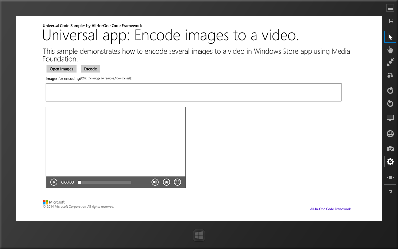

# How to encode several images to a video in universal Windows apps
## Requires
- Visual Studio 2013
## License
- Apache License, Version 2.0
## Technologies
- DirectX
- Windows
- Windows Phone
- Windows 8
- Audio and video
- Windows Store app Development
- Windows Phone Development
- Windows 8.1
- universal windows app
- Microsoft Media Foundation
## Topics
- video
- Image
- universal app
## Updated
- 09/22/2016
## Description

<strong></strong><em></em>

Video

How to encode several images to a video in universal Windows apps using Media Foundation

Introduction

This sample demonstrates how to encode several images to an mp4 video using Media Foundation in a C&#43;&#43;/CX component. This is a universal
 Windows app which can be built for both Windows 8.1 and Windows Phone 8.1.

Running the Sample

Build the sample in Visual Studio 2013 and then run it. Click the &quot;Open images&quot; button to pick several images which will be shown below the button in a GridView control. Then click the &quot;Encode&quot; button
 to create a video file which will be processed and encode the video with the images as frames. The video will play below the GridView in a MediaElement control.

Using the Code

We implement the basic capabilities in PictureWriter class in EncodeImage namespace using Media Foundation.

In the code behind MainPage.xaml, we first open images and store the files to List&lt;StorageFile&gt; object.

&nbsp;&nbsp;

C#C&#43;&#43;JavaScript

Edit|Remove

csharpcplusplusjs
<pre class="hidden">private async void ImageBtn_Click(object sender, RoutedEventArgs e)
  {
            if (m_images.Count != 0)
            {
                m_images.Clear();
            }
            if (m_files.Count != 0)
            {
                m_files.Clear();
            }
   statusText.Text = &quot;&quot;;
   FileOpenPicker openPicker = new FileOpenPicker();
   openPicker.SuggestedStartLocation = PickerLocationId.PicturesLibrary;
   openPicker.ViewMode = PickerViewMode.Thumbnail;
   openPicker.FileTypeFilter.Add(&quot;.jpg&quot;);
            openPicker.FileTypeFilter.Add(&quot;.png&quot;);
            openPicker.FileTypeFilter.Add(&quot;.bmp&quot;);
   IReadOnlyList&lt;StorageFile&gt; files = await openPicker.PickMultipleFilesAsync();
   if (files.Count &gt; 0)
   {                
    foreach(StorageFile file in files)
    {
     m_files.Add(file);
     using( IRandomAccessStream stream = await file.OpenAsync(FileAccessMode.Read))
     {
      BitmapImage bitmapImage = new BitmapImage();
      await bitmapImage.SetSourceAsync(stream);
      Image image = new Image();
      image.Source = bitmapImage;
      m_images.Add(image);                        
     }
     
    }
    ImageGV.DataContext = m_images;
   }
  }
</pre>
<pre class="hidden">void CppUniversalAppImageToVideo::MainPage::ImageBtn_Click(Platform::Object^ sender, Windows::UI::Xaml::RoutedEventArgs^ e)
{
 statusText-&gt;Text = &quot;&quot;;
 if (m_images-&gt;Size != 0)
 {
  m_images-&gt;Clear();
 }
 if (m_files-&gt;Size != 0)
 {
  m_files-&gt;Clear();
 }
 // Open images.
 FileOpenPicker^ picker = ref new FileOpenPicker;
 picker-&gt;SuggestedStartLocation = PickerLocationId::PicturesLibrary;
 picker-&gt;ViewMode = PickerViewMode::Thumbnail;
 picker-&gt;FileTypeFilter-&gt;Append(&quot;.jpg&quot;);
 picker-&gt;FileTypeFilter-&gt;Append(&quot;.png&quot;);
 picker-&gt;FileTypeFilter-&gt;Append(&quot;.bmp&quot;);
 create_task(picker-&gt;PickMultipleFilesAsync()).then([=](IVectorView&lt;StorageFile^&gt;^ files){
  if (files-&gt;Size == 0)
  {
   cancel_current_task();
  }
  
  auto images = std::make_shared&lt;Platform::Collections::Vector&lt;Windows::UI::Xaml::Controls::Image^&gt;^&gt;(m_images);
  for (StorageFile^ file : files)
  {   
   create_task(file-&gt;OpenAsync(FileAccessMode::Read)).then([=](Streams::IRandomAccessStream^ stream){
    
    auto bitmapImage = ref new BitmapImage();
    bitmapImage-&gt;SetSource(stream);
    Image^ xamlImage = ref new Image;
    xamlImage-&gt;Source = bitmapImage;
    m_images-&gt;Append(xamlImage);
   }).then([=](){
    m_files-&gt;Append(file);
   }, task_continuation_context::use_arbitrary()).then([=](task&lt;void&gt; t){
    try
    {
     t.get();
    }
    catch (InvalidArgumentException^ e)
    {
     statusText-&gt;Text = &quot;Some errors occur when openning, please try again&quot;;
     m_images-&gt;Clear();
     m_files-&gt;Clear();
    }
   });
  }
 });
}
</pre>
<pre class="hidden">function openImages()
    {
        if (items.length != 0)
        {
            items.splice(0, items.length);
        }
        if (g_imageFiles.length != 0)
        {
            g_imageFiles.splice(0, g_imageFiles.length);
        }
        var openPicker = new Windows.Storage.Pickers.FileOpenPicker();
        openPicker.viewMode = Windows.Storage.Pickers.PickerViewMode.thumbnail;
        openPicker.suggestedStartLocation = Windows.Storage.Pickers.PickerLocationId.picturesLibrary;
        openPicker.fileTypeFilter.append(&quot;.jpg&quot;);
        openPicker.fileTypeFilter.append(&quot;.png&quot;);
        openPicker.fileTypeFilter.append(&quot;.bmp&quot;);
        openPicker.pickMultipleFilesAsync().then(function (files) {
            if(files.size &gt; 0)
            {                
                files.forEach(function (file) {
                    g_imageFiles.push(file);
                    file.openAsync(Windows.Storage.FileAccessMode.read).then(function (stream) {                        
                        items.push({ picture: URL.createObjectURL(stream) });                        
                    });
                });                
            }
        });
    }
</pre>
<pre class="csharp" id="codePreview">private async void ImageBtn_Click(object sender, RoutedEventArgs e)
  {
            if (m_images.Count != 0)
            {
                m_images.Clear();
            }
            if (m_files.Count != 0)
            {
                m_files.Clear();
            }
   statusText.Text = &quot;&quot;;
   FileOpenPicker openPicker = new FileOpenPicker();
   openPicker.SuggestedStartLocation = PickerLocationId.PicturesLibrary;
   openPicker.ViewMode = PickerViewMode.Thumbnail;
   openPicker.FileTypeFilter.Add(&quot;.jpg&quot;);
            openPicker.FileTypeFilter.Add(&quot;.png&quot;);
            openPicker.FileTypeFilter.Add(&quot;.bmp&quot;);
   IReadOnlyList&lt;StorageFile&gt; files = await openPicker.PickMultipleFilesAsync();
   if (files.Count &gt; 0)
   {                
    foreach(StorageFile file in files)
    {
     m_files.Add(file);
     using( IRandomAccessStream stream = await file.OpenAsync(FileAccessMode.Read))
     {
      BitmapImage bitmapImage = new BitmapImage();
      await bitmapImage.SetSourceAsync(stream);
      Image image = new Image();
      image.Source = bitmapImage;
      m_images.Add(image);                        
     }
     
    }
    ImageGV.DataContext = m_images;
   }
  }
</pre>

&nbsp;

Then we initialize the the PictureWriter object after creating the new video file.

C#C&#43;&#43;JavaScript

Edit|Remove

csharpcplusplusjs
<pre class="hidden">private async void EncodeBtn_Click(object sender, RoutedEventArgs e) 
  { 
   if (m_files.Count == 0) 
   { 
    statusText.Text = &quot;You must select one image at least.&quot;; 
    return; 
   } 
            // Create the video file via file picker. 
            FileSavePicker savePicker = new FileSavePicker(); 
            savePicker.SuggestedStartLocation = PickerLocationId.VideosLibrary; 
            savePicker.FileTypeChoices.Add(&quot;MP4 File&quot;, new List&lt;string&gt;() { &quot;.mp4&quot; }); 
            savePicker.SuggestedFileName = &quot;output&quot;; 
            StorageFile videoFile = await savePicker.PickSaveFileAsync(); 
            if(videoFile != null) 
            { 
                IRandomAccessStream videoStream = await videoFile.OpenAsync(FileAccessMode.ReadWrite); 
                m_picture = new PictureWriter(videoStream, m_videoWidth, m_videoHeight); 
                // Add frames to the video.   
                ProcessVideoRing.IsActive = true; 
                statusText.Text = &quot;Encoding...&quot;; 
                foreach (StorageFile file in m_files) 
                { 
                    Windows.Storage.FileProperties.ImageProperties properties = await file.Properties.GetImagePropertiesAsync(); 
                    float scaleOfWidth = (float)m_videoWidth / properties.Width; 
                    float scaleOfHeight = (float)m_videoHeight / properties.Height; 
                    float scale = scaleOfHeight &gt; scaleOfWidth ? 
                    scaleOfWidth : scaleOfHeight; 
                    uint width = (uint)(properties.Width * scale); 
                    uint height = (uint)(properties.Height * scale); 
                    using (IRandomAccessStream stream = await file.OpenAsync(FileAccessMode.Read)) 
                    { 
                        for (int i = 0; i &lt; 10; &#43;&#43;i) 
                        { 
                            BitmapDecoder decoder = await BitmapDecoder.CreateAsync(stream); 
                            PixelDataProvider dataProvider = await decoder.GetPixelDataAsync( 
                                BitmapPixelFormat.Bgra8, 
                                BitmapAlphaMode.Straight, 
                                new BitmapTransform { ScaledWidth = width, ScaledHeight = height }, 
                                ExifOrientationMode.RespectExifOrientation, 
                                ColorManagementMode.ColorManageToSRgb); 
                            m_picture.AddFrame(dataProvider.DetachPixelData(), (int)width, (int)height); 
                        } 
                    } 
                } 
                m_picture.Finalize(); 
                m_picture = null; 
                statusText.Text = &quot;The image files are encoded successfully. You can review the video.&quot;; 
                ProcessVideoRing.IsActive = false; 
                videoStream.Dispose(); 
                videoStream = null; 
                videoStream = await videoFile.OpenAsync(FileAccessMode.Read); 
                VideoElement.SetSource(videoStream, videoFile.ContentType); 
            }             
  } </pre>
<pre class="hidden">void CppUniversalAppImageToVideo::MainPage::EncodeBtn_Click(Platform::Object^ sender, Windows::UI::Xaml::RoutedEventArgs^ e)
{
 if (m_files-&gt;Size == 0)
 {
  statusText-&gt;Text = &quot;You must select one image at least.&quot;;
  return;
 }
 // Create the video via file picker.
 statusText-&gt;Text = &quot;&quot;;
 FileSavePicker^ picker = ref new FileSavePicker;
 picker-&gt;SuggestedStartLocation = PickerLocationId::VideosLibrary;
 auto mp4Extensions = ref new Platform::Collections::Vector&lt;Platform::String^&gt;();
 mp4Extensions-&gt;Append(&quot;.mp4&quot;);
 picker-&gt;FileTypeChoices-&gt;Insert(&quot;MP4 file&quot;, mp4Extensions);
 picker-&gt;DefaultFileExtension = &quot;.mp4&quot;;
 picker-&gt;SuggestedFileName = &quot;output&quot;;
 picker-&gt;SuggestedStartLocation = PickerLocationId::VideosLibrary;
 
 create_task( picker-&gt;PickSaveFileAsync())
 .then([=](StorageFile^ file){
  if (nullptr == file)
  {
   cancel_current_task();
  }
  m_videoFile = file;
  return file-&gt;OpenAsync(FileAccessMode::ReadWrite);
 }).then([=](Streams::IRandomAccessStream^ stream){  
  m_picture = ref new PictureWriter(stream, m_videoWidth, m_videoHeight);
 }).then([this](){
  // Add frames to the video.  
  ProcessVideoRing-&gt;IsActive = true;
  statusText-&gt;Text = &quot;Encoding...&quot;;
  static int imageWidth, imageHeight, width, height;
  
  create_task([=](){
   for (StorageFile^ file : m_files)
   {
    // We set 10 FPS default in the PictureWriter, so we add 10 same frames with each image.
    for (int i = 0; i &lt; 10; &#43;&#43;i)
    {
     create_task(file-&gt;Properties-&gt;GetImagePropertiesAsync()).then([&amp;](FileProperties::ImageProperties^ properties){
      imageWidth = properties-&gt;Width;
      imageHeight = properties-&gt;Height;
      return file-&gt;OpenAsync(FileAccessMode::Read);
     }).then([=](Streams::IRandomAccessStream^ stream){
      return BitmapDecoder::CreateAsync(stream);
     }).then([&amp;](BitmapDecoder^ decoder){
      float scaleOfWidth = static_cast&lt;float&gt;(m_videoWidth) / imageWidth;
      float scaleOfHeight = static_cast&lt;float&gt;(m_videoHeight) / imageHeight;
      float scale = scaleOfHeight &gt; scaleOfWidth ?
      scaleOfWidth : scaleOfHeight;
      width = static_cast&lt;int&gt;(imageWidth * scale);
      height = static_cast&lt;int&gt;(imageHeight * scale);
      
      BitmapTransform^ transform = ref new BitmapTransform;
      transform-&gt;ScaledWidth = width;
      transform-&gt;ScaledHeight = height;
      return decoder-&gt;GetPixelDataAsync(BitmapPixelFormat::Bgra8,
       BitmapAlphaMode::Straight,
       transform,
       ExifOrientationMode::RespectExifOrientation,
       ColorManagementMode::ColorManageToSRgb);
     }).then([&amp;](PixelDataProvider^ provider){
      m_picture-&gt;AddFrame(provider-&gt;DetachPixelData(), width, height);
     }).wait();
    }    
   }
  }).then([=](){
   m_picture-&gt;Finalize();
   m_picture = nullptr;   
  }).then([=](){
   return m_videoFile-&gt;OpenAsync(FileAccessMode::Read);
  }).then([=](Streams::IRandomAccessStream^ stream){
   VideoElement-&gt;SetSource(stream, nullptr);
   
   ProcessVideoRing-&gt;IsActive = false;
   statusText-&gt;Text = &quot;The image files are encoded successfully.&quot;;   
  });
 }); 
}
</pre>
<pre class="hidden">function encode()
    {
        if (g_imageFiles.length == 0)
        {
            displayInfo(&quot;You must select one image at least.&quot;);
            return;
        }
        var savePicker = new Windows.Storage.Pickers.FileSavePicker();
        savePicker.suggestedStartLocation = Windows.Storage.Pickers.PickerLocationId.videosLibrary;
        savePicker.suggestedFileName = &quot;output&quot;;
        savePicker.defaultFileExtension = &quot;.mp4&quot;;
        savePicker.fileTypeChoices.insert(&quot;MP4 file&quot;, [&quot;.mp4&quot;]);
        var promise = savePicker.pickSaveFileAsync().then(function (videoFile) {
            if (videoFile) {
                g_videoFile = videoFile;
                return videoFile.openAsync(Windows.Storage.FileAccessMode.readWrite);
            }
        }).then(function (stream) {
            if (stream)
            {
                g_picture = new EncodeImages.PictureWriter(stream, g_videoWidth, g_videoHeight);
            }            
        });
        var imageWidth, imageHeight;
        var promiseArray = g_imageFiles.map(function (file) {
            promise = promise.then(function () {
                
                return file.properties.getImagePropertiesAsync().then(function (props) {
                    if (g_picture) {
                        imageWidth = props.width;
                        imageHeight = props.height;
                        return file.openAsync(Windows.Storage.FileAccessMode.read);
                    }
                    
                }).then(function (stream) {
                    if (stream)
                    {
                        return Windows.Graphics.Imaging.BitmapDecoder.createAsync(stream);
                    }
                    
                }).then(function (decoder) {
                    if (decoder)
                    {
                        // Transform the image size.
                        var scaleOfWidth = g_videoWidth / imageWidth;
                        var scaleOfHeight = g_videoHeight / imageHeight;
                        var scale = scaleOfWidth &gt; scaleOfHeight ? scaleOfHeight : scaleOfWidth;
                        imageWidth *= scale;
                        imageHeight *= scale;
                        var transform = new Windows.Graphics.Imaging.BitmapTransform();
                        transform.scaledWidth = imageWidth;
                        transform.scaledHeight = imageHeight;
                        return decoder.getPixelDataAsync(
                            Windows.Graphics.Imaging.BitmapPixelFormat.bgra8,
                            Windows.Graphics.Imaging.BitmapAlphaMode.straight,
                            transform,
                            Windows.Graphics.Imaging.ExifOrientationMode.respectExifOrientation,
                            Windows.Graphics.Imaging.ColorManagementMode.colorManageToSRgb);
                    }
                    
                }).then(function (provider) {
                    if (provider)
                    {
                        var data = provider.detachPixelData();
                        for (var i = 0; i &lt; 10; &#43;&#43;i) {
                            g_picture.addFrame(data, imageWidth, imageHeight);
                        }
                    }
                });
            });
            return promise;
            
        });
        WinJS.Promise.join(promiseArray).then(function () {
            if (g_picture)
            {
                g_picture.finalize();
                g_picture = null;
                displayInfo(&quot;The image files are encoded successfully.&quot;);
                var myVideo = document.getElementById(&quot;videoElement&quot;);
                myVideo.src = URL.createObjectURL(g_videoFile);
            }
            
        });        
    }
</pre>

<pre class="csharp">private&nbsp;async&nbsp;void&nbsp;EncodeBtn_Click(object&nbsp;sender,&nbsp;RoutedEventArgs&nbsp;e)&nbsp;&nbsp;
&nbsp;&nbsp;{&nbsp;&nbsp;
&nbsp;&nbsp;&nbsp;if&nbsp;(m_files.Count&nbsp;==&nbsp;0)&nbsp;&nbsp;
&nbsp;&nbsp;&nbsp;{&nbsp;&nbsp;
&nbsp;&nbsp;&nbsp;&nbsp;statusText.Text&nbsp;=&nbsp;&quot;You&nbsp;must&nbsp;select&nbsp;one&nbsp;image&nbsp;at&nbsp;least.&quot;;&nbsp;&nbsp;
&nbsp;&nbsp;&nbsp;&nbsp;return;&nbsp;&nbsp;
&nbsp;&nbsp;&nbsp;}&nbsp;&nbsp;
&nbsp;&nbsp;&nbsp;&nbsp;&nbsp;&nbsp;&nbsp;&nbsp;&nbsp;&nbsp;&nbsp;&nbsp;//&nbsp;Create&nbsp;the&nbsp;video&nbsp;file&nbsp;via&nbsp;file&nbsp;picker.&nbsp;&nbsp;
&nbsp;&nbsp;&nbsp;&nbsp;&nbsp;&nbsp;&nbsp;&nbsp;&nbsp;&nbsp;&nbsp;&nbsp;FileSavePicker&nbsp;savePicker&nbsp;=&nbsp;new&nbsp;FileSavePicker();&nbsp;&nbsp;
&nbsp;&nbsp;&nbsp;&nbsp;&nbsp;&nbsp;&nbsp;&nbsp;&nbsp;&nbsp;&nbsp;&nbsp;savePicker.SuggestedStartLocation&nbsp;=&nbsp;PickerLocationId.VideosLibrary;&nbsp;&nbsp;
&nbsp;&nbsp;&nbsp;&nbsp;&nbsp;&nbsp;&nbsp;&nbsp;&nbsp;&nbsp;&nbsp;&nbsp;savePicker.FileTypeChoices.Add(&quot;MP4&nbsp;File&quot;,&nbsp;new&nbsp;List&lt;string&gt;()&nbsp;{&nbsp;&quot;.mp4&quot;&nbsp;});&nbsp;&nbsp;
&nbsp;&nbsp;&nbsp;&nbsp;&nbsp;&nbsp;&nbsp;&nbsp;&nbsp;&nbsp;&nbsp;&nbsp;savePicker.SuggestedFileName&nbsp;=&nbsp;&quot;output&quot;;&nbsp;&nbsp;
&nbsp;&nbsp;&nbsp;&nbsp;&nbsp;&nbsp;&nbsp;&nbsp;&nbsp;&nbsp;&nbsp;&nbsp;StorageFile&nbsp;videoFile&nbsp;=&nbsp;await&nbsp;savePicker.PickSaveFileAsync();&nbsp;&nbsp;
&nbsp;&nbsp;&nbsp;&nbsp;&nbsp;&nbsp;&nbsp;&nbsp;&nbsp;&nbsp;&nbsp;&nbsp;if(videoFile&nbsp;!=&nbsp;null)&nbsp;&nbsp;
&nbsp;&nbsp;&nbsp;&nbsp;&nbsp;&nbsp;&nbsp;&nbsp;&nbsp;&nbsp;&nbsp;&nbsp;{&nbsp;&nbsp;
&nbsp;&nbsp;&nbsp;&nbsp;&nbsp;&nbsp;&nbsp;&nbsp;&nbsp;&nbsp;&nbsp;&nbsp;&nbsp;&nbsp;&nbsp;&nbsp;IRandomAccessStream&nbsp;videoStream&nbsp;=&nbsp;await&nbsp;videoFile.OpenAsync(FileAccessMode.ReadWrite);&nbsp;&nbsp;
&nbsp;&nbsp;&nbsp;&nbsp;&nbsp;&nbsp;&nbsp;&nbsp;&nbsp;&nbsp;&nbsp;&nbsp;&nbsp;&nbsp;&nbsp;&nbsp;m_picture&nbsp;=&nbsp;new&nbsp;PictureWriter(videoStream,&nbsp;m_videoWidth,&nbsp;m_videoHeight);&nbsp;&nbsp;
&nbsp;&nbsp;&nbsp;&nbsp;&nbsp;&nbsp;&nbsp;&nbsp;&nbsp;&nbsp;&nbsp;&nbsp;&nbsp;&nbsp;&nbsp;&nbsp;//&nbsp;Add&nbsp;frames&nbsp;to&nbsp;the&nbsp;video.&nbsp;&nbsp;&nbsp;&nbsp;
&nbsp;&nbsp;&nbsp;&nbsp;&nbsp;&nbsp;&nbsp;&nbsp;&nbsp;&nbsp;&nbsp;&nbsp;&nbsp;&nbsp;&nbsp;&nbsp;ProcessVideoRing.IsActive&nbsp;=&nbsp;true;&nbsp;&nbsp;
&nbsp;&nbsp;&nbsp;&nbsp;&nbsp;&nbsp;&nbsp;&nbsp;&nbsp;&nbsp;&nbsp;&nbsp;&nbsp;&nbsp;&nbsp;&nbsp;statusText.Text&nbsp;=&nbsp;&quot;Encoding...&quot;;&nbsp;&nbsp;
&nbsp;&nbsp;&nbsp;&nbsp;&nbsp;&nbsp;&nbsp;&nbsp;&nbsp;&nbsp;&nbsp;&nbsp;&nbsp;&nbsp;&nbsp;&nbsp;foreach&nbsp;(StorageFile&nbsp;file&nbsp;in&nbsp;m_files)&nbsp;&nbsp;
&nbsp;&nbsp;&nbsp;&nbsp;&nbsp;&nbsp;&nbsp;&nbsp;&nbsp;&nbsp;&nbsp;&nbsp;&nbsp;&nbsp;&nbsp;&nbsp;{&nbsp;&nbsp;
&nbsp;&nbsp;&nbsp;&nbsp;&nbsp;&nbsp;&nbsp;&nbsp;&nbsp;&nbsp;&nbsp;&nbsp;&nbsp;&nbsp;&nbsp;&nbsp;&nbsp;&nbsp;&nbsp;&nbsp;Windows.Storage.FileProperties.ImageProperties&nbsp;properties&nbsp;=&nbsp;await&nbsp;file.Properties.GetImagePropertiesAsync();&nbsp;&nbsp;
&nbsp;&nbsp;&nbsp;&nbsp;&nbsp;&nbsp;&nbsp;&nbsp;&nbsp;&nbsp;&nbsp;&nbsp;&nbsp;&nbsp;&nbsp;&nbsp;&nbsp;&nbsp;&nbsp;&nbsp;float&nbsp;scaleOfWidth&nbsp;=&nbsp;(float)m_videoWidth&nbsp;/&nbsp;properties.Width;&nbsp;&nbsp;
&nbsp;&nbsp;&nbsp;&nbsp;&nbsp;&nbsp;&nbsp;&nbsp;&nbsp;&nbsp;&nbsp;&nbsp;&nbsp;&nbsp;&nbsp;&nbsp;&nbsp;&nbsp;&nbsp;&nbsp;float&nbsp;scaleOfHeight&nbsp;=&nbsp;(float)m_videoHeight&nbsp;/&nbsp;properties.Height;&nbsp;&nbsp;
&nbsp;&nbsp;&nbsp;&nbsp;&nbsp;&nbsp;&nbsp;&nbsp;&nbsp;&nbsp;&nbsp;&nbsp;&nbsp;&nbsp;&nbsp;&nbsp;&nbsp;&nbsp;&nbsp;&nbsp;float&nbsp;scale&nbsp;=&nbsp;scaleOfHeight&nbsp;&gt;&nbsp;scaleOfWidth&nbsp;?&nbsp;&nbsp;
&nbsp;&nbsp;&nbsp;&nbsp;&nbsp;&nbsp;&nbsp;&nbsp;&nbsp;&nbsp;&nbsp;&nbsp;&nbsp;&nbsp;&nbsp;&nbsp;&nbsp;&nbsp;&nbsp;&nbsp;scaleOfWidth&nbsp;:&nbsp;scaleOfHeight;&nbsp;&nbsp;
&nbsp;&nbsp;&nbsp;&nbsp;&nbsp;&nbsp;&nbsp;&nbsp;&nbsp;&nbsp;&nbsp;&nbsp;&nbsp;&nbsp;&nbsp;&nbsp;&nbsp;&nbsp;&nbsp;&nbsp;uint&nbsp;width&nbsp;=&nbsp;(uint)(properties.Width&nbsp;*&nbsp;scale);&nbsp;&nbsp;
&nbsp;&nbsp;&nbsp;&nbsp;&nbsp;&nbsp;&nbsp;&nbsp;&nbsp;&nbsp;&nbsp;&nbsp;&nbsp;&nbsp;&nbsp;&nbsp;&nbsp;&nbsp;&nbsp;&nbsp;uint&nbsp;height&nbsp;=&nbsp;(uint)(properties.Height&nbsp;*&nbsp;scale);&nbsp;&nbsp;
&nbsp;&nbsp;&nbsp;&nbsp;&nbsp;&nbsp;&nbsp;&nbsp;&nbsp;&nbsp;&nbsp;&nbsp;&nbsp;&nbsp;&nbsp;&nbsp;&nbsp;&nbsp;&nbsp;&nbsp;using&nbsp;(IRandomAccessStream&nbsp;stream&nbsp;=&nbsp;await&nbsp;file.OpenAsync(FileAccessMode.Read))&nbsp;&nbsp;
&nbsp;&nbsp;&nbsp;&nbsp;&nbsp;&nbsp;&nbsp;&nbsp;&nbsp;&nbsp;&nbsp;&nbsp;&nbsp;&nbsp;&nbsp;&nbsp;&nbsp;&nbsp;&nbsp;&nbsp;{&nbsp;&nbsp;
&nbsp;&nbsp;&nbsp;&nbsp;&nbsp;&nbsp;&nbsp;&nbsp;&nbsp;&nbsp;&nbsp;&nbsp;&nbsp;&nbsp;&nbsp;&nbsp;&nbsp;&nbsp;&nbsp;&nbsp;&nbsp;&nbsp;&nbsp;&nbsp;for&nbsp;(int&nbsp;i&nbsp;=&nbsp;0;&nbsp;i&nbsp;&lt;&nbsp;10;&nbsp;&#43;&#43;i)&nbsp;&nbsp;
&nbsp;&nbsp;&nbsp;&nbsp;&nbsp;&nbsp;&nbsp;&nbsp;&nbsp;&nbsp;&nbsp;&nbsp;&nbsp;&nbsp;&nbsp;&nbsp;&nbsp;&nbsp;&nbsp;&nbsp;&nbsp;&nbsp;&nbsp;&nbsp;{&nbsp;&nbsp;
&nbsp;&nbsp;&nbsp;&nbsp;&nbsp;&nbsp;&nbsp;&nbsp;&nbsp;&nbsp;&nbsp;&nbsp;&nbsp;&nbsp;&nbsp;&nbsp;&nbsp;&nbsp;&nbsp;&nbsp;&nbsp;&nbsp;&nbsp;&nbsp;&nbsp;&nbsp;&nbsp;&nbsp;BitmapDecoder&nbsp;decoder&nbsp;=&nbsp;await&nbsp;BitmapDecoder.CreateAsync(stream);&nbsp;&nbsp;
&nbsp;&nbsp;&nbsp;&nbsp;&nbsp;&nbsp;&nbsp;&nbsp;&nbsp;&nbsp;&nbsp;&nbsp;&nbsp;&nbsp;&nbsp;&nbsp;&nbsp;&nbsp;&nbsp;&nbsp;&nbsp;&nbsp;&nbsp;&nbsp;&nbsp;&nbsp;&nbsp;&nbsp;PixelDataProvider&nbsp;dataProvider&nbsp;=&nbsp;await&nbsp;decoder.GetPixelDataAsync(&nbsp;&nbsp;
&nbsp;&nbsp;&nbsp;&nbsp;&nbsp;&nbsp;&nbsp;&nbsp;&nbsp;&nbsp;&nbsp;&nbsp;&nbsp;&nbsp;&nbsp;&nbsp;&nbsp;&nbsp;&nbsp;&nbsp;&nbsp;&nbsp;&nbsp;&nbsp;&nbsp;&nbsp;&nbsp;&nbsp;&nbsp;&nbsp;&nbsp;&nbsp;BitmapPixelFormat.Bgra8,&nbsp;&nbsp;
&nbsp;&nbsp;&nbsp;&nbsp;&nbsp;&nbsp;&nbsp;&nbsp;&nbsp;&nbsp;&nbsp;&nbsp;&nbsp;&nbsp;&nbsp;&nbsp;&nbsp;&nbsp;&nbsp;&nbsp;&nbsp;&nbsp;&nbsp;&nbsp;&nbsp;&nbsp;&nbsp;&nbsp;&nbsp;&nbsp;&nbsp;&nbsp;BitmapAlphaMode.Straight,&nbsp;&nbsp;
&nbsp;&nbsp;&nbsp;&nbsp;&nbsp;&nbsp;&nbsp;&nbsp;&nbsp;&nbsp;&nbsp;&nbsp;&nbsp;&nbsp;&nbsp;&nbsp;&nbsp;&nbsp;&nbsp;&nbsp;&nbsp;&nbsp;&nbsp;&nbsp;&nbsp;&nbsp;&nbsp;&nbsp;&nbsp;&nbsp;&nbsp;&nbsp;new&nbsp;BitmapTransform&nbsp;{&nbsp;ScaledWidth&nbsp;=&nbsp;width,&nbsp;ScaledHeight&nbsp;=&nbsp;height&nbsp;},&nbsp;&nbsp;
&nbsp;&nbsp;&nbsp;&nbsp;&nbsp;&nbsp;&nbsp;&nbsp;&nbsp;&nbsp;&nbsp;&nbsp;&nbsp;&nbsp;&nbsp;&nbsp;&nbsp;&nbsp;&nbsp;&nbsp;&nbsp;&nbsp;&nbsp;&nbsp;&nbsp;&nbsp;&nbsp;&nbsp;&nbsp;&nbsp;&nbsp;&nbsp;ExifOrientationMode.RespectExifOrientation,&nbsp;&nbsp;
&nbsp;&nbsp;&nbsp;&nbsp;&nbsp;&nbsp;&nbsp;&nbsp;&nbsp;&nbsp;&nbsp;&nbsp;&nbsp;&nbsp;&nbsp;&nbsp;&nbsp;&nbsp;&nbsp;&nbsp;&nbsp;&nbsp;&nbsp;&nbsp;&nbsp;&nbsp;&nbsp;&nbsp;&nbsp;&nbsp;&nbsp;&nbsp;ColorManagementMode.ColorManageToSRgb);&nbsp;&nbsp;
&nbsp;&nbsp;&nbsp;&nbsp;&nbsp;&nbsp;&nbsp;&nbsp;&nbsp;&nbsp;&nbsp;&nbsp;&nbsp;&nbsp;&nbsp;&nbsp;&nbsp;&nbsp;&nbsp;&nbsp;&nbsp;&nbsp;&nbsp;&nbsp;&nbsp;&nbsp;&nbsp;&nbsp;m_picture.AddFrame(dataProvider.DetachPixelData(),&nbsp;(int)width,&nbsp;(int)height);&nbsp;&nbsp;
&nbsp;&nbsp;&nbsp;&nbsp;&nbsp;&nbsp;&nbsp;&nbsp;&nbsp;&nbsp;&nbsp;&nbsp;&nbsp;&nbsp;&nbsp;&nbsp;&nbsp;&nbsp;&nbsp;&nbsp;&nbsp;&nbsp;&nbsp;&nbsp;}&nbsp;&nbsp;
&nbsp;&nbsp;&nbsp;&nbsp;&nbsp;&nbsp;&nbsp;&nbsp;&nbsp;&nbsp;&nbsp;&nbsp;&nbsp;&nbsp;&nbsp;&nbsp;&nbsp;&nbsp;&nbsp;&nbsp;}&nbsp;&nbsp;
&nbsp;&nbsp;&nbsp;&nbsp;&nbsp;&nbsp;&nbsp;&nbsp;&nbsp;&nbsp;&nbsp;&nbsp;&nbsp;&nbsp;&nbsp;&nbsp;}&nbsp;&nbsp;
&nbsp;&nbsp;&nbsp;&nbsp;&nbsp;&nbsp;&nbsp;&nbsp;&nbsp;&nbsp;&nbsp;&nbsp;&nbsp;&nbsp;&nbsp;&nbsp;m_picture.Finalize();&nbsp;&nbsp;
&nbsp;&nbsp;&nbsp;&nbsp;&nbsp;&nbsp;&nbsp;&nbsp;&nbsp;&nbsp;&nbsp;&nbsp;&nbsp;&nbsp;&nbsp;&nbsp;m_picture&nbsp;=&nbsp;null;&nbsp;&nbsp;
&nbsp;&nbsp;&nbsp;&nbsp;&nbsp;&nbsp;&nbsp;&nbsp;&nbsp;&nbsp;&nbsp;&nbsp;&nbsp;&nbsp;&nbsp;&nbsp;statusText.Text&nbsp;=&nbsp;&quot;The&nbsp;image&nbsp;files&nbsp;are&nbsp;encoded&nbsp;successfully.&nbsp;You&nbsp;can&nbsp;review&nbsp;the&nbsp;video.&quot;;&nbsp;&nbsp;
&nbsp;&nbsp;&nbsp;&nbsp;&nbsp;&nbsp;&nbsp;&nbsp;&nbsp;&nbsp;&nbsp;&nbsp;&nbsp;&nbsp;&nbsp;&nbsp;ProcessVideoRing.IsActive&nbsp;=&nbsp;false;&nbsp;&nbsp;
&nbsp;&nbsp;&nbsp;&nbsp;&nbsp;&nbsp;&nbsp;&nbsp;&nbsp;&nbsp;&nbsp;&nbsp;&nbsp;&nbsp;&nbsp;&nbsp;videoStream.Dispose();&nbsp;&nbsp;
&nbsp;&nbsp;&nbsp;&nbsp;&nbsp;&nbsp;&nbsp;&nbsp;&nbsp;&nbsp;&nbsp;&nbsp;&nbsp;&nbsp;&nbsp;&nbsp;videoStream&nbsp;=&nbsp;null;&nbsp;&nbsp;
&nbsp;&nbsp;&nbsp;&nbsp;&nbsp;&nbsp;&nbsp;&nbsp;&nbsp;&nbsp;&nbsp;&nbsp;&nbsp;&nbsp;&nbsp;&nbsp;videoStream&nbsp;=&nbsp;await&nbsp;videoFile.OpenAsync(FileAccessMode.Read);&nbsp;&nbsp;
&nbsp;&nbsp;&nbsp;&nbsp;&nbsp;&nbsp;&nbsp;&nbsp;&nbsp;&nbsp;&nbsp;&nbsp;&nbsp;&nbsp;&nbsp;&nbsp;VideoElement.SetSource(videoStream,&nbsp;videoFile.ContentType);&nbsp;&nbsp;
&nbsp;&nbsp;&nbsp;&nbsp;&nbsp;&nbsp;&nbsp;&nbsp;&nbsp;&nbsp;&nbsp;&nbsp;}&nbsp;&nbsp;&nbsp;&nbsp;&nbsp;&nbsp;&nbsp;&nbsp;&nbsp;&nbsp;&nbsp;&nbsp;&nbsp;&nbsp;
&nbsp;&nbsp;}&nbsp;</pre>

&nbsp;

More Information

<a href="http://blogs.msdn.com/b/eternalcoding/archive/2013/03/06/developing-a-winrt-component-to-create-a-video-file-using-media-foundation.aspx" style="text-decoration:none">Developing
 a WinRT component to create a video file using Media Foundation</a>

Microsoft All-In-One Code Framework is a free, centralized code sample library driven by developers' real-world pains and needs. The goal is to provide customer-driven code samples for all Microsoft development technologies,
 and reduce developers' efforts in solving typical programming tasks. Our team listens to developers&rsquo; pains in the MSDN forums, social media and various DEV communities. We write code samples based on developers&rsquo; frequently asked programming tasks,
 and allow developers to download them with a short sample publishing cycle. Additionally, we offer a free code sample request service. It is a proactive way for our developer community to obtain code samples directly from Microsoft.

