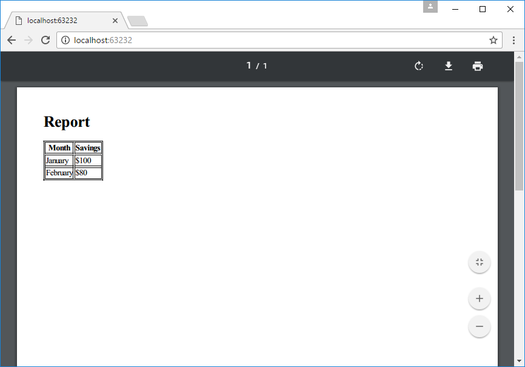

# How to export HTML to PDF in ASP.NET Core
## Requires
- Visual Studio 2017
## License
- Apache License, Version 2.0
## Technologies
- ASP.NET
- .NET
- Web App Development
## Topics
- PDF
- ASP.NET Core
## Updated
- 05/14/2017
## Description

How to export HTML to PDF in ASP.NET Core

Introduction

Many third party libraries can do this job in .NET Core, but they all need to buy a licence.

This sample demonstrates how to export HTML to PDF using node.js in ASP.NET Core.

Sample prerequisites

&bull;&nbsp;Visual Studio 2017 or above. [<a href="https://www.visualstudio.com/" style="text-decoration:none">Visual
 Studio Home Page</a>]

&bull;&nbsp;Visual Studio enabled ASP.NET Core develop component.

&bull;&nbsp;Node.js 6.10.2 or later. [<a href="https://nodejs.org/en/" style="text-decoration:none">Node.js
 and Npm</a>]

&bull;&nbsp;Npm 3.0 or above.

Building the sample

Use Visual Studio to open the sample solution, then press F6 Key to build the sample project.

Running the sample

&bull;&nbsp;Use Visual Studio to open the sample solution, then press F5 Key or select
Debug -&gt; Start Debugging from the menu.

&bull;&nbsp;When the project is running, you will see the below page in browser.

Using the code

Package.json of node.js

&nbsp;

JavaScript

Edit|Remove

js

<pre class="js">{&nbsp;
&nbsp;&nbsp;&quot;name&quot;:&nbsp;&quot;pdf&quot;,&nbsp;
&nbsp;&nbsp;&quot;version&quot;:&nbsp;&quot;1.0.0&quot;,&nbsp;
&nbsp;&nbsp;&quot;description&quot;:&nbsp;&quot;&quot;,&nbsp;
&nbsp;&nbsp;&quot;main&quot;:&nbsp;&quot;index.js&quot;,&nbsp;
&nbsp;&nbsp;&quot;dependencies&quot;:&nbsp;{&nbsp;
&nbsp;&nbsp;&nbsp;&nbsp;&quot;jsreport-core&quot;:&nbsp;&quot;^1.3.1&quot;,&nbsp;
&nbsp;&nbsp;&nbsp;&nbsp;&quot;jsreport-phantom-pdf&quot;:&nbsp;&quot;^1.4.4&quot;,&nbsp;
&nbsp;&nbsp;&nbsp;&nbsp;&quot;jsreport-jsrender&quot;:&nbsp;&quot;^1.0.2&quot;&nbsp;
&nbsp;&nbsp;},&nbsp;
&nbsp;&nbsp;&quot;devDependencies&quot;:&nbsp;{},&nbsp;
&nbsp;&nbsp;&quot;scripts&quot;:&nbsp;{&nbsp;
&nbsp;&nbsp;&nbsp;&nbsp;&quot;test&quot;:&nbsp;&quot;echo&nbsp;\&quot;Error:&nbsp;no&nbsp;test&nbsp;specified\&quot;&nbsp;&amp;&amp;&nbsp;exit&nbsp;1&quot;&nbsp;
&nbsp;&nbsp;},&nbsp;
&nbsp;&nbsp;&quot;author&quot;:&nbsp;&quot;&quot;,&nbsp;
&nbsp;&nbsp;&quot;license&quot;:&nbsp;&quot;ISC&quot;&nbsp;
}&nbsp;</pre>

Generate PDF function with node.js, the file name is pdf.js

&nbsp;

JavaScript

Edit|Remove

js

<pre class="js">module.exports&nbsp;=&nbsp;function&nbsp;(callback,&nbsp;html)&nbsp;{&nbsp;
&nbsp;&nbsp;&nbsp;&nbsp;var&nbsp;jsreport&nbsp;=&nbsp;require('jsreport-core')();&nbsp;
&nbsp;
&nbsp;&nbsp;&nbsp;&nbsp;jsreport.init().then(function&nbsp;()&nbsp;{&nbsp;
&nbsp;&nbsp;&nbsp;&nbsp;&nbsp;&nbsp;&nbsp;&nbsp;return&nbsp;jsreport.render({&nbsp;
&nbsp;&nbsp;&nbsp;&nbsp;&nbsp;&nbsp;&nbsp;&nbsp;&nbsp;&nbsp;&nbsp;&nbsp;template:&nbsp;{&nbsp;
&nbsp;&nbsp;&nbsp;&nbsp;&nbsp;&nbsp;&nbsp;&nbsp;&nbsp;&nbsp;&nbsp;&nbsp;&nbsp;&nbsp;&nbsp;&nbsp;content:&nbsp;html,&nbsp;
&nbsp;&nbsp;&nbsp;&nbsp;&nbsp;&nbsp;&nbsp;&nbsp;&nbsp;&nbsp;&nbsp;&nbsp;&nbsp;&nbsp;&nbsp;&nbsp;engine:&nbsp;'jsrender',&nbsp;
&nbsp;&nbsp;&nbsp;&nbsp;&nbsp;&nbsp;&nbsp;&nbsp;&nbsp;&nbsp;&nbsp;&nbsp;&nbsp;&nbsp;&nbsp;&nbsp;recipe:&nbsp;'phantom-pdf'&nbsp;
&nbsp;&nbsp;&nbsp;&nbsp;&nbsp;&nbsp;&nbsp;&nbsp;&nbsp;&nbsp;&nbsp;&nbsp;}&nbsp;
&nbsp;&nbsp;&nbsp;&nbsp;&nbsp;&nbsp;&nbsp;&nbsp;}).then(function&nbsp;(resp)&nbsp;{&nbsp;
&nbsp;&nbsp;&nbsp;&nbsp;&nbsp;&nbsp;&nbsp;&nbsp;&nbsp;&nbsp;&nbsp;&nbsp;callback(null,&nbsp;resp.content.toJSON().data);&nbsp;
&nbsp;&nbsp;&nbsp;&nbsp;&nbsp;&nbsp;&nbsp;&nbsp;});&nbsp;
&nbsp;&nbsp;&nbsp;&nbsp;}).catch(function&nbsp;(e)&nbsp;{&nbsp;
&nbsp;&nbsp;&nbsp;&nbsp;&nbsp;&nbsp;&nbsp;&nbsp;callback(e,&nbsp;null);&nbsp;
&nbsp;&nbsp;&nbsp;&nbsp;})&nbsp;
};&nbsp;</pre>

&nbsp;

Source HTML

&nbsp;

HTML

Edit|Remove

html

<pre class="html">&lt;!DOCTYPE&nbsp;html&gt;&nbsp;
&lt;html&gt;&nbsp;
&lt;head&gt;&nbsp;
&nbsp;&nbsp;&nbsp;&nbsp;&lt;style&gt;&nbsp;
&nbsp;&nbsp;&nbsp;&nbsp;&nbsp;&nbsp;&nbsp;&nbsp;table,&nbsp;th,&nbsp;td&nbsp;{&nbsp;border:&nbsp;1px&nbsp;solid&nbsp;black;&nbsp;}&nbsp;
&nbsp;&nbsp;&nbsp;&nbsp;&lt;/style&gt;&nbsp;
&lt;/head&gt;&nbsp;
&lt;body&gt;&nbsp;
&nbsp;&nbsp;&nbsp;&nbsp;&lt;h1&gt;Report&lt;/h1&gt;&nbsp;
&nbsp;&nbsp;&nbsp;&nbsp;&lt;table&gt;&nbsp;
&nbsp;&nbsp;&nbsp;&nbsp;&nbsp;&nbsp;&nbsp;&nbsp;&lt;tr&gt;&nbsp;
&nbsp;&nbsp;&nbsp;&nbsp;&nbsp;&nbsp;&nbsp;&nbsp;&nbsp;&nbsp;&nbsp;&nbsp;&lt;th&gt;Month&lt;/th&gt;&nbsp;
&nbsp;&nbsp;&nbsp;&nbsp;&nbsp;&nbsp;&nbsp;&nbsp;&nbsp;&nbsp;&nbsp;&nbsp;&lt;th&gt;Savings&lt;/th&gt;&nbsp;
&nbsp;&nbsp;&nbsp;&nbsp;&nbsp;&nbsp;&nbsp;&nbsp;&lt;/tr&gt;&nbsp;
&nbsp;&nbsp;&nbsp;&nbsp;&nbsp;&nbsp;&nbsp;&nbsp;&lt;tr&gt;&nbsp;
&nbsp;&nbsp;&nbsp;&nbsp;&nbsp;&nbsp;&nbsp;&nbsp;&nbsp;&nbsp;&nbsp;&nbsp;&lt;td&gt;January&lt;/td&gt;&nbsp;
&nbsp;&nbsp;&nbsp;&nbsp;&nbsp;&nbsp;&nbsp;&nbsp;&nbsp;&nbsp;&nbsp;&nbsp;&lt;td&gt;$100&lt;/td&gt;&nbsp;
&nbsp;&nbsp;&nbsp;&nbsp;&nbsp;&nbsp;&nbsp;&nbsp;&lt;/tr&gt;&nbsp;
&nbsp;&nbsp;&nbsp;&nbsp;&nbsp;&nbsp;&nbsp;&nbsp;&lt;tr&gt;&nbsp;
&nbsp;&nbsp;&nbsp;&nbsp;&nbsp;&nbsp;&nbsp;&nbsp;&nbsp;&nbsp;&nbsp;&nbsp;&lt;td&gt;February&lt;/td&gt;&nbsp;
&nbsp;&nbsp;&nbsp;&nbsp;&nbsp;&nbsp;&nbsp;&nbsp;&nbsp;&nbsp;&nbsp;&nbsp;&lt;td&gt;$80&lt;/td&gt;&nbsp;
&nbsp;&nbsp;&nbsp;&nbsp;&nbsp;&nbsp;&nbsp;&nbsp;&lt;/tr&gt;&nbsp;
&nbsp;&nbsp;&nbsp;&nbsp;&lt;/table&gt;&nbsp;
&lt;/body&gt;&nbsp;
&lt;/html&gt;&nbsp;</pre>

&nbsp;

&nbsp;

Startup.cs

&nbsp;

C#

Edit|Remove

csharp

<pre class="csharp">&nbsp;&nbsp;&nbsp;&nbsp;public&nbsp;class&nbsp;Startup&nbsp;
&nbsp;&nbsp;&nbsp;&nbsp;{&nbsp;
&nbsp;&nbsp;&nbsp;&nbsp;&nbsp;&nbsp;&nbsp;&nbsp;public&nbsp;void&nbsp;ConfigureServices(IServiceCollection&nbsp;services)&nbsp;
&nbsp;&nbsp;&nbsp;&nbsp;&nbsp;&nbsp;&nbsp;&nbsp;{&nbsp;
&nbsp;&nbsp;&nbsp;&nbsp;&nbsp;&nbsp;&nbsp;&nbsp;&nbsp;&nbsp;&nbsp;&nbsp;services.AddNodeServices();//&nbsp;this&nbsp;is&nbsp;in&nbsp;package&nbsp;Microsoft.AspNetCore.NodeServices&nbsp;
&nbsp;&nbsp;&nbsp;&nbsp;&nbsp;&nbsp;&nbsp;&nbsp;&nbsp;&nbsp;&nbsp;&nbsp;services.AddMvc();&nbsp;
&nbsp;&nbsp;&nbsp;&nbsp;&nbsp;&nbsp;&nbsp;&nbsp;}&nbsp;
&nbsp;
&nbsp;&nbsp;&nbsp;&nbsp;&nbsp;&nbsp;&nbsp;&nbsp;public&nbsp;void&nbsp;Configure(IApplicationBuilder&nbsp;app)&nbsp;
&nbsp;&nbsp;&nbsp;&nbsp;&nbsp;&nbsp;&nbsp;&nbsp;{&nbsp;
&nbsp;&nbsp;&nbsp;&nbsp;&nbsp;&nbsp;&nbsp;&nbsp;&nbsp;&nbsp;&nbsp;&nbsp;app.UseStaticFiles();&nbsp;
&nbsp;&nbsp;&nbsp;&nbsp;&nbsp;&nbsp;&nbsp;&nbsp;&nbsp;&nbsp;&nbsp;&nbsp;app.UseMvcWithDefaultRoute();&nbsp;
&nbsp;&nbsp;&nbsp;&nbsp;&nbsp;&nbsp;&nbsp;&nbsp;}&nbsp;
&nbsp;&nbsp;&nbsp;&nbsp;}&nbsp;</pre>

&nbsp;

&nbsp;

Controller

&nbsp;

C#

Edit|Remove

csharp

<pre class="csharp">&nbsp;&nbsp;&nbsp;&nbsp;&nbsp;&nbsp;&nbsp;&nbsp;[HttpGet]&nbsp;
&nbsp;&nbsp;&nbsp;&nbsp;&nbsp;&nbsp;&nbsp;&nbsp;public&nbsp;async&nbsp;Task&lt;IActionResult&gt;&nbsp;Index([FromServices]&nbsp;INodeServices&nbsp;nodeServices)&nbsp;
&nbsp;&nbsp;&nbsp;&nbsp;&nbsp;&nbsp;&nbsp;&nbsp;{&nbsp;
&nbsp;&nbsp;&nbsp;&nbsp;&nbsp;&nbsp;&nbsp;&nbsp;&nbsp;&nbsp;&nbsp;&nbsp;HttpClient&nbsp;hc&nbsp;=&nbsp;new&nbsp;HttpClient();&nbsp;
&nbsp;&nbsp;&nbsp;&nbsp;&nbsp;&nbsp;&nbsp;&nbsp;&nbsp;&nbsp;&nbsp;&nbsp;var&nbsp;htmlContent&nbsp;=&nbsp;await&nbsp;hc.GetStringAsync($&quot;http://{Request.Host}/report.html&quot;);&nbsp;
&nbsp;
&nbsp;&nbsp;&nbsp;&nbsp;&nbsp;&nbsp;&nbsp;&nbsp;&nbsp;&nbsp;&nbsp;&nbsp;var&nbsp;result&nbsp;=&nbsp;await&nbsp;nodeServices.InvokeAsync&lt;byte[]&gt;(&quot;./pdf&quot;,&nbsp;htmlContent);&nbsp;
&nbsp;
&nbsp;&nbsp;&nbsp;&nbsp;&nbsp;&nbsp;&nbsp;&nbsp;&nbsp;&nbsp;&nbsp;&nbsp;HttpContext.Response.ContentType&nbsp;=&nbsp;&quot;application/pdf&quot;;&nbsp;
&nbsp;&nbsp;&nbsp;&nbsp;&nbsp;&nbsp;&nbsp;&nbsp;&nbsp;&nbsp;&nbsp;&nbsp;&nbsp;
&nbsp;&nbsp;&nbsp;&nbsp;&nbsp;&nbsp;&nbsp;&nbsp;&nbsp;&nbsp;&nbsp;&nbsp;HttpContext.Response.Headers.Add(&quot;x-filename&quot;,&nbsp;&quot;report.pdf&quot;);&nbsp;
&nbsp;&nbsp;&nbsp;&nbsp;&nbsp;&nbsp;&nbsp;&nbsp;&nbsp;&nbsp;&nbsp;&nbsp;HttpContext.Response.Headers.Add(&quot;Access-Control-Expose-Headers&quot;,&nbsp;&quot;x-filename&quot;);&nbsp;
&nbsp;&nbsp;&nbsp;&nbsp;&nbsp;&nbsp;&nbsp;&nbsp;&nbsp;&nbsp;&nbsp;&nbsp;HttpContext.Response.Body.Write(result,&nbsp;0,&nbsp;result.Length);&nbsp;
&nbsp;&nbsp;&nbsp;&nbsp;&nbsp;&nbsp;&nbsp;&nbsp;&nbsp;&nbsp;&nbsp;&nbsp;return&nbsp;new&nbsp;ContentResult();&nbsp;
&nbsp;&nbsp;&nbsp;&nbsp;&nbsp;&nbsp;&nbsp;&nbsp;}&nbsp;</pre>

&nbsp;

For building new project

&bull;&nbsp; Copy package.json to new project root.

Main dependencies are jsreport-core,
jsreport-phantom-pdf,
jsreport-jsrender.

&bull;&nbsp; Add file pdf.js to project root.

&bull;&nbsp; Add nuget package Microsoft.AspNetCore.NodeServices.

&bull;&nbsp; Add the below code in Startup/ConfigureServices

services.AddNodeServices();

&bull;&nbsp; Use node service in controller. See file HomeController.cs

More information

Introducing jsreport-core

<a href="https://jsreport.net/blog/introducing-jsreport-core" style="text-decoration:none">https://jsreport.net/blog/introducing-jsreport-core</a>

&nbsp;

About NodeServices

<a href="http://blog.nbellocam.me/2016/08/24/javascriptservices-asp-net-core/" style="text-decoration:none">http://blog.nbellocam.me/2016/08/24/javascriptservices-asp-net-core/</a>

Microsoft All-In-One Code Framework is a free, centralized code sample library driven by developers' real-world pains and needs. The goal is to provide customer-driven code samples for all Microsoft development technologies,
 and reduce developers' efforts in solving typical programming tasks. Our team listens to developers&rsquo; pains in the MSDN forums, social media and various DEV communities. We write code samples based on developers&rsquo; frequently asked programming tasks,
 and allow developers to download them with a short sample publishing cycle. Additionally, we offer a free code sample request service. It is a proactive way for our developer community to obtain code samples directly from Microsoft.

