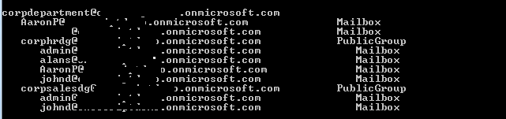
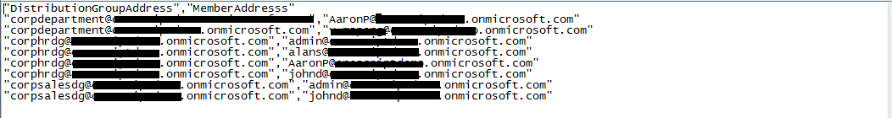

# How to export the distribution groups from Office 365 Exchange Online
## Requires
- Visual Studio 2013
## License
- Apache License, Version 2.0
## Technologies
- Exchange Online
- Office 365
## Topics
- O365
- distribution groups
## Updated
- 09/22/2016
## Description

How to Export the Distribution Groups

Introduction

Sometimes we need to export distribution groups and their members, but Outlook Web App (OWA) doesn&rsquo;t provide
such a function. In this application, we will demonstrate how to export the Distribution Groups and their members.

1. We get the members of the root group.

2. We export all the mailboxes in the group.

3. We can choose to process the following steps recursively for the nested groups.

Running the Sample

Press F5 to run the sample, you will get the following result.

First, we use our account to connect to the Exchange Online.

Then, we need to input the distribution group address.

And we also need to input the file path that we want to store the addresses.

The following is the result:

We can also find the file as
shown below:

Using the Code

1. Get the distribution group address

The user needs to input the distribution group address, and we will check if the address is
 a valid address. 

C#VB

Edit|Remove

csharpvb

<pre id="codePreview" class="csharp">
private static String GetGroupAddress()
{
    String pattern = @&quot;\w&#43;([-&#43;.]\w&#43;)*@\w&#43;([-.]\w&#43;)*\.\w&#43;([-.]\w&#43;)*&quot;;
    Regex regex = new Regex(pattern);
    do
    {
        Console.Write(&quot;Please input the Distribution Group Address:&quot;);
        String address = Console.ReadLine();
        if (regex.IsMatch(address))
        {
            return address;
        }
        Console.WriteLine(&quot;The Email address is invaild.&quot;);
    } while (true);
}
</pre>

&nbsp;

2. Process recursively

If the user needs recursion, and the member is group, we
 will process the method recursively. 

C#VB

Edit|Remove

csharpvb

<pre id="codePreview" class="csharp">
if (isRecursive & (member.MailboxType == MailboxType.ContactGroup || 
    member.MailboxType == MailboxType.PublicGroup))
{
    Console.WriteLine(pad &#43; &quot;{0,-50}{1,-11}&quot;, member.Address, member.MailboxType);
    ExportGroup(service, member, pad, isRecursive, writer);
}
</pre>

&nbsp;

3. Export the members 

If the user sets recursion, the method
will export the mailbox addresses of the root group and the nested groups; or the method
will export the mailbox and group addresses of the root group.

C#VB

Edit|Remove

csharpvb

<pre id="codePreview" class="csharp">
else
{
    Console.WriteLine(pad &#43; &quot;{0,-50}{1,-11}&quot;, member.Address, member.MailboxType);
    writer.WriteLine(&quot;\&quot;{0}\&quot;,\&quot;{1}\&quot;&quot;, groupAddress, member.Address);
}
</pre>

&nbsp;

More Information

<a href="http://msdn.microsoft.com/en-us/library/dd633709(v=exchg.80).aspx" style="text-decoration:none">EWS Managed API 2.0</a>

<a href="http://msdn.microsoft.com/en-us/library/hh532557(v=exchg.80).aspx" style="text-decoration:none">Expanding a distribution list by using the EWS Managed API</a>

&nbsp; 

Microsoft All-In-One Code Framework is a free, centralized code sample library driven by developers' real-world pains and needs. The goal is to provide customer-driven code samples for all Microsoft development technologies,
 and reduce developers' efforts in solving typical programming tasks. Our team listens to developers’ pains in the MSDN forums, social media and various DEV communities. We write code samples based on developers’ frequently asked programming tasks, and allow
 developers to download them with a short sample publishing cycle. Additionally, we offer a free code sample request service. It is a proactive way for our developer community to obtain code samples directly from Microsoft.

