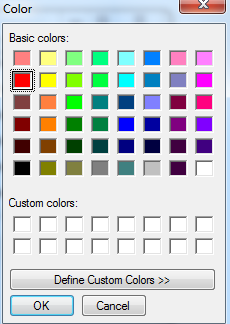

# How to find the text and highlight all text in RichTextBox of windows form
## Requires
- Visual Studio 2010
## License
- Apache License, Version 2.0
## Technologies
- Windows Forms
## Topics
- RichTextBox
- hightlight
## Updated
- 03/22/2013
## Description

The sample demonstrates how to find and highlight all matched text in RichTextBox of Windows Form.

Users can input text that they want to search in search combobox, and then they also can select find options and highlight color, if the searched text exists in richtextbox, the searched text will be highlighted with the selected color; and if
 the searched text can't be found in the text of richtextbox control, a prompt message will be shown.

We can run the sample according to the following steps: 

Step1. Open &quot;CSWinFormSearchAndHighlightText.sln&quot; and then click Ctrl&#43;F5 to run the project. You can see the following form:

Step2. Input text in Search combobox and click &quot;panelColor&quot; to choose the highlight color, when click &quot;panelColor&quot; control, a popup form will be shown and you can choose color from the popup form:

Step3. After choose the highlight color and click &quot;OK&quot; button, then click &quot;SearchAndHightlight&quot; button, if the searched text exists in richtextbox control, the text will be highlighted with selected color, and if the text
 doesn't exist, a prompt message: &quot;Can't find the &quot;XXXX&quot; in RichTextBox control&quot; will be shown.

Step1. Create Windows Form project via Visual Studio and named it as &quot;CSWinFormSearchAndHighlightText&quot;

Step2. Add Component Class into the project and named the class as &quot;CustomRichTextBox&quot;.

C#

Edit|Remove

csharp

<pre id="codePreview" class="csharp">
/// &lt;summary&gt;
    ///  Custom RichTextBox control
    /// &lt;/summary&gt;
    public partial class CustomRichTextBox :RichTextBox
    {
        public CustomRichTextBox():base()
        {
            InitializeComponent();
        }

        /// &lt;summary&gt;
        ///  Search and Highlight all text in RichTextBox Control 
        /// &lt;/summary&gt;
        /// &lt;param name=&quot;findWhat&quot;&gt;Find What&lt;/param&gt;
        /// &lt;param name=&quot;highlightColor&quot;&gt;Highlight Color&lt;/param&gt;
        /// &lt;param name=&quot;ismatchCase&quot;&gt;Is Match Case&lt;/param&gt;
        /// &lt;param name=&quot;ismatchWholeWord&quot;&gt;Is Match Whole Word&lt;/param&gt;
        /// &lt;returns&gt;&lt;/returns&gt;
        public bool Highlight(string findWhat, Color highlightColor, bool ismatchCase, bool ismatchWholeWord)
        {
            // Clear all highlights before searching text again
            ClearHighlight();

            int startSearch = 0;
            //int searchLength = findWhat.Length;
            RichTextBoxFinds findoptions = default(RichTextBoxFinds);

            // Setup the search options.
            if (ismatchCase && ismatchWholeWord)
            {
                findoptions = RichTextBoxFinds.MatchCase | RichTextBoxFinds.WholeWord;
            }
            else if (ismatchCase)
            {
                findoptions = RichTextBoxFinds.MatchCase;
            }
            else if (ismatchWholeWord)
            {
                findoptions = RichTextBoxFinds.WholeWord;
            }
            else
            {
                findoptions = RichTextBoxFinds.None;
            }

            // detect whether search text exists in richtextbox
            bool isfind = false;
            int index = -1;

            // Search text in RichTextBox and highlight them with color.
            while ((index = this.Find(findWhat, startSearch, findoptions)) &gt; -1)
            {
                isfind = true;

                this.SelectionBackColor = highlightColor;
                
                // Continue after the one we searched
                startSearch = index&#43;1;
            }

            // If the text exist in RichTextBox control, then return true, otherwise, return false
            return isfind;
        }

        /// &lt;summary&gt;
        ///  Clear all Highlights 
        /// &lt;/summary&gt;
        private void ClearHighlight()
        {
            this.SelectAll();
            this.SelectionBackColor = Color.White;
        }
    }

</pre>

&nbsp;

Step3. Design UI of the main form and implement behind code according to the following codes.

<a href="http://msdn.microsoft.com/en-us/library/3134f2f7.aspx">RichTextBox.Find Method</a>

<a href="http://msdn.microsoft.com/en-us/library/f3fk1e1k(v=vs.90).aspx">ColorDialog Class</a>

