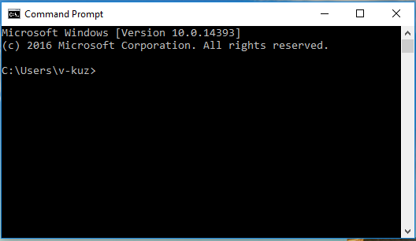
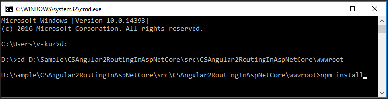
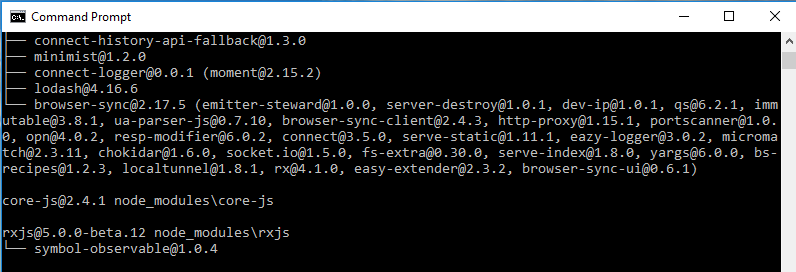
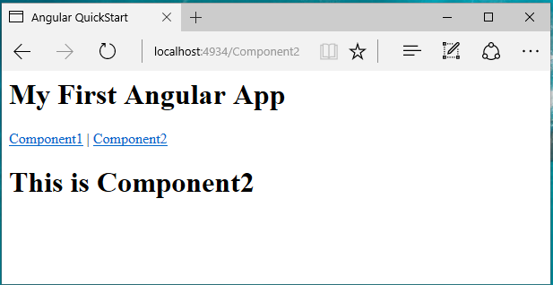

# How to fix the routing error when reloading angular2 SPA in ASP.NET Core
## Requires
- Visual Studio 2015
## License
- Apache License, Version 2.0
## Technologies
- ASP.NET
- .NET
- Web App Development
## Topics
- ASP.NET Core
- Angular2
- Routing
## Updated
- 03/28/2017
## Description

How to
fix the routing error when reloading angular2 APS in ASP.NET Core

Introduction

When you set up angular2 in your ASP.NET Core web application, you might notice that, when you&nbsp;route to an address like
<a href="http://localhost:5000/component" style="text-decoration:none">http://localhost:5000/component</a>, or when you reload this page, the result maybe a 404 error.

Since angular2 has a new routing role locally, like localhost:5000/home/index, same as ASP.NET's routing role, all requests will go through server's routing role first, and request address like localhost:5000/home/index does not exist in server,
 so the server will return a 404 error to you.

This sample will demonstrate how to work around this problem.

Sample prerequisites

&bull;&nbsp;.Net Core 1.0 or later version(s). [<a href="http://go.microsoft.com/fwlink/?LinkID=798306" style="text-decoration:none">.Net
 Core &#43; Visual Studio tooling</a>]

&bull;&nbsp;Microsoft Visual Studio 2015 update3 or above. [<a href="https://www.visualstudio.com/en-us/visual-studio-homepage-vs.aspx" style="text-decoration:none">Visual
 Studio 2015 Home Page installer</a>]

&bull;&nbsp;Node.js v5.0.0 or later version(s). [<a href="https://nodejs.org/en/" style="text-decoration:none">Node.js
 and NPM</a>]

&bull;&nbsp;Npm 3.0.0 or above. [<a href="https://nodejs.org/en/" style="text-decoration:none">Node.js
 and NPM</a>]

Building the sample

&bull;&nbsp;Press
win &#43; R and type cmd to open Command Line window.

&nbsp;

&bull;&nbsp;Local to the
wwwroot folder of this solution.

&nbsp;

&bull;&nbsp;Type command
npm install, then the npm will install the packages.

&nbsp;

&bull;&nbsp;Open the sample solution &ldquo;CSAngular2RoutingInAspNetCore.sln&rdquo; using Visual Studio.

&bull;&nbsp;Right click the project &ldquo;CSAngular2RoutingInAspNetCore&rdquo; and select Restore Packages.

&nbsp;

&bull;&nbsp;Press
F6 Key or select Build -&gt; Build Solution from the menu to build the sample.

Running the sample

&bull;&nbsp;Open the sample solution using Visual Studio, then press F5 Key or select
<strong>Debug -&gt; Start Debugging </strong>from the menu.

&bull;&nbsp;When the web application is running, you can see this page&nbsp;on your browser.

&nbsp;

&bull;&nbsp;Click the
Component2 link, and the view will route to Component2.

&nbsp;

&bull;&nbsp;Press
F5 Key or click <strong>Reload</strong> button on your browser,
the page will reload success.

Using the code

Startup.cs / Configure method.

&nbsp;

When you use static files case:

&nbsp;

C#

Edit|Remove

csharp

<pre class="csharp">app.Use(async&nbsp;(context,&nbsp;next)&nbsp;=&gt;&nbsp;
&nbsp;&nbsp;&nbsp;&nbsp;{&nbsp;
&nbsp;&nbsp;&nbsp;&nbsp;&nbsp;&nbsp;&nbsp;&nbsp;await&nbsp;next();&nbsp;
&nbsp;&nbsp;&nbsp;&nbsp;&nbsp;&nbsp;&nbsp;&nbsp;if&nbsp;(context.Response.StatusCode&nbsp;==&nbsp;404&nbsp;&amp;&amp;&nbsp;!Path.HasExtension(context.Request.Path.Value))&nbsp;
&nbsp;&nbsp;&nbsp;&nbsp;&nbsp;&nbsp;&nbsp;&nbsp;{&nbsp;
&nbsp;&nbsp;&nbsp;&nbsp;&nbsp;&nbsp;&nbsp;&nbsp;&nbsp;&nbsp;&nbsp;&nbsp;context.Request.Path&nbsp;=&nbsp;&quot;/index.html&quot;;&nbsp;
&nbsp;&nbsp;&nbsp;&nbsp;&nbsp;&nbsp;&nbsp;&nbsp;&nbsp;&nbsp;&nbsp;&nbsp;await&nbsp;next();&nbsp;
&nbsp;&nbsp;&nbsp;&nbsp;&nbsp;&nbsp;&nbsp;&nbsp;}&nbsp;
&nbsp;&nbsp;&nbsp;&nbsp;})&nbsp;
&nbsp;&nbsp;&nbsp;&nbsp;.UseDefaultFiles(new&nbsp;DefaultFilesOptions&nbsp;{&nbsp;DefaultFileNames&nbsp;=&nbsp;new&nbsp;List&lt;string&gt;&nbsp;{&nbsp;&quot;index.html&quot;&nbsp;}&nbsp;})&nbsp;
&nbsp;&nbsp;&nbsp;&nbsp;.UseStaticFiles()&nbsp;
.UseMvc();&nbsp;</pre>

&nbsp;

&nbsp;When you&nbsp;use mvc view case:

&nbsp;

C#

Edit|Remove

csharp

<pre class="csharp">app.UseStaticFiles()&nbsp;
&nbsp;&nbsp;&nbsp;.UseMvc(routes&nbsp;=&gt;&nbsp;
&nbsp;&nbsp;&nbsp;{&nbsp;
&nbsp;&nbsp;&nbsp;&nbsp;&nbsp;&nbsp;&nbsp;routes.MapRoute(&nbsp;
&nbsp;&nbsp;&nbsp;&nbsp;&nbsp;&nbsp;&nbsp;&nbsp;&nbsp;&nbsp;&nbsp;name:&nbsp;&quot;default&quot;,&nbsp;
&nbsp;&nbsp;&nbsp;&nbsp;&nbsp;&nbsp;&nbsp;&nbsp;&nbsp;&nbsp;&nbsp;template:&nbsp;&quot;{controller=Home}/{action=Index}&quot;);&nbsp;
&nbsp;&nbsp;&nbsp;&nbsp;&nbsp;&nbsp;&nbsp;routes.MapSpaFallbackRoute(&quot;spa-fallback&quot;,&nbsp;new&nbsp;{&nbsp;controller&nbsp;=&nbsp;&quot;Home&quot;,&nbsp;action&nbsp;=&nbsp;&quot;Index&quot;&nbsp;});&nbsp;
&nbsp;&nbsp;&nbsp;});&nbsp;</pre>

&nbsp;

More information

Angular 2 Routing with ASP.NET Core 1 (aka ASP.NET 5)

&nbsp;<a href="http://benjii.me/2016/01/angular2-routing-with-asp-net-core-1/" style="text-decoration:none">http://benjii.me/2016/01/angular2-routing-with-asp-net-core-1/</a>

Routing in Angular 2 with ASP.NET Core

&nbsp;<a href="http://blog.nbellocam.me/2016/03/21/routing-angular-2-asp-net-core/" style="text-decoration:none">http://blog.nbellocam.me/2016/03/21/routing-angular-2-asp-net-core/</a>

Microsoft All-In-One Code Framework is a free, centralized code sample library driven by developers' real-world pains and needs. The goal is to provide customer-driven code samples for all Microsoft development technologies,
 and reduce developers' efforts in solving typical programming tasks. Our team listens to developers&rsquo; pains in the MSDN forums, social media and various DEV communities. We write code samples based on developers&rsquo; frequently asked programming tasks,
 and allow developers to download them with a short sample publishing cycle. Additionally, we offer a free code sample request service. It is a proactive way for our developer community to obtain code samples directly from Microsoft.

