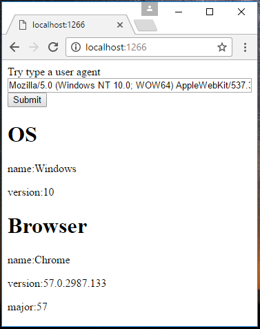

# How to get OS and browser information of client in ASP.NET Core
## Requires
- Visual Studio 2017
## License
- Apache License, Version 2.0
## Technologies
- ASP.NET
- .NET
- Web App Development
## Topics
- ASP.NET Core
- determine os type
- determine brower
## Updated
- 03/31/2017
## Description

How to
achieve a basic authorization in ASP.NET Core

Introduction

This sample demonstrates how to get OS and browser information of client in ASP.NET Core.

We use the user-agent in http header, parse the user-agent and get the needed information.&nbsp;

&nbsp;

<strong>Note:</strong>this sample just test cover popular OS and browsers, do not use it in production without full test.

Sample prerequisites

<ul>
<li>Visual Studio 2017 or above version&nbsp;(install asp.net core web development). [<a href="https://www.visualstudio.com/">Visual Studio Home Page</a>]
</li></ul>

Building the sample

&bull;&nbsp;Open the sample solution file &ldquo;<strong>CSDetermineOSAndBrowserASPNETCore.sln</strong>&rdquo; in Visual Studio.

&bull;&nbsp;Press
F6 Key or select Build -&gt; Build Solution from the menu to build the sample.

Running the sample

&bull;&nbsp;Open the Sample solution using Visual Studio, then press
F5 Key or select Debug -&gt; Start Debugging from the menu.

&bull;&nbsp;When the web application is running, you can see the page in
browser.

Using the code

&nbsp;

&nbsp;The UserAgent class

The code for this too long, please download sample package and view it.

&nbsp;

&nbsp;In Controller

&nbsp;

C#

编辑脚本|Remove

csharp

<pre class="csharp">&nbsp;&nbsp;&nbsp;&nbsp;&nbsp;&nbsp;&nbsp;&nbsp;public&nbsp;ActionResult&nbsp;Index(string&nbsp;userAgent)&nbsp;
&nbsp;&nbsp;&nbsp;&nbsp;&nbsp;&nbsp;&nbsp;&nbsp;{&nbsp;
&nbsp;&nbsp;&nbsp;&nbsp;&nbsp;&nbsp;&nbsp;&nbsp;&nbsp;&nbsp;&nbsp;&nbsp;if&nbsp;(string.IsNullOrEmpty(userAgent))&nbsp;
&nbsp;&nbsp;&nbsp;&nbsp;&nbsp;&nbsp;&nbsp;&nbsp;&nbsp;&nbsp;&nbsp;&nbsp;{&nbsp;
&nbsp;&nbsp;&nbsp;&nbsp;&nbsp;&nbsp;&nbsp;&nbsp;&nbsp;&nbsp;&nbsp;&nbsp;&nbsp;&nbsp;&nbsp;&nbsp;userAgent&nbsp;=&nbsp;Request.Headers[&quot;User-Agent&quot;];&nbsp;
&nbsp;&nbsp;&nbsp;&nbsp;&nbsp;&nbsp;&nbsp;&nbsp;&nbsp;&nbsp;&nbsp;&nbsp;}&nbsp;
&nbsp;
&nbsp;&nbsp;&nbsp;&nbsp;&nbsp;&nbsp;&nbsp;&nbsp;&nbsp;&nbsp;&nbsp;&nbsp;UserAgent.UserAgent&nbsp;ua&nbsp;=&nbsp;new&nbsp;UserAgent.UserAgent(userAgent);&nbsp;
&nbsp;
&nbsp;&nbsp;&nbsp;&nbsp;&nbsp;&nbsp;&nbsp;&nbsp;&nbsp;&nbsp;&nbsp;&nbsp;return&nbsp;View(ua);&nbsp;
&nbsp;&nbsp;&nbsp;&nbsp;&nbsp;&nbsp;&nbsp;&nbsp;}&nbsp;
</pre>

&nbsp;Html

&nbsp;

HTML

编辑脚本|Remove

html

<pre class="csharp">@model&nbsp;CSDetermineOSAndBrowserASPNETCore.UserAgent.UserAgent&nbsp;
&nbsp;&nbsp;&nbsp;&nbsp;&lt;h1&gt;OS&lt;/h1&gt;&nbsp;
&nbsp;&nbsp;&nbsp;&nbsp;&lt;p&gt;name:@Model.OS.Name&lt;/p&gt;&nbsp;
&nbsp;&nbsp;&nbsp;&nbsp;&lt;p&gt;version:@Model.OS.Version&lt;/p&gt;&nbsp;
&nbsp;
&nbsp;&nbsp;&nbsp;&nbsp;&lt;h1&gt;Browser&lt;/h1&gt;&nbsp;
&nbsp;&nbsp;&nbsp;&nbsp;&lt;p&gt;name:@Model.Browser.Name&lt;/p&gt;&nbsp;
&nbsp;&nbsp;&nbsp;&nbsp;&lt;p&gt;version:@Model.Browser.Version&lt;/p&gt;&nbsp;
&nbsp;&nbsp;&nbsp;&nbsp;&lt;p&gt;major:@Model.Browser.Major&lt;/p&gt;&nbsp;
</pre>

&nbsp;

More information

&nbsp;

Us-parser-js on Github

<a href="https://github.com/faisalman/ua-parser-js">https://github.com/faisalman/ua-parser-js</a>&nbsp;

&nbsp;

Microsoft All-In-One Code Framework is a free, centralized code sample library driven by developers' real-world pains and needs. The goal is to provide customer-driven code samples for all Microsoft development technologies,
 and reduce developers' efforts in solving typical programming tasks. Our team listens to developers&rsquo; pains in the MSDN forums, social media and various DEV communities. We write code samples based on developers&rsquo; frequently asked programming tasks,
 and allow developers to download them with a short sample publishing cycle. Additionally, we offer a free code sample request service. It is a proactive way for our developer community to obtain code samples directly from Microsoft.

