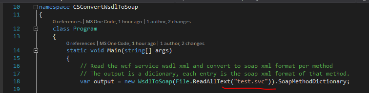

# How to get SOAP Service method and parameter from wsdl address
## Requires
- Visual Studio 2015
## License
- Apache License, Version 2.0
## Technologies
- WCF
- .NET
- Services
## Topics
- WCF
- .NET
- Services
## Updated
- 10/28/2016
## Description

How to get SOAP service method and parameter from WSDL address

Introduction

When accessing the WCF service, users can download the service description xml WSDL file from service address. Sometimes, users might&nbsp;need to use SOAP way to invoke service method. However, users can&rsquo;t post WSDL format to service address.
 Instead, they have to convert the WSDL format xml to SOAP format. This sample demonstrates how to get SOAP service method and parameter from WSDL address.

Sample prerequisites

&bull;&nbsp;Visual studio 2015

Running the sample

&bull;&nbsp;Open the solution file in archive

&bull;&nbsp;Download the target WSDL file from WCF service address, for example, if your service address is
<a href="http://localhost:6742/Service1.svc" style="text-decoration:none">http://localhost:6742/Service1.svc</a> then you can download the WSDL file from
<a href="http://localhost:6742/Service1.svc?singleWsdl" style="text-decoration:none">http://localhost:6742/Service1.svc?singleWsdl</a>

&bull;&nbsp;Change the WSDL file path in
Program.cs line 18

&bull;&nbsp;Then run or debug the project, you will get the dictionary output which contains all the SOAP format method definition

Using the code

When customers need to invoke SOAP style service on WCF service, they can make the use of sample code to generate SOAP formation content to do invocation.

&nbsp;

The sample implements WsdlToSoap
utility to do the tedious&nbsp;work&nbsp;of converting WSDL to SOAP. You can make the use of it as you like.

&nbsp;

The below code snippets demonstrate how to do SOAP invocation on WCF service making the use of the convert class.

&nbsp;

&nbsp;

C#

Edit|Remove

csharp
<pre class="hidden">static void Main(string[] args)
{
	// Read the wcf service wsdl xml and convert to soap xml format per method
	// The output is a dicionary, each entry is the soap xml format of that method.
	var output = new WsdlToSoap(File.ReadAllText(&quot;test.svc&quot;)).SoapMethodDictionary;

	// The test.svc wsdl contains a method &quot;GetData&quot;, please change the method name here according to your WCF service
	var soapXmlStringGetData = output[&quot;GetData&quot;];

	WebClient client = new WebClient();

	// the Content-Type needs to be set to XML
	client.Headers.Add(&quot;Content-Type&quot;, &quot;text/xml;charset=utf-8&quot;);

	// The SOAPAction header indicates which method you would like to invoke
	// and could be seen in the WSDL: &lt;soap:operation soapAction=&quot;...&quot; /&gt; element
	client.Headers.Add(&quot;SOAPAction&quot;, &quot;\&quot;http://tempuri.org/IService1/GetData\&quot;&quot;);

	// Please enter the your wcf service address here
	var response = client.UploadString(&quot;http://localhost:6742/Service1.svc&quot;, soapXmlStringGetData);

	// get the response
	Console.WriteLine(response);
}
</pre>

<pre class="csharp">static&nbsp;void&nbsp;Main(string[]&nbsp;args)&nbsp;
{&nbsp;
&nbsp;&nbsp;&nbsp;&nbsp;//&nbsp;Read&nbsp;the&nbsp;wcf&nbsp;service&nbsp;wsdl&nbsp;xml&nbsp;and&nbsp;convert&nbsp;to&nbsp;soap&nbsp;xml&nbsp;format&nbsp;per&nbsp;method&nbsp;
&nbsp;&nbsp;&nbsp;&nbsp;//&nbsp;The&nbsp;output&nbsp;is&nbsp;a&nbsp;dicionary,&nbsp;each&nbsp;entry&nbsp;is&nbsp;the&nbsp;soap&nbsp;xml&nbsp;format&nbsp;of&nbsp;that&nbsp;method.&nbsp;
&nbsp;&nbsp;&nbsp;&nbsp;var&nbsp;output&nbsp;=&nbsp;new&nbsp;WsdlToSoap(File.ReadAllText(&quot;test.svc&quot;)).SoapMethodDictionary;&nbsp;
&nbsp;
&nbsp;&nbsp;&nbsp;&nbsp;//&nbsp;The&nbsp;test.svc&nbsp;wsdl&nbsp;contains&nbsp;a&nbsp;method&nbsp;&quot;GetData&quot;,&nbsp;please&nbsp;change&nbsp;the&nbsp;method&nbsp;name&nbsp;here&nbsp;according&nbsp;to&nbsp;your&nbsp;WCF&nbsp;service&nbsp;
&nbsp;&nbsp;&nbsp;&nbsp;var&nbsp;soapXmlStringGetData&nbsp;=&nbsp;output[&quot;GetData&quot;];&nbsp;
&nbsp;
&nbsp;&nbsp;&nbsp;&nbsp;WebClient&nbsp;client&nbsp;=&nbsp;new&nbsp;WebClient();&nbsp;
&nbsp;
&nbsp;&nbsp;&nbsp;&nbsp;//&nbsp;the&nbsp;Content-Type&nbsp;needs&nbsp;to&nbsp;be&nbsp;set&nbsp;to&nbsp;XML&nbsp;
&nbsp;&nbsp;&nbsp;&nbsp;client.Headers.Add(&quot;Content-Type&quot;,&nbsp;&quot;text/xml;charset=utf-8&quot;);&nbsp;
&nbsp;
&nbsp;&nbsp;&nbsp;&nbsp;//&nbsp;The&nbsp;SOAPAction&nbsp;header&nbsp;indicates&nbsp;which&nbsp;method&nbsp;you&nbsp;would&nbsp;like&nbsp;to&nbsp;invoke&nbsp;
&nbsp;&nbsp;&nbsp;&nbsp;//&nbsp;and&nbsp;could&nbsp;be&nbsp;seen&nbsp;in&nbsp;the&nbsp;WSDL:&nbsp;&lt;soap:operation&nbsp;soapAction=&quot;...&quot;&nbsp;/&gt;&nbsp;element&nbsp;
&nbsp;&nbsp;&nbsp;&nbsp;client.Headers.Add(&quot;SOAPAction&quot;,&nbsp;&quot;\&quot;http://tempuri.org/IService1/GetData\&quot;&quot;);&nbsp;
&nbsp;
&nbsp;&nbsp;&nbsp;&nbsp;//&nbsp;Please&nbsp;enter&nbsp;the&nbsp;your&nbsp;wcf&nbsp;service&nbsp;address&nbsp;here&nbsp;
&nbsp;&nbsp;&nbsp;&nbsp;var&nbsp;response&nbsp;=&nbsp;client.UploadString(&quot;http://localhost:6742/Service1.svc&quot;,&nbsp;soapXmlStringGetData);&nbsp;
&nbsp;
&nbsp;&nbsp;&nbsp;&nbsp;//&nbsp;get&nbsp;the&nbsp;response&nbsp;
&nbsp;&nbsp;&nbsp;&nbsp;Console.WriteLine(response);&nbsp;
}&nbsp;
</pre>

&nbsp;

&nbsp;

More information

&bull;&nbsp;WSDL definition:
<a href="https://www.w3.org/TR/wsdl" style="text-decoration:none">https://www.w3.org/TR/wsdl</a>

&bull;&nbsp;SOAP definition:
<a href="https://en.wikipedia.org/wiki/SOAP" style="text-decoration:none">https://en.wikipedia.org/wiki/SOAP</a>

Microsoft All-In-One Code Framework is a free, centralized code sample library driven by developers' real-world pains and needs. The goal is to provide customer-driven code samples for all Microsoft development technologies,
 and reduce developers' efforts in solving typical programming tasks. Our team listens to developers&rsquo; pains in the MSDN forums, social media and various DEV communities. We write code samples based on developers&rsquo; frequently asked programming tasks,
 and allow developers to download them with a short sample publishing cycle. Additionally, we offer a free code sample request service. It is a proactive way for our developer community to obtain code samples directly from Microsoft.

