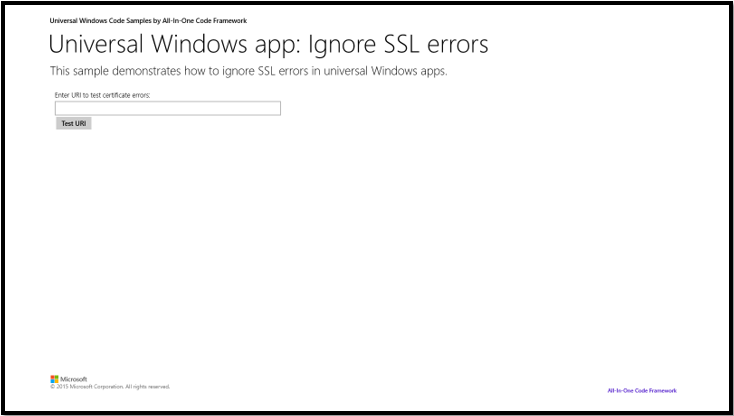

# How to ignore Self Signed Certificate (SSL) errors in universal Windows apps
## Requires
- Visual Studio 2013
## License
- Apache License, Version 2.0
## Technologies
- C#
- XAML
- C++
- Visual Studio 2013
## Topics
- ssl
- universal app
## Updated
- 10/22/2015
## Description

<h2>How to ignore Self Signed Certificate errors in universal Windows apps</h2>
<h2>Introduction</h2>

There are some very limited times when we need to ignore Server Certificate errors. For instance, we have endpoint internal to our network and the certificate is self-signed certificate and for some reasons, we can&rsquo;t deploy the certificate to all the
 necessary clients and install them as a trusted root.

<h2>Running the Sample</h2>

You must run this code sample on Visual Studio 2013 or newer versions on Windows 8.1 or newer versions.

After you successfully build and run the sample project in Visual Studio 2013, the screen below will show up:

Enter the URI which needs to be tested. We can create a sample site with self-signed certificated and test. After you click the &lsquo;Test URI&rsquo; button, certificate errors will be displayed.

&nbsp;

<h2>Using the Code</h2>

&nbsp;

XAML

Edit|Remove

xaml
<pre class="hidden">&lt;StackPanel Margin=&quot;10,0,0,0&quot;&gt;

                    &lt;TextBox Header=&quot;Enter URl to test certificate errors:&quot; x:Name=&quot;txtURI&quot; HorizontalAlignment=&quot;Left&quot; TextWrapping=&quot;Wrap&quot; Text=&quot;&quot; Width=&quot;500&quot;/&gt;

                    &lt;Button Content=&quot;Test URI&quot; HorizontalAlignment=&quot;Left&quot; Click=&quot;Button_Click&quot;/&gt;

                    &lt;TextBlock Margin=&quot;10,0,0,0&quot; Style=&quot;{StaticResource BodyTextBlockStyle}&quot; HorizontalAlignment=&quot;Left&quot; TextWrapping=&quot;Wrap&quot; Text=&quot;&quot; Name=&quot;txtResult&quot;/&gt;

                &lt;/StackPanel&gt;        </pre>

<pre class="xaml">&lt;StackPanel&nbsp;Margin=&quot;10,0,0,0&quot;&gt;&nbsp;
&nbsp;
&nbsp;&nbsp;&nbsp;&nbsp;&nbsp;&nbsp;&nbsp;&nbsp;&nbsp;&nbsp;&nbsp;&nbsp;&nbsp;&nbsp;&nbsp;&nbsp;&nbsp;&nbsp;&nbsp;&nbsp;&lt;TextBox&nbsp;Header=&quot;Enter&nbsp;URl&nbsp;to&nbsp;test&nbsp;certificate&nbsp;errors:&quot;&nbsp;x:Name=&quot;txtURI&quot;&nbsp;HorizontalAlignment=&quot;Left&quot;&nbsp;TextWrapping=&quot;Wrap&quot;&nbsp;Text=&quot;&quot;&nbsp;Width=&quot;500&quot;/&gt;&nbsp;
&nbsp;
&nbsp;&nbsp;&nbsp;&nbsp;&nbsp;&nbsp;&nbsp;&nbsp;&nbsp;&nbsp;&nbsp;&nbsp;&nbsp;&nbsp;&nbsp;&nbsp;&nbsp;&nbsp;&nbsp;&nbsp;&lt;Button&nbsp;Content=&quot;Test&nbsp;URI&quot;&nbsp;HorizontalAlignment=&quot;Left&quot;&nbsp;Click=&quot;Button_Click&quot;/&gt;&nbsp;
&nbsp;
&nbsp;&nbsp;&nbsp;&nbsp;&nbsp;&nbsp;&nbsp;&nbsp;&nbsp;&nbsp;&nbsp;&nbsp;&nbsp;&nbsp;&nbsp;&nbsp;&nbsp;&nbsp;&nbsp;&nbsp;&lt;TextBlock&nbsp;Margin=&quot;10,0,0,0&quot;&nbsp;Style=&quot;{StaticResource&nbsp;BodyTextBlockStyle}&quot;&nbsp;HorizontalAlignment=&quot;Left&quot;&nbsp;TextWrapping=&quot;Wrap&quot;&nbsp;Text=&quot;&quot;&nbsp;Name=&quot;txtResult&quot;/&gt;&nbsp;
&nbsp;
&nbsp;&nbsp;&nbsp;&nbsp;&nbsp;&nbsp;&nbsp;&nbsp;&nbsp;&nbsp;&nbsp;&nbsp;&nbsp;&nbsp;&nbsp;&nbsp;&lt;/StackPanel&gt;&nbsp;&nbsp;&nbsp;&nbsp;&nbsp;&nbsp;&nbsp;&nbsp;</pre>

C#

Edit|Remove

csharp
<pre class="hidden">private async Task&lt;string&gt; TestCertificate(Uri theUri, string theExpectedIssuer)

{

    // Simple GET for URI passed in

    HttpRequestMessage request = new HttpRequestMessage(HttpMethod.Get, theUri);

    // Retry for cert error issues

    bool retryIgnoreCertErrors = false;

    // return value

    string retVal = &quot;trying to GET&quot;;

    // Base  filter 

    HttpBaseProtocolFilter httpBaseProtocolFilter = null;

 

    try

    {

        HttpResponseMessage response = await m_httpClient.SendRequestAsync(request);

        // hit here if no exceptions!

        retVal = &quot;No Cert errors&quot;;

    }

    catch (Exception ex)

    {

        retVal = ex.Message;

 

        // Mask the HResult and if this is error code 12045 which means there was a certificate error

        if ((ex.HResult &amp; 65535) == 12045)

        {

            // Get a list of the server cert errors

            IReadOnlyList&lt;ChainValidationResult&gt; errors = request.TransportInformation.ServerCertificateErrors;

 

            // I expect that the cert is expired and it is untrusted for my scenario...

            if ((errors != null) &amp;&amp; (errors.Contains(ChainValidationResult.Expired)

                   &amp;&amp; errors.Contains(ChainValidationResult.Untrusted)))

            {

                // Specifically validate that this came from a particular Issuer

                if (request.TransportInformation.ServerCertificate.Issuer == theExpectedIssuer)

                {

                    // Create a Base Protocol Filter to add certificate errors I want to ignore...

                    httpBaseProtocolFilter = new HttpBaseProtocolFilter();

                    // I purposefully have an expired cert to show setting multiple Ignorable Errors

                    httpBaseProtocolFilter.IgnorableServerCertificateErrors.Add(ChainValidationResult.Expired);

                    // Untrused because this is a self signed cert that is not installed

                    httpBaseProtocolFilter.IgnorableServerCertificateErrors.Add(ChainValidationResult.Untrusted);

                    // OK to retry since I expected these errors from this host!

                    retryIgnoreCertErrors = true;

                }

            }

        }

    }

 

    try

    {

        // Retry with a temporary HttpClient and ignore some very specific errors!

        if (retryIgnoreCertErrors)

        {

            // Create a Client to use just for this request and ignore some cert errors.

            HttpClient aTempClient = new HttpClient(httpBaseProtocolFilter);

            // Try to execute the request (should not fail now for those two errors)

            HttpRequestMessage aTempReq = new HttpRequestMessage(HttpMethod.Get, theUri);

            HttpResponseMessage aResp2 = await aTempClient.SendRequestAsync(aTempReq);

            retVal = &quot;No Cert errors&quot;;

        }

    }

    catch (Exception ex2)

    {

        // some other exception occurred

        retVal = ex2.Message;

    }

    return retVal;

}

 

private async void Button_Click(object sender, RoutedEventArgs e)

{

    Uri targetUri = new Uri(txtURI.Text);

 

    txtResult.Text = await TestCertificate(targetUri, targetUri.Host);

 

}</pre>

<pre class="csharp">private&nbsp;async&nbsp;Task&lt;string&gt;&nbsp;TestCertificate(Uri&nbsp;theUri,&nbsp;string&nbsp;theExpectedIssuer)&nbsp;
&nbsp;
{&nbsp;
&nbsp;
&nbsp;&nbsp;&nbsp;&nbsp;//&nbsp;Simple&nbsp;GET&nbsp;for&nbsp;URI&nbsp;passed&nbsp;in&nbsp;
&nbsp;
&nbsp;&nbsp;&nbsp;&nbsp;HttpRequestMessage&nbsp;request&nbsp;=&nbsp;new&nbsp;HttpRequestMessage(HttpMethod.Get,&nbsp;theUri);&nbsp;
&nbsp;
&nbsp;&nbsp;&nbsp;&nbsp;//&nbsp;Retry&nbsp;for&nbsp;cert&nbsp;error&nbsp;issues&nbsp;
&nbsp;
&nbsp;&nbsp;&nbsp;&nbsp;bool&nbsp;retryIgnoreCertErrors&nbsp;=&nbsp;false;&nbsp;
&nbsp;
&nbsp;&nbsp;&nbsp;&nbsp;//&nbsp;return&nbsp;value&nbsp;
&nbsp;
&nbsp;&nbsp;&nbsp;&nbsp;string&nbsp;retVal&nbsp;=&nbsp;&quot;trying&nbsp;to&nbsp;GET&quot;;&nbsp;
&nbsp;
&nbsp;&nbsp;&nbsp;&nbsp;//&nbsp;Base&nbsp;&nbsp;filter&nbsp;&nbsp;
&nbsp;
&nbsp;&nbsp;&nbsp;&nbsp;HttpBaseProtocolFilter&nbsp;httpBaseProtocolFilter&nbsp;=&nbsp;null;&nbsp;
&nbsp;
&nbsp;&nbsp;
&nbsp;
&nbsp;&nbsp;&nbsp;&nbsp;try&nbsp;
&nbsp;
&nbsp;&nbsp;&nbsp;&nbsp;{&nbsp;
&nbsp;
&nbsp;&nbsp;&nbsp;&nbsp;&nbsp;&nbsp;&nbsp;&nbsp;HttpResponseMessage&nbsp;response&nbsp;=&nbsp;await&nbsp;m_httpClient.SendRequestAsync(request);&nbsp;
&nbsp;
&nbsp;&nbsp;&nbsp;&nbsp;&nbsp;&nbsp;&nbsp;&nbsp;//&nbsp;hit&nbsp;here&nbsp;if&nbsp;no&nbsp;exceptions!&nbsp;
&nbsp;
&nbsp;&nbsp;&nbsp;&nbsp;&nbsp;&nbsp;&nbsp;&nbsp;retVal&nbsp;=&nbsp;&quot;No&nbsp;Cert&nbsp;errors&quot;;&nbsp;
&nbsp;
&nbsp;&nbsp;&nbsp;&nbsp;}&nbsp;
&nbsp;
&nbsp;&nbsp;&nbsp;&nbsp;catch&nbsp;(Exception&nbsp;ex)&nbsp;
&nbsp;
&nbsp;&nbsp;&nbsp;&nbsp;{&nbsp;
&nbsp;
&nbsp;&nbsp;&nbsp;&nbsp;&nbsp;&nbsp;&nbsp;&nbsp;retVal&nbsp;=&nbsp;ex.Message;&nbsp;
&nbsp;
&nbsp;&nbsp;
&nbsp;
&nbsp;&nbsp;&nbsp;&nbsp;&nbsp;&nbsp;&nbsp;&nbsp;//&nbsp;Mask&nbsp;the&nbsp;HResult&nbsp;and&nbsp;if&nbsp;this&nbsp;is&nbsp;error&nbsp;code&nbsp;12045&nbsp;which&nbsp;means&nbsp;there&nbsp;was&nbsp;a&nbsp;certificate&nbsp;error&nbsp;
&nbsp;
&nbsp;&nbsp;&nbsp;&nbsp;&nbsp;&nbsp;&nbsp;&nbsp;if&nbsp;((ex.HResult&nbsp;&amp;&nbsp;65535)&nbsp;==&nbsp;12045)&nbsp;
&nbsp;
&nbsp;&nbsp;&nbsp;&nbsp;&nbsp;&nbsp;&nbsp;&nbsp;{&nbsp;
&nbsp;
&nbsp;&nbsp;&nbsp;&nbsp;&nbsp;&nbsp;&nbsp;&nbsp;&nbsp;&nbsp;&nbsp;&nbsp;//&nbsp;Get&nbsp;a&nbsp;list&nbsp;of&nbsp;the&nbsp;server&nbsp;cert&nbsp;errors&nbsp;
&nbsp;
&nbsp;&nbsp;&nbsp;&nbsp;&nbsp;&nbsp;&nbsp;&nbsp;&nbsp;&nbsp;&nbsp;&nbsp;IReadOnlyList&lt;ChainValidationResult&gt;&nbsp;errors&nbsp;=&nbsp;request.TransportInformation.ServerCertificateErrors;&nbsp;
&nbsp;
&nbsp;&nbsp;
&nbsp;
&nbsp;&nbsp;&nbsp;&nbsp;&nbsp;&nbsp;&nbsp;&nbsp;&nbsp;&nbsp;&nbsp;&nbsp;//&nbsp;I&nbsp;expect&nbsp;that&nbsp;the&nbsp;cert&nbsp;is&nbsp;expired&nbsp;and&nbsp;it&nbsp;is&nbsp;untrusted&nbsp;for&nbsp;my&nbsp;scenario...&nbsp;
&nbsp;
&nbsp;&nbsp;&nbsp;&nbsp;&nbsp;&nbsp;&nbsp;&nbsp;&nbsp;&nbsp;&nbsp;&nbsp;if&nbsp;((errors&nbsp;!=&nbsp;null)&nbsp;&amp;&amp;&nbsp;(errors.Contains(ChainValidationResult.Expired)&nbsp;
&nbsp;
&nbsp;&nbsp;&nbsp;&nbsp;&nbsp;&nbsp;&nbsp;&nbsp;&nbsp;&nbsp;&nbsp;&nbsp;&nbsp;&nbsp;&nbsp;&nbsp;&nbsp;&nbsp;&nbsp;&amp;&amp;&nbsp;errors.Contains(ChainValidationResult.Untrusted)))&nbsp;
&nbsp;
&nbsp;&nbsp;&nbsp;&nbsp;&nbsp;&nbsp;&nbsp;&nbsp;&nbsp;&nbsp;&nbsp;&nbsp;{&nbsp;
&nbsp;
&nbsp;&nbsp;&nbsp;&nbsp;&nbsp;&nbsp;&nbsp;&nbsp;&nbsp;&nbsp;&nbsp;&nbsp;&nbsp;&nbsp;&nbsp;&nbsp;//&nbsp;Specifically&nbsp;validate&nbsp;that&nbsp;this&nbsp;came&nbsp;from&nbsp;a&nbsp;particular&nbsp;Issuer&nbsp;
&nbsp;
&nbsp;&nbsp;&nbsp;&nbsp;&nbsp;&nbsp;&nbsp;&nbsp;&nbsp;&nbsp;&nbsp;&nbsp;&nbsp;&nbsp;&nbsp;&nbsp;if&nbsp;(request.TransportInformation.ServerCertificate.Issuer&nbsp;==&nbsp;theExpectedIssuer)&nbsp;
&nbsp;
&nbsp;&nbsp;&nbsp;&nbsp;&nbsp;&nbsp;&nbsp;&nbsp;&nbsp;&nbsp;&nbsp;&nbsp;&nbsp;&nbsp;&nbsp;&nbsp;{&nbsp;
&nbsp;
&nbsp;&nbsp;&nbsp;&nbsp;&nbsp;&nbsp;&nbsp;&nbsp;&nbsp;&nbsp;&nbsp;&nbsp;&nbsp;&nbsp;&nbsp;&nbsp;&nbsp;&nbsp;&nbsp;&nbsp;//&nbsp;Create&nbsp;a&nbsp;Base&nbsp;Protocol&nbsp;Filter&nbsp;to&nbsp;add&nbsp;certificate&nbsp;errors&nbsp;I&nbsp;want&nbsp;to&nbsp;ignore...&nbsp;
&nbsp;
&nbsp;&nbsp;&nbsp;&nbsp;&nbsp;&nbsp;&nbsp;&nbsp;&nbsp;&nbsp;&nbsp;&nbsp;&nbsp;&nbsp;&nbsp;&nbsp;&nbsp;&nbsp;&nbsp;&nbsp;httpBaseProtocolFilter&nbsp;=&nbsp;new&nbsp;HttpBaseProtocolFilter();&nbsp;
&nbsp;
&nbsp;&nbsp;&nbsp;&nbsp;&nbsp;&nbsp;&nbsp;&nbsp;&nbsp;&nbsp;&nbsp;&nbsp;&nbsp;&nbsp;&nbsp;&nbsp;&nbsp;&nbsp;&nbsp;&nbsp;//&nbsp;I&nbsp;purposefully&nbsp;have&nbsp;an&nbsp;expired&nbsp;cert&nbsp;to&nbsp;show&nbsp;setting&nbsp;multiple&nbsp;Ignorable&nbsp;Errors&nbsp;
&nbsp;
&nbsp;&nbsp;&nbsp;&nbsp;&nbsp;&nbsp;&nbsp;&nbsp;&nbsp;&nbsp;&nbsp;&nbsp;&nbsp;&nbsp;&nbsp;&nbsp;&nbsp;&nbsp;&nbsp;&nbsp;httpBaseProtocolFilter.IgnorableServerCertificateErrors.Add(ChainValidationResult.Expired);&nbsp;
&nbsp;
&nbsp;&nbsp;&nbsp;&nbsp;&nbsp;&nbsp;&nbsp;&nbsp;&nbsp;&nbsp;&nbsp;&nbsp;&nbsp;&nbsp;&nbsp;&nbsp;&nbsp;&nbsp;&nbsp;&nbsp;//&nbsp;Untrused&nbsp;because&nbsp;this&nbsp;is&nbsp;a&nbsp;self&nbsp;signed&nbsp;cert&nbsp;that&nbsp;is&nbsp;not&nbsp;installed&nbsp;
&nbsp;
&nbsp;&nbsp;&nbsp;&nbsp;&nbsp;&nbsp;&nbsp;&nbsp;&nbsp;&nbsp;&nbsp;&nbsp;&nbsp;&nbsp;&nbsp;&nbsp;&nbsp;&nbsp;&nbsp;&nbsp;httpBaseProtocolFilter.IgnorableServerCertificateErrors.Add(ChainValidationResult.Untrusted);&nbsp;
&nbsp;
&nbsp;&nbsp;&nbsp;&nbsp;&nbsp;&nbsp;&nbsp;&nbsp;&nbsp;&nbsp;&nbsp;&nbsp;&nbsp;&nbsp;&nbsp;&nbsp;&nbsp;&nbsp;&nbsp;&nbsp;//&nbsp;OK&nbsp;to&nbsp;retry&nbsp;since&nbsp;I&nbsp;expected&nbsp;these&nbsp;errors&nbsp;from&nbsp;this&nbsp;host!&nbsp;
&nbsp;
&nbsp;&nbsp;&nbsp;&nbsp;&nbsp;&nbsp;&nbsp;&nbsp;&nbsp;&nbsp;&nbsp;&nbsp;&nbsp;&nbsp;&nbsp;&nbsp;&nbsp;&nbsp;&nbsp;&nbsp;retryIgnoreCertErrors&nbsp;=&nbsp;true;&nbsp;
&nbsp;
&nbsp;&nbsp;&nbsp;&nbsp;&nbsp;&nbsp;&nbsp;&nbsp;&nbsp;&nbsp;&nbsp;&nbsp;&nbsp;&nbsp;&nbsp;&nbsp;}&nbsp;
&nbsp;
&nbsp;&nbsp;&nbsp;&nbsp;&nbsp;&nbsp;&nbsp;&nbsp;&nbsp;&nbsp;&nbsp;&nbsp;}&nbsp;
&nbsp;
&nbsp;&nbsp;&nbsp;&nbsp;&nbsp;&nbsp;&nbsp;&nbsp;}&nbsp;
&nbsp;
&nbsp;&nbsp;&nbsp;&nbsp;}&nbsp;
&nbsp;
&nbsp;&nbsp;
&nbsp;
&nbsp;&nbsp;&nbsp;&nbsp;try&nbsp;
&nbsp;
&nbsp;&nbsp;&nbsp;&nbsp;{&nbsp;
&nbsp;
&nbsp;&nbsp;&nbsp;&nbsp;&nbsp;&nbsp;&nbsp;&nbsp;//&nbsp;Retry&nbsp;with&nbsp;a&nbsp;temporary&nbsp;HttpClient&nbsp;and&nbsp;ignore&nbsp;some&nbsp;very&nbsp;specific&nbsp;errors!&nbsp;
&nbsp;
&nbsp;&nbsp;&nbsp;&nbsp;&nbsp;&nbsp;&nbsp;&nbsp;if&nbsp;(retryIgnoreCertErrors)&nbsp;
&nbsp;
&nbsp;&nbsp;&nbsp;&nbsp;&nbsp;&nbsp;&nbsp;&nbsp;{&nbsp;
&nbsp;
&nbsp;&nbsp;&nbsp;&nbsp;&nbsp;&nbsp;&nbsp;&nbsp;&nbsp;&nbsp;&nbsp;&nbsp;//&nbsp;Create&nbsp;a&nbsp;Client&nbsp;to&nbsp;use&nbsp;just&nbsp;for&nbsp;this&nbsp;request&nbsp;and&nbsp;ignore&nbsp;some&nbsp;cert&nbsp;errors.&nbsp;
&nbsp;
&nbsp;&nbsp;&nbsp;&nbsp;&nbsp;&nbsp;&nbsp;&nbsp;&nbsp;&nbsp;&nbsp;&nbsp;HttpClient&nbsp;aTempClient&nbsp;=&nbsp;new&nbsp;HttpClient(httpBaseProtocolFilter);&nbsp;
&nbsp;
&nbsp;&nbsp;&nbsp;&nbsp;&nbsp;&nbsp;&nbsp;&nbsp;&nbsp;&nbsp;&nbsp;&nbsp;//&nbsp;Try&nbsp;to&nbsp;execute&nbsp;the&nbsp;request&nbsp;(should&nbsp;not&nbsp;fail&nbsp;now&nbsp;for&nbsp;those&nbsp;two&nbsp;errors)&nbsp;
&nbsp;
&nbsp;&nbsp;&nbsp;&nbsp;&nbsp;&nbsp;&nbsp;&nbsp;&nbsp;&nbsp;&nbsp;&nbsp;HttpRequestMessage&nbsp;aTempReq&nbsp;=&nbsp;new&nbsp;HttpRequestMessage(HttpMethod.Get,&nbsp;theUri);&nbsp;
&nbsp;
&nbsp;&nbsp;&nbsp;&nbsp;&nbsp;&nbsp;&nbsp;&nbsp;&nbsp;&nbsp;&nbsp;&nbsp;HttpResponseMessage&nbsp;aResp2&nbsp;=&nbsp;await&nbsp;aTempClient.SendRequestAsync(aTempReq);&nbsp;
&nbsp;
&nbsp;&nbsp;&nbsp;&nbsp;&nbsp;&nbsp;&nbsp;&nbsp;&nbsp;&nbsp;&nbsp;&nbsp;retVal&nbsp;=&nbsp;&quot;No&nbsp;Cert&nbsp;errors&quot;;&nbsp;
&nbsp;
&nbsp;&nbsp;&nbsp;&nbsp;&nbsp;&nbsp;&nbsp;&nbsp;}&nbsp;
&nbsp;
&nbsp;&nbsp;&nbsp;&nbsp;}&nbsp;
&nbsp;
&nbsp;&nbsp;&nbsp;&nbsp;catch&nbsp;(Exception&nbsp;ex2)&nbsp;
&nbsp;
&nbsp;&nbsp;&nbsp;&nbsp;{&nbsp;
&nbsp;
&nbsp;&nbsp;&nbsp;&nbsp;&nbsp;&nbsp;&nbsp;&nbsp;//&nbsp;some&nbsp;other&nbsp;exception&nbsp;occurred&nbsp;
&nbsp;
&nbsp;&nbsp;&nbsp;&nbsp;&nbsp;&nbsp;&nbsp;&nbsp;retVal&nbsp;=&nbsp;ex2.Message;&nbsp;
&nbsp;
&nbsp;&nbsp;&nbsp;&nbsp;}&nbsp;
&nbsp;
&nbsp;&nbsp;&nbsp;&nbsp;return&nbsp;retVal;&nbsp;
&nbsp;
}&nbsp;
&nbsp;
&nbsp;&nbsp;
&nbsp;
private&nbsp;async&nbsp;void&nbsp;Button_Click(object&nbsp;sender,&nbsp;RoutedEventArgs&nbsp;e)&nbsp;
&nbsp;
{&nbsp;
&nbsp;
&nbsp;&nbsp;&nbsp;&nbsp;Uri&nbsp;targetUri&nbsp;=&nbsp;new&nbsp;Uri(txtURI.Text);&nbsp;
&nbsp;
&nbsp;&nbsp;
&nbsp;
&nbsp;&nbsp;&nbsp;&nbsp;txtResult.Text&nbsp;=&nbsp;await&nbsp;TestCertificate(targetUri,&nbsp;targetUri.Host);&nbsp;
&nbsp;
&nbsp;&nbsp;
&nbsp;
}</pre>

<h2>More Information</h2>

<a href="https://crypto.stanford.edu/~dabo/pubs/abstracts/ssl-client-bugs.html" target="_blank">The most dangerous code in the world: validating SSL certificates in non-browser software</a>

<a href="http://msdn.microsoft.com/en-us/library/windows/apps/windows.web.http.httpclient.aspx" target="_blank">HttpClient</a>

<a href="http://msdn.microsoft.com/en-us/library/windows/apps/windows.web.http.filters.httpbaseprotocolfilter.aspx" target="_blank">HttpBaseProtocolFilter</a>

Microsoft All-In-One Code Framework is a free, centralized code sample library driven by developers' real-world pains and needs. The goal is to provide customer-driven code samples for all Microsoft development technologies,
 and reduce developers' efforts in solving typical programming tasks. Our team listens to developers&rsquo; pains in the MSDN forums, social media and various DEV communities. We write code samples based on developers&rsquo; frequently asked programming tasks,
 and allow developers to download them with a short sample publishing cycle. Additionally, we offer a free code sample request service. It is a proactive way for our developer community to obtain code samples directly from Microsoft.

