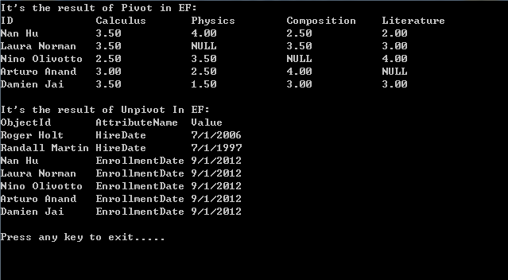

# How to implement Pivot and Unpivot in Entity Framework
## Requires
- Visual Studio 2012
## License
- MS-LPL
## Technologies
- ADO.NET
## Topics
- pivot
- Unpivot
## Updated
- 02/16/2013
## Description

<h1>Implement the Pivot and Unpivot Operation in Entity Framework (CSEFPivotOperation)</h1>
<h2>Introduction</h2>

This sample demonstrates how to implement the Pivot and Unpivot operation in Entity Framework.

In this sample, we use two classes to store the data from the database by EF, and then display the data in Pivot/Unpivot format.

<h2>Building the Sample</h2>

Before you run the sample, you need to finish the following steps:

Step1. Attach the database file MySchool.mdf under the folder _External_Dependecies to your SQL Server 2008 database instance.

Step2. Modify the connection string in the App.config file according to your SQL Server 2008 database instance name.

<h2>Running the Sample</h2>

Press F5 to run the sample, the following is the result.

1.&nbsp; We get the Pivot data by EF, and then translate the result into a Pivot table that uses the names of courses as the columns.

2.&nbsp; We get the person data by EF, and then unpivot the data into the UnpivotRow list.

<h2>Using the Code</h2>

1. Implement the Pivot operation in Entity Framework

&nbsp;&nbsp;&nbsp;&nbsp; a. PivotRow Class

&nbsp;&nbsp;&nbsp;&nbsp; We use the PivotRow class to store the Pivot result.

C#

Edit|Remove

csharp

<pre id="codePreview" class="csharp">
public class PivotRow&lt;TypeId,TypeAttr,TypeValue&gt;
{
&nbsp;&nbsp;&nbsp; public TypeId ObjectId { get; set; }
&nbsp;&nbsp;&nbsp; public IEnumerable&lt;TypeAttr&gt; Attributes { get; set; }
&nbsp;&nbsp; &nbsp;public IEnumerable&lt;TypeValue&gt; Values { get; set; }
}

</pre>

&nbsp;

&nbsp;&nbsp;&nbsp;&nbsp; We translate the Pivot data into a Pivot table that uses the names of attributes as the columns.

C#

Edit|Remove

csharp

<pre id="codePreview" class="csharp">
public static DataTable GetPivotTable(List&lt;TypeAttr&gt; attributeNames,
 &nbsp;&nbsp;&nbsp;List&lt;PivotRow&lt;TypeId, TypeAttr, TypeValue&gt;&gt; source)
{
&nbsp;&nbsp;&nbsp; DataTable dt = new DataTable();

&nbsp;&nbsp;&nbsp; DataColumn dc = new DataColumn(&quot;ID&quot;, typeof(TypeId));
&nbsp;&nbsp;&nbsp; dt.Columns.Add(dc);

&nbsp;&nbsp;&nbsp; // Creat the new DataColumn for each attribute
&nbsp;&nbsp;&nbsp; attributeNames.ForEach(name =&gt; { 
&nbsp;&nbsp;&nbsp;&nbsp;&nbsp;&nbsp;&nbsp;&nbsp;dc=new DataColumn(name.ToString(),typeof(TypeValue));
&nbsp;&nbsp;&nbsp;&nbsp;&nbsp;&nbsp;&nbsp; dt.Columns.Add(dc);
&nbsp;&nbsp;&nbsp; });

&nbsp;&nbsp;&nbsp; // Insert the data into the Pivot table
&nbsp;&nbsp;&nbsp; foreach (PivotRow&lt;TypeId, TypeAttr, TypeValue&gt; row in source)
&nbsp;&nbsp;&nbsp; {
&nbsp;&nbsp;&nbsp;&nbsp;&nbsp;&nbsp;&nbsp; DataRow dr = dt.NewRow();
&nbsp;&nbsp;&nbsp;&nbsp;&nbsp;&nbsp;&nbsp; dr[&quot;ID&quot;] = row.ObjectId;

&nbsp;&nbsp;&nbsp;&nbsp;&nbsp;&nbsp;&nbsp; List&lt;TypeAttr&gt; attributes = row.Attributes.ToList();
&nbsp;&nbsp;&nbsp;&nbsp;&nbsp;&nbsp;&nbsp; List&lt;TypeValue&gt; values = row.Values.ToList();

&nbsp;&nbsp;&nbsp;&nbsp;&nbsp;&nbsp;&nbsp; // Set the value basing the attribute names.
&nbsp;&nbsp;&nbsp;&nbsp;&nbsp;&nbsp;&nbsp; for (int i = 0; i &lt; values.Count; i&#43;&#43;)
&nbsp;&nbsp; &nbsp;&nbsp;&nbsp;&nbsp;&nbsp;{
&nbsp;&nbsp;&nbsp;&nbsp;&nbsp;&nbsp;&nbsp;&nbsp;&nbsp;&nbsp;&nbsp; dr[attributes[i].ToString()] = values[i];
&nbsp;&nbsp;&nbsp;&nbsp;&nbsp;&nbsp;&nbsp; }

&nbsp;&nbsp;&nbsp;&nbsp;&nbsp;&nbsp;&nbsp; dt.Rows.Add(dr);
&nbsp;&nbsp;&nbsp; }

&nbsp;&nbsp;&nbsp; return dt;
}

</pre>

&nbsp;

&nbsp;&nbsp;&nbsp;&nbsp; b. Get the Pivot result

&nbsp;&nbsp;&nbsp;&nbsp; Get the Pivot data by EF, and store the data into the PivotRow list.

C#

Edit|Remove

csharp

<pre id="codePreview" class="csharp">
studentGrade = (from sg in school.StudentGrades
&nbsp;&nbsp;&nbsp;&nbsp;&nbsp;&nbsp;&nbsp;&nbsp;&nbsp;&nbsp;&nbsp;&nbsp;&nbsp;&nbsp;&nbsp; group sg by sg.StudentID into sgGroup
&nbsp;&nbsp;&nbsp;&nbsp;&nbsp;&nbsp;&nbsp;&nbsp;&nbsp;&nbsp;&nbsp;&nbsp;&nbsp;&nbsp;&nbsp; select new PivotRow&lt;Person, String, Decimal&gt;
&nbsp;&nbsp;&nbsp;&nbsp;&nbsp;&nbsp;&nbsp;&nbsp;&nbsp;&nbsp;&nbsp;&nbsp;&nbsp;&nbsp;&nbsp; {
&nbsp;&nbsp;&nbsp;&nbsp;&nbsp;&nbsp;&nbsp;&nbsp;&nbsp;&nbsp;&nbsp;&nbsp;&nbsp;&nbsp;&nbsp;&nbsp;&nbsp;&nbsp;&nbsp; ObjectId = sgGroup.Select(g =&gt; g.Person).FirstOrDefault(),
&nbsp;&nbsp;&nbsp;&nbsp;&nbsp;&nbsp;&nbsp;&nbsp;&nbsp;&nbsp;&nbsp;&nbsp;&nbsp;&nbsp;&nbsp;&nbsp;&nbsp;&nbsp;&nbsp; Attributes = sgGroup.Select(g =&gt; g.Course.Title),
&nbsp;&nbsp;&nbsp;&nbsp;&nbsp;&nbsp;&nbsp;&nbsp;&nbsp;&nbsp;&nbsp;&nbsp;&nbsp;&nbsp;&nbsp;&nbsp;&nbsp;&nbsp;&nbsp; Values = sgGroup.Select(g =&gt; g.Grade)
&nbsp;&nbsp;&nbsp;&nbsp;&nbsp;&nbsp;&nbsp;&nbsp;&nbsp;&nbsp;&nbsp;&nbsp;&nbsp;&nbsp;&nbsp; }
&nbsp;&nbsp;&nbsp; ).ToList();

</pre>

&nbsp;

&nbsp;&nbsp;&nbsp;&nbsp; Get the list of attributes. In this sample, we use the names of the courses as the attributes.

C#

Edit|Remove

csharp

<pre id="codePreview" class="csharp">
courses = school.Courses.Select(c =&gt; c.Title).ToList();

</pre>

&nbsp;

2. Implement the Unpivot operation in Entity Framework.

&nbsp;&nbsp;&nbsp;&nbsp; a. UnpivotRow class

&nbsp;&nbsp;&nbsp;&nbsp; We use the UnpivotRow class to store the Unpivot result.

C#

Edit|Remove

csharp

<pre id="codePreview" class="csharp">
public class UnpivotRow&lt;TypeId,TypeAttr,TypeValue&gt;
{
&nbsp;&nbsp;&nbsp; public TypeId ObjectId { get; set; }
&nbsp;&nbsp;&nbsp; public TypeAttr Attribute { get; set; }
&nbsp;&nbsp;&nbsp; public TypeValue Value { get; set; }
}

</pre>

&nbsp;

&nbsp;&nbsp;&nbsp;&nbsp; b. Get the Unpivot result

&nbsp;&nbsp;&nbsp;&nbsp; First, we set the function list of attributes.

C#

Edit|Remove

csharp

<pre id="codePreview" class="csharp">
Dictionary&lt;String, Func&lt;Person, DateTime?&gt;&gt; attrFuncList = new Dictionary&lt;string, Func&lt;Person, DateTime?&gt;&gt;();
attrFuncList[&quot;HireDate&quot;] = p =&gt; p.HireDate;
attrFuncList[&quot;EnrollmentDate&quot;] = p =&gt; p.EnrollmentDate;

</pre>

&nbsp;

&nbsp;&nbsp;&nbsp;&nbsp; Then, we get the data by EF.

C#

Edit|Remove

csharp

<pre id="codePreview" class="csharp">
var persons = (from person in school.People
&nbsp;&nbsp;&nbsp;&nbsp;&nbsp;&nbsp;&nbsp;&nbsp;&nbsp;&nbsp;&nbsp;&nbsp;&nbsp;&nbsp;&nbsp;&nbsp;&nbsp;&nbsp;&nbsp;&nbsp;&nbsp;&nbsp;&nbsp;&nbsp;&nbsp;&nbsp;&nbsp;&nbsp;&nbsp; select person).ToList();

</pre>

&nbsp;

&nbsp;&nbsp;&nbsp;&nbsp; At last, we get the Pivot result by LinqToObject.

C#

Edit|Remove

csharp

<pre id="codePreview" class="csharp">
foreach (String key in attrFuncList.Keys)
{
&nbsp;&nbsp;&nbsp; String k = key;
&nbsp;&nbsp;&nbsp; IEnumerable&lt;UnpivotRow&lt;String, String, DateTime&gt;&gt; query =
&nbsp;&nbsp;&nbsp;&nbsp;&nbsp;&nbsp;&nbsp; (from person in persons
&nbsp;&nbsp;&nbsp;&nbsp;&nbsp;&nbsp;&nbsp;&nbsp; where attrFuncList[k](person) != null
&nbsp;&nbsp;&nbsp;&nbsp;&nbsp;&nbsp;&nbsp;&nbsp; select new UnpivotRow&lt;String, String, DateTime&gt;
&nbsp;&nbsp;&nbsp;&nbsp;&nbsp;&nbsp;&nbsp;&nbsp; {
&nbsp;&nbsp;&nbsp;&nbsp;&nbsp;&nbsp;&nbsp;&nbsp;&nbsp;&nbsp;&nbsp;&nbsp; ObjectId = person.FirstName &#43; &quot; &quot; &#43; person.LastName,
&nbsp;&nbsp;&nbsp;&nbsp;&nbsp;&nbsp;&nbsp;&nbsp;&nbsp;&nbsp;&nbsp;&nbsp; Attribute = k,
&nbsp;&nbsp;&nbsp;&nbsp;&nbsp;&nbsp;&nbsp;&nbsp;&nbsp;&nbsp;&nbsp;&nbsp; // Get the value of a certain attribute.
&nbsp;&nbsp;&nbsp;&nbsp;&nbsp;&nbsp;&nbsp;&nbsp;&nbsp;&nbsp;&nbsp;&nbsp; Value = (DateTime)attrFuncList[k](person)
&nbsp;&nbsp;&nbsp;&nbsp;&nbsp;&nbsp;&nbsp;&nbsp; });

 &nbsp;&nbsp;&nbsp;// Concat the results.
&nbsp;&nbsp;&nbsp; result = result == null ? query : result.Concat(query);
}

</pre>

&nbsp;

<h2>More Information</h2>

<a href="http://msdn.microsoft.com/en-us/library/bwabdf9z(v=vs.110).aspx">List&lt;T&gt;.ForEach Method</a>

<a href="http://msdn.microsoft.com/en-us/library/b05d59ty(v=vs.110).aspx">PropertyInfo.GetValue Method (Object, Object[])</a>

