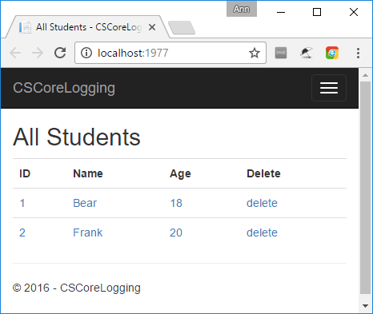
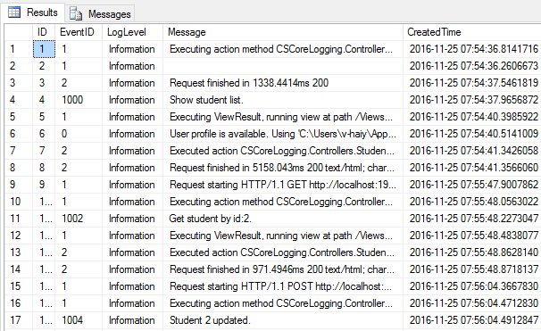

# How to implement logging to sql database in ASP.NET Core
## Requires
- Visual Studio 2015
## License
- Apache License, Version 2.0
## Technologies
- ASP.NET
- .NET
- Logging
- Web App Development
- ASP.NET Core
- Entity Framework Core 1.0
## Topics
- SQL Server
- Logging
- Database
- ASP.NET Core
- EntityFrameworkCore
- LoggerProvider
## Updated
- 03/28/2017
## Description

ASP.NET Core'da sql veritabanına g&uuml;nl&uuml;k kaydını uygulama

Giriş

Bu &ouml;rnek ASP.NET Core'da g&uuml;nl&uuml;k kaydının sql veritabanına nasıl uygulanacağını g&ouml;sterir.

 

<strong>&Ouml;rnek &ouml;nkoşulları</strong>

&bull;&nbsp;Visual Studio ve .NET Core y&uuml;kleyin 

&bull;&nbsp;<a href="https://www.visualstudio.com/" style="text-decoration:none">Visual
 Studio 2015 y&uuml;kleme ana sayfası</a>

&bull;&nbsp;<a href="https://www.microsoft.com/net/core#windowsvs2015" style="text-decoration:none">.NET
 Core &#43; Visual Studio ara&ccedil;larını</a> y&uuml;kleyin

&bull;&nbsp;Projedeki t&uuml;m NuGet paketlerini geri y&uuml;kleyin

&bull;&nbsp;Aşağıdaki sql komut dosyaları ile bir veritabanı oluşturun:

SQL

Edit|Remove

mysql

<pre class="mysql">CREATE&nbsp;DATABASE&nbsp;CustomLoggerDB&nbsp;&nbsp;
GO&nbsp;&nbsp;
USE&nbsp;CustomLoggerDB&nbsp;
GO&nbsp;&nbsp;
CREATE&nbsp;TABLE&nbsp;EventLog(&nbsp;&nbsp;
&nbsp;&nbsp;&nbsp;&nbsp;[ID]&nbsp;int&nbsp;identity&nbsp;primary&nbsp;key,&nbsp;&nbsp;
&nbsp;&nbsp;&nbsp;&nbsp;[EventID]&nbsp;int,&nbsp;&nbsp;
&nbsp;&nbsp;&nbsp;&nbsp;[LogLevel]&nbsp;nvarchar(50),&nbsp;
&nbsp;&nbsp;&nbsp;&nbsp;[Message]&nbsp;nvarchar(4000),&nbsp;
&nbsp;&nbsp;&nbsp;&nbsp;[CreatedTime]&nbsp;datetime2&nbsp;
)&nbsp;
GO&nbsp;
CREATE&nbsp;TABLE&nbsp;Student(&nbsp;&nbsp;
&nbsp;&nbsp;&nbsp;&nbsp;ID&nbsp;int&nbsp;identity&nbsp;primary&nbsp;key,&nbsp;&nbsp;
&nbsp;&nbsp;&nbsp;&nbsp;Name&nbsp;nvarchar(50),&nbsp;&nbsp;
&nbsp;&nbsp;&nbsp;&nbsp;Age&nbsp;int&nbsp;&nbsp;
)&nbsp;&nbsp;
GO&nbsp;
INSERT&nbsp;INTO&nbsp;Student&nbsp;VALUES('Bear',18)&nbsp;&nbsp;
INSERT&nbsp;INTO&nbsp;Student&nbsp;VALUES('Frank',20)&nbsp;
GO</pre>

&nbsp;

&Ouml;rneği &ccedil;alıştırma

&Ouml;rneği &ccedil;alıştırmadan &ouml;nce l&uuml;tfen appsettings.json dosyasındaki bağlantı dizesini g&uuml;ncelleyin.

JavaScript

Edit|Remove

js

<pre class="js">&quot;ConnectionStrings&quot;:&nbsp;{&nbsp;
&nbsp;&nbsp;&quot;LoggerDatabase&quot;:&nbsp;&quot;Server=.;Database=CustomLoggerDB;Trusted_Connection=True;&quot;&nbsp;
}&nbsp;</pre>

&nbsp;

&nbsp;Hata ayıklamaya başlamak
 i&ccedil;in aşağıdaki adımlardan birini uygulayın:

&bull;&nbsp;Ara&ccedil; &ccedil;ubuğundaki Hata Ayıklamayı Başlat d&uuml;ğmesine tıklayın.

&bull;&nbsp;Hata Ayıklama men&uuml;s&uuml;nden Hata Ayıklamayı Başlat'a tıklayın.

&bull;&nbsp;F5 tuşuna basın.

 

&quot;Frank&quot;e tıklayın, ardından dosyanın adını &quot;Frank1&quot; olarak değiştirin.

&nbsp;

Sql server istemcisine gidin ve komut dosyasını &ccedil;alıştırın:

SQL

Edit|Remove

mysql

<pre class="mysql">SELECT&nbsp;*&nbsp;FROM&nbsp;EventLog</pre>

&nbsp;

G&uuml;nl&uuml;k verilerinin tabloya eklendiğini g&ouml;receksiniz.

&nbsp;

Kodu kullanma

Yapılandırma y&ouml;ntemine g&uuml;nl&uuml;k kaydediciyi ekleyin:

C#

Edit|Remove

csharp

<pre class="csharp">loggerFactory.AddContext(LogLevel.Information);</pre>

&nbsp;

Hizmetlere DBContext ekleyin:

C#

Edit|Remove

csharp

<pre class="csharp">CustomLoggerDBContext.ConnectionString&nbsp;=&nbsp;Configuration.GetConnectionString(&quot;LoggerDatabase&quot;);&nbsp;
services.AddDbContext&lt;CustomLoggerDBContext&gt;();&nbsp;</pre>

LoggerProvider

C#

Edit|Remove

csharp

<pre class="csharp">public&nbsp;class&nbsp;DBLoggerProvider&nbsp;:&nbsp;ILoggerProvider&nbsp;
{&nbsp;
&nbsp;&nbsp;&nbsp;&nbsp;private&nbsp;readonly&nbsp;Func&lt;string,&nbsp;LogLevel,&nbsp;bool&gt;&nbsp;_filter;&nbsp;
&nbsp;
&nbsp;&nbsp;&nbsp;&nbsp;public&nbsp;DBLoggerProvider(Func&lt;string,&nbsp;LogLevel,&nbsp;bool&gt;&nbsp;filter)&nbsp;
&nbsp;&nbsp;&nbsp;&nbsp;{&nbsp;
&nbsp;&nbsp;&nbsp;&nbsp;&nbsp;&nbsp;&nbsp;&nbsp;_filter&nbsp;=&nbsp;filter;&nbsp;
&nbsp;&nbsp;&nbsp;&nbsp;}&nbsp;
&nbsp;&nbsp;&nbsp;&nbsp;public&nbsp;ILogger&nbsp;CreateLogger(string&nbsp;categoryName)&nbsp;
&nbsp;&nbsp;&nbsp;&nbsp;{&nbsp;
&nbsp;&nbsp;&nbsp;&nbsp;&nbsp;&nbsp;&nbsp;&nbsp;return&nbsp;new&nbsp;DBLogger(categoryName,&nbsp;_filter);&nbsp;
&nbsp;&nbsp;&nbsp;&nbsp;}&nbsp;
&nbsp;
&nbsp;&nbsp;&nbsp;&nbsp;public&nbsp;void&nbsp;Dispose()&nbsp;
&nbsp;&nbsp;&nbsp;&nbsp;{&nbsp;
&nbsp;
&nbsp;&nbsp;&nbsp;&nbsp;}&nbsp;
}&nbsp;</pre>

&nbsp;

DBLogger:

C#

Edit|Remove

csharp

<pre class="csharp">public&nbsp;class&nbsp;DBLogger&nbsp;:&nbsp;ILogger&nbsp;
{&nbsp;
&nbsp;&nbsp;&nbsp;&nbsp;private&nbsp;string&nbsp;_categoryName;&nbsp;
&nbsp;&nbsp;&nbsp;&nbsp;private&nbsp;Func&lt;string,&nbsp;LogLevel,&nbsp;bool&gt;&nbsp;_filter;&nbsp;
&nbsp;&nbsp;&nbsp;&nbsp;private&nbsp;CustomLoggerDBContext&nbsp;_context;&nbsp;
&nbsp;&nbsp;&nbsp;&nbsp;private&nbsp;bool&nbsp;_selfException&nbsp;=&nbsp;false;&nbsp;
&nbsp;&nbsp;&nbsp;&nbsp;&nbsp;
&nbsp;&nbsp;&nbsp;&nbsp;public&nbsp;DBLogger(string&nbsp;categoryName,&nbsp;Func&lt;string,&nbsp;LogLevel,&nbsp;bool&gt;&nbsp;filter)&nbsp;
&nbsp;&nbsp;&nbsp;&nbsp;{&nbsp;
&nbsp;&nbsp;&nbsp;&nbsp;&nbsp;&nbsp;&nbsp;&nbsp;_categoryName&nbsp;=&nbsp;categoryName;&nbsp;
&nbsp;&nbsp;&nbsp;&nbsp;&nbsp;&nbsp;&nbsp;&nbsp;_filter&nbsp;=&nbsp;filter;&nbsp;
&nbsp;&nbsp;&nbsp;&nbsp;&nbsp;&nbsp;&nbsp;&nbsp;_context&nbsp;=&nbsp;new&nbsp;CustomLoggerDBContext();&nbsp;
&nbsp;&nbsp;&nbsp;&nbsp;}&nbsp;
&nbsp;
&nbsp;&nbsp;&nbsp;&nbsp;public&nbsp;void&nbsp;Log&lt;TState&gt;(LogLevel&nbsp;logLevel,&nbsp;EventId&nbsp;eventId,&nbsp;TState&nbsp;state,&nbsp;Exception&nbsp;exception,&nbsp;Func&lt;TState,&nbsp;Exception,&nbsp;string&gt;&nbsp;formatter)&nbsp;
&nbsp;&nbsp;&nbsp;&nbsp;{&nbsp;
&nbsp;&nbsp;&nbsp;&nbsp;&nbsp;&nbsp;&nbsp;&nbsp;if&nbsp;(!IsEnabled(logLevel))&nbsp;
&nbsp;&nbsp;&nbsp;&nbsp;&nbsp;&nbsp;&nbsp;&nbsp;{&nbsp;
&nbsp;&nbsp;&nbsp;&nbsp;&nbsp;&nbsp;&nbsp;&nbsp;&nbsp;&nbsp;&nbsp;&nbsp;return;&nbsp;
&nbsp;&nbsp;&nbsp;&nbsp;&nbsp;&nbsp;&nbsp;&nbsp;}&nbsp;
&nbsp;&nbsp;&nbsp;&nbsp;&nbsp;&nbsp;&nbsp;&nbsp;if&nbsp;(_selfException)&nbsp;
&nbsp;&nbsp;&nbsp;&nbsp;&nbsp;&nbsp;&nbsp;&nbsp;{&nbsp;
&nbsp;&nbsp;&nbsp;&nbsp;&nbsp;&nbsp;&nbsp;&nbsp;&nbsp;&nbsp;&nbsp;&nbsp;_selfException&nbsp;=&nbsp;false;&nbsp;
&nbsp;&nbsp;&nbsp;&nbsp;&nbsp;&nbsp;&nbsp;&nbsp;&nbsp;&nbsp;&nbsp;&nbsp;return;&nbsp;
&nbsp;&nbsp;&nbsp;&nbsp;&nbsp;&nbsp;&nbsp;&nbsp;}&nbsp;
&nbsp;&nbsp;&nbsp;&nbsp;&nbsp;&nbsp;&nbsp;&nbsp;_selfException&nbsp;=&nbsp;true;&nbsp;
&nbsp;&nbsp;&nbsp;&nbsp;&nbsp;&nbsp;&nbsp;&nbsp;if&nbsp;(formatter&nbsp;==&nbsp;null)&nbsp;
&nbsp;&nbsp;&nbsp;&nbsp;&nbsp;&nbsp;&nbsp;&nbsp;{&nbsp;
&nbsp;&nbsp;&nbsp;&nbsp;&nbsp;&nbsp;&nbsp;&nbsp;&nbsp;&nbsp;&nbsp;&nbsp;throw&nbsp;new&nbsp;ArgumentNullException(nameof(formatter));&nbsp;
&nbsp;&nbsp;&nbsp;&nbsp;&nbsp;&nbsp;&nbsp;&nbsp;}&nbsp;
&nbsp;&nbsp;&nbsp;&nbsp;&nbsp;&nbsp;&nbsp;&nbsp;var&nbsp;message&nbsp;=&nbsp;formatter(state,&nbsp;exception);&nbsp;
&nbsp;&nbsp;&nbsp;&nbsp;&nbsp;&nbsp;&nbsp;&nbsp;if&nbsp;(string.IsNullOrEmpty(message))&nbsp;
&nbsp;&nbsp;&nbsp;&nbsp;&nbsp;&nbsp;&nbsp;&nbsp;{&nbsp;
&nbsp;&nbsp;&nbsp;&nbsp;&nbsp;&nbsp;&nbsp;&nbsp;&nbsp;&nbsp;&nbsp;&nbsp;return;&nbsp;
&nbsp;&nbsp;&nbsp;&nbsp;&nbsp;&nbsp;&nbsp;&nbsp;}&nbsp;
&nbsp;
&nbsp;&nbsp;&nbsp;&nbsp;&nbsp;&nbsp;&nbsp;&nbsp;if&nbsp;(exception&nbsp;!=&nbsp;null)&nbsp;
&nbsp;&nbsp;&nbsp;&nbsp;&nbsp;&nbsp;&nbsp;&nbsp;{&nbsp;
&nbsp;&nbsp;&nbsp;&nbsp;&nbsp;&nbsp;&nbsp;&nbsp;&nbsp;&nbsp;&nbsp;&nbsp;message&nbsp;&#43;=&nbsp;&quot;\n&quot;&#43;&nbsp;exception.ToString();&nbsp;
&nbsp;&nbsp;&nbsp;&nbsp;&nbsp;&nbsp;&nbsp;&nbsp;}&nbsp;
&nbsp;&nbsp;&nbsp;&nbsp;&nbsp;&nbsp;&nbsp;&nbsp;try&nbsp;
&nbsp;&nbsp;&nbsp;&nbsp;&nbsp;&nbsp;&nbsp;&nbsp;{&nbsp;
&nbsp;&nbsp;&nbsp;&nbsp;&nbsp;&nbsp;&nbsp;&nbsp;&nbsp;&nbsp;&nbsp;&nbsp;message&nbsp;=&nbsp;message.Length&nbsp;&gt;&nbsp;CustomLoggerDBContext.MessageMaxLength&nbsp;?&nbsp;
&nbsp;&nbsp;&nbsp;&nbsp;&nbsp;&nbsp;&nbsp;&nbsp;&nbsp;&nbsp;&nbsp;&nbsp;&nbsp;&nbsp;&nbsp;&nbsp;message.Substring(0,CustomLoggerDBContext.MessageMaxLength):message;&nbsp;
&nbsp;&nbsp;&nbsp;&nbsp;&nbsp;&nbsp;&nbsp;&nbsp;&nbsp;&nbsp;&nbsp;&nbsp;_context.EventLog.Add(new&nbsp;EventLog&nbsp;{&nbsp;
&nbsp;&nbsp;&nbsp;&nbsp;&nbsp;&nbsp;&nbsp;&nbsp;&nbsp;&nbsp;&nbsp;&nbsp;&nbsp;&nbsp;&nbsp;&nbsp;Message&nbsp;=&nbsp;message,&nbsp;
&nbsp;&nbsp;&nbsp;&nbsp;&nbsp;&nbsp;&nbsp;&nbsp;&nbsp;&nbsp;&nbsp;&nbsp;&nbsp;&nbsp;&nbsp;&nbsp;EventId&nbsp;=&nbsp;eventId.Id,&nbsp;
&nbsp;&nbsp;&nbsp;&nbsp;&nbsp;&nbsp;&nbsp;&nbsp;&nbsp;&nbsp;&nbsp;&nbsp;&nbsp;&nbsp;&nbsp;&nbsp;LogLevel&nbsp;=&nbsp;logLevel.ToString(),&nbsp;
&nbsp;&nbsp;&nbsp;&nbsp;&nbsp;&nbsp;&nbsp;&nbsp;&nbsp;&nbsp;&nbsp;&nbsp;&nbsp;&nbsp;&nbsp;&nbsp;CreatedTime&nbsp;=&nbsp;DateTime.UtcNow&nbsp;});&nbsp;
&nbsp;&nbsp;&nbsp;&nbsp;&nbsp;&nbsp;&nbsp;&nbsp;&nbsp;&nbsp;&nbsp;&nbsp;_context.SaveChanges();&nbsp;
&nbsp;&nbsp;&nbsp;&nbsp;&nbsp;&nbsp;&nbsp;&nbsp;&nbsp;&nbsp;&nbsp;&nbsp;_selfException&nbsp;=&nbsp;false;&nbsp;
&nbsp;&nbsp;&nbsp;&nbsp;&nbsp;&nbsp;&nbsp;&nbsp;}&nbsp;
&nbsp;&nbsp;&nbsp;&nbsp;&nbsp;&nbsp;&nbsp;&nbsp;catch&nbsp;{&nbsp;}&nbsp;
&nbsp;&nbsp;&nbsp;&nbsp;}&nbsp;
&nbsp;
&nbsp;&nbsp;&nbsp;&nbsp;public&nbsp;bool&nbsp;IsEnabled(LogLevel&nbsp;logLevel)&nbsp;
&nbsp;&nbsp;&nbsp;&nbsp;{&nbsp;
&nbsp;&nbsp;&nbsp;&nbsp;&nbsp;&nbsp;&nbsp;&nbsp;return&nbsp;(_filter&nbsp;==&nbsp;null&nbsp;||&nbsp;_filter(_categoryName,&nbsp;logLevel));&nbsp;
&nbsp;&nbsp;&nbsp;&nbsp;}&nbsp;
&nbsp;
&nbsp;&nbsp;&nbsp;&nbsp;public&nbsp;IDisposable&nbsp;BeginScope&lt;TState&gt;(TState&nbsp;state)&nbsp;
&nbsp;&nbsp;&nbsp;&nbsp;{&nbsp;
&nbsp;&nbsp;&nbsp;&nbsp;&nbsp;&nbsp;&nbsp;&nbsp;return&nbsp;null;&nbsp;
&nbsp;&nbsp;&nbsp;&nbsp;}&nbsp;
}&nbsp;</pre>

&nbsp;

Student Controller:

C#

Edit|Remove

csharp

<pre class="csharp">private&nbsp;CustomLoggerDBContext&nbsp;_context;&nbsp;
private&nbsp;readonly&nbsp;ILogger&lt;StudentController&gt;&nbsp;_logger;&nbsp;
&nbsp;
public&nbsp;StudentController(&nbsp;ILogger&lt;StudentController&gt;&nbsp;logger,&nbsp;CustomLoggerDBContext&nbsp;context)&nbsp;
{&nbsp;
&nbsp;&nbsp;&nbsp;&nbsp;_context&nbsp;=&nbsp;context;&nbsp;
&nbsp;&nbsp;&nbsp;&nbsp;_logger&nbsp;=&nbsp;logger;&nbsp;
}&nbsp;
&nbsp;
public&nbsp;IActionResult&nbsp;Index()&nbsp;
{&nbsp;
&nbsp;&nbsp;&nbsp;&nbsp;var&nbsp;StudentList&nbsp;=&nbsp;_context.Student.ToList();&nbsp;
&nbsp;&nbsp;&nbsp;&nbsp;_logger.LogInformation((int)LoggingEvents.GENERATE_ITEMS,&nbsp;&quot;Show&nbsp;student&nbsp;list.&quot;);&nbsp;
&nbsp;&nbsp;&nbsp;&nbsp;return&nbsp;View(StudentList);&nbsp;
}&nbsp;</pre>

&nbsp;

More information

<a href="https://docs.microsoft.com/en-us/aspnet/core/fundamentals/logging">Logging in ASP.NET Core</a>

<a href="https://docs.microsoft.com/en-us/ef/core/get-started/aspnetcore/" style="text-decoration:none">EntityFramework in ASP.NET Core</a>

Microsoft All-In-One Code Framework is a free, centralized code sample library driven by developers' real-world pains and needs. The goal is to provide customer-driven code samples for all Microsoft development technologies,
 and reduce developers' efforts in solving typical programming tasks. Our team listens to developers&rsquo; pains in the MSDN forums, social media and various DEV communities. We write code samples based on developers&rsquo; frequently asked programming tasks,
 and allow developers to download them with a short sample publishing cycle. Additionally, we offer a free code sample request service. It is a proactive way for our developer community to obtain code samples directly from Microsoft.

