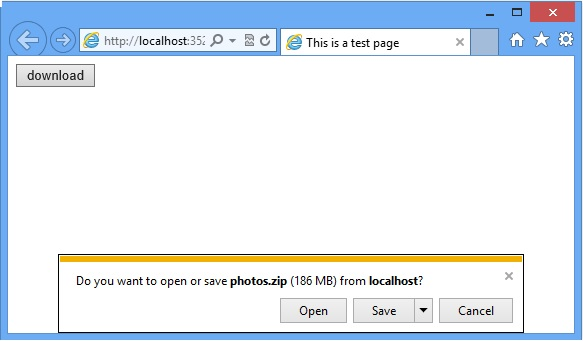
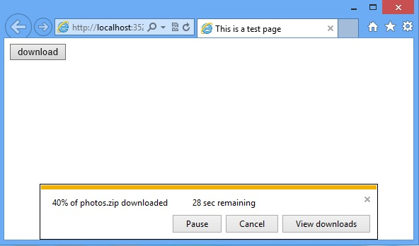

# How to implement resume download in ASP.NET
## Requires
- Visual Studio 2012
## License
- Apache License, Version 2.0
## Technologies
- ASP.NET
- .NET
- Web App Development
## Topics
- resume download
## Updated
- 04/05/2016
## Description

<h2>ASP.NET resume download sample (CSASPNETResumeDownload2012)
</h2>
<h2>Introduction</h2>

The sample CSASPNETResumeDownload demonstrates how to implement resume download feature in ASP.NET. As we know, due to network interruptions,
Downloading file may meet a problem when the size of file is
large.At this time we need to support resume download if the connection is broken. In this sample, we
 need two classes: <strong>HttpRequest</strong> and <strong>HttpResponse</strong>.&nbsp;
<strong>HttpRequest</strong> is used to get the downloaded partial file's length from the Range header and the other one
<strong>HttpResponse </strong>is for setting the start position of the reading file. And then read and send the rest of the file to client. You can find the answers for all the following questions in the code sample:

&bull;&nbsp;&nbsp;&nbsp;&nbsp;&nbsp;&nbsp;&nbsp;&nbsp;
How to get and process the HTTP Web request by custom 
HttpHandler? 

&bull;&nbsp;&nbsp;&nbsp;&nbsp;&nbsp;&nbsp;&nbsp;&nbsp;
How to get the 
HTTP response header information?

&bull;&nbsp;&nbsp;&nbsp;&nbsp;&nbsp;&nbsp;&nbsp;&nbsp;
How to send the file to client by using HttpResponse class?

<h2>Running the Sample</h2>

1.&nbsp;&nbsp;&nbsp;&nbsp;&nbsp;&nbsp;
Open the CSASPNETResumeDownload .sln. Expand the CSASPNETResumeDownload web application. Double click the Web.config file and find the &quot;appSettings&quot; node, then modify the value of the &quot;FilePath&quot; key with the physical path of the download
 file.

2.&nbsp;&nbsp;&nbsp;&nbsp;&nbsp;&nbsp;
Right click the ResumeDownloadPage.htm, select and click the &quot;Set
As Start Page&quot; item then press &quot;F5&quot; to start debugging the project.

3.&nbsp;&nbsp;&nbsp;&nbsp;&nbsp;&nbsp;
We will see a Button control named &quot;Download&quot; on the page. Please click it.

4.&nbsp;&nbsp;&nbsp;&nbsp;&nbsp;&nbsp;
After completing Step 3 you will see the IE download file dialog on the bottom of the browser.

5.&nbsp;&nbsp;&nbsp;&nbsp;&nbsp;&nbsp;
Please click &quot;Save&quot; button and select a path to save the file, then IE download file dialog will show like below.

6.&nbsp;&nbsp;&nbsp;&nbsp;&nbsp;&nbsp;
You can click the &quot;Pause&quot; button then the download operation will interrupt.

7.&nbsp;&nbsp;&nbsp;&nbsp;&nbsp;&nbsp;
Click the &quot;Resume&quot; button to restart the download operation.

8.&nbsp;&nbsp;&nbsp;&nbsp;&nbsp;&nbsp;
&nbsp;When the download is finished, the dialog will show like below.

<h2>Using the Code</h2>

The code sample provides the following reusable functions:

<h3>1. How to get and process the HTTP Web request by custom HttpHandler?</h3>

C#

Edit|Remove

csharp
<pre class="hidden">- C# code snippet -
public class DownloadHttpHandler : IHttpHandler
{
    public void ProcessRequest(HttpContext context)
    {
        string filePath = ConfigurationManager.AppSettings[&quot;FilePath&quot;];
        Downloader.DownloadFile(context, filePath);
    }
    public bool IsReusable
    {
        get { return false; }
    }
- end -
</pre>

<pre class="csharp">-&nbsp;C#&nbsp;code&nbsp;snippet&nbsp;-&nbsp;
public&nbsp;class&nbsp;DownloadHttpHandler&nbsp;:&nbsp;IHttpHandler&nbsp;
{&nbsp;
&nbsp;&nbsp;&nbsp;&nbsp;public&nbsp;void&nbsp;ProcessRequest(HttpContext&nbsp;context)&nbsp;
&nbsp;&nbsp;&nbsp;&nbsp;{&nbsp;
&nbsp;&nbsp;&nbsp;&nbsp;&nbsp;&nbsp;&nbsp;&nbsp;string&nbsp;filePath&nbsp;=&nbsp;ConfigurationManager.AppSettings[&quot;FilePath&quot;];&nbsp;
&nbsp;&nbsp;&nbsp;&nbsp;&nbsp;&nbsp;&nbsp;&nbsp;Downloader.DownloadFile(context,&nbsp;filePath);&nbsp;
&nbsp;&nbsp;&nbsp;&nbsp;}&nbsp;
&nbsp;&nbsp;&nbsp;&nbsp;public&nbsp;bool&nbsp;IsReusable&nbsp;
&nbsp;&nbsp;&nbsp;&nbsp;{&nbsp;
&nbsp;&nbsp;&nbsp;&nbsp;&nbsp;&nbsp;&nbsp;&nbsp;get&nbsp;{&nbsp;return&nbsp;false;&nbsp;}&nbsp;
&nbsp;&nbsp;&nbsp;&nbsp;}&nbsp;
-&nbsp;end&nbsp;-&nbsp;
</pre>

&nbsp;
<h3>2. How to get the HTTP response header information?&nbsp; &nbsp; &nbsp; &nbsp; &nbsp; &nbsp; &nbsp; &nbsp; &nbsp; &nbsp; &nbsp;</h3>

C#

Edit|Remove

csharp
<pre class="hidden">- C# code snippet -
/// &lt;summary&gt;
/// Get the response header by the http request.
/// &lt;/summary&gt;
/// &lt;param name=&quot;httpRequest&quot;&gt;&lt;/param&gt;
/// &lt;param name=&quot;fileInfo&quot;&gt;&lt;/param&gt;
/// &lt;returns&gt;&lt;/returns&gt;
private static HttpResponseHeader GetResponseHeader(HttpRequest httpRequest, FileInfo fileInfo)
{
    if (httpRequest == null)
    {
        return null;
    }
    if (fileInfo == null)
    {
        return null;
    }
    long startPosition = 0;
    string contentRange = &quot;&quot;;
    string fileName = fileInfo.Name;
    long fileLength = fileInfo.Length;
    string lastUpdateTimeStr = fileInfo.LastWriteTimeUtc.ToString();
    string eTag = HttpUtility.UrlEncode(fileName, Encoding.UTF8) &#43; &quot; &quot; &#43; lastUpdateTimeStr;
    string contentDisposition = &quot;attachment;filename=&quot; &#43; HttpUtility.UrlEncode(fileName, Encoding.UTF8).Replace(&quot;&#43;&quot;, &quot;%20&quot;);
    if (httpRequest.Headers[&quot;Range&quot;] != null)
    {
        string[] range = httpRequest.Headers[&quot;Range&quot;].Split(new char[] { '=', '-' });
        startPosition = Convert.ToInt64(range[1]);
        if (startPosition &lt; 0 || startPosition &gt;= fileLength)
        {
            return null;
        }
    }
    if (httpRequest.Headers[&quot;If-Range&quot;] != null)
    {
        if (httpRequest.Headers[&quot;If-Range&quot;].Replace(&quot;\&quot;&quot;, &quot;&quot;) != eTag)
        {
            startPosition = 0;
        }
    }
    string contentLength = (fileLength - startPosition).ToString();
    if (startPosition &gt; 0)
    {
        contentRange = string.Format(&quot; bytes {0}-{1}/{2}&quot;, startPosition, fileLength - 1, fileLength);
    }
    HttpResponseHeader responseHeader = new HttpResponseHeader();
    responseHeader.AcceptRanges = &quot;bytes&quot;;
    responseHeader.Connection = &quot;Keep-Alive&quot;;
    responseHeader.ContentDisposition = contentDisposition;
    responseHeader.ContentEncoding = Encoding.UTF8;
    responseHeader.ContentLength = contentLength;
    responseHeader.ContentRange = contentRange;
    responseHeader.ContentType = &quot;application/octet-stream&quot;;
    responseHeader.Etag = eTag;
    responseHeader.LastModified = lastUpdateTimeStr;
    return responseHeader;
}
- end -
</pre>

<pre class="csharp">-&nbsp;C#&nbsp;code&nbsp;snippet&nbsp;-&nbsp;
///&nbsp;&lt;summary&gt;&nbsp;
///&nbsp;Get&nbsp;the&nbsp;response&nbsp;header&nbsp;by&nbsp;the&nbsp;http&nbsp;request.&nbsp;
///&nbsp;&lt;/summary&gt;&nbsp;
///&nbsp;&lt;param&nbsp;name=&quot;httpRequest&quot;&gt;&lt;/param&gt;&nbsp;
///&nbsp;&lt;param&nbsp;name=&quot;fileInfo&quot;&gt;&lt;/param&gt;&nbsp;
///&nbsp;&lt;returns&gt;&lt;/returns&gt;&nbsp;
private&nbsp;static&nbsp;HttpResponseHeader&nbsp;GetResponseHeader(HttpRequest&nbsp;httpRequest,&nbsp;FileInfo&nbsp;fileInfo)&nbsp;
{&nbsp;
&nbsp;&nbsp;&nbsp;&nbsp;if&nbsp;(httpRequest&nbsp;==&nbsp;null)&nbsp;
&nbsp;&nbsp;&nbsp;&nbsp;{&nbsp;
&nbsp;&nbsp;&nbsp;&nbsp;&nbsp;&nbsp;&nbsp;&nbsp;return&nbsp;null;&nbsp;
&nbsp;&nbsp;&nbsp;&nbsp;}&nbsp;
&nbsp;&nbsp;&nbsp;&nbsp;if&nbsp;(fileInfo&nbsp;==&nbsp;null)&nbsp;
&nbsp;&nbsp;&nbsp;&nbsp;{&nbsp;
&nbsp;&nbsp;&nbsp;&nbsp;&nbsp;&nbsp;&nbsp;&nbsp;return&nbsp;null;&nbsp;
&nbsp;&nbsp;&nbsp;&nbsp;}&nbsp;
&nbsp;&nbsp;&nbsp;&nbsp;long&nbsp;startPosition&nbsp;=&nbsp;0;&nbsp;
&nbsp;&nbsp;&nbsp;&nbsp;string&nbsp;contentRange&nbsp;=&nbsp;&quot;&quot;;&nbsp;
&nbsp;&nbsp;&nbsp;&nbsp;string&nbsp;fileName&nbsp;=&nbsp;fileInfo.Name;&nbsp;
&nbsp;&nbsp;&nbsp;&nbsp;long&nbsp;fileLength&nbsp;=&nbsp;fileInfo.Length;&nbsp;
&nbsp;&nbsp;&nbsp;&nbsp;string&nbsp;lastUpdateTimeStr&nbsp;=&nbsp;fileInfo.LastWriteTimeUtc.ToString();&nbsp;
&nbsp;&nbsp;&nbsp;&nbsp;string&nbsp;eTag&nbsp;=&nbsp;HttpUtility.UrlEncode(fileName,&nbsp;Encoding.UTF8)&nbsp;&#43;&nbsp;&quot;&nbsp;&quot;&nbsp;&#43;&nbsp;lastUpdateTimeStr;&nbsp;
&nbsp;&nbsp;&nbsp;&nbsp;string&nbsp;contentDisposition&nbsp;=&nbsp;&quot;attachment;filename=&quot;&nbsp;&#43;&nbsp;HttpUtility.UrlEncode(fileName,&nbsp;Encoding.UTF8).Replace(&quot;&#43;&quot;,&nbsp;&quot;%20&quot;);&nbsp;
&nbsp;&nbsp;&nbsp;&nbsp;if&nbsp;(httpRequest.Headers[&quot;Range&quot;]&nbsp;!=&nbsp;null)&nbsp;
&nbsp;&nbsp;&nbsp;&nbsp;{&nbsp;
&nbsp;&nbsp;&nbsp;&nbsp;&nbsp;&nbsp;&nbsp;&nbsp;string[]&nbsp;range&nbsp;=&nbsp;httpRequest.Headers[&quot;Range&quot;].Split(new&nbsp;char[]&nbsp;{&nbsp;'=',&nbsp;'-'&nbsp;});&nbsp;
&nbsp;&nbsp;&nbsp;&nbsp;&nbsp;&nbsp;&nbsp;&nbsp;startPosition&nbsp;=&nbsp;Convert.ToInt64(range[1]);&nbsp;
&nbsp;&nbsp;&nbsp;&nbsp;&nbsp;&nbsp;&nbsp;&nbsp;if&nbsp;(startPosition&nbsp;&lt;&nbsp;0&nbsp;||&nbsp;startPosition&nbsp;&gt;=&nbsp;fileLength)&nbsp;
&nbsp;&nbsp;&nbsp;&nbsp;&nbsp;&nbsp;&nbsp;&nbsp;{&nbsp;
&nbsp;&nbsp;&nbsp;&nbsp;&nbsp;&nbsp;&nbsp;&nbsp;&nbsp;&nbsp;&nbsp;&nbsp;return&nbsp;null;&nbsp;
&nbsp;&nbsp;&nbsp;&nbsp;&nbsp;&nbsp;&nbsp;&nbsp;}&nbsp;
&nbsp;&nbsp;&nbsp;&nbsp;}&nbsp;
&nbsp;&nbsp;&nbsp;&nbsp;if&nbsp;(httpRequest.Headers[&quot;If-Range&quot;]&nbsp;!=&nbsp;null)&nbsp;
&nbsp;&nbsp;&nbsp;&nbsp;{&nbsp;
&nbsp;&nbsp;&nbsp;&nbsp;&nbsp;&nbsp;&nbsp;&nbsp;if&nbsp;(httpRequest.Headers[&quot;If-Range&quot;].Replace(&quot;\&quot;&quot;,&nbsp;&quot;&quot;)&nbsp;!=&nbsp;eTag)&nbsp;
&nbsp;&nbsp;&nbsp;&nbsp;&nbsp;&nbsp;&nbsp;&nbsp;{&nbsp;
&nbsp;&nbsp;&nbsp;&nbsp;&nbsp;&nbsp;&nbsp;&nbsp;&nbsp;&nbsp;&nbsp;&nbsp;startPosition&nbsp;=&nbsp;0;&nbsp;
&nbsp;&nbsp;&nbsp;&nbsp;&nbsp;&nbsp;&nbsp;&nbsp;}&nbsp;
&nbsp;&nbsp;&nbsp;&nbsp;}&nbsp;
&nbsp;&nbsp;&nbsp;&nbsp;string&nbsp;contentLength&nbsp;=&nbsp;(fileLength&nbsp;-&nbsp;startPosition).ToString();&nbsp;
&nbsp;&nbsp;&nbsp;&nbsp;if&nbsp;(startPosition&nbsp;&gt;&nbsp;0)&nbsp;
&nbsp;&nbsp;&nbsp;&nbsp;{&nbsp;
&nbsp;&nbsp;&nbsp;&nbsp;&nbsp;&nbsp;&nbsp;&nbsp;contentRange&nbsp;=&nbsp;string.Format(&quot;&nbsp;bytes&nbsp;{0}-{1}/{2}&quot;,&nbsp;startPosition,&nbsp;fileLength&nbsp;-&nbsp;1,&nbsp;fileLength);&nbsp;
&nbsp;&nbsp;&nbsp;&nbsp;}&nbsp;
&nbsp;&nbsp;&nbsp;&nbsp;HttpResponseHeader&nbsp;responseHeader&nbsp;=&nbsp;new&nbsp;HttpResponseHeader();&nbsp;
&nbsp;&nbsp;&nbsp;&nbsp;responseHeader.AcceptRanges&nbsp;=&nbsp;&quot;bytes&quot;;&nbsp;
&nbsp;&nbsp;&nbsp;&nbsp;responseHeader.Connection&nbsp;=&nbsp;&quot;Keep-Alive&quot;;&nbsp;
&nbsp;&nbsp;&nbsp;&nbsp;responseHeader.ContentDisposition&nbsp;=&nbsp;contentDisposition;&nbsp;
&nbsp;&nbsp;&nbsp;&nbsp;responseHeader.ContentEncoding&nbsp;=&nbsp;Encoding.UTF8;&nbsp;
&nbsp;&nbsp;&nbsp;&nbsp;responseHeader.ContentLength&nbsp;=&nbsp;contentLength;&nbsp;
&nbsp;&nbsp;&nbsp;&nbsp;responseHeader.ContentRange&nbsp;=&nbsp;contentRange;&nbsp;
&nbsp;&nbsp;&nbsp;&nbsp;responseHeader.ContentType&nbsp;=&nbsp;&quot;application/octet-stream&quot;;&nbsp;
&nbsp;&nbsp;&nbsp;&nbsp;responseHeader.Etag&nbsp;=&nbsp;eTag;&nbsp;
&nbsp;&nbsp;&nbsp;&nbsp;responseHeader.LastModified&nbsp;=&nbsp;lastUpdateTimeStr;&nbsp;
&nbsp;&nbsp;&nbsp;&nbsp;return&nbsp;responseHeader;&nbsp;
}&nbsp;
-&nbsp;end&nbsp;-&nbsp;</pre>

<h3>3. How to send the file to client by using HttpResponse class?</h3>

C#

Edit|Remove

csharp
<pre class="hidden">- C# code snippet -
/// &lt;summary&gt;
/// Send the download file to the client.
/// &lt;/summary&gt;
/// &lt;param name=&quot;httpResponse&quot;&gt;&lt;/param&gt;
/// &lt;param name=&quot;responseHeader&quot;&gt;&lt;/param&gt;
/// &lt;param name=&quot;fileStream&quot;&gt;&lt;/param&gt;
private static void SendDownloadFile(HttpResponse httpResponse, HttpResponseHeader responseHeader, Stream fileStream)
{
    if (httpResponse == null || responseHeader == null)
    {
        return;
    }
    if (!string.IsNullOrEmpty(responseHeader.ContentRange))
    {
        httpResponse.StatusCode = 206;
        // Set the start position of the reading files.
        string[] range = responseHeader.ContentRange.Split(new char[] { ' ','=', '-' });
        fileStream.Position = Convert.ToInt64(range[2]);
    }
    httpResponse.Clear();
    httpResponse.Buffer = false;
    httpResponse.AppendHeader(&quot;Accept-Ranges&quot;, responseHeader.AcceptRanges);
    httpResponse.AppendHeader(&quot;Connection&quot;, responseHeader.Connection);
    httpResponse.AppendHeader(&quot;Content-Disposition&quot;, responseHeader.ContentDisposition);
    httpResponse.ContentEncoding = responseHeader.ContentEncoding;
    httpResponse.AppendHeader(&quot;Content-Length&quot;, responseHeader.ContentLength);
    if (!string.IsNullOrEmpty(responseHeader.ContentRange))
    {
        httpResponse.AppendHeader(&quot;Content-Range&quot;, responseHeader.ContentRange);
    }
    httpResponse.ContentType = responseHeader.ContentType;
    httpResponse.AppendHeader(&quot;Etag&quot;, &quot;\&quot;&quot; &#43; responseHeader.Etag &#43; &quot;\&quot;&quot;);
    httpResponse.AppendHeader(&quot;Last-Modified&quot;, responseHeader.LastModified);
    Byte[] buffer = new Byte[10240];
    long fileLength = Convert.ToInt64(responseHeader.ContentLength);
    // Send file to client.
    while (fileLength &gt; 0)
    {
        if (httpResponse.IsClientConnected)
        {
            int length = fileStream.Read(buffer, 0, 10240);
            httpResponse.OutputStream.Write(buffer, 0, length);
            httpResponse.Flush();
            fileLength = fileLength - length;
        }
        else
        {
            fileLength = -1;
        }
    }
}
    }
- end -
</pre>

<pre class="csharp">-&nbsp;C#&nbsp;code&nbsp;snippet&nbsp;-&nbsp;
///&nbsp;&lt;summary&gt;&nbsp;
///&nbsp;Send&nbsp;the&nbsp;download&nbsp;file&nbsp;to&nbsp;the&nbsp;client.&nbsp;
///&nbsp;&lt;/summary&gt;&nbsp;
///&nbsp;&lt;param&nbsp;name=&quot;httpResponse&quot;&gt;&lt;/param&gt;&nbsp;
///&nbsp;&lt;param&nbsp;name=&quot;responseHeader&quot;&gt;&lt;/param&gt;&nbsp;
///&nbsp;&lt;param&nbsp;name=&quot;fileStream&quot;&gt;&lt;/param&gt;&nbsp;
private&nbsp;static&nbsp;void&nbsp;SendDownloadFile(HttpResponse&nbsp;httpResponse,&nbsp;HttpResponseHeader&nbsp;responseHeader,&nbsp;Stream&nbsp;fileStream)&nbsp;
{&nbsp;
&nbsp;&nbsp;&nbsp;&nbsp;if&nbsp;(httpResponse&nbsp;==&nbsp;null&nbsp;||&nbsp;responseHeader&nbsp;==&nbsp;null)&nbsp;
&nbsp;&nbsp;&nbsp;&nbsp;{&nbsp;
&nbsp;&nbsp;&nbsp;&nbsp;&nbsp;&nbsp;&nbsp;&nbsp;return;&nbsp;
&nbsp;&nbsp;&nbsp;&nbsp;}&nbsp;
&nbsp;&nbsp;&nbsp;&nbsp;if&nbsp;(!string.IsNullOrEmpty(responseHeader.ContentRange))&nbsp;
&nbsp;&nbsp;&nbsp;&nbsp;{&nbsp;
&nbsp;&nbsp;&nbsp;&nbsp;&nbsp;&nbsp;&nbsp;&nbsp;httpResponse.StatusCode&nbsp;=&nbsp;206;&nbsp;
&nbsp;&nbsp;&nbsp;&nbsp;&nbsp;&nbsp;&nbsp;&nbsp;//&nbsp;Set&nbsp;the&nbsp;start&nbsp;position&nbsp;of&nbsp;the&nbsp;reading&nbsp;files.&nbsp;
&nbsp;&nbsp;&nbsp;&nbsp;&nbsp;&nbsp;&nbsp;&nbsp;string[]&nbsp;range&nbsp;=&nbsp;responseHeader.ContentRange.Split(new&nbsp;char[]&nbsp;{&nbsp;'&nbsp;','=',&nbsp;'-'&nbsp;});&nbsp;
&nbsp;&nbsp;&nbsp;&nbsp;&nbsp;&nbsp;&nbsp;&nbsp;fileStream.Position&nbsp;=&nbsp;Convert.ToInt64(range[2]);&nbsp;
&nbsp;&nbsp;&nbsp;&nbsp;}&nbsp;
&nbsp;&nbsp;&nbsp;&nbsp;httpResponse.Clear();&nbsp;
&nbsp;&nbsp;&nbsp;&nbsp;httpResponse.Buffer&nbsp;=&nbsp;false;&nbsp;
&nbsp;&nbsp;&nbsp;&nbsp;httpResponse.AppendHeader(&quot;Accept-Ranges&quot;,&nbsp;responseHeader.AcceptRanges);&nbsp;
&nbsp;&nbsp;&nbsp;&nbsp;httpResponse.AppendHeader(&quot;Connection&quot;,&nbsp;responseHeader.Connection);&nbsp;
&nbsp;&nbsp;&nbsp;&nbsp;httpResponse.AppendHeader(&quot;Content-Disposition&quot;,&nbsp;responseHeader.ContentDisposition);&nbsp;
&nbsp;&nbsp;&nbsp;&nbsp;httpResponse.ContentEncoding&nbsp;=&nbsp;responseHeader.ContentEncoding;&nbsp;
&nbsp;&nbsp;&nbsp;&nbsp;httpResponse.AppendHeader(&quot;Content-Length&quot;,&nbsp;responseHeader.ContentLength);&nbsp;
&nbsp;&nbsp;&nbsp;&nbsp;if&nbsp;(!string.IsNullOrEmpty(responseHeader.ContentRange))&nbsp;
&nbsp;&nbsp;&nbsp;&nbsp;{&nbsp;
&nbsp;&nbsp;&nbsp;&nbsp;&nbsp;&nbsp;&nbsp;&nbsp;httpResponse.AppendHeader(&quot;Content-Range&quot;,&nbsp;responseHeader.ContentRange);&nbsp;
&nbsp;&nbsp;&nbsp;&nbsp;}&nbsp;
&nbsp;&nbsp;&nbsp;&nbsp;httpResponse.ContentType&nbsp;=&nbsp;responseHeader.ContentType;&nbsp;
&nbsp;&nbsp;&nbsp;&nbsp;httpResponse.AppendHeader(&quot;Etag&quot;,&nbsp;&quot;\&quot;&quot;&nbsp;&#43;&nbsp;responseHeader.Etag&nbsp;&#43;&nbsp;&quot;\&quot;&quot;);&nbsp;
&nbsp;&nbsp;&nbsp;&nbsp;httpResponse.AppendHeader(&quot;Last-Modified&quot;,&nbsp;responseHeader.LastModified);&nbsp;
&nbsp;&nbsp;&nbsp;&nbsp;Byte[]&nbsp;buffer&nbsp;=&nbsp;new&nbsp;Byte[10240];&nbsp;
&nbsp;&nbsp;&nbsp;&nbsp;long&nbsp;fileLength&nbsp;=&nbsp;Convert.ToInt64(responseHeader.ContentLength);&nbsp;
&nbsp;&nbsp;&nbsp;&nbsp;//&nbsp;Send&nbsp;file&nbsp;to&nbsp;client.&nbsp;
&nbsp;&nbsp;&nbsp;&nbsp;while&nbsp;(fileLength&nbsp;&gt;&nbsp;0)&nbsp;
&nbsp;&nbsp;&nbsp;&nbsp;{&nbsp;
&nbsp;&nbsp;&nbsp;&nbsp;&nbsp;&nbsp;&nbsp;&nbsp;if&nbsp;(httpResponse.IsClientConnected)&nbsp;
&nbsp;&nbsp;&nbsp;&nbsp;&nbsp;&nbsp;&nbsp;&nbsp;{&nbsp;
&nbsp;&nbsp;&nbsp;&nbsp;&nbsp;&nbsp;&nbsp;&nbsp;&nbsp;&nbsp;&nbsp;&nbsp;int&nbsp;length&nbsp;=&nbsp;fileStream.Read(buffer,&nbsp;0,&nbsp;10240);&nbsp;
&nbsp;&nbsp;&nbsp;&nbsp;&nbsp;&nbsp;&nbsp;&nbsp;&nbsp;&nbsp;&nbsp;&nbsp;httpResponse.OutputStream.Write(buffer,&nbsp;0,&nbsp;length);&nbsp;
&nbsp;&nbsp;&nbsp;&nbsp;&nbsp;&nbsp;&nbsp;&nbsp;&nbsp;&nbsp;&nbsp;&nbsp;httpResponse.Flush();&nbsp;
&nbsp;&nbsp;&nbsp;&nbsp;&nbsp;&nbsp;&nbsp;&nbsp;&nbsp;&nbsp;&nbsp;&nbsp;fileLength&nbsp;=&nbsp;fileLength&nbsp;-&nbsp;length;&nbsp;
&nbsp;&nbsp;&nbsp;&nbsp;&nbsp;&nbsp;&nbsp;&nbsp;}&nbsp;
&nbsp;&nbsp;&nbsp;&nbsp;&nbsp;&nbsp;&nbsp;&nbsp;else&nbsp;
&nbsp;&nbsp;&nbsp;&nbsp;&nbsp;&nbsp;&nbsp;&nbsp;{&nbsp;
&nbsp;&nbsp;&nbsp;&nbsp;&nbsp;&nbsp;&nbsp;&nbsp;&nbsp;&nbsp;&nbsp;&nbsp;fileLength&nbsp;=&nbsp;-1;&nbsp;
&nbsp;&nbsp;&nbsp;&nbsp;&nbsp;&nbsp;&nbsp;&nbsp;}&nbsp;
&nbsp;&nbsp;&nbsp;&nbsp;}&nbsp;
}&nbsp;
&nbsp;&nbsp;&nbsp;&nbsp;}&nbsp;
-&nbsp;end&nbsp;-&nbsp;
</pre>

&nbsp;

<h2>More Information</h2>

&bull;&nbsp;&nbsp;&nbsp;&nbsp;&nbsp;&nbsp;&nbsp;&nbsp;
<a href="http://msdn.microsoft.com/en-us/library/system.web.httprequest.aspx">MSDN: HttpRequest</a>

&bull;&nbsp;&nbsp;&nbsp;&nbsp;&nbsp;&nbsp;&nbsp;&nbsp;
<a href="http://msdn.microsoft.com/en-us/library/system.web.httpresponse.aspx">MSDN: HttpResponse</a>

Microsoft All-In-One Code Framework is a free, centralized code sample library driven by developers' real-world pains and needs. The goal is to provide customer-driven code samples for all Microsoft development technologies,
 and reduce developers' efforts in solving typical programming tasks. Our team listens to developers&rsquo; pains in the MSDN forums, social media and various DEV communities. We write code samples based on developers&rsquo; frequently asked programming tasks,
 and allow developers to download them with a short sample publishing cycle. Additionally, we offer a free code sample request service. It is a proactive way for our developer community to obtain code samples directly from Microsoft.

