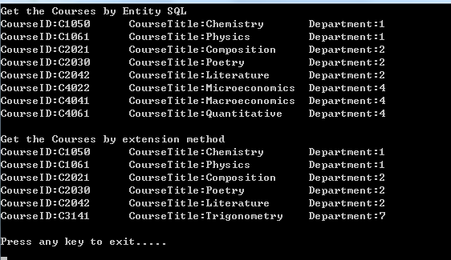

# How to implement the Between operator in the EF
## Requires
- Visual Studio 2010
## License
- Apache License, Version 2.0
## Technologies
- ADO.NET
## Topics
- Entity Framework
- Between
- Expression Tree
## Updated
- 03/22/2013
## Description

<h1>Implement the Between Operator in Entity Framework (CSEFBetweenOperator)</h1>
<h2>Introduction</h2>

This sample demonstrates how to implement the 
Between operator in Entity Framework.

In this sample, we use two ways to implement the Entity Framework Between
operator:

1. Use the Entity SQL;

2. Use the extension method and expression tree.

<h2>Building the Sample</h2>

Before you run the sample, you need to finish the following steps:

Step1. Attach the database file MySchool.mdf under the folder _External_Dependecies to your SQL Server 2008 database instance.

Step2. Modify the connection string in the App.config file according to your SQL Server 2008 database instance name.

<h2>Running the Sample</h2>

Press F5 to run the sample, the following is the result.

First, we get the courses by Entity SQL. In the Entity SQL statement, we select the courses on the Department column which the value is between 1 and 5.

Then we get the courses by extension method. In this statement, we select the courses on the CourseID column which the value is between C1050 and C3141.

<h2>Using the Code</h2>

1. Get the Courses by Entity SQL.

We select the courses on the Department column by Entity SQL.

C#

Edit|Remove

csharp
<pre class="hidden">
return school.Courses.Where(
&quot;it.DepartmentID between @lowerbound And @highbound&quot;,
new ObjectParameter(&quot;lowerbound&quot;, 1),
new ObjectParameter(&quot;highbound&quot;, 5)).ToList();

</pre>
<pre id="codePreview" class="csharp">
return school.Courses.Where(
&quot;it.DepartmentID between @lowerbound And @highbound&quot;,
new ObjectParameter(&quot;lowerbound&quot;, 1),
new ObjectParameter(&quot;highbound&quot;, 5)).ToList();

</pre>

&nbsp;

2. Get the Courses by Extension Method.

We select the courses on the CourseID column by the Bwtween extension method. In this method, we need pass three parameters: lambda expression, low boundary of the value, high boundary of the value.

C#

Edit|Remove

csharp
<pre class="hidden">
return school.Courses.Between(c =&gt; c.CourseID, &quot;C1050&quot;, &quot;C3141&quot;).ToList();

</pre>
<pre id="codePreview" class="csharp">
return school.Courses.Between(c =&gt; c.CourseID, &quot;C1050&quot;, &quot;C3141&quot;).ToList();

</pre>

&nbsp;

In the extension method, we use two expressions to implement the 
Between operation, and so we need to use the Expression.LessThanOrEqual and
Expression.GreaterThanOrEqual methods to return the two expressions.

Expression.LessThanOrEqual and 
Expression.GreaterThanOrEqua method are only used inthe numeric
comparision. If we want to compare the non-numeric type, we can't directly use the two methods.

So we first use the Compare method to compare the objects, and the Compare method will return an
int number. Then we can use the 
LessThanOrEqual and GreaterThanOrEqua method.

For this reason, we ask all the TKey types implement the
IComparable&lt;&gt; interface.

C#

Edit|Remove

csharp
<pre class="hidden">
public static IQueryable&lt;TSource&gt; Between&lt;TSource, TKey&gt;
&nbsp;&nbsp;&nbsp;&nbsp; (this IQueryable&lt;TSource&gt; source,
&nbsp; &nbsp;&nbsp;&nbsp;&nbsp;Expression&lt;Func&lt;TSource, TKey&gt;&gt; keySelector,
&nbsp;&nbsp;&nbsp;&nbsp;&nbsp; TKey low, TKey high) where TKey : IComparable&lt;TKey&gt;
{
&nbsp;&nbsp;&nbsp; ParameterExpression sourceParameter = Expression.Parameter(typeof(TSource));

&nbsp;&nbsp;&nbsp; Expression body = keySelector.Body;
&nbsp;&nbsp;&nbsp; ParameterExpression parameter = null;
&nbsp;&nbsp;&nbsp; if (keySelector.Parameters.Count&gt;0)
&nbsp;&nbsp;&nbsp;&nbsp;&nbsp;&nbsp;&nbsp; parameter = keySelector.Parameters[0];

&nbsp;&nbsp;&nbsp; MethodInfo compareMethod = typeof(TKey).GetMethod(&quot;CompareTo&quot;, new[] { typeof(TKey) });

&nbsp;&nbsp;&nbsp; Expression upper = Expression.LessThanOrEqual(
&nbsp;&nbsp;&nbsp;&nbsp;&nbsp;&nbsp; &nbsp;Expression.Call(body, compareMethod, Expression.Constant(high)),
&nbsp;&nbsp;&nbsp;&nbsp;&nbsp;&nbsp;&nbsp; Expression.Constant(0, typeof(int)));
&nbsp;&nbsp;&nbsp; Expression lower = Expression.GreaterThanOrEqual(
&nbsp;&nbsp;&nbsp;&nbsp;&nbsp;&nbsp;&nbsp; Expression.Call(body, compareMethod, Expression.Constant(low)),
&nbsp;&nbsp;&nbsp;&nbsp;&nbsp;&nbsp;&nbsp; Expression.Constant(0, typeof(int)));

&nbsp;&nbsp;&nbsp; Expression andExpression = Expression.And(upper, lower);

&nbsp;&nbsp;&nbsp; MethodCallExpression whereCallExpression = Expression.Call(
&nbsp;&nbsp;&nbsp;&nbsp;&nbsp;&nbsp;&nbsp; typeof(Queryable),
&nbsp;&nbsp;&nbsp;&nbsp;&nbsp;&nbsp;&nbsp; &quot;Where&quot;,
&nbsp;&nbsp;&nbsp;&nbsp;&nbsp;&nbsp;&nbsp; new Type[] { source.ElementType },
&nbsp;&nbsp;&nbsp;&nbsp;&nbsp;&nbsp;&nbsp; source.Expression,
&nbsp;&nbsp;&nbsp;&nbsp;&nbsp;&nbsp;&nbsp; Expression.Lambda&lt;Func&lt;TSource, bool&gt;&gt;(andExpression,
&nbsp;&nbsp;&nbsp;&nbsp;&nbsp;&nbsp;&nbsp; new ParameterExpression[] { parameter }));
&nbsp;&nbsp;&nbsp; 
&nbsp;&nbsp;&nbsp;&nbsp;return source.Provider.CreateQuery&lt;TSource&gt;(whereCallExpression);
}

</pre>
<pre id="codePreview" class="csharp">
public static IQueryable&lt;TSource&gt; Between&lt;TSource, TKey&gt;
&nbsp;&nbsp;&nbsp;&nbsp; (this IQueryable&lt;TSource&gt; source,
&nbsp; &nbsp;&nbsp;&nbsp;&nbsp;Expression&lt;Func&lt;TSource, TKey&gt;&gt; keySelector,
&nbsp;&nbsp;&nbsp;&nbsp;&nbsp; TKey low, TKey high) where TKey : IComparable&lt;TKey&gt;
{
&nbsp;&nbsp;&nbsp; ParameterExpression sourceParameter = Expression.Parameter(typeof(TSource));

&nbsp;&nbsp;&nbsp; Expression body = keySelector.Body;
&nbsp;&nbsp;&nbsp; ParameterExpression parameter = null;
&nbsp;&nbsp;&nbsp; if (keySelector.Parameters.Count&gt;0)
&nbsp;&nbsp;&nbsp;&nbsp;&nbsp;&nbsp;&nbsp; parameter = keySelector.Parameters[0];

&nbsp;&nbsp;&nbsp; MethodInfo compareMethod = typeof(TKey).GetMethod(&quot;CompareTo&quot;, new[] { typeof(TKey) });

&nbsp;&nbsp;&nbsp; Expression upper = Expression.LessThanOrEqual(
&nbsp;&nbsp;&nbsp;&nbsp;&nbsp;&nbsp; &nbsp;Expression.Call(body, compareMethod, Expression.Constant(high)),
&nbsp;&nbsp;&nbsp;&nbsp;&nbsp;&nbsp;&nbsp; Expression.Constant(0, typeof(int)));
&nbsp;&nbsp;&nbsp; Expression lower = Expression.GreaterThanOrEqual(
&nbsp;&nbsp;&nbsp;&nbsp;&nbsp;&nbsp;&nbsp; Expression.Call(body, compareMethod, Expression.Constant(low)),
&nbsp;&nbsp;&nbsp;&nbsp;&nbsp;&nbsp;&nbsp; Expression.Constant(0, typeof(int)));

&nbsp;&nbsp;&nbsp; Expression andExpression = Expression.And(upper, lower);

&nbsp;&nbsp;&nbsp; MethodCallExpression whereCallExpression = Expression.Call(
&nbsp;&nbsp;&nbsp;&nbsp;&nbsp;&nbsp;&nbsp; typeof(Queryable),
&nbsp;&nbsp;&nbsp;&nbsp;&nbsp;&nbsp;&nbsp; &quot;Where&quot;,
&nbsp;&nbsp;&nbsp;&nbsp;&nbsp;&nbsp;&nbsp; new Type[] { source.ElementType },
&nbsp;&nbsp;&nbsp;&nbsp;&nbsp;&nbsp;&nbsp; source.Expression,
&nbsp;&nbsp;&nbsp;&nbsp;&nbsp;&nbsp;&nbsp; Expression.Lambda&lt;Func&lt;TSource, bool&gt;&gt;(andExpression,
&nbsp;&nbsp;&nbsp;&nbsp;&nbsp;&nbsp;&nbsp; new ParameterExpression[] { parameter }));
&nbsp;&nbsp;&nbsp; 
&nbsp;&nbsp;&nbsp;&nbsp;return source.Provider.CreateQuery&lt;TSource&gt;(whereCallExpression);
}

</pre>

&nbsp;

<h2>More Information</h2>

<a href="http://msdn.microsoft.com/en-us/library/bb506649(v=vs.100).aspx">System.Linq.Expressions Namespace</a>

<a href="http://msdn.microsoft.com/en-us/library/4d7sx9hd(v=vs.100).aspx">IComparable&lt;T&gt; Interface</a>

