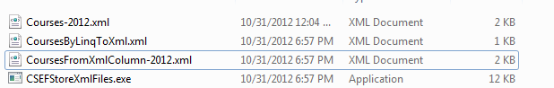

# How to import/export the XML files using Code First in EF (CSEFStoreXmlFiles)
## Requires
- Visual Studio 2010
## License
- MS-LPL
## Technologies
- ADO.NET
## Topics
- XML
- Code First
- ColumnAttribute
## Updated
- 12/20/2012
## Description

<h1>Import/Export the XML into/from database using Code First in EF(CSEFStoreXmlFiles)</h1>
<h2>Introduction</h2>

This sample demonstrates how to import/export the XML into/from database using Code First in EF.

We implement two ways in the sample: 

1. Using LinqToXml to import/export the XML files; 

2. Using the XmlColumn to store the Xml files. 

<h2>Building the Sample</h2>

Before you run the sample, you need to finish the following step:

Step1. Modify the connection string in the App.config file according to your SQL Server 2008 database instance name.

<h2>Running the Sample</h2>

Press F5 to run the sample, the following is the result.

In this sample, we use LinqToXml to import information in the Xml file(Courses-2012.xml) into the database, and then export the Xml document to the CoursesByLinqToXml.xml file.

We can also use the Xml column to store the Xml document, so we will store the entire Xml file(Courses-2012.xml)
&nbsp;in the database. And then we get the file from the database and save it into the CoursesFromXmlColumn-2012.xml.

You can find the three Xml files in the directory of the application:

<h2>Using the Code</h2>

1. Import/Export the Xml file using LinqToXml

&nbsp;&nbsp;&nbsp; a. Import information in the xml file into the database

C#

Edit|Remove

csharp

<pre id="codePreview" class="csharp">
IEnumerable&lt;Course&gt; courses = 
&nbsp;&nbsp;&nbsp;&nbsp;from c in document.Descendants(&quot;Course&quot;)
&nbsp;&nbsp;&nbsp; select new Course
&nbsp;&nbsp;&nbsp; {
&nbsp;&nbsp;&nbsp;&nbsp;&nbsp;&nbsp;&nbsp; CourseID = c.Element(&quot;CourseId&quot;) == null ? 
&nbsp;&nbsp;&nbsp;&nbsp;&nbsp;&nbsp;&nbsp;&nbsp;Guid.NewGuid().ToString() : c.Element(&quot;CourseId&quot;).Value,
&nbsp;&nbsp;&nbsp;&nbsp;&nbsp;&nbsp;&nbsp; Title = c.Element(&quot;Title&quot;) == null ? null : c.Element(&quot;Title&quot;).Value,
&nbsp;&nbsp;&nbsp;&nbsp;&nbsp;&nbsp;&nbsp; Credits = c.Element(&quot;Credits&quot;) == null ? -1 : Int32.Parse(c.Element(&quot;Credits&quot;).Value) ,
&nbsp;&nbsp;&nbsp;&nbsp;&nbsp;&nbsp;&nbsp; Department = c.Element(&quot;Department&quot;) == null ? null : c.Element(&quot;Department&quot;).Value
&nbsp;&nbsp;&nbsp; };

</pre>

&nbsp;

&nbsp;&nbsp;&nbsp; b. Export the information into a Xml file from the database

C#

Edit|Remove

csharp

<pre id="codePreview" class="csharp">
XNamespace ns = &quot;http://CSEFStoreXmlFiles&quot;;
XElement coursesXml = new XElement(ns &#43; &quot;Courses&quot;,
&nbsp;&nbsp;&nbsp; from c in school.Courses.Take(5).AsEnumerable()
&nbsp;&nbsp;&nbsp; select new XElement(ns &#43; &quot;Course&quot;,
&nbsp;&nbsp;&nbsp;&nbsp;&nbsp;&nbsp;&nbsp; c.CourseID == null ? null : new XElement(ns &#43; &quot;CourseID&quot;, c.CourseID),
&nbsp;&nbsp;&nbsp;&nbsp;&nbsp;&nbsp;&nbsp; c.Title == null ? null : new XElement(ns &#43; &quot;Title&quot;, c.Title),
&nbsp;&nbsp;&nbsp;&nbsp;&nbsp;&nbsp;&nbsp; c.Credits == null ? null : new XElement(ns &#43; &quot;Credits&quot;, c.Credits),
&nbsp;&nbsp;&nbsp;&nbsp;&nbsp;&nbsp;&nbsp; c.Department == null ? null : new XElement(ns &#43; &quot;Department&quot;, c.Department)));

coursesXml.Save(&quot;CoursesByLinqToXml.xml&quot;);

</pre>

&nbsp;

2. Using XmlColumn to store the Xml file

&nbsp;&nbsp;&nbsp;&nbsp; a. The XmlColumn type in the SqlServer will be mapped as the String type in the EntityFramework. And EntityFramework can't map the XDcoument type into the SqlServer type, so we use the XmlValues property to map
 the XmlColumn in the SqlServer and use the Courses property to access the Xml document.

&nbsp;&nbsp;&nbsp;&nbsp;&nbsp;&nbsp;&nbsp; Because EntityFramework doesn't support map the XDocument type, so we set NotMapped on the Courses property.

C#

Edit|Remove

csharp

<pre id="codePreview" class="csharp">
public class YearCourse
{
&nbsp;&nbsp;&nbsp; public Int32 YearCourseId { get; set; }
&nbsp;&nbsp;&nbsp; public Int32 Year { get; set; }

&nbsp;&nbsp;&nbsp; [Column(TypeName=&quot;xml&quot;)]
&nbsp;&nbsp;&nbsp; public String XmlValues { get; set; }

&nbsp;&nbsp;&nbsp; [NotMapped]
&nbsp;&nbsp;&nbsp; public XDocument Courses
&nbsp;&nbsp;&nbsp; {
&nbsp;&nbsp;&nbsp;&nbsp; &nbsp;&nbsp;&nbsp;get { return XDocument.Parse(XmlValues); }
&nbsp;&nbsp;&nbsp;&nbsp;&nbsp;&nbsp;&nbsp; set { XmlValues = value.ToString(); }
&nbsp;&nbsp;&nbsp; }
}

</pre>

&nbsp;

b.
When we get the Xml document form the Xml column in the database, we can use LinqToXml to get the information of the course.

C#

Edit|Remove

csharp

<pre id="codePreview" class="csharp">
IEnumerable&lt;Course&gt; courseList = 
&nbsp;&nbsp;&nbsp;&nbsp;from c in courses.Courses.Descendants(&quot;Course&quot;)
&nbsp;&nbsp;&nbsp; select new Course
&nbsp;&nbsp;&nbsp; {
&nbsp;&nbsp;&nbsp;&nbsp;&nbsp;&nbsp;&nbsp; CourseID = c.Element(&quot;CourseId&quot;) == null ? 
&nbsp;&nbsp;&nbsp;&nbsp;&nbsp;&nbsp;&nbsp;&nbsp;Guid.NewGuid().ToString() : c.Element(&quot;CourseId&quot;).Value,
&nbsp;&nbsp;&nbsp; &nbsp;&nbsp;&nbsp;&nbsp;Title = c.Element(&quot;Title&quot;) == null ? null : c.Element(&quot;Title&quot;).Value,
&nbsp;&nbsp;&nbsp;&nbsp;&nbsp;&nbsp;&nbsp; Credits = c.Element(&quot;Credits&quot;) == null ? -1 : Int32.Parse(c.Element(&quot;Credits&quot;).Value),
&nbsp;&nbsp;&nbsp;&nbsp;&nbsp;&nbsp;&nbsp; Department = c.Element(&quot;Department&quot;) == null ? null : c.Element(&quot;Department&quot;).Value
&nbsp;&nbsp;&nbsp; };

</pre>

&nbsp;

<h2>More Information</h2>

<a href="http://msdn.microsoft.com/en-us/library/bb387098.aspx">LINQ to XML</a>

<a href="http://msdn.microsoft.com/en-us/library/system.componentmodel.dataannotations.columnattribute%28v=VS.103%29.aspx">ColumnAttribute Class</a>

