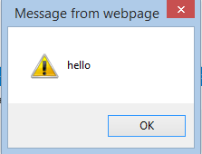

# How to inject javascript code into WebBrowser in Windows Forms applications
## Requires
- 
## License
- Apache License, Version 2.0
## Technologies
- Windows Forms
- Internet Explorer
- .NET Development
- Internet Explorer Development
## Topics
- WebBrowser
- code snippets
- inject code
## Updated
- 09/22/2016
## Description

Windows Forms 응용 프로그램에서 WebBrowser 컨트롤에 JavaScript 코드를 삽입하는 방법

소개

이 코드 조각 프로젝트에서는 Windows Forms 응용 프로그램에서 System.Windows.Forms.Webbrowser 컨트롤에 JavaScript 코드를 삽입하는 방법을 보여 줍니다.

코드 사용

1단계. Visual Studio에서 Windows Forms 응용 프로그램을 만든 다음 WebBrowser 컨트롤을 기본 폼에 끌어 놓고
컨트롤의 URL 속성을 설정합니다.

2단계. 아래와 같은 단계에 따라 필요한 참조를 추가합니다.

프로젝트를 마우스 오른쪽 단추로 클릭하고 
참조 추가... -&gt;
COM -&gt;
형식 라이브러리를 선택한 다음 &quot;Microsoft HTML 개체 라이브러리&quot;를 선택합니다.

3단계. 네임스페이스를 추가합니다. 

C#VBC&#43;&#43;

Edit|Remove

csharpvbcplusplus
<pre class="hidden">using mshtml;
</pre>
<pre class="hidden">Imports mshtml
</pre>
<pre class="hidden">using namespace MSHTML;
</pre>
<pre class="csharp" id="codePreview">using mshtml;
</pre>

&nbsp;

&nbsp;

4단계. 다음 코드 조각에서는 WebBrowser 컨트롤에 JavaScript 코드를 삽입하는 방법을 보여 줍니다.

C#VBC&#43;&#43;

Edit|Remove

csharpvbcplusplus
<pre class="hidden">private void webBrowser1_DocumentCompleted(object sender, WebBrowserDocumentCompletedEventArgs e)
{
    HtmlElement headElement = webBrowser1.Document.GetElementsByTagName(&quot;head&quot;)[0];
    HtmlElement scriptElement = webBrowser1.Document.CreateElement(&quot;script&quot;);
    IHTMLScriptElement element = (IHTMLScriptElement)scriptElement.DomElement;
    element.text = &quot;function sayHello() { alert('hello') }&quot;;
    headElement.AppendChild(scriptElement);
    webBrowser1.Document.InvokeScript(&quot;sayHello&quot;);
}
</pre>
<pre class="hidden">Private Sub WebBrowser1_DocumentCompleted(sender As Object, e As WebBrowserDocumentCompletedEventArgs) Handles WebBrowser1.DocumentCompleted
    Dim headElement As HtmlElement = WebBrowser1.Document.GetElementsByTagName(&quot;head&quot;)(0)
    Dim scriptElement As HtmlElement = WebBrowser1.Document.CreateElement(&quot;script&quot;)
    Dim element As IHTMLScriptElement = DirectCast(scriptElement.DomElement, IHTMLScriptElement)
    element.text = &quot;function sayHello() { alert('hello') }&quot;
    headElement.AppendChild(scriptElement)
    WebBrowser1.Document.InvokeScript(&quot;sayHello&quot;)
End Sub
</pre>
<pre class="hidden">System::Void MyForm::webBrowser1_DocumentCompleted(System::Object^  sender, System::Windows::Forms::WebBrowserDocumentCompletedEventArgs^  e)
{
 HtmlElement^ headElement = webBrowser1-&gt;Document-&gt;GetElementsByTagName(&quot;head&quot;)[0];
 HtmlElement^ scriptElement = webBrowser1-&gt;Document-&gt;CreateElement(&quot;script&quot;);
 IHTMLScriptElement^ element = (IHTMLScriptElement^)scriptElement-&gt;DomElement;
 element-&gt;text = &quot;function sayHello() { alert('hello') }&quot;;
 headElement-&gt;AppendChild(scriptElement);
 webBrowser1-&gt;Document-&gt;InvokeScript(&quot;sayHello&quot;);
}
</pre>
<pre class="csharp" id="codePreview">private void webBrowser1_DocumentCompleted(object sender, WebBrowserDocumentCompletedEventArgs e)
{
    HtmlElement headElement = webBrowser1.Document.GetElementsByTagName(&quot;head&quot;)[0];
    HtmlElement scriptElement = webBrowser1.Document.CreateElement(&quot;script&quot;);
    IHTMLScriptElement element = (IHTMLScriptElement)scriptElement.DomElement;
    element.text = &quot;function sayHello() { alert('hello') }&quot;;
    headElement.AppendChild(scriptElement);
    webBrowser1.Document.InvokeScript(&quot;sayHello&quot;);
}
</pre>

&nbsp;

5단계. 응용 프로그램을 빌드하고 실행할 수 있습니다. 아무 문제가 없다면 환영 메시지가 표시됩니다.

추가 정보

WebBrowser 컨트롤(영문)

<a href="http://msdn.microsoft.com/ko-kr/library/system.windows.forms.webbrowser(v=vs.110).ASPX" style="text-decoration:none">http://msdn.microsoft.com/ko-kr/library/system.windows.forms.webbrowser(v=vs.110).ASPX</a>

WebBrowser.Document 속성(영문)

<a href="http://msdn.microsoft.com/ko-kr/library/system.windows.forms.webbrowser.document(v=vs.110).aspx" style="text-decoration:none">http://msdn.microsoft.com/ko-kr/library/system.windows.forms.webbrowser.document(v=vs.110).aspx</a>

HtmlDocument 클래스(영문)

<a href="http://msdn.microsoft.com/ko-kr/library/system.windows.forms.htmldocument(v=vs.110).aspx" style="text-decoration:none">http://msdn.microsoft.com/ko-kr/library/system.windows.forms.htmldocument(v=vs.110).aspx</a>

HtmlDocument.InvokeScript 메서드(영문)

<a href="http://msdn.microsoft.com/ko-kr/library/system.windows.forms.htmldocument.invokescript(v=vs.110).aspx" style="text-decoration:none">http://msdn.microsoft.com/ko-kr/library/system.windows.forms.htmldocument.invokescript(v=vs.110).aspx</a>

&nbsp;

&nbsp;

Microsoft All-In-One Code Framework는 개발자들의 실제 문제와 요구에 따라 구성된 중앙 집중식 무료 코드 샘플 라이브러리입니다. 모든 Microsoft 개발 기술에 대한 고객 중심 코드 샘플을 제공하고 일반 프로그래밍 작업 진행에서 개발자의 수고를 더는 것을 목표로 삼고 있습니다. Microsoft 팀은 MSDN 포럼, 소셜 미디어 및 다양한 DEV 커뮤니티에서
 개발자들이 겪는 문제를 확인합니다. 개발자들이 자주 문의하는 프로그래밍 작업을 기반&#51004;로 코드 샘플을 작성하며 개발자들이 짧은 샘플 게시 주기로 이러한 샘플을 다운로드할 수 있습니다. 또한 무료 코드 샘플 요청 서비스를 제공합니다. 이는 Microsoft 개발자 커뮤니티가 Microsoft에서 코드 샘플을 직접 구할 수 있는 사전 대응적인 방식입니다.

