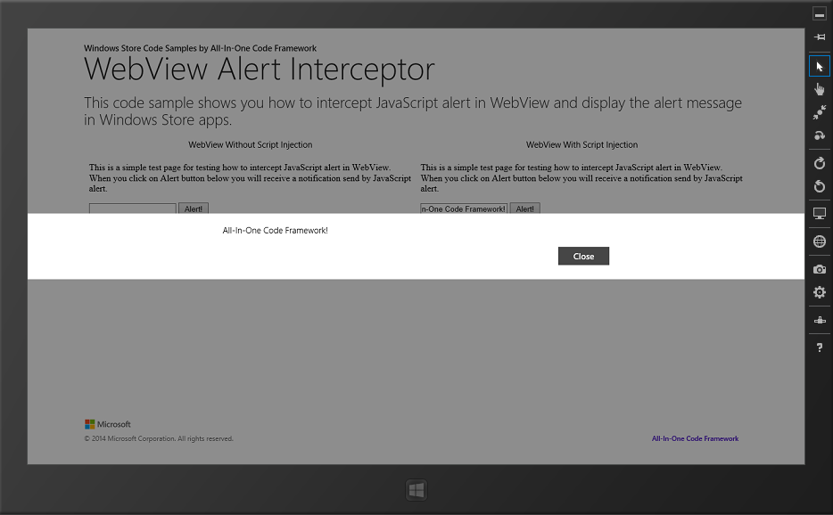

# How to intercept JavaScript alert in WebView in universal Windows apps
## Requires
- Visual Studio 2013
## License
- Apache License, Version 2.0
## Technologies
- Windows
- Windows 8
- Windows Phone 8
- Windows Store app Development
- Windows Phone Development
- Windows 8.1
- Windows Phone 8.1
## Topics
- WebView
- universal app
## Updated
- 09/22/2016
## Description

<strong></strong><em></em>

How to intercept JavaScript alerts in WebView and display
 the alert messages in universal Windows apps.

Introduction

The Windows 8 &amp; 8.1 WebView control will not show JavaScript Alerts that are raised by the webpage inside the WebView. This presents a challenge to application developers
 when they do not control the content of the website. However, this can be remedied by the use of JavaScript invoked into the WebView. This code sample will show you how to intercept JavaScript alerts
 in WebView and display the alert messages in universal Windows apps.

Please note: The samples were written based on the following video:

<a href="http://channel9.msdn.com/Series/Windows-Store-Developer-Solutions/WebView-Magic-Tricks-Series-Part-3-Alert-Interceptor" style="text-decoration:none">http://channel9.msdn.com/Series/Windows-Store-Developer-Solutions/WebView-Magic-Tricks-Series-Part-3-Alert-Interceptor</a>

Running the Sample

You can build and run the sample in Visual Studio 2013. After being launched, the app looks like this:

Using the Code

The Windows 8 &amp; 8.1 WebView control will not show Javascript
alerts that are raised by the webpage inside the WebView.

scriptNotify_example.html mimics 
a scenario in which the Javascript Alert() is called. 

HTML

Edit|Remove

html

<pre class="html" id="codePreview">&lt;!DOCTYPE html&gt;
&lt;html&gt;
&lt;head&gt;
    &lt;title&gt;Example HTML document&lt;/title&gt;
&lt;/head&gt;
&lt;body onload=&quot;onload();&quot;&gt;
    
This is a simple test page for testing how to intercept JavaScript alerts in WebView. When you click on Alert button below, you will receive a notification sent by JavaScript alert.

    &lt;input type=&quot;text&quot; id=&quot;AlertMessageTextBox&quot;/&gt;
    &lt;input type=&quot;button&quot; onclick=&quot;Alert();&quot; value=&quot;Alert!&quot;/&gt;
    &lt;script type=&quot;text/javascript&quot;&gt;
        function Alert() {
            window.alert(document.getElementById('AlertMessageTextBox').value);
        }
    &lt;/script&gt;
&lt;/body&gt;
&lt;/html&gt;
</pre>

&nbsp;

&nbsp;

Normally, the WebView control will not show JavaScript Alerts. To remedy this limitation, we can inject JavaScript code by calling
WebView.InvokeScriptAsync function. A hosted HTML page can fire the
ScriptNotify event in your Windows Store app when the page calls
window.external.notify and passes a string parameter.

C#VBC&#43;&#43;

Edit|Remove

csharpvbcplusplus

<pre class="csharp" id="codePreview">private async void WebViewWithJSInjection_NavigationCompleted(WebView sender, WebViewNavigationCompletedEventArgs args)
{
    string result = await this.WebViewWithJSInjection.InvokeScriptAsync(&quot;eval&quot;, new string[] { &quot;window.alert = function (AlertMessage) {window.external.notify(AlertMessage)}&quot; });
}
</pre>

&nbsp;

&nbsp;

Then in ScriptNotify
event handler, we can receive the alert message and show it like below.

C#VBC&#43;&#43;

Edit|Remove

csharpvbcplusplus

<pre class="csharp" id="codePreview">private async void WebViewWithJSInjection_ScriptNotify(object sender, NotifyEventArgs e)
{
    Windows.UI.Popups.MessageDialog dialog = new Windows.UI.Popups.MessageDialog(e.Value);
    await dialog.ShowAsync();
}
</pre>

&nbsp;

&nbsp;

More Information

&nbsp;

WebView Magic Tricks Series Part 3: Alert Interceptor

<a href="http://channel9.msdn.com/Series/Windows-Store-Developer-Solutions/WebView-Magic-Tricks-Series-Part-3-Alert-Interceptor" style="text-decoration:none">http://channel9.msdn.com/Series/Windows-Store-Developer-Solutions/WebView-Magic-Tricks-Series-Part-3-Alert-Interceptor</a>

WebView class

<a href="http://msdn.microsoft.com/library/windows/apps/windows.ui.xaml.controls.webview.aspx" style="text-decoration:none">http://msdn.microsoft.com/library/windows/apps/windows.ui.xaml.controls.webview.aspx</a>

WebView.InvokeScriptAsync method

<a href="http://msdn.microsoft.com/en-us/library/windows/apps/windows.ui.xaml.controls.webview.invokescriptasync.aspx" style="text-decoration:none">http://msdn.microsoft.com/en-us/library/windows/apps/windows.ui.xaml.controls.webview.invokescriptasync.aspx</a>

WebView.ScriptNotify event

<a href="http://msdn.microsoft.com/en-us/library/windows/apps/windows.ui.xaml.controls.webview.scriptnotify.aspx" style="text-decoration:none">http://msdn.microsoft.com/en-us/library/windows/apps/windows.ui.xaml.controls.webview.scriptnotify.aspx</a>

&nbsp;

&nbsp;

&nbsp;

Microsoft All-In-One Code Framework is a free, centralized code sample library driven by developers' real-world pains and needs. The goal is to provide customer-driven code samples for all Microsoft development technologies,
 and reduce developers' efforts in solving typical programming tasks. Our team listens to developers&rsquo; pains in the MSDN forums, social media and various DEV communities. We write code samples based on developers&rsquo; frequently asked programming tasks,
 and allow developers to download them with a short sample publishing cycle. Additionally, we offer a free code sample request service. It is a proactive way for our developer community to obtain code samples directly from Microsoft.

