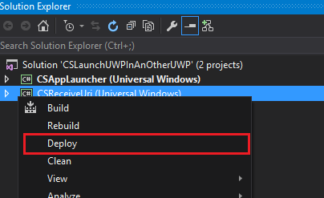
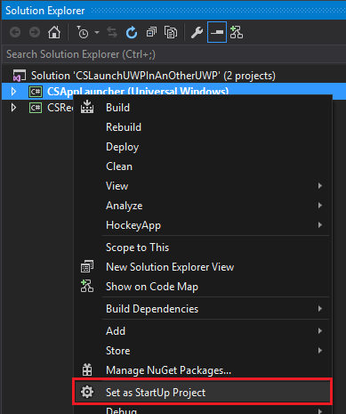
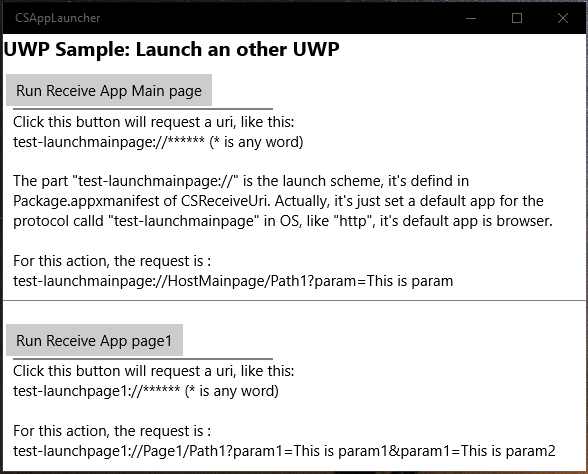
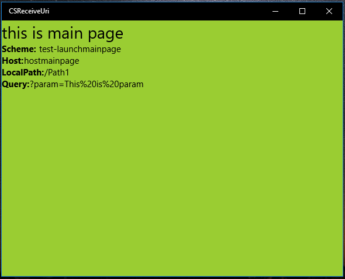
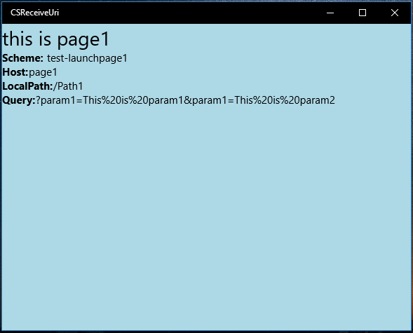
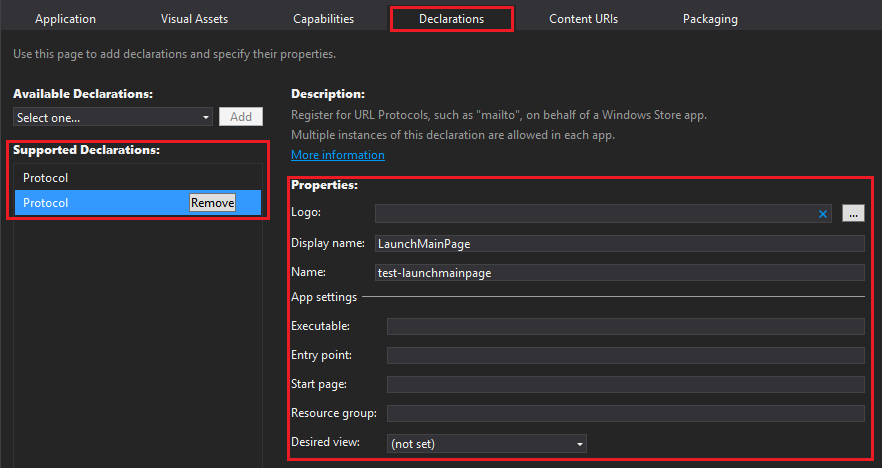

# How to launch an UWP app from another app
## Requires
- Visual Studio 2015
## License
- Apache License, Version 2.0
## Technologies
- C#
- .NET
- UWP
- Languages
## Topics
- C#
- UWP
- Launch app by url schema
## Updated
- 12/21/2016
## Description

<strong>&nbsp;</strong><em>&nbsp;</em>

How to launch an UWP from another UWP

Introduction

This sample demonstrates 
how to launch an UWP app from another UWP app.

After the launched app named &ldquo;CSReceiveUri&rdquo; has been installed, run the launcher app
named &ldquo;CSAppLauncher&rdquo;,

Click any button in the main page of &nbsp;CSAppLauncher, the launched app will be opened
in launcher app and the info 
will be displayed by the parameter from launcher app.

Actually, default app of the protocol
will be used to launch an app. Take 
http for instance , its default app is browser.

Sample prerequisites

To open and run this sample, ensure the following
requisites has been reached:

&bull;&nbsp;Microsoft Windows 10(10.0.14393) or above.

&bull;&nbsp;Microsoft Visual Studio 2015 Update3 or later version(s).

&bull;&nbsp;Microsoft Visual Studio installed UWP developer component.

Building the sample

&bull;&nbsp;Open the sample solution &ldquo;CSLaunchUWPInAnOtherUWP.sln&rdquo; using Visual Studio.

&bull;&nbsp;In Solution Explorer, right click project &ldquo;CSReceiveUri&rdquo; and choose
Deploy.

&bull;&nbsp;In Solution Explorer, right click project &ldquo;CSAppLauncher&rdquo; and select
Set as StartUp Project.

Running the sample

&bull;&nbsp;Use Visual studio to open the sample solution, then press
F5 Key or select Debug -&gt; Start Debugging
from the menu.

&bull;&nbsp;When the app is running, you can see this:

&bull;&nbsp;Click
the &ldquo;Run Receive app Main page&ldquo; button, the
CSReceiveUri app will be run with main page.

&bull;&nbsp;Click the second
&ldquo;Run Receive App page1&rdquo; button, the app
CSReceiveUri will be run with page1.

Using the code

&bull;&nbsp;In project
CSAppLauncher, The Launch Code is:

&nbsp;

Visual BasicC#

Edit|Remove

vbcsharp

<pre class="vb">&nbsp;&nbsp;&nbsp;&nbsp;Private&nbsp;Async&nbsp;Sub&nbsp;RunPage1_Click(sender&nbsp;As&nbsp;Object,&nbsp;e&nbsp;As&nbsp;RoutedEventArgs)&nbsp;
&nbsp;&nbsp;&nbsp;&nbsp;&nbsp;&nbsp;&nbsp;&nbsp;Await&nbsp;LaunchAppAsync(&quot;test-launchpage1://Page1/Path1?param1=This&nbsp;is&nbsp;param1&amp;param1=This&nbsp;is&nbsp;param2&quot;)&nbsp;
&nbsp;&nbsp;&nbsp;&nbsp;End&nbsp;Sub&nbsp;
&nbsp;
&nbsp;&nbsp;&nbsp;&nbsp;Private&nbsp;Async&nbsp;Sub&nbsp;RunMainPage_Click(sender&nbsp;As&nbsp;Object,&nbsp;e&nbsp;As&nbsp;RoutedEventArgs)&nbsp;
&nbsp;&nbsp;&nbsp;&nbsp;&nbsp;&nbsp;&nbsp;&nbsp;Await&nbsp;LaunchAppAsync(&quot;test-launchmainpage://HostMainpage/Path1?param=This&nbsp;is&nbsp;param&quot;)&nbsp;
&nbsp;&nbsp;&nbsp;&nbsp;End&nbsp;Sub&nbsp;
&nbsp;
&nbsp;&nbsp;&nbsp;&nbsp;Private&nbsp;Async&nbsp;Function&nbsp;LaunchAppAsync(uriStr&nbsp;As&nbsp;String)&nbsp;As&nbsp;Task&nbsp;
&nbsp;&nbsp;&nbsp;&nbsp;&nbsp;&nbsp;&nbsp;&nbsp;Dim&nbsp;uri&nbsp;=&nbsp;New&nbsp;Uri(uriStr)&nbsp;
&nbsp;&nbsp;&nbsp;&nbsp;&nbsp;&nbsp;&nbsp;&nbsp;Dim&nbsp;promptOptions&nbsp;=&nbsp;New&nbsp;Windows.System.LauncherOptions()&nbsp;
&nbsp;&nbsp;&nbsp;&nbsp;&nbsp;&nbsp;&nbsp;&nbsp;promptOptions.TreatAsUntrusted&nbsp;=&nbsp;False&nbsp;
&nbsp;
&nbsp;&nbsp;&nbsp;&nbsp;&nbsp;&nbsp;&nbsp;&nbsp;Dim&nbsp;isSuccess&nbsp;As&nbsp;Boolean&nbsp;=&nbsp;Await&nbsp;Windows.System.Launcher.LaunchUriAsync(uri,&nbsp;promptOptions)&nbsp;
&nbsp;
&nbsp;&nbsp;&nbsp;&nbsp;&nbsp;&nbsp;&nbsp;&nbsp;If&nbsp;isSuccess&nbsp;=&nbsp;False&nbsp;Then&nbsp;
&nbsp;&nbsp;&nbsp;&nbsp;&nbsp;&nbsp;&nbsp;&nbsp;&nbsp;&nbsp;&nbsp;&nbsp;Dim&nbsp;msg&nbsp;As&nbsp;String&nbsp;=&nbsp;&quot;Launch&nbsp;failed&quot;&nbsp;
&nbsp;&nbsp;&nbsp;&nbsp;&nbsp;&nbsp;&nbsp;&nbsp;&nbsp;&nbsp;&nbsp;&nbsp;Await&nbsp;New&nbsp;MessageDialog(msg).ShowAsync()&nbsp;
&nbsp;&nbsp;&nbsp;&nbsp;&nbsp;&nbsp;&nbsp;&nbsp;End&nbsp;If&nbsp;
&nbsp;&nbsp;&nbsp;&nbsp;End&nbsp;Function</pre>

&bull;&nbsp;In
the project
CSReceiveUri, The config in
Package.appxmanifest is:

&nbsp;

The XML format is:

&nbsp;

XML

编辑脚本|Remove

xml

<pre class="xml">&lt;Package&gt;&nbsp;
&nbsp;&nbsp;&lt;Applications&gt;&nbsp;
&nbsp;&nbsp;&nbsp;&nbsp;&lt;Application&nbsp;Id=&quot;App&quot;&nbsp;Executable=&quot;$targetnametoken$.exe&quot;&nbsp;EntryPoint=&quot;CSReceiveUri.App&quot;&gt;&nbsp;
&nbsp;&nbsp;&nbsp;&nbsp;&nbsp;&nbsp;&lt;Extensions&gt;&nbsp;
&nbsp;&nbsp;&nbsp;&nbsp;&nbsp;&nbsp;&nbsp;&nbsp;&lt;uap:Extension&nbsp;Category=&quot;windows.protocol&quot;&gt;&nbsp;
&nbsp;&nbsp;&nbsp;&nbsp;&nbsp;&nbsp;&nbsp;&nbsp;&nbsp;&nbsp;&lt;uap:Protocol&nbsp;Name=&quot;test-launchpage1&quot;&gt;&nbsp;
&nbsp;&nbsp;&nbsp;&nbsp;&nbsp;&nbsp;&nbsp;&nbsp;&nbsp;&nbsp;&nbsp;&nbsp;&lt;uap:DisplayName&gt;LaunchPage1&lt;/uap:DisplayName&gt;&nbsp;
&nbsp;&nbsp;&nbsp;&nbsp;&nbsp;&nbsp;&nbsp;&nbsp;&nbsp;&nbsp;&lt;/uap:Protocol&gt;&nbsp;
&nbsp;&nbsp;&nbsp;&nbsp;&nbsp;&nbsp;&nbsp;&nbsp;&lt;/uap:Extension&gt;&nbsp;
&nbsp;&nbsp;&nbsp;&nbsp;&nbsp;&nbsp;&nbsp;&nbsp;&lt;uap:Extension&nbsp;Category=&quot;windows.protocol&quot;&gt;&nbsp;
&nbsp;&nbsp;&nbsp;&nbsp;&nbsp;&nbsp;&nbsp;&nbsp;&nbsp;&nbsp;&lt;uap:Protocol&nbsp;Name=&quot;test-launchmainpage&quot;&gt;&nbsp;
&nbsp;&nbsp;&nbsp;&nbsp;&nbsp;&nbsp;&nbsp;&nbsp;&nbsp;&nbsp;&nbsp;&nbsp;&lt;uap:DisplayName&gt;LaunchMainPage&lt;/uap:DisplayName&gt;&nbsp;
&nbsp;&nbsp;&nbsp;&nbsp;&nbsp;&nbsp;&nbsp;&nbsp;&nbsp;&nbsp;&lt;/uap:Protocol&gt;&nbsp;
&nbsp;&nbsp;&nbsp;&nbsp;&nbsp;&nbsp;&nbsp;&nbsp;&lt;/uap:Extension&gt;&nbsp;
&nbsp;&nbsp;&nbsp;&nbsp;&nbsp;&nbsp;&lt;/Extensions&gt;&nbsp;
&nbsp;&nbsp;&nbsp;&nbsp;&lt;/Application&gt;&nbsp;
&nbsp;&nbsp;&lt;/Applications&gt;&nbsp;
&lt;/Package&gt;</pre>

&bull;&nbsp;There
is an event handler called OnActivated in
file app.cs. Here is the relevant code:

&nbsp; &nbsp; &nbsp; &nbsp;&nbsp;

Visual BasicC#

Edit|Remove

vbcsharp

<pre class="vb">&nbsp;&nbsp;&nbsp;&nbsp;Protected&nbsp;Overrides&nbsp;Sub&nbsp;OnActivated(args&nbsp;As&nbsp;IActivatedEventArgs)&nbsp;
&nbsp;&nbsp;&nbsp;&nbsp;&nbsp;&nbsp;&nbsp;&nbsp;If&nbsp;args.Kind&nbsp;=&nbsp;ActivationKind.Protocol&nbsp;Then&nbsp;
&nbsp;&nbsp;&nbsp;&nbsp;&nbsp;&nbsp;&nbsp;&nbsp;&nbsp;&nbsp;&nbsp;&nbsp;Dim&nbsp;rootFrame&nbsp;=&nbsp;CType(Window.Current.Content,&nbsp;Frame)&nbsp;
&nbsp;
&nbsp;&nbsp;&nbsp;&nbsp;&nbsp;&nbsp;&nbsp;&nbsp;&nbsp;&nbsp;&nbsp;&nbsp;If&nbsp;rootFrame&nbsp;Is&nbsp;Nothing&nbsp;Then&nbsp;
&nbsp;&nbsp;&nbsp;&nbsp;&nbsp;&nbsp;&nbsp;&nbsp;&nbsp;&nbsp;&nbsp;&nbsp;&nbsp;&nbsp;&nbsp;&nbsp;rootFrame&nbsp;=&nbsp;New&nbsp;Frame()&nbsp;
&nbsp;&nbsp;&nbsp;&nbsp;&nbsp;&nbsp;&nbsp;&nbsp;&nbsp;&nbsp;&nbsp;&nbsp;&nbsp;&nbsp;&nbsp;&nbsp;Window.Current.Content&nbsp;=&nbsp;rootFrame&nbsp;
&nbsp;&nbsp;&nbsp;&nbsp;&nbsp;&nbsp;&nbsp;&nbsp;&nbsp;&nbsp;&nbsp;&nbsp;&nbsp;&nbsp;&nbsp;&nbsp;AddHandler&nbsp;rootFrame.NavigationFailed,&nbsp;AddressOf&nbsp;OnNavigationFailed&nbsp;
&nbsp;&nbsp;&nbsp;&nbsp;&nbsp;&nbsp;&nbsp;&nbsp;&nbsp;&nbsp;&nbsp;&nbsp;End&nbsp;If&nbsp;
&nbsp;
&nbsp;&nbsp;&nbsp;&nbsp;&nbsp;&nbsp;&nbsp;&nbsp;&nbsp;&nbsp;&nbsp;&nbsp;'because&nbsp;this&nbsp;is&nbsp;in&nbsp;(args.Kind&nbsp;==&nbsp;ActivationKind.Protocol)&nbsp;block,&nbsp;so&nbsp;the&nbsp;type&nbsp;of&nbsp;args&nbsp;must&nbsp;is&nbsp;ProtocolActivatedEventArgs&nbsp;
&nbsp;&nbsp;&nbsp;&nbsp;&nbsp;&nbsp;&nbsp;&nbsp;&nbsp;&nbsp;&nbsp;&nbsp;'convert&nbsp;to&nbsp;type&nbsp;ProtocolActivatedEventArgs,&nbsp;and&nbsp;we&nbsp;can&nbsp;visit&nbsp;Uri&nbsp;property&nbsp;in&nbsp;type&nbsp;ProtocolActivatedEventArgs&nbsp;
&nbsp;&nbsp;&nbsp;&nbsp;&nbsp;&nbsp;&nbsp;&nbsp;&nbsp;&nbsp;&nbsp;&nbsp;Dim&nbsp;protocolEventArgs&nbsp;=&nbsp;CType(args,&nbsp;ProtocolActivatedEventArgs)&nbsp;
&nbsp;&nbsp;&nbsp;&nbsp;&nbsp;&nbsp;&nbsp;&nbsp;&nbsp;&nbsp;&nbsp;&nbsp;'Switch&nbsp;to&nbsp;a&nbsp;view&nbsp;by&nbsp;Scheme&nbsp;
&nbsp;&nbsp;&nbsp;&nbsp;&nbsp;&nbsp;&nbsp;&nbsp;&nbsp;&nbsp;&nbsp;&nbsp;Select&nbsp;Case&nbsp;protocolEventArgs.Uri.Scheme&nbsp;
&nbsp;&nbsp;&nbsp;&nbsp;&nbsp;&nbsp;&nbsp;&nbsp;&nbsp;&nbsp;&nbsp;&nbsp;&nbsp;&nbsp;&nbsp;&nbsp;'under&nbsp;case&nbsp;is&nbsp;the&nbsp;protocol&nbsp;scheme&nbsp;in&nbsp;the&nbsp;Package.appxmanifest&nbsp;
&nbsp;&nbsp;&nbsp;&nbsp;&nbsp;&nbsp;&nbsp;&nbsp;&nbsp;&nbsp;&nbsp;&nbsp;&nbsp;&nbsp;&nbsp;&nbsp;'Navigate&nbsp;to&nbsp;target&nbsp;page&nbsp;with&nbsp;Uri&nbsp;as&nbsp;parameter&nbsp;
&nbsp;&nbsp;&nbsp;&nbsp;&nbsp;&nbsp;&nbsp;&nbsp;&nbsp;&nbsp;&nbsp;&nbsp;&nbsp;&nbsp;&nbsp;&nbsp;Case&nbsp;&quot;test-launchmainpage&quot;&nbsp;
&nbsp;&nbsp;&nbsp;&nbsp;&nbsp;&nbsp;&nbsp;&nbsp;&nbsp;&nbsp;&nbsp;&nbsp;&nbsp;&nbsp;&nbsp;&nbsp;&nbsp;&nbsp;&nbsp;&nbsp;rootFrame.Navigate(GetType(MainPage),&nbsp;protocolEventArgs.Uri)&nbsp;
&nbsp;&nbsp;&nbsp;&nbsp;&nbsp;&nbsp;&nbsp;&nbsp;&nbsp;&nbsp;&nbsp;&nbsp;&nbsp;&nbsp;&nbsp;&nbsp;Case&nbsp;&quot;test-launchpage1&quot;&nbsp;
&nbsp;&nbsp;&nbsp;&nbsp;&nbsp;&nbsp;&nbsp;&nbsp;&nbsp;&nbsp;&nbsp;&nbsp;&nbsp;&nbsp;&nbsp;&nbsp;&nbsp;&nbsp;&nbsp;&nbsp;rootFrame.Navigate(GetType(Page1),&nbsp;protocolEventArgs.Uri)&nbsp;
&nbsp;&nbsp;&nbsp;&nbsp;&nbsp;&nbsp;&nbsp;&nbsp;&nbsp;&nbsp;&nbsp;&nbsp;&nbsp;&nbsp;&nbsp;&nbsp;Case&nbsp;Else&nbsp;
&nbsp;&nbsp;&nbsp;&nbsp;&nbsp;&nbsp;&nbsp;&nbsp;&nbsp;&nbsp;&nbsp;&nbsp;&nbsp;&nbsp;&nbsp;&nbsp;&nbsp;&nbsp;&nbsp;&nbsp;rootFrame.Navigate(GetType(MainPage),&nbsp;protocolEventArgs.Uri)&nbsp;
&nbsp;&nbsp;&nbsp;&nbsp;&nbsp;&nbsp;&nbsp;&nbsp;&nbsp;&nbsp;&nbsp;&nbsp;End&nbsp;Select&nbsp;
&nbsp;
&nbsp;&nbsp;&nbsp;&nbsp;&nbsp;&nbsp;&nbsp;&nbsp;&nbsp;&nbsp;&nbsp;&nbsp;'start&nbsp;show&nbsp;UI&nbsp;
&nbsp;&nbsp;&nbsp;&nbsp;&nbsp;&nbsp;&nbsp;&nbsp;&nbsp;&nbsp;&nbsp;&nbsp;Window.Current.Activate()&nbsp;
&nbsp;&nbsp;&nbsp;&nbsp;&nbsp;&nbsp;&nbsp;&nbsp;End&nbsp;If&nbsp;
&nbsp;&nbsp;&nbsp;&nbsp;End&nbsp;Sub</pre>

More information

Using cross-app communication to enable 
apps to work together (10 by 10):

&nbsp;<a href="https://blogs.windows.com/buildingapps/2015/09/22/using-cross-app-communication-to-make-apps-work-together-10-by-10/" style="text-decoration:none">https://blogs.windows.com/buildingapps/2015/09/22/using-cross-app-communication-to-make-apps-work-together-10-by-10/</a>

Handle URI activation

&nbsp;<a href="https://msdn.microsoft.com/en-us/windows/uwp/launch-resume/handle-uri-activation" style="text-decoration:none">https://msdn.microsoft.com/en-us/windows/uwp/launch-resume/handle-uri-activation</a>

Microsoft All-In-One Code Framework is a free, centralized code sample library driven by developers' real-world pains and needs. The goal is to provide customer-driven code samples for all Microsoft development technologies,
 and reduce developers' efforts in solving typical programming tasks. Our team listens to developers&rsquo; pains in the MSDN forums, social media and various DEV communities. We write code samples based on developers&rsquo; frequently asked programming tasks,
 and allow developers to download them with a short sample publishing cycle. Additionally, we offer a free code sample request service. It is a proactive way for our developer community to obtain code samples directly from Microsoft.

