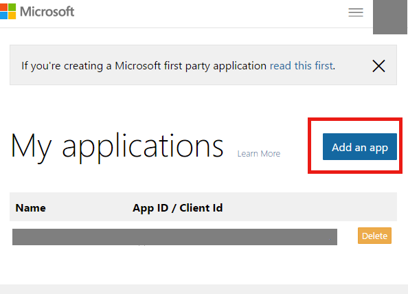
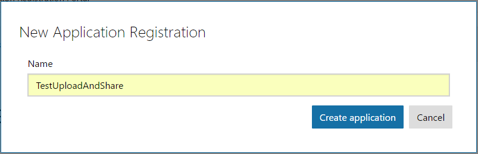
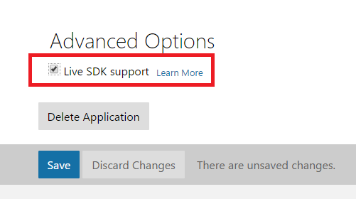
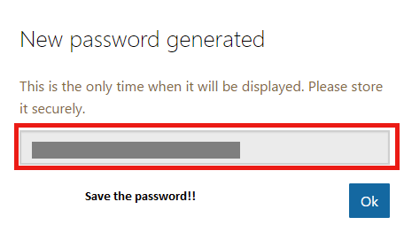
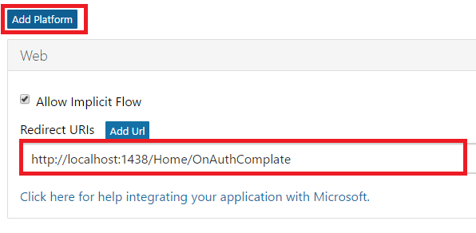
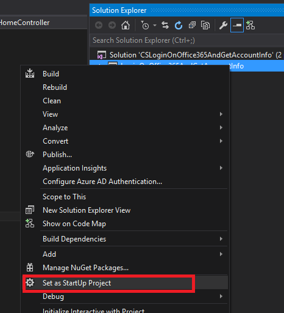
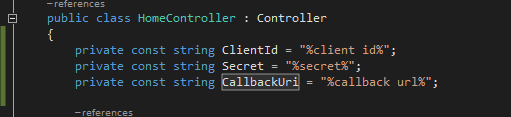
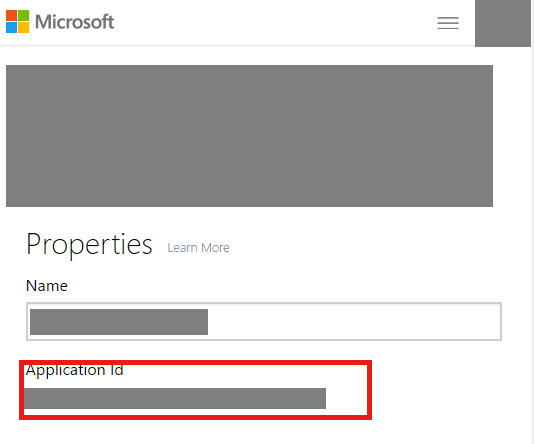
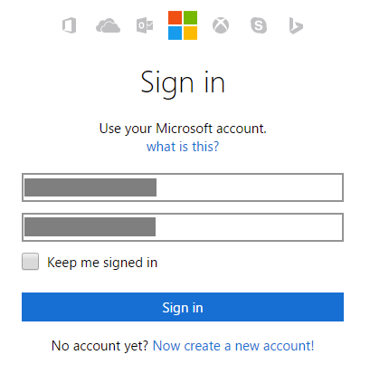
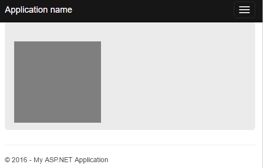

# How to login on office 365 and get account info with REST using web application
## Requires
- Visual Studio 2015
## License
- Apache License, Version 2.0
## Technologies
- REST
- Office 365
## Topics
- C#
- REST
- Office 365
## Updated
- 03/12/2017
## Description

<strong>&nbsp;</strong><em>&nbsp;</em>

How to log in office 365 and get account info with REST API using web application

Introduction

This sample demonstrates how to log in office 365 and get the account information with REST using web application.

When users visit the website, they will be redirected to office 365 to finish the authentication. Then, they will go forward to our website with a code to request REST API for a token. At last, they will get the user account information and picture
 with the token.

Sample prerequisites

&bull;&nbsp;Register the application for your OneDrive,&nbsp;while the related&nbsp;details will be&nbsp;described in&nbsp;the&nbsp;next section

&bull;&nbsp;Go to the
<a href="https://apps.dev.microsoft.com/Disambiguation?ru=https%3a%2f%2fapps.dev.microsoft.com%2f" style="text-decoration:none">Register and manage apps</a> to register you application.

&bull;&nbsp;When prompted, sign in with you Microsoft account credentials.

&bull;&nbsp;Find
My applications and click 
Add an app.

&bull;&nbsp;Enter your app&rsquo;s name and click
Create application.

&nbsp;

&bull;&nbsp;Scroll to the page bottom and tick in the
Live ADK support box.

&bull;&nbsp;Generate the new password below the
Application Secrets, and save it for later use.

&bull;&nbsp;Create a web app below the Platforms header, and then set the Redirect URIs to you web app callback address such as
<a href="http://localhost:1438/Home/OnAuthComplate" style="text-decoration:none">http://localhost:1438/Home/OnAuthComplate</a>.

&bull;&nbsp;Click
Save at the very bottom of the page.

Building the sample

&bull;&nbsp;Double-Click
CSLoginOnOffice365AndGetAccountInfo.sln file to open this sample solution using Microsoft Visual Studio 2015 which has the web develop component installed.

&bull;&nbsp;Set project LoginOnOffice365AndGetAccountInfo as startup project.

&bull;&nbsp;Config the following parameter in:

&nbsp;Project: LoginOnOffice365AndGetAccountInfo/Controllers/HomeController.cs

About the ClientId you can find it here:

Secret is the key for the application where you can set password only once after it shows up.

For CallbackUri, you can find it here:

Running the sample

&bull;&nbsp;Open the sample solution using Visual Studio, then press
F5 key or select Debug -&gt; Start Debugging in menu.

&bull;&nbsp;When the site is started, you can see this:

After you have filled all the fields and clicked the Sign in button, you can see this:

&nbsp;

Using the code

The Office 365 Rest API access base class

&nbsp;

C#

Edit|Remove

csharp
<pre class="hidden">public abstract class OAuthAccessBase
{
    public string ClientId { get; }
    public string ClientSecret { get; }
 
    //when user complated the authenticate, will retrun this code
    public string AccessCode { get; protected set; }
    //use this token to request Office 365 API
    public string AccessToken { get; protected set; }
    //when accessToken had expires, can use this token to refresh accessToken
    public string RefreshToken { get; protected set; }
 
    public string UserId { get; protected set; }
    public DateTime RefreshTime { get; protected set; }
    public TimeSpan RefreshTimeSpan { get; protected set; }
 
    public string RedirectURI { get; set; }
 
    public OAuthAccessBase(string clientId, string clientSecret, string redirectURI)
    {
        this.ClientId = clientId;
        this.ClientSecret = clientSecret;
        this.RedirectURI = redirectURI;
    }
 
    //retrun authenticate url for redirect
    public string GetLoginUrl(string scopes)
    {
        string urlStr =
            &quot;https://login.live.com/oauth20_authorize.srf&quot; &#43;
            &quot;?client_id=&quot; &#43; ClientId &#43;
            &quot;&amp;scope=offline_access &quot; &#43; scopes &#43;
            &quot;&amp;response_type=code&quot; &#43;
            &quot;&amp;redirect_uri=&quot; &#43; RedirectURI;
 
        return urlStr.ToString();
    }
 
    //get token use code
    public async Task RedeemTokensAsync(string code)
    {
        this.AccessCode = code;
 
        string url = &quot;https://login.live.com/oauth20_token.srf&quot;;
        string paramStr =
            &quot;client_id=&quot; &#43; ClientId &#43;
            &quot;&amp;redirect_uri=&quot; &#43; RedirectURI &#43;
            &quot;&amp;client_secret=&quot; &#43; ClientSecret &#43;
            &quot;&amp;code=&quot; &#43; AccessCode &#43;
            &quot;&amp;grant_type=authorization_code&quot;;
 
        APIRequest request = GetRequest(url, HTTPMethod.Post, paramStr.ToString());
        string response = await request.GetResponseToStringAsync();
 
        JObject jo = JObject.Parse(response);
 
        this.RefreshToken = jo.SelectToken(&quot;refresh_token&quot;).Value&lt;string&gt;();
        this.AccessToken = jo.SelectToken(&quot;access_token&quot;).Value&lt;string&gt;();
        this.UserId = jo.SelectToken(&quot;user_id&quot;).Value&lt;string&gt;();
        this.RefreshTimeSpan = new TimeSpan(0, 0, Convert.ToInt32(jo.SelectToken(&quot;expires_in&quot;).Value&lt;string&gt;()));
        this.RefreshTime = DateTime.Now;
    }
 
 
    protected async Task&lt;string&gt; AuthRequestToStringAsync(string url, HTTPMethod httpMethod = HTTPMethod.Get, string data = &quot;&quot;)
    {
        await RefreshTokenIfNeededAsync();
 
        APIRequest request = GetRequest(url, httpMethod, data);
        return await request.GetResponseToStringAsync();
    }
 
    protected async Task&lt;byte[]&gt; AuthRequestToBytesAsync(string url, HTTPMethod httpMethod = HTTPMethod.Get, string data = &quot;&quot;)
    {
        await RefreshTokenIfNeededAsync();
 
        APIRequest request = GetRequest(url, httpMethod, data);
        return await request.GetResponseTobytesAsync();
    }
 
    private APIRequest GetRequest(string url, HTTPMethod httpMethod = HTTPMethod.Get, string data = &quot;&quot;)
    {
        APIRequest apiRequest = new APIRequest(url, httpMethod, data);
 
        if (!string.IsNullOrEmpty(AccessToken))
        {
            apiRequest.Request.Headers.Add(&quot;Authorization&quot;, &quot;bearer &quot; &#43; AccessToken);
        }
 
        return apiRequest;
    }
 
    private async Task RefreshTokenIfNeededAsync()
    {
        if (RefreshTimeSpan == null || DateTime.Now - RefreshTime &gt; RefreshTimeSpan)
        {
            string url = &quot;https://login.live.com/oauth20_token.srf&quot;;
            string paramStr = &quot;client_id=&quot; &#43; ClientId &#43;
                &quot;&amp;redirect_uri=&quot; &#43; RedirectURI &#43;
                &quot;&amp;client_secret=&quot; &#43; ClientSecret &#43;
                &quot;&amp;refresh_token=&quot; &#43; RefreshToken &#43;
                &quot;&amp;grant_type=refresh_token&quot;;
 
            APIRequest request = GetRequest(url, HTTPMethod.Post, paramStr.ToString());
            string response = await request.GetResponseToStringAsync();
 
            JObject jo = JObject.Parse(response);
 
            this.RefreshToken = jo.SelectToken(&quot;refresh_token&quot;).Value&lt;string&gt;();
            this.AccessToken = jo.SelectToken(&quot;access_token&quot;).Value&lt;string&gt;();
            this.UserId = jo.SelectToken(&quot;user_id&quot;).Value&lt;string&gt;();
            this.RefreshTimeSpan = new TimeSpan(0, 0,Convert.ToInt32(jo.SelectToken(&quot;expires_in&quot;).Value&lt;string&gt;()));
            this.RefreshTime = DateTime.Now;
        }
    }
}</pre>

<pre class="csharp">public&nbsp;abstract&nbsp;class&nbsp;OAuthAccessBase&nbsp;
{&nbsp;
&nbsp;&nbsp;&nbsp;&nbsp;public&nbsp;string&nbsp;ClientId&nbsp;{&nbsp;get;&nbsp;}&nbsp;
&nbsp;&nbsp;&nbsp;&nbsp;public&nbsp;string&nbsp;ClientSecret&nbsp;{&nbsp;get;&nbsp;}&nbsp;
&nbsp;&nbsp;
&nbsp;&nbsp;&nbsp;&nbsp;//when&nbsp;user&nbsp;complated&nbsp;the&nbsp;authenticate,&nbsp;will&nbsp;retrun&nbsp;this&nbsp;code&nbsp;
&nbsp;&nbsp;&nbsp;&nbsp;public&nbsp;string&nbsp;AccessCode&nbsp;{&nbsp;get;&nbsp;protected&nbsp;set;&nbsp;}&nbsp;
&nbsp;&nbsp;&nbsp;&nbsp;//use&nbsp;this&nbsp;token&nbsp;to&nbsp;request&nbsp;Office&nbsp;365&nbsp;API&nbsp;
&nbsp;&nbsp;&nbsp;&nbsp;public&nbsp;string&nbsp;AccessToken&nbsp;{&nbsp;get;&nbsp;protected&nbsp;set;&nbsp;}&nbsp;
&nbsp;&nbsp;&nbsp;&nbsp;//when&nbsp;accessToken&nbsp;had&nbsp;expires,&nbsp;can&nbsp;use&nbsp;this&nbsp;token&nbsp;to&nbsp;refresh&nbsp;accessToken&nbsp;
&nbsp;&nbsp;&nbsp;&nbsp;public&nbsp;string&nbsp;RefreshToken&nbsp;{&nbsp;get;&nbsp;protected&nbsp;set;&nbsp;}&nbsp;
&nbsp;&nbsp;
&nbsp;&nbsp;&nbsp;&nbsp;public&nbsp;string&nbsp;UserId&nbsp;{&nbsp;get;&nbsp;protected&nbsp;set;&nbsp;}&nbsp;
&nbsp;&nbsp;&nbsp;&nbsp;public&nbsp;DateTime&nbsp;RefreshTime&nbsp;{&nbsp;get;&nbsp;protected&nbsp;set;&nbsp;}&nbsp;
&nbsp;&nbsp;&nbsp;&nbsp;public&nbsp;TimeSpan&nbsp;RefreshTimeSpan&nbsp;{&nbsp;get;&nbsp;protected&nbsp;set;&nbsp;}&nbsp;
&nbsp;&nbsp;
&nbsp;&nbsp;&nbsp;&nbsp;public&nbsp;string&nbsp;RedirectURI&nbsp;{&nbsp;get;&nbsp;set;&nbsp;}&nbsp;
&nbsp;&nbsp;
&nbsp;&nbsp;&nbsp;&nbsp;public&nbsp;OAuthAccessBase(string&nbsp;clientId,&nbsp;string&nbsp;clientSecret,&nbsp;string&nbsp;redirectURI)&nbsp;
&nbsp;&nbsp;&nbsp;&nbsp;{&nbsp;
&nbsp;&nbsp;&nbsp;&nbsp;&nbsp;&nbsp;&nbsp;&nbsp;this.ClientId&nbsp;=&nbsp;clientId;&nbsp;
&nbsp;&nbsp;&nbsp;&nbsp;&nbsp;&nbsp;&nbsp;&nbsp;this.ClientSecret&nbsp;=&nbsp;clientSecret;&nbsp;
&nbsp;&nbsp;&nbsp;&nbsp;&nbsp;&nbsp;&nbsp;&nbsp;this.RedirectURI&nbsp;=&nbsp;redirectURI;&nbsp;
&nbsp;&nbsp;&nbsp;&nbsp;}&nbsp;
&nbsp;&nbsp;
&nbsp;&nbsp;&nbsp;&nbsp;//retrun&nbsp;authenticate&nbsp;url&nbsp;for&nbsp;redirect&nbsp;
&nbsp;&nbsp;&nbsp;&nbsp;public&nbsp;string&nbsp;GetLoginUrl(string&nbsp;scopes)&nbsp;
&nbsp;&nbsp;&nbsp;&nbsp;{&nbsp;
&nbsp;&nbsp;&nbsp;&nbsp;&nbsp;&nbsp;&nbsp;&nbsp;string&nbsp;urlStr&nbsp;=&nbsp;
&nbsp;&nbsp;&nbsp;&nbsp;&nbsp;&nbsp;&nbsp;&nbsp;&nbsp;&nbsp;&nbsp;&nbsp;&quot;https://login.live.com/oauth20_authorize.srf&quot;&nbsp;&#43;&nbsp;
&nbsp;&nbsp;&nbsp;&nbsp;&nbsp;&nbsp;&nbsp;&nbsp;&nbsp;&nbsp;&nbsp;&nbsp;&quot;?client_id=&quot;&nbsp;&#43;&nbsp;ClientId&nbsp;&#43;&nbsp;
&nbsp;&nbsp;&nbsp;&nbsp;&nbsp;&nbsp;&nbsp;&nbsp;&nbsp;&nbsp;&nbsp;&nbsp;&quot;&amp;scope=offline_access&nbsp;&quot;&nbsp;&#43;&nbsp;scopes&nbsp;&#43;&nbsp;
&nbsp;&nbsp;&nbsp;&nbsp;&nbsp;&nbsp;&nbsp;&nbsp;&nbsp;&nbsp;&nbsp;&nbsp;&quot;&amp;response_type=code&quot;&nbsp;&#43;&nbsp;
&nbsp;&nbsp;&nbsp;&nbsp;&nbsp;&nbsp;&nbsp;&nbsp;&nbsp;&nbsp;&nbsp;&nbsp;&quot;&amp;redirect_uri=&quot;&nbsp;&#43;&nbsp;RedirectURI;&nbsp;
&nbsp;&nbsp;
&nbsp;&nbsp;&nbsp;&nbsp;&nbsp;&nbsp;&nbsp;&nbsp;return&nbsp;urlStr.ToString();&nbsp;
&nbsp;&nbsp;&nbsp;&nbsp;}&nbsp;
&nbsp;&nbsp;
&nbsp;&nbsp;&nbsp;&nbsp;//get&nbsp;token&nbsp;use&nbsp;code&nbsp;
&nbsp;&nbsp;&nbsp;&nbsp;public&nbsp;async&nbsp;Task&nbsp;RedeemTokensAsync(string&nbsp;code)&nbsp;
&nbsp;&nbsp;&nbsp;&nbsp;{&nbsp;
&nbsp;&nbsp;&nbsp;&nbsp;&nbsp;&nbsp;&nbsp;&nbsp;this.AccessCode&nbsp;=&nbsp;code;&nbsp;
&nbsp;&nbsp;
&nbsp;&nbsp;&nbsp;&nbsp;&nbsp;&nbsp;&nbsp;&nbsp;string&nbsp;url&nbsp;=&nbsp;&quot;https://login.live.com/oauth20_token.srf&quot;;&nbsp;
&nbsp;&nbsp;&nbsp;&nbsp;&nbsp;&nbsp;&nbsp;&nbsp;string&nbsp;paramStr&nbsp;=&nbsp;
&nbsp;&nbsp;&nbsp;&nbsp;&nbsp;&nbsp;&nbsp;&nbsp;&nbsp;&nbsp;&nbsp;&nbsp;&quot;client_id=&quot;&nbsp;&#43;&nbsp;ClientId&nbsp;&#43;&nbsp;
&nbsp;&nbsp;&nbsp;&nbsp;&nbsp;&nbsp;&nbsp;&nbsp;&nbsp;&nbsp;&nbsp;&nbsp;&quot;&amp;redirect_uri=&quot;&nbsp;&#43;&nbsp;RedirectURI&nbsp;&#43;&nbsp;
&nbsp;&nbsp;&nbsp;&nbsp;&nbsp;&nbsp;&nbsp;&nbsp;&nbsp;&nbsp;&nbsp;&nbsp;&quot;&amp;client_secret=&quot;&nbsp;&#43;&nbsp;ClientSecret&nbsp;&#43;&nbsp;
&nbsp;&nbsp;&nbsp;&nbsp;&nbsp;&nbsp;&nbsp;&nbsp;&nbsp;&nbsp;&nbsp;&nbsp;&quot;&amp;code=&quot;&nbsp;&#43;&nbsp;AccessCode&nbsp;&#43;&nbsp;
&nbsp;&nbsp;&nbsp;&nbsp;&nbsp;&nbsp;&nbsp;&nbsp;&nbsp;&nbsp;&nbsp;&nbsp;&quot;&amp;grant_type=authorization_code&quot;;&nbsp;
&nbsp;&nbsp;
&nbsp;&nbsp;&nbsp;&nbsp;&nbsp;&nbsp;&nbsp;&nbsp;APIRequest&nbsp;request&nbsp;=&nbsp;GetRequest(url,&nbsp;HTTPMethod.Post,&nbsp;paramStr.ToString());&nbsp;
&nbsp;&nbsp;&nbsp;&nbsp;&nbsp;&nbsp;&nbsp;&nbsp;string&nbsp;response&nbsp;=&nbsp;await&nbsp;request.GetResponseToStringAsync();&nbsp;
&nbsp;&nbsp;
&nbsp;&nbsp;&nbsp;&nbsp;&nbsp;&nbsp;&nbsp;&nbsp;JObject&nbsp;jo&nbsp;=&nbsp;JObject.Parse(response);&nbsp;
&nbsp;&nbsp;
&nbsp;&nbsp;&nbsp;&nbsp;&nbsp;&nbsp;&nbsp;&nbsp;this.RefreshToken&nbsp;=&nbsp;jo.SelectToken(&quot;refresh_token&quot;).Value&lt;string&gt;();&nbsp;
&nbsp;&nbsp;&nbsp;&nbsp;&nbsp;&nbsp;&nbsp;&nbsp;this.AccessToken&nbsp;=&nbsp;jo.SelectToken(&quot;access_token&quot;).Value&lt;string&gt;();&nbsp;
&nbsp;&nbsp;&nbsp;&nbsp;&nbsp;&nbsp;&nbsp;&nbsp;this.UserId&nbsp;=&nbsp;jo.SelectToken(&quot;user_id&quot;).Value&lt;string&gt;();&nbsp;
&nbsp;&nbsp;&nbsp;&nbsp;&nbsp;&nbsp;&nbsp;&nbsp;this.RefreshTimeSpan&nbsp;=&nbsp;new&nbsp;TimeSpan(0,&nbsp;0,&nbsp;Convert.ToInt32(jo.SelectToken(&quot;expires_in&quot;).Value&lt;string&gt;()));&nbsp;
&nbsp;&nbsp;&nbsp;&nbsp;&nbsp;&nbsp;&nbsp;&nbsp;this.RefreshTime&nbsp;=&nbsp;DateTime.Now;&nbsp;
&nbsp;&nbsp;&nbsp;&nbsp;}&nbsp;
&nbsp;&nbsp;
&nbsp;&nbsp;
&nbsp;&nbsp;&nbsp;&nbsp;protected&nbsp;async&nbsp;Task&lt;string&gt;&nbsp;AuthRequestToStringAsync(string&nbsp;url,&nbsp;HTTPMethod&nbsp;httpMethod&nbsp;=&nbsp;HTTPMethod.Get,&nbsp;string&nbsp;data&nbsp;=&nbsp;&quot;&quot;)&nbsp;
&nbsp;&nbsp;&nbsp;&nbsp;{&nbsp;
&nbsp;&nbsp;&nbsp;&nbsp;&nbsp;&nbsp;&nbsp;&nbsp;await&nbsp;RefreshTokenIfNeededAsync();&nbsp;
&nbsp;&nbsp;
&nbsp;&nbsp;&nbsp;&nbsp;&nbsp;&nbsp;&nbsp;&nbsp;APIRequest&nbsp;request&nbsp;=&nbsp;GetRequest(url,&nbsp;httpMethod,&nbsp;data);&nbsp;
&nbsp;&nbsp;&nbsp;&nbsp;&nbsp;&nbsp;&nbsp;&nbsp;return&nbsp;await&nbsp;request.GetResponseToStringAsync();&nbsp;
&nbsp;&nbsp;&nbsp;&nbsp;}&nbsp;
&nbsp;&nbsp;
&nbsp;&nbsp;&nbsp;&nbsp;protected&nbsp;async&nbsp;Task&lt;byte[]&gt;&nbsp;AuthRequestToBytesAsync(string&nbsp;url,&nbsp;HTTPMethod&nbsp;httpMethod&nbsp;=&nbsp;HTTPMethod.Get,&nbsp;string&nbsp;data&nbsp;=&nbsp;&quot;&quot;)&nbsp;
&nbsp;&nbsp;&nbsp;&nbsp;{&nbsp;
&nbsp;&nbsp;&nbsp;&nbsp;&nbsp;&nbsp;&nbsp;&nbsp;await&nbsp;RefreshTokenIfNeededAsync();&nbsp;
&nbsp;&nbsp;
&nbsp;&nbsp;&nbsp;&nbsp;&nbsp;&nbsp;&nbsp;&nbsp;APIRequest&nbsp;request&nbsp;=&nbsp;GetRequest(url,&nbsp;httpMethod,&nbsp;data);&nbsp;
&nbsp;&nbsp;&nbsp;&nbsp;&nbsp;&nbsp;&nbsp;&nbsp;return&nbsp;await&nbsp;request.GetResponseTobytesAsync();&nbsp;
&nbsp;&nbsp;&nbsp;&nbsp;}&nbsp;
&nbsp;&nbsp;
&nbsp;&nbsp;&nbsp;&nbsp;private&nbsp;APIRequest&nbsp;GetRequest(string&nbsp;url,&nbsp;HTTPMethod&nbsp;httpMethod&nbsp;=&nbsp;HTTPMethod.Get,&nbsp;string&nbsp;data&nbsp;=&nbsp;&quot;&quot;)&nbsp;
&nbsp;&nbsp;&nbsp;&nbsp;{&nbsp;
&nbsp;&nbsp;&nbsp;&nbsp;&nbsp;&nbsp;&nbsp;&nbsp;APIRequest&nbsp;apiRequest&nbsp;=&nbsp;new&nbsp;APIRequest(url,&nbsp;httpMethod,&nbsp;data);&nbsp;
&nbsp;&nbsp;
&nbsp;&nbsp;&nbsp;&nbsp;&nbsp;&nbsp;&nbsp;&nbsp;if&nbsp;(!string.IsNullOrEmpty(AccessToken))&nbsp;
&nbsp;&nbsp;&nbsp;&nbsp;&nbsp;&nbsp;&nbsp;&nbsp;{&nbsp;
&nbsp;&nbsp;&nbsp;&nbsp;&nbsp;&nbsp;&nbsp;&nbsp;&nbsp;&nbsp;&nbsp;&nbsp;apiRequest.Request.Headers.Add(&quot;Authorization&quot;,&nbsp;&quot;bearer&nbsp;&quot;&nbsp;&#43;&nbsp;AccessToken);&nbsp;
&nbsp;&nbsp;&nbsp;&nbsp;&nbsp;&nbsp;&nbsp;&nbsp;}&nbsp;
&nbsp;&nbsp;
&nbsp;&nbsp;&nbsp;&nbsp;&nbsp;&nbsp;&nbsp;&nbsp;return&nbsp;apiRequest;&nbsp;
&nbsp;&nbsp;&nbsp;&nbsp;}&nbsp;
&nbsp;&nbsp;
&nbsp;&nbsp;&nbsp;&nbsp;private&nbsp;async&nbsp;Task&nbsp;RefreshTokenIfNeededAsync()&nbsp;
&nbsp;&nbsp;&nbsp;&nbsp;{&nbsp;
&nbsp;&nbsp;&nbsp;&nbsp;&nbsp;&nbsp;&nbsp;&nbsp;if&nbsp;(RefreshTimeSpan&nbsp;==&nbsp;null&nbsp;||&nbsp;DateTime.Now&nbsp;-&nbsp;RefreshTime&nbsp;&gt;&nbsp;RefreshTimeSpan)&nbsp;
&nbsp;&nbsp;&nbsp;&nbsp;&nbsp;&nbsp;&nbsp;&nbsp;{&nbsp;
&nbsp;&nbsp;&nbsp;&nbsp;&nbsp;&nbsp;&nbsp;&nbsp;&nbsp;&nbsp;&nbsp;&nbsp;string&nbsp;url&nbsp;=&nbsp;&quot;https://login.live.com/oauth20_token.srf&quot;;&nbsp;
&nbsp;&nbsp;&nbsp;&nbsp;&nbsp;&nbsp;&nbsp;&nbsp;&nbsp;&nbsp;&nbsp;&nbsp;string&nbsp;paramStr&nbsp;=&nbsp;&quot;client_id=&quot;&nbsp;&#43;&nbsp;ClientId&nbsp;&#43;&nbsp;
&nbsp;&nbsp;&nbsp;&nbsp;&nbsp;&nbsp;&nbsp;&nbsp;&nbsp;&nbsp;&nbsp;&nbsp;&nbsp;&nbsp;&nbsp;&nbsp;&quot;&amp;redirect_uri=&quot;&nbsp;&#43;&nbsp;RedirectURI&nbsp;&#43;&nbsp;
&nbsp;&nbsp;&nbsp;&nbsp;&nbsp;&nbsp;&nbsp;&nbsp;&nbsp;&nbsp;&nbsp;&nbsp;&nbsp;&nbsp;&nbsp;&nbsp;&quot;&amp;client_secret=&quot;&nbsp;&#43;&nbsp;ClientSecret&nbsp;&#43;&nbsp;
&nbsp;&nbsp;&nbsp;&nbsp;&nbsp;&nbsp;&nbsp;&nbsp;&nbsp;&nbsp;&nbsp;&nbsp;&nbsp;&nbsp;&nbsp;&nbsp;&quot;&amp;refresh_token=&quot;&nbsp;&#43;&nbsp;RefreshToken&nbsp;&#43;&nbsp;
&nbsp;&nbsp;&nbsp;&nbsp;&nbsp;&nbsp;&nbsp;&nbsp;&nbsp;&nbsp;&nbsp;&nbsp;&nbsp;&nbsp;&nbsp;&nbsp;&quot;&amp;grant_type=refresh_token&quot;;&nbsp;
&nbsp;&nbsp;
&nbsp;&nbsp;&nbsp;&nbsp;&nbsp;&nbsp;&nbsp;&nbsp;&nbsp;&nbsp;&nbsp;&nbsp;APIRequest&nbsp;request&nbsp;=&nbsp;GetRequest(url,&nbsp;HTTPMethod.Post,&nbsp;paramStr.ToString());&nbsp;
&nbsp;&nbsp;&nbsp;&nbsp;&nbsp;&nbsp;&nbsp;&nbsp;&nbsp;&nbsp;&nbsp;&nbsp;string&nbsp;response&nbsp;=&nbsp;await&nbsp;request.GetResponseToStringAsync();&nbsp;
&nbsp;&nbsp;
&nbsp;&nbsp;&nbsp;&nbsp;&nbsp;&nbsp;&nbsp;&nbsp;&nbsp;&nbsp;&nbsp;&nbsp;JObject&nbsp;jo&nbsp;=&nbsp;JObject.Parse(response);&nbsp;
&nbsp;&nbsp;
&nbsp;&nbsp;&nbsp;&nbsp;&nbsp;&nbsp;&nbsp;&nbsp;&nbsp;&nbsp;&nbsp;&nbsp;this.RefreshToken&nbsp;=&nbsp;jo.SelectToken(&quot;refresh_token&quot;).Value&lt;string&gt;();&nbsp;
&nbsp;&nbsp;&nbsp;&nbsp;&nbsp;&nbsp;&nbsp;&nbsp;&nbsp;&nbsp;&nbsp;&nbsp;this.AccessToken&nbsp;=&nbsp;jo.SelectToken(&quot;access_token&quot;).Value&lt;string&gt;();&nbsp;
&nbsp;&nbsp;&nbsp;&nbsp;&nbsp;&nbsp;&nbsp;&nbsp;&nbsp;&nbsp;&nbsp;&nbsp;this.UserId&nbsp;=&nbsp;jo.SelectToken(&quot;user_id&quot;).Value&lt;string&gt;();&nbsp;
&nbsp;&nbsp;&nbsp;&nbsp;&nbsp;&nbsp;&nbsp;&nbsp;&nbsp;&nbsp;&nbsp;&nbsp;this.RefreshTimeSpan&nbsp;=&nbsp;new&nbsp;TimeSpan(0,&nbsp;0,Convert.ToInt32(jo.SelectToken(&quot;expires_in&quot;).Value&lt;string&gt;()));&nbsp;
&nbsp;&nbsp;&nbsp;&nbsp;&nbsp;&nbsp;&nbsp;&nbsp;&nbsp;&nbsp;&nbsp;&nbsp;this.RefreshTime&nbsp;=&nbsp;DateTime.Now;&nbsp;
&nbsp;&nbsp;&nbsp;&nbsp;&nbsp;&nbsp;&nbsp;&nbsp;}&nbsp;
&nbsp;&nbsp;&nbsp;&nbsp;}&nbsp;
}</pre>

&nbsp;

&nbsp;

The Office 365 Rest API access class:

&nbsp;

C#

Edit|Remove

csharp
<pre class="hidden">public class OAuthAccess : OAuthAccessBase
{
    public OAuthAccess(string clientId, string clientSecret, string redirectURI) : base(clientId, clientSecret, redirectURI)
    {
    }
 
    public async Task&lt;Dictionary&lt;string, string&gt;&gt; GetAccountInfoAsync()
    {
        string response = await AuthRequestToStringAsync(&quot;https://apis.live.net/v5.0/me?suppress_response_codes=true&amp;suppress_redirects=true&quot;);
 
        JObject jo = JObject.Parse(response);
 
        return jo.ToObject&lt;Dictionary&lt;string, string&gt;&gt;();
    }
 
    public async Task&lt;byte[]&gt; GetAccountPicture()
    {
        byte[] response = await AuthRequestToBytesAsync(&quot;https://apis.live.net/v5.0/me/picture&quot;);
 
        return response;
    }
}</pre>

<pre class="csharp">public&nbsp;class&nbsp;OAuthAccess&nbsp;:&nbsp;OAuthAccessBase&nbsp;
{&nbsp;
&nbsp;&nbsp;&nbsp;&nbsp;public&nbsp;OAuthAccess(string&nbsp;clientId,&nbsp;string&nbsp;clientSecret,&nbsp;string&nbsp;redirectURI)&nbsp;:&nbsp;base(clientId,&nbsp;clientSecret,&nbsp;redirectURI)&nbsp;
&nbsp;&nbsp;&nbsp;&nbsp;{&nbsp;
&nbsp;&nbsp;&nbsp;&nbsp;}&nbsp;
&nbsp;&nbsp;
&nbsp;&nbsp;&nbsp;&nbsp;public&nbsp;async&nbsp;Task&lt;Dictionary&lt;string,&nbsp;string&gt;&gt;&nbsp;GetAccountInfoAsync()&nbsp;
&nbsp;&nbsp;&nbsp;&nbsp;{&nbsp;
&nbsp;&nbsp;&nbsp;&nbsp;&nbsp;&nbsp;&nbsp;&nbsp;string&nbsp;response&nbsp;=&nbsp;await&nbsp;AuthRequestToStringAsync(&quot;https://apis.live.net/v5.0/me?suppress_response_codes=true&amp;suppress_redirects=true&quot;);&nbsp;
&nbsp;&nbsp;
&nbsp;&nbsp;&nbsp;&nbsp;&nbsp;&nbsp;&nbsp;&nbsp;JObject&nbsp;jo&nbsp;=&nbsp;JObject.Parse(response);&nbsp;
&nbsp;&nbsp;
&nbsp;&nbsp;&nbsp;&nbsp;&nbsp;&nbsp;&nbsp;&nbsp;return&nbsp;jo.ToObject&lt;Dictionary&lt;string,&nbsp;string&gt;&gt;();&nbsp;
&nbsp;&nbsp;&nbsp;&nbsp;}&nbsp;
&nbsp;&nbsp;
&nbsp;&nbsp;&nbsp;&nbsp;public&nbsp;async&nbsp;Task&lt;byte[]&gt;&nbsp;GetAccountPicture()&nbsp;
&nbsp;&nbsp;&nbsp;&nbsp;{&nbsp;
&nbsp;&nbsp;&nbsp;&nbsp;&nbsp;&nbsp;&nbsp;&nbsp;byte[]&nbsp;response&nbsp;=&nbsp;await&nbsp;AuthRequestToBytesAsync(&quot;https://apis.live.net/v5.0/me/picture&quot;);&nbsp;
&nbsp;&nbsp;
&nbsp;&nbsp;&nbsp;&nbsp;&nbsp;&nbsp;&nbsp;&nbsp;return&nbsp;response;&nbsp;
&nbsp;&nbsp;&nbsp;&nbsp;}&nbsp;
}</pre>

&nbsp;

&nbsp;

The Controller class:

&nbsp;

C#

Edit|Remove

csharp
<pre class="hidden">public class HomeController : Controller
{
    private const string ClientId = &quot;cdc1dc9d-159f-4b5f-a2a6-21a30b0b45ae&quot;;
    private const string Secret = &quot;xChUsnbQthVgYN5VoAjEcYy&quot;;
    private const string CallbackUri = &quot;http://localhost:1438/Home/OnAuthComplate&quot;;
 
    public OAuthAccess OfficeAccess
    {
        get
        {
            var officeAccess = Session[&quot;OfficeAccess&quot;];
            if (officeAccess == null)
            {
                officeAccess = new OAuthAccess(ClientId, Secret, CallbackUri);
                Session[&quot;OfficeAccess&quot;] = officeAccess;
            }
            return officeAccess as OAuthAccess;
        }
    }
 
    public async Task&lt;ActionResult&gt; Index()
    {
        //if user is not login, redirect to office 365 for authenticate
        if (string.IsNullOrEmpty(OfficeAccess.AccessCode))
        {
            string url = OfficeAccess.GetLoginUrl(&quot;onedrive.appfolder&quot;);
 
            return new RedirectResult(url);
        }
 
        //when user is authenticated get user account info
        ViewBag.UserInfo = await OfficeAccess.GetAccountInfoAsync();
        return View();
    }
 
    //when user complate authenticate, will be call back this url with a code
    public async Task&lt;RedirectResult&gt; OnAuthComplate(string code)
    {
        //get token by the code
        await OfficeAccess.RedeemTokensAsync(code);
 
        return new RedirectResult(&quot;Index&quot;);
    }
 
    //download user picture
    public async Task&lt;ActionResult&gt; UserPicture()
    {
        var btyes = await OfficeAccess.GetAccountPicture();
        return base.File(btyes, &quot;image/jpeg&quot;);
    }
}</pre>

<pre class="csharp">public&nbsp;class&nbsp;HomeController&nbsp;:&nbsp;Controller&nbsp;
{&nbsp;
&nbsp;&nbsp;&nbsp;&nbsp;private&nbsp;const&nbsp;string&nbsp;ClientId&nbsp;=&nbsp;&quot;cdc1dc9d-159f-4b5f-a2a6-21a30b0b45ae&quot;;&nbsp;
&nbsp;&nbsp;&nbsp;&nbsp;private&nbsp;const&nbsp;string&nbsp;Secret&nbsp;=&nbsp;&quot;xChUsnbQthVgYN5VoAjEcYy&quot;;&nbsp;
&nbsp;&nbsp;&nbsp;&nbsp;private&nbsp;const&nbsp;string&nbsp;CallbackUri&nbsp;=&nbsp;&quot;http://localhost:1438/Home/OnAuthComplate&quot;;&nbsp;
&nbsp;&nbsp;
&nbsp;&nbsp;&nbsp;&nbsp;public&nbsp;OAuthAccess&nbsp;OfficeAccess&nbsp;
&nbsp;&nbsp;&nbsp;&nbsp;{&nbsp;
&nbsp;&nbsp;&nbsp;&nbsp;&nbsp;&nbsp;&nbsp;&nbsp;get&nbsp;
&nbsp;&nbsp;&nbsp;&nbsp;&nbsp;&nbsp;&nbsp;&nbsp;{&nbsp;
&nbsp;&nbsp;&nbsp;&nbsp;&nbsp;&nbsp;&nbsp;&nbsp;&nbsp;&nbsp;&nbsp;&nbsp;var&nbsp;officeAccess&nbsp;=&nbsp;Session[&quot;OfficeAccess&quot;];&nbsp;
&nbsp;&nbsp;&nbsp;&nbsp;&nbsp;&nbsp;&nbsp;&nbsp;&nbsp;&nbsp;&nbsp;&nbsp;if&nbsp;(officeAccess&nbsp;==&nbsp;null)&nbsp;
&nbsp;&nbsp;&nbsp;&nbsp;&nbsp;&nbsp;&nbsp;&nbsp;&nbsp;&nbsp;&nbsp;&nbsp;{&nbsp;
&nbsp;&nbsp;&nbsp;&nbsp;&nbsp;&nbsp;&nbsp;&nbsp;&nbsp;&nbsp;&nbsp;&nbsp;&nbsp;&nbsp;&nbsp;&nbsp;officeAccess&nbsp;=&nbsp;new&nbsp;OAuthAccess(ClientId,&nbsp;Secret,&nbsp;CallbackUri);&nbsp;
&nbsp;&nbsp;&nbsp;&nbsp;&nbsp;&nbsp;&nbsp;&nbsp;&nbsp;&nbsp;&nbsp;&nbsp;&nbsp;&nbsp;&nbsp;&nbsp;Session[&quot;OfficeAccess&quot;]&nbsp;=&nbsp;officeAccess;&nbsp;
&nbsp;&nbsp;&nbsp;&nbsp;&nbsp;&nbsp;&nbsp;&nbsp;&nbsp;&nbsp;&nbsp;&nbsp;}&nbsp;
&nbsp;&nbsp;&nbsp;&nbsp;&nbsp;&nbsp;&nbsp;&nbsp;&nbsp;&nbsp;&nbsp;&nbsp;return&nbsp;officeAccess&nbsp;as&nbsp;OAuthAccess;&nbsp;
&nbsp;&nbsp;&nbsp;&nbsp;&nbsp;&nbsp;&nbsp;&nbsp;}&nbsp;
&nbsp;&nbsp;&nbsp;&nbsp;}&nbsp;
&nbsp;&nbsp;
&nbsp;&nbsp;&nbsp;&nbsp;public&nbsp;async&nbsp;Task&lt;ActionResult&gt;&nbsp;Index()&nbsp;
&nbsp;&nbsp;&nbsp;&nbsp;{&nbsp;
&nbsp;&nbsp;&nbsp;&nbsp;&nbsp;&nbsp;&nbsp;&nbsp;//if&nbsp;user&nbsp;is&nbsp;not&nbsp;login,&nbsp;redirect&nbsp;to&nbsp;office&nbsp;365&nbsp;for&nbsp;authenticate&nbsp;
&nbsp;&nbsp;&nbsp;&nbsp;&nbsp;&nbsp;&nbsp;&nbsp;if&nbsp;(string.IsNullOrEmpty(OfficeAccess.AccessCode))&nbsp;
&nbsp;&nbsp;&nbsp;&nbsp;&nbsp;&nbsp;&nbsp;&nbsp;{&nbsp;
&nbsp;&nbsp;&nbsp;&nbsp;&nbsp;&nbsp;&nbsp;&nbsp;&nbsp;&nbsp;&nbsp;&nbsp;string&nbsp;url&nbsp;=&nbsp;OfficeAccess.GetLoginUrl(&quot;onedrive.appfolder&quot;);&nbsp;
&nbsp;&nbsp;
&nbsp;&nbsp;&nbsp;&nbsp;&nbsp;&nbsp;&nbsp;&nbsp;&nbsp;&nbsp;&nbsp;&nbsp;return&nbsp;new&nbsp;RedirectResult(url);&nbsp;
&nbsp;&nbsp;&nbsp;&nbsp;&nbsp;&nbsp;&nbsp;&nbsp;}&nbsp;
&nbsp;&nbsp;
&nbsp;&nbsp;&nbsp;&nbsp;&nbsp;&nbsp;&nbsp;&nbsp;//when&nbsp;user&nbsp;is&nbsp;authenticated&nbsp;get&nbsp;user&nbsp;account&nbsp;info&nbsp;
&nbsp;&nbsp;&nbsp;&nbsp;&nbsp;&nbsp;&nbsp;&nbsp;ViewBag.UserInfo&nbsp;=&nbsp;await&nbsp;OfficeAccess.GetAccountInfoAsync();&nbsp;
&nbsp;&nbsp;&nbsp;&nbsp;&nbsp;&nbsp;&nbsp;&nbsp;return&nbsp;View();&nbsp;
&nbsp;&nbsp;&nbsp;&nbsp;}&nbsp;
&nbsp;&nbsp;
&nbsp;&nbsp;&nbsp;&nbsp;//when&nbsp;user&nbsp;complate&nbsp;authenticate,&nbsp;will&nbsp;be&nbsp;call&nbsp;back&nbsp;this&nbsp;url&nbsp;with&nbsp;a&nbsp;code&nbsp;
&nbsp;&nbsp;&nbsp;&nbsp;public&nbsp;async&nbsp;Task&lt;RedirectResult&gt;&nbsp;OnAuthComplate(string&nbsp;code)&nbsp;
&nbsp;&nbsp;&nbsp;&nbsp;{&nbsp;
&nbsp;&nbsp;&nbsp;&nbsp;&nbsp;&nbsp;&nbsp;&nbsp;//get&nbsp;token&nbsp;by&nbsp;the&nbsp;code&nbsp;
&nbsp;&nbsp;&nbsp;&nbsp;&nbsp;&nbsp;&nbsp;&nbsp;await&nbsp;OfficeAccess.RedeemTokensAsync(code);&nbsp;
&nbsp;&nbsp;
&nbsp;&nbsp;&nbsp;&nbsp;&nbsp;&nbsp;&nbsp;&nbsp;return&nbsp;new&nbsp;RedirectResult(&quot;Index&quot;);&nbsp;
&nbsp;&nbsp;&nbsp;&nbsp;}&nbsp;
&nbsp;&nbsp;
&nbsp;&nbsp;&nbsp;&nbsp;//download&nbsp;user&nbsp;picture&nbsp;
&nbsp;&nbsp;&nbsp;&nbsp;public&nbsp;async&nbsp;Task&lt;ActionResult&gt;&nbsp;UserPicture()&nbsp;
&nbsp;&nbsp;&nbsp;&nbsp;{&nbsp;
&nbsp;&nbsp;&nbsp;&nbsp;&nbsp;&nbsp;&nbsp;&nbsp;var&nbsp;btyes&nbsp;=&nbsp;await&nbsp;OfficeAccess.GetAccountPicture();&nbsp;
&nbsp;&nbsp;&nbsp;&nbsp;&nbsp;&nbsp;&nbsp;&nbsp;return&nbsp;base.File(btyes,&nbsp;&quot;image/jpeg&quot;);&nbsp;
&nbsp;&nbsp;&nbsp;&nbsp;}&nbsp;
}</pre>

&nbsp;

More information

Onedrive develp documentation: <a href="https://dev.onedrive.com/getting-started.htm" style="text-decoration:none">https://dev.onedrive.com/getting-started.htm</a>

&nbsp;

&nbsp;

&nbsp;

Microsoft All-In-One Code Framework is a free, centralized code sample library driven by developers' real-world pains and needs. The goal is to provide customer-driven code samples for all Microsoft development technologies,
 and reduce developers' efforts in solving typical programming tasks. Our team listens to developers&rsquo; pains in the MSDN forums, social media and various DEV communities. We write code samples based on developers&rsquo; frequently asked programming tasks,
 and allow developers to download them with a short sample publishing cycle. Additionally, we offer a free code sample request service. It is a proactive way for our developer community to obtain code samples directly from Microsoft.

