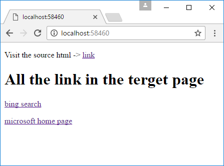

# How to parse html in .NET Core
## Requires
- Visual Studio 2017
## License
- Apache License, Version 2.0
## Technologies
- .NET
- HTML
- Languages
## Topics
- .NET Core
- Parse html
## Updated
- 05/14/2017
## Description

How to parse HTML in .NET Core

Introduction

This sample demonstrates how to parse HTML in .NET Core.

This sample uses HtmlAgilityPack.NetCore to parse HTML.

Sample prerequisites

&bull;&nbsp;Visual Studio 2017 or above. [<a href="https://www.visualstudio.com/" style="text-decoration:none">Visual
 Studio Home Page</a>]

&bull;&nbsp;Visual Studio enabled ASP.NET Core develop component.

Building the sample

Use Visual Studio to open the sample solution, then press F6 Key to build the sample project.

Running the sample

&bull;&nbsp;Use Visual Studio to open the sample solution, then press F5 Key or select
Debug -&gt; Start Debugging from the menu.

&bull;&nbsp;When the project is running, you will see the below page in browser.

Using the code

The source html

&nbsp;

HTML

Edit|Remove

html

<pre class="html">&lt;!DOCTYPE&nbsp;html&gt;&nbsp;
&lt;html&gt;&nbsp;
&lt;head&gt;&nbsp;
&nbsp;&nbsp;&nbsp;&nbsp;&lt;meta&nbsp;charset=&quot;utf-8&quot;&nbsp;/&gt;&nbsp;
&nbsp;&nbsp;&nbsp;&nbsp;&lt;meta&nbsp;http-equiv=&quot;content-type&quot;&nbsp;content=&quot;text/html;charset=utf-8&quot;&gt;&nbsp;
&nbsp;
&nbsp;&nbsp;&nbsp;&nbsp;&lt;title&gt;&lt;/title&gt;&nbsp;
&lt;/head&gt;&nbsp;
&lt;body&gt;&nbsp;
&nbsp;&nbsp;&nbsp;&nbsp;&lt;h1&gt;Hello&nbsp;world&lt;/h1&gt;&nbsp;
&nbsp;&nbsp;&nbsp;&nbsp;&lt;div&gt;&nbsp;
&nbsp;&nbsp;&nbsp;&nbsp;&nbsp;&nbsp;&nbsp;&nbsp;&lt;a&nbsp;href=&quot;https://www.bing.com&quot;&gt;bing&nbsp;search&lt;/a&gt;&nbsp;&lt;br&gt;&nbsp;
&nbsp;&nbsp;&nbsp;&nbsp;&nbsp;&nbsp;&nbsp;&nbsp;&lt;a&nbsp;href=&quot;https://www.microsoft.com&quot;&gt;microsoft&nbsp;home&nbsp;page&lt;/a&gt;&nbsp;&nbsp;&lt;br&gt;&lt;hr&nbsp;/&gt;&nbsp;
&nbsp;
&nbsp;&nbsp;&nbsp;&nbsp;&nbsp;&nbsp;&nbsp;&nbsp;&lt;input&nbsp;type=&quot;text&quot;&nbsp;calss=&quot;misshapenTag&quot;&gt;&nbsp;
&nbsp;&nbsp;&nbsp;&nbsp;&nbsp;&nbsp;&nbsp;&nbsp;&lt;img&nbsp;class=&quot;misshapenTag&quot;&gt;&nbsp;
&nbsp;&nbsp;&nbsp;&nbsp;&lt;/div&gt;&nbsp;
&lt;/body&gt;&nbsp;
&lt;/html&gt;&nbsp; </pre>

&nbsp;

&nbsp;How to parse &amp; how to select nodes

&nbsp;

C#

Edit|Remove

csharp

<pre class="csharp">&nbsp;&nbsp;&nbsp;&nbsp;&nbsp;&nbsp;&nbsp;&nbsp;public&nbsp;async&nbsp;Task&lt;IActionResult&gt;&nbsp;Index()&nbsp;
&nbsp;&nbsp;&nbsp;&nbsp;&nbsp;&nbsp;&nbsp;&nbsp;{&nbsp;
&nbsp;&nbsp;&nbsp;&nbsp;&nbsp;&nbsp;&nbsp;&nbsp;&nbsp;&nbsp;&nbsp;&nbsp;HttpClient&nbsp;hc&nbsp;=&nbsp;new&nbsp;HttpClient();&nbsp;
&nbsp;&nbsp;&nbsp;&nbsp;&nbsp;&nbsp;&nbsp;&nbsp;&nbsp;&nbsp;&nbsp;&nbsp;HttpResponseMessage&nbsp;result&nbsp;=&nbsp;await&nbsp;hc.GetAsync($&quot;http://{HttpContext.Request.Host}/page.html&quot;);&nbsp;
&nbsp;
&nbsp;&nbsp;&nbsp;&nbsp;&nbsp;&nbsp;&nbsp;&nbsp;&nbsp;&nbsp;&nbsp;&nbsp;Stream&nbsp;stream&nbsp;=&nbsp;await&nbsp;result.Content.ReadAsStreamAsync();&nbsp;
&nbsp;
&nbsp;&nbsp;&nbsp;&nbsp;&nbsp;&nbsp;&nbsp;&nbsp;&nbsp;&nbsp;&nbsp;&nbsp;HtmlDocument&nbsp;doc&nbsp;=&nbsp;new&nbsp;HtmlDocument();&nbsp;
&nbsp;
&nbsp;&nbsp;&nbsp;&nbsp;&nbsp;&nbsp;&nbsp;&nbsp;&nbsp;&nbsp;&nbsp;&nbsp;doc.Load(stream);&nbsp;
&nbsp;
&nbsp;&nbsp;&nbsp;&nbsp;&nbsp;&nbsp;&nbsp;&nbsp;&nbsp;&nbsp;&nbsp;&nbsp;HtmlNodeCollection&nbsp;links&nbsp;=&nbsp;doc.DocumentNode.SelectNodes(&quot;//a[@href]&quot;);//the&nbsp;parameter&nbsp;is&nbsp;use&nbsp;xpath&nbsp;see:&nbsp;https://www.w3schools.com/xml/xml_xpath.asp&nbsp;
&nbsp;
&nbsp;&nbsp;&nbsp;&nbsp;&nbsp;&nbsp;&nbsp;&nbsp;&nbsp;&nbsp;&nbsp;&nbsp;return&nbsp;View(links);&nbsp;
&nbsp;&nbsp;&nbsp;&nbsp;&nbsp;&nbsp;&nbsp;&nbsp;}&nbsp; </pre>

Show the parsed data

&nbsp;

HTML

Edit|Remove

html

<pre class="html">@model&nbsp;HtmlAgilityPack.HtmlNodeCollection&nbsp;
&lt;!DOCTYPE&nbsp;html&gt;&nbsp;
&lt;html&gt;&nbsp;
&lt;head&gt;&nbsp;
&nbsp;&nbsp;&nbsp;&nbsp;&lt;title&gt;&lt;/title&gt;&nbsp;
&lt;/head&gt;&nbsp;
&lt;body&gt;&nbsp;
&nbsp;&nbsp;&nbsp;&nbsp;&lt;p&gt;Visit&nbsp;the&nbsp;source&nbsp;html&nbsp;-&gt;&nbsp;&lt;a&nbsp;href=&quot;~/page.html&quot;&gt;link&lt;/a&gt;&lt;/p&gt;&nbsp;
&nbsp;&nbsp;&nbsp;&nbsp;&lt;h1&gt;All&nbsp;the&nbsp;link&nbsp;in&nbsp;the&nbsp;terget&nbsp;page&lt;/h1&gt;&nbsp;
&nbsp;
&nbsp;&nbsp;&nbsp;&nbsp;@foreach&nbsp;(var&nbsp;item&nbsp;in&nbsp;Model)&nbsp;
&nbsp;&nbsp;&nbsp;&nbsp;{&nbsp;
&nbsp;&nbsp;&nbsp;&nbsp;&nbsp;&nbsp;&nbsp;&nbsp;&lt;p&gt;&nbsp;
&nbsp;&nbsp;&nbsp;&nbsp;&nbsp;&nbsp;&nbsp;&nbsp;&nbsp;&nbsp;&nbsp;&nbsp;&lt;a&nbsp;href=&quot;@item.Attributes[&quot;href&quot;].Value&quot;&gt;@item.InnerHtml&lt;/a&gt;&nbsp;
&nbsp;&nbsp;&nbsp;&nbsp;&nbsp;&nbsp;&nbsp;&nbsp;&lt;/p&gt;&nbsp;
&nbsp;&nbsp;&nbsp;&nbsp;}&nbsp;
&lt;/body&gt;&nbsp;
&lt;/html&gt;</pre>

&nbsp;

&nbsp;

More information

HtmlAgilityPack.NetCore at nugget

<a href="https://www.nuget.org/packages/HtmlAgilityPack.NetCore/" style="text-decoration:none">https://www.nuget.org/packages/HtmlAgilityPack.NetCore/</a>

&nbsp;

Microsoft All-In-One Code Framework is a free, centralized code sample library driven by developers' real-world pains and needs. The goal is to provide customer-driven code samples for all Microsoft development technologies,
 and reduce developers' efforts in solving typical programming tasks. Our team listens to developers&rsquo; pains in the MSDN forums, social media and various DEV communities. We write code samples based on developers&rsquo; frequently asked programming tasks,
 and allow developers to download them with a short sample publishing cycle. Additionally, we offer a free code sample request service. It is a proactive way for our developer community to obtain code samples directly from Microsoft.

