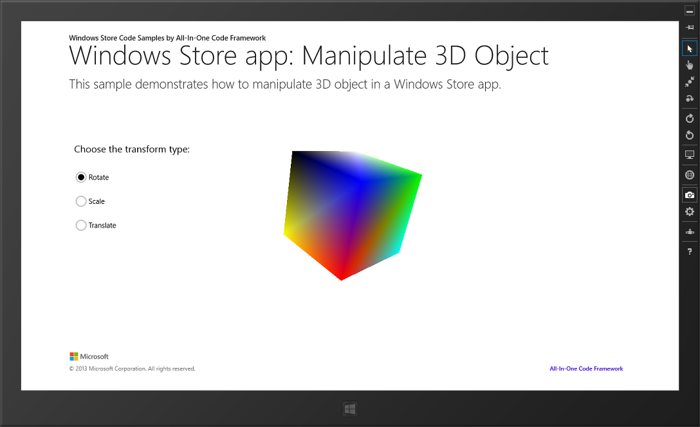
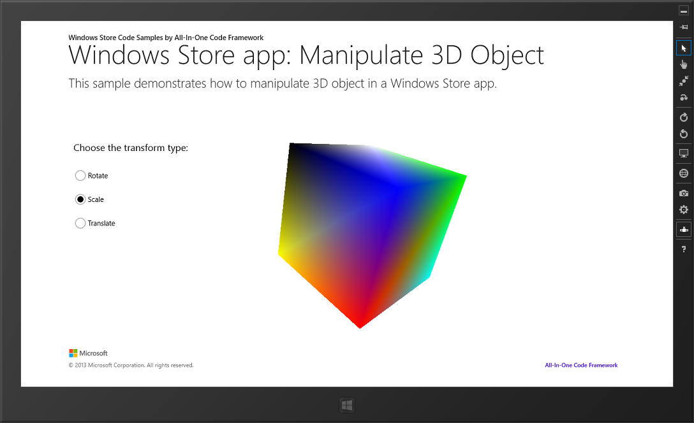

# How to pick and manipulate a 3D object using DirectX in universal Windows apps
## Requires
- Visual Studio 2013
## License
- Apache License, Version 2.0
## Technologies
- DirectX
- Windows
- Direct3D
- Windows Phone
- Windows 8
- Windows Phone 8
- Windows Store app Development
- Windows 8.1
- Windows Phone 8.1
- Graphics and Gaming
- Windows Phone App Development
## Topics
- DirectX
- universal app
- rotate object
- picking
## Updated
- 09/21/2016
## Description

<h1><em></em></h1>
<h1>ユニバーサル アプリで DirectX を使用して 3D オブジェクトを選択および操作する方法</h1>
<h2>はじめに</h2>

このサンプルでは、回転、拡大/縮小、および移動など、3D オブジェクトを選択して操作する方法を示します。また、このコードは、境界ボックスと境界錐台の間の交点テストも示します。

<h2>サンプルの実行</h2>

Visual Studio 2013 でこのサンプルをビルドし、実行します。

[Rotate] ボタンをクリックすると、ポインターのドラッグと共にキューブが回転します。

[Translate] ボタンをクリックすると、ポインターのドラッグに応じてオブジェクトがある程度の距離だけ移動します。<strong>&nbsp;</strong><em>&nbsp;</em>

[Scale&rdquo;] ボタンをクリックすると、ポインターのドラッグに応じてキューブが拡大/縮小します。<strong>&nbsp;</strong><em>&nbsp;</em>

&nbsp;

<h2>コードの使用</h2>

&bull;&nbsp; まず、2D 画面の座標を横向きを基準にした空間に変換する必要があります。これは、Windows 8 タッチ デバイスには複数の方向があるためです。<strong>&nbsp;</strong><em></em>

C&#43;&#43;

Edit|Remove

cplusplus
<pre class="hidden">//現在の点の座標を原点の画面領域に変換する 
Point CubeRenderer::TransformToOrientation(Point point, bool dipsToPixels) 
{ 
Point returnValue; 
 
switch (m_orientation) 
{ 
case DisplayOrientations::Landscape: 
returnValue = point; 
break; 
case DisplayOrientations::Portrait: 
returnValue = Point(point.Y, m_windowBounds.Width - point.X); 
break; 
case DisplayOrientations::PortraitFlipped: 
returnValue = Point(m_windowBounds.Height - point.Y, point.X); 
break; 
case DisplayOrientations::LandscapeFlipped: 
returnValue = Point(m_windowBounds.Width - point.X, m_windowBounds.Height - point.Y); 
break; 
default: 
throw ref new Platform::FailureException(); 
break; 
} 
// DIP をピクセルに変換するかどうか 
return dipsToPixels ? Point(ConvertDipsToPixels(returnValue.X), 
ConvertDipsToPixels(returnValue.Y)) 
: returnValue; 
}
</pre>

<pre class="cplusplus">//現在の点の座標を原点の画面領域に変換する&nbsp;&nbsp;
Point&nbsp;CubeRenderer::TransformToOrientation(Point&nbsp;point,&nbsp;bool&nbsp;dipsToPixels)&nbsp;&nbsp;
{&nbsp;&nbsp;
Point&nbsp;returnValue;&nbsp;&nbsp;
&nbsp;&nbsp;
switch&nbsp;(m_orientation)&nbsp;&nbsp;
{&nbsp;&nbsp;
case&nbsp;DisplayOrientations::Landscape:&nbsp;&nbsp;
returnValue&nbsp;=&nbsp;point;&nbsp;&nbsp;
break;&nbsp;&nbsp;
case&nbsp;DisplayOrientations::Portrait:&nbsp;&nbsp;
returnValue&nbsp;=&nbsp;Point(point.Y,&nbsp;m_windowBounds.Width&nbsp;-&nbsp;point.X);&nbsp;&nbsp;
break;&nbsp;&nbsp;
case&nbsp;DisplayOrientations::PortraitFlipped:&nbsp;&nbsp;
returnValue&nbsp;=&nbsp;Point(m_windowBounds.Height&nbsp;-&nbsp;point.Y,&nbsp;point.X);&nbsp;&nbsp;
break;&nbsp;&nbsp;
case&nbsp;DisplayOrientations::LandscapeFlipped:&nbsp;&nbsp;
returnValue&nbsp;=&nbsp;Point(m_windowBounds.Width&nbsp;-&nbsp;point.X,&nbsp;m_windowBounds.Height&nbsp;-&nbsp;point.Y);&nbsp;&nbsp;
break;&nbsp;&nbsp;
default:&nbsp;&nbsp;
throw&nbsp;ref&nbsp;new&nbsp;Platform::FailureException();&nbsp;&nbsp;
break;&nbsp;&nbsp;
}&nbsp;&nbsp;
//&nbsp;DIP&nbsp;をピクセルに変換するかどうか&nbsp;return&nbsp;dipsToPixels&nbsp;?&nbsp;Point(ConvertDipsToPixels(returnValue.X),&nbsp;&nbsp;
ConvertDipsToPixels(returnValue.Y))&nbsp;&nbsp;
:&nbsp;returnValue;&nbsp;&nbsp;
}&nbsp;
</pre>

&bull;&nbsp; 続いて、ポインターの 2D 領域の座標を表示領域に変換します。以下に示す数学関連の資料を参照してください。

C&#43;&#43;

Edit|Remove

cplusplus
<pre class="hidden">void CubeRenderer::ScreenToView( 
_In_ float sx, 
_In_ float sy, 
_Outptr_ float * vx, 
_Outptr_ float * vy 
) 
{ 
*vx = (2.0f * sx / m_d3dRenderTargetSize.Width - 1.0f) / m_cbMVPData.projection._11; 
*vy = (-2.0f * sy / m_d3dRenderTargetSize.Height &#43; 1.0f) / m_cbMVPData.projection._22; 
} 
void CubeRenderer::VectorToLocal( 
_In_ XMVECTOR inVec, 
_Outptr_ XMVECTOR * outVec 
) 
{ 
XMMATRIX viewMx = XMLoadFloat4x4(&amp;m_cbMVPData.view); 
XMMATRIX modelMx = XMLoadFloat4x4(&amp;m_cbMVPData.model); 
XMMATRIX invView = XMMatrixInverse(&amp;XMMatrixDeterminant(viewMx), viewMx); 
XMMATRIX invModel = XMMatrixInverse(&amp;XMMatrixDeterminant(modelMx), modelMx); 
XMMATRIX toLocal = invView * invModel; 
XMFLOAT4 inVecF; 
XMStoreFloat4(&amp;inVecF, inVec); 
if(1.0f == inVecF.w)//point vector 
{ 
*outVec = XMVector3TransformCoord(inVec, toLocal); 
} 
else 
{ 
*outVec = XMVector3TransformNormal(inVec, toLocal); 
*outVec = XMVector3Normalize(*outVec); 
} 
 
}
</pre>

<pre class="cplusplus">void&nbsp;CubeRenderer::ScreenToView(&nbsp;&nbsp;
_In_&nbsp;float&nbsp;sx,&nbsp;&nbsp;
_In_&nbsp;float&nbsp;sy,&nbsp;&nbsp;
_Outptr_&nbsp;float&nbsp;*&nbsp;vx,&nbsp;&nbsp;
_Outptr_&nbsp;float&nbsp;*&nbsp;vy&nbsp;&nbsp;
)&nbsp;&nbsp;
{&nbsp;&nbsp;
*vx&nbsp;=&nbsp;(2.0f&nbsp;*&nbsp;sx&nbsp;/&nbsp;m_d3dRenderTargetSize.Width&nbsp;-&nbsp;1.0f)&nbsp;/&nbsp;m_cbMVPData.projection._11;&nbsp;&nbsp;
*vy&nbsp;=&nbsp;(-2.0f&nbsp;*&nbsp;sy&nbsp;/&nbsp;m_d3dRenderTargetSize.Height&nbsp;&#43;&nbsp;1.0f)&nbsp;/&nbsp;m_cbMVPData.projection._22;&nbsp;&nbsp;
}&nbsp;&nbsp;
void&nbsp;CubeRenderer::VectorToLocal(&nbsp;&nbsp;
_In_&nbsp;XMVECTOR&nbsp;inVec,&nbsp;&nbsp;
_Outptr_&nbsp;XMVECTOR&nbsp;*&nbsp;outVec&nbsp;&nbsp;
)&nbsp;&nbsp;
{&nbsp;&nbsp;
XMMATRIX&nbsp;viewMx&nbsp;=&nbsp;XMLoadFloat4x4(&amp;m_cbMVPData.view);&nbsp;&nbsp;
XMMATRIX&nbsp;modelMx&nbsp;=&nbsp;XMLoadFloat4x4(&amp;m_cbMVPData.model);&nbsp;&nbsp;
XMMATRIX&nbsp;invView&nbsp;=&nbsp;XMMatrixInverse(&amp;XMMatrixDeterminant(viewMx),&nbsp;viewMx);&nbsp;&nbsp;
XMMATRIX&nbsp;invModel&nbsp;=&nbsp;XMMatrixInverse(&amp;XMMatrixDeterminant(modelMx),&nbsp;modelMx);&nbsp;&nbsp;
XMMATRIX&nbsp;toLocal&nbsp;=&nbsp;invView&nbsp;*&nbsp;invModel;&nbsp;&nbsp;
XMFLOAT4&nbsp;inVecF;&nbsp;&nbsp;
XMStoreFloat4(&amp;inVecF,&nbsp;inVec);&nbsp;&nbsp;
if(1.0f&nbsp;==&nbsp;inVecF.w)//point&nbsp;vector&nbsp;&nbsp;
{&nbsp;&nbsp;
*outVec&nbsp;=&nbsp;XMVector3TransformCoord(inVec,&nbsp;toLocal);&nbsp;&nbsp;
}&nbsp;&nbsp;
else&nbsp;&nbsp;
{&nbsp;&nbsp;
*outVec&nbsp;=&nbsp;XMVector3TransformNormal(inVec,&nbsp;toLocal);&nbsp;&nbsp;
*outVec&nbsp;=&nbsp;XMVector3Normalize(*outVec);&nbsp;&nbsp;
}&nbsp;&nbsp;
&nbsp;&nbsp;
}&nbsp;
</pre>

ただし、ここでは単に、DirectXMath の <a href="http://msdn.microsoft.com/en-us/library/microsoft.directx_sdk.transformation.xmvector3unproject(v=vs.85).aspx">XMVector3Unproject</a> に由来するメソッドを使用します。

x と y の値が同じで、z の値が異なる画面領域から 2 つの点を計算します。&nbsp; 

C&#43;&#43;

Edit|Remove

cplusplus
<pre class="hidden">XMVECTOR vector1 = DirectX::XMVector3Unproject( 
XMVectorSet(sx, sy, 0.0f, 1.0f), 
0.0f, 
0.0f, 
m_d3dRenderTargetSize.Width, 
m_d3dRenderTargetSize.Height, 
0.0f, 
1.0f, 
XMLoadFloat4x4(&amp;m_cbMVPData.projection), 
XMLoadFloat4x4(&amp;m_cbMVPData.view), 
XMLoadFloat4x4(&amp;m_cbMVPData.model) 
); 
XMVECTOR vector2 = DirectX::XMVector3Unproject( 
XMVectorSet(sx, sy, 1.0f, 1.0f), 
0.0f, 
0.0f, 
m_d3dRenderTargetSize.Width, 
m_d3dRenderTargetSize.Height, 
0.0f, 
1.0f, 
XMLoadFloat4x4(&amp;m_cbMVPData.projection), 
XMLoadFloat4x4(&amp;m_cbMVPData.view), 
XMLoadFloat4x4(&amp;m_cbMVPData.model) 
); 
</pre>

<pre class="cplusplus">XMVECTOR&nbsp;vector1&nbsp;=&nbsp;DirectX::XMVector3Unproject(&nbsp;&nbsp;
XMVectorSet(sx,&nbsp;sy,&nbsp;0.0f,&nbsp;1.0f),&nbsp;&nbsp;
0.0f,&nbsp;&nbsp;
0.0f,&nbsp;&nbsp;
m_d3dRenderTargetSize.Width,&nbsp;&nbsp;
m_d3dRenderTargetSize.Height,&nbsp;&nbsp;
0.0f,&nbsp;&nbsp;
1.0f,&nbsp;&nbsp;
XMLoadFloat4x4(&amp;m_cbMVPData.projection),&nbsp;&nbsp;
XMLoadFloat4x4(&amp;m_cbMVPData.view),&nbsp;&nbsp;
XMLoadFloat4x4(&amp;m_cbMVPData.model)&nbsp;&nbsp;
);&nbsp;&nbsp;
XMVECTOR&nbsp;vector2&nbsp;=&nbsp;DirectX::XMVector3Unproject(&nbsp;&nbsp;
XMVectorSet(sx,&nbsp;sy,&nbsp;1.0f,&nbsp;1.0f),&nbsp;&nbsp;
0.0f,&nbsp;&nbsp;
0.0f,&nbsp;&nbsp;
m_d3dRenderTargetSize.Width,&nbsp;&nbsp;
m_d3dRenderTargetSize.Height,&nbsp;&nbsp;
0.0f,&nbsp;&nbsp;
1.0f,&nbsp;&nbsp;
XMLoadFloat4x4(&amp;m_cbMVPData.projection),&nbsp;&nbsp;
XMLoadFloat4x4(&amp;m_cbMVPData.view),&nbsp;&nbsp;
XMLoadFloat4x4(&amp;m_cbMVPData.model)&nbsp;&nbsp;
);&nbsp;&nbsp;
</pre>

続いて、原点 (vector1) および方向ベクトル (vector2 &ndash; vector1) を取得できます。これらは、XMVector3Unproject メッソドに設定されます。方向ベクトルを正規化することに注意してください。

これで、3D オブジェクトを繰り返し処理し、選択線がオブジェクトと交差するかどうかをテストできます。DirectXMath に新しく導入された<a href="http://msdn.microsoft.com/en-us/library/windows/desktop/hh855922(v=vs.85).aspx">Intersects(&hellip;)</a> メソッドを使用します。

交差をテストできれば、ポインターをドラッグしてオブジェクトを変換します。

回転を処理する場合は、オブジェクトを円弧のボールに変換するため、スムーズに回転させることができます。<strong></strong><em></em>

C&#43;&#43;

Edit|Remove

cplusplus
<pre class="hidden">void CubeRenderer::ScreenToArcBall( 
_In_ float sx,  
_In_ float sy,  
_Outptr_ DirectX::XMFLOAT3 &amp;vec 
) 
{ 
float width = m_windowBounds.Width; 
float height = m_windowBounds.Height; 
float x = ( sx  - width / 2 ) / ( width / 2 ); 
float y = -( sy - height / 2 ) / ( height / 2 ); 
 
float z = 0.0f; 
float mag =  x * x &#43; y * y; 
 
if( mag &gt; 1.0f ) 
{ 
float scale = 1.0f / sqrtf( mag ); 
x *= scale; 
y *= scale; 
} 
else 
z = -(sqrtf( 1.0f - mag )); 
vec = XMFLOAT3(x, y, z); 
} 
</pre>

<pre class="cplusplus">void&nbsp;CubeRenderer::ScreenToArcBall(&nbsp;&nbsp;
_In_&nbsp;float&nbsp;sx,&nbsp;&nbsp;&nbsp;
_In_&nbsp;float&nbsp;sy,&nbsp;&nbsp;&nbsp;
_Outptr_&nbsp;DirectX::XMFLOAT3&nbsp;&amp;vec&nbsp;&nbsp;
)&nbsp;&nbsp;
{&nbsp;&nbsp;
float&nbsp;width&nbsp;=&nbsp;m_windowBounds.Width;&nbsp;&nbsp;
float&nbsp;height&nbsp;=&nbsp;m_windowBounds.Height;&nbsp;&nbsp;
float&nbsp;x&nbsp;=&nbsp;(&nbsp;sx&nbsp;&nbsp;-&nbsp;width&nbsp;/&nbsp;2&nbsp;)&nbsp;/&nbsp;(&nbsp;width&nbsp;/&nbsp;2&nbsp;);&nbsp;&nbsp;
float&nbsp;y&nbsp;=&nbsp;-(&nbsp;sy&nbsp;-&nbsp;height&nbsp;/&nbsp;2&nbsp;)&nbsp;/&nbsp;(&nbsp;height&nbsp;/&nbsp;2&nbsp;);&nbsp;&nbsp;
&nbsp;&nbsp;
float&nbsp;z&nbsp;=&nbsp;0.0f;&nbsp;&nbsp;
float&nbsp;mag&nbsp;=&nbsp;&nbsp;x&nbsp;*&nbsp;x&nbsp;&#43;&nbsp;y&nbsp;*&nbsp;y;&nbsp;&nbsp;
&nbsp;&nbsp;
if(&nbsp;mag&nbsp;&gt;&nbsp;1.0f&nbsp;)&nbsp;&nbsp;
{&nbsp;&nbsp;
float&nbsp;scale&nbsp;=&nbsp;1.0f&nbsp;/&nbsp;sqrtf(&nbsp;mag&nbsp;);&nbsp;&nbsp;
x&nbsp;*=&nbsp;scale;&nbsp;&nbsp;
y&nbsp;*=&nbsp;scale;&nbsp;&nbsp;
}&nbsp;&nbsp;
else&nbsp;&nbsp;
z&nbsp;=&nbsp;-(sqrtf(&nbsp;1.0f&nbsp;-&nbsp;mag&nbsp;));&nbsp;&nbsp;
vec&nbsp;=&nbsp;XMFLOAT3(x,&nbsp;y,&nbsp;z);&nbsp;&nbsp;
}&nbsp;&nbsp;
</pre>

移動を実行する場合、座標のオフセットを定数で除算します。

C&#43;&#43;

Edit|Remove

cplusplus
<pre class="hidden">transform = XMMatrixTranslation((x2 - x1) / 200, (y1 - y2) / 200, 0.0f);
</pre>

<pre class="cplusplus">transform&nbsp;=&nbsp;XMMatrixTranslation((x2&nbsp;-&nbsp;x1)&nbsp;/&nbsp;200,&nbsp;(y1&nbsp;-&nbsp;y2)&nbsp;/&nbsp;200,&nbsp;0.0f);&nbsp;
</pre>

&nbsp;拡大/縮小を実行する場合も、円弧のボールを使用してボールの周囲におけるポインター オフセットの距離を計算します。その後、データを
<a href="http://msdn.microsoft.com/en-us/library/microsoft.directx_sdk.matrix.xmmatrixscaling(v=vs.85).aspx">XMMatrixScaling(&hellip;)</a> に設定します。

<h2>詳細</h2>

&bull;&nbsp;<a href="http://www.braynzarsoft.net/index.php?p=D3D11PICKING">Direct3D 11 の選択</a><strong></strong><em></em>

Microsoft All-In-One Code Framework is a free, centralized code sample library driven by developers' real-world pains and needs. The goal is to provide customer-driven code samples for all Microsoft development technologies, and
 reduce developers' efforts in solving typical programming tasks. Our team listens to developers&rsquo; pains in the MSDN forums, social media and various DEV communities. We write code samples based on developers&rsquo; frequently asked programming tasks,
 and allow developers to download them with a short sample publishing cycle. Additionally, we offer a free code sample request service. It is a proactive way for our developer community to obtain code samples directly from Microsoft.

 

<em> 
</em>

