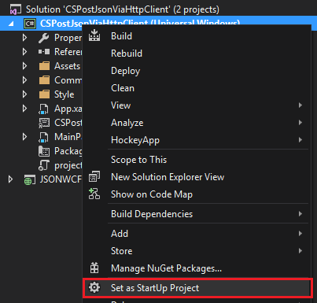
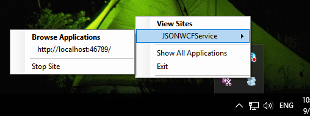
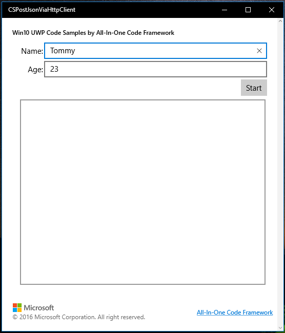
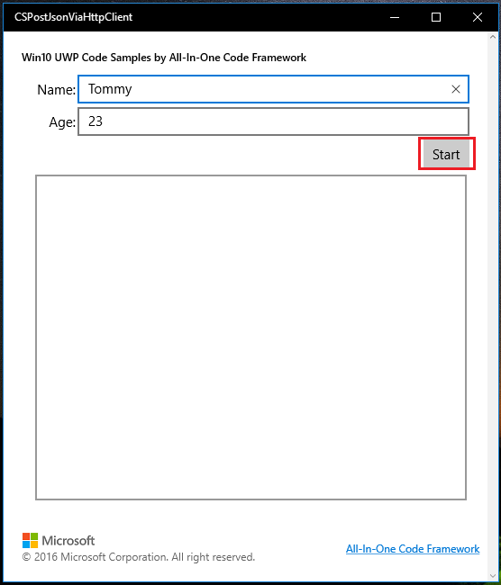

# How to post json data Using HttpClient in Win10 UWP
## Requires
- Visual Studio 2015
## License
- Apache License, Version 2.0
## Technologies
- .NET
- Networking
- Universal Windows App Development
## Topics
- WCF
- WebClient
- UWP
- Post json
## Updated
- 08/31/2016
## Description

&lt;How to
post
json data using
HttpClient in Win10 UWP apps&gt;

Introduction

This sample demonstrates how to post json data to web server using
HttpClient in Win10 UWP apps.

This sample is upgraded from <a href="https://code.msdn.microsoft.com/How-to-use-HttpClient-to-b9289836" style="text-decoration:none">How to use HTTPClient to post Json data to
WebService in Windows Store apps</a>.

Sample prerequisites

To open and run this sample, ensure the following requisites have been reached:

&bull;&nbsp;Microsoft Windows 10(10.0.14393) or above.

&bull;&nbsp;Microsoft Visual Studio 2015 Update3 or later version(s).

&bull;&nbsp;Microsoft Visual Studio
has installed UWP developer component.

&bull;&nbsp;Microsoft Visual Studio
has installed Web developer component.

Building
the sample

&bull;&nbsp;Open the sample solution &ldquo;CSPostJsonViaHttpClient.sln&rdquo; using Visual Studio.

&bull;&nbsp;In Solution Explorer, right click project &ldquo;CSPostJsonViaHttpClient&rdquo; and select
Set as StartUp Project.

&bull;&nbsp;Right click project &ldquo;JSONWCFService&rdquo; and choose
Rebuild, to restore references.

Running the sample

&bull;&nbsp;Use Visual studio to open the sample solution, then press
F5 Key or select Debug -&gt; Start Debugging from the menu.

&bull;&nbsp;When the app is running, you can see WCF service
running.

And the UWP sample app is running.

&bull;&nbsp;Click the button &ldquo;Start&rdquo;.

&bull;&nbsp;The app will send a
json data to WCF service, and set result of WCF service to UI.

Using the code

C#

Edit|Remove

csharp
<pre class="hidden">httpClient = new HttpClient();
string resourceAddress = &quot;http://localhost:46789/WCFService.svc/GetData&quot;;
 
string jsonStr = JsonConvert.SerializeObject(new { Name = ViewModel.Name, Age = ViewModel.Age });
 
httpClient.DefaultRequestHeaders.Accept.Add(new System.Net.Http.Headers.MediaTypeWithQualityHeaderValue(&quot;application/json&quot;));
HttpResponseMessage wcfResponse = await httpClient.PostAsync(resourceAddress, new StringContent(jsonStr, Encoding.UTF8, &quot;application/json&quot;));
 
string responseText = await wcfResponse.Content.ReadAsStringAsync();
ViewModel.ServerResult = responseText;</pre>

<pre class="csharp">httpClient&nbsp;=&nbsp;new&nbsp;HttpClient();&nbsp;
string&nbsp;resourceAddress&nbsp;=&nbsp;&quot;http://localhost:46789/WCFService.svc/GetData&quot;;&nbsp;
&nbsp;&nbsp;
string&nbsp;jsonStr&nbsp;=&nbsp;JsonConvert.SerializeObject(new&nbsp;{&nbsp;Name&nbsp;=&nbsp;ViewModel.Name,&nbsp;Age&nbsp;=&nbsp;ViewModel.Age&nbsp;});&nbsp;
&nbsp;&nbsp;
httpClient.DefaultRequestHeaders.Accept.Add(new&nbsp;System.Net.Http.Headers.MediaTypeWithQualityHeaderValue(&quot;application/json&quot;));&nbsp;
HttpResponseMessage&nbsp;wcfResponse&nbsp;=&nbsp;await&nbsp;httpClient.PostAsync(resourceAddress,&nbsp;new&nbsp;StringContent(jsonStr,&nbsp;Encoding.UTF8,&nbsp;&quot;application/json&quot;));&nbsp;
&nbsp;&nbsp;
string&nbsp;responseText&nbsp;=&nbsp;await&nbsp;wcfResponse.Content.ReadAsStringAsync();&nbsp;
ViewModel.ServerResult&nbsp;=&nbsp;responseText;</pre>

&nbsp;

More information

HttpClient Class

<a href="http://msdn.microsoft.com/en-us/library/system.net.http.httpclient.aspx" style="text-decoration:none">http://msdn.microsoft.com/en-us/library/system.net.http.httpclient.aspx</a>

&nbsp;

Json.NET

<a href="http://www.newtonsoft.com/json" style="text-decoration:none">http://www.newtonsoft.com/json</a>

&nbsp;

Microsoft All-In-One Code Framework is a free, centralized code sample library driven by developers' real-world pains and needs. The goal is to provide customer-driven code samples for all Microsoft development technologies,
 and reduce developers' efforts in solving typical programming tasks. Our team listens to developers&rsquo; pains in the MSDN forums, social media and various DEV communities. We write code samples based on developers&rsquo; frequently asked programming tasks,
 and allow developers to download them with a short sample publishing cycle. Additionally, we offer a free code sample request service. It is a proactive way for our developer community to obtain code samples directly from Microsoft.

