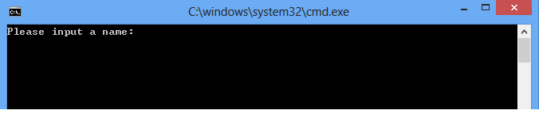

# How to retrieve output parameter from stored procedure in Entity Framework
## Requires
- Visual Studio 2010
## License
- Apache License, Version 2.0
## Technologies
- ADO.NET
- Data Access
- Entity Framework
- .NET Development
## Topics
- Entity Framework
## Updated
- 06/05/2013
## Description

<h1>How to get output parameter in stored procedure from Entity Framework (CSEFOutputParameter)</h1>
<h2>Introduction </h2>

This sample demonstrates how to use ObjectParameter instance to get the value of output parameter in Entity Framework.

<h2>Building the Sample</h2>

1.&nbsp;&nbsp;&nbsp;&nbsp;&nbsp;&nbsp;
Start Visual Studio 2012 and select File &gt; Open &gt; Project/Solution.

2.&nbsp;&nbsp;&nbsp;&nbsp;&nbsp;&nbsp;
Go to the directory in which you download the sample. Go to the directory named for&nbsp;&nbsp;
the sample, and double-click the Microsoft Visual Studio Solution (.sln) file.

3.&nbsp;&nbsp;&nbsp;&nbsp;&nbsp;&nbsp;
Attach the database file 
EFDemoDB.mdf under the folder _External_Dependencies to your SQL Server 2008R2 database instance.<b>
</b>

4.&nbsp;&nbsp;&nbsp;&nbsp;&nbsp;&nbsp;
Modify the connection string in the 
App.config according to your SQL Server 2008R2 database instance name.<b> </b>

5.&nbsp;&nbsp;&nbsp;&nbsp;&nbsp;&nbsp;
Press F7 or use Build &gt; Build Solution to build the sample.

<h2>Running the Sample</h2>

1.&nbsp;&nbsp;&nbsp;&nbsp;&nbsp;&nbsp;
Right click the solution and built it. 

2.&nbsp;&nbsp;&nbsp;&nbsp;&nbsp;&nbsp;
Press F5 to run the project, a console window will appear.

3.&nbsp;&nbsp;&nbsp;&nbsp;&nbsp;&nbsp;
Follow the prompt to input person information.

<h2>Using the Code</h2>

Stored Procedure

SQL

Edit|Remove

mysql

<pre id="codePreview" class="mysql">
ALTER PROCEDURE [dbo].[InsertPerson]   
@Name varchar(50),   
@Description varchar(200),     
@ID int OUT   
AS   
INSERT INTO Person(Name,Description) VALUES(@Name,@Description)   
SET @ID = SCOPE_IDENTITY()

</pre>

&nbsp;

The code below demonstrates how to get the value of output parameter.

C#

Edit|Remove

csharp

<pre id="codePreview" class="csharp">
// Create a ObjectParameter instance to retrieve output parameter from stored procedure
                   ObjectParameter Output = new ObjectParameter(&quot;ID&quot;, typeof(Int32));
                   context.InsertPerson(Name, Description, Output);

                   Console.Write(&quot;ID: {0}&quot;, Output.Value);

</pre>

&nbsp;

<h2>More Information</h2>

ObjectParameter Class

<a href="http://msdn.microsoft.com/en-us/library/system.data.objects.objectparameter.aspx">http://msdn.microsoft.com/en-us/library/system.data.objects.objectparameter.aspx</a>

Stored Procedures in the Entity Framework 

<a href="http://msdn.microsoft.com/en-us/data/gg699321.aspx">http://msdn.microsoft.com/en-us/data/gg699321.aspx</a>

