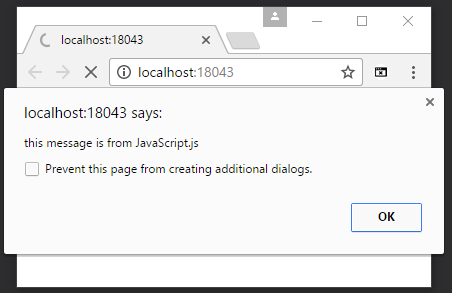
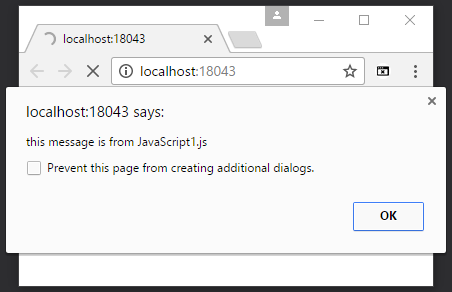

# How to return Javascript from ASP.NET Core
## Requires
- Visual Studio 2015
## License
- Apache License, Version 2.0
## Technologies
- ASP.NET
- .NET
- Web App Development
## Topics
- ASP.NET Core
- Returning Javascript
## Updated
- 03/17/2017
## Description

How to return Javascript from ASP.NET Core

Introduction

This sample demonstrates how to return Javascript from ASP.NET Core.

Sample prerequisites

<ul>
<li>.NET Core 1.0 or later version(s). [<a href="https://go.microsoft.com/fwlink/?LinkID=827546" style="font-size:10pt">.NET Core &#43; Visual Studio tooling</a>]
</li><li>Microsoft Visual Studio 2015 update3 or above. [<a href="https://www.microsoft.com/en-sg/download/details.aspx?id=48146" style="font-size:10pt">Visual Studio 2015 installer</a>]
</li></ul>

Building the sample

<ul>
<li>Open the sample solution &ldquo;<strong style="font-size:10pt">CSRetrunJSASPNETCore.sln</strong>&rdquo; using Visual Studio.
</li><li>Right click the project &ldquo;<strong>CSRetrunJSASPNETCore</strong>&rdquo; and select Restore Packages. 
</li><li>Press <strong>F6 Key</strong> or select <strong>
Build -&gt; Build Solution</strong> from the menu to build the sample. 
</li></ul>

Running the sample

<ul>
<li>Open the sample solution using Visual Studio, then press <strong>F5 Key</strong> or
<strong>select Debug -&gt; Start Debugging</strong> in the menu. </li><li>When the web application is running, you will see two alert dialogs in your browser.
</li></ul>

Using the code

JavaScript.js

&nbsp;

JavaScript

Edit|Remove

js
<pre class="hidden">alert(&quot;this message is from JavaScript.js&quot;);</pre>

<pre class="js">alert(&quot;this&nbsp;message&nbsp;is&nbsp;from&nbsp;JavaScript.js&quot;);</pre>

&nbsp;

JavaScript1.js

&nbsp;

JavaScript

Edit|Remove

js
<pre class="hidden">alert(&quot;this message is from JavaScript1.js&quot;);</pre>

<pre class="js">alert(&quot;this&nbsp;message&nbsp;is&nbsp;from&nbsp;JavaScript1.js&quot;);</pre>

&nbsp;

In the Controller

&nbsp;

C#

Edit|Remove

csharp
<pre class="hidden">    public class HomeController : Controller
    {
        private readonly IHostingEnvironment _hostingEnvironment;

        public HomeController(IHostingEnvironment hostingEnvironment)
        {
            _hostingEnvironment = hostingEnvironment;
        }

        public IActionResult Index()
        {
            return View();
        }

        public JavaScriptResult GetJS()
        {
            string webRootPath = _hostingEnvironment.WebRootPath;

            string result = System.IO.File.ReadAllText(webRootPath &#43; &quot;/JavaScript.js&quot;);
            result &#43;= System.IO.File.ReadAllText(webRootPath &#43; &quot;/JavaScript1.js&quot;);

            return new JavaScriptResult(result);
        }
    }

    public class JavaScriptResult : ContentResult
    {
        public JavaScriptResult(string script)
        {
            this.Content = script;
            this.ContentType = &quot;application/javascript&quot;;
        }
    }
</pre>

<pre class="csharp">&nbsp;&nbsp;&nbsp;&nbsp;public&nbsp;class&nbsp;HomeController&nbsp;:&nbsp;Controller&nbsp;
&nbsp;&nbsp;&nbsp;&nbsp;{&nbsp;
&nbsp;&nbsp;&nbsp;&nbsp;&nbsp;&nbsp;&nbsp;&nbsp;private&nbsp;readonly&nbsp;IHostingEnvironment&nbsp;_hostingEnvironment;&nbsp;
&nbsp;
&nbsp;&nbsp;&nbsp;&nbsp;&nbsp;&nbsp;&nbsp;&nbsp;public&nbsp;HomeController(IHostingEnvironment&nbsp;hostingEnvironment)&nbsp;
&nbsp;&nbsp;&nbsp;&nbsp;&nbsp;&nbsp;&nbsp;&nbsp;{&nbsp;
&nbsp;&nbsp;&nbsp;&nbsp;&nbsp;&nbsp;&nbsp;&nbsp;&nbsp;&nbsp;&nbsp;&nbsp;_hostingEnvironment&nbsp;=&nbsp;hostingEnvironment;&nbsp;
&nbsp;&nbsp;&nbsp;&nbsp;&nbsp;&nbsp;&nbsp;&nbsp;}&nbsp;
&nbsp;
&nbsp;&nbsp;&nbsp;&nbsp;&nbsp;&nbsp;&nbsp;&nbsp;public&nbsp;IActionResult&nbsp;Index()&nbsp;
&nbsp;&nbsp;&nbsp;&nbsp;&nbsp;&nbsp;&nbsp;&nbsp;{&nbsp;
&nbsp;&nbsp;&nbsp;&nbsp;&nbsp;&nbsp;&nbsp;&nbsp;&nbsp;&nbsp;&nbsp;&nbsp;return&nbsp;View();&nbsp;
&nbsp;&nbsp;&nbsp;&nbsp;&nbsp;&nbsp;&nbsp;&nbsp;}&nbsp;
&nbsp;
&nbsp;&nbsp;&nbsp;&nbsp;&nbsp;&nbsp;&nbsp;&nbsp;public&nbsp;JavaScriptResult&nbsp;GetJS()&nbsp;
&nbsp;&nbsp;&nbsp;&nbsp;&nbsp;&nbsp;&nbsp;&nbsp;{&nbsp;
&nbsp;&nbsp;&nbsp;&nbsp;&nbsp;&nbsp;&nbsp;&nbsp;&nbsp;&nbsp;&nbsp;&nbsp;string&nbsp;webRootPath&nbsp;=&nbsp;_hostingEnvironment.WebRootPath;&nbsp;
&nbsp;
&nbsp;&nbsp;&nbsp;&nbsp;&nbsp;&nbsp;&nbsp;&nbsp;&nbsp;&nbsp;&nbsp;&nbsp;string&nbsp;result&nbsp;=&nbsp;System.IO.File.ReadAllText(webRootPath&nbsp;&#43;&nbsp;&quot;/JavaScript.js&quot;);&nbsp;
&nbsp;&nbsp;&nbsp;&nbsp;&nbsp;&nbsp;&nbsp;&nbsp;&nbsp;&nbsp;&nbsp;&nbsp;result&nbsp;&#43;=&nbsp;System.IO.File.ReadAllText(webRootPath&nbsp;&#43;&nbsp;&quot;/JavaScript1.js&quot;);&nbsp;
&nbsp;
&nbsp;&nbsp;&nbsp;&nbsp;&nbsp;&nbsp;&nbsp;&nbsp;&nbsp;&nbsp;&nbsp;&nbsp;return&nbsp;new&nbsp;JavaScriptResult(result);&nbsp;
&nbsp;&nbsp;&nbsp;&nbsp;&nbsp;&nbsp;&nbsp;&nbsp;}&nbsp;
&nbsp;&nbsp;&nbsp;&nbsp;}&nbsp;
&nbsp;
&nbsp;&nbsp;&nbsp;&nbsp;public&nbsp;class&nbsp;JavaScriptResult&nbsp;:&nbsp;ContentResult&nbsp;
&nbsp;&nbsp;&nbsp;&nbsp;{&nbsp;
&nbsp;&nbsp;&nbsp;&nbsp;&nbsp;&nbsp;&nbsp;&nbsp;public&nbsp;JavaScriptResult(string&nbsp;script)&nbsp;
&nbsp;&nbsp;&nbsp;&nbsp;&nbsp;&nbsp;&nbsp;&nbsp;{&nbsp;
&nbsp;&nbsp;&nbsp;&nbsp;&nbsp;&nbsp;&nbsp;&nbsp;&nbsp;&nbsp;&nbsp;&nbsp;this.Content&nbsp;=&nbsp;script;&nbsp;
&nbsp;&nbsp;&nbsp;&nbsp;&nbsp;&nbsp;&nbsp;&nbsp;&nbsp;&nbsp;&nbsp;&nbsp;this.ContentType&nbsp;=&nbsp;&quot;application/javascript&quot;;&nbsp;
&nbsp;&nbsp;&nbsp;&nbsp;&nbsp;&nbsp;&nbsp;&nbsp;}&nbsp;
&nbsp;&nbsp;&nbsp;&nbsp;}&nbsp;</pre>

&nbsp;

The view

&nbsp;

HTML

Edit|Remove

html
<pre class="hidden">&lt;script src=&quot;/Home/GetJS&quot;&gt;&lt;/script&gt;</pre>

<pre class="html">&lt;script&nbsp;src=&quot;/Home/GetJS&quot;&gt;&lt;/script&gt;</pre>

&nbsp;

More information

<a href="http://stackoverflow.com/questions/42684237/returning-javascript-from-asp-net-core-controller">http://stackoverflow.com/questions/42684237/returning-javascript-from-asp-net-core-controller</a>&nbsp;

<a href="https://blog.mariusschulz.com/2016/05/22/getting-the-web-root-path-and-the-content-root-path-in-asp-net-core">https://blog.mariusschulz.com/2016/05/22/getting-the-web-root-path-and-the-content-root-path-in-asp-net-core</a>&nbsp;

&nbsp;

Microsoft All-In-One Code Framework is a free, centralized code sample library driven by developers' real-world pains and needs. The goal is to provide customer-driven code samples for all Microsoft development technologies,
 and reduce developers' efforts in solving typical programming tasks. Our team listens to developers&rsquo; pains in the MSDN forums, social media and various DEV communities. We write code samples based on developers&rsquo; frequently asked programming tasks,
 and allow developers to download them with a short sample publishing cycle. Additionally, we offer a free code sample request service. It is a proactive way for our developer community to obtain code samples directly from Microsoft.

