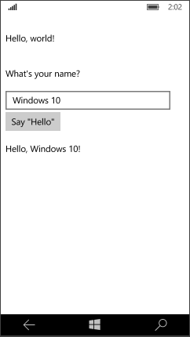

# How to run Hello World using Universal Windows Platform
## Requires
- Visual Studio 2015
## License
- Apache License, Version 2.0
## Technologies
- Universal Windows App Development
## Topics
- Hello World
- UniversalApp
## Updated
- 09/22/2016
## Description

How to run Hello World using Universal Windows
Platform

Introduction

The sample provided is a Hello World application that targets the Universal Windows Platform (UWP) on Windows 10, written using Extensible Application Markup Language (XAML) with C#. UWP allows you to
 build applications that run on any Windows 10 device with a single project in Microsoft Visual Studio.

Building the Sample

This sample is for use with Microsoft Visual Studio 2015 and Windows 10. It won't work correctly with earlier versions. Before you start, make sure you are
<a href="https://msdn.microsoft.com/en-us/windows/uwp/get-started/get-set-up" style="text-decoration:none">set up</a> with Windows 10 and Visual Studio 2015.

&bull;&nbsp; Start Microsoft Visual Studio 2015 and select 2015 File &gt; Open &gt; Project/Solution.

&bull;&nbsp; Go to the directory to which the sample was unzipped. Then go to the subdirectory named for the sample and double-click the Visual Studio 2015 Solution (.sln) file.

&bull;&nbsp; Build the sample. Build &gt; Build Solution.

Running the Sample

Starting the app on a Desktop device

In the target device menu on the
Standard toolbar, make sure that
Local Machine is selected. (It's the default selection.)

Click the Start Debugging button on the toolbar. OR

From the Debug menu, click
Start Debugging. OR

Press F5.

The app opens in a window, and a default splash screen appears first. The splash screen is defined by an image (SplashScreen.png) and a background color (specified in your app's manifest file).

The splash screen disappears, and then your app appears. It looks like this.

&nbsp;

Press the Windows key to open the
Start menu, then show all apps. Notice that deploying the app locally adds its tile to the
Start menu. To run the app again (not in debugging mode), tap or click its tile in the
Start menu.

To stop debugging

Click the Stop Debugging button in the toolbar. OR

From the Debug menu, click
Stop debugging. OR

Close the app window.

Start the app on a mobile device emulator

In addition to the options to debug on a desktop device, Visual Studio provides options for deploying and debugging your app on a physical mobile device connected to the computer, or on a mobile device
 emulator. You can choose among emulators for devices with different memory and display configurations.

&bull;&nbsp;Device

&bull;&nbsp;Emulator WVGA 4 inch 512MB

&bull;&nbsp;Emulator WVGA 4 inch 1GB

&bull;&nbsp;etc... (Various emulators in other configurations)

It's a good idea to test your app on a device with a small screen and limited memory, so use the
Emulator 10.0.10240.0 WVGA 4 inch 512MB option.
To start debugging on a mobile device emulator

In the target device menu on the
Standard toolbar, pick
Emulator 10.0.10240.0 WVGA 4 inch 512MB.

Click the Start Debugging button in the toolbar. OR

From the Debug menu, click
Start Debugging. OR

Press F5.

Visual Studio starts the selected emulator and then deploys and starts your app. On the mobile device emulator, the app looks like this.

&nbsp;

Using the Code

<strong>C#</strong>

In MainPage.xaml you define the UI for your app. You can add elements directly using XAML markup, or you can use the design tools
 provided by Visual Studio. MainPage.xaml.cs is the code-behind page for
MainPage.xaml. It's where you add your app logic and event handlers.

Together these two files define a new class called
MainPage, which inherits from
Page, in the
HelloWorld namespace.

XAML

Edit|Remove

xaml

<pre class="js">&lt;Page&nbsp;
&nbsp;&nbsp;&nbsp;&nbsp;x:Class=&quot;CSHelloWorldUniversalApp.MainPage&quot;&nbsp;
&nbsp;&nbsp;&nbsp;&nbsp;xmlns=&quot;http://schemas.microsoft.com/winfx/2006/xaml/presentation&quot;&nbsp;
&nbsp;&nbsp;&nbsp;&nbsp;xmlns:x=&quot;http://schemas.microsoft.com/winfx/2006/xaml&quot;&nbsp;
&nbsp;&nbsp;&nbsp;&nbsp;xmlns:local=&quot;using:CSHelloWorldUniversalApp&quot;&nbsp;
&nbsp;&nbsp;&nbsp;&nbsp;xmlns:d=&quot;http://schemas.microsoft.com/expression/blend/2008&quot;&nbsp;
&nbsp;&nbsp;&nbsp;&nbsp;xmlns:mc=&quot;http://schemas.openxmlformats.org/markup-compatibility/2006&quot;&nbsp;
&nbsp;&nbsp;&nbsp;&nbsp;mc:Ignorable=&quot;d&quot;&gt;&nbsp;
&nbsp;&nbsp;&nbsp;&nbsp;&lt;Grid&nbsp;Background=&quot;{ThemeResource&nbsp;ApplicationPageBackgroundThemeBrush}&quot;&gt;&nbsp;
&nbsp;&nbsp;&nbsp;&nbsp;&nbsp;&nbsp;&nbsp;&nbsp;&nbsp;
&nbsp;&nbsp;&nbsp;&nbsp;&nbsp;&nbsp;&nbsp;&nbsp;&lt;VisualStateManager.VisualStateGroups&gt;&nbsp;
&nbsp;&nbsp;&nbsp;&nbsp;&nbsp;&nbsp;&nbsp;&nbsp;&nbsp;&nbsp;&nbsp;&nbsp;&lt;VisualStateGroup&gt;&nbsp;
&nbsp;&nbsp;&nbsp;&nbsp;&nbsp;&nbsp;&nbsp;&nbsp;&nbsp;&nbsp;&nbsp;&nbsp;&nbsp;&nbsp;&nbsp;&nbsp;&lt;VisualState&nbsp;x:Name=&quot;wideState&quot;&gt;&nbsp;
&nbsp;&nbsp;&nbsp;&nbsp;&nbsp;&nbsp;&nbsp;&nbsp;&nbsp;&nbsp;&nbsp;&nbsp;&nbsp;&nbsp;&nbsp;&nbsp;&nbsp;&nbsp;&nbsp;&nbsp;&lt;VisualState.StateTriggers&gt;&nbsp;
&nbsp;&nbsp;&nbsp;&nbsp;&nbsp;&nbsp;&nbsp;&nbsp;&nbsp;&nbsp;&nbsp;&nbsp;&nbsp;&nbsp;&nbsp;&nbsp;&nbsp;&nbsp;&nbsp;&nbsp;&nbsp;&nbsp;&nbsp;&nbsp;&lt;AdaptiveTrigger&nbsp;MinWindowWidth=&quot;641&quot;&nbsp;/&gt;&nbsp;
&nbsp;&nbsp;&nbsp;&nbsp;&nbsp;&nbsp;&nbsp;&nbsp;&nbsp;&nbsp;&nbsp;&nbsp;&nbsp;&nbsp;&nbsp;&nbsp;&nbsp;&nbsp;&nbsp;&nbsp;&lt;/VisualState.StateTriggers&gt;&nbsp;
&nbsp;&nbsp;&nbsp;&nbsp;&nbsp;&nbsp;&nbsp;&nbsp;&nbsp;&nbsp;&nbsp;&nbsp;&nbsp;&nbsp;&nbsp;&nbsp;&lt;/VisualState&gt;&nbsp;
&nbsp;&nbsp;&nbsp;&nbsp;&nbsp;&nbsp;&nbsp;&nbsp;&nbsp;&nbsp;&nbsp;&nbsp;&nbsp;&nbsp;&nbsp;&nbsp;&lt;VisualState&nbsp;x:Name=&quot;narrowState&quot;&gt;&nbsp;
&nbsp;&nbsp;&nbsp;&nbsp;&nbsp;&nbsp;&nbsp;&nbsp;&nbsp;&nbsp;&nbsp;&nbsp;&nbsp;&nbsp;&nbsp;&nbsp;&nbsp;&nbsp;&nbsp;&nbsp;&lt;VisualState.StateTriggers&gt;&nbsp;
&nbsp;&nbsp;&nbsp;&nbsp;&nbsp;&nbsp;&nbsp;&nbsp;&nbsp;&nbsp;&nbsp;&nbsp;&nbsp;&nbsp;&nbsp;&nbsp;&nbsp;&nbsp;&nbsp;&nbsp;&nbsp;&nbsp;&nbsp;&nbsp;&lt;AdaptiveTrigger&nbsp;MinWindowWidth=&quot;0&quot;&nbsp;/&gt;&nbsp;
&nbsp;&nbsp;&nbsp;&nbsp;&nbsp;&nbsp;&nbsp;&nbsp;&nbsp;&nbsp;&nbsp;&nbsp;&nbsp;&nbsp;&nbsp;&nbsp;&nbsp;&nbsp;&nbsp;&nbsp;&lt;/VisualState.StateTriggers&gt;&nbsp;
&nbsp;&nbsp;&nbsp;&nbsp;&nbsp;&nbsp;&nbsp;&nbsp;&nbsp;&nbsp;&nbsp;&nbsp;&nbsp;&nbsp;&nbsp;&nbsp;&nbsp;&nbsp;&nbsp;&nbsp;&lt;VisualState.Setters&gt;&nbsp;
&nbsp;&nbsp;&nbsp;&nbsp;&nbsp;&nbsp;&nbsp;&nbsp;&nbsp;&nbsp;&nbsp;&nbsp;&nbsp;&nbsp;&nbsp;&nbsp;&nbsp;&nbsp;&nbsp;&nbsp;&nbsp;&nbsp;&nbsp;&nbsp;&lt;Setter&nbsp;Target=&quot;inputPanel.Orientation&quot;&nbsp;Value=&quot;Vertical&quot;/&gt;&nbsp;
&nbsp;&nbsp;&nbsp;&nbsp;&nbsp;&nbsp;&nbsp;&nbsp;&nbsp;&nbsp;&nbsp;&nbsp;&nbsp;&nbsp;&nbsp;&nbsp;&nbsp;&nbsp;&nbsp;&nbsp;&nbsp;&nbsp;&nbsp;&nbsp;&lt;Setter&nbsp;Target=&quot;inputButton.Margin&quot;&nbsp;Value=&quot;0,4,0,0&quot;/&gt;&nbsp;
&nbsp;&nbsp;&nbsp;&nbsp;&nbsp;&nbsp;&nbsp;&nbsp;&nbsp;&nbsp;&nbsp;&nbsp;&nbsp;&nbsp;&nbsp;&nbsp;&nbsp;&nbsp;&nbsp;&nbsp;&lt;/VisualState.Setters&gt;&nbsp;
&nbsp;&nbsp;&nbsp;&nbsp;&nbsp;&nbsp;&nbsp;&nbsp;&nbsp;&nbsp;&nbsp;&nbsp;&nbsp;&nbsp;&nbsp;&nbsp;&lt;/VisualState&gt;&nbsp;
&nbsp;&nbsp;&nbsp;&nbsp;&nbsp;&nbsp;&nbsp;&nbsp;&nbsp;&nbsp;&nbsp;&nbsp;&lt;/VisualStateGroup&gt;&nbsp;
&nbsp;&nbsp;&nbsp;&nbsp;&nbsp;&nbsp;&nbsp;&nbsp;&lt;/VisualStateManager.VisualStateGroups&gt;&nbsp;
&nbsp;&nbsp;&nbsp;&nbsp;&nbsp;&nbsp;&nbsp;&nbsp;&nbsp;
&nbsp;&nbsp;&nbsp;&nbsp;&nbsp;&nbsp;&nbsp;&nbsp;&lt;StackPanel&nbsp;x:Name=&quot;contentPanel&quot;&nbsp;Margin=&quot;8,32,0,0&quot;&gt;&nbsp;
&nbsp;&nbsp;&nbsp;&nbsp;&nbsp;&nbsp;&nbsp;&nbsp;&nbsp;&nbsp;&nbsp;&nbsp;&lt;TextBlock&nbsp;Text=&quot;Hello,&nbsp;world!&quot;&nbsp;Margin=&quot;0,0,0,40&quot;/&gt;&nbsp;
&nbsp;&nbsp;&nbsp;&nbsp;&nbsp;&nbsp;&nbsp;&nbsp;&nbsp;&nbsp;&nbsp;&nbsp;&lt;TextBlock&nbsp;Text=&quot;What's&nbsp;your&nbsp;name?&quot;/&gt;&nbsp;
&nbsp;&nbsp;&nbsp;&nbsp;&nbsp;&nbsp;&nbsp;&nbsp;&nbsp;&nbsp;&nbsp;&nbsp;&lt;StackPanel&nbsp;x:Name=&quot;inputPanel&quot;&nbsp;Orientation=&quot;Horizontal&quot;&nbsp;Margin=&quot;0,20,0,20&quot;&gt;&nbsp;
&nbsp;&nbsp;&nbsp;&nbsp;&nbsp;&nbsp;&nbsp;&nbsp;&nbsp;&nbsp;&nbsp;&nbsp;&nbsp;&nbsp;&nbsp;&nbsp;&lt;TextBox&nbsp;x:Name=&quot;nameInput&quot;&nbsp;Width=&quot;280&quot;&nbsp;HorizontalAlignment=&quot;Left&quot;/&gt;&nbsp;
&nbsp;&nbsp;&nbsp;&nbsp;&nbsp;&nbsp;&nbsp;&nbsp;&nbsp;&nbsp;&nbsp;&nbsp;&nbsp;&nbsp;&nbsp;&nbsp;&lt;Button&nbsp;x:Name=&quot;inputButton&quot;&nbsp;Content=&quot;Say&nbsp;'Hello'&quot;&nbsp;Click=&quot;inputButton_Click&quot;/&gt;&nbsp;
&nbsp;&nbsp;&nbsp;&nbsp;&nbsp;&nbsp;&nbsp;&nbsp;&nbsp;&nbsp;&nbsp;&nbsp;&lt;/StackPanel&gt;&nbsp;
&nbsp;&nbsp;&nbsp;&nbsp;&nbsp;&nbsp;&nbsp;&nbsp;&nbsp;&nbsp;&nbsp;&nbsp;&lt;TextBlock&nbsp;x:Name=&quot;greetingOutput&quot;/&gt;&nbsp;
&nbsp;&nbsp;&nbsp;&nbsp;&nbsp;&nbsp;&nbsp;&nbsp;&lt;/StackPanel&gt;&nbsp;
&nbsp;&nbsp;&nbsp;&nbsp;&nbsp;&nbsp;&nbsp;&nbsp;&nbsp;
&nbsp;&nbsp;&nbsp;&nbsp;&lt;/Grid&gt;&nbsp;
&lt;/Page&gt;&nbsp;</pre>

C#

Edit|Remove

csharp

<pre class="js">public&nbsp;sealed&nbsp;partial&nbsp;class&nbsp;MainPage&nbsp;:&nbsp;Page&nbsp;
&nbsp;&nbsp;&nbsp;&nbsp;{&nbsp;
&nbsp;&nbsp;&nbsp;&nbsp;&nbsp;&nbsp;&nbsp;&nbsp;public&nbsp;MainPage()&nbsp;
&nbsp;&nbsp;&nbsp;&nbsp;&nbsp;&nbsp;&nbsp;&nbsp;{&nbsp;
&nbsp;&nbsp;&nbsp;&nbsp;&nbsp;&nbsp;&nbsp;&nbsp;&nbsp;&nbsp;&nbsp;&nbsp;this.InitializeComponent();&nbsp;
&nbsp;&nbsp;&nbsp;&nbsp;&nbsp;&nbsp;&nbsp;&nbsp;}&nbsp;
&nbsp;&nbsp;&nbsp;&nbsp;&nbsp;&nbsp;&nbsp;&nbsp;private&nbsp;void&nbsp;inputButton_Click(object&nbsp;sender,&nbsp;RoutedEventArgs&nbsp;e)&nbsp;
&nbsp;&nbsp;&nbsp;&nbsp;&nbsp;&nbsp;&nbsp;&nbsp;{&nbsp;
&nbsp;&nbsp;&nbsp;&nbsp;&nbsp;&nbsp;&nbsp;&nbsp;&nbsp;&nbsp;&nbsp;&nbsp;greetingOutput.Text&nbsp;=&nbsp;&quot;Hello,&nbsp;&quot;&nbsp;&#43;&nbsp;nameInput.Text&nbsp;&#43;&nbsp;&quot;!&quot;;&nbsp;
&nbsp;&nbsp;&nbsp;&nbsp;&nbsp;&nbsp;&nbsp;&nbsp;}&nbsp;
&nbsp;&nbsp;&nbsp;&nbsp;}&nbsp;</pre>

<strong>JavaScript</strong>

To modify the start page, replace the existing content in the body elemen. Assign IDs to the
<strong>input</strong>, the <strong>button</strong>, and the <strong>div</strong>. Default.js contains code for handling your app's life cycle. It's also where you write additional code that provides interactivity for your defaut.html file.

HTML

Edit|Remove

html

<pre class="html">&lt;body&nbsp;class=&quot;win-type-body&quot;&gt;&nbsp;
&nbsp;&nbsp;&nbsp;&nbsp;&lt;h1&gt;Hello,&nbsp;world!&lt;/h1&gt;&nbsp;
&nbsp;&nbsp;&nbsp;&nbsp;&lt;p&gt;What'&nbsp;s&nbsp;your&nbsp;name?&lt;/p&gt;&nbsp;
&nbsp;&nbsp;&nbsp;&nbsp;&lt;input&nbsp;id=&quot;nameInput&quot;&nbsp;type=&quot;text&quot;&nbsp;/&gt;&nbsp;
&nbsp;&nbsp;&nbsp;&nbsp;&lt;button&nbsp;id=&quot;helloButton&quot;&gt;Say&nbsp;&quot;Hello&quot;&lt;/button&gt;&nbsp;
&nbsp;&nbsp;&nbsp;&nbsp;&lt;div&nbsp;id=&quot;greetingOutput&quot;&gt;&lt;/div&gt;&nbsp;
&lt;/body&gt;&nbsp;
</pre>

&nbsp;

JavaScript

Edit|Remove

js

<pre class="js">(function&nbsp;()&nbsp;{&nbsp;
&nbsp;&quot;use&nbsp;strict&quot;;&nbsp;
&nbsp;var&nbsp;app&nbsp;=&nbsp;WinJS.Application;&nbsp;
&nbsp;var&nbsp;activation&nbsp;=&nbsp;Windows.ApplicationModel.Activation;&nbsp;
&nbsp;app.onactivated&nbsp;=&nbsp;function&nbsp;(args)&nbsp;{&nbsp;
&nbsp;&nbsp;if&nbsp;(args.detail.kind&nbsp;===&nbsp;activation.ActivationKind.launch)&nbsp;{&nbsp;
&nbsp;&nbsp;&nbsp;if&nbsp;(args.detail.previousExecutionState&nbsp;!==&nbsp;activation.ApplicationExecutionState.terminated)&nbsp;{&nbsp;
&nbsp;&nbsp;&nbsp;&nbsp;//&nbsp;TODO:&nbsp;This&nbsp;application&nbsp;has&nbsp;been&nbsp;newly&nbsp;launched.&nbsp;Initialize&nbsp;your&nbsp;application&nbsp;here.&nbsp;
&nbsp;&nbsp;&nbsp;}&nbsp;else&nbsp;{&nbsp;
&nbsp;&nbsp;&nbsp;&nbsp;//&nbsp;TODO:&nbsp;This&nbsp;application&nbsp;was&nbsp;suspended&nbsp;and&nbsp;then&nbsp;terminated.&nbsp;
&nbsp;&nbsp;&nbsp;&nbsp;//&nbsp;To&nbsp;create&nbsp;a&nbsp;smooth&nbsp;user&nbsp;experience,&nbsp;restore&nbsp;application&nbsp;state&nbsp;here&nbsp;so&nbsp;that&nbsp;it&nbsp;looks&nbsp;like&nbsp;the&nbsp;app&nbsp;never&nbsp;stopped&nbsp;running.&nbsp;
&nbsp;&nbsp;&nbsp;}&nbsp;
&nbsp;&nbsp;&nbsp;args.setPromise(WinJS.UI.processAll());&nbsp;
&nbsp;&nbsp;&nbsp;&nbsp;&nbsp;&nbsp;//retrieve&nbsp;button&nbsp;and&nbsp;register&nbsp;event&nbsp;handler&nbsp;
&nbsp;&nbsp;&nbsp;var&nbsp;helloButton&nbsp;=&nbsp;document.getElementById(&quot;helloButton&quot;);&nbsp;
&nbsp;&nbsp;&nbsp;&nbsp;&nbsp;&nbsp;&nbsp;&nbsp;&nbsp;&nbsp;&nbsp;&nbsp;helloButton.addEventListener(&quot;click&quot;,&nbsp;buttonClickHandler,&nbsp;false)&nbsp;
&nbsp;&nbsp;}&nbsp;
&nbsp;};&nbsp;
&nbsp;app.oncheckpoint&nbsp;=&nbsp;function&nbsp;(args)&nbsp;{&nbsp;
&nbsp;&nbsp;//&nbsp;TODO:&nbsp;This&nbsp;application&nbsp;is&nbsp;about&nbsp;to&nbsp;be&nbsp;suspended.&nbsp;Save&nbsp;any&nbsp;state&nbsp;that&nbsp;needs&nbsp;to&nbsp;persist&nbsp;across&nbsp;suspensions&nbsp;here.&nbsp;
&nbsp;&nbsp;//&nbsp;You&nbsp;might&nbsp;use&nbsp;the&nbsp;WinJS.Application.sessionState&nbsp;object,&nbsp;which&nbsp;is&nbsp;automatically&nbsp;saved&nbsp;and&nbsp;restored&nbsp;across&nbsp;suspension.&nbsp;
&nbsp;&nbsp;//&nbsp;If&nbsp;you&nbsp;need&nbsp;to&nbsp;complete&nbsp;an&nbsp;asynchronous&nbsp;operation&nbsp;before&nbsp;your&nbsp;application&nbsp;is&nbsp;suspended,&nbsp;call&nbsp;args.setPromise().&nbsp;
&nbsp;};&nbsp;
&nbsp;function&nbsp;buttonClickHandler(eventInfo)&nbsp;{&nbsp;
&nbsp;&nbsp;&nbsp;&nbsp;&nbsp;var&nbsp;userName&nbsp;=&nbsp;document.getElementById(&quot;nameInput&quot;).value;&nbsp;
&nbsp;&nbsp;&nbsp;&nbsp;&nbsp;var&nbsp;greetingString&nbsp;=&nbsp;&quot;Hello,&nbsp;&quot;&nbsp;&#43;&nbsp;userName&nbsp;&#43;&nbsp;&quot;!&quot;;&nbsp;
&nbsp;&nbsp;&nbsp;&nbsp;&nbsp;document.getElementById(&quot;greetingOutput&quot;).innerText&nbsp;=&nbsp;greetingString;&nbsp;
&nbsp;}&nbsp;
&nbsp;app.start();&nbsp;
})();&nbsp;
</pre>

<strong>C&#43;&#43;</strong>

In MainPage.xaml you define the UI for your app. You can add elements directly using XAML markup, or you can use the design tools provided by Visual Studio. MainPage.xaml.cpp is the code-behind page for MainPage.xaml. It's
 where you add your app logic and event handlers.

<strong>&nbsp;</strong>

<strong>&nbsp;</strong>

<strong>

XAML

Edit|Remove

xaml

<pre class="js">&lt;Page&nbsp;
&nbsp;&nbsp;&nbsp;&nbsp;x:Class=&quot;CppHelloWorldUniversalApp.MainPage&quot;&nbsp;
&nbsp;&nbsp;&nbsp;&nbsp;xmlns=&quot;http://schemas.microsoft.com/winfx/2006/xaml/presentation&quot;&nbsp;
&nbsp;&nbsp;&nbsp;&nbsp;xmlns:x=&quot;http://schemas.microsoft.com/winfx/2006/xaml&quot;&nbsp;
&nbsp;&nbsp;&nbsp;&nbsp;xmlns:local=&quot;using:CppHelloWorldUniversalApp&quot;&nbsp;
&nbsp;&nbsp;&nbsp;&nbsp;xmlns:d=&quot;http://schemas.microsoft.com/expression/blend/2008&quot;&nbsp;
&nbsp;&nbsp;&nbsp;&nbsp;xmlns:mc=&quot;http://schemas.openxmlformats.org/markup-compatibility/2006&quot;&nbsp;
&nbsp;&nbsp;&nbsp;&nbsp;mc:Ignorable=&quot;d&quot;&gt;&nbsp;
&nbsp;&nbsp;&nbsp;&nbsp;&lt;Grid&nbsp;Background=&quot;{ThemeResource&nbsp;ApplicationPageBackgroundThemeBrush}&quot;&gt;&nbsp;
&nbsp;&nbsp;&nbsp;&nbsp;&nbsp;&nbsp;&nbsp;&nbsp;&lt;VisualStateManager.VisualStateGroups&gt;&nbsp;
&nbsp;&nbsp;&nbsp;&nbsp;&nbsp;&nbsp;&nbsp;&nbsp;&nbsp;&nbsp;&nbsp;&nbsp;&lt;VisualStateGroup&gt;&nbsp;
&nbsp;&nbsp;&nbsp;&nbsp;&nbsp;&nbsp;&nbsp;&nbsp;&nbsp;&nbsp;&nbsp;&nbsp;&nbsp;&nbsp;&nbsp;&nbsp;&lt;VisualState&nbsp;x:Name=&quot;wideState&quot;&gt;&nbsp;
&nbsp;&nbsp;&nbsp;&nbsp;&nbsp;&nbsp;&nbsp;&nbsp;&nbsp;&nbsp;&nbsp;&nbsp;&nbsp;&nbsp;&nbsp;&nbsp;&nbsp;&nbsp;&nbsp;&nbsp;&lt;VisualState.StateTriggers&gt;&nbsp;
&nbsp;&nbsp;&nbsp;&nbsp;&nbsp;&nbsp;&nbsp;&nbsp;&nbsp;&nbsp;&nbsp;&nbsp;&nbsp;&nbsp;&nbsp;&nbsp;&nbsp;&nbsp;&nbsp;&nbsp;&nbsp;&nbsp;&nbsp;&nbsp;&lt;AdaptiveTrigger&nbsp;MinWindowWidth=&quot;641&quot;&nbsp;/&gt;&nbsp;
&nbsp;&nbsp;&nbsp;&nbsp;&nbsp;&nbsp;&nbsp;&nbsp;&nbsp;&nbsp;&nbsp;&nbsp;&nbsp;&nbsp;&nbsp;&nbsp;&nbsp;&nbsp;&nbsp;&nbsp;&lt;/VisualState.StateTriggers&gt;&nbsp;
&nbsp;&nbsp;&nbsp;&nbsp;&nbsp;&nbsp;&nbsp;&nbsp;&nbsp;&nbsp;&nbsp;&nbsp;&nbsp;&nbsp;&nbsp;&nbsp;&lt;/VisualState&gt;&nbsp;
&nbsp;&nbsp;&nbsp;&nbsp;&nbsp;&nbsp;&nbsp;&nbsp;&nbsp;&nbsp;&nbsp;&nbsp;&nbsp;&nbsp;&nbsp;&nbsp;&lt;VisualState&nbsp;x:Name=&quot;narrowState&quot;&gt;&nbsp;
&nbsp;&nbsp;&nbsp;&nbsp;&nbsp;&nbsp;&nbsp;&nbsp;&nbsp;&nbsp;&nbsp;&nbsp;&nbsp;&nbsp;&nbsp;&nbsp;&nbsp;&nbsp;&nbsp;&nbsp;&lt;VisualState.StateTriggers&gt;&nbsp;
&nbsp;&nbsp;&nbsp;&nbsp;&nbsp;&nbsp;&nbsp;&nbsp;&nbsp;&nbsp;&nbsp;&nbsp;&nbsp;&nbsp;&nbsp;&nbsp;&nbsp;&nbsp;&nbsp;&nbsp;&nbsp;&nbsp;&nbsp;&nbsp;&lt;AdaptiveTrigger&nbsp;MinWindowWidth=&quot;0&quot;&nbsp;/&gt;&nbsp;
&nbsp;&nbsp;&nbsp;&nbsp;&nbsp;&nbsp;&nbsp;&nbsp;&nbsp;&nbsp;&nbsp;&nbsp;&nbsp;&nbsp;&nbsp;&nbsp;&nbsp;&nbsp;&nbsp;&nbsp;&lt;/VisualState.StateTriggers&gt;&nbsp;
&nbsp;&nbsp;&nbsp;&nbsp;&nbsp;&nbsp;&nbsp;&nbsp;&nbsp;&nbsp;&nbsp;&nbsp;&nbsp;&nbsp;&nbsp;&nbsp;&nbsp;&nbsp;&nbsp;&nbsp;&lt;VisualState.Setters&gt;&nbsp;
&nbsp;&nbsp;&nbsp;&nbsp;&nbsp;&nbsp;&nbsp;&nbsp;&nbsp;&nbsp;&nbsp;&nbsp;&nbsp;&nbsp;&nbsp;&nbsp;&nbsp;&nbsp;&nbsp;&nbsp;&nbsp;&nbsp;&nbsp;&nbsp;&lt;Setter&nbsp;Target=&quot;contentPanel.Margin&quot;&nbsp;Value=&quot;20,30,0,0&quot;/&gt;&nbsp;
&nbsp;&nbsp;&nbsp;&nbsp;&nbsp;&nbsp;&nbsp;&nbsp;&nbsp;&nbsp;&nbsp;&nbsp;&nbsp;&nbsp;&nbsp;&nbsp;&nbsp;&nbsp;&nbsp;&nbsp;&nbsp;&nbsp;&nbsp;&nbsp;&lt;Setter&nbsp;Target=&quot;inputPanel.Orientation&quot;&nbsp;Value=&quot;Vertical&quot;/&gt;&nbsp;
&nbsp;&nbsp;&nbsp;&nbsp;&nbsp;&nbsp;&nbsp;&nbsp;&nbsp;&nbsp;&nbsp;&nbsp;&nbsp;&nbsp;&nbsp;&nbsp;&nbsp;&nbsp;&nbsp;&nbsp;&nbsp;&nbsp;&nbsp;&nbsp;&lt;Setter&nbsp;Target=&quot;inputButton.Margin&quot;&nbsp;Value=&quot;0,4,0,0&quot;/&gt;&nbsp;
&nbsp;&nbsp;&nbsp;&nbsp;&nbsp;&nbsp;&nbsp;&nbsp;&nbsp;&nbsp;&nbsp;&nbsp;&nbsp;&nbsp;&nbsp;&nbsp;&nbsp;&nbsp;&nbsp;&nbsp;&lt;/VisualState.Setters&gt;&nbsp;
&nbsp;&nbsp;&nbsp;&nbsp;&nbsp;&nbsp;&nbsp;&nbsp;&nbsp;&nbsp;&nbsp;&nbsp;&nbsp;&nbsp;&nbsp;&nbsp;&lt;/VisualState&gt;&nbsp;
&nbsp;&nbsp;&nbsp;&nbsp;&nbsp;&nbsp;&nbsp;&nbsp;&nbsp;&nbsp;&nbsp;&nbsp;&lt;/VisualStateGroup&gt;&nbsp;
&nbsp;&nbsp;&nbsp;&nbsp;&nbsp;&nbsp;&nbsp;&nbsp;&lt;/VisualStateManager.VisualStateGroups&gt;&nbsp;
&nbsp;&nbsp;&nbsp;&nbsp;&nbsp;&nbsp;&nbsp;&nbsp;&lt;StackPanel&nbsp;x:Name=&quot;contentPanel&quot;&nbsp;Margin=&quot;120,30,0,0&quot;&gt;&nbsp;
&nbsp;&nbsp;&nbsp;&nbsp;&nbsp;&nbsp;&nbsp;&nbsp;&nbsp;&nbsp;&nbsp;&nbsp;&lt;TextBlock&nbsp;HorizontalAlignment=&quot;Left&quot;&nbsp;Text=&quot;Hello&nbsp;World&quot;&nbsp;FontSize=&quot;36&quot;/&gt;&nbsp;
&nbsp;&nbsp;&nbsp;&nbsp;&nbsp;&nbsp;&nbsp;&nbsp;&nbsp;&nbsp;&nbsp;&nbsp;&lt;TextBlock&nbsp;Text=&quot;What's&nbsp;your&nbsp;name?&quot;/&gt;&nbsp;
&nbsp;&nbsp;&nbsp;&nbsp;&nbsp;&nbsp;&nbsp;&nbsp;&nbsp;&nbsp;&nbsp;&nbsp;&lt;StackPanel&nbsp;x:Name=&quot;inputPanel&quot;&nbsp;Orientation=&quot;Horizontal&quot;&nbsp;Margin=&quot;0,20,0,20&quot;&gt;&nbsp;
&nbsp;&nbsp;&nbsp;&nbsp;&nbsp;&nbsp;&nbsp;&nbsp;&nbsp;&nbsp;&nbsp;&nbsp;&nbsp;&nbsp;&nbsp;&nbsp;&lt;TextBox&nbsp;x:Name=&quot;nameInput&quot;&nbsp;Width=&quot;300&quot;&nbsp;HorizontalAlignment=&quot;Left&quot;/&gt;&nbsp;
&nbsp;&nbsp;&nbsp;&nbsp;&nbsp;&nbsp;&nbsp;&nbsp;&nbsp;&nbsp;&nbsp;&nbsp;&nbsp;&nbsp;&nbsp;&nbsp;&lt;Button&nbsp;x:Name=&quot;inputButton&quot;&nbsp;Content=&quot;Say&nbsp;'Hello'&quot;&nbsp;Click=&quot;Button_Click&quot;/&gt;&nbsp;
&nbsp;&nbsp;&nbsp;&nbsp;&nbsp;&nbsp;&nbsp;&nbsp;&nbsp;&nbsp;&nbsp;&nbsp;&lt;/StackPanel&gt;&nbsp;
&nbsp;&nbsp;&nbsp;&nbsp;&nbsp;&nbsp;&nbsp;&nbsp;&nbsp;&nbsp;&nbsp;&nbsp;&lt;TextBlock&nbsp;x:Name=&quot;greetingOutput&quot;/&gt;&nbsp;
&nbsp;&nbsp;&nbsp;&nbsp;&nbsp;&nbsp;&nbsp;&nbsp;&lt;/StackPanel&gt;&nbsp;
&nbsp;&nbsp;&nbsp;&nbsp;&lt;/Grid&gt;&nbsp;
&lt;/Page&gt;&nbsp;</pre>

</strong>

&nbsp;

C&#43;&#43;

Edit|Remove

cplusplus

<pre class="cplusplus">MainPage::MainPage()&nbsp;
{&nbsp;
&nbsp;InitializeComponent();&nbsp;
}&nbsp;
void&nbsp;CppHelloWorldUniversalApp::MainPage::Button_Click(Platform::Object^&nbsp;sender,&nbsp;Windows::UI::Xaml::RoutedEventArgs^&nbsp;e)&nbsp;
{&nbsp;
&nbsp;greetingOutput-&gt;Text&nbsp;=&nbsp;&quot;Hello,&nbsp;&quot;&nbsp;&#43;&nbsp;nameInput-&gt;Text&nbsp;&#43;&nbsp;&quot;!&quot;;&nbsp;
}&nbsp;
</pre>

&nbsp;

More Information

What's new for developers in Windows 10:
<a href="https://developer.microsoft.com/en-us/windows/getstarted/whats-new-windows-10" style="text-decoration:none">https://developer.microsoft.com/en-us/windows/getstarted/whats-new-windows-10</a>

What's a Universal Windows Platform (UWP) app:
<a href="https://msdn.microsoft.com/en-us/windows/uwp/get-started/whats-a-uwp" style="text-decoration:none">https://msdn.microsoft.com/en-us/windows/uwp/get-started/whats-a-uwp</a>

Create a &quot;Hello, world&quot; app:
<a href="https://msdn.microsoft.com/en-us/windows/uwp/get-started/create-a-hello-world-app-xaml-universal" style="text-decoration:none">https://msdn.microsoft.com/en-us/windows/uwp/get-started/create-a-hello-world-app-xaml-universal</a>

Microsoft All-In-One Code Framework is a free, centralized code sample library driven by developers' real-world pains and needs. The goal is to provide customer-driven code samples for all Microsoft development technologies,
 and reduce developers' efforts in solving typical programming tasks. Our team listens to developers&rsquo; pains in the MSDN forums, social media and various DEV communities. We write code samples based on developers&rsquo; frequently asked programming tasks,
 and allow developers to download them with a short sample publishing cycle. Additionally, we offer a free code sample request service. It is a proactive way for our developer community to obtain code samples directly from Microsoft.

<h3>C#</h3>

In MainPage.xaml you define the UI for your app. You can add elements directly using XAML markup, or you can use the design tools provided by Visual Studio. MainPage.xaml.cs is the code-behind page for MainPage.xaml.
 It's where you add your app logic and event handlers.

Together these two files define a new class called
MainPage, which inherits from
<strong>Page</strong>, in the
HelloWorld namespace.

<h3>JavaScript</h3>
To modify the start page, replace the existing content in the
<a href="https://msdn.microsoft.com/library/windows/apps/hh453011">body</a> element with a first-level heading
 that says &quot;Hello, world!&quot;, some text that asks the user's name, an <a href="https://msdn.microsoft.com/library/windows/apps/hh453271">input</a> element to accept the user's name, a
<a href="https://msdn.microsoft.com/library/windows/apps/hh453017">button</a>, and a
<a href="https://msdn.microsoft.com/library/windows/apps/hh453133">div</a> element. Assign IDs to the
<strong>input</strong>, the <strong>button</strong>, and the <strong>div</strong>. Default.js contains code for handling your app's life cycle. It's also where you write additional code that provides interactivity for your default.html file.

