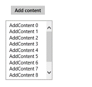
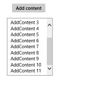

# How to scroll to the bottom of a multi-line TextBox in Windows Store apps
## License
- Apache License, Version 2.0
## Technologies
- Windows
- Windows 8
- Windows Store app Development
- Windows 8.1
## Topics
- code snippets
- multi-line textbox
- bottom
## Updated
- 09/22/2016
## Description

<strong>&nbsp;</strong><em>&nbsp;</em>

How to scroll to the bottom of a multi-line TextBox in Windows Store apps

Introduction

This code snippet will show you how to automatically scroll to the bottom when adding text by code to the TextBox.

Suppose that we click a button and add content to the TextBox now.

C#C&#43;&#43;VB

Edit|Remove

csharpcplusplusvb

<pre class="csharp" id="codePreview">private void addBtn_Click(object sender, RoutedEventArgs e)
        {
           
            textBox.Text &#43;= &quot;AddContent &quot; &#43; m_index &#43; &quot; &quot;;
            m_index&#43;&#43;;
        }
</pre>

&nbsp;

&nbsp;

When the content inside the text box is too long, the TextBox will just display the top of the content
by default. Like:

But we usually want to auto-scroll the content when adding text to the TextBox. Like:

So we&rsquo;ll implement this effect now.

Using the Code

Add TextChanged event handler first. When the text in the TextBox changes, this function will be run.
 We get Grid from the TextBox using <a href="http://msdn.microsoft.com/en-us/library/windows/apps/windows.ui.xaml.media.visualtreehelper.getchild(v=win.10).aspx" style="text-decoration:none">VisualTreeHelper.GetChild</a>.
 Then look for the ScrollViewer control in the Grid we&rsquo;ve got. Once we find the ScrollViewer, we can use
<a href="http://msdn.microsoft.com/en-us/library/windows/apps/windows.ui.xaml.controls.scrollviewer.changeview(v=win.10).aspx" style="text-decoration:none">ChangeView</a>
 to scroll the text inside the TextBox.

C#C&#43;&#43;VB

Edit|Remove

csharpcplusplusvb

<pre class="csharp" id="codePreview">private void TextBox_TextChanged(object sender, TextChangedEventArgs e)
        {
            var grid = (Grid)VisualTreeHelper.GetChild(textBox, 0);
            for (var i = 0; i &lt;= VisualTreeHelper.GetChildrenCount(grid) - 1; i&#43;&#43;)
            {
                object obj = VisualTreeHelper.GetChild(grid, i);
                if (!(obj is ScrollViewer)) continue;
                ((ScrollViewer)obj).ChangeView(0.0f, ((ScrollViewer)obj).ExtentHeight, 1.0f);
                break;
            }
        }
</pre>

&nbsp;

More Information

ScrollViewer.ChangeView methods

<a href="http://msdn.microsoft.com/en-us/library/windows/apps/windows.ui.xaml.controls.scrollviewer.changeview(v=win.10).aspx" style="text-decoration:none">http://msdn.microsoft.com/en-us/library/windows/apps/windows.ui.xaml.controls.scrollviewer.changeview(v=win.10).aspx</a>

VisualTreeHelper.GetChild method

<a href="http://msdn.microsoft.com/en-us/library/windows/apps/windows.ui.xaml.media.visualtreehelper.getchild(v=win.10).aspx" style="text-decoration:none">http://msdn.microsoft.com/en-us/library/windows/apps/windows.ui.xaml.media.visualtreehelper.getchild(v=win.10).aspx</a>

Microsoft All-In-One Code Framework is a free, centralized code sample library driven by developers' real-world pains and needs. The goal is to provide customer-driven code samples for all Microsoft development technologies,
 and reduce developers' efforts in solving typical programming tasks. Our team listens to developers&rsquo; pains in the MSDN forums, social media and various DEV communities. We write code samples based on developers&rsquo; frequently asked programming tasks,
 and allow developers to download them with a short sample publishing cycle. Additionally, we offer a free code sample request service. It is a proactive way for our developer community to obtain code samples directly from Microsoft.

