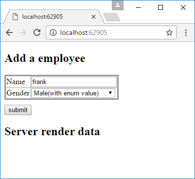
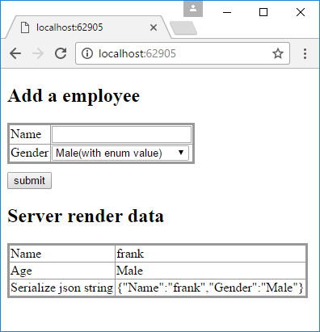

# How to serialize and deserialize enumerations with Json.NET in ASP.NET Core
## Requires
- Visual Studio 2017
## License
- Apache License, Version 2.0
## Technologies
- ASP.NET
- .NET
- Web App Development
## Topics
- ASP.NET Core
## Updated
- 04/28/2017
## Description

How to serialize and deserialize enumerations with Json.NET in ASP.NET Core

Introduction

In the default case, when serializing an object in json format, the enumerations always convert to an int type value,&nbsp;which is bad for readability.

This sample demonstrate<a name="_GoBack">s</a> how to serialize and deserialize enumerations with Json.NET.

Sample prerequisites

&bull;&nbsp;Visual Studio 2017 or above. [<a href="https://www.visualstudio.com/" style="text-decoration:none">Visual
 Studio Home Page</a>]

&bull;&nbsp;Visual Studio enabled ASP.NET Core develop component.

Building the sample

Use Visual Studio to open the sample solution, then press F6 Key to build the sample project.

Running the sample

&bull;&nbsp;Use Visual Studio to open the sample solution, then press F5 Key or select
Debug -&gt; Start Debugging from the menu.

&bull;&nbsp;When the project is running, you will see the below page in browser.

&nbsp;

&bull;&nbsp;Type a name, and select a gender, then click
submit button.

&nbsp;

Using the code

Enum

&nbsp;

C#

Edit|Remove

csharp
<pre class="hidden">    [JsonConverter(typeof(StringEnumConverter))]
    public enum Gender
    {
        Male = 0,
        Female = 1
    }
</pre>

<pre class="csharp">&nbsp;&nbsp;&nbsp;&nbsp;[JsonConverter(typeof(StringEnumConverter))]&nbsp;
&nbsp;&nbsp;&nbsp;&nbsp;public&nbsp;enum&nbsp;Gender&nbsp;
&nbsp;&nbsp;&nbsp;&nbsp;{&nbsp;
&nbsp;&nbsp;&nbsp;&nbsp;&nbsp;&nbsp;&nbsp;&nbsp;Male&nbsp;=&nbsp;0,&nbsp;
&nbsp;&nbsp;&nbsp;&nbsp;&nbsp;&nbsp;&nbsp;&nbsp;Female&nbsp;=&nbsp;1&nbsp;
&nbsp;&nbsp;&nbsp;&nbsp;}&nbsp;</pre>

&nbsp;

&nbsp;

Model

&nbsp;

C#

Edit|Remove

csharp
<pre class="hidden">    public class Employee
    {
        public string Name { get; set; }

        public Gender Gender { get; set; }
    }
</pre>

<pre class="csharp">&nbsp;&nbsp;&nbsp;&nbsp;public&nbsp;class&nbsp;Employee&nbsp;
&nbsp;&nbsp;&nbsp;&nbsp;{&nbsp;
&nbsp;&nbsp;&nbsp;&nbsp;&nbsp;&nbsp;&nbsp;&nbsp;public&nbsp;string&nbsp;Name&nbsp;{&nbsp;get;&nbsp;set;&nbsp;}&nbsp;
&nbsp;
&nbsp;&nbsp;&nbsp;&nbsp;&nbsp;&nbsp;&nbsp;&nbsp;public&nbsp;Gender&nbsp;Gender&nbsp;{&nbsp;get;&nbsp;set;&nbsp;}&nbsp;
&nbsp;&nbsp;&nbsp;&nbsp;}&nbsp;</pre>

&nbsp;

&nbsp;

Controller

&nbsp;

C#

Edit|Remove

csharp
<pre class="hidden">    public class HomeController : Controller
    {
        private static List&lt;Employee&gt; _employees = new List&lt;Employee&gt;();

        [HttpGet]
        public IActionResult Index()
        {
            return View(_employees);
        }

        [HttpPost]
        public IActionResult Index(Employee employee)
        {
            if (employee != null)
            {
                _employees.Add(employee);
            }

            return View(_employees);
        }
    }
</pre>

<pre class="csharp">&nbsp;&nbsp;&nbsp;&nbsp;public&nbsp;class&nbsp;HomeController&nbsp;:&nbsp;Controller&nbsp;
&nbsp;&nbsp;&nbsp;&nbsp;{&nbsp;
&nbsp;&nbsp;&nbsp;&nbsp;&nbsp;&nbsp;&nbsp;&nbsp;private&nbsp;static&nbsp;List&lt;Employee&gt;&nbsp;_employees&nbsp;=&nbsp;new&nbsp;List&lt;Employee&gt;();&nbsp;
&nbsp;
&nbsp;&nbsp;&nbsp;&nbsp;&nbsp;&nbsp;&nbsp;&nbsp;[HttpGet]&nbsp;
&nbsp;&nbsp;&nbsp;&nbsp;&nbsp;&nbsp;&nbsp;&nbsp;public&nbsp;IActionResult&nbsp;Index()&nbsp;
&nbsp;&nbsp;&nbsp;&nbsp;&nbsp;&nbsp;&nbsp;&nbsp;{&nbsp;
&nbsp;&nbsp;&nbsp;&nbsp;&nbsp;&nbsp;&nbsp;&nbsp;&nbsp;&nbsp;&nbsp;&nbsp;return&nbsp;View(_employees);&nbsp;
&nbsp;&nbsp;&nbsp;&nbsp;&nbsp;&nbsp;&nbsp;&nbsp;}&nbsp;
&nbsp;
&nbsp;&nbsp;&nbsp;&nbsp;&nbsp;&nbsp;&nbsp;&nbsp;[HttpPost]&nbsp;
&nbsp;&nbsp;&nbsp;&nbsp;&nbsp;&nbsp;&nbsp;&nbsp;public&nbsp;IActionResult&nbsp;Index(Employee&nbsp;employee)&nbsp;
&nbsp;&nbsp;&nbsp;&nbsp;&nbsp;&nbsp;&nbsp;&nbsp;{&nbsp;
&nbsp;&nbsp;&nbsp;&nbsp;&nbsp;&nbsp;&nbsp;&nbsp;&nbsp;&nbsp;&nbsp;&nbsp;if&nbsp;(employee&nbsp;!=&nbsp;null)&nbsp;
&nbsp;&nbsp;&nbsp;&nbsp;&nbsp;&nbsp;&nbsp;&nbsp;&nbsp;&nbsp;&nbsp;&nbsp;{&nbsp;
&nbsp;&nbsp;&nbsp;&nbsp;&nbsp;&nbsp;&nbsp;&nbsp;&nbsp;&nbsp;&nbsp;&nbsp;&nbsp;&nbsp;&nbsp;&nbsp;_employees.Add(employee);&nbsp;
&nbsp;&nbsp;&nbsp;&nbsp;&nbsp;&nbsp;&nbsp;&nbsp;&nbsp;&nbsp;&nbsp;&nbsp;}&nbsp;
&nbsp;
&nbsp;&nbsp;&nbsp;&nbsp;&nbsp;&nbsp;&nbsp;&nbsp;&nbsp;&nbsp;&nbsp;&nbsp;return&nbsp;View(_employees);&nbsp;
&nbsp;&nbsp;&nbsp;&nbsp;&nbsp;&nbsp;&nbsp;&nbsp;}&nbsp;
&nbsp;&nbsp;&nbsp;&nbsp;}&nbsp;</pre>

&nbsp;

&nbsp;

Razor

&nbsp;

HTML

Edit|Remove

html
<pre class="hidden">    &lt;form method=&quot;post&quot;&gt;
        &lt;table&gt;
            &lt;tr&gt;
                &lt;td&gt;Name&lt;/td&gt;
                &lt;td&gt;&lt;input type=&quot;text&quot; name=&quot;Name&quot; /&gt;&lt;/td&gt;
            &lt;/tr&gt;
            &lt;tr&gt;
                &lt;td&gt;Gender&lt;/td&gt;
                &lt;td&gt;
                    &lt;select name=&quot;Gender&quot;&gt;
                        &lt;option value=&quot;0&quot;&gt;Male(with enum value)&lt;/option&gt;
                        &lt;option value=&quot;1&quot;&gt;Female(with enum value)&lt;/option&gt;
                        &lt;option value=&quot;Male&quot;&gt;Male(with enum text)&lt;/option&gt;
                        &lt;option value=&quot;Female&quot;&gt;Female(with enum text)&lt;/option&gt;
                    &lt;/select&gt;
                &lt;/td&gt;
            &lt;/tr&gt;
        &lt;/table&gt;
        &lt;button id=&quot;submit&quot;&gt;submit&lt;/button&gt;
    &lt;/form&gt;

    &lt;h2&gt;Server render data&lt;/h2&gt;
    @foreach (var item in Model)
    {
        &lt;table&gt;
            &lt;tr&gt;
                &lt;td&gt;Name&lt;/td&gt;
                &lt;td&gt;@item.Name&lt;/td&gt;
            &lt;/tr&gt;
            &lt;tr&gt;
                &lt;td&gt;Age&lt;/td&gt;
                &lt;td&gt;@item.Gender&lt;/td&gt;
            &lt;/tr&gt;
            &lt;tr&gt;
                &lt;td&gt;Serialize json string&lt;/td&gt;
                &lt;td&gt;@Newtonsoft.Json.JsonConvert.SerializeObject(item)&lt;/td&gt;
            &lt;/tr&gt;
        &lt;/table&gt;
    }
</pre>

<pre class="html">&nbsp;&nbsp;&nbsp;&nbsp;&lt;form&nbsp;method=&quot;post&quot;&gt;&nbsp;
&nbsp;&nbsp;&nbsp;&nbsp;&nbsp;&nbsp;&nbsp;&nbsp;&lt;table&gt;&nbsp;
&nbsp;&nbsp;&nbsp;&nbsp;&nbsp;&nbsp;&nbsp;&nbsp;&nbsp;&nbsp;&nbsp;&nbsp;&lt;tr&gt;&nbsp;
&nbsp;&nbsp;&nbsp;&nbsp;&nbsp;&nbsp;&nbsp;&nbsp;&nbsp;&nbsp;&nbsp;&nbsp;&nbsp;&nbsp;&nbsp;&nbsp;&lt;td&gt;Name&lt;/td&gt;&nbsp;
&nbsp;&nbsp;&nbsp;&nbsp;&nbsp;&nbsp;&nbsp;&nbsp;&nbsp;&nbsp;&nbsp;&nbsp;&nbsp;&nbsp;&nbsp;&nbsp;&lt;td&gt;&lt;input&nbsp;type=&quot;text&quot;&nbsp;name=&quot;Name&quot;&nbsp;/&gt;&lt;/td&gt;&nbsp;
&nbsp;&nbsp;&nbsp;&nbsp;&nbsp;&nbsp;&nbsp;&nbsp;&nbsp;&nbsp;&nbsp;&nbsp;&lt;/tr&gt;&nbsp;
&nbsp;&nbsp;&nbsp;&nbsp;&nbsp;&nbsp;&nbsp;&nbsp;&nbsp;&nbsp;&nbsp;&nbsp;&lt;tr&gt;&nbsp;
&nbsp;&nbsp;&nbsp;&nbsp;&nbsp;&nbsp;&nbsp;&nbsp;&nbsp;&nbsp;&nbsp;&nbsp;&nbsp;&nbsp;&nbsp;&nbsp;&lt;td&gt;Gender&lt;/td&gt;&nbsp;
&nbsp;&nbsp;&nbsp;&nbsp;&nbsp;&nbsp;&nbsp;&nbsp;&nbsp;&nbsp;&nbsp;&nbsp;&nbsp;&nbsp;&nbsp;&nbsp;&lt;td&gt;&nbsp;
&nbsp;&nbsp;&nbsp;&nbsp;&nbsp;&nbsp;&nbsp;&nbsp;&nbsp;&nbsp;&nbsp;&nbsp;&nbsp;&nbsp;&nbsp;&nbsp;&nbsp;&nbsp;&nbsp;&nbsp;&lt;select&nbsp;name=&quot;Gender&quot;&gt;&nbsp;
&nbsp;&nbsp;&nbsp;&nbsp;&nbsp;&nbsp;&nbsp;&nbsp;&nbsp;&nbsp;&nbsp;&nbsp;&nbsp;&nbsp;&nbsp;&nbsp;&nbsp;&nbsp;&nbsp;&nbsp;&nbsp;&nbsp;&nbsp;&nbsp;&lt;option&nbsp;value=&quot;0&quot;&gt;Male(with&nbsp;enum&nbsp;value)&lt;/option&gt;&nbsp;
&nbsp;&nbsp;&nbsp;&nbsp;&nbsp;&nbsp;&nbsp;&nbsp;&nbsp;&nbsp;&nbsp;&nbsp;&nbsp;&nbsp;&nbsp;&nbsp;&nbsp;&nbsp;&nbsp;&nbsp;&nbsp;&nbsp;&nbsp;&nbsp;&lt;option&nbsp;value=&quot;1&quot;&gt;Female(with&nbsp;enum&nbsp;value)&lt;/option&gt;&nbsp;
&nbsp;&nbsp;&nbsp;&nbsp;&nbsp;&nbsp;&nbsp;&nbsp;&nbsp;&nbsp;&nbsp;&nbsp;&nbsp;&nbsp;&nbsp;&nbsp;&nbsp;&nbsp;&nbsp;&nbsp;&nbsp;&nbsp;&nbsp;&nbsp;&lt;option&nbsp;value=&quot;Male&quot;&gt;Male(with&nbsp;enum&nbsp;text)&lt;/option&gt;&nbsp;
&nbsp;&nbsp;&nbsp;&nbsp;&nbsp;&nbsp;&nbsp;&nbsp;&nbsp;&nbsp;&nbsp;&nbsp;&nbsp;&nbsp;&nbsp;&nbsp;&nbsp;&nbsp;&nbsp;&nbsp;&nbsp;&nbsp;&nbsp;&nbsp;&lt;option&nbsp;value=&quot;Female&quot;&gt;Female(with&nbsp;enum&nbsp;text)&lt;/option&gt;&nbsp;
&nbsp;&nbsp;&nbsp;&nbsp;&nbsp;&nbsp;&nbsp;&nbsp;&nbsp;&nbsp;&nbsp;&nbsp;&nbsp;&nbsp;&nbsp;&nbsp;&nbsp;&nbsp;&nbsp;&nbsp;&lt;/select&gt;&nbsp;
&nbsp;&nbsp;&nbsp;&nbsp;&nbsp;&nbsp;&nbsp;&nbsp;&nbsp;&nbsp;&nbsp;&nbsp;&nbsp;&nbsp;&nbsp;&nbsp;&lt;/td&gt;&nbsp;
&nbsp;&nbsp;&nbsp;&nbsp;&nbsp;&nbsp;&nbsp;&nbsp;&nbsp;&nbsp;&nbsp;&nbsp;&lt;/tr&gt;&nbsp;
&nbsp;&nbsp;&nbsp;&nbsp;&nbsp;&nbsp;&nbsp;&nbsp;&lt;/table&gt;&nbsp;
&nbsp;&nbsp;&nbsp;&nbsp;&nbsp;&nbsp;&nbsp;&nbsp;&lt;button&nbsp;id=&quot;submit&quot;&gt;submit&lt;/button&gt;&nbsp;
&nbsp;&nbsp;&nbsp;&nbsp;&lt;/form&gt;&nbsp;
&nbsp;
&nbsp;&nbsp;&nbsp;&nbsp;&lt;h2&gt;Server&nbsp;render&nbsp;data&lt;/h2&gt;&nbsp;
&nbsp;&nbsp;&nbsp;&nbsp;@foreach&nbsp;(var&nbsp;item&nbsp;in&nbsp;Model)&nbsp;
&nbsp;&nbsp;&nbsp;&nbsp;{&nbsp;
&nbsp;&nbsp;&nbsp;&nbsp;&nbsp;&nbsp;&nbsp;&nbsp;&lt;table&gt;&nbsp;
&nbsp;&nbsp;&nbsp;&nbsp;&nbsp;&nbsp;&nbsp;&nbsp;&nbsp;&nbsp;&nbsp;&nbsp;&lt;tr&gt;&nbsp;
&nbsp;&nbsp;&nbsp;&nbsp;&nbsp;&nbsp;&nbsp;&nbsp;&nbsp;&nbsp;&nbsp;&nbsp;&nbsp;&nbsp;&nbsp;&nbsp;&lt;td&gt;Name&lt;/td&gt;&nbsp;
&nbsp;&nbsp;&nbsp;&nbsp;&nbsp;&nbsp;&nbsp;&nbsp;&nbsp;&nbsp;&nbsp;&nbsp;&nbsp;&nbsp;&nbsp;&nbsp;&lt;td&gt;@item.Name&lt;/td&gt;&nbsp;
&nbsp;&nbsp;&nbsp;&nbsp;&nbsp;&nbsp;&nbsp;&nbsp;&nbsp;&nbsp;&nbsp;&nbsp;&lt;/tr&gt;&nbsp;
&nbsp;&nbsp;&nbsp;&nbsp;&nbsp;&nbsp;&nbsp;&nbsp;&nbsp;&nbsp;&nbsp;&nbsp;&lt;tr&gt;&nbsp;
&nbsp;&nbsp;&nbsp;&nbsp;&nbsp;&nbsp;&nbsp;&nbsp;&nbsp;&nbsp;&nbsp;&nbsp;&nbsp;&nbsp;&nbsp;&nbsp;&lt;td&gt;Age&lt;/td&gt;&nbsp;
&nbsp;&nbsp;&nbsp;&nbsp;&nbsp;&nbsp;&nbsp;&nbsp;&nbsp;&nbsp;&nbsp;&nbsp;&nbsp;&nbsp;&nbsp;&nbsp;&lt;td&gt;@item.Gender&lt;/td&gt;&nbsp;
&nbsp;&nbsp;&nbsp;&nbsp;&nbsp;&nbsp;&nbsp;&nbsp;&nbsp;&nbsp;&nbsp;&nbsp;&lt;/tr&gt;&nbsp;
&nbsp;&nbsp;&nbsp;&nbsp;&nbsp;&nbsp;&nbsp;&nbsp;&nbsp;&nbsp;&nbsp;&nbsp;&lt;tr&gt;&nbsp;
&nbsp;&nbsp;&nbsp;&nbsp;&nbsp;&nbsp;&nbsp;&nbsp;&nbsp;&nbsp;&nbsp;&nbsp;&nbsp;&nbsp;&nbsp;&nbsp;&lt;td&gt;Serialize&nbsp;json&nbsp;string&lt;/td&gt;&nbsp;
&nbsp;&nbsp;&nbsp;&nbsp;&nbsp;&nbsp;&nbsp;&nbsp;&nbsp;&nbsp;&nbsp;&nbsp;&nbsp;&nbsp;&nbsp;&nbsp;&lt;td&gt;@Newtonsoft.Json.JsonConvert.SerializeObject(item)&lt;/td&gt;&nbsp;
&nbsp;&nbsp;&nbsp;&nbsp;&nbsp;&nbsp;&nbsp;&nbsp;&nbsp;&nbsp;&nbsp;&nbsp;&lt;/tr&gt;&nbsp;
&nbsp;&nbsp;&nbsp;&nbsp;&nbsp;&nbsp;&nbsp;&nbsp;&lt;/table&gt;&nbsp;
&nbsp;&nbsp;&nbsp;&nbsp;}&nbsp;</pre>

&nbsp;

More information

Serialization Attributes

<a href="http://www.newtonsoft.com/json/help/html/SerializationAttributes.htm" style="text-decoration:none">http://www.newtonsoft.com/json/help/html/SerializationAttributes.htm</a>

&nbsp;

&nbsp;

Microsoft All-In-One Code Framework is a free, centralized code sample library driven by developers' real-world pains and needs. The goal is to provide customer-driven code samples for all Microsoft development technologies,
 and reduce developers' efforts in solving typical programming tasks. Our team listens to developers&rsquo; pains in the MSDN forums, social media and various DEV communities. We write code samples based on developers&rsquo; frequently asked programming tasks,
 and allow developers to download them with a short sample publishing cycle. Additionally, we offer a free code sample request service. It is a proactive way for our developer community to obtain code samples directly from Microsoft.

