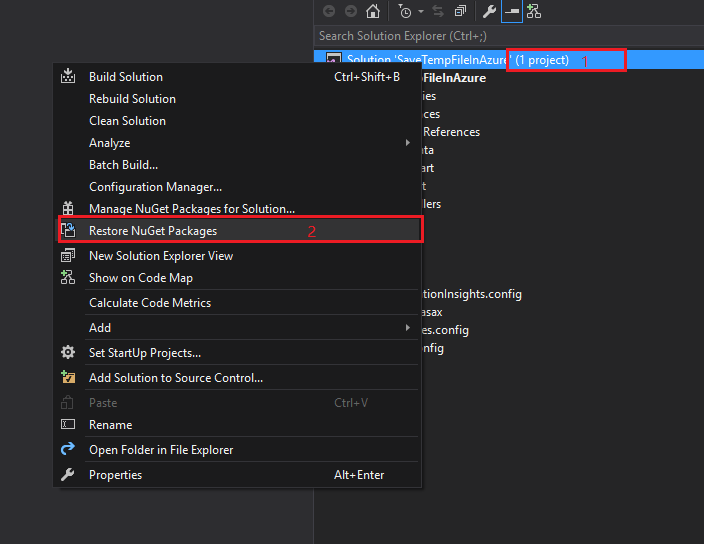
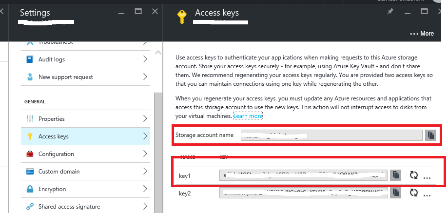
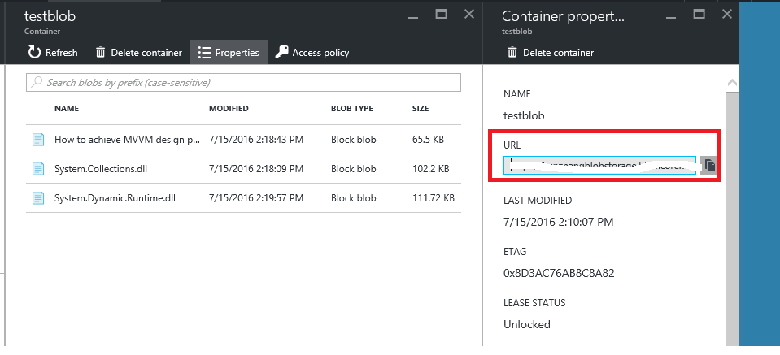
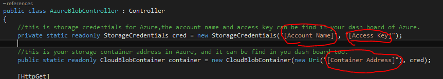

# How to store temp files in Azure applications
## Requires
- 
## License
- Apache License, Version 2.0
## Technologies
- Azure
- Storage
- Cloud
- Azure Data Services
## Topics
- Azure
- Storage
- temp
## Updated
- 09/22/2016
## Description

<strong>&nbsp;</strong><em></em>

How to store temp files in Azure applications

<h2 style="margin-left:0pt; margin-right:0pt; margin-top:10pt; margin-bottom:0pt; font-size:10.0pt; line-height:27.6pt; direction:ltr; unicode-bidi:normal">
Download this sample</h2>

To download this sample, click
<a href="https://github.com/Azure-Samples/storage-blob-dotnet-store-temp-files/archive/master.zip">
here</a>.

<h2>Introduction</h2>

This sample demonstrates how to store temp file in Azure applications.

We have two solutions：

&bull;&nbsp;First one is traditional way to call &lsquo;Path.GetTempPath()&rsquo; to store temp file in all windows
 platform

&bull;&nbsp;The other is azure specific way to use blob object in Azure to simulate temp file.

Building the Sample

&bull;&nbsp;Double click CSAzureTempFiles.sln file to open this sample solution by using Microsoft Visual Studio 2012 or the later version(s).

&bull;&nbsp;Restore nugget packages in the solution

&bull;&nbsp;Copy account name, access key and address of your azure storage account.

&bull;&nbsp;Configure necessary parameters about account name, key and address in the solution in file Controllers\AzureBlobController.cs

Running the Sample

You can upload the sample to your Azure storage, or run at your local IIS, or just debug it in your Visual Studio.

Using the Code

Solution1:

&nbsp;

C#

Edit|Remove

csharp
<pre class="hidden">private void SaveTempFile(HttpPostedFileBase file) 
{ 
	//get the uploaded file name 
	string fileName = file.FileName; 

	//get temp directory path 
	string tempPath = Path.GetTempPath(); 

	//init the file path 
	string filePath = tempPath &#43; fileName; 

	//if the path is exists,delete old file 
	if (System.IO.File.Exists(filePath)) 
	{ 
		System.IO.File.Delete(filePath); 
	} 

	//and then save new file 
	file.SaveAs(filePath); 
} </pre>

<pre class="csharp">private&nbsp;void&nbsp;SaveTempFile(HttpPostedFileBase&nbsp;file)&nbsp;&nbsp;
{&nbsp;&nbsp;
&nbsp;&nbsp;&nbsp;&nbsp;//get&nbsp;the&nbsp;uploaded&nbsp;file&nbsp;name&nbsp;&nbsp;
&nbsp;&nbsp;&nbsp;&nbsp;string&nbsp;fileName&nbsp;=&nbsp;file.FileName;&nbsp;&nbsp;
&nbsp;
&nbsp;&nbsp;&nbsp;&nbsp;//get&nbsp;temp&nbsp;directory&nbsp;path&nbsp;&nbsp;
&nbsp;&nbsp;&nbsp;&nbsp;string&nbsp;tempPath&nbsp;=&nbsp;Path.GetTempPath();&nbsp;&nbsp;
&nbsp;
&nbsp;&nbsp;&nbsp;&nbsp;//init&nbsp;the&nbsp;file&nbsp;path&nbsp;&nbsp;
&nbsp;&nbsp;&nbsp;&nbsp;string&nbsp;filePath&nbsp;=&nbsp;tempPath&nbsp;&#43;&nbsp;fileName;&nbsp;&nbsp;
&nbsp;
&nbsp;&nbsp;&nbsp;&nbsp;//if&nbsp;the&nbsp;path&nbsp;is&nbsp;exists,delete&nbsp;old&nbsp;file&nbsp;&nbsp;
&nbsp;&nbsp;&nbsp;&nbsp;if&nbsp;(System.IO.File.Exists(filePath))&nbsp;&nbsp;
&nbsp;&nbsp;&nbsp;&nbsp;{&nbsp;&nbsp;
&nbsp;&nbsp;&nbsp;&nbsp;&nbsp;&nbsp;&nbsp;&nbsp;System.IO.File.Delete(filePath);&nbsp;&nbsp;
&nbsp;&nbsp;&nbsp;&nbsp;}&nbsp;&nbsp;
&nbsp;
&nbsp;&nbsp;&nbsp;&nbsp;//and&nbsp;then&nbsp;save&nbsp;new&nbsp;file&nbsp;&nbsp;
&nbsp;&nbsp;&nbsp;&nbsp;file.SaveAs(filePath);&nbsp;&nbsp;
}&nbsp;</pre>

&nbsp;Solution 2:

C#

Edit|Remove

csharp
<pre class="hidden">private async Task SaveTempFile(string fileName, long contentLenght, Stream inputStream)
{
	try
	{
		//firstly, we need check the container if exists or not. And if not, we need to create one.
		await container.CreateIfNotExistsAsync();

		//init a blobReference
		CloudBlockBlob tempFileBlob = container.GetBlockBlobReference(fileName);

		//if the blobReference is exists, delete the old blob
		tempFileBlob.DeleteIfExists();

		//check the count of blob if over limit or not, if yes, clear them.
		await CleanStorageIfReachLimit(contentLenght);

		//and upload the new file in this
		tempFileBlob.UploadFromStream(inputStream);
	}
	catch (Exception ex)
	{
		if (ex.InnerException != null)
		{
			throw ex.InnerException;
		}
		else
		{
			throw ex;
		}
	}
}

//check the count of blob if over limit or not, if yes, clear them.
private async Task CleanStorageIfReachLimit(long newFileLength)
{
	List&lt;CloudBlob&gt; blobs = container.ListBlobs()
		.OfType&lt;CloudBlob&gt;()
		.OrderBy(m =&gt; m.Properties.LastModified)
		.ToList();

	//get total size of all blobs.
	long totalSize = blobs.Sum(m =&gt; m.Properties.Length);

	//calculate out the real limit size of before upload
	long realLimetSize = TotalLimitSizeOfTempFiles - newFileLength;

	//delete all,when the free size is enough, break this loop,and stop delete blob anymore
	foreach (CloudBlob item in blobs)
	{
		if (totalSize &lt;= realLimetSize)
		{
			break;
		}

		await item.DeleteIfExistsAsync();
		totalSize -= item.Properties.Length;
	}
}</pre>

<pre class="csharp">private&nbsp;async&nbsp;Task&nbsp;SaveTempFile(string&nbsp;fileName,&nbsp;long&nbsp;contentLenght,&nbsp;Stream&nbsp;inputStream)&nbsp;
{&nbsp;
&nbsp;&nbsp;&nbsp;&nbsp;try&nbsp;
&nbsp;&nbsp;&nbsp;&nbsp;{&nbsp;
&nbsp;&nbsp;&nbsp;&nbsp;&nbsp;&nbsp;&nbsp;&nbsp;//firstly,&nbsp;we&nbsp;need&nbsp;check&nbsp;the&nbsp;container&nbsp;if&nbsp;exists&nbsp;or&nbsp;not.&nbsp;And&nbsp;if&nbsp;not,&nbsp;we&nbsp;need&nbsp;to&nbsp;create&nbsp;one.&nbsp;
&nbsp;&nbsp;&nbsp;&nbsp;&nbsp;&nbsp;&nbsp;&nbsp;await&nbsp;container.CreateIfNotExistsAsync();&nbsp;
&nbsp;
&nbsp;&nbsp;&nbsp;&nbsp;&nbsp;&nbsp;&nbsp;&nbsp;//init&nbsp;a&nbsp;blobReference&nbsp;
&nbsp;&nbsp;&nbsp;&nbsp;&nbsp;&nbsp;&nbsp;&nbsp;CloudBlockBlob&nbsp;tempFileBlob&nbsp;=&nbsp;container.GetBlockBlobReference(fileName);&nbsp;
&nbsp;
&nbsp;&nbsp;&nbsp;&nbsp;&nbsp;&nbsp;&nbsp;&nbsp;//if&nbsp;the&nbsp;blobReference&nbsp;is&nbsp;exists,&nbsp;delete&nbsp;the&nbsp;old&nbsp;blob&nbsp;
&nbsp;&nbsp;&nbsp;&nbsp;&nbsp;&nbsp;&nbsp;&nbsp;tempFileBlob.DeleteIfExists();&nbsp;
&nbsp;
&nbsp;&nbsp;&nbsp;&nbsp;&nbsp;&nbsp;&nbsp;&nbsp;//check&nbsp;the&nbsp;count&nbsp;of&nbsp;blob&nbsp;if&nbsp;over&nbsp;limit&nbsp;or&nbsp;not,&nbsp;if&nbsp;yes,&nbsp;clear&nbsp;them.&nbsp;
&nbsp;&nbsp;&nbsp;&nbsp;&nbsp;&nbsp;&nbsp;&nbsp;await&nbsp;CleanStorageIfReachLimit(contentLenght);&nbsp;
&nbsp;
&nbsp;&nbsp;&nbsp;&nbsp;&nbsp;&nbsp;&nbsp;&nbsp;//and&nbsp;upload&nbsp;the&nbsp;new&nbsp;file&nbsp;in&nbsp;this&nbsp;
&nbsp;&nbsp;&nbsp;&nbsp;&nbsp;&nbsp;&nbsp;&nbsp;tempFileBlob.UploadFromStream(inputStream);&nbsp;
&nbsp;&nbsp;&nbsp;&nbsp;}&nbsp;
&nbsp;&nbsp;&nbsp;&nbsp;catch&nbsp;(Exception&nbsp;ex)&nbsp;
&nbsp;&nbsp;&nbsp;&nbsp;{&nbsp;
&nbsp;&nbsp;&nbsp;&nbsp;&nbsp;&nbsp;&nbsp;&nbsp;if&nbsp;(ex.InnerException&nbsp;!=&nbsp;null)&nbsp;
&nbsp;&nbsp;&nbsp;&nbsp;&nbsp;&nbsp;&nbsp;&nbsp;{&nbsp;
&nbsp;&nbsp;&nbsp;&nbsp;&nbsp;&nbsp;&nbsp;&nbsp;&nbsp;&nbsp;&nbsp;&nbsp;throw&nbsp;ex.InnerException;&nbsp;
&nbsp;&nbsp;&nbsp;&nbsp;&nbsp;&nbsp;&nbsp;&nbsp;}&nbsp;
&nbsp;&nbsp;&nbsp;&nbsp;&nbsp;&nbsp;&nbsp;&nbsp;else&nbsp;
&nbsp;&nbsp;&nbsp;&nbsp;&nbsp;&nbsp;&nbsp;&nbsp;{&nbsp;
&nbsp;&nbsp;&nbsp;&nbsp;&nbsp;&nbsp;&nbsp;&nbsp;&nbsp;&nbsp;&nbsp;&nbsp;throw&nbsp;ex;&nbsp;
&nbsp;&nbsp;&nbsp;&nbsp;&nbsp;&nbsp;&nbsp;&nbsp;}&nbsp;
&nbsp;&nbsp;&nbsp;&nbsp;}&nbsp;
}&nbsp;
&nbsp;
//check&nbsp;the&nbsp;count&nbsp;of&nbsp;blob&nbsp;if&nbsp;over&nbsp;limit&nbsp;or&nbsp;not,&nbsp;if&nbsp;yes,&nbsp;clear&nbsp;them.&nbsp;
private&nbsp;async&nbsp;Task&nbsp;CleanStorageIfReachLimit(long&nbsp;newFileLength)&nbsp;
{&nbsp;
&nbsp;&nbsp;&nbsp;&nbsp;List&lt;CloudBlob&gt;&nbsp;blobs&nbsp;=&nbsp;container.ListBlobs()&nbsp;
&nbsp;&nbsp;&nbsp;&nbsp;&nbsp;&nbsp;&nbsp;&nbsp;.OfType&lt;CloudBlob&gt;()&nbsp;
&nbsp;&nbsp;&nbsp;&nbsp;&nbsp;&nbsp;&nbsp;&nbsp;.OrderBy(m&nbsp;=&gt;&nbsp;m.Properties.LastModified)&nbsp;
&nbsp;&nbsp;&nbsp;&nbsp;&nbsp;&nbsp;&nbsp;&nbsp;.ToList();&nbsp;
&nbsp;
&nbsp;&nbsp;&nbsp;&nbsp;//get&nbsp;total&nbsp;size&nbsp;of&nbsp;all&nbsp;blobs.&nbsp;
&nbsp;&nbsp;&nbsp;&nbsp;long&nbsp;totalSize&nbsp;=&nbsp;blobs.Sum(m&nbsp;=&gt;&nbsp;m.Properties.Length);&nbsp;
&nbsp;
&nbsp;&nbsp;&nbsp;&nbsp;//calculate&nbsp;out&nbsp;the&nbsp;real&nbsp;limit&nbsp;size&nbsp;of&nbsp;before&nbsp;upload&nbsp;
&nbsp;&nbsp;&nbsp;&nbsp;long&nbsp;realLimetSize&nbsp;=&nbsp;TotalLimitSizeOfTempFiles&nbsp;-&nbsp;newFileLength;&nbsp;
&nbsp;
&nbsp;&nbsp;&nbsp;&nbsp;//delete&nbsp;all,when&nbsp;the&nbsp;free&nbsp;size&nbsp;is&nbsp;enough,&nbsp;break&nbsp;this&nbsp;loop,and&nbsp;stop&nbsp;delete&nbsp;blob&nbsp;anymore&nbsp;
&nbsp;&nbsp;&nbsp;&nbsp;foreach&nbsp;(CloudBlob&nbsp;item&nbsp;in&nbsp;blobs)&nbsp;
&nbsp;&nbsp;&nbsp;&nbsp;{&nbsp;
&nbsp;&nbsp;&nbsp;&nbsp;&nbsp;&nbsp;&nbsp;&nbsp;if&nbsp;(totalSize&nbsp;&lt;=&nbsp;realLimetSize)&nbsp;
&nbsp;&nbsp;&nbsp;&nbsp;&nbsp;&nbsp;&nbsp;&nbsp;{&nbsp;
&nbsp;&nbsp;&nbsp;&nbsp;&nbsp;&nbsp;&nbsp;&nbsp;&nbsp;&nbsp;&nbsp;&nbsp;break;&nbsp;
&nbsp;&nbsp;&nbsp;&nbsp;&nbsp;&nbsp;&nbsp;&nbsp;}&nbsp;
&nbsp;
&nbsp;&nbsp;&nbsp;&nbsp;&nbsp;&nbsp;&nbsp;&nbsp;await&nbsp;item.DeleteIfExistsAsync();&nbsp;
&nbsp;&nbsp;&nbsp;&nbsp;&nbsp;&nbsp;&nbsp;&nbsp;totalSize&nbsp;-=&nbsp;item.Properties.Length;&nbsp;
&nbsp;&nbsp;&nbsp;&nbsp;}&nbsp;
}</pre>

&nbsp;More Information and Resources

&nbsp;

&bull;&nbsp;Microsoft Azure storage documents:
<a href="https://azure.microsoft.com/en-us/documentation/services/storage" style="text-decoration:none">https://azure.microsoft.com/en-us/documentation/services/storage</a>

Microsoft All-In-One Code Framework is a free, centralized code sample library driven by developers' real-world pains and needs. The goal is to provide customer-driven code samples for all Microsoft development technologies,
 and reduce developers' efforts in solving typical programming tasks. Our team listens to developers&rsquo; pains in the MSDN forums, social media and various DEV communities. We write code samples based on developers&rsquo; frequently asked programming tasks,
 and allow developers to download them with a short sample publishing cycle. Additionally, we offer a free code sample request service. It is a proactive way for our developer community to obtain code samples directly from Microsoft.

