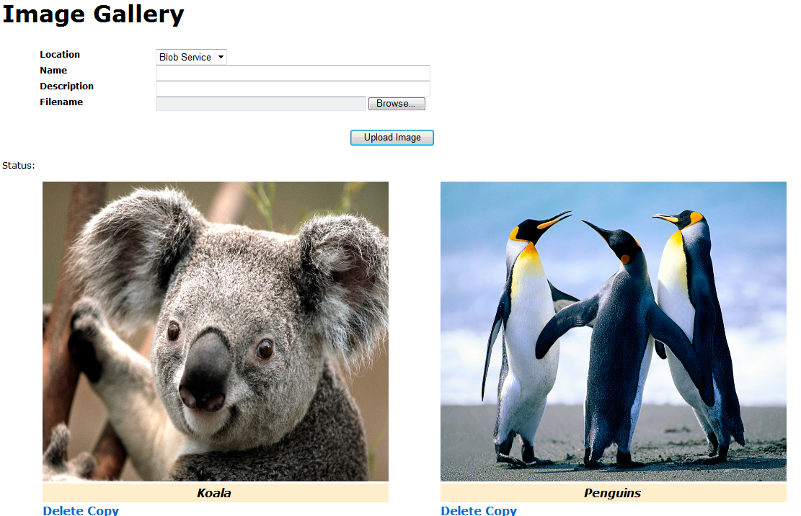

# How to store the images in Microsoft Azure SQL Database
## Requires
- Visual Studio 2013
## License
- Apache License, Version 2.0
## Technologies
- Microsoft Azure
- Microsoft Azure SQL Database
## Topics
- SQL Azure
- Image
- BLOB
## Updated
- 04/12/2015
## Description

<h1>在 Windows Azure SQL Server 中存储图像 (CSSQLAzureStoreImages)</h1>
<h2>简介</h2>

此示例演示如何在 Windows Azure SQL Server 中存储图像。

有时开发人员需要在 Windows Azure 中存储文件。在此示例中，我们将介绍两种方法来实现此功能：

1. 在 SQL Azure 中存储图像数据。搜索和管理图像很简单。

2. 将图像存储在 Blob 中，将 Blob 的 Uri 存储在 SQL Azure 中。Blob 的空间更便宜。如果我们可以将图像存储在 Blob 中，并将图像信息存储在 SQL Azure 中，管理图像也很简单。

<h2>生成示例</h2>

将示例部署到云之前，您需要完成以下步骤：

步骤 1.根据您的服务器名、用户名和密码修改 Web.config 文件中的连接字符串

XML

Edit|Remove

xml

<pre class="xml">&lt;add&nbsp;name=&quot;ImagesContext&quot;&nbsp;connectionString=&quot;Server=tcp:&lt;servername&gt;.database.windows.net,1433;Database=ImagesDb;User&nbsp;ID=&lt;username&gt;@&lt;servername&gt;;Password=&lt;password&gt;;Trusted_Connection=False;Encrypt=True;MultipleActiveResultSets=True;&quot;&nbsp;providerName=&quot;System.Data.SqlClient&quot;/&gt;&nbsp;
</pre>

&nbsp;

&nbsp;

步骤 2.根据您存储的用户帐户和密钥修改 StorageConnectionString 和 Microsoft.WindowsAzure.Plugins.Diagnostics.ConnectionString 的&#20540;。您可以参考<a href="http://code.msdn.microsoft.com/How-to-store-the-in-SQL-6c6a46b5/http://code.msdn.microsoft.com/How-to-store-the-in-SQL-6c6a46b5/https://www.windowsazure.com/en-us/develop/net/how-to-guides/blob-storage/#header-4">此内容</a>。

<h2>运行示例</h2>

将此示例部署到云之后，您可以访问网络。

1.&nbsp;&nbsp;选择用于存储图像的位置。

2. 选择要上载的图像。

3. 您可以删除和复制图像

<h2>使用代码</h2>

<strong>1. 将图像存储在 SQL Azure 中。</strong>

&nbsp;&nbsp;&nbsp;&nbsp;&nbsp;<strong>a. 模型类</strong>

我们使用以下类构建存储图像信息和图像数据的两个表。

C#

Edit|Remove

csharp

<pre id="codePreview" class="csharp">public class ImageInSQLAzure
{
&nbsp;&nbsp;&nbsp; [Key]
&nbsp;&nbsp;&nbsp; public Int32 ImageId { get; set; }
&nbsp;&nbsp;&nbsp; public String FileName { get; set; }
&nbsp;&nbsp;&nbsp; public String ImageName { get; set; }
&nbsp;&nbsp;&nbsp; public String Description { get; set; }
}

public class ImagesTable
{
&nbsp;&nbsp;&nbsp; [Key]
&nbsp;&nbsp;&nbsp; public Int32 Id { get; set; }

&nbsp;&nbsp;&nbsp; [Column(TypeName = &quot;image&quot;)]
&nbsp;&nbsp;&nbsp; public byte[] ImageData { get; set; }

&nbsp;&nbsp;&nbsp; public Int32 ImageId { get; set; }
&nbsp;&nbsp;&nbsp; [ForeignKey(&quot;ImageId&quot;)]
&nbsp;&nbsp;&nbsp; public ImageInSQLAzure ImageInfo { get; set; }
}

</pre>

&nbsp;

<strong>&nbsp; &nbsp;&nbsp;&nbsp;b. 显示库</strong>

我们将图像信息绑定到 ListView。

C#

Edit|Remove

csharp

<pre id="codePreview" class="csharp">this.images.DataSource = imagesDb.SQLAzureImages.ToList();

</pre>

&nbsp;然后我们将图像的 Uri 设置为 GetImage.ashx 和 ImageId。

C#

Edit|Remove

csharp

<pre id="codePreview" class="csharp">img.ImageUrl = &quot;GetImage.ashx?ImageId=&quot; &#43; image.ImageId;
</pre>

在 GetImage.ashx 中，我们将根据 SQL Azure 中的 ImageId 获取图像，并返回给客户端。

C#

Edit|Remove

csharp

<pre id="codePreview" class="csharp">context.Response.ContentType = &quot;image/jpeg&quot;;

Int32 imageId = Int32.Parse(context.Request.QueryString[&quot;ImageId&quot;]);
ImagesTable image = (from i in imagesDb.ImagesTable
&nbsp;&nbsp;&nbsp;&nbsp;&nbsp;&nbsp;&nbsp;&nbsp;&nbsp;&nbsp;&nbsp;&nbsp;&nbsp;&nbsp;&nbsp;&nbsp;&nbsp;&nbsp;&nbsp;&nbsp; where i.ImageId == imageId
&nbsp;&nbsp;&nbsp;&nbsp;&nbsp;&nbsp;&nbsp;&nbsp;&nbsp;&nbsp;&nbsp;&nbsp;&nbsp;&nbsp;&nbsp;&nbsp;&nbsp;&nbsp;&nbsp;&nbsp; select i).FirstOrDefault();
if (image != null)
{
&nbsp;&nbsp;&nbsp; context.Response.BinaryWrite(image.ImageData);
}

</pre>

&nbsp;

现在，我们可以在浏览器中查看图像库。

<strong>&nbsp;&nbsp;&nbsp;&nbsp;&nbsp;c. 上载图像</strong>

您还可以将图像上载至 SQL Azure。我们只需将图像信息和数据存储到类，并保存更改。现在，图像即位于 SQL Azure 的数据库中。

C#

Edit|Remove

csharp

<pre id="codePreview" class="csharp">ImageInSQLAzure newImageInfo = new ImageInSQLAzure();
ImagesTable newImage = new ImagesTable();

newImageInfo.FileName = fileName;
newImageInfo.ImageName = string.IsNullOrEmpty(name) ? &quot;unknown&quot; : name;
newImageInfo.Description = string.IsNullOrEmpty(description) ? &quot;unknown&quot; : description;

newImage.ImageInfo = newImageInfo;
newImage.ImageData = data;

imagesDb.SQLAzureImages.Add(newImageInfo);
imagesDb.ImagesTable.Add(newImage);
imagesDb.SaveChanges();

</pre>

&nbsp;

<strong>&nbsp; &nbsp;&nbsp;d. 删除图像</strong>

我们首先根据 ImageId 获取图像，然后将其删除。

VB

Edit|Remove

vb

<pre id="codePreview" class="vb">ImagesTable deletedImage = (from i in imagesDb.ImagesTable
&nbsp;&nbsp;&nbsp;&nbsp;&nbsp;&nbsp;&nbsp;&nbsp;&nbsp;&nbsp;&nbsp;&nbsp;&nbsp;&nbsp;&nbsp;&nbsp;&nbsp;&nbsp;&nbsp;&nbsp;&nbsp;&nbsp;&nbsp;&nbsp;&nbsp;&nbsp;&nbsp; where i.ImageId == imageId
&nbsp;&nbsp;&nbsp;&nbsp;&nbsp;&nbsp;&nbsp;&nbsp;&nbsp;&nbsp;&nbsp;&nbsp;&nbsp;&nbsp;&nbsp;&nbsp;&nbsp;&nbsp;&nbsp;&nbsp;&nbsp;&nbsp;&nbsp;&nbsp;&nbsp;&nbsp;&nbsp; select i).FirstOrDefault();

if (deletedImage != null)
{
&nbsp;&nbsp;&nbsp; ImageInSQLAzure deletedImageInfo = deletedImage.ImageInfo;

&nbsp;&nbsp;&nbsp; imagesDb.SQLAzureImages.Remove(deletedImageInfo);
&nbsp;&nbsp;&nbsp; imagesDb.ImagesTable.Remove(deletedImage);
&nbsp;&nbsp;&nbsp; imagesDb.SaveChanges();
}

</pre>

&nbsp;

&nbsp;

<strong>e. 复制图像</strong>

我们首先根据 ImageId 获取源图像，然后再创建新图像。保存更改后，新的图像现在即位于数据库中。

C#

Edit|Remove

csharp

<pre id="codePreview" class="csharp">ImagesTable copiedImage = (from i in imagesDb.ImagesTable
&nbsp;&nbsp;&nbsp;&nbsp;&nbsp;&nbsp;&nbsp;&nbsp;&nbsp;&nbsp;&nbsp;&nbsp;&nbsp;&nbsp;&nbsp;&nbsp;&nbsp;&nbsp;&nbsp;&nbsp;&nbsp;&nbsp;&nbsp;&nbsp;&nbsp;&nbsp; where i.ImageId == imageId
&nbsp;&nbsp;&nbsp;&nbsp;&nbsp;&nbsp;&nbsp;&nbsp;&nbsp;&nbsp;&nbsp;&nbsp;&nbsp;&nbsp;&nbsp;&nbsp;&nbsp;&nbsp;&nbsp;&nbsp;&nbsp;&nbsp;&nbsp;&nbsp;&nbsp;&nbsp; select i).FirstOrDefault();

if (copiedImage != null)
{
&nbsp;&nbsp;&nbsp; ImageInSQLAzure copiedImageInfo = copiedImage.ImageInfo;
&nbsp;&nbsp;&nbsp; ImagesTable newImage = new ImagesTable();
&nbsp;&nbsp;&nbsp; ImageInSQLAzure newImageInfo = new ImageInSQLAzure();

&nbsp;&nbsp;&nbsp; // Copy the info of image.
&nbsp;&nbsp;&nbsp; newImageInfo.FileName = copiedImageInfo.FileName;
&nbsp;&nbsp;&nbsp; newImageInfo.ImageName = &quot;Copy of \&quot;&quot; &#43; copiedImageInfo.ImageName &#43; &quot;\&quot;&quot;;
&nbsp;&nbsp;&nbsp; newImageInfo.Description = copiedImageInfo.Description;

&nbsp;&nbsp;&nbsp; newImage.ImageData = copiedImage.ImageData;
&nbsp;&nbsp;&nbsp; newImage.ImageInfo = newImageInfo;

&nbsp;&nbsp;&nbsp; imagesDb.SQLAzureImages.Add(newImageInfo);
&nbsp;&nbsp;&nbsp; imagesDb.ImagesTable.Add(newImage);
&nbsp;&nbsp;&nbsp; imagesDb.SaveChanges();

&nbsp;&nbsp;&nbsp; this.RefreshGallery();
}

</pre>

&nbsp;

<strong>2. 将图像存储在 Blob 中</strong>

<strong>&nbsp;&nbsp;&nbsp;&nbsp;a. 模型类</strong>

我们使用以下类构建一个表来存储图像信息和 Blob 的 Uri。

C#

Edit|Remove

csharp

<pre id="codePreview" class="csharp">public class ImageInBlob
{
&nbsp;&nbsp;&nbsp; [Key]
&nbsp;&nbsp;&nbsp; public Int32 ImageId { get; set; }
&nbsp;&nbsp;&nbsp; public String FileName { get; set; }
&nbsp;&nbsp;&nbsp; public String ImageName { get; set; }
&nbsp;&nbsp;&nbsp; public String Description { get; set; }
&nbsp;&nbsp;&nbsp; public String BlobUri { get; set; }
}

</pre>

&nbsp;

<strong>&nbsp; &nbsp;&nbsp;b. 显示库</strong>

我们将图像信息和 Blob 的 Uri 绑定到 ListView。

C#

Edit|Remove

csharp

<pre id="codePreview" class="csharp">this.images.DataSource = imagesDb.BlobImages.ToList();

</pre>

&nbsp;

<strong>&nbsp;&nbsp;&nbsp;c. 上载图像</strong>

我们首先创建 blob，并将图像数据保存到该 blob。然后我们将图像信息和 blob 的 Uri 保存到数据库。

C#

Edit|Remove

csharp

<pre id="codePreview" class="csharp">name = string.IsNullOrEmpty(name) ? &quot;unknown&quot; : name;

var blob = this.GetContainer().GetBlobReference(name);

blob.Properties.ContentType = contentType;

ImageInBlob newImage = new ImageInBlob();
newImage.FileName = fileName;
newImage.ImageName = name;
newImage.Description = string.IsNullOrEmpty(description) ? &quot;unknown&quot; : description;

blob.UploadByteArray(data);
newImage.BlobUri = blob.Uri.ToString();

imagesDb.BlobImages.Add(newImage);
imagesDb.SaveChanges();

</pre>

&nbsp;

<strong>&nbsp;&nbsp;&nbsp;d. 删除图像</strong>

我们首先根据 ImageId 获取 ImageInBlob，然后根据 ImageInBlob.Uri 获取 blob。删除 blob 后，我们将从数据库中删除图像信息。

C#

Edit|Remove

csharp

<pre class="csharp">ImageInBlob&nbsp;deletedImage&nbsp;=&nbsp;(from&nbsp;i&nbsp;in&nbsp;imagesDb.BlobImages&nbsp;
&nbsp;&nbsp;&nbsp;&nbsp;&nbsp;&nbsp;&nbsp;&nbsp;&nbsp;&nbsp;&nbsp;&nbsp;&nbsp;&nbsp;&nbsp;&nbsp;&nbsp;&nbsp;&nbsp;&nbsp;&nbsp;&nbsp;&nbsp;&nbsp;&nbsp;&nbsp;&nbsp;&nbsp;where&nbsp;i.ImageId&nbsp;==&nbsp;imageId&nbsp;
&nbsp;&nbsp;&nbsp;&nbsp;&nbsp;&nbsp;&nbsp;&nbsp;&nbsp;&nbsp;&nbsp;&nbsp;&nbsp;&nbsp;&nbsp;&nbsp;&nbsp;&nbsp;&nbsp;&nbsp;&nbsp;&nbsp;&nbsp;&nbsp;&nbsp;&nbsp;&nbsp;&nbsp;select&nbsp;i).FirstOrDefault();&nbsp;
if&nbsp;(deletedImage&nbsp;!=&nbsp;null)&nbsp;
{&nbsp;
&nbsp;&nbsp;&nbsp;&nbsp;//&nbsp;按&nbsp;uri&nbsp;删除&nbsp;blob。&nbsp;
&nbsp;&nbsp;&nbsp;&nbsp;var&nbsp;blob&nbsp;=&nbsp;this.GetContainer().GetBlobReference(deletedImage.BlobUri);&nbsp;
&nbsp;&nbsp;&nbsp;&nbsp;blob.DeleteIfExists();&nbsp;
&nbsp;
&nbsp;
&nbsp;&nbsp;&nbsp;&nbsp;imagesDb.BlobImages.Remove(deletedImage);&nbsp;
&nbsp;&nbsp;&nbsp;&nbsp;imagesDb.SaveChanges();&nbsp;
}&nbsp;
</pre>

&nbsp;

<strong>e. 复制图像</strong>

我们首先根据 ImageId 获取源图像，然后根据 Uri 获取源 blob。创建 blob 的副本后，我们还会在数据库中插入一份信息。

C#

Edit|Remove

csharp

<pre id="codePreview" class="csharp">ImageInBlob copiedImage = (from i in imagesDb.BlobImages
&nbsp;&nbsp;&nbsp;&nbsp;&nbsp;&nbsp;&nbsp;&nbsp;&nbsp;&nbsp;&nbsp;&nbsp;&nbsp;&nbsp;&nbsp;&nbsp;&nbsp;&nbsp;&nbsp;&nbsp;&nbsp;&nbsp;&nbsp;&nbsp;&nbsp;&nbsp; where i.ImageId == imageId
&nbsp;&nbsp;&nbsp;&nbsp;&nbsp;&nbsp;&nbsp;&nbsp;&nbsp;&nbsp;&nbsp;&nbsp;&nbsp;&nbsp;&nbsp;&nbsp;&nbsp;&nbsp;&nbsp;&nbsp;&nbsp;&nbsp;&nbsp;&nbsp;&nbsp;&nbsp; select i).FirstOrDefault();
if (copiedImage != null)
{
&nbsp;&nbsp;&nbsp; var srcBlob = this.GetContainer().GetBlobReference(copiedImage.BlobUri);

&nbsp;&nbsp;&nbsp; String newImageName = &quot;Copy of \&quot;&quot; &#43; copiedImage.ImageName &#43; &quot;\&quot;&quot;;
&nbsp;&nbsp;&nbsp; var newBlob = this.GetContainer().GetBlobReference(Guid.NewGuid().ToString());

&nbsp;&nbsp;&nbsp; // Copy content from source blob
&nbsp;&nbsp; &nbsp;newBlob.CopyFromBlob(srcBlob);

&nbsp;&nbsp;&nbsp; // Copy the info of image.
&nbsp;&nbsp;&nbsp; ImageInBlob newImage = new ImageInBlob();
&nbsp;&nbsp;&nbsp; newImage.FileName = copiedImage.FileName;
&nbsp;&nbsp;&nbsp; newImage.ImageName = newImageName;
&nbsp;&nbsp;&nbsp; newImage.Description = copiedImage.Description;
&nbsp;&nbsp;&nbsp; newImage.BlobUri = newBlob.Uri.ToString();

&nbsp;&nbsp;&nbsp; imagesDb.BlobImages.Add(newImage);
&nbsp;&nbsp;&nbsp; imagesDb.SaveChanges();

</pre>

&nbsp;

<h2>更多信息</h2>

<a href="http://code.msdn.microsoft.com/How-to-store-the-in-SQL-6c6a46b5/https://www.windowsazure.com/en-us/develop/net/how-to-guides/blob-storage">如何在 .NET 中使用 Windows Azure Blob 存储服务</a>

<a href="http://www.windowsazure.com/en-us/develop/net/tutorials/cloud-service-with-sql-database/">向 Windows Azure 云服务和 SQL 数据库部署 ASP.NET Web 应用程序</a>

<h2></h2>

