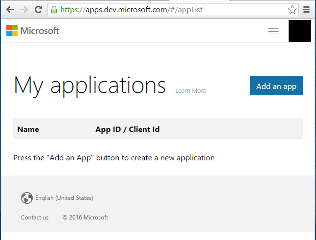
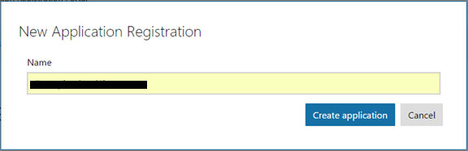
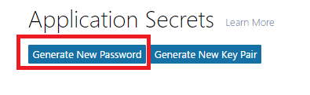
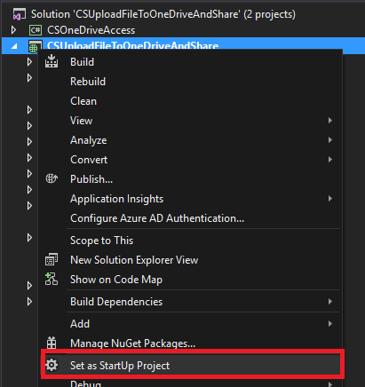
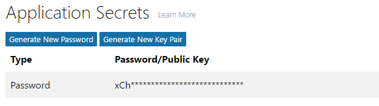
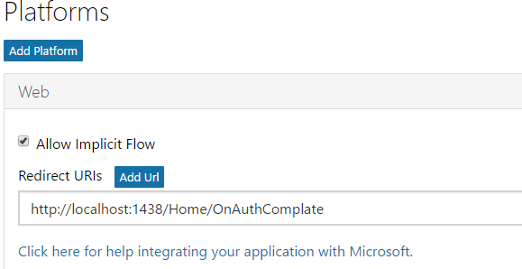
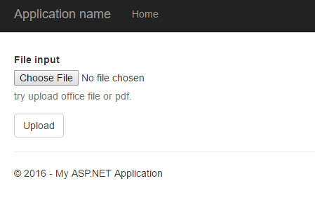
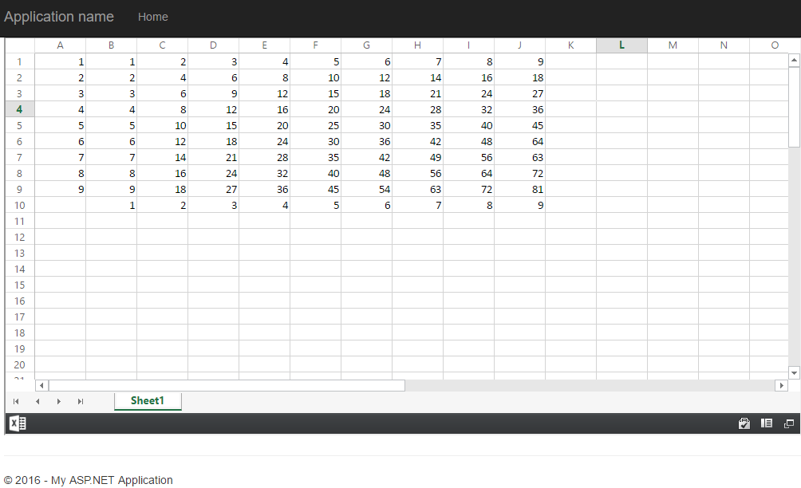

# How to upload file to onedrive and share it with REST API using web application
## Requires
- Visual Studio 2015
## License
- Apache License, Version 2.0
## Technologies
- ASP.NET
- REST
- .NET
- Office 365
- Web App Development
## Topics
- C#
- ASP.NET
- Office 365
- REST API
## Updated
- 04/12/2017
## Description

How to upload file to
OneDrive and to share using web application

Introduction

This sample demonstrates how to upload file to OneDrive and
to get a share link to share with REST using web application.

When users visit the website, they will be redirected to office 365 to finish the authentication. After that, they will go forward
to our website with a code so that they can request REST API for a token.

Next, users will upload the file to OneDrive and
receive a file id in return.

Eventually, REST API can be requested with this file id to get 
the share link which can be used in web, client or mobile.

Sample prerequisites

&bull;&nbsp;Register application for your OneDrive, while the related details will be described in the next section

&bull;&nbsp;Go to the
<a href="https://apps.dev.microsoft.com/" style="text-decoration:none">Register and manage apps</a> to register your application.

&bull;&nbsp;After the registration has been prompted, sign in with you Microsoft account credentials in
<a href="https://apps.dev.microsoft.com/" style="text-decoration:none">apps.dev.microsoft.com</a>.

And you will see this in your 
browser.

&bull;&nbsp;Find
My applications and click 
Add an app.

&nbsp;

&bull;&nbsp;Enter you app&rsquo;s name and click
Create application.

&bull;&nbsp;Scroll to the page bottom and check the
Live ADK support box.

&bull;&nbsp;Below the
Application Secrets, generate new password, and
then save it for later use.

 

&bull;&nbsp;Below the Platform's
header, create a web app, 
and then set the Redirect URIs to your web app callback address such as
<a href="http://localhost:1438/Home/OnAuthComplate" style="text-decoration:none">http://localhost:1438/Home/OnAuthComplate</a>.

&bull;&nbsp;Click
Save at the very bottom of the page.

Building the sample

&bull;&nbsp;Double-click
CSUploadFileToOneDriveAndShare.sln file to open this sample solution using Microsoft Visual Studio 2015
which has the web develop component installed.

&bull;&nbsp;Set project
CSUploadFileToOneDriveAndShare as a startup project.

&bull;&nbsp;Config under parameter in:

Project: CSUploadFileToOneDriveAndShare/Controllers/HomeController.cs

You can find the Clirntld here:

 

Secret is the key for the application whose password has been shown 
once when being set up. Therefore, it is better for you to copy it.

You can find CallbackUri here:

Running the sample

&bull;&nbsp;Open the sample solution using Visual studio, then press
F5 key or select Debug -&gt; Start Debugging from the menu.

&bull;&nbsp;After the site
has been started, you will see this:

 

&bull;&nbsp;When you have filled all the fields, click Sign in. Then it will go back to our web application,
then you can see this:

&bull;&nbsp;Choose an office file, and
then click upload button. 

&bull;&nbsp;

The file will be uploaded to OneDrive, and
a preview page will be rendered.

&nbsp;

Using the code

Public field

&nbsp;

C#

Edit|Remove

csharp

<pre class="csharp">public&nbsp;string&nbsp;OneDriveApiRoot&nbsp;{&nbsp;get;&nbsp;set;&nbsp;}&nbsp;=&nbsp;&quot;https://api.onedrive.com/v1.0/&quot;;</pre>

&nbsp;

&nbsp;

Upload file to OneDrive

&nbsp;

C#

Edit|Remove

csharp

<pre class="csharp">//this&nbsp;is&nbsp;main&nbsp;method&nbsp;of&nbsp;upload&nbsp;file&nbsp;to&nbsp;OneDrive&nbsp;
public&nbsp;async&nbsp;Task&lt;string&gt;&nbsp;UploadFileAsync(string&nbsp;filePath,&nbsp;string&nbsp;oneDrivePath)&nbsp;
{&nbsp;
&nbsp;&nbsp;&nbsp;&nbsp;//get&nbsp;the&nbsp;upload&nbsp;session,we&nbsp;can&nbsp;use&nbsp;this&nbsp;session&nbsp;to&nbsp;upload&nbsp;file&nbsp;resume&nbsp;from&nbsp;break&nbsp;point&nbsp;
&nbsp;&nbsp;&nbsp;&nbsp;string&nbsp;uploadUri&nbsp;=&nbsp;await&nbsp;GetUploadSession(oneDrivePath);&nbsp;
&nbsp;
&nbsp;&nbsp;&nbsp;&nbsp;//when&nbsp;file&nbsp;upload&nbsp;is&nbsp;not&nbsp;finish,&nbsp;the&nbsp;result&nbsp;is&nbsp;upload&nbsp;progress,&nbsp;
&nbsp;&nbsp;&nbsp;&nbsp;//When&nbsp;file&nbsp;upload&nbsp;is&nbsp;finish,&nbsp;the&nbsp;result&nbsp;is&nbsp;the&nbsp;file&nbsp;information.&nbsp;
&nbsp;&nbsp;&nbsp;&nbsp;string&nbsp;result&nbsp;=&nbsp;string.Empty;&nbsp;
&nbsp;&nbsp;&nbsp;&nbsp;using&nbsp;(FileStream&nbsp;stream&nbsp;=&nbsp;File.OpenRead(filePath))&nbsp;
&nbsp;&nbsp;&nbsp;&nbsp;{&nbsp;
&nbsp;&nbsp;&nbsp;&nbsp;&nbsp;&nbsp;&nbsp;&nbsp;long&nbsp;position&nbsp;=&nbsp;0;&nbsp;
&nbsp;&nbsp;&nbsp;&nbsp;&nbsp;&nbsp;&nbsp;&nbsp;long&nbsp;totalLength&nbsp;=&nbsp;stream.Length;&nbsp;
&nbsp;&nbsp;&nbsp;&nbsp;&nbsp;&nbsp;&nbsp;&nbsp;int&nbsp;length&nbsp;=&nbsp;10&nbsp;*&nbsp;1024&nbsp;*&nbsp;1024;&nbsp;
&nbsp;
&nbsp;&nbsp;&nbsp;&nbsp;&nbsp;&nbsp;&nbsp;&nbsp;//In&nbsp;one&nbsp;time,&nbsp;we&nbsp;just&nbsp;upload&nbsp;a&nbsp;part&nbsp;of&nbsp;file&nbsp;
&nbsp;&nbsp;&nbsp;&nbsp;&nbsp;&nbsp;&nbsp;&nbsp;//When&nbsp;all&nbsp;file&nbsp;part&nbsp;is&nbsp;uploaded,&nbsp;break&nbsp;out&nbsp;in&nbsp;this&nbsp;loop&nbsp;
&nbsp;&nbsp;&nbsp;&nbsp;&nbsp;&nbsp;&nbsp;&nbsp;while&nbsp;(true)&nbsp;
&nbsp;&nbsp;&nbsp;&nbsp;&nbsp;&nbsp;&nbsp;&nbsp;{&nbsp;
&nbsp;&nbsp;&nbsp;&nbsp;&nbsp;&nbsp;&nbsp;&nbsp;&nbsp;&nbsp;&nbsp;&nbsp;//Read&nbsp;a&nbsp;file&nbsp;part&nbsp;
&nbsp;&nbsp;&nbsp;&nbsp;&nbsp;&nbsp;&nbsp;&nbsp;&nbsp;&nbsp;&nbsp;&nbsp;byte[]&nbsp;bytes&nbsp;=&nbsp;await&nbsp;ReadFileFragmentAsync(stream,&nbsp;position,&nbsp;length);&nbsp;
&nbsp;
&nbsp;&nbsp;&nbsp;&nbsp;&nbsp;&nbsp;&nbsp;&nbsp;&nbsp;&nbsp;&nbsp;&nbsp;//check&nbsp;if&nbsp;arrive&nbsp;file&nbsp;end,&nbsp;when&nbsp;yes,&nbsp;break&nbsp;out&nbsp;with&nbsp;this&nbsp;loop&nbsp;
&nbsp;&nbsp;&nbsp;&nbsp;&nbsp;&nbsp;&nbsp;&nbsp;&nbsp;&nbsp;&nbsp;&nbsp;if&nbsp;(position&nbsp;&gt;=&nbsp;totalLength)&nbsp;
&nbsp;&nbsp;&nbsp;&nbsp;&nbsp;&nbsp;&nbsp;&nbsp;&nbsp;&nbsp;&nbsp;&nbsp;{&nbsp;
&nbsp;&nbsp;&nbsp;&nbsp;&nbsp;&nbsp;&nbsp;&nbsp;&nbsp;&nbsp;&nbsp;&nbsp;&nbsp;&nbsp;&nbsp;&nbsp;break;&nbsp;
&nbsp;&nbsp;&nbsp;&nbsp;&nbsp;&nbsp;&nbsp;&nbsp;&nbsp;&nbsp;&nbsp;&nbsp;}&nbsp;
&nbsp;
&nbsp;&nbsp;&nbsp;&nbsp;&nbsp;&nbsp;&nbsp;&nbsp;&nbsp;&nbsp;&nbsp;&nbsp;//Upload&nbsp;the&nbsp;file&nbsp;part&nbsp;
&nbsp;&nbsp;&nbsp;&nbsp;&nbsp;&nbsp;&nbsp;&nbsp;&nbsp;&nbsp;&nbsp;&nbsp;result&nbsp;=&nbsp;await&nbsp;UploadFileFragmentAsync(bytes,&nbsp;uploadUri,&nbsp;position,&nbsp;totalLength);&nbsp;
&nbsp;
&nbsp;&nbsp;&nbsp;&nbsp;&nbsp;&nbsp;&nbsp;&nbsp;&nbsp;&nbsp;&nbsp;&nbsp;position&nbsp;&#43;=&nbsp;bytes.Length;&nbsp;
&nbsp;&nbsp;&nbsp;&nbsp;&nbsp;&nbsp;&nbsp;&nbsp;}&nbsp;
&nbsp;&nbsp;&nbsp;&nbsp;}&nbsp;
&nbsp;
&nbsp;&nbsp;&nbsp;&nbsp;return&nbsp;result;&nbsp;
}&nbsp;
&nbsp;
private&nbsp;async&nbsp;Task&lt;string&gt;&nbsp;GetUploadSession(string&nbsp;oneDriveFilePath)&nbsp;
{&nbsp;
&nbsp;&nbsp;&nbsp;&nbsp;var&nbsp;uploadSession&nbsp;=&nbsp;await&nbsp;AuthRequestToStringAsync(&nbsp;
&nbsp;&nbsp;&nbsp;&nbsp;&nbsp;&nbsp;&nbsp;&nbsp;uri:&nbsp;$&quot;{OneDriveApiRoot}drive/root:/{oneDriveFilePath}:/upload.createSession&quot;,&nbsp;
&nbsp;&nbsp;&nbsp;&nbsp;&nbsp;&nbsp;&nbsp;&nbsp;httpMethod:&nbsp;HTTPMethod.Post,&nbsp;
&nbsp;&nbsp;&nbsp;&nbsp;&nbsp;&nbsp;&nbsp;&nbsp;contentType:&nbsp;&quot;application/x-www-form-urlencoded&quot;);&nbsp;
&nbsp;
&nbsp;&nbsp;&nbsp;&nbsp;JObject&nbsp;jo&nbsp;=&nbsp;JObject.Parse(uploadSession);&nbsp;
&nbsp;
&nbsp;&nbsp;&nbsp;&nbsp;return&nbsp;jo.SelectToken(&quot;uploadUrl&quot;).Value&lt;string&gt;();&nbsp;
}&nbsp;
&nbsp;
private&nbsp;async&nbsp;Task&lt;string&gt;&nbsp;UploadFileFragmentAsync(byte[]&nbsp;datas,&nbsp;string&nbsp;uploadUri,&nbsp;long&nbsp;position,&nbsp;long&nbsp;totalLength)&nbsp;
{&nbsp;
&nbsp;&nbsp;&nbsp;&nbsp;var&nbsp;request&nbsp;=&nbsp;await&nbsp;InitAuthRequest(uploadUri,&nbsp;HTTPMethod.Put,&nbsp;datas,&nbsp;null);&nbsp;
&nbsp;&nbsp;&nbsp;&nbsp;request.Request.Headers.Add(&quot;Content-Range&quot;,&nbsp;$&quot;bytes&nbsp;{position}-{position&nbsp;&#43;&nbsp;datas.Length&nbsp;-&nbsp;1}/{totalLength}&quot;);&nbsp;
&nbsp;
&nbsp;&nbsp;&nbsp;&nbsp;return&nbsp;await&nbsp;request.GetResponseStringAsync();&nbsp;
}&nbsp;&nbsp;</pre>

&nbsp;

&nbsp;

Get Share Link

&nbsp;

JavaScript

Edit|Remove

js

<pre class="js">//This&nbsp;method&nbsp;use&nbsp;to&nbsp;get&nbsp;ShareLink,&nbsp;you&nbsp;can&nbsp;use&nbsp;the&nbsp;link&nbsp;in&nbsp;web&nbsp;or&nbsp;client&nbsp;terminal&nbsp;
public&nbsp;async&nbsp;Task&lt;string&gt;&nbsp;GetShareLinkAsync(string&nbsp;fileID,&nbsp;OneDriveShareLinkType&nbsp;type,&nbsp;OneDrevShareScopeType&nbsp;scope)&nbsp;
{&nbsp;
&nbsp;&nbsp;&nbsp;&nbsp;string&nbsp;param&nbsp;=&nbsp;&quot;{type:'&quot;&nbsp;&#43;&nbsp;type&nbsp;&#43;&nbsp;&quot;',scope:'&quot;&nbsp;&#43;&nbsp;scope&nbsp;&#43;&nbsp;&quot;'}&quot;;&nbsp;
&nbsp;
&nbsp;&nbsp;&nbsp;&nbsp;string&nbsp;result&nbsp;=&nbsp;await&nbsp;AuthRequestToStringAsync(&nbsp;
&nbsp;&nbsp;&nbsp;&nbsp;&nbsp;&nbsp;&nbsp;&nbsp;uri:&nbsp;$&quot;{OneDriveApiRoot}drive/items/{fileID}/action.createLink&quot;,&nbsp;
&nbsp;&nbsp;&nbsp;&nbsp;&nbsp;&nbsp;&nbsp;&nbsp;httpMethod:&nbsp;HTTPMethod.Post,&nbsp;
&nbsp;&nbsp;&nbsp;&nbsp;&nbsp;&nbsp;&nbsp;&nbsp;data:&nbsp;Encoding.UTF8.GetBytes(param),&nbsp;
&nbsp;&nbsp;&nbsp;&nbsp;&nbsp;&nbsp;&nbsp;&nbsp;contentType:&nbsp;&quot;application/json&quot;);&nbsp;
&nbsp;
&nbsp;&nbsp;&nbsp;&nbsp;return&nbsp;JObject.Parse(result).SelectToken(&quot;link.webUrl&quot;).Value&lt;string&gt;();&nbsp;
}&nbsp;
</pre>

&nbsp;

&nbsp;

&nbsp;

More information

&bull;&nbsp;Upload large file to onedrive using REST API:
<a href="https://dev.onedrive.com/items/upload_large_files.htm" style="text-decoration:none">https://dev.onedrive.com/items/upload_large_files.htm</a>

&bull;&nbsp;Get share link from onedrive using REST API:
<a href="https://dev.onedrive.com/items/sharing_createLink.htm" style="text-decoration:none">https://dev.onedrive.com/items/sharing_createLink.htm</a>

&nbsp;

&nbsp;

Microsoft All-In-One Code Framework is a free, centralized code sample library driven by developers' real-world pains and needs. The goal is to provide customer-driven code samples for all Microsoft development technologies,
 and reduce developers' efforts in solving typical programming tasks. Our team listens to developers&rsquo; pains in the MSDN forums, social media and various DEV communities. We write code samples based on developers&rsquo; frequently asked programming tasks,
 and allow developers to download them with a short sample publishing cycle. Additionally, we offer a free code sample request service. It is a proactive way for our developer community to obtain code samples directly from Microsoft.

