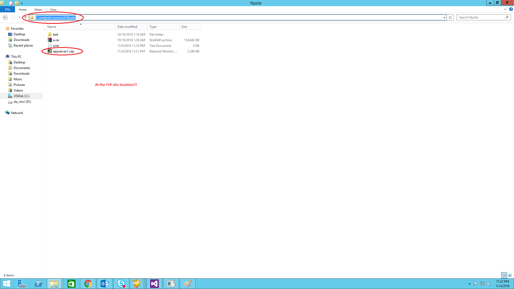

# How to upload files to FTP server
## Requires
- Visual Studio 2012
## License
- Apache License, Version 2.0
## Technologies
- Windows
- Networking
- Windows Desktop App Development
## Topics
- Upload
- FTP
## Updated
- 11/10/2016
## Description

<h1>Ftp File uploader to upload a particular file in the ftp server in c&#43;&#43;</h1>
<h2>Introduction</h2>

The C&#43;&#43; sample code of console application developed in visual studio 2012 helps us to upload a particular file from the ftp server that supports only plain FTP not FTPS.

<h2>Running the Sample</h2>

Step1: Open the &quot;Ftp.sln&quot; file using VS 2012 or above.  
 

 
 
Step2: Build the code either by cliking &quot;ctrl&#43; shift&#43; B&quot; or by pressing F6 button.
 
 

 
 
Step3: Press F5 to execute the code. 
 

 
 
Step4: Once the console is opened, enter the required details. 
 

 
 
Step5: Once you have entered all the details, the file will be uploaded&nbsp;in the ftp server. 
 

 
 

 
 

 
 

 
 

<h2>Using the Code</h2>

Below is the code snippet which runs ftp commands for downloading the file and the code snippet that writes '*' in the place&nbsp;for password

C&#43;&#43;

Edit|Remove

cplusplus

<pre class="cplusplus">int&nbsp;main()&nbsp;
{&nbsp;
&nbsp;&nbsp;&nbsp;&nbsp;//....&nbsp;
&nbsp;&nbsp;&nbsp;&nbsp;//....&nbsp;
&nbsp;&nbsp;&nbsp;&nbsp;//....&nbsp;
&nbsp;&nbsp;&nbsp;&nbsp;Password&nbsp;=&nbsp;getpass(&quot;Enter&nbsp;password&nbsp;:&quot;,&nbsp;true);&nbsp;//calling&nbsp;function&nbsp;which&nbsp;prints&nbsp;'*'&nbsp;in&nbsp;place&nbsp;of&nbsp;actual&nbsp;password&nbsp;
&nbsp;&nbsp;&nbsp;&nbsp;//....&nbsp;
&nbsp;&nbsp;&nbsp;&nbsp;//....&nbsp;
&nbsp;&nbsp;&nbsp;&nbsp;system(&quot;ftp&nbsp;-s:commands.bin&quot;);&nbsp;
&nbsp;&nbsp;&nbsp;&nbsp;//....&nbsp;
&nbsp;&nbsp;&nbsp;&nbsp;//....&nbsp;
}&nbsp;
&nbsp;
Below&nbsp;is&nbsp;the&nbsp;code&nbsp;snippet&nbsp;that&nbsp;writes&nbsp;'*'&nbsp;in&nbsp;place&nbsp;of&nbsp;password&nbsp;
&nbsp;
&nbsp;
&nbsp;&nbsp;&nbsp;&nbsp;&nbsp;&nbsp;
string&nbsp;getpass(const&nbsp;char&nbsp;*prompt,&nbsp;bool&nbsp;show_asterisk&nbsp;=&nbsp;true)&nbsp;
{&nbsp;
&nbsp;&nbsp;&nbsp;&nbsp;//....&nbsp;
&nbsp;&nbsp;&nbsp;&nbsp;//....&nbsp;
&nbsp;&nbsp;&nbsp;&nbsp;//....&nbsp;
&nbsp;&nbsp;&nbsp;&nbsp;//....&nbsp;
&nbsp;&nbsp;&nbsp;&nbsp;while&nbsp;((ch&nbsp;=&nbsp;getch())&nbsp;!=&nbsp;RETURN)&nbsp;
&nbsp;&nbsp;&nbsp;&nbsp;{&nbsp;
&nbsp;&nbsp;&nbsp;&nbsp;&nbsp;&nbsp;&nbsp;&nbsp;if&nbsp;(ch&nbsp;==&nbsp;BACKSPACE)&nbsp;
&nbsp;&nbsp;&nbsp;&nbsp;&nbsp;&nbsp;&nbsp;&nbsp;{&nbsp;
&nbsp;&nbsp;&nbsp;&nbsp;&nbsp;&nbsp;&nbsp;&nbsp;&nbsp;&nbsp;&nbsp;&nbsp;//....&nbsp;
&nbsp;&nbsp;&nbsp;&nbsp;&nbsp;&nbsp;&nbsp;&nbsp;&nbsp;&nbsp;&nbsp;&nbsp;//....&nbsp;
&nbsp;&nbsp;&nbsp;&nbsp;&nbsp;&nbsp;&nbsp;&nbsp;}&nbsp;
&nbsp;&nbsp;&nbsp;&nbsp;&nbsp;&nbsp;&nbsp;&nbsp;else&nbsp;if&nbsp;(ch&nbsp;==&nbsp;0&nbsp;||&nbsp;ch&nbsp;==&nbsp;224)&nbsp;//&nbsp;handle&nbsp;escape&nbsp;sequences&nbsp;
&nbsp;&nbsp;&nbsp;&nbsp;&nbsp;&nbsp;&nbsp;&nbsp;{&nbsp;
&nbsp;&nbsp;&nbsp;&nbsp;&nbsp;&nbsp;&nbsp;&nbsp;&nbsp;&nbsp;&nbsp;&nbsp;getch();&nbsp;//&nbsp;ignore&nbsp;non&nbsp;printable&nbsp;chars&nbsp;
&nbsp;&nbsp;&nbsp;&nbsp;&nbsp;&nbsp;&nbsp;&nbsp;&nbsp;&nbsp;&nbsp;&nbsp;continue;&nbsp;
&nbsp;&nbsp;&nbsp;&nbsp;&nbsp;&nbsp;&nbsp;&nbsp;}&nbsp;
&nbsp;&nbsp;&nbsp;&nbsp;&nbsp;&nbsp;&nbsp;&nbsp;else&nbsp;
&nbsp;&nbsp;&nbsp;&nbsp;&nbsp;&nbsp;&nbsp;&nbsp;{&nbsp;
&nbsp;&nbsp;&nbsp;&nbsp;&nbsp;&nbsp;&nbsp;&nbsp;&nbsp;&nbsp;&nbsp;&nbsp;password&nbsp;&#43;=&nbsp;ch;&nbsp;
&nbsp;&nbsp;&nbsp;&nbsp;&nbsp;&nbsp;&nbsp;&nbsp;&nbsp;&nbsp;&nbsp;&nbsp;if&nbsp;(show_asterisk)&nbsp;
&nbsp;&nbsp;&nbsp;&nbsp;&nbsp;&nbsp;&nbsp;&nbsp;&nbsp;&nbsp;&nbsp;&nbsp;&nbsp;&nbsp;&nbsp;&nbsp;cout&nbsp;&lt;&lt;&nbsp;'*';&nbsp;
&nbsp;&nbsp;&nbsp;&nbsp;&nbsp;&nbsp;&nbsp;&nbsp;}&nbsp;
&nbsp;&nbsp;&nbsp;&nbsp;}&nbsp;
&nbsp;&nbsp;&nbsp;&nbsp;//....&nbsp;
}&nbsp;
</pre>

&nbsp;

&nbsp;

Microsoft All-In-One Code Framework is a free, centralized code sample library driven by developers' real-world pains and needs. The goal is to provide customer-driven code samples for all Microsoft development technologies,
 and reduce developers' efforts in solving typical programming tasks. Our team listens to developers&rsquo; pains in the MSDN forums, social media and various DEV communities. We write code samples based on developers&rsquo; frequently asked programming tasks,
 and allow developers to download them with a short sample publishing cycle. Additionally, we offer a free code sample request service. It is a proactive way for our developer community to obtain code samples directly from Microsoft.

