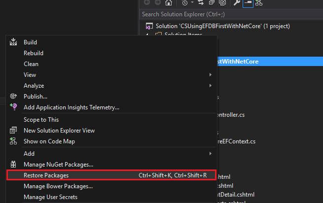
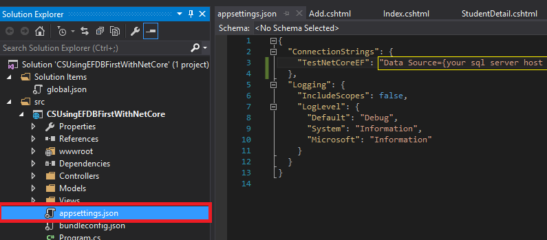
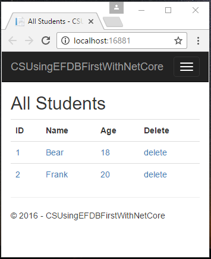
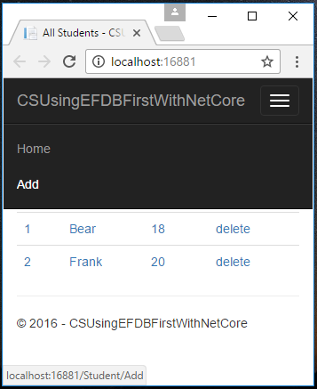
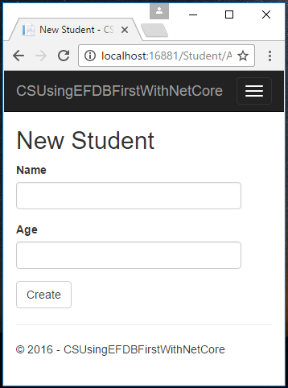

# How to use Entity Framework DB First in ASP.NET Core
## Requires
- Visual Studio 2015
## License
- Apache License, Version 2.0
## Technologies
- C#
- ASP.NET
- .NET
- ADO.NET
- Data Access
- Entity Framework
- Web App Development
- Languages
## Topics
- C#
- .NET Core
- ASP.NET Core
- Entity Framework Core
## Updated
- 03/09/2017
## Description

How to use Entity Framework DB First in ASP.NET Core

Introduction

ASP.NET Core is the new cross platform framework for web, and it cannot use the Entity Framework for the .NET Framework version.

This sample will show how to use the Entity Framework .NET Core version in ASP.NET Core.

Sample prerequisites

&bull;&nbsp;.NET Core 1.0 or later version(s).
[<a href="https://go.microsoft.com/fwlink/?LinkID=827546">.NET Core &#43; Visual Studio tooling</a>]

&bull;&nbsp;Microsoft Visual Studio 2015 update3 or above. [<a href="https://www.microsoft.com/en-sg/download/details.aspx?id=48146">Visual Studio 2015 installer</a>]

&bull;&nbsp;You need to have a Sql Server database, with below
structure,

&nbsp;

SQL

编辑脚本|Remove

mysql

<pre class="mysql">CREATE&nbsp;DATABASE&nbsp;TestNetCoreEF&nbsp;
GO&nbsp;
USE&nbsp;TestNetCoreEF&nbsp;
GO&nbsp;
CREATE&nbsp;TABLE&nbsp;Student(&nbsp;
&nbsp;&nbsp;&nbsp;&nbsp;ID&nbsp;int&nbsp;identity&nbsp;primary&nbsp;key,&nbsp;
&nbsp;&nbsp;&nbsp;&nbsp;Name&nbsp;nvarchar(50),&nbsp;
&nbsp;&nbsp;&nbsp;&nbsp;Age&nbsp;int&nbsp;
)&nbsp;
&nbsp;&nbsp;
INSERT&nbsp;INTO&nbsp;Student&nbsp;VALUES('Bear',18)&nbsp;
INSERT&nbsp;INTO&nbsp;Student&nbsp;VALUES('Frank',20)</pre>

&nbsp;

Building the sample

&bull;&nbsp;To run this sample

&bull;&nbsp;Open the sample solution &ldquo;CSUsingEFDBFirstWithNetCore.sln&rdquo; using Visula Sutdio.

&bull;&nbsp;Right click&nbsp;the project &ldquo;CSUsingEFDBFirstWithNetCore&rdquo; and select Restore packages.

&nbsp;

&bull;&nbsp;Open the file &ldquo;appsettings.json&rdquo; in project &ldquo;CSUsingEFDBFirstWithNetCore&rdquo;,
 and in the ConnectionStrings, config the &ldquo;TestNetCoreEF&rdquo; as your 
SQL DB connect string.

&nbsp;

&bull;&nbsp;Press
F6 Key or select Build -&gt; Build Solution from the menu to build the sample.

&nbsp;

&bull;&nbsp;For build a new project

&bull;&nbsp;Create a new
ASP.NET Core MVC project

&bull;&nbsp;Install Entity Framework

&bull;&nbsp;At menu bar
Tools -&gt; NuGet Package Manager -&gt;
Package Manager Console

&bull;&nbsp;Run
Install-Package Microsoft.EntityFrameworkCore.SqlServer

&bull;&nbsp;Run
Install-Package Microsoft.EntityFrameworkCore.Tools &ndash;Pre

&bull;&nbsp;Run
Install-Package Microsoft.EntityFrameworkCore.SqlServer.Design

&bull;&nbsp;Open
Project.json, locate the Tools section and add the config as is shown below

&nbsp;

JavaScript

编辑脚本|Remove

js

<pre class="js">&quot;tools&quot;:&nbsp;{&nbsp;
&nbsp;&nbsp;&nbsp;&nbsp;&quot;Microsoft.EntityFrameworkCore.Tools&quot;:&nbsp;&quot;1.0.0-preview2-final&quot;,&nbsp;
&nbsp;&nbsp;&nbsp;&nbsp;&hellip;&hellip;&hellip;&hellip;.&nbsp;
}</pre>

&nbsp;

&bull;&nbsp;Reverse engineer your model by command

Run below command at Package Manager Console

Scaffold-DbContext &quot;{ Your DB connect string }&quot; Microsoft.EntityFrameworkCore.SqlServer -OutputDir Models

&bull;&nbsp;The reverse engineer process created entity classes and a derived context based on the schema of the existing database. The entity classes are simple C#
 objects that represent the data you will be querying and saving.

&bull;&nbsp;Open the ****Context.cs, add a static field ConnectingString, and update the
OnConfiguring event handler as below.

&nbsp;

C#

编辑脚本|Remove

csharp

<pre class="csharp">public&nbsp;static&nbsp;string&nbsp;ConnectionString&nbsp;{&nbsp;get;&nbsp;set;&nbsp;}&nbsp;
protected&nbsp;override&nbsp;void&nbsp;OnConfiguring(DbContextOptionsBuilder&nbsp;optionsBuilder)&nbsp;
{&nbsp;
&nbsp;&nbsp;&nbsp;&nbsp;optionsBuilder.UseSqlServer(ConnectionString);&nbsp;
}</pre>

&nbsp;

&bull;&nbsp;Open the appsettings.json, and config connection string.

&nbsp;

JavaScript

编辑脚本|Remove

js

<pre class="js">{&nbsp;
&nbsp;&nbsp;&nbsp;&nbsp;&quot;ConnectionStrings&quot;:&nbsp;{&nbsp;
&nbsp;&nbsp;&nbsp;&nbsp;&nbsp;&nbsp;&nbsp;&nbsp;&quot;TestNetCoreEF&quot;:&nbsp;&quot;Data&nbsp;Source={your&nbsp;sql&nbsp;server&nbsp;host&nbsp;address};Initial&nbsp;Catalog=TestNetCoreEF;user&nbsp;id={your&nbsp;username};password={your&nbsp;password};&quot;&nbsp;
&nbsp;&nbsp;&nbsp;&nbsp;},&nbsp;
&nbsp;&nbsp;&nbsp;&nbsp;&quot;Logging&quot;:&nbsp;{&nbsp;
&nbsp;&nbsp;&nbsp;&nbsp;&nbsp;&nbsp;&nbsp;&nbsp;&quot;IncludeScopes&quot;:&nbsp;false,&nbsp;
&nbsp;&nbsp;&nbsp;&nbsp;&nbsp;&nbsp;&nbsp;&nbsp;&quot;LogLevel&quot;:&nbsp;{&nbsp;
&nbsp;&nbsp;&nbsp;&nbsp;&nbsp;&nbsp;&nbsp;&nbsp;&nbsp;&nbsp;&nbsp;&nbsp;&quot;Default&quot;:&nbsp;&quot;Debug&quot;,&nbsp;
&nbsp;&nbsp;&nbsp;&nbsp;&nbsp;&nbsp;&nbsp;&nbsp;&nbsp;&nbsp;&nbsp;&nbsp;&quot;System&quot;:&nbsp;&quot;Information&quot;,&nbsp;
&nbsp;&nbsp;&nbsp;&nbsp;&nbsp;&nbsp;&nbsp;&nbsp;&nbsp;&nbsp;&nbsp;&nbsp;&quot;Microsoft&quot;:&nbsp;&quot;Information&quot;&nbsp;
&nbsp;&nbsp;&nbsp;&nbsp;&nbsp;&nbsp;&nbsp;&nbsp;}&nbsp;
&nbsp;&nbsp;&nbsp;&nbsp;}&nbsp;
}</pre>

&nbsp;

&bull;&nbsp;Open Startup.cs, and add flowing code in ConfigureServices(IServiceCollection services)

&nbsp;

C#

编辑脚本|Remove

csharp

<pre class="csharp">public&nbsp;void&nbsp;ConfigureServices(IServiceCollection&nbsp;services)&nbsp;
{&nbsp;
&nbsp;&nbsp;&nbsp;&nbsp;//config&nbsp;the&nbsp;db&nbsp;connection&nbsp;string&nbsp;
&nbsp;&nbsp;&nbsp;&nbsp;TestNetCoreEFContext.ConnectionString&nbsp;=&nbsp;Configuration.GetConnectionString(&quot;TestNetCoreEF&quot;);&nbsp;
&nbsp;&nbsp;
&nbsp;&nbsp;&nbsp;&nbsp;//&nbsp;Add&nbsp;framework&nbsp;services.&nbsp;
&nbsp;&nbsp;&nbsp;&nbsp;services.AddMvc();&nbsp;
}</pre>

&nbsp;

Running the sample

&bull;&nbsp;Open the sample solution using Visual Studio, then press
F5 Key or select Debug -&gt; Start Debugging from the menu.

&bull;&nbsp;When the web application is running, you can see the page in browser.

&nbsp;

&bull;&nbsp;You can list or detail student, add student, update student or delete student, feel free in this sample web app.

&nbsp;

&nbsp;

Using the code

&nbsp;Appsettings.json

&nbsp;

C#

编辑脚本|Remove

csharp

<pre class="csharp">{&nbsp;
&nbsp;&nbsp;&nbsp;&nbsp;&quot;ConnectionStrings&quot;:&nbsp;{&nbsp;
&nbsp;&nbsp;&nbsp;&nbsp;&nbsp;&nbsp;&nbsp;&nbsp;&quot;TestNetCoreEF&quot;:&nbsp;&quot;Data&nbsp;Source={your&nbsp;sql&nbsp;server&nbsp;host&nbsp;address};Initial&nbsp;Catalog=TestNetCoreEF;user&nbsp;id={your&nbsp;username};password={your&nbsp;password};&quot;&nbsp;
&nbsp;&nbsp;&nbsp;&nbsp;},&nbsp;
&nbsp;&nbsp;&nbsp;&nbsp;&quot;Logging&quot;:&nbsp;{&nbsp;
&nbsp;&nbsp;&nbsp;&nbsp;&nbsp;&nbsp;&nbsp;&nbsp;&quot;IncludeScopes&quot;:&nbsp;false,&nbsp;
&nbsp;&nbsp;&nbsp;&nbsp;&nbsp;&nbsp;&nbsp;&nbsp;&quot;LogLevel&quot;:&nbsp;{&nbsp;
&nbsp;&nbsp;&nbsp;&nbsp;&nbsp;&nbsp;&nbsp;&nbsp;&nbsp;&nbsp;&nbsp;&nbsp;&quot;Default&quot;:&nbsp;&quot;Debug&quot;,&nbsp;
&nbsp;&nbsp;&nbsp;&nbsp;&nbsp;&nbsp;&nbsp;&nbsp;&nbsp;&nbsp;&nbsp;&nbsp;&quot;System&quot;:&nbsp;&quot;Information&quot;,&nbsp;
&nbsp;&nbsp;&nbsp;&nbsp;&nbsp;&nbsp;&nbsp;&nbsp;&nbsp;&nbsp;&nbsp;&nbsp;&quot;Microsoft&quot;:&nbsp;&quot;Information&quot;&nbsp;
&nbsp;&nbsp;&nbsp;&nbsp;&nbsp;&nbsp;&nbsp;&nbsp;}&nbsp;
&nbsp;&nbsp;&nbsp;&nbsp;}&nbsp;
}</pre>

&nbsp;

&nbsp;

&nbsp;Models.Student.cs

&nbsp;

C#

编辑脚本|Remove

csharp

<pre class="csharp">public&nbsp;partial&nbsp;class&nbsp;Student&nbsp;
{&nbsp;
&nbsp;&nbsp;&nbsp;&nbsp;public&nbsp;int&nbsp;Id&nbsp;{&nbsp;get;&nbsp;set;&nbsp;}&nbsp;
&nbsp;&nbsp;&nbsp;&nbsp;public&nbsp;string&nbsp;Name&nbsp;{&nbsp;get;&nbsp;set;&nbsp;}&nbsp;
&nbsp;&nbsp;&nbsp;&nbsp;public&nbsp;int?&nbsp;Age&nbsp;{&nbsp;get;&nbsp;set;&nbsp;}&nbsp;
}</pre>

&nbsp;

&nbsp;&nbsp;

&nbsp;Models.TestNetCoreEFContext.cs

&nbsp;

C#

编辑脚本|Remove

csharp

<pre class="csharp">public&nbsp;partial&nbsp;class&nbsp;TestNetCoreEFContext&nbsp;:&nbsp;DbContext&nbsp;
{&nbsp;
&nbsp;&nbsp;&nbsp;&nbsp;public&nbsp;static&nbsp;string&nbsp;ConnectionString&nbsp;{&nbsp;get;&nbsp;set;&nbsp;}&nbsp;
&nbsp;&nbsp;
&nbsp;&nbsp;&nbsp;&nbsp;protected&nbsp;override&nbsp;void&nbsp;OnConfiguring(DbContextOptionsBuilder&nbsp;optionsBuilder)&nbsp;
&nbsp;&nbsp;&nbsp;&nbsp;{&nbsp;
&nbsp;&nbsp;&nbsp;&nbsp;&nbsp;&nbsp;&nbsp;&nbsp;optionsBuilder.UseSqlServer(ConnectionString);&nbsp;
&nbsp;&nbsp;&nbsp;&nbsp;}&nbsp;
&nbsp;&nbsp;
&nbsp;&nbsp;&nbsp;&nbsp;protected&nbsp;override&nbsp;void&nbsp;OnModelCreating(ModelBuilder&nbsp;modelBuilder)&nbsp;
&nbsp;&nbsp;&nbsp;&nbsp;{&nbsp;
&nbsp;&nbsp;&nbsp;&nbsp;&nbsp;&nbsp;&nbsp;&nbsp;modelBuilder.Entity&lt;Student&gt;(entity&nbsp;=&gt;&nbsp;
&nbsp;&nbsp;&nbsp;&nbsp;&nbsp;&nbsp;&nbsp;&nbsp;{&nbsp;
&nbsp;&nbsp;&nbsp;&nbsp;&nbsp;&nbsp;&nbsp;&nbsp;&nbsp;&nbsp;&nbsp;&nbsp;entity.Property(e&nbsp;=&gt;&nbsp;e.Id).HasColumnName(&quot;ID&quot;);&nbsp;
&nbsp;&nbsp;
&nbsp;&nbsp;&nbsp;&nbsp;&nbsp;&nbsp;&nbsp;&nbsp;&nbsp;&nbsp;&nbsp;&nbsp;entity.Property(e&nbsp;=&gt;&nbsp;e.Name).HasMaxLength(50);&nbsp;
&nbsp;&nbsp;&nbsp;&nbsp;&nbsp;&nbsp;&nbsp;&nbsp;});&nbsp;
&nbsp;&nbsp;&nbsp;&nbsp;}&nbsp;
&nbsp;&nbsp;
&nbsp;&nbsp;&nbsp;&nbsp;public&nbsp;virtual&nbsp;DbSet&lt;Student&gt;&nbsp;Student&nbsp;{&nbsp;get;&nbsp;set;}&nbsp;
}</pre>

&nbsp;

&nbsp;&nbsp;

&nbsp;Startup.cs

&nbsp;

C#

编辑脚本|Remove

csharp

<pre class="csharp">public&nbsp;class&nbsp;Startup&nbsp;
{&nbsp;
&nbsp;&nbsp;&nbsp;&nbsp;&hellip;&hellip;&hellip;&hellip;&hellip;&hellip;&nbsp;
&nbsp;&nbsp;&nbsp;&nbsp;//&nbsp;This&nbsp;method&nbsp;gets&nbsp;called&nbsp;by&nbsp;the&nbsp;runtime.&nbsp;Use&nbsp;this&nbsp;method&nbsp;to&nbsp;add&nbsp;services&nbsp;to&nbsp;the&nbsp;container.&nbsp;
&nbsp;&nbsp;&nbsp;&nbsp;public&nbsp;void&nbsp;ConfigureServices(IServiceCollection&nbsp;services)&nbsp;
&nbsp;&nbsp;&nbsp;&nbsp;{&nbsp;
&nbsp;&nbsp;&nbsp;&nbsp;&nbsp;&nbsp;&nbsp;&nbsp;//config&nbsp;the&nbsp;db&nbsp;connection&nbsp;string&nbsp;
&nbsp;&nbsp;&nbsp;&nbsp;&nbsp;&nbsp;&nbsp;&nbsp;TestNetCoreEFContext.ConnectionString&nbsp;=&nbsp;Configuration.GetConnectionString(&quot;TestNetCoreEF&quot;);&nbsp;
&nbsp;&nbsp;
&nbsp;&nbsp;&nbsp;&nbsp;&nbsp;&nbsp;&nbsp;&nbsp;//&nbsp;Add&nbsp;framework&nbsp;services.&nbsp;
&nbsp;&nbsp;&nbsp;&nbsp;&nbsp;&nbsp;&nbsp;&nbsp;services.AddMvc();&nbsp;
&nbsp;&nbsp;&nbsp;&nbsp;}&nbsp;
&nbsp;&nbsp;&nbsp;&nbsp;&hellip;&hellip;&hellip;&hellip;&hellip;&hellip;&nbsp;
}</pre>

&nbsp;

&nbsp;&nbsp;

&nbsp;Use demo

&nbsp;

C#

编辑脚本|Remove

csharp

<pre class="csharp">Models.TestNetCoreEFContext&nbsp;context&nbsp;=&nbsp;new&nbsp;Models.TestNetCoreEFContext();&nbsp;
&nbsp;&nbsp;
var&nbsp;StudentList&nbsp;=&nbsp;context.Student.ToList();</pre>

&nbsp;

More information

ASP.NET Core Application to Existing Database(Database First)

<a href="https://docs.efproject.net/en/latest/platforms/aspnetcore/existing-db.html" style="text-decoration:none">https://docs.efproject.net/en/latest/platforms/aspnetcore/existing-db.html</a>

&nbsp;

Microsoft All-In-One Code Framework is a free, centralized code sample library driven by developers' real-world pains and needs. The goal is to provide customer-driven code samples for all Microsoft development technologies,
 and reduce developers' efforts in solving typical programming tasks. Our team listens to developers&rsquo; pains in the MSDN forums, social media and various DEV communities. We write code samples based on developers&rsquo; frequently asked programming tasks,
 and allow developers to download them with a short sample publishing cycle. Additionally, we offer a free code sample request service. It is a proactive way for our developer community to obtain code samples directly from Microsoft.

