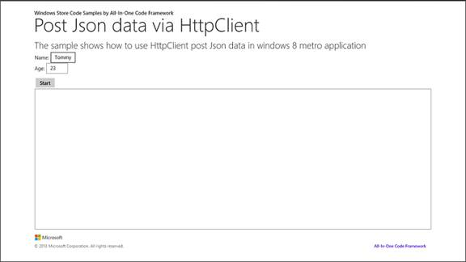

# How to use HttpClient to post Json data to WebService in Windows Store apps
## Requires
- Visual Studio 2012
## License
- Apache License, Version 2.0
## Technologies
- Windows
- Windows 8
- Windows Store app Development
## Topics
- JSON
- HttpClient
## Updated
- 09/21/2016
## Description

<h1><em></em></h1>
<h1>Windows ストア アプリで HttpClient を使用して JSON データを WebService に送信する方法 (CSWindowsStoreAppHttpClientPostJson)</h1>
<h2>はじめに</h2>

​サンプルでは、HttpClient および DataContractJsonSerializer&nbsp;クラスを使用して、JSON データを Web サービスに送信する方法を示します。これは、&nbsp;WinJS 領域で行うと簡単に実現できます。&nbsp;しかし、.NET アプリケーション用に HttpClient を使用してこれを行う方法を示す例はありません。

<h2>サンプルのビルド</h2>

1.&nbsp;&nbsp;&nbsp;&nbsp;&nbsp;&nbsp;Visual Studio 2012 を起動し、[ファイル]、[開く]、[プロジェクト/ソリューション] の順に選択します。

2.&nbsp;&nbsp;&nbsp;&nbsp;&nbsp;&nbsp;サンプルをダウンロードしたディレクトリに移動します。サンプル用に名前を付けたディレクトリに移動し、Microsoft Visual Studio ソリューション (.sln) ファイルをダブルクリックします。

3.&nbsp;&nbsp;&nbsp;&nbsp;&nbsp;&nbsp;F7 キーを押すか、[ビルド]、[ソリューションのビルド] の順に選択して、サンプルをビルドします。

<h2>サンプルの実行</h2>

1.&nbsp;&nbsp;&nbsp;&nbsp;&nbsp;&nbsp;&quot;JSONWCFService&quot; プロジェクトを右クリックし、[View in Browser (Internet Explorer)] をクリックして、JSON Web Service を最初に実行します。

4.&nbsp;&nbsp;&nbsp;&nbsp;&nbsp;&nbsp;[スタート] ボタンをクリックし、Web サービスから結果を取得します。下の結果が表示されます。

<strong>&nbsp;</strong><em>&nbsp;</em>

<h2>コードの使用</h2>

1. Visual Studio 2012 を使用して Widnows ストア アプリ プロジェクトを作成します。

2. WCF サービス アプリケーション プロジェクトをソリューション内に追加します

3. Web サービスを作成します。

4. Web サービスの構成ファイルを構成します。 

XML

Edit|Remove

xml
<pre class="hidden">&lt;system.serviceModel&gt;
    &lt;!--サービスを追加する--&gt;
  &lt;services&gt;
      &lt;service name=&quot;JSONWCFService.WCFService&quot; behaviorConfiguration=&quot;ServiceBehaviour&quot;&gt;
        &lt;endpoint name=&quot;JsonEndPoint&quot; contract=&quot;JSONWCFService.IWCFService&quot; binding=&quot;webHttpBinding&quot; behaviorConfiguration=&quot;jsonbehavior&quot;/&gt;
      &lt;/service&gt;
    &lt;/services&gt;
    
    &lt;behaviors&gt;
      &lt;serviceBehaviors&gt;
        &lt;behavior name=&quot;ServiceBehaviour&quot;&gt;
          &lt;!-- メタデータ情報の開示を避けるには、展開する前に下の値を false に設定する --&gt;
          &lt;serviceMetadata httpGetEnabled=&quot;true&quot; httpsGetEnabled=&quot;true&quot;/&gt;
          &lt;!-- デバッグのためエラー時に例外の詳細を取得するには、下の値を true に設定する 意図しない例外情報が開示されてしまうのを避けるには、配置前に false に設定する --&gt;
          &lt;serviceDebug includeExceptionDetailInFaults=&quot;false&quot;/&gt;
        &lt;/behavior&gt;
      &lt;/serviceBehaviors&gt;
      &lt;!--エンドポイントの動作を追加する--&gt;
      &lt;endpointBehaviors&gt;
        &lt;behavior name=&quot;jsonbehavior&quot;&gt;
          &lt;webHttp defaultBodyStyle=&quot;Wrapped&quot; defaultOutgoingResponseFormat=&quot;Json&quot;/&gt;
        &lt;/behavior&gt;
      &lt;/endpointBehaviors&gt;
    &lt;/behaviors&gt;
    
    &lt;protocolMapping&gt;
        &lt;add binding=&quot;basicHttpsBinding&quot; scheme=&quot;https&quot; /&gt;
    &lt;/protocolMapping&gt;    
    &lt;serviceHostingEnvironment aspNetCompatibilityEnabled=&quot;true&quot; multipleSiteBindingsEnabled=&quot;true&quot; /&gt;
  &lt;/system.serviceModel&gt;
</pre>

<pre class="xml">&lt;system.serviceModel&gt;&nbsp;
&lt;!--サービスを追加する--&gt;&lt;services&gt;&nbsp;
&lt;servicename=&quot;JSONWCFService.WCFService&quot;behaviorConfiguration=&quot;ServiceBehaviour&quot;&gt;&nbsp;
&lt;endpointname=&quot;JsonEndPoint&quot;contract=&quot;JSONWCFService.IWCFService&quot;binding=&quot;webHttpBinding&quot;behaviorConfiguration=&quot;jsonbehavior&quot;/&gt;&lt;/service&gt;&lt;/services&gt;&lt;behaviors&gt;&nbsp;
&lt;serviceBehaviors&gt;&nbsp;
&lt;behaviorname=&quot;ServiceBehaviour&quot;&gt;&nbsp;
&lt;!--&nbsp;メタデータ情報の開示を避けるには、展開する前に下の値を&nbsp;false&nbsp;に設定する&nbsp;--&gt;&lt;serviceMetadatahttpGetEnabled=&quot;true&quot;httpsGetEnabled=&quot;true&quot;/&gt;&lt;!--&nbsp;デバッグのためエラー時に例外の詳細を取得するには、下の値を&nbsp;true&nbsp;に設定する&nbsp;意図しない例外情報が開示されてしまうのを避けるには、配置前に&nbsp;false&nbsp;に設定する&nbsp;--&gt;&lt;serviceDebugincludeExceptionDetailInFaults=&quot;false&quot;/&gt;&lt;/behavior&gt;&lt;/serviceBehaviors&gt;&lt;!--エンドポイントの動作を追加する--&gt;&lt;endpointBehaviors&gt;&nbsp;
&lt;behaviorname=&quot;jsonbehavior&quot;&gt;&nbsp;
&lt;webHttpdefaultBodyStyle=&quot;Wrapped&quot;defaultOutgoingResponseFormat=&quot;Json&quot;/&gt;&lt;/behavior&gt;&lt;/endpointBehaviors&gt;&lt;/behaviors&gt;&lt;protocolMapping&gt;&nbsp;
&lt;addbinding=&quot;basicHttpsBinding&quot;scheme=&quot;https&quot;/&gt;&lt;/protocolMapping&gt;&lt;serviceHostingEnvironmentaspNetCompatibilityEnabled=&quot;true&quot;multipleSiteBindingsEnabled=&quot;true&quot;/&gt;&nbsp;
&nbsp;&nbsp;&lt;/system.serviceModel&gt;&nbsp;
</pre>

5.&nbsp; HttpClient クラスを使用して
json データを Web サービスに送信し、Windows ストア アプリでコールバックの結果を取得します。

C#

Edit|Remove

csharp
<pre class="hidden">/// &lt;summary&gt;
       /// Call WCF サービスを開始する
       /// &lt;/summary&gt;
       /// &lt;param name=&quot;sender&quot;&gt;&lt;/param&gt;
       /// &lt;param name=&quot;e&quot;&gt;&lt;/param&gt;
       private async void Start_Click(object sender, RoutedEventArgs e)
       {
           // Output テキスト ボックスのテキストをクリアする 
           this.OutputField.Text = string.Empty;
           this.StatusBlock.Text = string.Empty;

           this.StartButton.IsEnabled = false;
           httpClient = new HttpClient();
           try
           {
               string resourceAddress = &quot;http://localhost:44516/WCFService.svc/GetData&quot;;
               int age = Convert.ToInt32(this.Agetxt.Text);
               if (age &gt; 120 || age &lt; 0)
               {
                   throw new Exception(&quot;Age must be between 0 and 120&quot;);
               }
               Person p = new Person { Name = this.Nametxt.Text, Age = age };
               string postBody = JsonSerializer(p);
               httpClient.DefaultRequestHeaders.Accept.Add(new MediaTypeWithQualityHeaderValue(&quot;application/json&quot;));
               HttpResponseMessage wcfResponse = await httpClient.PostAsync(resourceAddress, new StringContent(postBody, Encoding.UTF8, &quot;application/json&quot;));
               await DisplayTextResult(wcfResponse, OutputField);
           }
           catch (HttpRequestException hre)
           {
               NotifyUser(&quot;Error:&quot; &#43; hre.Message);
           }
           catch (TaskCanceledException)
           {
               NotifyUser(&quot;Request canceled.&quot;);
           }
           catch (Exception ex)
           {
               NotifyUser(ex.Message);
           }
           finally
           {
               this.StartButton.IsEnabled = true;
               if (httpClient != null)
               {
                   httpClient.Dispose();
                   httpClient = null;
               }
           }
       }
</pre>

<pre class="csharp">///&nbsp;&lt;summary&gt;///&nbsp;Call&nbsp;WCF&nbsp;サービスを開始する///&nbsp;&lt;/summary&gt;///&nbsp;&lt;param&nbsp;name=&quot;sender&quot;&gt;&lt;/param&gt;///&nbsp;&lt;param&nbsp;name=&quot;e&quot;&gt;&lt;/param&gt;private&nbsp;async&nbsp;void&nbsp;Start_Click(object&nbsp;sender,&nbsp;RoutedEventArgs&nbsp;e)&nbsp;
&nbsp;&nbsp;&nbsp;&nbsp;&nbsp;&nbsp;&nbsp;{&nbsp;
&nbsp;&nbsp;&nbsp;&nbsp;&nbsp;&nbsp;&nbsp;&nbsp;&nbsp;&nbsp;&nbsp;//&nbsp;Output&nbsp;テキスト&nbsp;ボックスのテキストをクリアする&nbsp;this.OutputField.Text&nbsp;=&nbsp;string.Empty;&nbsp;
&nbsp;&nbsp;&nbsp;&nbsp;&nbsp;&nbsp;&nbsp;&nbsp;&nbsp;&nbsp;&nbsp;this.StatusBlock.Text&nbsp;=&nbsp;string.Empty;&nbsp;
&nbsp;
&nbsp;
&nbsp;&nbsp;&nbsp;&nbsp;&nbsp;&nbsp;&nbsp;&nbsp;&nbsp;&nbsp;&nbsp;this.StartButton.IsEnabled&nbsp;=&nbsp;false;&nbsp;
&nbsp;&nbsp;&nbsp;&nbsp;&nbsp;&nbsp;&nbsp;&nbsp;&nbsp;&nbsp;&nbsp;httpClient&nbsp;=&nbsp;new&nbsp;HttpClient();&nbsp;
&nbsp;&nbsp;&nbsp;&nbsp;&nbsp;&nbsp;&nbsp;&nbsp;&nbsp;&nbsp;&nbsp;try&nbsp;
&nbsp;&nbsp;&nbsp;&nbsp;&nbsp;&nbsp;&nbsp;&nbsp;&nbsp;&nbsp;&nbsp;{&nbsp;
&nbsp;&nbsp;&nbsp;&nbsp;&nbsp;&nbsp;&nbsp;&nbsp;&nbsp;&nbsp;&nbsp;&nbsp;&nbsp;&nbsp;&nbsp;string&nbsp;resourceAddress&nbsp;=&nbsp;&quot;http://localhost:44516/WCFService.svc/GetData&quot;;&nbsp;
&nbsp;&nbsp;&nbsp;&nbsp;&nbsp;&nbsp;&nbsp;&nbsp;&nbsp;&nbsp;&nbsp;&nbsp;&nbsp;&nbsp;&nbsp;int&nbsp;age&nbsp;=&nbsp;Convert.ToInt32(this.Agetxt.Text);&nbsp;
&nbsp;&nbsp;&nbsp;&nbsp;&nbsp;&nbsp;&nbsp;&nbsp;&nbsp;&nbsp;&nbsp;&nbsp;&nbsp;&nbsp;&nbsp;if&nbsp;(age&nbsp;&gt;&nbsp;120&nbsp;||&nbsp;age&nbsp;&lt;&nbsp;0)&nbsp;
&nbsp;&nbsp;&nbsp;&nbsp;&nbsp;&nbsp;&nbsp;&nbsp;&nbsp;&nbsp;&nbsp;&nbsp;&nbsp;&nbsp;&nbsp;{&nbsp;
&nbsp;&nbsp;&nbsp;&nbsp;&nbsp;&nbsp;&nbsp;&nbsp;&nbsp;&nbsp;&nbsp;&nbsp;&nbsp;&nbsp;&nbsp;&nbsp;&nbsp;&nbsp;&nbsp;thrownew&nbsp;Exception(&quot;Age&nbsp;must&nbsp;be&nbsp;between&nbsp;0&nbsp;and&nbsp;120&quot;);&nbsp;
&nbsp;&nbsp;&nbsp;&nbsp;&nbsp;&nbsp;&nbsp;&nbsp;&nbsp;&nbsp;&nbsp;&nbsp;&nbsp;&nbsp;&nbsp;}&nbsp;
&nbsp;&nbsp;&nbsp;&nbsp;&nbsp;&nbsp;&nbsp;&nbsp;&nbsp;&nbsp;&nbsp;&nbsp;&nbsp;&nbsp;&nbsp;Person&nbsp;p&nbsp;=&nbsp;new&nbsp;Person&nbsp;{&nbsp;Name&nbsp;=&nbsp;this.Nametxt.Text,&nbsp;Age&nbsp;=&nbsp;age&nbsp;};&nbsp;
&nbsp;&nbsp;&nbsp;&nbsp;&nbsp;&nbsp;&nbsp;&nbsp;&nbsp;&nbsp;&nbsp;&nbsp;&nbsp;&nbsp;&nbsp;string&nbsp;postBody&nbsp;=&nbsp;JsonSerializer(p);&nbsp;
&nbsp;&nbsp;&nbsp;&nbsp;&nbsp;&nbsp;&nbsp;&nbsp;&nbsp;&nbsp;&nbsp;&nbsp;&nbsp;&nbsp;&nbsp;httpClient.DefaultRequestHeaders.Accept.Add(new&nbsp;MediaTypeWithQualityHeaderValue(&quot;application/json&quot;));&nbsp;
&nbsp;&nbsp;&nbsp;&nbsp;&nbsp;&nbsp;&nbsp;&nbsp;&nbsp;&nbsp;&nbsp;&nbsp;&nbsp;&nbsp;&nbsp;HttpResponseMessage&nbsp;wcfResponse&nbsp;=&nbsp;await&nbsp;httpClient.PostAsync(resourceAddress,&nbsp;new&nbsp;StringContent(postBody,&nbsp;Encoding.UTF8,&nbsp;&quot;application/json&quot;));&nbsp;
&nbsp;&nbsp;&nbsp;&nbsp;&nbsp;&nbsp;&nbsp;&nbsp;&nbsp;&nbsp;&nbsp;&nbsp;&nbsp;&nbsp;&nbsp;await&nbsp;DisplayTextResult(wcfResponse,&nbsp;OutputField);&nbsp;
&nbsp;&nbsp;&nbsp;&nbsp;&nbsp;&nbsp;&nbsp;&nbsp;&nbsp;&nbsp;&nbsp;}&nbsp;
&nbsp;&nbsp;&nbsp;&nbsp;&nbsp;&nbsp;&nbsp;&nbsp;&nbsp;&nbsp;&nbsp;catch&nbsp;(HttpRequestException&nbsp;hre)&nbsp;
&nbsp;&nbsp;&nbsp;&nbsp;&nbsp;&nbsp;&nbsp;&nbsp;&nbsp;&nbsp;&nbsp;{&nbsp;
&nbsp;&nbsp;&nbsp;&nbsp;&nbsp;&nbsp;&nbsp;&nbsp;&nbsp;&nbsp;&nbsp;&nbsp;&nbsp;&nbsp;&nbsp;NotifyUser(&quot;Error:&quot;&nbsp;&#43;&nbsp;hre.Message);&nbsp;
&nbsp;&nbsp;&nbsp;&nbsp;&nbsp;&nbsp;&nbsp;&nbsp;&nbsp;&nbsp;&nbsp;}&nbsp;
&nbsp;&nbsp;&nbsp;&nbsp;&nbsp;&nbsp;&nbsp;&nbsp;&nbsp;&nbsp;&nbsp;catch&nbsp;(TaskCanceledException)&nbsp;
&nbsp;&nbsp;&nbsp;&nbsp;&nbsp;&nbsp;&nbsp;&nbsp;&nbsp;&nbsp;&nbsp;{&nbsp;
&nbsp;&nbsp;&nbsp;&nbsp;&nbsp;&nbsp;&nbsp;&nbsp;&nbsp;&nbsp;&nbsp;&nbsp;&nbsp;&nbsp;&nbsp;NotifyUser(&quot;Request&nbsp;canceled.&quot;);&nbsp;
&nbsp;&nbsp;&nbsp;&nbsp;&nbsp;&nbsp;&nbsp;&nbsp;&nbsp;&nbsp;&nbsp;}&nbsp;
&nbsp;&nbsp;&nbsp;&nbsp;&nbsp;&nbsp;&nbsp;&nbsp;&nbsp;&nbsp;&nbsp;catch&nbsp;(Exception&nbsp;ex)&nbsp;
&nbsp;&nbsp;&nbsp;&nbsp;&nbsp;&nbsp;&nbsp;&nbsp;&nbsp;&nbsp;&nbsp;{&nbsp;
&nbsp;&nbsp;&nbsp;&nbsp;&nbsp;&nbsp;&nbsp;&nbsp;&nbsp;&nbsp;&nbsp;&nbsp;&nbsp;&nbsp;&nbsp;NotifyUser(ex.Message);&nbsp;
&nbsp;&nbsp;&nbsp;&nbsp;&nbsp;&nbsp;&nbsp;&nbsp;&nbsp;&nbsp;&nbsp;}&nbsp;
&nbsp;&nbsp;&nbsp;&nbsp;&nbsp;&nbsp;&nbsp;&nbsp;&nbsp;&nbsp;&nbsp;finally&nbsp;
&nbsp;&nbsp;&nbsp;&nbsp;&nbsp;&nbsp;&nbsp;&nbsp;&nbsp;&nbsp;&nbsp;{&nbsp;
&nbsp;&nbsp;&nbsp;&nbsp;&nbsp;&nbsp;&nbsp;&nbsp;&nbsp;&nbsp;&nbsp;&nbsp;&nbsp;&nbsp;&nbsp;this.StartButton.IsEnabled&nbsp;=&nbsp;true;&nbsp;
&nbsp;&nbsp;&nbsp;&nbsp;&nbsp;&nbsp;&nbsp;&nbsp;&nbsp;&nbsp;&nbsp;&nbsp;&nbsp;&nbsp;&nbsp;if&nbsp;(httpClient&nbsp;!=&nbsp;null)&nbsp;
&nbsp;&nbsp;&nbsp;&nbsp;&nbsp;&nbsp;&nbsp;&nbsp;&nbsp;&nbsp;&nbsp;&nbsp;&nbsp;&nbsp;&nbsp;{&nbsp;
&nbsp;&nbsp;&nbsp;&nbsp;&nbsp;&nbsp;&nbsp;&nbsp;&nbsp;&nbsp;&nbsp;&nbsp;&nbsp;&nbsp;&nbsp;&nbsp;&nbsp;&nbsp;&nbsp;httpClient.Dispose();&nbsp;
&nbsp;&nbsp;&nbsp;&nbsp;&nbsp;&nbsp;&nbsp;&nbsp;&nbsp;&nbsp;&nbsp;&nbsp;&nbsp;&nbsp;&nbsp;&nbsp;&nbsp;&nbsp;&nbsp;httpClient&nbsp;=&nbsp;null;&nbsp;
&nbsp;&nbsp;&nbsp;&nbsp;&nbsp;&nbsp;&nbsp;&nbsp;&nbsp;&nbsp;&nbsp;&nbsp;&nbsp;&nbsp;&nbsp;}&nbsp;
&nbsp;&nbsp;&nbsp;&nbsp;&nbsp;&nbsp;&nbsp;&nbsp;&nbsp;&nbsp;&nbsp;}&nbsp;
&nbsp;&nbsp;&nbsp;&nbsp;&nbsp;&nbsp;&nbsp;}&nbsp;
</pre>

<h2>詳細</h2>

HttpClient クラス

<a href="http://msdn.microsoft.com/ja-jp/library/system.net.http.httpclient.aspx">http://msdn.microsoft.com/ja-jp/library/system.net.http.httpclient.aspx</a>

DataContractJsonSerializer クラス

<a href="http://msdn.microsoft.com/ja-jp/library/system.runtime.serialization.json.datacontractjsonserializer.aspx">http://msdn.microsoft.com/ja-jp/library/system.runtime.serialization.json.datacontractjsonserializer.aspx</a>
<strong>&nbsp;</strong><em>&nbsp;</em>

&nbsp;

<em> 
</em>

