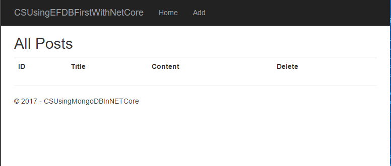
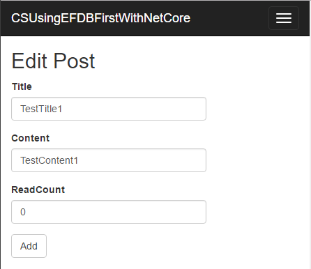

# How to use MongoDB with ASP.NET Core
## Requires
- Visual Studio 2015
## License
- Apache License, Version 2.0
## Technologies
- ASP.NET
- .NET
- Web App Development
## Topics
- MongoDB
- ASP.NET Core
## Updated
- 03/08/2017
## Description

How to use MongoDB with ASP.NET Core

Introduction

MongoDB is a popular NOSQL database, and it can work on ASP.NET Core.

This sample will demonstrate how to use MongoDB in ASP.NET Core.

Sample prerequisites

<ul>
<li>.NET Core 1.0 or later version(s). [<a href="https://go.microsoft.com/fwlink/?LinkID=827546" style="text-decoration:none">.NET Core &#43; Visual Studio tooling</a>]
</li><li>Microsoft Visual Studio 2015 update3 or above. [<a href="https://www.microsoft.com/en-sg/download/details.aspx?id=48146">Visual Studio 2015 installer</a>]
</li></ul>

Building the sample

&bull;&nbsp;Configure the settings of sample.

&bull;&nbsp;Open the
appsettings.json of project,

&bull;&nbsp;Local to ConnectionString field, and fill the value as your MongoDB connection string.

&bull;&nbsp;If your MongoDB is&nbsp;neither at Azure nor ursing the ssl, you should
change the IsSSL as False.

&bull;&nbsp;Restore the packages.

&bull;&nbsp;Right click on project, and select
Restore Packages.

&bull;&nbsp;Press
F6 Key to build the sample project.

Running the sample

&bull;&nbsp;Use Visual studio to open the sample solution, then press
F5 Key or select Debug -&gt; Start Debugging from the menu.

&bull;&nbsp;When debug is running, you can see this:

&nbsp;

Click Add to add page and fill all fields.

&nbsp;

Click Add button.

The new data will be created and then be back to list page.

For build new project

&bull;&nbsp;Create a new ASP.NET Core project

&bull;&nbsp;Right click on the project and select
Manage NuGet Packages 

&bull;&nbsp;In the browser tab, type
MongoDB in search box.

&bull;&nbsp;Select
MongoDB.Driver, ensure the version is 2.3 or later. Click Install.

Using the code

The MongoDbContext

&nbsp;

C#

Edit|Remove

csharp

<pre class="csharp">&nbsp;&nbsp;&nbsp;&nbsp;public&nbsp;class&nbsp;MongoDBContext&nbsp;
&nbsp;&nbsp;&nbsp;&nbsp;{&nbsp;
&nbsp;&nbsp;&nbsp;&nbsp;&nbsp;&nbsp;&nbsp;&nbsp;public&nbsp;static&nbsp;string&nbsp;ConnectionString&nbsp;{&nbsp;get;&nbsp;set;&nbsp;}&nbsp;
&nbsp;&nbsp;&nbsp;&nbsp;&nbsp;&nbsp;&nbsp;&nbsp;public&nbsp;static&nbsp;string&nbsp;DatabaseName&nbsp;{&nbsp;get;&nbsp;set;&nbsp;}&nbsp;
&nbsp;&nbsp;&nbsp;&nbsp;&nbsp;&nbsp;&nbsp;&nbsp;public&nbsp;static&nbsp;bool&nbsp;IsSSL&nbsp;{&nbsp;get;&nbsp;set;&nbsp;}&nbsp;
&nbsp;
&nbsp;&nbsp;&nbsp;&nbsp;&nbsp;&nbsp;&nbsp;&nbsp;private&nbsp;IMongoDatabase&nbsp;_database&nbsp;{&nbsp;get;&nbsp;}&nbsp;
&nbsp;
&nbsp;&nbsp;&nbsp;&nbsp;&nbsp;&nbsp;&nbsp;&nbsp;public&nbsp;MongoDBContext()&nbsp;
&nbsp;&nbsp;&nbsp;&nbsp;&nbsp;&nbsp;&nbsp;&nbsp;{&nbsp;
&nbsp;&nbsp;&nbsp;&nbsp;&nbsp;&nbsp;&nbsp;&nbsp;&nbsp;&nbsp;&nbsp;&nbsp;try&nbsp;
&nbsp;&nbsp;&nbsp;&nbsp;&nbsp;&nbsp;&nbsp;&nbsp;&nbsp;&nbsp;&nbsp;&nbsp;{&nbsp;
&nbsp;&nbsp;&nbsp;&nbsp;&nbsp;&nbsp;&nbsp;&nbsp;&nbsp;&nbsp;&nbsp;&nbsp;&nbsp;&nbsp;&nbsp;&nbsp;MongoClientSettings&nbsp;settings&nbsp;=&nbsp;MongoClientSettings.FromUrl(new&nbsp;MongoUrl(ConnectionString));&nbsp;
&nbsp;&nbsp;&nbsp;&nbsp;&nbsp;&nbsp;&nbsp;&nbsp;&nbsp;&nbsp;&nbsp;&nbsp;&nbsp;&nbsp;&nbsp;&nbsp;if&nbsp;(IsSSL)&nbsp;
&nbsp;&nbsp;&nbsp;&nbsp;&nbsp;&nbsp;&nbsp;&nbsp;&nbsp;&nbsp;&nbsp;&nbsp;&nbsp;&nbsp;&nbsp;&nbsp;{&nbsp;
&nbsp;&nbsp;&nbsp;&nbsp;&nbsp;&nbsp;&nbsp;&nbsp;&nbsp;&nbsp;&nbsp;&nbsp;&nbsp;&nbsp;&nbsp;&nbsp;&nbsp;&nbsp;&nbsp;&nbsp;settings.SslSettings&nbsp;=&nbsp;new&nbsp;SslSettings&nbsp;{&nbsp;EnabledSslProtocols&nbsp;=&nbsp;System.Security.Authentication.SslProtocols.Tls12&nbsp;};&nbsp;
&nbsp;&nbsp;&nbsp;&nbsp;&nbsp;&nbsp;&nbsp;&nbsp;&nbsp;&nbsp;&nbsp;&nbsp;&nbsp;&nbsp;&nbsp;&nbsp;}&nbsp;
&nbsp;&nbsp;&nbsp;&nbsp;&nbsp;&nbsp;&nbsp;&nbsp;&nbsp;&nbsp;&nbsp;&nbsp;&nbsp;&nbsp;&nbsp;&nbsp;var&nbsp;mongoClient&nbsp;=&nbsp;new&nbsp;MongoClient(settings);&nbsp;
&nbsp;&nbsp;&nbsp;&nbsp;&nbsp;&nbsp;&nbsp;&nbsp;&nbsp;&nbsp;&nbsp;&nbsp;&nbsp;&nbsp;&nbsp;&nbsp;_database&nbsp;=&nbsp;mongoClient.GetDatabase(DatabaseName);&nbsp;
&nbsp;&nbsp;&nbsp;&nbsp;&nbsp;&nbsp;&nbsp;&nbsp;&nbsp;&nbsp;&nbsp;&nbsp;}&nbsp;
&nbsp;&nbsp;&nbsp;&nbsp;&nbsp;&nbsp;&nbsp;&nbsp;&nbsp;&nbsp;&nbsp;&nbsp;catch&nbsp;(Exception&nbsp;ex)&nbsp;
&nbsp;&nbsp;&nbsp;&nbsp;&nbsp;&nbsp;&nbsp;&nbsp;&nbsp;&nbsp;&nbsp;&nbsp;{&nbsp;
&nbsp;&nbsp;&nbsp;&nbsp;&nbsp;&nbsp;&nbsp;&nbsp;&nbsp;&nbsp;&nbsp;&nbsp;&nbsp;&nbsp;&nbsp;&nbsp;throw&nbsp;new&nbsp;Exception(&quot;Can&nbsp;not&nbsp;access&nbsp;to&nbsp;db&nbsp;server.&quot;,&nbsp;ex);&nbsp;
&nbsp;&nbsp;&nbsp;&nbsp;&nbsp;&nbsp;&nbsp;&nbsp;&nbsp;&nbsp;&nbsp;&nbsp;}&nbsp;
&nbsp;&nbsp;&nbsp;&nbsp;&nbsp;&nbsp;&nbsp;&nbsp;}&nbsp;
&nbsp;
&nbsp;&nbsp;&nbsp;&nbsp;&nbsp;&nbsp;&nbsp;&nbsp;public&nbsp;IMongoCollection&lt;Post&gt;&nbsp;Posts&nbsp;
&nbsp;&nbsp;&nbsp;&nbsp;&nbsp;&nbsp;&nbsp;&nbsp;{&nbsp;
&nbsp;&nbsp;&nbsp;&nbsp;&nbsp;&nbsp;&nbsp;&nbsp;&nbsp;&nbsp;&nbsp;&nbsp;get&nbsp;
&nbsp;&nbsp;&nbsp;&nbsp;&nbsp;&nbsp;&nbsp;&nbsp;&nbsp;&nbsp;&nbsp;&nbsp;{&nbsp;
&nbsp;&nbsp;&nbsp;&nbsp;&nbsp;&nbsp;&nbsp;&nbsp;&nbsp;&nbsp;&nbsp;&nbsp;&nbsp;&nbsp;&nbsp;&nbsp;return&nbsp;_database.GetCollection&lt;Post&gt;(&quot;Posts&quot;);&nbsp;
&nbsp;&nbsp;&nbsp;&nbsp;&nbsp;&nbsp;&nbsp;&nbsp;&nbsp;&nbsp;&nbsp;&nbsp;}&nbsp;
&nbsp;&nbsp;&nbsp;&nbsp;&nbsp;&nbsp;&nbsp;&nbsp;}&nbsp;
&nbsp;&nbsp;&nbsp;&nbsp;}&nbsp;</pre>

&nbsp;

&nbsp;&nbsp;

Get list

&nbsp;

C#

Edit|Remove

csharp

<pre class="js">MongoDBContext&nbsp;dbContext&nbsp;=&nbsp;new&nbsp;MongoDBContext();&nbsp;
&nbsp;&nbsp;
List&lt;Post&gt;&nbsp;postList&nbsp;=&nbsp;dbContext.Posts.Find(m&nbsp;=&gt;&nbsp;true).ToList();</pre>

&nbsp;

Get One

&nbsp;

C#

Edit|Remove

csharp

<pre class="csharp">MongoDBContext&nbsp;dbContext&nbsp;=&nbsp;new&nbsp;MongoDBContext();&nbsp;
var&nbsp;entity&nbsp;=&nbsp;dbContext.Posts.Find(m&nbsp;=&gt;&nbsp;m.Id&nbsp;==&nbsp;id).FirstOrDefault();</pre>

&nbsp;

Replace One

&nbsp;

C#

Edit|Remove

csharp

<pre class="csharp">MongoDBContext&nbsp;dbContext&nbsp;=&nbsp;new&nbsp;MongoDBContext();&nbsp;
&nbsp;&nbsp;
//you&nbsp;can&nbsp;use&nbsp;the&nbsp;UpdateOne&nbsp;to&nbsp;get&nbsp;higher&nbsp;performance&nbsp;if&nbsp;you&nbsp;need.&nbsp;
dbContext.Posts.ReplaceOne(m&nbsp;=&gt;&nbsp;m.Id&nbsp;==&nbsp;entity.Id,&nbsp;entity);</pre>

&nbsp;

Add One

&nbsp;

C#

Edit|Remove

csharp

<pre class="csharp">MongoDBContext&nbsp;dbContext&nbsp;=&nbsp;new&nbsp;MongoDBContext();&nbsp;
&nbsp;&nbsp;
entity.Id&nbsp;=&nbsp;Guid.NewGuid();&nbsp;
&nbsp;&nbsp;
dbContext.Posts.InsertOne(entity);</pre>

&nbsp;

Delete One

&nbsp;

C#

Edit|Remove

csharp

<pre class="csharp">MongoDBContext&nbsp;dbContext&nbsp;=&nbsp;new&nbsp;MongoDBContext();&nbsp;
&nbsp;&nbsp;
dbContext.Posts.DeleteOne(m&nbsp;=&gt;&nbsp;m.Id&nbsp;==&nbsp;id);</pre>

&nbsp;

More information

C# and .NET MongoDB Driver

<a href="https://docs.mongodb.com/ecosystem/drivers/csharp/" style="text-decoration:none">https://docs.mongodb.com/ecosystem/drivers/csharp/</a>

&nbsp;

APIs

<a href="http://mongodb.github.io/mongo-csharp-driver/2.4/apidocs/html/R_Project_CSharpDriverDocs.htm" style="text-decoration:none">http://mongodb.github.io/mongo-csharp-driver/2.4/apidocs/html/R_Project_CSharpDriverDocs.htm</a>

&nbsp;

Microsoft All-In-One Code Framework is a free, centralized code sample library driven by developers' real-world pains and needs. The goal is to provide customer-driven code samples for all Microsoft development technologies,
 and reduce developers' efforts in solving typical programming tasks. Our team listens to developers&rsquo; pains in the MSDN forums, social media and various DEV communities. We write code samples based on developers&rsquo; frequently asked programming tasks,
 and allow developers to download them with a short sample publishing cycle. Additionally, we offer a free code sample request service. It is a proactive way for our developer community to obtain code samples directly from Microsoft.

