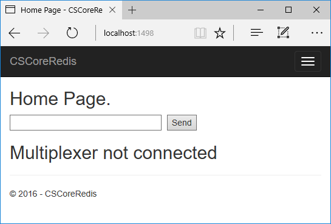
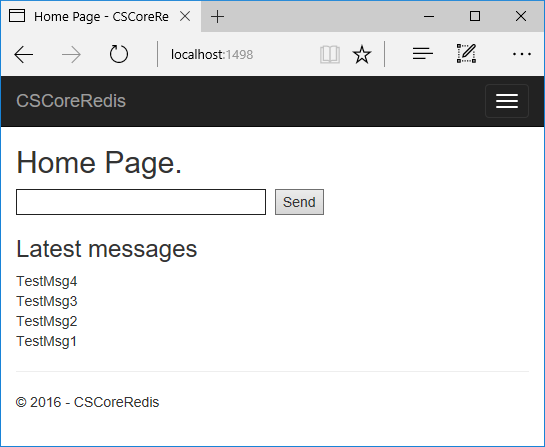
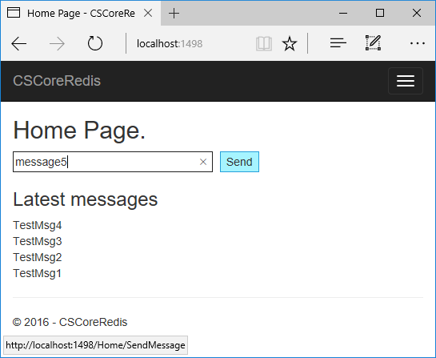
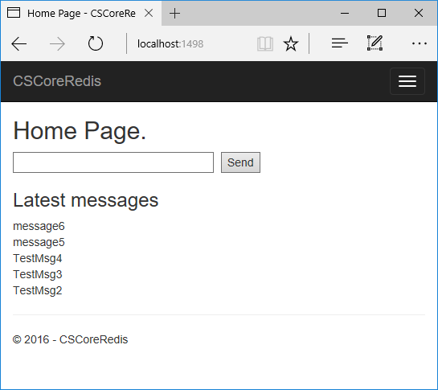

# How to use Redis in ASP.NET Core
## Requires
- Visual Studio 2015
## License
- Apache License, Version 2.0
## Technologies
- ASP.NET
- Caching
- .NET
- Web App Development
- ASP.NET Core
## Topics
- redis
- ASP.NET Core
## Updated
- 11/13/2016
## Description

How to use Redis in ASP.NET Core

Introduction

This sample demonstrates how to use Redis in ASP.NET Core.

Building the sample

This sample should be run in Microsoft Visual Studio 2015 version.

Before you&nbsp;build
the project, make sure you have installed&nbsp;StackExchange.Redis&nbsp;package
 in the project. The following steps can help you to install it:

&bull;&nbsp;Open the solution
CSCoreRedis.sln.

&bull;&nbsp;Right click the project and select [Manage&nbsp;NuGet&nbsp;Packages...].

&bull;&nbsp;Search&nbsp;StackExchange.Redis&nbsp;from
 the Browse tab page. Find the right package and then install it.

Running the sample

If you don&rsquo;t have Redis on your server,
download <a href="http://redis.io/download" style="text-decoration:none">here</a>.

While the project does not support Windows officially, you can get the Windows port targeting Win64 that&nbsp;is developed by Microsoft Open Tech group. See
<a href="https://github.com/MSOpenTech/redis" style="text-decoration:none">https://github.com/MSOpenTech/redis</a>.

Before you run this project, please replace your Redis connection string&nbsp;with the code.

&nbsp;

C#

Edit|Remove

csharp

<pre class="csharp">private&nbsp;static&nbsp;Lazy&lt;ConnectionMultiplexer&gt;&nbsp;lazyConnection&nbsp;=&nbsp;new&nbsp;Lazy&lt;ConnectionMultiplexer&gt;(()&nbsp;=&gt;&nbsp;
{&nbsp;
&nbsp;&nbsp;&nbsp;&nbsp;return&nbsp;ConnectionMultiplexer.Connect(&quot;localhost,abortConnect=false&quot;);&nbsp;
});</pre>

&nbsp;

Do one of the following:

&bull;&nbsp;Click the Start Debugging button on the toolbar.

&bull;&nbsp;Click Start Debugging in the Debug menu.

&bull;&nbsp;Press F5.

&nbsp;

If your Redis service is down. You will see this page

&nbsp;

Start the Redis service.

&nbsp;

Input some text in the input box

&nbsp;

Click send button. The latest messages only show the latest 5 items.

&nbsp;

Using the code

Initialize the list.

&nbsp;

C#

Edit|Remove

csharp

<pre class="csharp">public&nbsp;HomeController()&nbsp;
{&nbsp;
&nbsp;&nbsp;&nbsp;&nbsp;db&nbsp;=&nbsp;Connection.GetDatabase();&nbsp;
&nbsp;&nbsp;&nbsp;&nbsp;if&nbsp;(db.IsConnected(ListKeyName)&nbsp;&amp;&amp;&nbsp;(!db.KeyExists(ListKeyName)&nbsp;||&nbsp;!db.KeyType(ListKeyName).Equals(RedisType.List)))&nbsp;
&nbsp;&nbsp;&nbsp;&nbsp;{&nbsp;
&nbsp;&nbsp;&nbsp;&nbsp;&nbsp;&nbsp;&nbsp;&nbsp;//Add&nbsp;sample&nbsp;data.&nbsp;
&nbsp;&nbsp;&nbsp;&nbsp;&nbsp;&nbsp;&nbsp;&nbsp;db.KeyDelete(ListKeyName);&nbsp;
&nbsp;&nbsp;&nbsp;&nbsp;&nbsp;&nbsp;&nbsp;&nbsp;//Push&nbsp;data&nbsp;from&nbsp;the&nbsp;left&nbsp;
&nbsp;&nbsp;&nbsp;&nbsp;&nbsp;&nbsp;&nbsp;&nbsp;db.ListLeftPush(ListKeyName,&nbsp;&quot;TestMsg1&quot;);&nbsp;
&nbsp;&nbsp;&nbsp;&nbsp;&nbsp;&nbsp;&nbsp;&nbsp;db.ListLeftPush(ListKeyName,&nbsp;&quot;TestMsg2&quot;);&nbsp;
&nbsp;&nbsp;&nbsp;&nbsp;&nbsp;&nbsp;&nbsp;&nbsp;db.ListLeftPush(ListKeyName,&nbsp;&quot;TestMsg3&quot;);&nbsp;
&nbsp;&nbsp;&nbsp;&nbsp;&nbsp;&nbsp;&nbsp;&nbsp;db.ListLeftPush(ListKeyName,&nbsp;&quot;TestMsg4&quot;);&nbsp;
&nbsp;&nbsp;&nbsp;&nbsp;}&nbsp;
}&nbsp;</pre>

&nbsp;

Show the latest 5 messages.

C#

Edit|Remove

csharp

<pre class="csharp">[HttpPost]&nbsp;
public&nbsp;ActionResult&nbsp;SendMessage(string&nbsp;message)&nbsp;
{&nbsp;
&nbsp;&nbsp;&nbsp;&nbsp;//Add&nbsp;message&nbsp;to&nbsp;the&nbsp;list&nbsp;from&nbsp;left&nbsp;
&nbsp;&nbsp;&nbsp;&nbsp;if&nbsp;(db.IsConnected(ListKeyName))&nbsp;
&nbsp;&nbsp;&nbsp;&nbsp;{&nbsp;
&nbsp;&nbsp;&nbsp;&nbsp;&nbsp;&nbsp;&nbsp;&nbsp;db.ListLeftPush(ListKeyName,&nbsp;message);&nbsp;
&nbsp;&nbsp;&nbsp;&nbsp;}&nbsp;
&nbsp;&nbsp;&nbsp;&nbsp;return&nbsp;RedirectToAction(&quot;Index&quot;);&nbsp;
}&nbsp;</pre>

&nbsp;

&nbsp;

Add the message to the list.

C#

Edit|Remove

csharp

<pre class="csharp">[HttpPost]&nbsp;
public&nbsp;ActionResult&nbsp;SendMessage(string&nbsp;message)&nbsp;
{&nbsp;
&nbsp;&nbsp;&nbsp;&nbsp;//Add&nbsp;message&nbsp;to&nbsp;the&nbsp;list&nbsp;from&nbsp;left&nbsp;
&nbsp;&nbsp;&nbsp;&nbsp;if&nbsp;(db.IsConnected(ListKeyName))&nbsp;
&nbsp;&nbsp;&nbsp;&nbsp;{&nbsp;
&nbsp;&nbsp;&nbsp;&nbsp;&nbsp;&nbsp;&nbsp;&nbsp;db.ListLeftPush(ListKeyName,&nbsp;message);&nbsp;
&nbsp;&nbsp;&nbsp;&nbsp;}&nbsp;
&nbsp;&nbsp;&nbsp;&nbsp;return&nbsp;RedirectToAction(&quot;Index&quot;);&nbsp;
}&nbsp;
</pre>

Index view

HTML

Edit|Remove

html

<pre class="html">@{&nbsp;
&nbsp;&nbsp;&nbsp;&nbsp;ViewData[&quot;Title&quot;]&nbsp;=&nbsp;&quot;Home&nbsp;Page&quot;;&nbsp;
}&nbsp;
@model&nbsp;IEnumerable&lt;string&gt;&nbsp;
&nbsp;
&lt;h2&gt;@ViewData[&quot;Title&quot;].&lt;/h2&gt;&nbsp;
&nbsp;
&lt;form&nbsp;action=&quot;/Home/SendMessage&quot;&nbsp;method=&quot;post&quot;&gt;&nbsp;
&nbsp;&nbsp;&nbsp;&nbsp;&lt;input&nbsp;type=&quot;text&quot;&nbsp;name=&quot;message&quot;&nbsp;style=&quot;width:250px&quot;&nbsp;/&gt;&nbsp;
&nbsp;&nbsp;&nbsp;&nbsp;&lt;input&nbsp;name=&quot;btnSend&quot;&nbsp;value=&quot;Send&quot;&nbsp;type=&quot;submit&quot;&nbsp;style=&quot;margin-left:5px&quot;&nbsp;/&gt;&nbsp;
&lt;/form&gt;&nbsp;
&nbsp;
@if&nbsp;(@ViewData[&quot;Error&quot;]&nbsp;!=&nbsp;null)&nbsp;
{&nbsp;
&nbsp;&nbsp;&nbsp;&nbsp;&lt;h2&gt;@ViewData[&quot;Error&quot;]&lt;/h2&gt;&nbsp;
}&nbsp;
else&nbsp;
{&nbsp;
&nbsp;&nbsp;&nbsp;&nbsp;&lt;div&nbsp;id=&quot;MessageList&quot;&gt;&nbsp;
&nbsp;&nbsp;&nbsp;&nbsp;&lt;h3&gt;Latest&nbsp;messages&lt;/h3&gt;&nbsp;
&nbsp;&nbsp;&nbsp;&nbsp;@foreach&nbsp;(var&nbsp;msg&nbsp;in&nbsp;Model)&nbsp;
&nbsp;&nbsp;&nbsp;&nbsp;{&nbsp;
&nbsp;&nbsp;&nbsp;&nbsp;&nbsp;&nbsp;&nbsp;&nbsp;&lt;div&gt;@Html.DisplayFor(modelItem&nbsp;=&gt;&nbsp;msg)&nbsp;&lt;/div&gt;&nbsp;
&nbsp;&nbsp;&nbsp;&nbsp;}&nbsp;
&nbsp;&nbsp;&nbsp;&nbsp;&lt;/div&gt;&nbsp;&nbsp;
}</pre>

&nbsp;

More information

See more about&nbsp;<a href="http://redis.io">Redis</a>

<a href="https://github.com/MSOpenTech/redis" style="text-decoration:none">Redis on Windows</a>&nbsp;project by Microsoft Open Tech

StackExchange.Redis <a href="https://github.com/StackExchange/StackExchange.Redis" style="text-decoration:none">Documentation</a>

<a href="https://azure.microsoft.com/en-us/services/cache/" style="text-decoration:none">Azure Redis Cache</a>

Microsoft All-In-One Code Framework is a free, centralized code sample library driven by developers' real-world pains and needs. The goal is to provide customer-driven code samples for all Microsoft development technologies,
 and reduce developers' efforts in solving typical programming tasks. Our team listens to developers&rsquo; pains in the MSDN forums, social media and various DEV communities. We write code samples based on developers&rsquo; frequently asked programming tasks,
 and allow developers to download them with a short sample publishing cycle. Additionally, we offer a free code sample request service. It is a proactive way for our developer community to obtain code samples directly from Microsoft.

