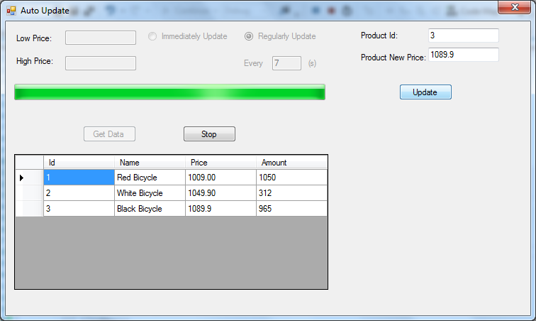

# How to use SqlDependency to get the notification in Entity Framework
## Requires
- Visual Studio 2012
## License
- Apache License, Version 2.0
## Technologies
- ADO.NET
- Data Access
- Entity Framework
- .NET Development
## Topics
- Entity Frameowork
- Sqldependency
- automatically update
## Updated
- 08/17/2016
## Description

<h1><em></em></h1>
<h1>如何在 Entity Framework 中透過 Sqldependency 自動更新資料 (CSEFAutoUpdate)</h1>
<h2>簡介</h2>

我們可以在資料庫中使用 Sqldependency 在變更資料時取得通知，但 EF 沒有相同的功能。在此範例中，我們會示範如何在 Entity Framework 中透過 Sqldependency 自動更新。

在此範例中，我們會示範兩種使用 SqlDependency 取得變更通知以自動更新資料的方法：

1. 立即取得變更通知。

2. 定期取得變更通知。

<h2>建置範例</h2>

在執行範例前，您必須先完成下列步驟：

步驟 1.在 App.config-&gt; &lt;configuration&gt;-&gt; &lt;connectionStrings&gt; 中，將連接字串修改為您的 SQL Server 2008 資料庫執行個體。

<h2>執行範例</h2>

請按下 F5 以執行範例，結果如下所示。<em> 
</em>

<h1></h1>

<strong>1. 立即更新 </strong>

首先，輸入價&#26684;範圍以取得產品，或直接按一下 [<strong><em>Get Data</em></strong>] 按鈕以取得所有產品。 <strong>
&nbsp;</strong><em>&nbsp;</em>

第二，您可以按一下 DataGridView 中的儲存&#26684;以選取產品或在 [<strong><em>Product Id</em></strong>] 中輸入識別碼，然後輸入新價&#26684;。按一下 [<strong><em>Update</em></strong>] 按鈕後，系統便會更新 DataGridView 中的&#20540;。<strong>&nbsp;</strong><em></em>

最後，您可以按一下 [<strong><em>Stop</em></strong>] 按鈕以停止更新。

<strong>2. 定期更新 </strong>

首先，輸入價&#26684;範圍以取得產品，並輸入秒數以設定更新週期。<strong></strong><em></em>

然後您可以輸入新價&#26684;並更新。週期結束時便會更新該&#20540;<strong>。&nbsp;</strong><em>&nbsp;</em>

<h2>使用程式碼</h2>

1. <strong>取得 ObjectQuery</strong>

我們需要連接字串、命令字串和參數才能建立 SqlDependency，因此我們必須取得 ObjectQuery。如果我們使用 DbQuery 進行查詢，則會先將 DbQuery 轉換為 ObjectQuery。<strong></strong><em></em>

C#

Edit|Remove

csharp

<pre class="csharp">public&nbsp;static&nbsp;ObjectQuery&nbsp;GetObjectQuery&lt;TEntity&gt;(DbContext&nbsp;context,&nbsp;IQueryable&nbsp;query)&nbsp;
&nbsp;&nbsp;&nbsp;&nbsp;where&nbsp;TEntity&nbsp;:&nbsp;class&nbsp;
{&nbsp;
&nbsp;&nbsp;&nbsp;&nbsp;if&nbsp;(query&nbsp;is&nbsp;ObjectQuery)&nbsp;
&nbsp;&nbsp;&nbsp;&nbsp;&nbsp;&nbsp;&nbsp;&nbsp;return&nbsp;query&nbsp;as&nbsp;ObjectQuery;&nbsp;
&nbsp;
&nbsp;
&nbsp;&nbsp;&nbsp;&nbsp;if&nbsp;(context&nbsp;==&nbsp;null)&nbsp;
&nbsp;&nbsp;&nbsp;&nbsp;&nbsp;&nbsp;&nbsp;&nbsp;throw&nbsp;new&nbsp;ArgumentException(&quot;Paramter&nbsp;cannot&nbsp;be&nbsp;null&quot;,&nbsp;&quot;context&quot;);&nbsp;
&nbsp;
&nbsp;
&nbsp;&nbsp;&nbsp;&nbsp;//&nbsp;使用&nbsp;DbContext&nbsp;建立&nbsp;ObjectContext&nbsp;
&nbsp;&nbsp;&nbsp;&nbsp;ObjectContext&nbsp;objectContext&nbsp;=&nbsp;((IObjectContextAdapter)context).ObjectContext;&nbsp;
&nbsp;&nbsp;&nbsp;&nbsp;//&nbsp;使用&nbsp;DbSet&nbsp;建立&nbsp;ObjectSet&nbsp;並取得適合的提供者。&nbsp;
&nbsp;&nbsp;&nbsp;&nbsp;IQueryable&nbsp;iqueryable&nbsp;=&nbsp;objectContext.CreateObjectSet&lt;TEntity&gt;()&nbsp;as&nbsp;IQueryable;&nbsp;
&nbsp;&nbsp;&nbsp;&nbsp;IQueryProvider&nbsp;provider&nbsp;=&nbsp;iqueryable.Provider;&nbsp;
&nbsp;
&nbsp;
&nbsp;&nbsp;&nbsp;&nbsp;//&nbsp;使用提供者和運算式建立&nbsp;ObjectQuery。&nbsp;
&nbsp;&nbsp;&nbsp;&nbsp;return&nbsp;provider.CreateQuery(query.Expression)&nbsp;as&nbsp;ObjectQuery;&nbsp;
}&nbsp;
</pre>

2. <strong>立即更新</strong>

在啟動 SqlDependency 前，停止所有 SqlDependency。<strong></strong><em></em>

C#

Edit|Remove

csharp

<pre class="csharp">private&nbsp;void&nbsp;BeginSqlDependency()&nbsp;
{&nbsp;
&nbsp;&nbsp;&nbsp;&nbsp;SqlDependency.Stop(QueryExtension.GetConnectionString(oquery));&nbsp;
&nbsp;&nbsp;&nbsp;&nbsp;SqlDependency.Start(QueryExtension.GetConnectionString(oquery));&nbsp;
&nbsp;
&nbsp;
&nbsp;&nbsp;&nbsp;&nbsp;RegisterSqlDependency();&nbsp;
}&nbsp;
&nbsp;
</pre>

然後登錄 SqlDependency。

C#

Edit|Remove

csharp

<pre class="csharp">private&nbsp;void&nbsp;RegisterSqlDependency()&nbsp;
{&nbsp;
&nbsp;&nbsp;&nbsp;&nbsp;if&nbsp;(command&nbsp;==&nbsp;null&nbsp;||&nbsp;connection&nbsp;==&nbsp;null)&nbsp;
&nbsp;&nbsp;&nbsp;&nbsp;{&nbsp;
&nbsp;&nbsp;&nbsp;&nbsp;&nbsp;&nbsp;&nbsp;&nbsp;throw&nbsp;new&nbsp;ArgumentException(&quot;command&nbsp;and&nbsp;connection&nbsp;cannot&nbsp;be&nbsp;null&quot;);&nbsp;
&nbsp;&nbsp;&nbsp;&nbsp;}&nbsp;
&nbsp;
&nbsp;
&nbsp;&nbsp;&nbsp;&nbsp;//&nbsp;確定命令物件沒有&nbsp;
&nbsp;&nbsp;&nbsp;&nbsp;//&nbsp;與其相關的&nbsp;notification&nbsp;物件。&nbsp;
&nbsp;&nbsp;&nbsp;&nbsp;command.Notification&nbsp;=&nbsp;null;&nbsp;
&nbsp;
&nbsp;
&nbsp;&nbsp;&nbsp;&nbsp;//&nbsp;建立&nbsp;SqlDependency&nbsp;物件並將其繫結至&nbsp;command&nbsp;物件。&nbsp;
&nbsp;&nbsp;&nbsp;&nbsp;dependency&nbsp;=&nbsp;new&nbsp;SqlDependency(command);&nbsp;
&nbsp;&nbsp;&nbsp;&nbsp;dependency.OnChange&nbsp;&#43;=&nbsp;new&nbsp;OnChangeEventHandler(DependencyOnChange);&nbsp;
&nbsp;
&nbsp;
&nbsp;&nbsp;&nbsp;&nbsp;//&nbsp;登錄&nbsp;SqlDependency&nbsp;後必須執行&nbsp;SqlCommand，否則我們無法&nbsp;
&nbsp;&nbsp;&nbsp;&nbsp;//&nbsp;取得通知。&nbsp;
&nbsp;&nbsp;&nbsp;&nbsp;RegisterSqlCommand();&nbsp;
}&nbsp;
</pre>

變更資料時，將引發事件處理常式。<strong></strong><em></em>

C#

Edit|Remove

csharp

<pre class="csharp">private&nbsp;void&nbsp;DependencyOnChange(object&nbsp;sender,&nbsp;SqlNotificationEventArgs&nbsp;e)&nbsp;
{&nbsp;
&nbsp;&nbsp;&nbsp;&nbsp;//&nbsp;移動原始&nbsp;SqlDependency&nbsp;事件處理常式。&nbsp;
&nbsp;&nbsp;&nbsp;&nbsp;SqlDependency&nbsp;dependency&nbsp;=(SqlDependency)sender;&nbsp;
&nbsp;&nbsp;&nbsp;&nbsp;dependency.OnChange&nbsp;-=&nbsp;DependencyOnChange;&nbsp;
&nbsp;
&nbsp;
&nbsp;&nbsp;&nbsp;&nbsp;if&nbsp;(OnChanged&nbsp;!=&nbsp;null)&nbsp;
&nbsp;&nbsp;&nbsp;&nbsp;{&nbsp;
&nbsp;&nbsp;&nbsp;&nbsp;&nbsp;&nbsp;&nbsp;&nbsp;OnChanged(this,null);&nbsp;
&nbsp;&nbsp;&nbsp;&nbsp;}&nbsp;
&nbsp;
&nbsp;
&nbsp;&nbsp;&nbsp;&nbsp;//&nbsp;我們會重新登錄&nbsp;SqlDependency。&nbsp;
&nbsp;&nbsp;&nbsp;&nbsp;RegisterSqlDependency();&nbsp;
}&nbsp;
</pre>

3. <strong>定期更新 </strong>

登錄 SqlDependency 時，我們會建立 Threading.Timer 並設定委派、狀態、延遲時間、週期，然後執行該項目。<strong></strong><em></em>

C#

Edit|Remove

csharp

<pre class="csharp">private&nbsp;void&nbsp;RegisterSqlDependency()&nbsp;
{&nbsp;
&nbsp;&nbsp;&nbsp;&nbsp;if&nbsp;(connection&nbsp;==&nbsp;null&nbsp;||&nbsp;command&nbsp;==&nbsp;null)&nbsp;
&nbsp;&nbsp;&nbsp;&nbsp;{&nbsp;
&nbsp;&nbsp;&nbsp;&nbsp;&nbsp;&nbsp;&nbsp;&nbsp;throw&nbsp;new&nbsp;ArgumentException(&quot;command&nbsp;and&nbsp;connection&nbsp;cannot&nbsp;be&nbsp;null&quot;);&nbsp;
&nbsp;&nbsp;&nbsp;&nbsp;}&nbsp;
&nbsp;
&nbsp;
&nbsp;&nbsp;&nbsp;&nbsp;//&nbsp;確定命令物件沒有&nbsp;
&nbsp;&nbsp;&nbsp;&nbsp;//&nbsp;與其相關的&nbsp;notification&nbsp;物件。&nbsp;
&nbsp;&nbsp;&nbsp;&nbsp;command.Notification&nbsp;=&nbsp;null;&nbsp;
&nbsp;
&nbsp;
&nbsp;&nbsp;&nbsp;&nbsp;//&nbsp;建立&nbsp;SqlDependency&nbsp;物件並將其繫結&nbsp;
&nbsp;&nbsp;&nbsp;&nbsp;//&nbsp;至&nbsp;command&nbsp;物件。&nbsp;
&nbsp;&nbsp;&nbsp;&nbsp;dependency&nbsp;=&nbsp;new&nbsp;SqlDependency(command);&nbsp;
&nbsp;&nbsp;&nbsp;&nbsp;Console.WriteLine(&quot;Id&nbsp;of&nbsp;sqldependency:{0}&quot;,&nbsp;dependency.Id);&nbsp;
&nbsp;
&nbsp;
&nbsp;&nbsp;&nbsp;&nbsp;RegisterSqlCommand();&nbsp;
&nbsp;
&nbsp;
&nbsp;&nbsp;&nbsp;&nbsp;timer&nbsp;=&nbsp;new&nbsp;Timer(CheckChange,&nbsp;null,&nbsp;0,&nbsp;interval);&nbsp;
&nbsp;&nbsp;&nbsp;&nbsp;timer.Change(0,&nbsp;interval);&nbsp;
}&nbsp;
</pre>

&nbsp;然後週期結束時，將引發委派。<strong></strong><em></em>

C#

Edit|Remove

csharp

<pre class="csharp">privatevoid&nbsp;CheckChange(object&nbsp;state)&nbsp;
{&nbsp;
&nbsp;&nbsp;&nbsp;&nbsp;if&nbsp;(dependency!=null&amp;&amp;dependency.HasChanges)&nbsp;
&nbsp;&nbsp;&nbsp;&nbsp;{&nbsp;
&nbsp;&nbsp;&nbsp;&nbsp;&nbsp;&nbsp;&nbsp;&nbsp;if&nbsp;(OnChanged&nbsp;!=&nbsp;null)&nbsp;
&nbsp;&nbsp;&nbsp;&nbsp;&nbsp;&nbsp;&nbsp;&nbsp;{&nbsp;
&nbsp;&nbsp;&nbsp;&nbsp;&nbsp;&nbsp;&nbsp;&nbsp;&nbsp;&nbsp;&nbsp;&nbsp;OnChanged(this,&nbsp;null);&nbsp;
&nbsp;&nbsp;&nbsp;&nbsp;&nbsp;&nbsp;&nbsp;&nbsp;}&nbsp;
&nbsp;&nbsp;&nbsp;&nbsp;}&nbsp;
}&nbsp;
&nbsp;
</pre>

<a title="自動產生 <a class="libraryLink" href="https://msdn.microsoft.com/zh-TW/library/System.Data.SqlClient.SqlDependency.aspx" target="_blank" title="Auto generated link to System.Data.SqlClient.SqlDependency">System.Data.SqlClient.SqlDependency</a> 連結" href="http://msdn.microsoft.com/query/dev11.query?appId=Dev11IDEF1&l=EN-US&k=k(&lt;a class=">System.Data.SqlClient.SqlDependency</a>);k(TargetFrameworkMoniker-.NETFramework,Version%3Dv4.5);k(DevLang-csharp)&amp;rd=true&quot;&gt;SqlDependency
 類別 (機器翻譯)

<a href="http://msdn.microsoft.com/zh-tw/library/a52dhwx7.aspx">Windows 應用程式中的 SqlDependency (ADO.NET)</a>

<a href="http://msdn.microsoft.com/zh-tw/library/System.Threading.Timer.aspx">Timer 類別</a> (機器翻譯)<strong></strong><em></em>

<strong>&nbsp;</strong><em>&nbsp;</em>

Microsoft All-In-One Code Framework is a free, centralized code sample library driven by developers' real-world pains and needs. The goal is to provide customer-driven code samples for all Microsoft development technologies, and
 reduce developers' efforts in solving typical programming tasks. Our team listens to developers&rsquo; pains in the MSDN forums, social media and various DEV communities. We write code samples based on developers&rsquo; frequently asked programming tasks,
 and allow developers to download them with a short sample publishing cycle. Additionally, we offer a free code sample request service. It is a proactive way for our developer community to obtain code samples directly from Microsoft.

<strong>&nbsp;</strong><em>&nbsp;</em>

<em> 
</em>

<em>&nbsp;</em><strong></strong><em></em>

