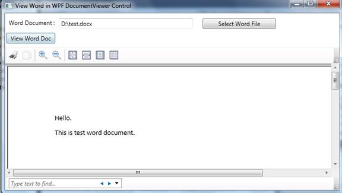

# How to view word document in WPF application (CSVSTOViewWordInWPF)
## Requires
- Visual Studio 2010
## License
- MS-LPL
## Technologies
- Office
- Office Development
## Topics
- Word
- WPF application
## Updated
- 12/25/2012
## Description

<h1>How to view word document in WPF application (CSVSTOViewWordInWPF)</h1>
<h2>Introduction</h2>

The Sample demonstrates how to view word document in WPF application. WPF does not support to view Word documents directly but some customers want to show word document in WPF. So we can use WPF DocumentViewer control to host fixed document
 such as XPS document. And we also can convert word document to xps document using VSTO.

<h2>Building the Sample</h2>

Before building the sample, please make sure that you have Installed Microsoft Office 2010 on your machine.

<h2>Running the Sample</h2>

Step 1. Open CSVSTOViewWordInWPF.sln and click Ctrl&#43;F5 to run the project. You will see the following form:

Step 2. Click &quot;Select Word File&quot; button to select an existing word document on your machine

Step 3. Click &quot;View Word Doc&quot; button to View Word document in WPF DocumentViewer control. If word document isn't exist, when you click the &quot;View Word Doc&quot;, you will get the prompt message with &quot;The file is invalid.
 Please select an existing file again.&quot;

If word document is existing on machine and there is no error occurs, you will see the following form:

<h2>Using the Code</h2>

Step 1. Create WPF Application project via Visual Studio

Step 2. Add needed references to the project

Step 3. Import the needed namespace into the mainWindow.xaml.cs class.

C#

Edit|Remove

csharp
<pre class="hidden">
using System;
using System.IO;
using System.Windows;
using System.Windows.Xps.Packaging;
using Microsoft.Office.Interop.Word;
using Microsoft.Win32;
using Word = Microsoft.Office.Interop.Word;

</pre>
<pre id="codePreview" class="csharp">
using System;
using System.IO;
using System.Windows;
using System.Windows.Xps.Packaging;
using Microsoft.Office.Interop.Word;
using Microsoft.Win32;
using Word = Microsoft.Office.Interop.Word;

</pre>

&nbsp;

Step 4. Design WPF UI form using XAML codes

XAML

Edit|Remove

xaml
<pre class="hidden">
&lt;Grid&gt;
       &lt;Grid.RowDefinitions&gt;
           &lt;RowDefinition Height=&quot;70&quot;&gt;&lt;/RowDefinition&gt;
           &lt;RowDefinition&gt;&lt;/RowDefinition&gt;
       &lt;/Grid.RowDefinitions&gt;
       &lt;Label Name=&quot;lable1&quot; Margin=&quot;3,6,0,0&quot; Content=&quot;Word Document :&quot; VerticalAlignment=&quot;Top&quot; HorizontalAlignment=&quot;Left&quot; /&gt;
       &lt;TextBox  Name=&quot;txbSelectedWordFile&quot; VerticalAlignment=&quot;Top&quot;  HorizontalAlignment=&quot;Stretch&quot; Margin=&quot;110,10,300,0&quot; HorizontalContentAlignment=&quot;Left&quot; /&gt;
       &lt;Button HorizontalAlignment=&quot;Right&quot; VerticalAlignment=&quot;Top&quot; Width=&quot;150&quot; Content=&quot;Select Word File&quot; Name=&quot;btnSelectWord&quot; Margin=&quot;0,10,130,0&quot; Click=&quot;btnSelectWord_Click&quot; /&gt;
       &lt;Button HorizontalAlignment=&quot;Left&quot; Margin=&quot;3,40,0,0&quot; VerticalAlignment=&quot;Top&quot; Content=&quot;View Word Doc&quot; Width=&quot;100&quot; Name=&quot;btnViewDoc&quot; Click=&quot;btnViewDoc_Click&quot; /&gt;
       &lt;DocumentViewer Grid.Row=&quot;1&quot; Name=&quot;documentviewWord&quot; VerticalAlignment=&quot;Top&quot; HorizontalAlignment=&quot;Left&quot;/&gt;
   &lt;/Grid&gt;

</pre>
<pre id="codePreview" class="xaml">
&lt;Grid&gt;
       &lt;Grid.RowDefinitions&gt;
           &lt;RowDefinition Height=&quot;70&quot;&gt;&lt;/RowDefinition&gt;
           &lt;RowDefinition&gt;&lt;/RowDefinition&gt;
       &lt;/Grid.RowDefinitions&gt;
       &lt;Label Name=&quot;lable1&quot; Margin=&quot;3,6,0,0&quot; Content=&quot;Word Document :&quot; VerticalAlignment=&quot;Top&quot; HorizontalAlignment=&quot;Left&quot; /&gt;
       &lt;TextBox  Name=&quot;txbSelectedWordFile&quot; VerticalAlignment=&quot;Top&quot;  HorizontalAlignment=&quot;Stretch&quot; Margin=&quot;110,10,300,0&quot; HorizontalContentAlignment=&quot;Left&quot; /&gt;
       &lt;Button HorizontalAlignment=&quot;Right&quot; VerticalAlignment=&quot;Top&quot; Width=&quot;150&quot; Content=&quot;Select Word File&quot; Name=&quot;btnSelectWord&quot; Margin=&quot;0,10,130,0&quot; Click=&quot;btnSelectWord_Click&quot; /&gt;
       &lt;Button HorizontalAlignment=&quot;Left&quot; Margin=&quot;3,40,0,0&quot; VerticalAlignment=&quot;Top&quot; Content=&quot;View Word Doc&quot; Width=&quot;100&quot; Name=&quot;btnViewDoc&quot; Click=&quot;btnViewDoc_Click&quot; /&gt;
       &lt;DocumentViewer Grid.Row=&quot;1&quot; Name=&quot;documentviewWord&quot; VerticalAlignment=&quot;Top&quot; HorizontalAlignment=&quot;Left&quot;/&gt;
   &lt;/Grid&gt;

</pre>

&nbsp;

Step 5. Handle the events in behind class.

C#

Edit|Remove

csharp
<pre class="hidden">
/// &lt;summary&gt;
       ///  Select Word file 
       /// &lt;/summary&gt;
       /// &lt;param name=&quot;sender&quot;&gt;&lt;/param&gt;
       /// &lt;param name=&quot;e&quot;&gt;&lt;/param&gt;
       private void btnSelectWord_Click(object sender, RoutedEventArgs e)
       {
           // Initialize an OpenFileDialog
           OpenFileDialog openFileDialog = new OpenFileDialog();

           // Set filter and RestoreDirectory
           openFileDialog.RestoreDirectory = true;
           openFileDialog.Filter = &quot;Word documents(*.doc;*.docx)|*.doc;*.docx&quot;;

           bool? result =openFileDialog.ShowDialog();
           if (result==true)
           {
               if (openFileDialog.FileName.Length &gt; 0)
               {
                   txbSelectedWordFile.Text = openFileDialog.FileName;
               }
           }
       }

       /// &lt;summary&gt;
       ///  Convert the word document to xps document
       /// &lt;/summary&gt;
       /// &lt;param name=&quot;wordFilename&quot;&gt;Word document Path&lt;/param&gt;
       /// &lt;param name=&quot;xpsFilename&quot;&gt;Xps document Path&lt;/param&gt;
       /// &lt;returns&gt;&lt;/returns&gt;
       private XpsDocument ConvertWordToXps(string wordFilename, string xpsFilename)
       {
           // Create a WordApplication and host word document
           Word.Application wordApp = new Microsoft.Office.Interop.Word.Application();
           try
           {
               wordApp.Documents.Open(wordFilename);
               
               // To Invisible the word document
               wordApp.Application.Visible = false;

               // Minimize the opened word document
               wordApp.WindowState = WdWindowState.wdWindowStateMinimize;

               Document doc = wordApp.ActiveDocument;

               doc.SaveAs(xpsFilename, WdSaveFormat.wdFormatXPS);

               XpsDocument xpsDocument = new XpsDocument(xpsFilename, FileAccess.Read);
               return xpsDocument;
           }
           catch (Exception ex)
           {
               MessageBox.Show(&quot;Error occurs, The error message is  &quot; &#43; ex.ToString());
               return null;
           }
           finally
           {
               wordApp.Documents.Close();
               ((_Application)wordApp).Quit(WdSaveOptions.wdDoNotSaveChanges);
           }
       }

       /// &lt;summary&gt;
       ///  View Word Document in WPF DocumentView Control
       /// &lt;/summary&gt;
       /// &lt;param name=&quot;sender&quot;&gt;&lt;/param&gt;
       /// &lt;param name=&quot;e&quot;&gt;&lt;/param&gt;
       private void btnViewDoc_Click(object sender, RoutedEventArgs e)
       {
           string wordDocument =txbSelectedWordFile.Text;
           if (string.IsNullOrEmpty(wordDocument) || !File.Exists(wordDocument))
           {
               MessageBox.Show(&quot;The file is invalid. Please select an existing file again.&quot;);
           }
           else
           {
               string convertedXpsDoc = string.Concat(Path.GetTempPath(), &quot;\\&quot;, Guid.NewGuid().ToString(), &quot;.xps&quot;);
               XpsDocument xpsDocument =ConvertWordToXps(wordDocument, convertedXpsDoc);
               if (xpsDocument == null)
               {
                   return;
               }
  
               documentviewWord.Document = xpsDocument.GetFixedDocumentSequence();
           }
       }

</pre>
<pre id="codePreview" class="csharp">
/// &lt;summary&gt;
       ///  Select Word file 
       /// &lt;/summary&gt;
       /// &lt;param name=&quot;sender&quot;&gt;&lt;/param&gt;
       /// &lt;param name=&quot;e&quot;&gt;&lt;/param&gt;
       private void btnSelectWord_Click(object sender, RoutedEventArgs e)
       {
           // Initialize an OpenFileDialog
           OpenFileDialog openFileDialog = new OpenFileDialog();

           // Set filter and RestoreDirectory
           openFileDialog.RestoreDirectory = true;
           openFileDialog.Filter = &quot;Word documents(*.doc;*.docx)|*.doc;*.docx&quot;;

           bool? result =openFileDialog.ShowDialog();
           if (result==true)
           {
               if (openFileDialog.FileName.Length &gt; 0)
               {
                   txbSelectedWordFile.Text = openFileDialog.FileName;
               }
           }
       }

       /// &lt;summary&gt;
       ///  Convert the word document to xps document
       /// &lt;/summary&gt;
       /// &lt;param name=&quot;wordFilename&quot;&gt;Word document Path&lt;/param&gt;
       /// &lt;param name=&quot;xpsFilename&quot;&gt;Xps document Path&lt;/param&gt;
       /// &lt;returns&gt;&lt;/returns&gt;
       private XpsDocument ConvertWordToXps(string wordFilename, string xpsFilename)
       {
           // Create a WordApplication and host word document
           Word.Application wordApp = new Microsoft.Office.Interop.Word.Application();
           try
           {
               wordApp.Documents.Open(wordFilename);
               
               // To Invisible the word document
               wordApp.Application.Visible = false;

               // Minimize the opened word document
               wordApp.WindowState = WdWindowState.wdWindowStateMinimize;

               Document doc = wordApp.ActiveDocument;

               doc.SaveAs(xpsFilename, WdSaveFormat.wdFormatXPS);

               XpsDocument xpsDocument = new XpsDocument(xpsFilename, FileAccess.Read);
               return xpsDocument;
           }
           catch (Exception ex)
           {
               MessageBox.Show(&quot;Error occurs, The error message is  &quot; &#43; ex.ToString());
               return null;
           }
           finally
           {
               wordApp.Documents.Close();
               ((_Application)wordApp).Quit(WdSaveOptions.wdDoNotSaveChanges);
           }
       }

       /// &lt;summary&gt;
       ///  View Word Document in WPF DocumentView Control
       /// &lt;/summary&gt;
       /// &lt;param name=&quot;sender&quot;&gt;&lt;/param&gt;
       /// &lt;param name=&quot;e&quot;&gt;&lt;/param&gt;
       private void btnViewDoc_Click(object sender, RoutedEventArgs e)
       {
           string wordDocument =txbSelectedWordFile.Text;
           if (string.IsNullOrEmpty(wordDocument) || !File.Exists(wordDocument))
           {
               MessageBox.Show(&quot;The file is invalid. Please select an existing file again.&quot;);
           }
           else
           {
               string convertedXpsDoc = string.Concat(Path.GetTempPath(), &quot;\\&quot;, Guid.NewGuid().ToString(), &quot;.xps&quot;);
               XpsDocument xpsDocument =ConvertWordToXps(wordDocument, convertedXpsDoc);
               if (xpsDocument == null)
               {
                   return;
               }
  
               documentviewWord.Document = xpsDocument.GetFixedDocumentSequence();
           }
       }

</pre>

&nbsp;

<h2>More Information</h2>

XpsDocument Class:

<a href="http://msdn.microsoft.com/en-us/library/system.windows.xps.packaging.xpsdocument(v=VS.85).aspx">http://msdn.microsoft.com/en-us/library/system.windows.xps.packaging.xpsdocument(v=VS.85).aspx</a>

DocumentViewer Class:

<a href="http://msdn.microsoft.com/en-us/library/system.windows.controls.documentviewer.aspx">http://msdn.microsoft.com/en-us/library/system.windows.controls.documentviewer.aspx</a>

Office development with Visual Studio (VSTO):

<a href="http://msdn.microsoft.com/en-US/office/hh133430">http://msdn.microsoft.com/en-US/office/hh133430</a>

