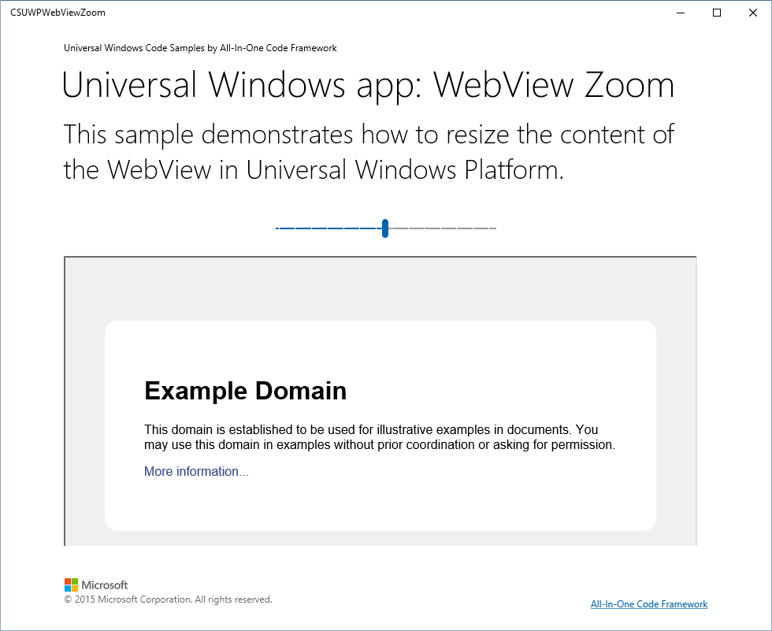

# How to zoom in/out the content in WebView in Universal Windows Platform
## Requires
- Visual Studio 2015
## License
- Apache License, Version 2.0
## Technologies
- Windows
- Windows Phone
- Windows Store app Development
- Windows Phone App Development
- Universal Windows App Development
## Topics
- WebView
## Updated
- 09/22/2016
## Description

<strong></strong><em></em>

How to zoom in/out the content in WebView in Universal Windows Platform

Introduction

This code sample will show you how to zoom in/out the content in WebView in UWP.

To resize the content of the WebView, we can manipulate the content by using JS/CSS that are fully supported by WebView.

Building the Sample

Just build the solution in Visual Studio 2015.

Running the Sample

Make sure you've built the solution successfully. Then you can run the app.

If you launch the Windows Store app, it will look like this:

Using the Code

Step1. Create a Universal Windows app in Visual Studio 2015.

Step2. Design the UI. The following code snippet only shows the page body code. For detailed information, please look into the MainPage.xaml file.

&nbsp;

XAML

Edit|Remove

xaml

<pre class="xaml" id="codePreview">&lt;!-- page body --&gt; 
      &lt;Grid Grid.Row=&quot;2&quot; &gt; 
        &lt;Grid.RowDefinitions&gt; 
            &lt;RowDefinition Height=&quot;auto&quot;&gt;&lt;/RowDefinition&gt; 
            &lt;RowDefinition Height=&quot;*&quot;&gt;&lt;/RowDefinition&gt; 
        &lt;/Grid.RowDefinitions&gt; 
        &lt;StackPanel&gt; 
            &lt;Slider Margin=&quot;10&quot; Minimum=&quot;1&quot; Maximum=&quot;200&quot; Value=&quot;100&quot; Width =&quot;280&quot; ValueChanged=&quot;Slider_ValueChanged&quot; SnapsTo=&quot;Ticks&quot; TickFrequency=&quot;1&quot; /&gt; 
        &lt;/StackPanel&gt; 
        &lt;WebView Grid.Row=&quot;1&quot; x:Name=&quot;MyWebView&quot; Source=&quot;ms-appx-web:///iframe.html&quot; Margin=&quot;0,0,0,10&quot;/&gt; 
      &lt;/Grid&gt; 
</pre>

&nbsp;

&nbsp;

&nbsp;

Step3. Create an html file named &quot;iframe.html&quot;, in which we embed an
iframe element which hosts a web site source. The JavaScript function &quot;ZoomFunction&quot; is used to zoom in/out the web page.

&nbsp;

HTML

Edit|Remove

html

<pre class="html" id="codePreview">&lt;!DOCTYPE html&gt; 
&lt;html lang=&quot;en&quot; xmlns=&quot;http://www.w3.org/1999/xhtml&quot;&gt; 
&lt;head&gt; 
    &lt;meta charset=&quot;utf-8&quot; /&gt; 
    &lt;title&gt;&lt;/title&gt; 
    &lt;script type=&quot;text/javascript&quot;&gt; 
        var OriginalWidth = 0; 
        var OriginalHeight = 0; 
        function ZoomFunction(Percentage) { 
            var mybody = document.getElementById(&quot;mybody&quot;); 
            var myframe = document.getElementById(&quot;myiframe&quot;); 
            
            if (OriginalWidth == 0 &amp;&amp; OriginalHeight == 0) { 
                OriginalWidth = myframe.style.width.replace(&quot;px&quot;, &quot;&quot;); 
                OriginalHeight = myframe.style.height.replace(&quot;px&quot;, &quot;&quot;); 
            } 
             
            if (Percentage &lt; 100) { 
                mybody.style.overflow = &quot;hidden&quot;; 
                myframe.style.overflowY = &quot;auto&quot;; 
                NewWidth = (100 * OriginalWidth) / Percentage; 
                NewHeight = (100 * OriginalHeight) / Percentage; 
            } 
            else if (Percentage == 100) { 
                mybody.style.overflow = &quot;hidden&quot;; 
                myframe.style.overflowY = &quot;auto&quot;; 
                NewWidth = OriginalWidth; 
                NewHeight = OriginalHeight; 
            } 
            else { 
                mybody.style.overflow = &quot;auto&quot;; 
                myframe.style.overflowY = &quot;hidden&quot;; 
                NewWidth = OriginalWidth * (Percentage / 100); 
                NewHeight = OriginalHeight * (Percentage / 10); 
            } 
            myframe.style.zoom = Percentage &#43; &quot;%&quot;; 
            myframe.style.width = NewWidth &#43; &quot;px&quot;; 
            myframe.style.height = NewHeight &#43; &quot;px&quot;; 
        } 
    &lt;/script&gt; 
&lt;/head&gt; 
&lt;body id=&quot;mybody&quot; style=&quot;margin:0px;padding:0px; overflow:hidden;&quot;&gt; 
    &lt;iframe id=&quot;myiframe&quot; src=&quot;http://www.example.com/&quot; style=&quot;width:1200px; height:800px; overflow-X:auto; overflow-y:auto;&quot;&gt;&lt;/iframe&gt; 
&lt;/body&gt; 
&lt;/html&gt; 
</pre>

&nbsp;

&nbsp;

Step4. In the code-behind file of MainPage.xaml, add the following code snippet to make sure the WebView control will call the
ZoomFunction. 

&nbsp;

C#

Edit|Remove

csharp

<pre class="csharp" id="codePreview">private async void Slider_ValueChanged(object sender, RangeBaseValueChangedEventArgs e) 
{ 
    if (MyWebView != null) 
        await MyWebView.InvokeScriptAsync(&quot;eval&quot;, new string[] { &quot;ZoomFunction(&quot; &#43; e.NewValue.ToString() &#43; &quot;);&quot; }); 
} 
</pre>

&nbsp;

&nbsp;

&nbsp;

&nbsp;

More Information

Build universal Windows apps that target Windows and Windows Phone

<a href="http://msdn.microsoft.com/en-us/library/windows/apps/dn609832.aspx" style="text-decoration:none">http://msdn.microsoft.com/en-us/library/windows/apps/dn609832.aspx</a>

Using Visual Studio to build Universal XAML Apps

<a href="http://blogs.msdn.com/b/visualstudio/archive/2014/04/14/using-visual-studio-to-build-universal-xaml-apps.aspx" style="text-decoration:none">http://blogs.msdn.com/b/visualstudio/archive/2014/04/14/using-visual-studio-to-build-universal-xaml-apps.aspx</a>

WebView class 

<a href="http://msdn.microsoft.com/en-us/library/windows/apps/windows.ui.xaml.controls.webview.aspx" style="text-decoration:none">http://msdn.microsoft.com/en-us/library/windows/apps/windows.ui.xaml.controls.webview.aspx</a>

WebView Magic Tricks: Zoom Levels

<a href="http://blogs.msdn.com/b/wsdevsol/archive/2013/05/28/webview-magic-tricks-zoom-levels.aspx" style="text-decoration:none">http://blogs.msdn.com/b/wsdevsol/archive/2013/05/28/webview-magic-tricks-zoom-levels.aspx</a>

&nbsp;

Microsoft All-In-One Code Framework is a free, centralized code sample library driven by developers' real-world pains and needs. The goal is to provide customer-driven code samples for all Microsoft development technologies,
 and reduce developers' efforts in solving typical programming tasks. Our team listens to developers&rsquo; pains in the MSDN forums, social media and various DEV communities. We write code samples based on developers&rsquo; frequently asked programming tasks,
 and allow developers to download them with a short sample publishing cycle. Additionally, we offer a free code sample request service. It is a proactive way for our developer community to obtain code samples directly from Microsoft.

