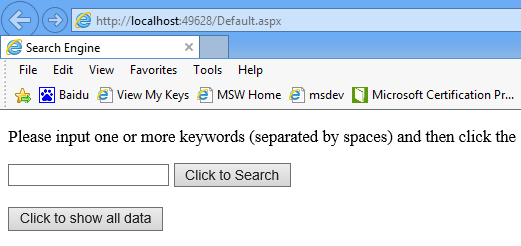
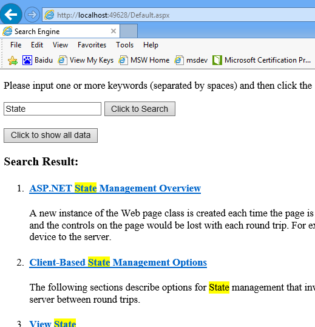

# Implement Search Engine in ASP.NET
## Requires
- Visual Studio 2012
## License
- MS-LPL
## Technologies
- ASP.NET
## Topics
- GridView
- Highlighting
## Updated
- 01/22/2013
## Description

<h1>A simple search engine implemented in ASP.NET (CSASPNETSearchEngine)</h1>
<h2>Introduction</h2>

This sample shows how to implement a simple search engine in an ASP.NET web site.

<h2>Running the Sample</h2>

Step 1: Open the CSASPNETSearchEngine.sln. 
Step 2: Expand the CSASPNETSearchEngine web application and press Ctrl &#43; F5 to show the Default.aspx.

 
Step 3: Type one or more keywords into the text box. 
Click the submit button.

 
Step 4: Validation finished.

<h2>Using the Code</h2>

Step 1: Create the database. 
&nbsp;&nbsp; a. Create a SQL Server database named &quot;MyDatabase.mdf&quot; within App_Data folder. 
&nbsp;&nbsp; b. Create a Table named &quot;Articles&quot; in the database. The definition of the table as shown below:

SQL

Edit|Remove

mysql

<pre id="codePreview" class="mysql">
ID&nbsp;&nbsp;&nbsp;&nbsp;&nbsp;&nbsp; bigint (Primary Key)
Title&nbsp;&nbsp;&nbsp; nvarchar(50)
Content&nbsp; varchar(MAX)

</pre>

&nbsp;

&nbsp;&nbsp; c. Input some sample records to the Table. 
Step 2: Data Access. 
&nbsp;&nbsp; a. Create a class named &quot;Article&quot; represents a record. 
&nbsp;&nbsp; b. Create a class named &quot;DataAccess&quot; to access database. This class contains public methods GetArticle(), GetAll() and Search(). Within Search() method,&nbsp;&nbsp;&nbsp;&nbsp;&nbsp;
the key code is generating a complex Sql command which is used to search database.

C#

Edit|Remove

csharp

<pre id="codePreview" class="csharp">
// Generate a complex Sql command.
&nbsp;&nbsp;&nbsp;&nbsp;&nbsp;&nbsp;&nbsp;&nbsp;&nbsp;&nbsp; StringBuilder sqlBuilder = new StringBuilder();
&nbsp;&nbsp;&nbsp;&nbsp;&nbsp;&nbsp;&nbsp;&nbsp;&nbsp;&nbsp; sqlBuilder.Append(&quot;select * from [Articles] where &quot;);
&nbsp;&nbsp;&nbsp;&nbsp;&nbsp;&nbsp;&nbsp;&nbsp;&nbsp;&nbsp; foreach (string item in keywords)
&nbsp;&nbsp;&nbsp;&nbsp;&nbsp;&nbsp;&nbsp;&nbsp;&nbsp;&nbsp; {
&nbsp;&nbsp;&nbsp;&nbsp;&nbsp;&nbsp;&nbsp;&nbsp;&nbsp;&nbsp;&nbsp;&nbsp;&nbsp;&nbsp; sqlBuilder.AppendFormat(&quot;([Title] like '%{0}%' or [Content] like '%{0}%') and &quot;, item);
&nbsp;&nbsp;&nbsp;&nbsp;&nbsp;&nbsp;&nbsp;&nbsp;&nbsp;&nbsp; }

&nbsp;&nbsp;&nbsp;&nbsp; &nbsp;&nbsp;&nbsp;&nbsp;&nbsp;&nbsp;// Remove unnecessary string &quot; and &quot; at the end of the command.
&nbsp;&nbsp;&nbsp;&nbsp;&nbsp;&nbsp;&nbsp;&nbsp;&nbsp;&nbsp; string sql = sqlBuilder.ToString(0, sqlBuilder.Length - 5);

</pre>

&nbsp;

Step 3: Search Page. 
&nbsp;&nbsp; The key controls of this page is the TextBox control which named &quot;txtKeyWords&quot;. It&#39;s used to input keywords. And the Repeater control is used to display
&nbsp;result.&nbsp; While the following JavaScript function is used to hightlight keywords&nbsp;
in the result. 

JavaScript

Edit|Remove

js

<pre id="codePreview" class="js">
for (var i = 0; i &lt; keywords.length; i&#43;&#43;)
&nbsp;&nbsp;&nbsp;&nbsp;&nbsp;&nbsp;&nbsp;&nbsp;&nbsp; {
&nbsp;&nbsp;&nbsp;&nbsp;&nbsp;&nbsp;&nbsp;&nbsp;&nbsp;&nbsp;&nbsp;&nbsp;&nbsp; var a = new RegExp(keywords[i], &quot;igm&quot;);
&nbsp;&nbsp;&nbsp;&nbsp;&nbsp;&nbsp;&nbsp;&nbsp;&nbsp;&nbsp;&nbsp;&nbsp;&nbsp; container.innerHTML = container.innerHTML.replace(a, &quot;&quot; &#43; keywords[i] &#43; &quot;&quot;);
&nbsp;&nbsp;&nbsp;&nbsp;&nbsp;&nbsp;&nbsp;&nbsp;&nbsp; }

</pre>

&nbsp;

Step 4: Detail Page. 
&nbsp;&nbsp; This page receives a parameter from Query String named &quot;id&quot;, and then calls DataAccess class to retrieve an individual record from database to show in the page. 
Step 5: Build the application and you can debug it.

<h2>More Information</h2>

SQL Server and ADO.NET 
<a href="http://msdn.microsoft.com/en-us/library/kb9s9ks0.aspx">http://msdn.microsoft.com/en-us/library/kb9s9ks0.aspx</a> 
Connecting to a Data Source (ADO.NET) 
<a href="http://msdn.microsoft.com/en-us/library/32c5dh3b.aspx">http://msdn.microsoft.com/en-us/library/32c5dh3b.aspx</a> 
LIKE (Transact-SQL) 
<a href="http://msdn.microsoft.com/en-us/library/ms179859.aspx">http://msdn.microsoft.com/en-us/library/ms179859.aspx</a> 
Repeater Web Server Control Overview 
<a href="http://msdn.microsoft.com/en-us/library/x8f2zez5.aspx">http://msdn.microsoft.com/en-us/library/x8f2zez5.aspx</a> 
How to: Pass Values Between ASP.NET Web Pages 
<a href="http://msdn.microsoft.com/en-us/library/6c3yckfw.aspx">http://msdn.microsoft.com/en-us/library/6c3yckfw.aspx</a>

