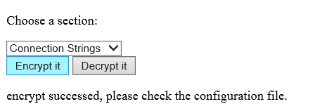

# Programmatically Encrypt and Decrypt Configuration Sections in web.config
## Requires
- Visual Studio 2013
## License
- Apache License, Version 2.0
## Technologies
- ASP.NET
- .NET
- Web App Development
## Topics
- Security
## Updated
- 09/22/2016
## Description

<strong>&nbsp;</strong><em>&nbsp;</em>

How to use RSA encryption algorithm API to encrypt and decrypt
configuration section. (CS\VBASPNETEncryptAndDecryptConfiguration)

Introduction

This sample shows how to use RSA encryption algorithm API to encrypt and decrypt configuration sections in order to protect sensitive
 information from interception or being hijacked in ASP.NET web applications.

Building the Sample

&nbsp;If your application hasn't web.config, please create one. And also specify some sections such as appSetting,
 connectSetting in this web.config.  
How to create Web.config in application:  
<a href="http://support.microsoft.com/kb/815179" style="text-decoration:none">http://support.microsoft.com/kb/815179</a>
 
Working with Web.config Files:  
<a href="http://msdn.microsoft.com/en-us/library/ms460914.aspx" style="text-decoration:none">http://msdn.microsoft.com/en-us/library/ms460914.aspx</a>

Running the Sample

Step 1: Open the CSASPNETEncryptAndDecryptConfiguration.sln.

&nbsp;Step 2: Press Ctrl&#43;F5.

&nbsp;Step 3: Choose a configuration section in
the dropdown list.

&nbsp;Step 4: Click the &quot;encrypt it&quot; button
as shown below. If the encryption
is successful, then open
the web.config file.
You will observe that the specific section is encrypted and is replaced by some RSA data section.

Step 5: If you want to recover this section to plain text,
click the &quot;decrypt it&rdquo; button and check web.config again.

Note: If you are running this application
in the file system, Visual Studio will display a dialog with the message &quot;The file has been modified outside the editor. Do you want to reload it?&quot; when you close the application. Click yes and then view the
 web.config.

Using the Code

1. Get the dropdown list selected value
to assign which configuration section to encrypt or decrypt.

&nbsp;

HTML

Edit|Remove

html

<pre class="html" id="codePreview">&lt;html&gt;
&lt;head&gt;
    &lt;meta name=&quot;viewport&quot; content=&quot;width=device-width&quot; /&gt;
    &lt;title&gt;Index&lt;/title&gt;
    &lt;script src=&quot;~/Scripts/jquery-2.1.1.min.js&quot;&gt;&lt;/script&gt;
    &lt;script type=&quot;text/javascript&quot;&gt;
    $(document).ready(function () {
        $(&quot;#SectionNames&quot;).append($('&lt;option&gt;', {
            value: &quot;connectionStrings&quot;,
            text: &quot;Connection Strings&quot;
            })
        );
        $(&quot;#SectionNames&quot;).append($('&lt;option&gt;', {
            value: &quot;appSettings&quot;,
            text: &quot;Application Settings&quot;
        })
        );
        $(&quot;#SectionNames&quot;).append($('&lt;option&gt;', {
            value: &quot;system.web/machineKey&quot;,
            text: &quot;Machine Key&quot;
        })
        );
        $(&quot;#SectionNames&quot;).append($('&lt;option&gt;', {
            value: &quot;system.web/sessionState&quot;,
            text: &quot;Session State&quot;
        })
        );
    });
    var EncryptConfig = function () {
        var url = &quot;/Home/EncryptConfig&quot;;
        var sectionName = $(&quot;#SectionNames option:selected&quot;).text();
        $.ajax({
            url: url,
            type: &quot;POST&quot;,
            data: &quot;sectionName=&quot; &#43; $(&quot;#SectionNames option:selected&quot;).val(),
            success:function()
            {
                $(&quot;#lbresult&quot;).text(&quot;encrypt successed, please check the configuration file.&quot;);
            },
            error: function () {
                $(&quot;#lbresult&quot;).text(&quot;encrypt failed.&quot;);
            }
        });
    }
    var DecryptConfig = function () {
        var url = &quot;/Home/DecryptConfig&quot;;
        var sectionName = $(&quot;#SectionNames option:selected&quot;).text();
        $.ajax({
            url: url,
            type: &quot;POST&quot;,
            data: &quot;sectionName=&quot; &#43; $(&quot;#SectionNames option:selected&quot;).val(),
            success: function () {
                $(&quot;#lbresult&quot;).text(&quot;decrypt successed, please check the configuration file.&quot;);
            },
            error: function () {
                $(&quot;#lbresult&quot;).text(&quot;decrypt failed.&quot;);
            }
        });
    }
    &lt;/script&gt;
&lt;/head&gt;
&lt;body&gt;
    
 
        
Choose a section:

        &lt;select id=&quot;SectionNames&quot;&gt;&lt;/select&gt;
    

    @*    *@
    

        &lt;button id=&quot;btnEncrypt&quot; onclick=&quot;EncryptConfig()&quot;&gt;Encrypt it&lt;/button&gt;
        &lt;button id=&quot;btnDecrypt&quot; onclick=&quot;DecryptConfig()&quot;&gt;Decrypt it&lt;/button&gt;
    

   
&nbsp;

&lt;/body&gt;
&lt;/html&gt;
</pre>

&nbsp;

&nbsp;

2. Open the web.config in this web application.
 
3. Find the specific section and use RSAProtectedConfigurationProvider to encrypt or decrypt it.

&nbsp;

C#VB

Edit|Remove

csharpvb

<pre class="csharp" id="codePreview">[HttpPost]
public ActionResult EncryptConfig(string sectionName)
{
    if (string.IsNullOrEmpty(sectionName))
    {
        return null;
    }
    Configuration config = WebConfigurationManager.OpenWebConfiguration(Request.ApplicationPath);
    ConfigurationSection section = config.GetSection(sectionName);
    section.SectionInformation.ProtectSection(provider);
    config.Save();
    return Content(&quot;Success&quot;);
}
</pre>

&nbsp;

4. If this sample runs successful, this section will be
 encrypted by RSA and replaced by some RSA section in web.config.

&nbsp;

More Information

RSACryptoServiceProvider
 
<a href="http://msdn.microsoft.com/en-us/library/system.security.cryptography.rsacryptoserviceprovider(VS.80).aspx" style="text-decoration:none">http://msdn.microsoft.com/en-us/library/system.security.cryptography.rsacryptoserviceprovider(VS.80).aspx</a>
 
CspParameters  
<a href="http://msdn.microsoft.com/en-us/library/system.security.cryptography.cspparameters(VS.80).aspx" style="text-decoration:none">http://msdn.microsoft.com/en-us/library/system.security.cryptography.cspparameters(VS.80).aspx</a>
 
ConfigurationSection  
<a href="http://msdn.microsoft.com/en-us/library/system.configuration.configurationsection.aspx" style="text-decoration:none">http://msdn.microsoft.com/en-us/library/system.configuration.configurationsection.aspx</a>
 
SectionInformation.ProtectSection  
<a href="http://msdn.microsoft.com/en-us/library/system.configuration.sectioninformation.protectsection.aspx" style="text-decoration:none">http://msdn.microsoft.com/en-us/library/system.configuration.sectioninformation.protectsection.aspx</a>
 
 

&nbsp;

Microsoft All-In-One Code Framework is a free, centralized code sample library driven by developers' real-world pains and needs. The goal is to provide customer-driven code samples for all Microsoft development technologies,
 and reduce developers' efforts in solving typical programming tasks. Our team listens to developers&rsquo; pains in the MSDN forums, social media and various DEV communities. We write code samples based on developers&rsquo; frequently asked programming tasks,
 and allow developers to download them with a short sample publishing cycle. Additionally, we offer a free code sample request service. It is a proactive way for our developer community to obtain code samples directly from Microsoft.

