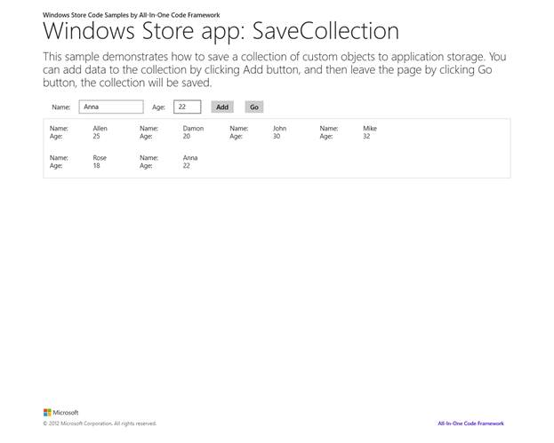

# Save a collection to Application Storage
## Requires
- Visual Studio 2012
## License
- MS-LPL
## Technologies
- Windows 8
## Topics
- XmlSerializer
- Store List/Collection
- DataContractSeriaizer
## Updated
- 02/08/2015
## Description

<h1></h1>
<h1>Uložen&iacute; kolekce vlastn&iacute;ch objektů do m&iacute;stn&iacute;ho &uacute;loži&scaron;tě (CSWindowsStoreAppSaveCollection)</h1>
<h2>&Uacute;vod</h2>

V t&eacute;to uk&aacute;zce je předveden postup při uložen&iacute; kolekce vlastn&iacute;ch objektů do m&iacute;stn&iacute;ho &uacute;loži&scaron;tě.

<h2>Spu&scaron;těn&iacute; uk&aacute;zky</h2>

1.&nbsp;&nbsp;&nbsp;&nbsp;&nbsp;&nbsp;&nbsp;Spusťte aplikaci stisknut&iacute;m kl&aacute;vesy F5.

2.&nbsp;&nbsp;&nbsp;&nbsp;&nbsp;&nbsp;&nbsp;Na obrazovce se zobraz&iacute; tato str&aacute;nka.

3.&nbsp;&nbsp;&nbsp;&nbsp;&nbsp;&nbsp;&nbsp;Zadejte informace a kliknut&iacute;m na tlač&iacute;tko Add přidejte data uk&aacute;zky.

4.&nbsp;&nbsp;&nbsp;&nbsp;&nbsp;&nbsp;&nbsp;Po zad&aacute;n&iacute; dat opusťte tuto str&aacute;nku kliknut&iacute;m na tlač&iacute;tko Go. Na obrazovce se zobraz&iacute; tato str&aacute;nka. Nyn&iacute; je kolekce uložena do m&iacute;stn&iacute;ho &uacute;loži&scaron;tě.

5.&nbsp;&nbsp;&nbsp;&nbsp;&nbsp;&nbsp;&nbsp;Kliknut&iacute;m na tlač&iacute;tko Back přejděte k předchoz&iacute; str&aacute;nce. Uložen&aacute; data se načtou.

6.&nbsp;&nbsp;&nbsp;&nbsp;&nbsp;&nbsp;&nbsp;Můžeme rovněž stisknut&iacute;m kombinace kl&aacute;ves Alt&#43;F4 ukončit aplikaci a spustit ji znovu později, Data se rovněž načtou.

<h2>Použit&iacute; k&oacute;du</h2>

Serializujte objekty do řetězce XML.

C#

Edit|Remove

<pre class="csharp">//Serialize to xml
&nbsp;&nbsp;&nbsp;&nbsp;&nbsp;&nbsp; public static string ToXml(T value)
&nbsp;&nbsp;&nbsp;&nbsp;&nbsp;&nbsp; {
&nbsp;&nbsp;&nbsp;&nbsp;&nbsp;&nbsp;&nbsp;&nbsp;&nbsp;&nbsp; XmlSerializer serializer = new XmlSerializer(typeof(T));
&nbsp;&nbsp;&nbsp;&nbsp;&nbsp;&nbsp;&nbsp;&nbsp;&nbsp;&nbsp; StringBuilder stringBuilder = new StringBuilder();
&nbsp;&nbsp;&nbsp;&nbsp;&nbsp;&nbsp;&nbsp;&nbsp;&nbsp;&nbsp; XmlWriterSettings settings = new XmlWriterSettings()
&nbsp;&nbsp;&nbsp;&nbsp;&nbsp;&nbsp;&nbsp;&nbsp;&nbsp;&nbsp; {
&nbsp;&nbsp;&nbsp;&nbsp;&nbsp;&nbsp;&nbsp;&nbsp;&nbsp;&nbsp;&nbsp;&nbsp;&nbsp;&nbsp; Indent = true,
&nbsp;&nbsp;&nbsp;&nbsp;&nbsp;&nbsp;&nbsp;&nbsp;&nbsp;&nbsp;&nbsp;&nbsp;&nbsp;&nbsp; OmitXmlDeclaration = true,
&nbsp;&nbsp;&nbsp;&nbsp;&nbsp;&nbsp;&nbsp;&nbsp;&nbsp;&nbsp; };

&nbsp;&nbsp;&nbsp;&nbsp;&nbsp;&nbsp;&nbsp;&nbsp;&nbsp;&nbsp; using (XmlWriter xmlWriter = XmlWriter.Create(stringBuilder, settings))
&nbsp;&nbsp;&nbsp;&nbsp;&nbsp;&nbsp;&nbsp;&nbsp;&nbsp;&nbsp; {
&nbsp;&nbsp;&nbsp;&nbsp;&nbsp;&nbsp; &nbsp;&nbsp;&nbsp;&nbsp;&nbsp;&nbsp;&nbsp;&nbsp;serializer.Serialize(xmlWriter, value);
&nbsp;&nbsp;&nbsp;&nbsp;&nbsp;&nbsp;&nbsp;&nbsp;&nbsp;&nbsp; }
&nbsp;&nbsp;&nbsp;&nbsp;&nbsp;&nbsp;&nbsp;&nbsp;&nbsp;&nbsp; return stringBuilder.ToString();
&nbsp;&nbsp;&nbsp;&nbsp;&nbsp;&nbsp; }

</pre>

&nbsp;

Deserializujte objekty z řetězce XML.

C#

Edit|Remove

<pre class="csharp">//Deserialize from xml
&nbsp;&nbsp;&nbsp;&nbsp;&nbsp;&nbsp; public static T FromXml(string xml)
&nbsp;&nbsp;&nbsp;&nbsp;&nbsp;&nbsp; {
&nbsp;&nbsp;&nbsp;&nbsp;&nbsp;&nbsp;&nbsp;&nbsp;&nbsp;&nbsp; XmlSerializer serializer = new XmlSerializer(typeof(T));
&nbsp;&nbsp;&nbsp;&nbsp;&nbsp;&nbsp;&nbsp;&nbsp;&nbsp;&nbsp; T value;
&nbsp;&nbsp;&nbsp;&nbsp;&nbsp;&nbsp;&nbsp;&nbsp;&nbsp;&nbsp; using (StringReader stringReader = new StringReader(xml))
&nbsp;&nbsp; &nbsp;&nbsp;&nbsp;&nbsp;&nbsp;&nbsp;&nbsp;&nbsp;{
&nbsp;&nbsp;&nbsp;&nbsp;&nbsp;&nbsp;&nbsp;&nbsp;&nbsp;&nbsp;&nbsp;&nbsp;&nbsp;&nbsp; object deserialized = serializer.Deserialize(stringReader);
&nbsp;&nbsp;&nbsp;&nbsp;&nbsp;&nbsp;&nbsp;&nbsp;&nbsp;&nbsp;&nbsp;&nbsp;&nbsp;&nbsp; value = (T)deserialized;
&nbsp;&nbsp;&nbsp;&nbsp;&nbsp;&nbsp;&nbsp;&nbsp;&nbsp;&nbsp; }

&nbsp;&nbsp;&nbsp;&nbsp;&nbsp;&nbsp;&nbsp;&nbsp;&nbsp;&nbsp; return value;
&nbsp;&nbsp;&nbsp;&nbsp;&nbsp;&nbsp; }

</pre>

&nbsp;Uložte data do m&iacute;stn&iacute;ho &uacute;loži&scaron;tě.

C#

Edit|Remove

<pre class="csharp">protected async override void SaveState(Dictionary&lt;String, Object&gt; pageState)
&nbsp;&nbsp;&nbsp;&nbsp;&nbsp;&nbsp;&nbsp; {
&nbsp;&nbsp;&nbsp;&nbsp;&nbsp;&nbsp;&nbsp;&nbsp;&nbsp;&nbsp;&nbsp; try
&nbsp;&nbsp;&nbsp;&nbsp;&nbsp;&nbsp;&nbsp;&nbsp;&nbsp;&nbsp;&nbsp; {
&nbsp;&nbsp;&nbsp;&nbsp;&nbsp;&nbsp;&nbsp;&nbsp;&nbsp;&nbsp;&nbsp;&nbsp;&nbsp;&nbsp;&nbsp; string localData = ObjectSerializer&lt;ObservableCollection&lt;Person&gt;&gt;.ToXml(itemCollection);

&nbsp;&nbsp;&nbsp;&nbsp;&nbsp;&nbsp;&nbsp;&nbsp;&nbsp;&nbsp; &nbsp;&nbsp;&nbsp;&nbsp;&nbsp;if (!string.IsNullOrEmpty(localData))
&nbsp;&nbsp;&nbsp;&nbsp;&nbsp;&nbsp;&nbsp;&nbsp;&nbsp;&nbsp;&nbsp;&nbsp;&nbsp;&nbsp;&nbsp; {
&nbsp;&nbsp;&nbsp;&nbsp;&nbsp;&nbsp;&nbsp;&nbsp;&nbsp;&nbsp;&nbsp;&nbsp;&nbsp;&nbsp;&nbsp;&nbsp;&nbsp;&nbsp;&nbsp; StorageFile localFile = await ApplicationData.Current.LocalFolder.CreateFileAsync(&quot;localData.txt&quot;, CreationCollisionOption.ReplaceExisting);
&nbsp;&nbsp;&nbsp;&nbsp;&nbsp;&nbsp;&nbsp;&nbsp;&nbsp;&nbsp;&nbsp;&nbsp;&nbsp;&nbsp;&nbsp;&nbsp;&nbsp;&nbsp;&nbsp; await FileIO.WriteTextAsync(localFile, localData);
&nbsp;&nbsp;&nbsp;&nbsp;&nbsp;&nbsp;&nbsp;&nbsp;&nbsp;&nbsp;&nbsp;&nbsp;&nbsp;&nbsp;&nbsp; }
&nbsp;&nbsp;&nbsp;&nbsp;&nbsp;&nbsp;&nbsp;&nbsp;&nbsp;&nbsp;&nbsp; }
&nbsp;&nbsp;&nbsp;&nbsp;&nbsp;&nbsp;&nbsp;&nbsp;&nbsp;&nbsp;&nbsp; catch (Exception ex)
&nbsp;&nbsp;&nbsp;&nbsp;&nbsp;&nbsp;&nbsp;&nbsp;&nbsp;&nbsp;&nbsp; {
&nbsp;&nbsp;&nbsp;&nbsp;&nbsp;&nbsp;&nbsp;&nbsp;&nbsp;&nbsp;&nbsp;&nbsp;&nbsp;&nbsp;&nbsp; NotifyUser(ex.ToString());
&nbsp;&nbsp;&nbsp;&nbsp;&nbsp;&nbsp;&nbsp;&nbsp;&nbsp;&nbsp;&nbsp; }
&nbsp;&nbsp;&nbsp;&nbsp;&nbsp;&nbsp;&nbsp; }

</pre>

&nbsp;

Načtěte data z m&iacute;stn&iacute;ho &uacute;loži&scaron;tě.

C#

Edit|Remove

<pre class="csharp">protected async override void LoadState(Object navigationParameter, Dictionary&lt;String, Object&gt; pageState)
&nbsp;&nbsp;&nbsp;&nbsp;&nbsp;&nbsp;&nbsp; {
&nbsp;&nbsp;&nbsp;&nbsp;&nbsp;&nbsp;&nbsp;&nbsp;&nbsp;&nbsp;&nbsp; StorageFile localFile;
&nbsp;&nbsp;&nbsp;&nbsp;&nbsp;&nbsp;&nbsp;&nbsp;&nbsp;&nbsp;&nbsp; try
&nbsp;&nbsp;&nbsp;&nbsp;&nbsp;&nbsp;&nbsp;&nbsp;&nbsp;&nbsp;&nbsp; {
&nbsp;&nbsp;&nbsp;&nbsp;&nbsp;&nbsp;&nbsp;&nbsp;&nbsp;&nbsp;&nbsp;&nbsp;&nbsp;&nbsp;&nbsp; localFile = await ApplicationData.Current.LocalFolder.GetFileAsync(&quot;localData.txt&quot;);
&nbsp;&nbsp;&nbsp;&nbsp;&nbsp;&nbsp;&nbsp;&nbsp;&nbsp;&nbsp;&nbsp; }
&nbsp;&nbsp;&nbsp;&nbsp;&nbsp;&nbsp;&nbsp;&nbsp;&nbsp;&nbsp;&nbsp; catch (FileNotFoundException ex)
&nbsp;&nbsp;&nbsp;&nbsp;&nbsp;&nbsp;&nbsp;&nbsp;&nbsp;&nbsp;&nbsp; {
&nbsp;&nbsp;&nbsp;&nbsp;&nbsp;&nbsp;&nbsp;&nbsp;&nbsp;&nbsp;&nbsp;&nbsp;&nbsp;&nbsp;&nbsp; localFile = null;
&nbsp;&nbsp;&nbsp;&nbsp;&nbsp;&nbsp;&nbsp;&nbsp;&nbsp;&nbsp;&nbsp; }
&nbsp;&nbsp;&nbsp;&nbsp;&nbsp;&nbsp;&nbsp;&nbsp;&nbsp;&nbsp;&nbsp; if (localFile != null)
&nbsp;&nbsp;&nbsp;&nbsp;&nbsp;&nbsp;&nbsp;&nbsp;&nbsp;&nbsp;&nbsp; {
 &nbsp;&nbsp;&nbsp;&nbsp;&nbsp;&nbsp;&nbsp;&nbsp;&nbsp;&nbsp;&nbsp;&nbsp;&nbsp;&nbsp;&nbsp;string localData = await FileIO.ReadTextAsync(localFile);

&nbsp;&nbsp;&nbsp;&nbsp;&nbsp;&nbsp;&nbsp;&nbsp;&nbsp;&nbsp;&nbsp;&nbsp;&nbsp;&nbsp;&nbsp; itemCollection = ObjectSerializer&lt;ObservableCollection&lt;Person&gt;&gt;.FromXml(localData);
&nbsp;&nbsp;&nbsp;&nbsp;&nbsp;&nbsp;&nbsp;&nbsp;&nbsp;&nbsp;&nbsp; }
&nbsp;&nbsp;&nbsp;&nbsp;&nbsp;&nbsp;&nbsp;&nbsp;&nbsp;&nbsp;&nbsp; gvData.ItemsSource = itemCollection;
&nbsp;&nbsp;&nbsp;&nbsp;&nbsp;&nbsp;&nbsp; }

</pre>

&nbsp;

&nbsp;

<h2>Dal&scaron;&iacute; informace</h2>

ApplicationData.LocalFolder&nbsp;|&nbsp;localFolder&nbsp;&ndash; vlastnost (Windows)

<a href="http://msdn.microsoft.com/cs-cz/library/windows/apps/windows.storage.applicationdata.localfolder">http://msdn.microsoft.com/cs-cz/library/windows/apps/windows.storage.applicationdata.localfolder</a>

Quickstart: M&iacute;stn&iacute; data aplikac&iacute; (aplikace pro Windows Store s využit&iacute;m jazyka C#/VB/C&#43;&#43; a XAML) (Windows)

<a href="http://msdn.microsoft.com/cs-cz/library/windows/apps/xaml/hh700361">http://msdn.microsoft.com/cs-cz/library/windows/apps/xaml/hh700361</a>

