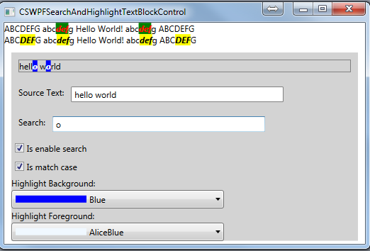

# Search and Highlight in TextBlock (CSWPFSearchAndHighlightTextBlockControl)
## Requires
- Visual Studio 2010
## License
- MS-LPL
## Technologies
- WPF
## Topics
- Controls
- TextBlock
## Updated
- 12/28/2011
## Description

<h1>Search and Highlight Keywords in TextBlock</h1>
<h2>Summary</h2>

The WPF code sample demonstrates how to search and highlight keywords in a TextBlock control.

The sample includes a custom user control &quot;SearchableTextControl&quot; and its search method is used to demonstrate how to highlight keywords using <a class="libraryLink" href="http://msdn.microsoft.com/en-US/library/System.Windows.Documents.Run.aspx" target="_blank" title="Auto generated link to System.Windows.Documents.Run">System.Windows.Documents.Run</a> and System.Windows.Documents.Incline.

<h2>Demo</h2>

Step1. Build this project in VS2010.

Step2. Run CSWPFSearchAndHighlightTextBlockControl.exe.

Step3. Input the source string after the &quot;Source Text&quot; TextBlock.

Step4. Type the keyword which you want to search in the source string after the &quot;Search&quot; TextBlock.

Step5. You can change the Background/Foreground colors by selecting the specific color&nbsp;in drop-list of combobox.

Code Logic

Step 1. Create a Visual C# WPF Application in Visual Studio 2010 and name it&nbsp;&nbsp;&nbsp;&nbsp;&nbsp;&nbsp;&nbsp;&nbsp; &quot;CSWPFSearchAndHighlightTextBlockControl&quot;.

Step 2. Create a class &quot;SearchableTextControl&quot;. Make sure it inherits from the &quot;Control&quot; class.

Step 3. The &quot;SearchableTextControl&quot; class uses DependencyProperty.Register to implement a render event bound to custom user control such as:

C#

Edit|Remove

csharp

<pre class="csharp">&nbsp;&nbsp;&nbsp;&nbsp;&nbsp;&nbsp;&nbsp;&nbsp;///&nbsp;&lt;summary&gt;&nbsp;
&nbsp;&nbsp;&nbsp;&nbsp;&nbsp;&nbsp;&nbsp;&nbsp;///&nbsp;SearchText&nbsp;sandbox&nbsp;which&nbsp;is&nbsp;used&nbsp;to&nbsp;get&nbsp;or&nbsp;set&nbsp;the&nbsp;value&nbsp;from&nbsp;a&nbsp;dependency&nbsp;property,&nbsp;
&nbsp;&nbsp;&nbsp;&nbsp;&nbsp;&nbsp;&nbsp;&nbsp;///&nbsp;if&nbsp;it&nbsp;gets&nbsp;a&nbsp;value,it&nbsp;should&nbsp;be&nbsp;forced&nbsp;to&nbsp;bind&nbsp;to&nbsp;a&nbsp;string&nbsp;type.&nbsp;
&nbsp;&nbsp;&nbsp;&nbsp;&nbsp;&nbsp;&nbsp;&nbsp;///&nbsp;&lt;/summary&gt;&nbsp;
&nbsp;&nbsp;&nbsp;&nbsp;&nbsp;&nbsp;&nbsp;&nbsp;public&nbsp;string&nbsp;SearchText&nbsp;
&nbsp;&nbsp;&nbsp;&nbsp;&nbsp;&nbsp;&nbsp;&nbsp;{&nbsp;
&nbsp;&nbsp;&nbsp;&nbsp;&nbsp;&nbsp;&nbsp;&nbsp;&nbsp;&nbsp;get&nbsp;{&nbsp;return&nbsp;(string)GetValue(SearchTextProperty);&nbsp;}&nbsp;
&nbsp;&nbsp;&nbsp;&nbsp;&nbsp;&nbsp;&nbsp;&nbsp;&nbsp;&nbsp;set&nbsp;{&nbsp;SetValue(SearchTextProperty,&nbsp;value);&nbsp;}&nbsp;
&nbsp;&nbsp;&nbsp;&nbsp;&nbsp;&nbsp;&nbsp;&nbsp;}&nbsp;
&nbsp;
&nbsp;&nbsp;&nbsp;&nbsp;&nbsp;&nbsp;&nbsp;&nbsp;///&nbsp;&lt;summary&gt;&nbsp;
&nbsp;&nbsp;&nbsp;&nbsp;&nbsp;&nbsp;&nbsp;&nbsp;///&nbsp;Real&nbsp;implementation&nbsp;about&nbsp;SearchTextProperty&nbsp;which&nbsp;registers&nbsp;a&nbsp;dependency&nbsp;property&nbsp;with&nbsp;&nbsp;
&nbsp;&nbsp;&nbsp;&nbsp;&nbsp;&nbsp;&nbsp;&nbsp;///&nbsp;the&nbsp;specified&nbsp;property&nbsp;name,&nbsp;property&nbsp;type,&nbsp;owner&nbsp;type,&nbsp;and&nbsp;property&nbsp;metadata.&nbsp;&nbsp;
&nbsp;&nbsp;&nbsp;&nbsp;&nbsp;&nbsp;&nbsp;&nbsp;///&nbsp;&lt;/summary&gt;&nbsp;
&nbsp;&nbsp;&nbsp;&nbsp;&nbsp;&nbsp;&nbsp;&nbsp;public&nbsp;static&nbsp;readonly&nbsp;DependencyProperty&nbsp;SearchTextProperty&nbsp;=&nbsp;
&nbsp;&nbsp;&nbsp;&nbsp;&nbsp;&nbsp;&nbsp;&nbsp;&nbsp;&nbsp;&nbsp;&nbsp;DependencyProperty.Register(&quot;SearchText&quot;,&nbsp;typeof(string),&nbsp;typeof(SearchableTextControl),&nbsp;&nbsp;
&nbsp;&nbsp;&nbsp;&nbsp;&nbsp;&nbsp;&nbsp;&nbsp;&nbsp;&nbsp;&nbsp;&nbsp;new&nbsp;UIPropertyMetadata(string.Empty,&nbsp;
&nbsp;&nbsp;&nbsp;&nbsp;&nbsp;&nbsp;&nbsp;&nbsp;&nbsp;&nbsp;&nbsp;&nbsp;&nbsp;&nbsp;UpdateControlCallBack));&nbsp;
&nbsp;
&nbsp;&nbsp;&nbsp;&nbsp;&nbsp;&nbsp;&nbsp;&nbsp;///&nbsp;&lt;summary&gt;&nbsp;
&nbsp;&nbsp;&nbsp;&nbsp;&nbsp;&nbsp;&nbsp;&nbsp;///&nbsp;Create&nbsp;a&nbsp;call&nbsp;back&nbsp;function&nbsp;which&nbsp;is&nbsp;used&nbsp;to&nbsp;invalidate&nbsp;the&nbsp;rendering&nbsp;of&nbsp;the&nbsp;element,&nbsp;&nbsp;
&nbsp;&nbsp;&nbsp;&nbsp;&nbsp;&nbsp;&nbsp;&nbsp;///&nbsp;and&nbsp;force&nbsp;a&nbsp;complete&nbsp;new&nbsp;layout&nbsp;pass.&nbsp;
&nbsp;&nbsp;&nbsp;&nbsp;&nbsp;&nbsp;&nbsp;&nbsp;///&nbsp;One&nbsp;such&nbsp;advanced&nbsp;scenario&nbsp;is&nbsp;if&nbsp;you&nbsp;are&nbsp;creating&nbsp;a&nbsp;PropertyChangedCallback&nbsp;for&nbsp;a&nbsp;&nbsp;
&nbsp;&nbsp;&nbsp;&nbsp;&nbsp;&nbsp;&nbsp;&nbsp;///&nbsp;dependency&nbsp;property&nbsp;that&nbsp;is&nbsp;not&nbsp;&nbsp;on&nbsp;a&nbsp;Freezable&nbsp;or&nbsp;FrameworkElement&nbsp;derived&nbsp;class&nbsp;that&nbsp;&nbsp;
&nbsp;&nbsp;&nbsp;&nbsp;&nbsp;&nbsp;&nbsp;&nbsp;///&nbsp;still&nbsp;influences&nbsp;the&nbsp;layout&nbsp;when&nbsp;it&nbsp;changes.&nbsp;
&nbsp;&nbsp;&nbsp;&nbsp;&nbsp;&nbsp;&nbsp;&nbsp;///&nbsp;&lt;/summary&gt;&nbsp;
&nbsp;&nbsp;&nbsp;&nbsp;&nbsp;&nbsp;&nbsp;&nbsp;private&nbsp;static&nbsp;void&nbsp;UpdateControlCallBack(DependencyObject&nbsp;d,&nbsp;DependencyPropertyChangedEventArgs&nbsp;e)&nbsp;
&nbsp;&nbsp;&nbsp;&nbsp;&nbsp;&nbsp;&nbsp;&nbsp;{&nbsp;
&nbsp;&nbsp;&nbsp;&nbsp;&nbsp;&nbsp;&nbsp;&nbsp;&nbsp;&nbsp;&nbsp;&nbsp;SearchableTextControl&nbsp;obj&nbsp;=&nbsp;d&nbsp;as&nbsp;SearchableTextControl;&nbsp;
&nbsp;&nbsp;&nbsp;&nbsp;&nbsp;&nbsp;&nbsp;&nbsp;&nbsp;&nbsp;&nbsp;&nbsp;obj.InvalidateVisual();&nbsp;
&nbsp;&nbsp;&nbsp;&nbsp;&nbsp;&nbsp;&nbsp;&nbsp;}</pre>

Step 4. In SearchableTextControl class, there is a override method &quot;OnRender&quot;, this method uses&nbsp;String.IndexOf and String.Substring methods to match the target string, and we associate&nbsp;those methods with TextBlock.Inlines.Add method in this
 sample. And in order to implement&nbsp;the behavior which looks like capture of regular expression with several times.

Step 5. The method &quot;GenerateRun&quot; which in class SearchableTextControl is used to alternate the&nbsp;colors of all matched strings. And it add some features by adding the FontStyle property and&nbsp;the FontWeight property. 

C#

Edit|Remove

csharp

<pre class="js">private&nbsp;Run&nbsp;GenerateRun(string&nbsp;searchedString,&nbsp;bool&nbsp;isHighlight)&nbsp;
&nbsp;&nbsp;&nbsp;&nbsp;&nbsp;&nbsp;&nbsp;&nbsp;{&nbsp;
&nbsp;&nbsp;&nbsp;&nbsp;&nbsp;&nbsp;&nbsp;&nbsp;&nbsp;&nbsp;&nbsp;if&nbsp;(!string.IsNullOrEmpty(searchedString))&nbsp;
&nbsp;&nbsp;&nbsp;&nbsp;&nbsp;&nbsp;&nbsp;&nbsp;&nbsp;&nbsp;&nbsp;&nbsp;{&nbsp;
&nbsp;&nbsp;&nbsp;&nbsp;&nbsp;&nbsp;&nbsp;&nbsp;&nbsp;&nbsp;&nbsp;&nbsp;&nbsp;&nbsp;&nbsp;&nbsp;Run&nbsp;run&nbsp;=&nbsp;new&nbsp;Run(searchedString)&nbsp;
&nbsp;&nbsp;&nbsp;&nbsp;&nbsp;&nbsp;&nbsp;&nbsp;&nbsp;&nbsp;&nbsp;&nbsp;&nbsp;&nbsp;&nbsp;&nbsp;{&nbsp;
&nbsp;&nbsp;&nbsp;&nbsp;&nbsp;&nbsp;&nbsp;&nbsp;&nbsp;&nbsp;&nbsp;&nbsp;&nbsp;&nbsp;&nbsp;&nbsp;&nbsp;&nbsp;&nbsp;&nbsp;Background&nbsp;=&nbsp;isHighlight&nbsp;?&nbsp;this.HighlightBackground&nbsp;:&nbsp;this.Background,&nbsp;
&nbsp;&nbsp;&nbsp;&nbsp;&nbsp;&nbsp;&nbsp;&nbsp;&nbsp;&nbsp;&nbsp;&nbsp;&nbsp;&nbsp;&nbsp;&nbsp;&nbsp;&nbsp;&nbsp;&nbsp;Foreground&nbsp;=&nbsp;isHighlight&nbsp;?&nbsp;this.HighlightForeground&nbsp;:&nbsp;this.Foreground,&nbsp;
&nbsp;
&nbsp;&nbsp;&nbsp;&nbsp;&nbsp;&nbsp;&nbsp;&nbsp;&nbsp;&nbsp;&nbsp;&nbsp;&nbsp;&nbsp;&nbsp;&nbsp;&nbsp;&nbsp;&nbsp;&nbsp;//&nbsp;Set&nbsp;the&nbsp;source&nbsp;text&nbsp;with&nbsp;the&nbsp;style&nbsp;which&nbsp;is&nbsp;Italic.&nbsp;
&nbsp;&nbsp;&nbsp;&nbsp;&nbsp;&nbsp;&nbsp;&nbsp;&nbsp;&nbsp;&nbsp;&nbsp;&nbsp;&nbsp;&nbsp;&nbsp;&nbsp;&nbsp;&nbsp;&nbsp;FontStyle&nbsp;=&nbsp;isHighlight&nbsp;?&nbsp;FontStyles.Italic&nbsp;:&nbsp;FontStyles.Normal,&nbsp;
&nbsp;
&nbsp;&nbsp;&nbsp;&nbsp;&nbsp;&nbsp;&nbsp;&nbsp;&nbsp;&nbsp;&nbsp;&nbsp;&nbsp;&nbsp;&nbsp;&nbsp;&nbsp;&nbsp;&nbsp;&nbsp;//&nbsp;Set&nbsp;the&nbsp;source&nbsp;text&nbsp;with&nbsp;the&nbsp;style&nbsp;which&nbsp;is&nbsp;Bold.&nbsp;
&nbsp;&nbsp;&nbsp;&nbsp;&nbsp;&nbsp;&nbsp;&nbsp;&nbsp;&nbsp;&nbsp;&nbsp;&nbsp;&nbsp;&nbsp;&nbsp;&nbsp;&nbsp;&nbsp;&nbsp;FontWeight&nbsp;=&nbsp;isHighlight&nbsp;?&nbsp;FontWeights.Bold&nbsp;:&nbsp;FontWeights.Normal,&nbsp;
&nbsp;&nbsp;&nbsp;&nbsp;&nbsp;&nbsp;&nbsp;&nbsp;&nbsp;&nbsp;&nbsp;&nbsp;&nbsp;&nbsp;&nbsp;&nbsp;};&nbsp;
&nbsp;&nbsp;&nbsp;&nbsp;&nbsp;&nbsp;&nbsp;&nbsp;&nbsp;&nbsp;&nbsp;&nbsp;&nbsp;&nbsp;&nbsp;&nbsp;return&nbsp;run;&nbsp;
&nbsp;&nbsp;&nbsp;&nbsp;&nbsp;&nbsp;&nbsp;&nbsp;&nbsp;&nbsp;&nbsp;&nbsp;}&nbsp;
&nbsp;&nbsp;&nbsp;&nbsp;&nbsp;&nbsp;&nbsp;&nbsp;&nbsp;&nbsp;return&nbsp;null;&nbsp;
&nbsp;&nbsp;&nbsp;&nbsp;&nbsp;&nbsp;&nbsp;&nbsp;}</pre>

<h2>References</h2>

Run Class  
<a href="http://msdn.microsoft.com/query/dev10.query?appId=Dev10IDEF1&l=EN-US&k=k(<a class="libraryLink" href="http://msdn.microsoft.com/en-US/library/SYSTEM.WINDOWS.DOCUMENTS.RUN.aspx" target="_blank" title="Auto generated link to SYSTEM.WINDOWS.DOCUMENTS.RUN">SYSTEM.WINDOWS.DOCUMENTS.RUN</a>);k(RUN);k(DevLang-CSHARP)&rd=true">http://msdn.microsoft.com/query/dev10.query?appId=Dev10IDEF1&amp;l=EN-US&amp;k=k(<a class="libraryLink" href="http://msdn.microsoft.com/en-US/library/SYSTEM.WINDOWS.DOCUMENTS.RUN.aspx" target="_blank" title="Auto generated link to SYSTEM.WINDOWS.DOCUMENTS.RUN">SYSTEM.WINDOWS.DOCUMENTS.RUN</a>);k(RUN);k(DevLang-CSHARP)&amp;rd=true</a>

DependencyProperty.OverrideMetadata Method 
<a href="http://msdn.microsoft.com/en-us/library/system.windows.dependencyproperty.overridemetadata.aspx">http://msdn.microsoft.com/en-us/library/system.windows.dependencyproperty.overridemetadata.aspx</a>

DependencyProperty.Register Method  
<a href="http://msdn.microsoft.com/en-us/library/system.windows.dependencyproperty.register.aspx">http://msdn.microsoft.com/en-us/library/system.windows.dependencyproperty.register.aspx</a>

FrameworkTemplate.FindName Method  
<a href="http://msdn.microsoft.com/query/dev10.query?appId=Dev10IDEF1&l=EN-US&k=k(<a class="libraryLink" href="http://msdn.microsoft.com/en-US/library/SYSTEM.WINDOWS.FRAMEWORKTEMPLATE.FINDNAME.aspx" target="_blank" title="Auto generated link to SYSTEM.WINDOWS.FRAMEWORKTEMPLATE.FINDNAME">SYSTEM.WINDOWS.FRAMEWORKTEMPLATE.FINDNAME</a>);k(TargetFrameworkMoniker-%22.NETFRAMEWORK%2cVERSION%3dV4.0%22);k(DevLang-CSHARP)&rd=true">http://msdn.microsoft.com/query/dev10.query?appId=Dev10IDEF1&amp;l=EN-US&amp;k=k(<a class="libraryLink" href="http://msdn.microsoft.com/en-US/library/SYSTEM.WINDOWS.FRAMEWORKTEMPLATE.FINDNAME.aspx" target="_blank" title="Auto generated link to SYSTEM.WINDOWS.FRAMEWORKTEMPLATE.FINDNAME">SYSTEM.WINDOWS.FRAMEWORKTEMPLATE.FINDNAME</a>);k(TargetFrameworkMoniker-%22.NETFRAMEWORK%2cVERSION%3dV4.0%22);k(DevLang-CSHARP)&amp;rd=true</a>

UIElement.InvalidateVisual Method  
<a href="http://msdn.microsoft.com/en-us/library/system.windows.uielement.invalidatevisual.aspx">http://msdn.microsoft.com/en-us/library/system.windows.uielement.invalidatevisual.aspx</a>

&nbsp;

&nbsp;

&nbsp;

