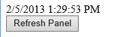
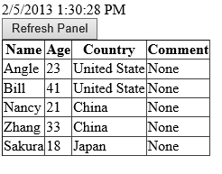

# Show spinner when loading large data in ASP.NET
## Requires
- Visual Studio 2012
## License
- Apache License, Version 2.0
## Technologies
- ASP.NET
## Topics
- Spinner
## Updated
- 06/13/2013
## Description

<h1>Show spinner image while retrieving huge amount of data (VBASPNETShowSpinnerImage)</h1>
<h2>Introduction</h2>

This project illustrates how to show spinner image while retrieving huge amount of data. As we know, handle a time-consuming operate always requiring a long time, we need to show a spinner image for better user experience.

<h2>Running the Sample</h2>

Step 1: Open the VBASPNETShowSpinnerImage.sln. 
Step 2: Expand the VBASPNETShowSpinnerImage web application and press Ctrl &#43; F5 to show the Default.aspx. 
Step 3: You will see the date time and a button on Default.aspx page, please click the button to retrieve data from XML file. 
&nbsp; 
 
Step 4: The application will show a popup for displaying spinner image, after several seconds, you can find the data is been shown in GridView control.

 

Step 5: Validation finished.

<h2>Using the Code</h2>

Step 1. Create a Visual Basic &quot;ASP.NET Empty Web Application&quot; in Visual Studio 2012. Name it as &quot;VBASPNETShowSpinnerImage&quot;.
 
Step 2. Add a web form in the root directory of application, name it as &quot;Default.aspx&quot;. 
Step 3. Add three folders, &quot;Image&quot;, &quot;UserControl&quot;, &quot;XMLFile&quot;. The &quot;Image&quot; folder includes image files that you want to show. The &quot;UserControl&quot; folder includes User Controls. The XML file includes XML files as
 the data source of GridView control of Default page. 
Step 4. The Default web form page includes an UpdatePanel control and an UpdateProgress control. UpdatePanel Control includes retrieve data button and GridView, the UpdateProgeress control includes PopupProgress user control. The HTML code of Default page will
 be like this:

HTML

Edit|Remove

html
<pre class="hidden">
&lt;head id=&quot;Head1&quot; runat=&quot;server&quot;&gt;
&nbsp;&nbsp;&nbsp;&nbsp;&nbsp;&nbsp;&nbsp; &lt;title&gt;&lt;/title&gt;
&nbsp;&nbsp;&nbsp;&nbsp;&nbsp;&nbsp;&nbsp;&nbsp;&nbsp;&nbsp;  
&nbsp;&nbsp;&nbsp;&nbsp;&nbsp;&nbsp;&nbsp;&nbsp;&lt;/head&gt;
&nbsp;&nbsp;&nbsp;&nbsp;&nbsp;&nbsp;&nbsp; &lt;body id=&quot;body1&quot; runat=&quot;server&quot; &gt;
&nbsp;&nbsp;&nbsp;&nbsp;&nbsp;&nbsp;&nbsp;&nbsp;&nbsp;&nbsp; &lt;form id=&quot;form1&quot; runat=&quot;server&quot;&gt;
&nbsp;&nbsp;&nbsp;&nbsp;&nbsp;&nbsp;&nbsp;&nbsp;&nbsp;&nbsp; 
&nbsp;&nbsp;&nbsp;&nbsp;&nbsp;&nbsp;&nbsp;&nbsp;&nbsp;&nbsp; 
&nbsp;&nbsp;&nbsp;&nbsp;&nbsp;&nbsp;&nbsp;&nbsp;&nbsp;&nbsp;&nbsp;&nbsp;&nbsp;&nbsp;&lt;asp:ToolkitScriptManager ID=&quot;ToolkitScriptManagerPopup&quot; runat=&quot;server&quot; /&gt;&nbsp;&nbsp;&nbsp;&nbsp;&nbsp; 
&nbsp;&nbsp;&nbsp;&nbsp;&nbsp;&nbsp;&nbsp;&nbsp;&nbsp;&nbsp;&nbsp;&nbsp;&nbsp;&nbsp;&lt;asp:UpdatePanel ID=&quot;updatePanel&quot; UpdateMode=&quot;Conditional&quot; runat=&quot;server&quot;&gt; 
&nbsp;&nbsp;&nbsp;&nbsp;&nbsp;&nbsp;&nbsp;&nbsp;&nbsp;&nbsp;&nbsp;&nbsp;&nbsp;&nbsp;&nbsp;&nbsp;&nbsp;&nbsp;&lt;ContentTemplate&gt;&nbsp; 
&nbsp;&nbsp;&nbsp;&nbsp;&nbsp;&nbsp;&nbsp;&nbsp;&nbsp;&nbsp;&nbsp;&nbsp;&nbsp;&nbsp;&nbsp;&nbsp;&nbsp;&nbsp;&nbsp;&nbsp;&nbsp;&nbsp;&lt;%=DateTime.Now.ToString() %&gt; 
&nbsp;&nbsp;&nbsp;&nbsp;&nbsp;&nbsp;&nbsp;&nbsp;&nbsp;&nbsp;&nbsp;&nbsp;&nbsp;&nbsp;&nbsp;&nbsp;&nbsp;&nbsp;&nbsp;&nbsp;&nbsp;&nbsp;  
&nbsp;&nbsp;&nbsp;&nbsp;&nbsp;&nbsp;&nbsp;&nbsp;&nbsp;&nbsp;&nbsp;&nbsp;&nbsp;&nbsp;&nbsp;&nbsp;&nbsp;&nbsp;&nbsp;&nbsp;&nbsp;&nbsp;&lt;asp:Button ID=&quot;btnRefresh&quot; runat=&quot;server&quot; Text=&quot;Refresh Panel&quot;
&nbsp;&nbsp;&nbsp;&nbsp;&nbsp;&nbsp;&nbsp;&nbsp;&nbsp;&nbsp;&nbsp;&nbsp;&nbsp;&nbsp;&nbsp;&nbsp;&nbsp;&nbsp;&nbsp;&nbsp;&nbsp;&nbsp; OnClick=&quot;btnRefresh_Click&quot;
&nbsp;&nbsp;&nbsp;&nbsp;&nbsp;&nbsp;&nbsp;&nbsp;&nbsp;&nbsp;&nbsp;&nbsp;&nbsp;&nbsp;&nbsp;&nbsp;&nbsp;&nbsp;&nbsp;&nbsp;&nbsp;&nbsp; OnClientClick=&quot;document.getElementById('PopupProgressUserControl_btnLink').click();&quot; /&gt; 
&nbsp;&nbsp;&nbsp;&nbsp;&nbsp;&nbsp;&nbsp;&nbsp;&nbsp;&nbsp;&nbsp;&nbsp;&nbsp;&nbsp;&nbsp;&nbsp;&nbsp;&nbsp;&nbsp;&nbsp;&nbsp;&nbsp;  
&nbsp;&nbsp;&nbsp;&nbsp;&nbsp;&nbsp;&nbsp;&nbsp;&nbsp;&nbsp;&nbsp;&nbsp;&nbsp;&nbsp;&nbsp;&nbsp;&nbsp;&nbsp;&nbsp;&nbsp;&nbsp;&nbsp;&lt;asp:GridView ID=&quot;gvwXMLData&quot; runat=&quot;server&quot;&gt;
&nbsp;&nbsp;&nbsp;&nbsp;&nbsp;&nbsp;&nbsp;&nbsp;&nbsp;&nbsp;&nbsp;&nbsp;&nbsp;&nbsp;&nbsp;&nbsp;&nbsp;&nbsp;&nbsp;&nbsp;&nbsp; &lt;/asp:GridView&gt;
&nbsp;&nbsp;&nbsp;&nbsp;&nbsp;&nbsp;&nbsp;&nbsp;&nbsp;&nbsp;&nbsp;&nbsp;&nbsp;&nbsp;&nbsp;&nbsp;&nbsp; &lt;/ContentTemplate&gt;&nbsp;&nbsp;&nbsp;&nbsp;&nbsp;&nbsp;&nbsp;&nbsp;&nbsp;&nbsp; 
&nbsp;&nbsp;&nbsp;&nbsp;&nbsp;&nbsp;&nbsp;&nbsp;&nbsp;&nbsp;&nbsp;&nbsp;&nbsp;&nbsp;&lt;/asp:UpdatePanel&gt; 
&nbsp;&nbsp;&nbsp;&nbsp;&nbsp;&nbsp;&nbsp;
&nbsp;&nbsp;&nbsp;&nbsp;&nbsp;&nbsp;&nbsp;&nbsp;
&nbsp;&nbsp;&nbsp;&nbsp;&nbsp;&nbsp;&nbsp;&nbsp;
&nbsp;&nbsp;&nbsp;&nbsp;&nbsp;&nbsp;&nbsp;&nbsp;&nbsp;&nbsp;&nbsp;&nbsp;&nbsp;&nbsp;&lt;asp:UpdateProgress ID=&quot;updateProgress&quot; runat=&quot;server&quot; AssociatedUpdatePanelID=&quot;updatePanel&quot;&gt; 
&nbsp;&nbsp;&nbsp;&nbsp;&nbsp;&nbsp;&nbsp;&nbsp;&nbsp;&nbsp;&nbsp;&nbsp;&nbsp;&nbsp;&nbsp;&nbsp;&nbsp;&nbsp;&lt;ProgressTemplate&gt; 
&nbsp;&nbsp;&nbsp;&nbsp;&nbsp;&nbsp;&nbsp;&nbsp;&nbsp;&nbsp;&nbsp;&nbsp;&nbsp;&nbsp;&nbsp;&nbsp;&nbsp;&nbsp;&nbsp;&nbsp;&nbsp;&nbsp;&lt;uc1:PopupProgress ID=&quot;PopupProgressUserControl&quot; runat=&quot;server&quot; /&gt;
&nbsp;&nbsp;&nbsp;&nbsp;&nbsp;&nbsp;&nbsp;&nbsp;&nbsp;&nbsp;&nbsp;&nbsp;&nbsp;&nbsp;&nbsp;&nbsp;&nbsp; &lt;/ProgressTemplate&gt;
&nbsp;&nbsp;&nbsp;&nbsp;&nbsp;&nbsp;&nbsp;&nbsp;&nbsp;&nbsp;&nbsp;&nbsp;&nbsp; &lt;/asp:UpdateProgress&gt;&nbsp;&nbsp;&nbsp;&nbsp;&nbsp;&nbsp;&nbsp;&nbsp;&nbsp;&nbsp; 
&nbsp;&nbsp;&nbsp;&nbsp;&nbsp;&nbsp;&nbsp;&nbsp;&nbsp;&nbsp;&nbsp;
&nbsp;&nbsp; 
&nbsp;&nbsp;&nbsp;&nbsp;&nbsp;&nbsp;&nbsp;&nbsp;&nbsp;&nbsp;&nbsp;&lt;/form&gt;
&nbsp;&nbsp;&nbsp;&nbsp;&nbsp;&nbsp;&nbsp; &lt;/body&gt;

</pre>
<pre id="codePreview" class="html">
&lt;head id=&quot;Head1&quot; runat=&quot;server&quot;&gt;
&nbsp;&nbsp;&nbsp;&nbsp;&nbsp;&nbsp;&nbsp; &lt;title&gt;&lt;/title&gt;
&nbsp;&nbsp;&nbsp;&nbsp;&nbsp;&nbsp;&nbsp;&nbsp;&nbsp;&nbsp;  
&nbsp;&nbsp;&nbsp;&nbsp;&nbsp;&nbsp;&nbsp;&nbsp;&lt;/head&gt;
&nbsp;&nbsp;&nbsp;&nbsp;&nbsp;&nbsp;&nbsp; &lt;body id=&quot;body1&quot; runat=&quot;server&quot; &gt;
&nbsp;&nbsp;&nbsp;&nbsp;&nbsp;&nbsp;&nbsp;&nbsp;&nbsp;&nbsp; &lt;form id=&quot;form1&quot; runat=&quot;server&quot;&gt;
&nbsp;&nbsp;&nbsp;&nbsp;&nbsp;&nbsp;&nbsp;&nbsp;&nbsp;&nbsp; 
&nbsp;&nbsp;&nbsp;&nbsp;&nbsp;&nbsp;&nbsp;&nbsp;&nbsp;&nbsp; 
&nbsp;&nbsp;&nbsp;&nbsp;&nbsp;&nbsp;&nbsp;&nbsp;&nbsp;&nbsp;&nbsp;&nbsp;&nbsp;&nbsp;&lt;asp:ToolkitScriptManager ID=&quot;ToolkitScriptManagerPopup&quot; runat=&quot;server&quot; /&gt;&nbsp;&nbsp;&nbsp;&nbsp;&nbsp; 
&nbsp;&nbsp;&nbsp;&nbsp;&nbsp;&nbsp;&nbsp;&nbsp;&nbsp;&nbsp;&nbsp;&nbsp;&nbsp;&nbsp;&lt;asp:UpdatePanel ID=&quot;updatePanel&quot; UpdateMode=&quot;Conditional&quot; runat=&quot;server&quot;&gt; 
&nbsp;&nbsp;&nbsp;&nbsp;&nbsp;&nbsp;&nbsp;&nbsp;&nbsp;&nbsp;&nbsp;&nbsp;&nbsp;&nbsp;&nbsp;&nbsp;&nbsp;&nbsp;&lt;ContentTemplate&gt;&nbsp; 
&nbsp;&nbsp;&nbsp;&nbsp;&nbsp;&nbsp;&nbsp;&nbsp;&nbsp;&nbsp;&nbsp;&nbsp;&nbsp;&nbsp;&nbsp;&nbsp;&nbsp;&nbsp;&nbsp;&nbsp;&nbsp;&nbsp;&lt;%=DateTime.Now.ToString() %&gt; 
&nbsp;&nbsp;&nbsp;&nbsp;&nbsp;&nbsp;&nbsp;&nbsp;&nbsp;&nbsp;&nbsp;&nbsp;&nbsp;&nbsp;&nbsp;&nbsp;&nbsp;&nbsp;&nbsp;&nbsp;&nbsp;&nbsp;  
&nbsp;&nbsp;&nbsp;&nbsp;&nbsp;&nbsp;&nbsp;&nbsp;&nbsp;&nbsp;&nbsp;&nbsp;&nbsp;&nbsp;&nbsp;&nbsp;&nbsp;&nbsp;&nbsp;&nbsp;&nbsp;&nbsp;&lt;asp:Button ID=&quot;btnRefresh&quot; runat=&quot;server&quot; Text=&quot;Refresh Panel&quot;
&nbsp;&nbsp;&nbsp;&nbsp;&nbsp;&nbsp;&nbsp;&nbsp;&nbsp;&nbsp;&nbsp;&nbsp;&nbsp;&nbsp;&nbsp;&nbsp;&nbsp;&nbsp;&nbsp;&nbsp;&nbsp;&nbsp; OnClick=&quot;btnRefresh_Click&quot;
&nbsp;&nbsp;&nbsp;&nbsp;&nbsp;&nbsp;&nbsp;&nbsp;&nbsp;&nbsp;&nbsp;&nbsp;&nbsp;&nbsp;&nbsp;&nbsp;&nbsp;&nbsp;&nbsp;&nbsp;&nbsp;&nbsp; OnClientClick=&quot;document.getElementById('PopupProgressUserControl_btnLink').click();&quot; /&gt; 
&nbsp;&nbsp;&nbsp;&nbsp;&nbsp;&nbsp;&nbsp;&nbsp;&nbsp;&nbsp;&nbsp;&nbsp;&nbsp;&nbsp;&nbsp;&nbsp;&nbsp;&nbsp;&nbsp;&nbsp;&nbsp;&nbsp;  
&nbsp;&nbsp;&nbsp;&nbsp;&nbsp;&nbsp;&nbsp;&nbsp;&nbsp;&nbsp;&nbsp;&nbsp;&nbsp;&nbsp;&nbsp;&nbsp;&nbsp;&nbsp;&nbsp;&nbsp;&nbsp;&nbsp;&lt;asp:GridView ID=&quot;gvwXMLData&quot; runat=&quot;server&quot;&gt;
&nbsp;&nbsp;&nbsp;&nbsp;&nbsp;&nbsp;&nbsp;&nbsp;&nbsp;&nbsp;&nbsp;&nbsp;&nbsp;&nbsp;&nbsp;&nbsp;&nbsp;&nbsp;&nbsp;&nbsp;&nbsp; &lt;/asp:GridView&gt;
&nbsp;&nbsp;&nbsp;&nbsp;&nbsp;&nbsp;&nbsp;&nbsp;&nbsp;&nbsp;&nbsp;&nbsp;&nbsp;&nbsp;&nbsp;&nbsp;&nbsp; &lt;/ContentTemplate&gt;&nbsp;&nbsp;&nbsp;&nbsp;&nbsp;&nbsp;&nbsp;&nbsp;&nbsp;&nbsp; 
&nbsp;&nbsp;&nbsp;&nbsp;&nbsp;&nbsp;&nbsp;&nbsp;&nbsp;&nbsp;&nbsp;&nbsp;&nbsp;&nbsp;&lt;/asp:UpdatePanel&gt; 
&nbsp;&nbsp;&nbsp;&nbsp;&nbsp;&nbsp;&nbsp;
&nbsp;&nbsp;&nbsp;&nbsp;&nbsp;&nbsp;&nbsp;&nbsp;
&nbsp;&nbsp;&nbsp;&nbsp;&nbsp;&nbsp;&nbsp;&nbsp;
&nbsp;&nbsp;&nbsp;&nbsp;&nbsp;&nbsp;&nbsp;&nbsp;&nbsp;&nbsp;&nbsp;&nbsp;&nbsp;&nbsp;&lt;asp:UpdateProgress ID=&quot;updateProgress&quot; runat=&quot;server&quot; AssociatedUpdatePanelID=&quot;updatePanel&quot;&gt; 
&nbsp;&nbsp;&nbsp;&nbsp;&nbsp;&nbsp;&nbsp;&nbsp;&nbsp;&nbsp;&nbsp;&nbsp;&nbsp;&nbsp;&nbsp;&nbsp;&nbsp;&nbsp;&lt;ProgressTemplate&gt; 
&nbsp;&nbsp;&nbsp;&nbsp;&nbsp;&nbsp;&nbsp;&nbsp;&nbsp;&nbsp;&nbsp;&nbsp;&nbsp;&nbsp;&nbsp;&nbsp;&nbsp;&nbsp;&nbsp;&nbsp;&nbsp;&nbsp;&lt;uc1:PopupProgress ID=&quot;PopupProgressUserControl&quot; runat=&quot;server&quot; /&gt;
&nbsp;&nbsp;&nbsp;&nbsp;&nbsp;&nbsp;&nbsp;&nbsp;&nbsp;&nbsp;&nbsp;&nbsp;&nbsp;&nbsp;&nbsp;&nbsp;&nbsp; &lt;/ProgressTemplate&gt;
&nbsp;&nbsp;&nbsp;&nbsp;&nbsp;&nbsp;&nbsp;&nbsp;&nbsp;&nbsp;&nbsp;&nbsp;&nbsp; &lt;/asp:UpdateProgress&gt;&nbsp;&nbsp;&nbsp;&nbsp;&nbsp;&nbsp;&nbsp;&nbsp;&nbsp;&nbsp; 
&nbsp;&nbsp;&nbsp;&nbsp;&nbsp;&nbsp;&nbsp;&nbsp;&nbsp;&nbsp;&nbsp;
&nbsp;&nbsp; 
&nbsp;&nbsp;&nbsp;&nbsp;&nbsp;&nbsp;&nbsp;&nbsp;&nbsp;&nbsp;&nbsp;&lt;/form&gt;
&nbsp;&nbsp;&nbsp;&nbsp;&nbsp;&nbsp;&nbsp; &lt;/body&gt;

</pre>

&nbsp;

Step 5.&nbsp; The btnRefresh Click event code in Default.aspx.vb file.

VB

Edit|Remove

vb
<pre class="hidden">
Protected Sub btnRefresh_Click(ByVal sender As Object, ByVal e As EventArgs) Handles btnRefresh.Click
&nbsp;&nbsp;&nbsp;&nbsp;&nbsp;&nbsp;&nbsp; ' Here we use Thread.Sleep() to suspends the thread for 10 seconds for imitating
&nbsp;&nbsp;&nbsp;&nbsp;&nbsp;&nbsp;&nbsp; ' an expensive, time-consuming operate of retrieve data. (Such as connect network
&nbsp;&nbsp;&nbsp;&nbsp;&nbsp;&nbsp;&nbsp; ' database to retrieve mass data.)
&nbsp;&nbsp;&nbsp;&nbsp;&nbsp;&nbsp;&nbsp; ' So in practice application, you can remove this line. 
&nbsp;&nbsp;&nbsp;&nbsp;&nbsp;&nbsp;&nbsp;&nbsp;System.Threading.Thread.Sleep(10000)

&nbsp;&nbsp;&nbsp;&nbsp;&nbsp;&nbsp;&nbsp; ' Retrieve data from XML file as sample data.
&nbsp;&nbsp;&nbsp;&nbsp;&nbsp;&nbsp;&nbsp; Dim xmlDocument As New XmlDocument()
&nbsp;&nbsp;&nbsp;&nbsp;&nbsp;&nbsp;&nbsp; xmlDocument.Load(AppDomain.CurrentDomain.BaseDirectory &#43; &quot;XMLFile/XMLData.xml&quot;)
&nbsp;&nbsp;&nbsp;&nbsp;&nbsp;&nbsp;&nbsp; Dim tabXML As New DataTable()
&nbsp;&nbsp;&nbsp;&nbsp;&nbsp;&nbsp;&nbsp; Dim columnName As New DataColumn(&quot;Name&quot;, Type.[GetType](&quot;System.String&quot;))
&nbsp;&nbsp;&nbsp;&nbsp;&nbsp;&nbsp;&nbsp; Dim columnAge As New DataColumn(&quot;Age&quot;, Type.[GetType](&quot;System.Int32&quot;))
&nbsp;&nbsp;&nbsp;&nbsp;&nbsp;&nbsp;&nbsp; Dim columnCountry As New DataColumn(&quot;Country&quot;, Type.[GetType](&quot;System.String&quot;))
&nbsp;&nbsp;&nbsp;&nbsp;&nbsp;&nbsp;&nbsp; Dim columnComment As New DataColumn(&quot;Comment&quot;, Type.[GetType](&quot;System.String&quot;))
&nbsp;&nbsp;&nbsp;&nbsp;&nbsp;&nbsp;&nbsp; tabXML.Columns.Add(columnName)
&nbsp;&nbsp;&nbsp;&nbsp;&nbsp;&nbsp;&nbsp; tabXML.Columns.Add(columnAge)
&nbsp;&nbsp;&nbsp;&nbsp;&nbsp;&nbsp;&nbsp; tabXML.Columns.Add(columnCountry)
&nbsp;&nbsp;&nbsp;&nbsp;&nbsp;&nbsp;&nbsp; tabXML.Columns.Add(columnComment)
&nbsp;&nbsp;&nbsp;&nbsp;&nbsp;&nbsp;&nbsp; Dim nodeList As XmlNodeList = xmlDocument.SelectNodes(&quot;Root/Person&quot;)
&nbsp;&nbsp;&nbsp;&nbsp;&nbsp;&nbsp;&nbsp; For Each node As XmlNode In nodeList
&nbsp;&nbsp;&nbsp;&nbsp;&nbsp;&nbsp;&nbsp;&nbsp;&nbsp;&nbsp;&nbsp; Dim row As DataRow = tabXML.NewRow()
&nbsp;&nbsp;&nbsp;&nbsp;&nbsp;&nbsp;&nbsp;&nbsp;&nbsp;&nbsp;&nbsp; row(&quot;Name&quot;) = node.SelectSingleNode(&quot;Name&quot;).InnerText
&nbsp;&nbsp;&nbsp;&nbsp;&nbsp;&nbsp;&nbsp;&nbsp;&nbsp;&nbsp;&nbsp; row(&quot;Age&quot;) = node.SelectSingleNode(&quot;Age&quot;).InnerText
&nbsp;&nbsp;&nbsp;&nbsp;&nbsp;&nbsp;&nbsp;&nbsp;&nbsp;&nbsp;&nbsp; row(&quot;Country&quot;) = node.SelectSingleNode(&quot;Country&quot;).InnerText
&nbsp;&nbsp;&nbsp;&nbsp;&nbsp;&nbsp;&nbsp;&nbsp;&nbsp;&nbsp;&nbsp; row(&quot;Comment&quot;) = node.SelectSingleNode(&quot;Comment&quot;).InnerText
&nbsp;&nbsp;&nbsp;&nbsp;&nbsp;&nbsp;&nbsp;&nbsp;&nbsp;&nbsp;&nbsp; tabXML.Rows.Add(row)
&nbsp;&nbsp;&nbsp;&nbsp;&nbsp;&nbsp;&nbsp; Next
&nbsp;&nbsp;&nbsp;&nbsp;&nbsp;&nbsp;&nbsp; gvwXMLData.DataSource = tabXML
&nbsp;&nbsp;&nbsp;&nbsp;&nbsp;&nbsp;&nbsp; gvwXMLData.DataBind()

&nbsp;&nbsp;&nbsp; End Sub

</pre>
<pre id="codePreview" class="vb">
Protected Sub btnRefresh_Click(ByVal sender As Object, ByVal e As EventArgs) Handles btnRefresh.Click
&nbsp;&nbsp;&nbsp;&nbsp;&nbsp;&nbsp;&nbsp; ' Here we use Thread.Sleep() to suspends the thread for 10 seconds for imitating
&nbsp;&nbsp;&nbsp;&nbsp;&nbsp;&nbsp;&nbsp; ' an expensive, time-consuming operate of retrieve data. (Such as connect network
&nbsp;&nbsp;&nbsp;&nbsp;&nbsp;&nbsp;&nbsp; ' database to retrieve mass data.)
&nbsp;&nbsp;&nbsp;&nbsp;&nbsp;&nbsp;&nbsp; ' So in practice application, you can remove this line. 
&nbsp;&nbsp;&nbsp;&nbsp;&nbsp;&nbsp;&nbsp;&nbsp;System.Threading.Thread.Sleep(10000)

&nbsp;&nbsp;&nbsp;&nbsp;&nbsp;&nbsp;&nbsp; ' Retrieve data from XML file as sample data.
&nbsp;&nbsp;&nbsp;&nbsp;&nbsp;&nbsp;&nbsp; Dim xmlDocument As New XmlDocument()
&nbsp;&nbsp;&nbsp;&nbsp;&nbsp;&nbsp;&nbsp; xmlDocument.Load(AppDomain.CurrentDomain.BaseDirectory &#43; &quot;XMLFile/XMLData.xml&quot;)
&nbsp;&nbsp;&nbsp;&nbsp;&nbsp;&nbsp;&nbsp; Dim tabXML As New DataTable()
&nbsp;&nbsp;&nbsp;&nbsp;&nbsp;&nbsp;&nbsp; Dim columnName As New DataColumn(&quot;Name&quot;, Type.[GetType](&quot;System.String&quot;))
&nbsp;&nbsp;&nbsp;&nbsp;&nbsp;&nbsp;&nbsp; Dim columnAge As New DataColumn(&quot;Age&quot;, Type.[GetType](&quot;System.Int32&quot;))
&nbsp;&nbsp;&nbsp;&nbsp;&nbsp;&nbsp;&nbsp; Dim columnCountry As New DataColumn(&quot;Country&quot;, Type.[GetType](&quot;System.String&quot;))
&nbsp;&nbsp;&nbsp;&nbsp;&nbsp;&nbsp;&nbsp; Dim columnComment As New DataColumn(&quot;Comment&quot;, Type.[GetType](&quot;System.String&quot;))
&nbsp;&nbsp;&nbsp;&nbsp;&nbsp;&nbsp;&nbsp; tabXML.Columns.Add(columnName)
&nbsp;&nbsp;&nbsp;&nbsp;&nbsp;&nbsp;&nbsp; tabXML.Columns.Add(columnAge)
&nbsp;&nbsp;&nbsp;&nbsp;&nbsp;&nbsp;&nbsp; tabXML.Columns.Add(columnCountry)
&nbsp;&nbsp;&nbsp;&nbsp;&nbsp;&nbsp;&nbsp; tabXML.Columns.Add(columnComment)
&nbsp;&nbsp;&nbsp;&nbsp;&nbsp;&nbsp;&nbsp; Dim nodeList As XmlNodeList = xmlDocument.SelectNodes(&quot;Root/Person&quot;)
&nbsp;&nbsp;&nbsp;&nbsp;&nbsp;&nbsp;&nbsp; For Each node As XmlNode In nodeList
&nbsp;&nbsp;&nbsp;&nbsp;&nbsp;&nbsp;&nbsp;&nbsp;&nbsp;&nbsp;&nbsp; Dim row As DataRow = tabXML.NewRow()
&nbsp;&nbsp;&nbsp;&nbsp;&nbsp;&nbsp;&nbsp;&nbsp;&nbsp;&nbsp;&nbsp; row(&quot;Name&quot;) = node.SelectSingleNode(&quot;Name&quot;).InnerText
&nbsp;&nbsp;&nbsp;&nbsp;&nbsp;&nbsp;&nbsp;&nbsp;&nbsp;&nbsp;&nbsp; row(&quot;Age&quot;) = node.SelectSingleNode(&quot;Age&quot;).InnerText
&nbsp;&nbsp;&nbsp;&nbsp;&nbsp;&nbsp;&nbsp;&nbsp;&nbsp;&nbsp;&nbsp; row(&quot;Country&quot;) = node.SelectSingleNode(&quot;Country&quot;).InnerText
&nbsp;&nbsp;&nbsp;&nbsp;&nbsp;&nbsp;&nbsp;&nbsp;&nbsp;&nbsp;&nbsp; row(&quot;Comment&quot;) = node.SelectSingleNode(&quot;Comment&quot;).InnerText
&nbsp;&nbsp;&nbsp;&nbsp;&nbsp;&nbsp;&nbsp;&nbsp;&nbsp;&nbsp;&nbsp; tabXML.Rows.Add(row)
&nbsp;&nbsp;&nbsp;&nbsp;&nbsp;&nbsp;&nbsp; Next
&nbsp;&nbsp;&nbsp;&nbsp;&nbsp;&nbsp;&nbsp; gvwXMLData.DataSource = tabXML
&nbsp;&nbsp;&nbsp;&nbsp;&nbsp;&nbsp;&nbsp; gvwXMLData.DataBind()

&nbsp;&nbsp;&nbsp; End Sub

</pre>

&nbsp;

Step 6. The PopupPregress user control is used to show a popup by ASP.NET Ajax control&nbsp;&nbsp;&nbsp;&nbsp;&nbsp;&nbsp;&nbsp;
ModalPopupExtender. The ModalPopupExtender can show a Panel when target button has been clicked. The HTML code of PopupProgress control as shown below:

HTML

Edit|Remove

html
<pre class="hidden">
&lt;%@ Register Assembly=&quot;AjaxControlToolkit&quot; Namespace=&quot;AjaxControlToolkit&quot; TagPrefix=&quot;asp&quot; %&gt; 
&nbsp;&nbsp;&nbsp;&nbsp;&nbsp;&nbsp;&nbsp;&nbsp;&lt;script language=&quot;javascript&quot; type=&quot;text/javascript&quot;&gt;&lt;% =LoadImage() %&gt;
&nbsp;&nbsp;&nbsp; 
&nbsp;&nbsp;&nbsp;&nbsp;&nbsp;&nbsp;&nbsp;&nbsp;// The JavaScript function can shows loaded image in Image control.
&nbsp;&nbsp;&nbsp;&nbsp;&nbsp;&nbsp;&nbsp; var imgStep = 0;
&nbsp;&nbsp;&nbsp;&nbsp;&nbsp;&nbsp;&nbsp; function slide()
&nbsp;&nbsp;&nbsp;&nbsp;&nbsp;&nbsp;&nbsp; {
&nbsp; var img = document.getElementById(&quot;PopupProgressUserControl_imgProgress&quot;); 
&nbsp;
&nbsp;&nbsp;img.title=imgMessage[imgStep];&nbsp; 
&nbsp;&nbsp;img.src=imgUrl[imgStep];
&nbsp;&nbsp;&nbsp;&nbsp;&nbsp;&nbsp;&nbsp; 
&nbsp;&nbsp;imgStep = (imgStep &lt; (imgUrl.length-1)) ? (imgStep &#43; 1) : 0;
&nbsp; (new Image()).src = imgUrl[imgStep];
&nbsp;&nbsp;&nbsp;&nbsp;&nbsp;&nbsp;&nbsp; }
&nbsp;&nbsp;&nbsp;&nbsp;&nbsp;&nbsp;&nbsp; setInterval(&quot;slide()&quot;,1000);

&nbsp;&nbsp;&nbsp;&nbsp;&nbsp;&nbsp;&nbsp; &lt;/script&gt;
&nbsp;&nbsp;&nbsp;&nbsp;&nbsp;&nbsp;&nbsp; &lt;asp:Panel ID=&quot;pnlProgress&quot; runat=&quot;server&quot; CssClass=&quot;modalpopup&quot;&gt; 
&nbsp;&nbsp;&nbsp;&nbsp;&nbsp;&nbsp;&nbsp;&nbsp;&nbsp;&nbsp;&nbsp;&nbsp;
 
&nbsp;&nbsp;&nbsp;&nbsp;&nbsp;&nbsp;&nbsp;&nbsp;&nbsp;&nbsp;&nbsp;&nbsp;&nbsp;&nbsp;&nbsp;&nbsp;
 
&nbsp;&nbsp;&nbsp;&nbsp;&nbsp;&nbsp;&nbsp;&nbsp;&nbsp;&nbsp;&nbsp;&nbsp;&nbsp;&nbsp;&nbsp;&nbsp;&nbsp;&nbsp;&nbsp;&nbsp;<table width="100%"> 
&nbsp;&nbsp;&nbsp;&nbsp;&nbsp;&nbsp;&nbsp;&nbsp;&nbsp;&nbsp;&nbsp;&nbsp;&nbsp;&nbsp;&nbsp;&nbsp;&nbsp;&nbsp;&nbsp;&nbsp;<tbody><tr> 
&nbsp;&nbsp;&nbsp;&nbsp;&nbsp;&nbsp;&nbsp;&nbsp;&nbsp;&nbsp;&nbsp;&nbsp;&nbsp;&nbsp;&nbsp;&nbsp;&nbsp;&nbsp;&nbsp;&nbsp;&nbsp;&nbsp;&nbsp;&nbsp;<td align="center">&nbsp;&nbsp;&nbsp;&nbsp;&nbsp;&nbsp;&nbsp;&nbsp;&nbsp;&nbsp;&nbsp;&nbsp;&nbsp;&nbsp;&nbsp;&nbsp;&nbsp;&nbsp;&nbsp;&nbsp;&nbsp;&nbsp;&nbsp;&nbsp;&lt;asp:Image
 ID=&quot;imgProgress&quot; runat=&quot;server&quot; style=&quot;filter: blendTrans(duration=0.618)&quot;&nbsp; ImageUrl=&quot;~/Image/0.jpg&quot;/&gt;&nbsp;&nbsp;&nbsp;&nbsp;&nbsp;&nbsp;&nbsp;&nbsp;&nbsp;&nbsp;&nbsp;&nbsp;&nbsp;&nbsp;&nbsp;&nbsp;&nbsp;&nbsp;&nbsp;&nbsp;&nbsp;&nbsp; &nbsp;&nbsp;&nbsp;&nbsp;&nbsp;&nbsp;&nbsp;&nbsp;&nbsp;&nbsp;&nbsp;&nbsp;&nbsp;&nbsp;&nbsp;&nbsp;&nbsp;&nbsp;&nbsp;&nbsp;&nbsp;&nbsp;&nbsp;&nbsp;</td> 
&nbsp;&nbsp;&nbsp;&nbsp;&nbsp;&nbsp;&nbsp;&nbsp;&nbsp;&nbsp;&nbsp;&nbsp;&nbsp;&nbsp;&nbsp;&nbsp;&nbsp;&nbsp;&nbsp;&nbsp;</tr> 
&nbsp;&nbsp;&nbsp;&nbsp;&nbsp;&nbsp;&nbsp;&nbsp;&nbsp;&nbsp;&nbsp;&nbsp;&nbsp;&nbsp;&nbsp;&nbsp;&nbsp;&nbsp;&nbsp;&nbsp;<tr> 
&nbsp;&nbsp;&nbsp;&nbsp;&nbsp;&nbsp;&nbsp;&nbsp;&nbsp;&nbsp;&nbsp;&nbsp;&nbsp;&nbsp;&nbsp;&nbsp;&nbsp;&nbsp;&nbsp;&nbsp;&nbsp;&nbsp;&nbsp;&nbsp;<td>&nbsp;&nbsp;&nbsp;&nbsp;&nbsp;&nbsp;&nbsp;&nbsp;&nbsp;&nbsp;&nbsp;&nbsp;&nbsp;&nbsp;&nbsp;&nbsp;&nbsp;&nbsp;&nbsp;
 &nbsp;&nbsp;&nbsp;&nbsp;&lt;asp:Button ID=&quot;btnCancel&quot; runat=&quot;server&quot; Text=&quot;Cancel&quot; /&gt;</td>
&nbsp;&nbsp;&nbsp;&nbsp;&nbsp;&nbsp;&nbsp;&nbsp;&nbsp;&nbsp;&nbsp;&nbsp;&nbsp;&nbsp;&nbsp;&nbsp;&nbsp;&nbsp;&nbsp; </tr>
&nbsp;&nbsp;&nbsp;&nbsp;&nbsp;&nbsp;&nbsp;&nbsp;&nbsp;&nbsp;&nbsp;&nbsp;&nbsp;&nbsp;&nbsp;&nbsp;&nbsp;&nbsp;&nbsp; </tbody></table> 
&nbsp;&nbsp;&nbsp;&nbsp;&nbsp;&nbsp;&nbsp;&nbsp;&nbsp;&nbsp;&nbsp;&nbsp;&nbsp;&nbsp;&nbsp;
 
&nbsp;&nbsp;&nbsp;&nbsp;&nbsp;&nbsp;&nbsp;&nbsp;&nbsp;&nbsp;&nbsp;
 
&nbsp;&nbsp;&nbsp;&nbsp;&nbsp;&nbsp;&nbsp;&nbsp;&lt;/asp:Panel&gt; 
&nbsp;&nbsp;&nbsp;&nbsp;&nbsp;&nbsp;&nbsp;&nbsp;&lt;asp:LinkButton ID=&quot;btnLink&quot; runat=&quot;server&quot; Text=&quot;&quot;&gt;&lt;/asp:LinkButton&gt; 
&nbsp;&nbsp;&nbsp;&nbsp;&nbsp;&nbsp;&nbsp;&nbsp;&lt;asp:ModalPopupExtender ID=&quot;mpeProgress&quot; runat=&quot;server&quot; TargetControlID=&quot;btnLink&quot;
&nbsp;&nbsp;&nbsp;&nbsp;&nbsp;&nbsp;&nbsp;&nbsp;&nbsp;&nbsp;&nbsp; X=&quot;500&quot; Y=&quot;0&quot; PopupControlID=&quot;pnlProgress&quot; BackgroundCssClass=&quot;modalBackground&quot; DropShadow=&quot;true&quot;&nbsp; CancelControlID=&quot;btnCancel&quot; &gt; 
&nbsp;&nbsp;&nbsp;&nbsp;&nbsp;&nbsp;&nbsp;&nbsp;&lt;/asp:ModalPopupExtender&gt;

</pre>
<pre id="codePreview" class="html">
&lt;%@ Register Assembly=&quot;AjaxControlToolkit&quot; Namespace=&quot;AjaxControlToolkit&quot; TagPrefix=&quot;asp&quot; %&gt; 
&nbsp;&nbsp;&nbsp;&nbsp;&nbsp;&nbsp;&nbsp;&nbsp;&lt;script language=&quot;javascript&quot; type=&quot;text/javascript&quot;&gt;&lt;% =LoadImage() %&gt;
&nbsp;&nbsp;&nbsp; 
&nbsp;&nbsp;&nbsp;&nbsp;&nbsp;&nbsp;&nbsp;&nbsp;// The JavaScript function can shows loaded image in Image control.
&nbsp;&nbsp;&nbsp;&nbsp;&nbsp;&nbsp;&nbsp; var imgStep = 0;
&nbsp;&nbsp;&nbsp;&nbsp;&nbsp;&nbsp;&nbsp; function slide()
&nbsp;&nbsp;&nbsp;&nbsp;&nbsp;&nbsp;&nbsp; {
&nbsp; var img = document.getElementById(&quot;PopupProgressUserControl_imgProgress&quot;); 
&nbsp;
&nbsp;&nbsp;img.title=imgMessage[imgStep];&nbsp; 
&nbsp;&nbsp;img.src=imgUrl[imgStep];
&nbsp;&nbsp;&nbsp;&nbsp;&nbsp;&nbsp;&nbsp; 
&nbsp;&nbsp;imgStep = (imgStep &lt; (imgUrl.length-1)) ? (imgStep &#43; 1) : 0;
&nbsp; (new Image()).src = imgUrl[imgStep];
&nbsp;&nbsp;&nbsp;&nbsp;&nbsp;&nbsp;&nbsp; }
&nbsp;&nbsp;&nbsp;&nbsp;&nbsp;&nbsp;&nbsp; setInterval(&quot;slide()&quot;,1000);

&nbsp;&nbsp;&nbsp;&nbsp;&nbsp;&nbsp;&nbsp; &lt;/script&gt;
&nbsp;&nbsp;&nbsp;&nbsp;&nbsp;&nbsp;&nbsp; &lt;asp:Panel ID=&quot;pnlProgress&quot; runat=&quot;server&quot; CssClass=&quot;modalpopup&quot;&gt; 
&nbsp;&nbsp;&nbsp;&nbsp;&nbsp;&nbsp;&nbsp;&nbsp;&nbsp;&nbsp;&nbsp;&nbsp;
 
&nbsp;&nbsp;&nbsp;&nbsp;&nbsp;&nbsp;&nbsp;&nbsp;&nbsp;&nbsp;&nbsp;&nbsp;&nbsp;&nbsp;&nbsp;&nbsp;
 
&nbsp;&nbsp;&nbsp;&nbsp;&nbsp;&nbsp;&nbsp;&nbsp;&nbsp;&nbsp;&nbsp;&nbsp;&nbsp;&nbsp;&nbsp;&nbsp;&nbsp;&nbsp;&nbsp;&nbsp;<table width="100%"> 
&nbsp;&nbsp;&nbsp;&nbsp;&nbsp;&nbsp;&nbsp;&nbsp;&nbsp;&nbsp;&nbsp;&nbsp;&nbsp;&nbsp;&nbsp;&nbsp;&nbsp;&nbsp;&nbsp;&nbsp;<tbody><tr> 
&nbsp;&nbsp;&nbsp;&nbsp;&nbsp;&nbsp;&nbsp;&nbsp;&nbsp;&nbsp;&nbsp;&nbsp;&nbsp;&nbsp;&nbsp;&nbsp;&nbsp;&nbsp;&nbsp;&nbsp;&nbsp;&nbsp;&nbsp;&nbsp;<td align="center">&nbsp;&nbsp;&nbsp;&nbsp;&nbsp;&nbsp;&nbsp;&nbsp;&nbsp;&nbsp;&nbsp;&nbsp;&nbsp;&nbsp;&nbsp;&nbsp;&nbsp;&nbsp;&nbsp;&nbsp;&nbsp;&nbsp;&nbsp;&nbsp;&lt;asp:Image
 ID=&quot;imgProgress&quot; runat=&quot;server&quot; style=&quot;filter: blendTrans(duration=0.618)&quot;&nbsp; ImageUrl=&quot;~/Image/0.jpg&quot;/&gt;&nbsp;&nbsp;&nbsp;&nbsp;&nbsp;&nbsp;&nbsp;&nbsp;&nbsp;&nbsp;&nbsp;&nbsp;&nbsp;&nbsp;&nbsp;&nbsp;&nbsp;&nbsp;&nbsp;&nbsp;&nbsp;&nbsp; &nbsp;&nbsp;&nbsp;&nbsp;&nbsp;&nbsp;&nbsp;&nbsp;&nbsp;&nbsp;&nbsp;&nbsp;&nbsp;&nbsp;&nbsp;&nbsp;&nbsp;&nbsp;&nbsp;&nbsp;&nbsp;&nbsp;&nbsp;&nbsp;</td> 
&nbsp;&nbsp;&nbsp;&nbsp;&nbsp;&nbsp;&nbsp;&nbsp;&nbsp;&nbsp;&nbsp;&nbsp;&nbsp;&nbsp;&nbsp;&nbsp;&nbsp;&nbsp;&nbsp;&nbsp;</tr> 
&nbsp;&nbsp;&nbsp;&nbsp;&nbsp;&nbsp;&nbsp;&nbsp;&nbsp;&nbsp;&nbsp;&nbsp;&nbsp;&nbsp;&nbsp;&nbsp;&nbsp;&nbsp;&nbsp;&nbsp;<tr> 
&nbsp;&nbsp;&nbsp;&nbsp;&nbsp;&nbsp;&nbsp;&nbsp;&nbsp;&nbsp;&nbsp;&nbsp;&nbsp;&nbsp;&nbsp;&nbsp;&nbsp;&nbsp;&nbsp;&nbsp;&nbsp;&nbsp;&nbsp;&nbsp;<td>&nbsp;&nbsp;&nbsp;&nbsp;&nbsp;&nbsp;&nbsp;&nbsp;&nbsp;&nbsp;&nbsp;&nbsp;&nbsp;&nbsp;&nbsp;&nbsp;&nbsp;&nbsp;&nbsp;
 &nbsp;&nbsp;&nbsp;&nbsp;&lt;asp:Button ID=&quot;btnCancel&quot; runat=&quot;server&quot; Text=&quot;Cancel&quot; /&gt;</td>
&nbsp;&nbsp;&nbsp;&nbsp;&nbsp;&nbsp;&nbsp;&nbsp;&nbsp;&nbsp;&nbsp;&nbsp;&nbsp;&nbsp;&nbsp;&nbsp;&nbsp;&nbsp;&nbsp; </tr>
&nbsp;&nbsp;&nbsp;&nbsp;&nbsp;&nbsp;&nbsp;&nbsp;&nbsp;&nbsp;&nbsp;&nbsp;&nbsp;&nbsp;&nbsp;&nbsp;&nbsp;&nbsp;&nbsp; </tbody></table> 
&nbsp;&nbsp;&nbsp;&nbsp;&nbsp;&nbsp;&nbsp;&nbsp;&nbsp;&nbsp;&nbsp;&nbsp;&nbsp;&nbsp;&nbsp;
 
&nbsp;&nbsp;&nbsp;&nbsp;&nbsp;&nbsp;&nbsp;&nbsp;&nbsp;&nbsp;&nbsp;
 
&nbsp;&nbsp;&nbsp;&nbsp;&nbsp;&nbsp;&nbsp;&nbsp;&lt;/asp:Panel&gt; 
&nbsp;&nbsp;&nbsp;&nbsp;&nbsp;&nbsp;&nbsp;&nbsp;&lt;asp:LinkButton ID=&quot;btnLink&quot; runat=&quot;server&quot; Text=&quot;&quot;&gt;&lt;/asp:LinkButton&gt; 
&nbsp;&nbsp;&nbsp;&nbsp;&nbsp;&nbsp;&nbsp;&nbsp;&lt;asp:ModalPopupExtender ID=&quot;mpeProgress&quot; runat=&quot;server&quot; TargetControlID=&quot;btnLink&quot;
&nbsp;&nbsp;&nbsp;&nbsp;&nbsp;&nbsp;&nbsp;&nbsp;&nbsp;&nbsp;&nbsp; X=&quot;500&quot; Y=&quot;0&quot; PopupControlID=&quot;pnlProgress&quot; BackgroundCssClass=&quot;modalBackground&quot; DropShadow=&quot;true&quot;&nbsp; CancelControlID=&quot;btnCancel&quot; &gt; 
&nbsp;&nbsp;&nbsp;&nbsp;&nbsp;&nbsp;&nbsp;&nbsp;&lt;/asp:ModalPopupExtender&gt;

</pre>

&nbsp;

The PopupProgress.ascx.vb file:

VB

Edit|Remove

vb
<pre class="hidden">
''' &lt;summary&gt;
&nbsp;&nbsp;&nbsp; ''' This method is used to load images of customize files and 
&nbsp;&nbsp;&nbsp;&nbsp;''' register JavaScript code on User Control page.
&nbsp;&nbsp;&nbsp; ''' &lt;/summary&gt;
&nbsp;&nbsp;&nbsp; ''' &lt;returns&gt;&lt;/returns&gt;
&nbsp;&nbsp;&nbsp; Public Function LoadImage() As String
&nbsp;&nbsp;&nbsp;&nbsp;&nbsp;&nbsp;&nbsp; Dim strbScript As New StringBuilder()
&nbsp;&nbsp;&nbsp;&nbsp;&nbsp;&nbsp;&nbsp; Dim imageUrl As String = &quot;&quot;

&nbsp;&nbsp;&nbsp;&nbsp;&nbsp;&nbsp;&nbsp; strbScript.Append(&quot;var imgMessage = new Array();&quot;)
&nbsp;&nbsp;&nbsp;&nbsp;&nbsp;&nbsp;&nbsp; strbScript.Append(&quot;var imgUrl = new Array();&quot;)
&nbsp;&nbsp;&nbsp;&nbsp;&nbsp;&nbsp;&nbsp; Dim strs As String() = New String(6) {}
&nbsp;&nbsp;&nbsp;&nbsp;&nbsp;&nbsp;&nbsp; strs(0) = &quot;Image/0.jpg&quot;
&nbsp;&nbsp;&nbsp;&nbsp;&nbsp;&nbsp;&nbsp; strs(1) = &quot;Image/1.jpg&quot;
&nbsp;&nbsp;&nbsp;&nbsp;&nbsp;&nbsp;&nbsp; strs(2) = &quot;Image/2.jpg&quot;
&nbsp;&nbsp;&nbsp;&nbsp;&nbsp;&nbsp;&nbsp; strs(3) = &quot;Image/3.jpg&quot;
&nbsp;&nbsp;&nbsp;&nbsp;&nbsp;&nbsp;&nbsp; strs(4) = &quot;Image/4.jpg&quot;
&nbsp;&nbsp;&nbsp;&nbsp;&nbsp;&nbsp;&nbsp; strs(5) = &quot;Image/5.jpg&quot;
&nbsp;&nbsp;&nbsp;&nbsp;&nbsp;&nbsp;&nbsp; strs(6) = &quot;Image/6.jpg&quot;
&nbsp;&nbsp;&nbsp;&nbsp;&nbsp;&nbsp;&nbsp; For i As Integer = 0 To strs.Length - 1
&nbsp;&nbsp; &nbsp;&nbsp;&nbsp;&nbsp;&nbsp;&nbsp;&nbsp;&nbsp;&nbsp;imageUrl = strs(i)

&nbsp;&nbsp;&nbsp;&nbsp;&nbsp;&nbsp;&nbsp;&nbsp;&nbsp;&nbsp;&nbsp; strbScript.Append([String].Format(&quot;imgUrl[{0}] = '{1}';&quot;, i, imageUrl))
&nbsp;&nbsp;&nbsp;&nbsp;&nbsp;&nbsp;&nbsp;&nbsp;&nbsp;&nbsp;&nbsp; strbScript.Append([String].Format(&quot;imgMessage[{0}] = '{1}';&quot;, i, imageUrl.Substring(imageUrl.LastIndexOf(&quot;.&quot;c) - 1)))
&nbsp;&nbsp;&nbsp;&nbsp;&nbsp;&nbsp;&nbsp; Next
&nbsp;&nbsp;&nbsp;&nbsp;&nbsp;&nbsp;&nbsp; strbScript.Append(&quot;for (var i=0; i&lt;imgUrl.length; i&#43;&#43;)&quot;)
&nbsp;&nbsp;&nbsp;&nbsp;&nbsp;&nbsp;&nbsp; strbScript.Append(&quot;{ (new Image()).src = imgUrl[i]; }&quot;)
&nbsp;&nbsp;&nbsp;&nbsp;&nbsp;&nbsp;&nbsp; Return strbScript.ToString()
&nbsp;&nbsp;&nbsp; End Function

</pre>
<pre id="codePreview" class="vb">
''' &lt;summary&gt;
&nbsp;&nbsp;&nbsp; ''' This method is used to load images of customize files and 
&nbsp;&nbsp;&nbsp;&nbsp;''' register JavaScript code on User Control page.
&nbsp;&nbsp;&nbsp; ''' &lt;/summary&gt;
&nbsp;&nbsp;&nbsp; ''' &lt;returns&gt;&lt;/returns&gt;
&nbsp;&nbsp;&nbsp; Public Function LoadImage() As String
&nbsp;&nbsp;&nbsp;&nbsp;&nbsp;&nbsp;&nbsp; Dim strbScript As New StringBuilder()
&nbsp;&nbsp;&nbsp;&nbsp;&nbsp;&nbsp;&nbsp; Dim imageUrl As String = &quot;&quot;

&nbsp;&nbsp;&nbsp;&nbsp;&nbsp;&nbsp;&nbsp; strbScript.Append(&quot;var imgMessage = new Array();&quot;)
&nbsp;&nbsp;&nbsp;&nbsp;&nbsp;&nbsp;&nbsp; strbScript.Append(&quot;var imgUrl = new Array();&quot;)
&nbsp;&nbsp;&nbsp;&nbsp;&nbsp;&nbsp;&nbsp; Dim strs As String() = New String(6) {}
&nbsp;&nbsp;&nbsp;&nbsp;&nbsp;&nbsp;&nbsp; strs(0) = &quot;Image/0.jpg&quot;
&nbsp;&nbsp;&nbsp;&nbsp;&nbsp;&nbsp;&nbsp; strs(1) = &quot;Image/1.jpg&quot;
&nbsp;&nbsp;&nbsp;&nbsp;&nbsp;&nbsp;&nbsp; strs(2) = &quot;Image/2.jpg&quot;
&nbsp;&nbsp;&nbsp;&nbsp;&nbsp;&nbsp;&nbsp; strs(3) = &quot;Image/3.jpg&quot;
&nbsp;&nbsp;&nbsp;&nbsp;&nbsp;&nbsp;&nbsp; strs(4) = &quot;Image/4.jpg&quot;
&nbsp;&nbsp;&nbsp;&nbsp;&nbsp;&nbsp;&nbsp; strs(5) = &quot;Image/5.jpg&quot;
&nbsp;&nbsp;&nbsp;&nbsp;&nbsp;&nbsp;&nbsp; strs(6) = &quot;Image/6.jpg&quot;
&nbsp;&nbsp;&nbsp;&nbsp;&nbsp;&nbsp;&nbsp; For i As Integer = 0 To strs.Length - 1
&nbsp;&nbsp; &nbsp;&nbsp;&nbsp;&nbsp;&nbsp;&nbsp;&nbsp;&nbsp;&nbsp;imageUrl = strs(i)

&nbsp;&nbsp;&nbsp;&nbsp;&nbsp;&nbsp;&nbsp;&nbsp;&nbsp;&nbsp;&nbsp; strbScript.Append([String].Format(&quot;imgUrl[{0}] = '{1}';&quot;, i, imageUrl))
&nbsp;&nbsp;&nbsp;&nbsp;&nbsp;&nbsp;&nbsp;&nbsp;&nbsp;&nbsp;&nbsp; strbScript.Append([String].Format(&quot;imgMessage[{0}] = '{1}';&quot;, i, imageUrl.Substring(imageUrl.LastIndexOf(&quot;.&quot;c) - 1)))
&nbsp;&nbsp;&nbsp;&nbsp;&nbsp;&nbsp;&nbsp; Next
&nbsp;&nbsp;&nbsp;&nbsp;&nbsp;&nbsp;&nbsp; strbScript.Append(&quot;for (var i=0; i&lt;imgUrl.length; i&#43;&#43;)&quot;)
&nbsp;&nbsp;&nbsp;&nbsp;&nbsp;&nbsp;&nbsp; strbScript.Append(&quot;{ (new Image()).src = imgUrl[i]; }&quot;)
&nbsp;&nbsp;&nbsp;&nbsp;&nbsp;&nbsp;&nbsp; Return strbScript.ToString()
&nbsp;&nbsp;&nbsp; End Function

</pre>

&nbsp;

Step 7. Build the application and you can debug it.

<h2>More Information</h2>

MSDN: ModalPopupExtender experiences 
<a href="http://weblogs.asp.net/jgonzalez/archive/2007/03/02/modalpopupextender-experiences.aspx">http://weblogs.asp.net/jgonzalez/archive/2007/03/02/modalpopupextender-experiences.aspx</a> 
MSDN: ASP.NET User Controls 
<a href="http://msdn.microsoft.com/en-us/library/y6wb1a0e.aspx">http://msdn.microsoft.com/en-us/library/y6wb1a0e.aspx</a> 
MSDN: XmlDocument Class 
<a href="http://msdn.microsoft.com/en-us/library/system.xml.xmldocument.aspx">http://msdn.microsoft.com/en-us/library/system.xml.xmldocument.aspx</a> 
 

